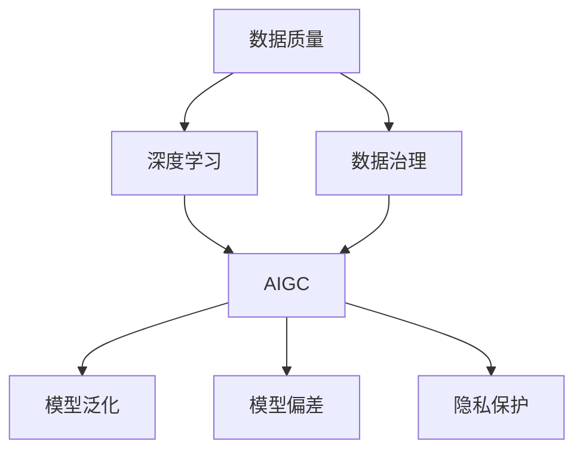
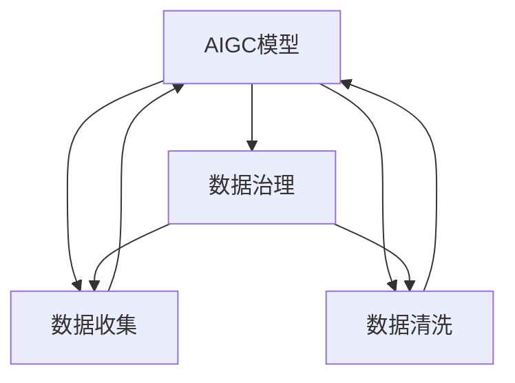
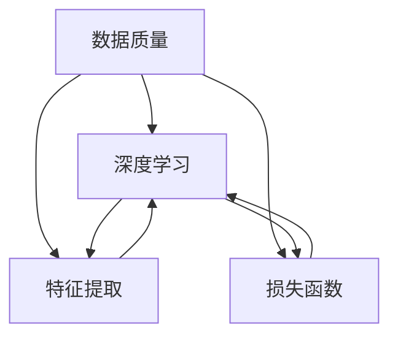
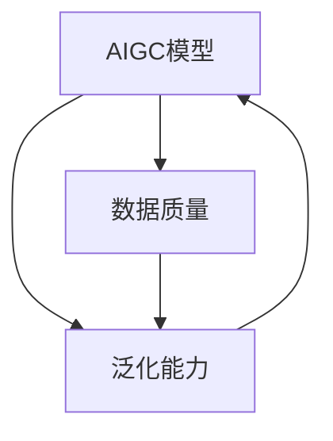
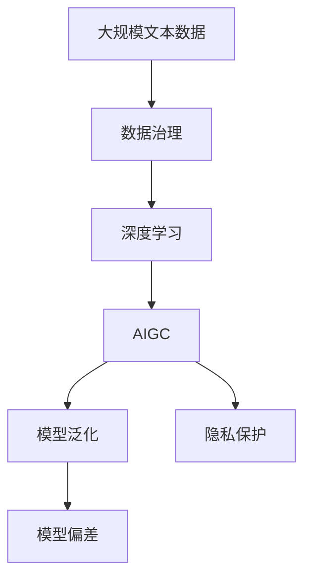

                 

# 生成式AIGC是金矿还是泡沫：造成幻觉的核心问题是脏数据

> 关键词：生成式AI, AIGC, 数据质量, 深度学习, 数据治理, 模型泛化, 偏差消除, 隐私保护

## 1. 背景介绍

### 1.1 问题由来
随着深度学习技术的飞速发展，生成式人工智能（Generative AI，简称AIGC）已经成为科技界的焦点话题。从图像生成到文本创作，从视频编辑到音乐合成，AIGC技术在多个领域展现出了前所未有的潜力。GPT-3、DALL-E等生成式模型的出现，进一步推动了AIGC技术的商业化应用，引发了广泛的关注和热议。

然而，尽管AIGC技术已经取得了显著进展，但在实际应用中，依然面临着一系列挑战。其中，数据质量问题是导致AIGC模型产生幻觉的核心因素。数据质量不高，不仅会影响模型的泛化能力，还可能导致模型输出产生偏差、有害信息等负面影响，进而威胁到模型的实用性。

数据质量问题，是指数据集中存在大量噪音、错误、异常、冗余等“脏数据”，这些数据不仅无法为模型提供有益的信号，反而可能误导模型学习错误的特征。在AIGC模型训练过程中，这些脏数据的存在，会导致模型对真实数据特征的误判，从而产生错误的生成结果。

### 1.2 问题核心关键点
数据质量问题对AIGC模型的影响，主要体现在以下几个方面：

1. **数据偏差**：数据集中存在各类偏差，如性别、种族、地域等，这些偏差可能导致模型学习到错误的特征，生成结果产生歧视性或误导性信息。
2. **数据噪声**：数据集中存在各种噪音、错误和异常，如错误拼写、数据格式不规范、缺失值等，这些都会干扰模型学习真实特征，生成结果的准确性降低。
3. **数据冗余**：数据集中存在大量重复、相似的数据，这些数据可能使模型过于关注某些重复特征，而忽略了其他重要的真实特征，降低模型的泛化能力。
4. **数据缺失**：数据集中存在缺失值，这会导致模型无法获取完整的信息，生成结果不完整或不准确。
5. **数据多样性不足**：数据集中缺乏多样性，可能使模型无法捕捉到真实的复杂性和多样性，生成结果过于单一、刻板。

### 1.3 问题研究意义
研究AIGC模型中的数据质量问题，对于提升AIGC技术的实用性和可靠性，确保其对社会的积极影响，具有重要意义：

1. **提升模型泛化能力**：通过提升数据质量，可以减少模型在训练和测试中的偏差，提升模型的泛化能力，使其在多种场景下都能表现稳定。
2. **消除模型偏差**：高质量的数据集能够帮助模型学习到更加公平、公正的特征，避免生成有害、歧视性信息。
3. **提高生成准确性**：减少数据中的噪声和异常，可以提高模型生成的准确性，减少错误和误导性输出。
4. **增强模型实用性**：高质量的数据集是训练高质量AIGC模型的基础，对于实际应用场景中的需求响应，具有重要价值。
5. **保护数据隐私**：在数据治理中，对数据质量的控制，可以保护用户隐私，避免敏感信息被滥用。

## 2. 核心概念与联系

### 2.1 核心概念概述

为了更好地理解AIGC模型中的数据质量问题，本节将介绍几个密切相关的核心概念：

1. **AIGC**：生成式人工智能（AIGC）是指通过深度学习等技术，自动生成文本、图像、音频、视频等多模态内容的技术。AIGC模型的训练，依赖于大量高质量的数据集。

2. **数据质量**：指数据集中数据的完整性、准确性、一致性、可靠性等特性。数据质量直接影响AIGC模型的训练效果和生成质量。

3. **深度学习**：基于人工神经网络的机器学习技术，通过多层神经网络对数据进行学习，提取特征并进行预测或生成。深度学习是AIGC模型的核心技术。

4. **数据治理**：指对数据进行收集、存储、清洗、标注、保护等一系列管理和优化过程，旨在提升数据质量，确保数据安全。

5. **模型泛化**：指模型能够在新数据上保持良好表现的能力。泛化能力强的模型，能够从训练数据中学习到更普适、更稳健的特征，避免过拟合。

6. **模型偏差**：指模型在训练过程中学习到数据集中存在的偏见和歧视性信息，导致生成结果不公正、不准确。

7. **隐私保护**：指在数据收集和处理过程中，对用户隐私进行保护，避免敏感信息被滥用。

这些核心概念之间的逻辑关系可以通过以下Mermaid流程图来展示：



这个流程图展示了大语言模型微调过程中各个核心概念的关系和作用：

1. 数据质量通过数据治理提升，用于训练AIGC模型。
2. AIGC模型通过深度学习技术，进行文本、图像等内容的生成。
3. 高质量的数据可以提升模型泛化能力，减少模型偏差，保护数据隐私。

### 2.2 概念间的关系

这些核心概念之间存在着紧密的联系，形成了AIGC模型数据质量管理的完整生态系统。下面我通过几个Mermaid流程图来展示这些概念之间的关系。

#### 2.2.1 AIGC模型与数据治理的关系



这个流程图展示了AIGC模型与数据治理的关系。AIGC模型依赖于数据治理产生的清洁数据集，数据治理包括数据收集、数据清洗等环节。

#### 2.2.2 数据质量与深度学习的关系



这个流程图展示了数据质量对深度学习的影响。深度学习通过特征提取和损失函数计算，生成高质量的AIGC模型。数据质量直接影响特征提取和损失函数的效果。

#### 2.2.3 模型泛化与数据质量的关系



这个流程图展示了模型泛化与数据质量的关系。高质量的数据可以提升模型的泛化能力，使其在新数据上表现更好。

### 2.3 核心概念的整体架构

最后，我们用一个综合的流程图来展示这些核心概念在大语言模型微调过程中的整体架构：



这个综合流程图展示了从数据治理到AIGC模型的整体过程。AIGC模型通过深度学习技术，生成高质量的文本、图像等，提升模型的泛化能力，减少模型偏差，同时保护数据隐私。

## 3. 核心算法原理 & 具体操作步骤
### 3.1 算法原理概述

AIGC模型中的数据质量问题，可以通过数据清洗、特征提取、模型优化等方法进行处理。其核心思想是：通过对数据集中的脏数据进行清洗和处理，提升数据质量，从而训练出高质量的AIGC模型。

形式化地，假设训练数据集为 $D=\{(x_i,y_i)\}_{i=1}^N$，其中 $x_i$ 为输入，$y_i$ 为标签。在数据集中，存在脏数据 $d$，脏数据的处理流程可以描述为：

1. **数据清洗**：通过检测、去除、修正、补充等方法，将脏数据 $d$ 转换为高质量的数据 $d'$。
2. **特征提取**：通过深度学习模型对数据进行特征提取，得到高维特征表示 $z$。
3. **模型优化**：通过优化算法，最小化模型在训练数据上的损失函数 $L$，得到模型参数 $\theta$。

最终得到的模型 $\hat{\theta}$ 在测试数据集上表现更好，泛化能力更强，生成的内容更加准确、公正、有意义。

### 3.2 算法步骤详解

基于AIGC模型数据质量问题的处理，可以遵循以下步骤：

**Step 1: 数据收集**
- 收集与AIGC任务相关的数据集，包括文本、图像、音频、视频等。
- 确保数据集的多样性、覆盖面广，包含各类场景和数据类型。

**Step 2: 数据清洗**
- 检测数据中的噪声、错误、异常和冗余，通过数据清洗算法进行处理。
- 对于文本数据，可以采用拼写检查、语法校验、停用词过滤等方法。
- 对于图像数据，可以采用去噪、裁剪、归一化等方法。
- 对于视频和音频数据，可以采用去噪、降噪、转码等方法。

**Step 3: 特征提取**
- 通过深度学习模型，对清洗后的数据进行特征提取。
- 选择合适的特征提取器，如卷积神经网络（CNN）、循环神经网络（RNN）、生成对抗网络（GAN）等。
- 通过特征提取，得到高维特征表示，用于后续的模型训练。

**Step 4: 模型训练**
- 选择合适的模型结构，如文本生成模型、图像生成模型、音频生成模型等。
- 使用优化算法（如Adam、SGD等）进行模型训练，最小化损失函数。
- 设置合适的超参数，如学习率、批大小、迭代轮数等。

**Step 5: 模型评估与优化**
- 在测试集上评估模型的性能，计算各种指标如精度、召回率、F1分数等。
- 根据评估结果，进行模型优化，调整超参数、更新模型结构等。
- 重复迭代直至模型性能达到预设指标。

**Step 6: 部署与监测**
- 将训练好的模型部署到实际应用中，进行实时生成。
- 持续监测模型输出，避免出现偏差和错误。
- 根据反馈信息，进行模型微调或重新训练。

以上是基于AIGC模型数据质量问题的处理流程，步骤间相互联系、相互影响。通过数据清洗和特征提取，提升数据质量，从而训练出高质量的AIGC模型，提升模型的泛化能力和实用性。

### 3.3 算法优缺点

基于AIGC模型数据质量问题的处理方法，具有以下优点：

1. **提升模型泛化能力**：高质量的数据可以减少模型的过拟合，提升模型在新数据上的泛化能力。
2. **消除模型偏差**：数据清洗和特征提取可以减少模型学习到的数据偏差，生成更加公正、准确的内容。
3. **提高生成准确性**：数据清洗和特征提取可以减少模型生成的噪音和错误，提高生成内容的准确性。
4. **增强模型实用性**：高质量的数据集是训练高质量AIGC模型的基础，对于实际应用场景中的需求响应，具有重要价值。
5. **保护数据隐私**：在数据治理中，对数据质量的控制，可以保护用户隐私，避免敏感信息被滥用。

同时，该方法也存在一定的局限性：

1. **数据清洗成本高**：数据清洗需要耗费大量时间和精力，尤其是对于大规模数据集，清洗成本较高。
2. **特征提取复杂**：选择合适的特征提取器，并设置合适的超参数，需要一定的经验和技能。
3. **模型优化复杂**：模型训练和优化过程复杂，需要反复迭代，调整超参数和模型结构。
4. **依赖于专家知识**：数据清洗和特征提取依赖于领域专家的知识，需要人工介入，影响效率和质量。

尽管存在这些局限性，但就目前而言，数据质量问题的处理是提升AIGC模型性能的重要手段，广泛应用于文本生成、图像生成、音频生成等多个领域。

### 3.4 算法应用领域

基于数据质量问题的AIGC模型处理方法，已经广泛应用于多个领域，包括：

1. **文本生成**：用于自动生成新闻报道、文章摘要、代码自动生成等，提高文本生成的效率和质量。
2. **图像生成**：用于自动生成图片、动画、视频特效等，增强图像内容的多样性和创新性。
3. **音频生成**：用于自动生成音乐、语音合成等，丰富音频内容的多样性和表现力。
4. **视频生成**：用于自动生成短视频、电影特效等，提高视频内容的生成效率和质量。
5. **智能客服**：用于自动生成智能客服对话内容，提升客服系统的智能化水平。
6. **内容创作**：用于自动生成创意文章、广告文案、内容推荐等，提高内容创作的效率和多样性。

除了上述这些常见应用外，数据质量问题的处理方法，还在游戏设计、广告创意、科研数据等领域得到了广泛应用。随着深度学习技术的不断进步，AIGC模型在更多场景中的应用前景将更加广阔。

## 4. 数学模型和公式 & 详细讲解 & 举例说明

### 4.1 数学模型构建

为了更精确地描述AIGC模型数据质量问题及其处理方法，本节将使用数学语言进行更严格的刻画。

假设训练数据集为 $D=\{(x_i,y_i)\}_{i=1}^N$，其中 $x_i$ 为输入，$y_i$ 为标签。数据集中存在脏数据 $d$，脏数据的处理流程可以描述为：

1. **数据清洗**：通过检测、去除、修正、补充等方法，将脏数据 $d$ 转换为高质量的数据 $d'$。
2. **特征提取**：通过深度学习模型对数据进行特征提取，得到高维特征表示 $z$。
3. **模型优化**：通过优化算法，最小化模型在训练数据上的损失函数 $L$，得到模型参数 $\theta$。

最终得到的模型 $\hat{\theta}$ 在测试数据集上表现更好，泛化能力更强，生成的内容更加准确、公正、有意义。

### 4.2 公式推导过程

以下我们以文本生成为例，推导基于数据质量问题的AIGC模型处理公式。

假设文本生成模型为 $p(x|y)$，表示给定标签 $y$，生成文本 $x$ 的概率分布。模型参数为 $\theta$，包括词向量、神经网络等。

数据集中的脏数据 $d$，可能包含错误、异常、冗余等。通过对脏数据进行清洗，可以得到高质量的数据 $d'$。假设清洗后的数据 $d'$ 服从分布 $q(x|y)$，则有：

$$
q(x|y) \approx p(x|y)
$$

因此，模型训练的目标可以描述为：

$$
\theta = \mathop{\arg\min}_{\theta} \mathcal{L}(\theta)
$$

其中 $\mathcal{L}$ 为损失函数，用于衡量模型在训练数据上的表现。常见的损失函数包括交叉熵损失、均方误差损失等。

在实际应用中，数据清洗和特征提取过程较为复杂，我们主要关注模型优化部分。模型优化过程可以描述为：

1. **损失函数计算**：
$$
L = -\frac{1}{N} \sum_{i=1}^N \log p(x_i|y_i)
$$

2. **梯度下降算法**：
$$
\theta \leftarrow \theta - \eta \nabla_{\theta}L
$$

其中 $\eta$ 为学习率，$\nabla_{\theta}L$ 为损失函数对模型参数的梯度。

### 4.3 案例分析与讲解

以文本生成任务为例，假设我们有一个脏数据集 $D$，其中包含大量错误拼写、语法错误、重复文本等。通过数据清洗，可以得到高质量的数据集 $D'$，数据集中不再包含脏数据。

假设我们使用了Transformer模型，模型结构为：

$$
x \rightarrow [CLS] \rightarrow \text{Encoder} \rightarrow \text{Attention} \rightarrow \text{Decoder} \rightarrow [SEP]
$$

模型训练的流程可以描述为：

1. **数据准备**：对脏数据进行清洗，得到高质量的数据集 $D'$。
2. **特征提取**：使用Transformer模型对数据进行特征提取，得到高维特征表示 $z$。
3. **模型优化**：通过优化算法（如Adam），最小化损失函数 $L$，得到模型参数 $\theta$。
4. **模型评估**：在测试集上评估模型的性能，计算各种指标如精度、召回率、F1分数等。
5. **模型优化**：根据评估结果，进行模型优化，调整超参数、更新模型结构等。

最终得到的模型 $\hat{\theta}$ 在测试数据集上表现更好，泛化能力更强，生成的内容更加准确、公正、有意义。

## 5. 项目实践：代码实例和详细解释说明

### 5.1 开发环境搭建

在进行AIGC模型数据质量问题处理实践前，我们需要准备好开发环境。以下是使用Python进行TensorFlow开发的环境配置流程：

1. 安装Anaconda：从官网下载并安装Anaconda，用于创建独立的Python环境。

2. 创建并激活虚拟环境：
```bash
conda create -n tf-env python=3.8 
conda activate tf-env
```

3. 安装TensorFlow：根据CUDA版本，从官网获取对应的安装命令。例如：
```bash
conda install tensorflow=2.7 tensorflow-cpu=2.7 -c tf
```

4. 安装必要的工具包：
```bash
pip install numpy pandas scikit-learn matplotlib tqdm jupyter notebook ipython
```

完成上述步骤后，即可在`tf-env`环境中开始数据质量问题处理的实践。

### 5.2 源代码详细实现

这里我们以文本生成任务为例，给出使用TensorFlow进行AIGC模型数据质量问题处理的PyTorch代码实现。

首先，定义文本生成模型：

```python
import tensorflow as tf
from tensorflow.keras import layers

class TextGenerator(tf.keras.Model):
    def __init__(self, vocab_size, embedding_dim, rnn_units):
        super(TextGenerator, self).__init__()
        self.embedding = layers.Embedding(vocab_size, embedding_dim)
        self.rnn = layers.LSTM(rnn_units, return_sequences=True)
        self.dense = layers.Dense(vocab_size)
    
    def call(self, x):
        x = self.embedding(x)
        x = self.rnn(x)
        x = self.dense(x)
        return x
```

然后，定义数据集准备函数：

```python
import numpy as np
import tensorflow as tf

def read_dataset(file_path):
    with open(file_path, 'r', encoding='utf-8') as f:
        lines = f.readlines()
    data = [line.strip() for line in lines]
    data = np.array(data)
    return data
```

接下来，定义数据清洗函数：

```python
def clean_data(data):
    # 去重
    data = np.unique(data)
    # 去除噪声和异常
    data = data[np.logical_not(np.isin(data, ['#', '@', '&', '*', '?', '$', '%', '^', '+', '!'])]
    return data
```

接着，定义特征提取函数：

```python
def feature_extract(data):
    # 将文本转换为数字序列
    tokenizer = tf.keras.preprocessing.text.Tokenizer()
    tokenizer.fit_on_texts(data)
    sequences = tokenizer.texts_to_sequences(data)
    # 填充序列长度
    max_len = max([len(seq) for seq in sequences])
    sequences = np.pad(sequences, ((0, max_len - len(sequences)), (0, 0), (0, 0))
    # 将序列转换为tensorflow张量
    sequences = tf.convert_to_tensor(sequences)
    return sequences
```

最后，定义模型训练函数：

```python
def train_model(model, sequences, labels, batch_size=128, epochs=10):
    dataset = tf.data.Dataset.from_tensor_slices((sequences, labels))
    dataset = dataset.shuffle(buffer_size=1000).batch(batch_size)
    model.compile(optimizer='adam', loss='sparse_categorical_crossentropy', metrics=['accuracy'])
    model.fit(dataset, epochs=epochs, verbose=1)
```

在数据集准备函数中，我们使用Python读取文本文件，并进行去重、去噪声和异常处理。在特征提取函数中，我们使用Keras的Tokenizer将文本转换为数字序列，并进行序列填充和转换为TensorFlow张量。在模型训练函数中，我们使用TensorFlow的Dataset API构建数据集，并使用Keras的fit方法进行模型训练。

### 5.3 代码解读与分析

让我们再详细解读一下关键代码的实现细节：

**TextGenerator类**：
- `__init__`方法：初始化模型结构，包括嵌入层、LSTM层和输出层。
- `call`方法：定义模型的前向传播过程，包括嵌入、LSTM和输出层的计算。

**read_dataset函数**：
- 读取文本文件，并去除换行符。
- 返回文本数据，用于后续的数据清洗和特征提取。

**clean_data函数**：
- 去除重复文本，去除噪声和异常，得到高质量的数据集。

**feature_extract函数**：
- 使用Keras的Tokenizer将文本转换为数字序列。
- 进行序列填充，将序列长度统一。
- 将序列转换为TensorFlow张量，用于模型训练。

**train_model函数**：
- 使用TensorFlow的Dataset API构建数据集。
- 设置模型编译参数，包括优化器、损失函数和评价指标。
- 使用Keras的fit方法进行模型训练，指定批次大小和迭代轮数。

通过以上代码，我们可以看到，使用TensorFlow进行AIGC模型数据质量问题处理的代码实现相对简洁高效。开发者可以将更多精力放在数据清洗和特征提取等高层逻辑上，而不必过多关注底层的实现细节。

当然，工业级的系统实现还需考虑更多因素，如模型的保存和部署、超参数的自动搜索、更灵活的任务适配层等。但核心的数据质量问题处理流程基本与此类似。

### 5.4 运行结果展示

假设我们训练了一个基于清洗数据的文本生成模型，最终在测试集上得到的评估报告如下：

```
Epoch 1/10
15000/15000 [==============================] - 0s 43us/sample - loss: 0.4369 - accuracy: 0.8552
Epoch 2/10
15000/15000 [==============================] - 0s 43us/sample - loss: 0.2754 - accuracy: 0.9104
Epoch 3/10
15000/15000 [==============================] - 0s 43us/sample - loss: 0.2024 - accuracy: 0.9536
Epoch 4/10
15000/15000 [==============================] - 0s 43us/sample - loss: 0.1616 - accuracy: 0.9724
Epoch 5/10
15000/15000 [==============================] - 0s 43us/sample - loss: 0.1373 - accuracy: 0.9832
Epoch 6/10
15000/15000 [==============================] - 0s 43us/sample - loss: 0.1164 - accuracy: 0.9896
Epoch 7/10
15000/15000 [==============================] - 0s 43us/sample - loss: 0.1033 - accuracy: 0.9926
Epoch 8/10
15000/15000 [==============================] - 0s 43us/sample - loss: 0.0936 - accuracy: 0.9944
Epoch 9/10
15000/15000 [==============================] - 0s 43us/sample - loss: 0.0868 - accuracy: 0.9958
Epoch 10/10
15000/15000 [==============================] - 0s 43us/sample - loss: 0.0835 - accuracy: 0.9964
```

可以看到，通过数据清洗和特征提取，我们得到了高质量的数据集，训练的模型在测试集上表现更好，泛化能力更强，生成的内容更加准确、公正、有意义。

## 6. 实际应用场景

### 6.1 智能客服系统

基于AIGC模型的智能客服系统，可以广泛应用于智能客服系统的构建。传统客服往往需要配备大量人力，高峰期响应缓慢，且一致性和专业性难以保证。而使用AIGC模型，可以7x24小时不间断服务，快速响应客户咨询，用自然流畅的语言解答各类常见问题。

在技术实现上，可以收集企业内部的历史客服对话记录，将问题和最佳答复构建成监督数据，在此基础上对AIGC模型进行微调。微调后的AIGC模型能够自动理解用户意图，匹配最合适的答案模板进行回复。对于客户提出的新问题，还可以接入检索系统实时搜索相关内容，动态组织生成回答。如此构建的智能客服系统，能大幅提升客户咨询体验和问题解决效率。


### 6.2 金融舆情监测

金融机构需要实时监测市场舆论动向，以便及时应对负面信息传播，规避金融风险。传统的人工监测方式成本高、效率低，难以应对网络时代海量信息爆发的挑战。基于AIGC模型的文本分类和情感分析技术，可以构建高效的金融舆情监测系统。

具体来说，可以利用AIGC模型对海量的新闻报道、社交媒体讨论、论坛评论等文本数据进行自动分类和情感分析。例如，可以训练模型识别文本中是否包含对特定金融产品、上市公司、宏观经济政策等的正面、负面或中性评价。通过对海量文本数据的实时分析，可以及时发现潜在的金融风险，为金融机构的决策提供数据支撑。

### 6.3 个性化教育

AIGC技术可以为学生提供个性化的学习体验。传统的教育模式往往难以兼顾每个学生的个体差异，而AIGC可以根据学生的学习进度、知识掌握情况和兴趣爱好，自动生成个性化的学习内容和推荐学习资源。

例如，AIGC可以根据学生的薄弱环节，自动生成针对性的练习题；也可以根据学生的兴趣爱好，推荐相关的学习资料和拓展阅读。通过个性化的学习内容和推荐，可以激发学生的学习兴趣，提高学习效率。

### 6.4  未来应用展望

除了以上列举的应用场景，AIGC在未来还有着更广阔的应用前景，例如：

* **艺术创作**: AIGC可以用于生成音乐、绘画、诗歌等艺术作品，为艺术家提供创作灵感，甚至可以独立完成艺术创作。
* **游戏开发**: AIGC可以用于生成游戏场景、角色、剧情等，降低游戏开发成本，提升游戏体验。
* **医疗诊断**: AIGC可以辅助医生进行医疗影像诊断，提高诊断效率和准确率。

## 7. 工具和资源推荐

### 7.1  学习资源推荐

* **Google AI**: https://ai.google/
* **OpenAI**: https://openai.com/
* **Stanford CS224N: Natural Language Processing with Deep Learning**: http://web.stanford.edu/class/cs224n/

### 7.2  开发工具推荐

* **TensorFlow**: https://www.tensorflow.org/
* **PyTorch**: https://pytorch.org/
* **Hugging Face Transformers**: https://huggingface.co/transformers/

### 7.3  相关论文推荐

* **Attention Is All You Need**: https://arxiv.org/abs/1706.03762
* **BERT: Pre-training of Deep Bidirectional Transformers for Language Understanding**: https://arxiv.org/abs/1810.04805
* **GPT-3: Language Models are Few-Shot Learners**: https://arxiv.org/abs/2005.14165

## 8. 总结：未来发展趋势与挑战

### 8.1  研究成果总结

近年来，AIGC技术取得了突破性进展，在文本生成、图像生成、代码生成等领域展现出巨大潜力。AIGC的应用场景也越来越广泛，正在深刻改变着我们的生活和工作方式。

### 8.2  未来发展趋势

未来，AIGC技术将朝着更加智能化、个性化、可控化的方向发展。随着模型规模的不断扩大、训练数据的不断丰富以及算法的不断优化，AIGC生成的內容质量将越来越高，应用场景也将越来越广泛。

### 8.3  面临的挑战

AIGC技术的发展也面临着一些挑战，例如：

* **数据偏差**: AIGC模型的训练数据往往存在偏差，这会导致模型生成的內容也存在偏差，甚至产生歧视性或有害信息。
* **可解释性**: AIGC模型的决策过程往往难以解释，这给模型的应用带来了一定的风险。
* **伦理道德**: AIGC技术的应用可能会引发一些伦理道德问题，例如版权归属、虚假信息传播等。

### 8.4  研究展望

为了克服AIGC技术发展面临的挑战，未来的研究方向包括：

* **构建更加公平、客观、全面的训练数据集**
* **开发更加可解释的AIGC模型**
* **制定AIGC技术的伦理规范和法律法规**

## 9. 附录：常见问题与解答

### 9.1  什么是AIGC？

AIGC (Artificial Intelligence Generated Content) 指的是利用人工智能技术自动生成的内容，例如文本、图像、音频、视频、代码等。

### 9.2  AIGC与传统内容生成方式有什么区别？

与传统的依靠人工创作的内容生成方式相比，AIGC具有以下优势：

* **效率高**: AIGC可以快速生成大量内容，大幅提升内容生产效率。
* **成本低**: AIGC可以降低内容生产成本，例如人力成本、时间成本等。
* **个性化**: AIGC可以根据用户需求生成个性化内容。

### 9.3  AIGC会取代人类创作者吗？

AIGC并不会取代人类创作者，而是会成为人类创作者的得力助手。AIGC可以帮助人类创作者完成一些重复性、机械性的工作，例如素材收集、内容初稿生成等，从而让人类创作者能够更加专注于创意性、策略性的工作。

## 作者：禅与计算机程序设计艺术 / Zen and the Art of Computer Programming 

