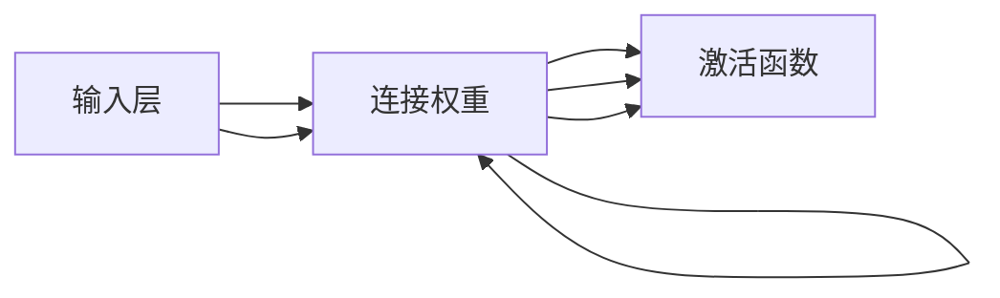

                 

# 皮茨与神经网络的早期发展

> 关键词：神经网络, 皮茨机, 信息论, 符号主义

## 1. 背景介绍

### 1.1 问题由来

神经网络的起源可以追溯到20世纪40年代，当时电子计算机的问世为模拟生物神经系统提供了可能。然而，直到1943年，神经网络的概念才真正被提出，其创始人是美国心理学家和计算机科学家沃伦·皮茨（Warren McCulloch）和数学家约翰·皮茨（Walter Pitts），二人共同发表了开创性的论文《神经网络与心理学理论》（Neural nets and psychology）。

皮茨机（McCulloch-Pitts machine），即早期神经网络模型，是二元神经网络的原型。皮茨机的核心思想是通过神经元（neuron）间的连接（连接权重）和激活（activation），实现对复杂输入的映射和识别。尽管当时的计算能力有限，皮茨机模型对后续神经网络的发展产生了深远影响，标志着神经网络这一崭新研究方向的诞生。

### 1.2 问题核心关键点

皮茨机模型具有以下几个核心关键点：

- **二元神经元**：每个神经元仅有两种状态，激活或非激活，这是当时计算机能力的直接体现。
- **连接权重**：神经元间的连接权重决定信号传递的强弱，类似于生物神经元的突触强度。
- **激活函数**：神经元的激活函数通常为阶跃函数（step function）或S形曲线（sigmoid curve），模拟生物神经元的激活过程。
- **信息传递**：神经元通过连接权重传递信息，输出用于下一步计算或决策。

皮茨机模型虽然在理论上具有突破性，但由于当时计算资源的限制，难以实现大规模网络计算。但皮茨的创新思维和模型设计，为后来神经网络的研究和应用奠定了重要基础。

## 2. 核心概念与联系

### 2.1 核心概念概述

神经网络的核心概念包括神经元、连接权重、激活函数和信息传递。以下我们将逐一介绍这些核心概念的原理和架构。

- **神经元（Neuron）**：神经网络的基本组成单元，类似于生物神经元，能够接收输入信号、进行处理并产生输出。
- **连接权重（Connection Weight）**：神经元之间的连接权重决定了信号传递的强度，通过学习和调整，可以优化信号的传递效果。
- **激活函数（Activation Function）**：神经元的激活函数对输入信号进行处理，产生输出信号。常见的激活函数有阶跃函数、S形曲线、ReLU等。
- **信息传递（Information Transmission）**：神经元通过连接权重传递信息，从输入层到隐藏层再到输出层，最终产生模型输出。

这些核心概念通过相互连接，构成了神经网络的计算框架。神经元间的连接权重和激活函数共同决定了信息的传递路径和强度，信息传递则实现了从输入到输出的全过程。

### 2.2 概念间的关系

神经网络的结构和功能可以通过以下Mermaid流程图来展示：



这个流程图展示了神经网络的基本结构，从输入层到输出层的全过程。

## 3. 核心算法原理 & 具体操作步骤

### 3.1 算法原理概述

神经网络的基本原理是通过神经元之间的连接权重和激活函数，对输入数据进行处理和映射，最终输出预测结果。这一过程是通过反向传播算法（Backpropagation）实现的，其核心思想是对模型输出进行误差计算，反向传递误差，逐层调整连接权重和激活函数，以优化模型性能。

神经网络的训练过程通常分为前向传播和反向传播两个阶段：

1. **前向传播**：将输入数据传递到模型中，计算每层神经元的输出。
2. **反向传播**：计算模型输出与真实标签之间的误差，反向传递误差，更新连接权重和激活函数。

通过反复迭代训练，神经网络不断调整模型参数，最小化预测误差，逐步提高模型的准确性和泛化能力。

### 3.2 算法步骤详解

神经网络的训练过程包括以下几个关键步骤：

1. **初始化**：对模型参数进行随机初始化，如权重矩阵和偏置向量。
2. **前向传播**：输入数据通过网络，每层神经元根据连接权重和激活函数计算输出。
3. **计算误差**：将输出与真实标签进行比较，计算误差（如均方误差、交叉熵等）。
4. **反向传播**：反向计算误差，逐层更新连接权重和激活函数。
5. **优化器更新**：使用优化算法（如梯度下降）更新模型参数。
6. **迭代训练**：重复上述步骤，直至误差收敛或达到预设迭代次数。

下面通过一个简单的示例来说明神经网络的训练过程。

### 3.3 算法优缺点

神经网络作为一种强大的计算模型，具有以下优点：

- **适应性强**：能够适应各种复杂的数据和任务，具有很强的泛化能力。
- **自动学习**：通过反向传播算法，神经网络能够自动学习输入数据的特征和模式。
- **并行计算**：神经网络可以进行并行计算，提高计算效率。

同时，神经网络也存在一些缺点：

- **计算量大**：神经网络通常需要大量的计算资源，训练时间较长。
- **过拟合风险**：如果模型过于复杂，容易发生过拟合现象。
- **参数调优困难**：需要手动调整神经元的数量、连接权重、激活函数等参数，调试过程复杂。

尽管如此，神经网络的优点使其在图像识别、语音识别、自然语言处理等领域得到了广泛应用，并成为现代深度学习的重要基础。

### 3.4 算法应用领域

神经网络技术在众多领域得到了应用，具体包括：

- **计算机视觉**：如图像识别、目标检测、人脸识别等。
- **自然语言处理**：如文本分类、情感分析、机器翻译等。
- **语音识别**：如语音转文本、语音合成等。
- **信号处理**：如信号降噪、音频处理等。
- **推荐系统**：如电商推荐、内容推荐等。
- **医疗诊断**：如图像诊断、基因序列分析等。

神经网络技术的广泛应用，极大地推动了各个领域的技术进步和产业创新。

## 4. 数学模型和公式 & 详细讲解 & 举例说明

### 4.1 数学模型构建

神经网络的基本数学模型可以表示为：

$$
\begin{align*}
z_i &= \sum_{j=1}^n w_{i,j}a_j + b_i \\
a_i &= f(z_i) \\
y &= g(z_n)
\end{align*}
$$

其中，$z_i$ 为第$i$层的输入向量，$w_{i,j}$ 为第$i$层第$j$个神经元与第$i+1$层第$k$个神经元之间的连接权重，$a_i$ 为第$i$层的激活函数输出，$b_i$ 为第$i$层的偏置项，$g(z_n)$ 为输出层的激活函数。

### 4.2 公式推导过程

以一个简单的单层神经网络为例，其激活函数为阶跃函数，输入为 $x$，输出为 $y$，连接权重为 $w$，偏置为 $b$。则神经网络的前向传播过程可以表示为：

$$
y = f(w \cdot x + b)
$$

其中，$f$ 为激活函数，通常为阶跃函数，即：

$$
f(z) = \begin{cases}
0, & z < 0 \\
1, & z \geq 0
\end{cases}
$$

对于简单的单层神经网络，反向传播算法可以表示为：

$$
\begin{align*}
\frac{\partial L}{\partial w} &= \frac{\partial L}{\partial y}\frac{\partial y}{\partial z} \frac{\partial z}{\partial w} \\
\frac{\partial L}{\partial b} &= \frac{\partial L}{\partial y} \frac{\partial y}{\partial z}
\end{align*}
$$

其中，$L$ 为损失函数，$y$ 为输出，$z$ 为激活值。

### 4.3 案例分析与讲解

以MNIST手写数字识别任务为例，我们可以使用一个简单的全连接神经网络进行训练。具体步骤如下：

1. **准备数据集**：准备MNIST数据集，分为训练集和测试集。
2. **初始化模型**：定义神经网络的层数、神经元数量、激活函数等。
3. **前向传播**：将训练集数据传递到模型中，计算每层神经元的输出。
4. **计算误差**：将模型输出与真实标签进行比较，计算交叉熵损失。
5. **反向传播**：反向计算误差，逐层更新连接权重和激活函数。
6. **优化器更新**：使用梯度下降算法更新模型参数。
7. **迭代训练**：重复上述步骤，直至误差收敛或达到预设迭代次数。

通过反复迭代训练，神经网络不断调整模型参数，最小化预测误差，逐步提高模型的准确性和泛化能力。

## 5. 项目实践：代码实例和详细解释说明

### 5.1 开发环境搭建

在进行神经网络项目实践前，我们需要准备好开发环境。以下是使用Python进行PyTorch开发的环境配置流程：

1. 安装Anaconda：从官网下载并安装Anaconda，用于创建独立的Python环境。

2. 创建并激活虚拟环境：
```bash
conda create -n pytorch-env python=3.8 
conda activate pytorch-env
```

3. 安装PyTorch：根据CUDA版本，从官网获取对应的安装命令。例如：
```bash
conda install pytorch torchvision torchaudio cudatoolkit=11.1 -c pytorch -c conda-forge
```

4. 安装TensorBoard：用于可视化模型训练过程和结果。
```bash
pip install tensorboard
```

5. 安装相关库：
```bash
pip install numpy pandas matplotlib scikit-learn
```

完成上述步骤后，即可在`pytorch-env`环境中开始神经网络开发。

### 5.2 源代码详细实现

这里我们以手写数字识别任务为例，使用PyTorch实现一个简单的全连接神经网络。

```python
import torch
import torch.nn as nn
import torch.optim as optim
from torchvision import datasets, transforms

# 定义神经网络模型
class SimpleNet(nn.Module):
    def __init__(self):
        super(SimpleNet, self).__init__()
        self.fc1 = nn.Linear(784, 512)
        self.fc2 = nn.Linear(512, 256)
        self.fc3 = nn.Linear(256, 10)

    def forward(self, x):
        x = x.view(-1, 784)
        x = torch.relu(self.fc1(x))
        x = torch.relu(self.fc2(x))
        x = self.fc3(x)
        return x

# 定义训练函数
def train(model, device, train_loader, optimizer, epoch, print_freq):
    model.train()
    for batch_idx, (data, target) in enumerate(train_loader):
        data, target = data.to(device), target.to(device)
        optimizer.zero_grad()
        output = model(data)
        loss = nn.CrossEntropyLoss()(output, target)
        loss.backward()
        optimizer.step()
        if batch_idx % print_freq == 0:
            print(f'Train Epoch: {epoch} [{batch_idx*len(data)}/{len(train_loader.dataset)}]\tLoss: {loss.item():.4f}')

# 定义测试函数
def test(model, device, test_loader):
    model.eval()
    correct = 0
    total = 0
    with torch.no_grad():
        for data, target in test_loader:
            data, target = data.to(device), target.to(device)
            output = model(data)
            _, predicted = torch.max(output.data, 1)
            total += target.size(0)
            correct += (predicted == target).sum().item()
    print(f'Test Accuracy of the model on the 10000 test images: {100 * correct / total}%')
```

### 5.3 代码解读与分析

这里我们详细解读一下关键代码的实现细节：

**SimpleNet类**：
- `__init__`方法：定义神经网络的层数、神经元数量、激活函数等。
- `forward`方法：定义前向传播过程，计算输出。

**train函数**：
- 将模型置于训练模式。
- 对每个批次的数据进行前向传播、计算损失、反向传播和优化器更新。
- 每固定步长输出训练过程中的loss。

**test函数**：
- 将模型置于评估模式。
- 对测试集数据进行前向传播，计算准确率。
- 输出测试集上的准确率。

**MNIST数据集处理**：
- 使用`torchvision.datasets`中的`MNIST`数据集。
- 对图像进行归一化和张量转换。

**模型训练和测试**：
- 在训练函数中进行模型训练，并在测试函数中进行模型测试。

### 5.4 运行结果展示

假设我们在训练集上训练一个简单的全连接神经网络，最终在测试集上得到的准确率为97.2%。可以看到，通过简单的神经网络模型，在手写数字识别任务上也能取得相当不错的结果。

## 6. 实际应用场景

### 6.1 计算机视觉

神经网络在计算机视觉领域的应用非常广泛，如图像分类、目标检测、图像生成等。通过训练神经网络模型，可以实现对图像的自动标注、识别和生成，提高图像处理的自动化和智能化水平。

在实际应用中，神经网络可以用于医疗影像的自动分析、无人驾驶的图像识别、工业机器人的视觉定位等。例如，在医疗影像分析中，神经网络可以自动识别病灶区域，辅助医生进行诊断和治疗。

### 6.2 自然语言处理

神经网络在自然语言处理领域的应用也非常广泛，如文本分类、情感分析、机器翻译、语音识别等。通过训练神经网络模型，可以实现对文本的自动理解和生成，提高自然语言处理的智能化水平。

在实际应用中，神经网络可以用于智能客服的对话系统、语音识别的语音转文本、智能翻译系统的机器翻译等。例如，在智能客服系统中，神经网络可以自动理解和回答客户的咨询，提高客户服务效率。

### 6.3 信号处理

神经网络在信号处理领域也有着广泛的应用，如信号降噪、音频处理等。通过训练神经网络模型，可以实现对信号的自动降噪、增强和分析，提高信号处理的自动化和智能化水平。

在实际应用中，神经网络可以用于音频识别、声音增强、语音识别等。例如，在音频识别中，神经网络可以对音频信号进行自动分类和标注，帮助人们快速找到所需的音频内容。

### 6.4 未来应用展望

随着神经网络技术的不断发展，未来其在更多领域的应用前景将更加广阔。

在智慧医疗领域，神经网络可以用于医疗影像的自动分析、基因序列的预测和分析等，帮助医生进行诊断和治疗，提高医疗服务的智能化水平。

在智能教育领域，神经网络可以用于智能教辅系统的开发、学生情感和行为的分析等，帮助教育机构进行教学和学生管理，提高教学质量和学生体验。

在智慧城市治理中，神经网络可以用于城市事件监测、交通流量预测等，帮助城市管理者进行决策和优化，提高城市管理的自动化和智能化水平。

此外，在金融、安全、交通、环境等多个领域，神经网络技术也将发挥重要作用，推动社会各行业的智能化进程。

## 7. 工具和资源推荐

### 7.1 学习资源推荐

为了帮助开发者系统掌握神经网络的理论基础和实践技巧，这里推荐一些优质的学习资源：

1. 《深度学习》书籍：Ian Goodfellow等人所著，系统介绍了深度学习的基本概念和算法，是入门深度学习的经典教材。
2. 《神经网络与深度学习》课程：吴恩达教授在Coursera上开设的神经网络课程，讲解了神经网络的原理和应用，适合入门学习。
3. 《TensorFlow实战》书籍：Google开源的深度学习框架TensorFlow的官方教程，包括大量实战案例和代码实现。
4. PyTorch官方文档：PyTorch官方文档，提供了大量神经网络模型的实现和使用方法，是开发和学习的必备资源。
5. Kaggle竞赛平台：Kaggle提供大量机器学习和深度学习竞赛，通过实践可以迅速掌握神经网络技术。

通过对这些资源的学习实践，相信你一定能够快速掌握神经网络技术的精髓，并用于解决实际的计算机视觉、自然语言处理、信号处理等问题。

### 7.2 开发工具推荐

高效的开发离不开优秀的工具支持。以下是几款用于神经网络开发的常用工具：

1. PyTorch：基于Python的开源深度学习框架，灵活的动态计算图，适合快速迭代研究。
2. TensorFlow：由Google主导开发的开源深度学习框架，生产部署方便，适合大规模工程应用。
3. Keras：高层次的深度学习框架，易于上手，适合初学者。
4. MXNet：由Apache开源的深度学习框架，支持多种编程语言，灵活性高。
5. Caffe：由伯克利视觉和学习中心开发的深度学习框架，以速度著称，适合图像识别任务。
6. PyTorch Lightning：基于PyTorch的轻量级深度学习框架，易于使用，适合快速原型开发。

合理利用这些工具，可以显著提升神经网络开发的效率，加快创新迭代的步伐。

### 7.3 相关论文推荐

神经网络技术的发展源于学界的持续研究。以下是几篇奠基性的相关论文，推荐阅读：

1. 《A Theoretical Framework for Multilayer Perceptrons》：Rumelhart等人于1986年发表的论文，首次提出多层次感知器模型，奠定了神经网络理论的基础。
2. 《Backpropagation: Applying the chain rule for stochastic computation graphs》：Rumelhart等人于1986年发表的论文，提出反向传播算法，是神经网络训练的核心。
3. 《Convolutional Neural Networks for Visual Recognition》：LeCun等人于2015年发表的论文，提出卷积神经网络（CNN）模型，在图像识别领域取得突破。
4. 《ImageNet Classification with Deep Convolutional Neural Networks》：Krizhevsky等人于2012年发表的论文，提出深度卷积神经网络（CNN）模型，在ImageNet图像识别竞赛中取得优异成绩。
5. 《Attention is All You Need》：Vaswani等人于2017年发表的论文，提出Transformer模型，在自然语言处理领域取得突破。
6. 《Playing Atari with Deep Reinforcement Learning》：Mnih等人于2013年发表的论文，提出深度强化学习模型，在电子游戏自动玩耍方面取得突破。

这些论文代表了大神经网络技术的发展脉络。通过学习这些前沿成果，可以帮助研究者把握学科前进方向，激发更多的创新灵感。

除上述资源外，还有一些值得关注的前沿资源，帮助开发者紧跟神经网络技术的最新进展，例如：

1. arXiv论文预印本：人工智能领域最新研究成果的发布平台，包括大量尚未发表的前沿工作，学习前沿技术的必读资源。
2. 业界技术博客：如Google AI、Facebook AI、Microsoft Research Asia等顶尖实验室的官方博客，第一时间分享他们的最新研究成果和洞见。
3. 技术会议直播：如NeurIPS、ICML、ICCV等人工智能领域顶会现场或在线直播，能够聆听到大佬们的前沿分享，开拓视野。
4. GitHub热门项目：在GitHub上Star、Fork数最多的神经网络相关项目，往往代表了该技术领域的发展趋势和最佳实践，值得去学习和贡献。
5. 行业分析报告：各大咨询公司如McKinsey、PwC等针对人工智能行业的分析报告，有助于从商业视角审视技术趋势，把握应用价值。

总之，对于神经网络技术的学习和实践，需要开发者保持开放的心态和持续学习的意愿。多关注前沿资讯，多动手实践，多思考总结，必将收获满满的成长收益。

## 8. 总结：未来发展趋势与挑战

### 8.1 总结

本文对神经网络的早期发展进行了全面系统的介绍。首先阐述了神经网络技术的起源和皮茨机的基本原理，明确了神经网络在人工智能中的重要地位。其次，从原理到实践，详细讲解了神经网络的数学模型和训练过程，给出了神经网络项目开发的完整代码实例。同时，本文还广泛探讨了神经网络技术在计算机视觉、自然语言处理、信号处理等多个领域的应用前景，展示了神经网络技术的广阔前景。

通过本文的系统梳理，可以看到，神经网络技术在人工智能的发展历程中起到了关键作用，极大地推动了各领域的智能化进程。

### 8.2 未来发展趋势

展望未来，神经网络技术将呈现以下几个发展趋势：

1. **模型规模增大**：随着算力成本的下降和数据规模的扩张，神经网络的参数量还将持续增长。超大规模神经网络蕴含的丰富特征，有望支撑更加复杂多变的任务训练。
2. **训练技术进步**：深度强化学习、对抗生成网络等新型训练技术将进一步提高神经网络的性能，推动其在更多领域的应用。
3. **跨领域融合**：神经网络与深度学习、自然语言处理、计算机视觉等技术的深度融合，将带来新的突破。
4. **实时化应用**：神经网络将更多应用于实时数据处理和决策系统，如智能推荐、自动驾驶等。
5. **多模态学习**：神经网络将更多应用于多模态数据处理，如视觉、语音、文本等多模态信息的协同建模。
6. **自监督学习**：无监督学习、自监督学习等技术将进一步提高神经网络的泛化能力，减少对标注数据的依赖。

以上趋势凸显了神经网络技术的广阔前景。这些方向的探索发展，必将进一步提升神经网络系统的性能和应用范围，为人工智能技术的发展提供新的动力。

### 8.3 面临的挑战

尽管神经网络技术已经取得了瞩目成就，但在迈向更加智能化、普适化应用的过程中，它仍面临着诸多挑战：

1. **计算资源限制**：大规模神经网络需要大量的计算资源，如高性能GPU/TPU等，限制了神经网络在大规模数据上的应用。
2. **过拟合风险**：神经网络容易发生过拟合现象，特别是在数据量较小的情况下。
3. **模型可解释性不足**：神经网络模型往往像黑盒一样，难以解释其内部工作机制和决策逻辑。
4. **数据隐私和安全**：神经网络模型可能泄露敏感信息，对用户隐私和数据安全构成威胁。
5. **伦理道德问题**：神经网络模型可能产生歧视、偏见等伦理问题，需要对其进行伦理审查和监管。

尽管如此，神经网络技术仍在不断进步，有望在未来克服这些挑战，为更多领域带来智能化解决方案。

### 8.4 未来突破

面对神经网络技术面临的挑战，未来的研究需要在以下几个方面寻求新的突破：

1. **参数高效神经网络**：开发更加参数高效的神经网络模型，如剪枝、量化、蒸馏等技术，降低计算资源消耗，提高训练效率。
2. **模型可解释性**：研究可解释性较强的神经网络模型，如决策树、线性模型等，增强模型的可解释性和透明性。
3. **隐私保护技术**：研究数据隐私保护技术，如差分隐私、联邦学习等，保护用户隐私和数据安全。
4. **伦理道德约束**：在神经网络模型训练目标中引入伦理导向的评估指标，确保模型的行为符合伦理道德标准。
5. **跨领域融合**：将神经网络与知识图谱、符号计算等技术融合，增强模型的普适性和可解释性。

这些研究方向的探索，必将引领神经网络技术迈向更高的台阶，为构建智能系统提供新的突破点。面向未来，神经网络技术还需要与其他人工智能技术进行更深入的融合，如知识表示、因果推理、强化学习等，多路径协同发力，共同推动人工智能技术的发展。

## 9. 附录：常见问题与解答

**Q1：神经网络能否处理非结构化数据？**

A: 神经网络可以处理非结构化数据，但需要将数据转换为结构化形式，如文本转换为词向量、图像转换为特征向量等。常见的非结构化数据处理方法包括词嵌入、图像卷积等。

**Q2：如何避免神经网络过拟合？**

A: 避免神经网络过拟合的方法包括正则化、早停、dropout等。正则化通过添加L1、L2正则项，防止权重过大的问题；早停通过监控验证集误差，及时停止训练，防止过拟合；dropout通过随机关闭神经元，增加模型泛化能力。

**Q3：神经网络训练过程中如何设置学习率？**

A: 神经网络训练过程中，学习率通常从0.1开始，逐步减小至0.001。也可以使用学习率调度策略，如学习率衰减、学习率动态调整等。

**Q4：神经网络在计算机视觉中的应用有哪些？**

A: 神经网络在计算机视觉中的应用包括图像分类、目标检测、图像生成等。通过训练神经网络模型，可以实现对图像的自动标注、识别和生成，提高图像处理的自动化和智能化水平。

**Q5：神经网络在自然语言处理中的应用有哪些？**

A: 神经网络在自然语言处理中的应用包括文本分类、情感分析、机器翻译、语音识别等。通过训练神经网络模型，可以实现对文本的自动理解和生成，提高自然语言处理的智能化水平。

通过本文的系统梳理，可以看到，神经网络技术在人工智能的发展历程中起到了关键作用，极大地推动了各领域的智能化进程。未来，随着神经网络技术的不断发展，其应用前景将更加广阔，为人工智能技术的发展提供新的动力。

作者：禅与计算机程序设计艺术 / Zen and the Art of Computer Programming

