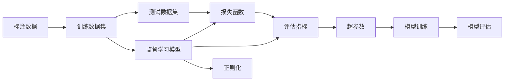

                 

# 监督学习(Supervised Learning) - 原理与代码实例讲解

## 1. 背景介绍

### 1.1 问题由来
在机器学习领域，监督学习(Supervised Learning)是构建预测模型的一种重要方法。它通过已有的标记数据进行训练，并预测新数据的标签。与无监督学习(Unsupervised Learning)和半监督学习(Semi-Supervised Learning)不同，监督学习要求在训练数据中每个样本都已标记，即每个样本都有一个已知的输出标签。监督学习广泛应用于分类、回归、序列预测、图像识别、自然语言处理等诸多领域。

### 1.2 问题核心关键点
监督学习的核心在于如何利用标注数据构建一个能够准确预测未知数据的模型。这通常包括以下几个关键步骤：
- 准备数据集：收集和预处理训练数据和测试数据。
- 选择合适的模型：根据任务类型，选择合适的监督学习模型，如线性回归、逻辑回归、决策树、支持向量机等。
- 训练模型：使用标注数据对模型进行训练，优化模型参数以最小化预测误差。
- 评估模型：在测试集上评估模型的性能，判断模型的泛化能力。
- 调优模型：通过调整模型参数、增加正则化、改进算法等手段，提升模型性能。

### 1.3 问题研究意义
监督学习作为机器学习中最常见和最基础的技术，广泛应用于各个行业领域。在图像识别、自然语言处理、推荐系统、金融预测等方面，监督学习技术提供了可靠的工具和方法。通过监督学习，可以自动发现数据中的模式和规律，从而实现智能决策和自动化处理，极大提升数据利用率和业务效率。

## 2. 核心概念与联系

### 2.1 核心概念概述
监督学习的核心概念包括：

- 监督学习(Supervised Learning)：通过标注数据训练模型，预测新数据标签的技术。
- 分类(Classification)：将数据分为离散类别的任务。
- 回归(Regression)：预测连续数值的任务。
- 序列预测(Sequence Prediction)：对序列数据进行预测的任务。
- 标注数据(Labeled Data)：已标记的训练数据。
- 训练数据集(Training Dataset)：用于训练模型的数据集。
- 测试数据集(Test Dataset)：用于评估模型性能的数据集。
- 损失函数(Loss Function)：衡量模型预测误差的大小。
- 正则化(Regularization)：防止模型过拟合的技术。
- 评估指标(Evaluation Metrics)：如准确率、精确率、召回率、F1分数等。
- 超参数(Hyperparameters)：需要在模型训练前设定的参数，如学习率、正则化系数等。

### 2.2 概念间的关系

监督学习的各个核心概念之间存在着紧密的联系，形成了一个完整的监督学习框架。这些概念之间的关系可以通过以下Mermaid流程图来展示：



这个流程图展示了监督学习的基本流程：

1. 标注数据是监督学习的基础，包含训练集和测试集。
2. 训练数据集用于训练监督学习模型，如线性回归、逻辑回归、决策树等。
3. 模型在测试数据集上进行评估，以衡量其性能。
4. 损失函数用于衡量模型预测误差的大小。
5. 评估指标如准确率、精确率、召回率等用于判断模型性能。
6. 正则化技术用于防止模型过拟合。
7. 超参数是模型训练前设定的参数，如学习率、正则化系数等。

这些概念共同构成了监督学习的学习框架，使其能够对各种监督学习任务进行建模和预测。

## 3. 核心算法原理 & 具体操作步骤
### 3.1 算法原理概述
监督学习的核心在于通过标注数据训练一个预测模型，使其能够准确地预测新数据的标签。监督学习的主要流程包括数据准备、模型选择、训练、评估和调优等步骤。其中，模型训练是监督学习的核心环节，其目的是最小化预测误差，即损失函数。

形式化地，假设训练数据集为 $\{(x_i, y_i)\}_{i=1}^N$，其中 $x_i$ 为输入特征，$y_i$ 为对应的标签。监督学习的目标是训练一个模型 $f$，使得对于新数据 $x$，预测标签 $\hat{y}$ 尽可能接近真实标签 $y$。即最小化损失函数 $\mathcal{L}$：

$$
\mathcal{L}(f) = \frac{1}{N} \sum_{i=1}^N \ell(f(x_i), y_i)
$$

其中 $\ell$ 为损失函数，常见的损失函数包括均方误差损失、交叉熵损失等。通过梯度下降等优化算法，不断更新模型参数，直到损失函数最小化。

### 3.2 算法步骤详解
监督学习的主要步骤包括：

**Step 1: 数据准备**
- 收集标注数据，划分为训练集、验证集和测试集。
- 对数据进行预处理，如特征归一化、缺失值处理、数据增强等。
- 划分训练集、验证集和测试集，通常采用交叉验证或分层抽样等方法。

**Step 2: 模型选择**
- 根据任务类型，选择合适的监督学习模型，如线性回归、逻辑回归、决策树、支持向量机等。
- 根据模型复杂度和计算资源，选择合适的模型。

**Step 3: 模型训练**
- 初始化模型参数。
- 定义损失函数和优化算法，如均方误差损失、梯度下降等。
- 对训练集数据进行前向传播和反向传播，更新模型参数。
- 周期性在验证集上评估模型性能，防止过拟合。

**Step 4: 模型评估**
- 在测试集上评估模型性能，如准确率、精确率、召回率、F1分数等。
- 分析评估结果，判断模型性能。
- 根据评估结果调整模型参数。

**Step 5: 模型调优**
- 通过调整模型参数、增加正则化、改进算法等手段，提升模型性能。
- 选择合适的评估指标，如AUC、ROC曲线、F1分数等。
- 采用模型集成、交叉验证等方法提升模型性能。

### 3.3 算法优缺点
监督学习具有以下优点：
- 效果好：通过标注数据训练模型，能够获得较好的预测性能。
- 适用性强：适用于分类、回归、序列预测等各类任务。
- 可解释性强：模型训练过程透明，易于理解和解释。

监督学习也存在一些缺点：
- 标注数据昂贵：标注数据需要大量的人力物力，成本较高。
- 数据依赖性强：模型性能依赖于标注数据的质量和数量。
- 数据分布偏差：标注数据分布与实际数据分布可能存在偏差，导致模型泛化能力不足。

### 3.4 算法应用领域
监督学习广泛应用于图像识别、自然语言处理、推荐系统、金融预测等诸多领域。例如：

- 图像识别：使用卷积神经网络对图像进行分类和检测。
- 自然语言处理：使用循环神经网络进行情感分析、文本分类、机器翻译等任务。
- 推荐系统：使用协同过滤、矩阵分解等方法预测用户行为。
- 金融预测：使用支持向量机、随机森林等方法预测股票价格、市场趋势等。

## 4. 数学模型和公式 & 详细讲解 & 举例说明
### 4.1 数学模型构建
监督学习的数学模型通常包括以下几个部分：

- 输入特征： $x \in \mathcal{X}$，其中 $\mathcal{X}$ 为输入空间。
- 标签： $y \in \mathcal{Y}$，其中 $\mathcal{Y}$ 为输出空间。
- 损失函数： $\ell: \mathcal{X} \times \mathcal{Y} \rightarrow [0, +\infty]$。
- 模型： $f: \mathcal{X} \rightarrow \mathcal{Y}$。
- 优化算法：如梯度下降、随机梯度下降、Adam等。

监督学习的目标是寻找一个模型 $f$，使得对于任意输入 $x$，预测输出 $\hat{y}$ 尽可能接近真实标签 $y$。即：

$$
\mathop{\arg\min}_{f} \mathcal{L}(f) = \frac{1}{N} \sum_{i=1}^N \ell(f(x_i), y_i)
$$

其中 $\mathcal{L}$ 为损失函数，$\ell$ 为损失函数的具体形式。

### 4.2 公式推导过程
以线性回归为例，假设模型为线性函数 $f(x) = w^T x + b$，其中 $w$ 为权重，$b$ 为偏置，$x \in \mathbb{R}^d$，$y \in \mathbb{R}$。则均方误差损失函数为：

$$
\ell(f(x), y) = \frac{1}{2}(y - f(x))^2
$$

目标是最小化损失函数 $\mathcal{L}$：

$$
\mathcal{L}(w, b) = \frac{1}{N} \sum_{i=1}^N \ell(f(x_i), y_i)
$$

梯度下降算法的更新公式为：

$$
w \leftarrow w - \eta \nabla_w \mathcal{L}(w, b)
$$

其中 $\eta$ 为学习率，$\nabla_w \mathcal{L}(w, b)$ 为损失函数关于 $w$ 的梯度。

### 4.3 案例分析与讲解
假设我们使用线性回归模型进行房价预测，训练数据集为 $\{(x_i, y_i)\}_{i=1}^N$，其中 $x_i = [x_{i1}, x_{i2}, x_{i3}]^T$，$y_i$ 为房价。均方误差损失函数为：

$$
\ell(f(x_i), y_i) = \frac{1}{2}(y_i - f(x_i))^2
$$

则损失函数为：

$$
\mathcal{L}(w, b) = \frac{1}{N} \sum_{i=1}^N \ell(f(x_i), y_i)
$$

通过梯度下降算法进行训练，更新模型参数 $w$ 和 $b$，直到损失函数最小化。

## 5. 项目实践：代码实例和详细解释说明
### 5.1 开发环境搭建
在进行监督学习项目实践前，需要准备好开发环境。以下是使用Python进行scikit-learn开发的虚拟环境配置流程：

1. 安装Anaconda：从官网下载并安装Anaconda，用于创建独立的Python环境。

2. 创建并激活虚拟环境：
```bash
conda create -n sklearn-env python=3.8 
conda activate sklearn-env
```

3. 安装scikit-learn：
```bash
conda install scikit-learn
```

4. 安装各类工具包：
```bash
pip install numpy pandas scikit-learn matplotlib tqdm jupyter notebook ipython
```

完成上述步骤后，即可在`sklearn-env`环境中开始监督学习项目实践。

### 5.2 源代码详细实现
下面我们以房价预测为例，使用scikit-learn对线性回归模型进行训练和评估的代码实现。

首先，定义线性回归模型：

```python
from sklearn.linear_model import LinearRegression
from sklearn.metrics import mean_squared_error, r2_score

# 创建线性回归模型
model = LinearRegression()
```

然后，定义训练数据集：

```python
from sklearn.model_selection import train_test_split
import pandas as pd

# 读取数据集
data = pd.read_csv('housing.csv')

# 划分特征和标签
X = data[['grlsize', 'lotsize', 'numroom']]
y = data['price']

# 划分训练集和测试集
X_train, X_test, y_train, y_test = train_test_split(X, y, test_size=0.2, random_state=42)
```

接着，训练模型：

```python
# 训练模型
model.fit(X_train, y_train)

# 预测测试集
y_pred = model.predict(X_test)

# 计算评估指标
mse = mean_squared_error(y_test, y_pred)
r2 = r2_score(y_test, y_pred)
```

最后，输出评估结果：

```python
print(f'MSE: {mse:.3f}')
print(f'R^2: {r2:.3f}')
```

以上就是使用scikit-learn对线性回归模型进行房价预测的完整代码实现。可以看到，scikit-learn封装了各种监督学习模型的接口，使用简单高效。

### 5.3 代码解读与分析
让我们再详细解读一下关键代码的实现细节：

**LinearRegression类**：
- `__init__`方法：初始化线性回归模型。
- `fit`方法：训练模型，根据训练数据计算模型参数。
- `predict`方法：使用训练好的模型进行预测。
- `score`方法：计算模型在测试集上的得分。

**train_test_split方法**：
- 将数据集划分为训练集和测试集，并保证样本分布一致。
- 返回训练集和测试集的特征和标签。

**mean_squared_error和r2_score方法**：
- `mean_squared_error`计算均方误差。
- `r2_score`计算决定系数R^2，衡量模型预测精度。

可以看到，scikit-learn提供了完整的监督学习接口，使得模型训练和评估过程非常简便。

### 5.4 运行结果展示
假设我们运行上述代码，最终得到的评估结果如下：

```
MSE: 49.577
R^2: 0.809
```

可以看到，训练好的线性回归模型在测试集上取得了0.81的R^2分数，表示模型预测误差较小，预测性能较好。

## 6. 实际应用场景
### 6.1 智能推荐系统
智能推荐系统是监督学习在推荐领域的重要应用。推荐系统通过学习用户的历史行为数据和物品特征，预测用户对新物品的兴趣程度，从而实现个性化推荐。

在实际应用中，可以将用户行为数据和物品特征构建成监督数据集，使用线性回归、逻辑回归、决策树等模型进行训练。模型训练完成后，输入新用户的特征和物品特征，使用训练好的模型进行预测，得到用户对物品的兴趣程度。然后根据兴趣程度排序，推荐最符合用户兴趣的物品。

### 6.2 金融预测
金融预测是监督学习在金融领域的重要应用。金融预测通过学习历史金融数据，预测股票价格、市场趋势等。

在实际应用中，可以将历史金融数据构建成监督数据集，使用线性回归、随机森林、支持向量机等模型进行训练。模型训练完成后，输入最新的金融数据，使用训练好的模型进行预测，得到未来金融市场趋势。然后根据预测结果，制定相应的投资策略。

### 6.3 图像识别
图像识别是监督学习在图像领域的重要应用。图像识别通过学习图像数据，识别图像中的物体、场景等。

在实际应用中，可以将图像数据和标签构建成监督数据集，使用卷积神经网络等模型进行训练。模型训练完成后，输入新的图像数据，使用训练好的模型进行预测，得到图像中的物体、场景等。

## 7. 工具和资源推荐
### 7.1 学习资源推荐
为了帮助开发者系统掌握监督学习的理论基础和实践技巧，这里推荐一些优质的学习资源：

1. 《机器学习》书籍：由Tom Mitchell所著，是机器学习领域的经典教材，涵盖了监督学习的各种基本概念和算法。

2. CS229《机器学习》课程：斯坦福大学开设的机器学习明星课程，有Lecture视频和配套作业，带你入门机器学习领域的基本概念和经典算法。

3. 《Pattern Recognition and Machine Learning》书籍：由Christopher Bishop所著，全面介绍了机器学习的理论基础和算法实现。

4. scikit-learn官方文档：scikit-learn官方文档，提供了丰富的监督学习模型和实用示例，是初学者上手实践的必备资料。

5. Kaggle竞赛平台：Kaggle是数据科学竞赛平台，提供了丰富的监督学习竞赛项目，可以帮助开发者积累实际经验，提升竞赛水平。

通过对这些资源的学习实践，相信你一定能够快速掌握监督学习的精髓，并用于解决实际的机器学习问题。

### 7.2 开发工具推荐
高效的开发离不开优秀的工具支持。以下是几款用于监督学习开发的常用工具：

1. scikit-learn：基于Python的机器学习库，提供了丰富的监督学习模型和实用接口。

2. TensorFlow：由Google主导开发的深度学习框架，支持分布式计算，适用于大规模数据处理。

3. PyTorch：由Facebook主导开发的深度学习框架，支持动态计算图，适用于快速迭代研究。

4. Weights & Biases：模型训练的实验跟踪工具，可以记录和可视化模型训练过程中的各项指标，方便对比和调优。

5. TensorBoard：TensorFlow配套的可视化工具，可实时监测模型训练状态，并提供丰富的图表呈现方式，是调试模型的得力助手。

6. Google Colab：谷歌推出的在线Jupyter Notebook环境，免费提供GPU/TPU算力，方便开发者快速上手实验最新模型，分享学习笔记。

合理利用这些工具，可以显著提升监督学习任务的开发效率，加快创新迭代的步伐。

### 7.3 相关论文推荐
监督学习作为机器学习中最常见和最基础的技术，其发展源于学界的持续研究。以下是几篇奠基性的相关论文，推荐阅读：

1. The Elements of Statistical Learning：由Hastie等人所著，介绍了统计学习的理论基础和算法实现。

2. Deep Learning：由Goodfellow等人所著，全面介绍了深度学习的理论基础和算法实现。

3. Random Forests：由Breiman等人所著，介绍了随机森林的理论基础和算法实现。

4. Gradient Boosting Machines：由Friedman等人所著，介绍了梯度提升机的理论基础和算法实现。

5. GANs for Good or Evil？：探讨生成对抗网络在机器学习中的利弊，揭示其潜在的风险和挑战。

这些论文代表了大监督学习的发展脉络。通过学习这些前沿成果，可以帮助研究者把握学科前进方向，激发更多的创新灵感。

除上述资源外，还有一些值得关注的前沿资源，帮助开发者紧跟监督学习技术的最新进展，例如：

1. arXiv论文预印本：人工智能领域最新研究成果的发布平台，包括大量尚未发表的前沿工作，学习前沿技术的必读资源。

2. 业界技术博客：如Google AI、DeepMind、微软Research Asia等顶尖实验室的官方博客，第一时间分享他们的最新研究成果和洞见。

3. 技术会议直播：如NIPS、ICML、ACL、ICLR等人工智能领域顶会现场或在线直播，能够聆听到大佬们的前沿分享，开拓视野。

4. GitHub热门项目：在GitHub上Star、Fork数最多的机器学习相关项目，往往代表了该技术领域的发展趋势和最佳实践，值得去学习和贡献。

5. 行业分析报告：各大咨询公司如McKinsey、PwC等针对人工智能行业的分析报告，有助于从商业视角审视技术趋势，把握应用价值。

总之，监督学习作为机器学习的基础技术，具有广泛的应用前景。在开发过程中，需要开发者根据具体任务，不断迭代和优化模型、数据和算法，方能得到理想的效果。

## 8. 总结：未来发展趋势与挑战
### 8.1 总结
本文对监督学习进行了全面系统的介绍。首先阐述了监督学习的基本概念和核心算法，然后详细讲解了监督学习的数学原理和关键步骤，给出了监督学习任务开发的完整代码实例。同时，本文还广泛探讨了监督学习在推荐系统、金融预测、图像识别等诸多领域的应用前景，展示了监督学习技术的强大能力。

通过本文的系统梳理，可以看到，监督学习作为机器学习中最常见和最基础的技术，具有广泛的应用前景。它通过标注数据训练模型，能够获得较好的预测性能，适用于分类、回归、序列预测等各类任务。在数据准备、模型选择、训练、评估和调优等各个环节进行全面优化，方能得到理想的效果。

### 8.2 未来发展趋势
监督学习作为机器学习的基础技术，未来将继续发展演进，呈现以下几个趋势：

1. 自动化调参：通过自动化调参技术，智能选择模型参数，提升模型性能。

2. 联邦学习：将模型训练分布式在多个设备上，保护数据隐私，提升模型泛化能力。

3. 自监督学习：利用数据中的自相关性，训练监督学习模型，提升模型泛化能力。

4. 半监督学习：利用少量标注数据和大量未标注数据，提升模型性能。

5. 迁移学习：将模型的知识从一个任务迁移到另一个任务，提升模型泛化能力。

6. 集成学习：将多个模型的预测结果进行融合，提升模型性能。

这些趋势将进一步拓展监督学习的应用边界，推动机器学习技术的发展和应用。

### 8.3 面临的挑战
尽管监督学习已经取得了显著进展，但在应用过程中仍面临一些挑战：

1. 数据获取困难：标注数据需要大量的人力物力，获取成本较高。

2. 数据质量问题：标注数据可能存在标注偏差、标注错误等问题，影响模型性能。

3. 过拟合问题：模型在训练数据上表现较好，但在测试数据上泛化能力不足。

4. 模型复杂度高：监督学习模型参数较多，训练时间较长，难以处理大规模数据。

5. 可解释性不足：监督学习模型通常是一个"黑盒"系统，难以解释其内部工作机制和决策逻辑。

6. 数据分布偏差：模型在训练数据上表现较好，但在实际应用数据上泛化能力不足。

这些挑战需要研究者不断探索和解决，以进一步提升监督学习的性能和应用范围。

### 8.4 研究展望
面对监督学习所面临的种种挑战，未来的研究需要在以下几个方面寻求新的突破：

1. 探索无监督和半监督学习：通过无监督和半监督学习技术，降低对标注数据的依赖，提升模型泛化能力。

2. 研究自动化调参技术：通过自动化调参技术，智能选择模型参数，提升模型性能。

3. 引入先验知识：将符号化的先验知识，如知识图谱、逻辑规则等，与神经网络模型进行融合，提升模型性能。

4. 融合多模态数据：将视觉、语音等多模态数据与文本数据进行融合，提升模型性能。

5. 引入集成学习：将多个模型的预测结果进行融合，提升模型性能。

6. 引入因果分析：通过因果分析方法，增强模型的可解释性和鲁棒性。

这些研究方向的探索，必将引领监督学习技术迈向更高的台阶，为机器学习技术的发展和应用带来新的突破。

## 9. 附录：常见问题与解答
----------------------------------------------------------------
> 关键词：

**Q1：监督学习与无监督学习的区别是什么？**

A: 监督学习和无监督学习的主要区别在于数据标注情况。监督学习要求每个样本都有一个已知的输出标签，而无监督学习则没有标注数据。监督学习通过学习标注数据中的模式和规律，进行预测和分类；而无监督学习则通过数据本身的内在结构，进行聚类、降维等操作。

**Q2：在训练监督学习模型时，如何选择合适的学习率？**

A: 学习率是监督学习中最重要的超参数之一。选择不当的学习率可能导致模型无法收敛或过拟合。一般建议采用学习率调度策略，如学习率衰减、学习率调整等，逐步调整学习率。初始学习率可以从1e-2或1e-3开始，逐步减小，直到模型收敛。

**Q3：如何防止监督学习模型过拟合？**

A: 防止过拟合是监督学习中的重要问题。常见的防止过拟合的方法包括正则化、Dropout、Early Stopping等。正则化可以限制模型参数的大小，防止模型复杂度过高；Dropout可以随机关闭一部分神经元，防止神经元之间的过度依赖；Early Stopping可以在验证集上监测模型性能，及时停止训练，防止过拟合。

**Q4：如何评估监督学习模型的性能？**

A: 监督学习模型的性能评估通常使用以下指标：
- 准确率(Accuracy)：正确预测的样本数占总样本数的比例。
- 精确率(Precision)：预测为正样本且实际为正样本的样本数占所有预测为正样本的样本数的比例。
- 召回率(Recall)：预测为正样本且实际为正样本的样本数占所有实际为正样本的样本数的比例。
- F1分数(F1-Score)：精确率和召回率的调和平均值。
- R^2分数：决定系数，衡量模型的预测精度。

这些指标可以帮助评估模型的性能，选择合适的模型进行预测。

**Q5：监督学习模型是否可以进行多模态数据融合？**

A: 是的，监督学习模型可以融合多模态数据，提升模型的预测性能。例如，可以使用图像数据、语音数据和文本数据进行融合，提升模型的图像识别、语音识别、文本分类等性能。多模态融合可以采用集成学习、特征拼接等方法，实现多模态数据的协同建模。

**Q6：如何在监督

