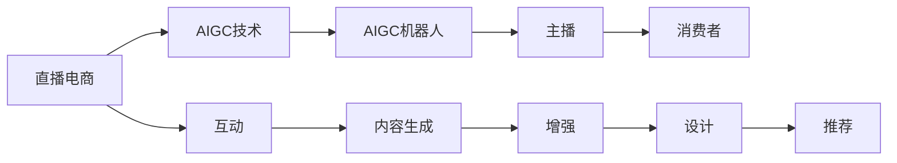
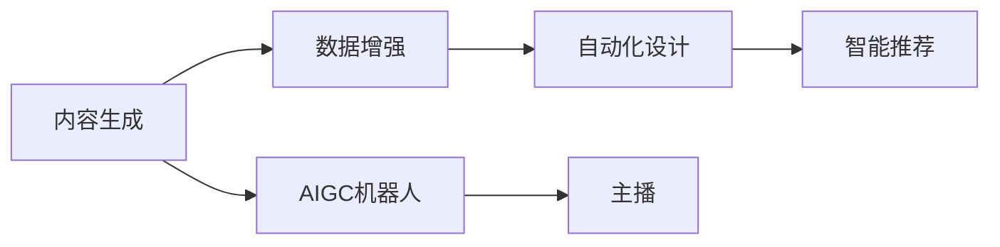
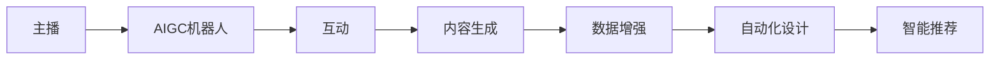
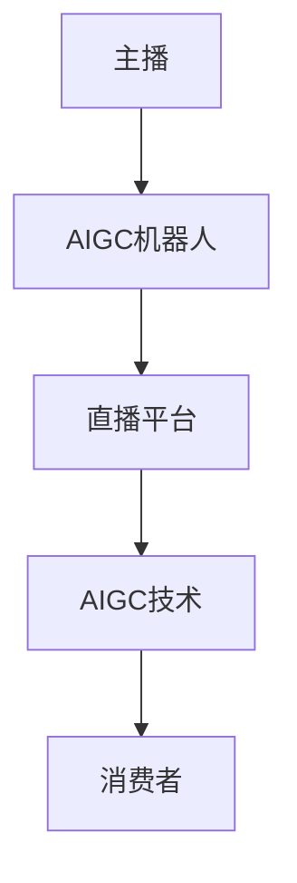
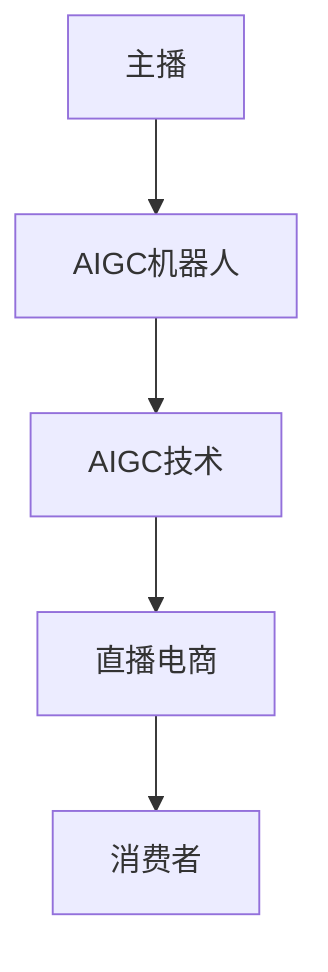

                 

# 直播电商与AIGC机器人的结合

直播电商（Live E-commerce, LEC）正在改变传统电商的固有模式，借助主播的现场演示，消费者能够更直观地了解商品，提高购物决策效率和满意度。然而，在实际直播过程中，主播不仅需要掌握商品知识，还要具备与观众互动的能力，对主播的综合素质要求较高。为此，AIGC（人工智能生成内容）技术为直播电商带来了新的思路：AIGC机器人作为主播的辅助工具，通过智能生成文本、图像、视频等内容，可以提升直播互动体验，减轻主播负担，并推动直播电商的规模化发展。

## 1. 背景介绍

### 1.1 直播电商的兴起与挑战

直播电商最早起源于2003年韩国的Megastar Show，并在2016年随着李佳琦的崛起，成为国内电商的一大新形式。直播电商通过主播的实时演示和互动，打破了传统电商图文展示的限制，让消费者更直观地感受商品特性，从而提高购买决策效率和满意度。

然而，直播电商也面临着诸多挑战：

1. **主播资源匮乏**：高水平的主播数量有限，难以覆盖所有品类。
2. **互动效率低下**：主播需要同时进行商品讲解、互动问答、数据分析等任务，容易出现遗漏。
3. **内容制作成本高**：主播需要大量时间进行商品准备、背景布置等前期工作。
4. **数据实时性差**：传统直播平台无法实时处理消费者反馈，导致用户体验不佳。

为了应对这些挑战，AIGC技术作为AI的重要分支，通过生成高质量的文本、图像、视频等，可以大幅提升直播互动体验，减轻主播负担，并推动直播电商的规模化发展。

### 1.2 AIGC技术的概念与核心应用

AIGC技术主要指利用人工智能技术生成高质量的文本、图像、视频等内容。其核心应用包括：

1. **内容生成**：通过自然语言生成（NLG）、图像生成（IG）、视频生成（VG）等技术，快速生成高质量的内容。
2. **数据增强**：通过生成对抗网络（GAN）等技术，扩充训练数据集，提高模型泛化能力。
3. **自动化设计**：通过AI辅助设计（AAD），快速生成商品展示方案、页面布局等。
4. **智能推荐**：通过个性化推荐引擎，根据消费者行为生成定制化内容。

直播电商与AIGC技术的结合，能够充分利用AIGC的优势，通过智能生成内容，提升直播互动效率，减轻主播负担，实现直播电商的自动化、智能化转型。

## 2. 核心概念与联系

### 2.1 核心概念概述

直播电商与AIGC机器人的结合涉及多个核心概念，包括直播电商、AIGC技术、AIGC机器人、主播、消费者等。这些概念之间的联系可以通过以下Mermaid流程图来展示：



这个流程图展示了直播电商与AIGC机器人结合的完整流程：

1. **直播电商**：通过主播与消费者互动，展示商品信息。
2. **AIGC技术**：生成高质量的内容，提升直播互动体验。
3. **AIGC机器人**：利用AIGC技术生成辅助内容，减轻主播负担。
4. **主播**：与AIGC机器人协作，进行商品讲解、互动问答等。
5. **消费者**：通过主播和AIGC机器人，获取商品信息和互动体验。

### 2.2 概念间的关系

这些核心概念之间存在紧密的联系，形成了直播电商与AIGC机器人结合的完整生态系统。下面我们通过几个Mermaid流程图来展示这些概念之间的关系。

#### 2.2.1 AIGC技术与AIGC机器人



这个流程图展示了AIGC技术在AIGC机器人中的应用。AIGC技术通过生成高质量的内容，提升直播互动效率，减轻主播负担，并推动直播电商的规模化发展。

#### 2.2.2 AIGC机器人在直播电商中的应用



这个流程图展示了AIGC机器人在直播电商中的应用。AIGC机器人通过智能生成内容，提升直播互动效率，减轻主播负担，实现直播电商的自动化、智能化转型。

#### 2.2.3 直播电商与AIGC机器人的整体架构



这个综合流程图展示了直播电商与AIGC机器人结合的整体架构。主播与AIGC机器人协作，利用AIGC技术生成高质量的内容，提升直播互动体验，减轻主播负担，并推动直播电商的规模化发展。

### 2.3 核心概念的整体架构

最后，我们用一个综合的流程图来展示直播电商与AIGC机器人结合的核心概念的整体架构：



这个综合流程图展示了直播电商与AIGC机器人结合的核心概念的整体架构。主播与AIGC机器人协作，利用AIGC技术生成高质量的内容，提升直播互动体验，减轻主播负担，并推动直播电商的规模化发展。

## 3. 核心算法原理 & 具体操作步骤
### 3.1 算法原理概述

直播电商与AIGC机器人结合的核心算法原理涉及自然语言生成（NLG）、图像生成（IG）、视频生成（VG）等技术，主要包括以下几个步骤：

1. **内容生成**：通过自然语言生成技术，生成商品介绍、互动问答等文本内容。
2. **数据增强**：通过生成对抗网络等技术，扩充训练数据集，提高模型泛化能力。
3. **自动化设计**：通过AI辅助设计技术，生成商品展示方案、页面布局等。
4. **智能推荐**：通过个性化推荐引擎，根据消费者行为生成定制化内容。

### 3.2 算法步骤详解

#### 3.2.1 自然语言生成（NLG）

自然语言生成（NLG）是AIGC技术的重要组成部分，通过生成高质量的文本内容，提升直播互动体验。以下是自然语言生成的一般步骤：

1. **数据准备**：收集直播数据、商品信息、用户评论等，用于训练和评估模型。
2. **模型构建**：选择合适的NLG模型，如GPT、BERT等，并调整超参数。
3. **模型训练**：利用准备的数据训练模型，优化损失函数，提高生成质量。
4. **模型评估**：通过BLEU、ROUGE等指标，评估模型生成文本的质量。
5. **模型应用**：将模型应用于直播场景，生成商品介绍、互动问答等文本内容。

#### 3.2.2 图像生成（IG）

图像生成（IG）是AIGC技术的另一重要组成部分，通过生成高质量的图像内容，提升直播互动体验。以下是图像生成的一般步骤：

1. **数据准备**：收集直播数据、商品图片、用户评论等，用于训练和评估模型。
2. **模型构建**：选择合适的IG模型，如GAN、VAE等，并调整超参数。
3. **模型训练**：利用准备的数据训练模型，优化损失函数，提高生成质量。
4. **模型评估**：通过FID、IS等指标，评估模型生成图像的质量。
5. **模型应用**：将模型应用于直播场景，生成商品展示、背景装饰等图像内容。

#### 3.2.3 视频生成（VG）

视频生成（VG）是AIGC技术的最新进展，通过生成高质量的视频内容，提升直播互动体验。以下是视频生成的一般步骤：

1. **数据准备**：收集直播数据、商品视频、用户评论等，用于训练和评估模型。
2. **模型构建**：选择合适的VG模型，如VQ-VAE、VP-GAN等，并调整超参数。
3. **模型训练**：利用准备的数据训练模型，优化损失函数，提高生成质量。
4. **模型评估**：通过FVD、CIDEr等指标，评估模型生成视频的质量。
5. **模型应用**：将模型应用于直播场景，生成商品展示、背景动画等视频内容。

### 3.3 算法优缺点

#### 3.3.1 优点

直播电商与AIGC机器人结合的优势主要体现在以下几个方面：

1. **提升互动效率**：AIGC机器人可以实时生成互动内容，减轻主播负担，提高互动效率。
2. **降低内容制作成本**：通过自动生成内容，大幅降低内容制作时间和成本，提升生产效率。
3. **提高直播体验**：利用高质量的文本、图像、视频等内容，提升消费者购物体验。
4. **推动规模化发展**：AIGC技术可以支持大规模的主播协作，推动直播电商的规模化发展。

#### 3.3.2 缺点

直播电商与AIGC机器人结合也存在一些缺点：

1. **内容质量不稳定**：AIGC技术生成的内容质量受模型参数和数据质量的影响较大，有时可能生成低质量内容。
2. **缺乏人性化互动**：AIGC机器人难以完全替代主播的个性化互动，仍需人工干预。
3. **技术门槛较高**：AIGC技术需要较高的技术门槛，对模型的训练和优化要求较高。
4. **隐私和安全问题**：AIGC技术生成内容涉及大量用户隐私数据，需要严格控制数据使用和保护。

### 3.4 算法应用领域

直播电商与AIGC机器人的结合可以广泛应用于多个领域，包括：

1. **购物直播**：利用AIGC技术生成商品介绍、互动问答等文本内容，提升直播互动效率。
2. **直播测评**：生成产品测评视频、图像等内容，辅助主播进行产品展示。
3. **直播广告**：生成广告文本、图像、视频等内容，提升广告效果。
4. **教育直播**：生成课程介绍、实验演示等文本内容，提升教学效果。
5. **旅游直播**：生成景点介绍、旅游攻略等文本内容，提升旅游体验。

## 4. 数学模型和公式 & 详细讲解 & 举例说明

### 4.1 数学模型构建

直播电商与AIGC机器人结合的核心数学模型涉及自然语言生成（NLG）、图像生成（IG）、视频生成（VG）等技术。以下是具体的数学模型构建方法：

#### 4.1.1 自然语言生成（NLG）

自然语言生成（NLG）的主要数学模型包括：

1. **序列到序列模型（Seq2Seq）**：将输入序列转换为输出序列，用于生成文本内容。常用的模型包括LSTM、GRU、Transformer等。
2. **注意力机制（Attention）**：用于增强模型对输入序列中重要信息的学习，提升生成效果。
3. **解码器模型（Decoder）**：用于生成目标文本，常用的模型包括RNN、GRU、Transformer等。

#### 4.1.2 图像生成（IG）

图像生成（IG）的主要数学模型包括：

1. **生成对抗网络（GAN）**：通过生成器和判别器之间的对抗训练，生成高质量的图像内容。常用的模型包括DCGAN、WGAN、WGAN-GP等。
2. **变分自编码器（VAE）**：通过编码器和解码器之间的变换，生成高质量的图像内容。常用的模型包括条件VAE、β-VAE等。

#### 4.1.3 视频生成（VG）

视频生成（VG）的主要数学模型包括：

1. **变分自编码器（VAE）**：通过编码器和解码器之间的变换，生成高质量的视频内容。常用的模型包括条件VAE、β-VAE等。
2. **流式生成网络（Flow-based Models）**：通过流形变换，生成高质量的视频内容。常用的模型包括Poisson flow、Coupling flow等。

### 4.2 公式推导过程

以下是自然语言生成（NLG）、图像生成（IG）、视频生成（VG）等核心算法的公式推导过程：

#### 4.2.1 自然语言生成（NLG）

序列到序列模型（Seq2Seq）的公式推导如下：

$$
y = \mathrm{seq2seq}(x)
$$

其中，$x$ 为输入序列，$y$ 为输出序列。

注意力机制（Attention）的公式推导如下：

$$
\alpha_i = \frac{\exp(a_i)}{\sum_{j=1}^J \exp(a_j)}
$$

其中，$a_i$ 为注意力得分，$\alpha_i$ 为注意力权重。

解码器模型（Decoder）的公式推导如下：

$$
y = \mathrm{softmax}(W_h[h_1] + b_h + U_c[c] + b_c)
$$

其中，$W_h$、$b_h$、$U_c$、$b_c$ 为模型参数。

#### 4.2.2 图像生成（IG）

生成对抗网络（GAN）的公式推导如下：

$$
\begin{aligned}
L_{\text{GAN}} = \mathbb{E}_{x\sim p_x}[\log D(x)] + \mathbb{E}_{z\sim p_z}[\log(1-D(G(z)))]
\end{aligned}
$$

其中，$x$ 为真实图像，$z$ 为噪声向量，$G$ 为生成器，$D$ 为判别器。

变分自编码器（VAE）的公式推导如下：

$$
\begin{aligned}
p_{\theta}(x|z) = \mathcal{N}(\mu(z), \sigma^2(z))
\end{aligned}
$$

其中，$z$ 为潜在变量，$\mu$、$\sigma$ 为模型参数。

#### 4.2.3 视频生成（VG）

变分自编码器（VAE）的公式推导如下：

$$
\begin{aligned}
p_{\theta}(x|z) = \mathcal{N}(\mu(z), \sigma^2(z))
\end{aligned}
$$

其中，$z$ 为潜在变量，$\mu$、$\sigma$ 为模型参数。

流式生成网络（Flow-based Models）的公式推导如下：

$$
\begin{aligned}
p_{\theta}(x|z) = \mathcal{N}(x, \log |\det J))
\end{aligned}
$$

其中，$z$ 为潜在变量，$J$ 为变换矩阵，$\theta$ 为模型参数。

### 4.3 案例分析与讲解

#### 4.3.1 购物直播

以购物直播为例，分析直播电商与AIGC机器人结合的实际应用。以下是案例分析与讲解：

1. **数据准备**：收集直播数据、商品信息、用户评论等，用于训练和评估模型。
2. **模型构建**：选择Seq2Seq模型和Attention机制，生成商品介绍和互动问答内容。
3. **模型训练**：利用准备的数据训练模型，优化损失函数，提高生成质量。
4. **模型评估**：通过BLEU、ROUGE等指标，评估模型生成文本的质量。
5. **模型应用**：将模型应用于直播场景，生成商品介绍、互动问答等文本内容。

#### 4.3.2 直播测评

以直播测评为例，分析直播电商与AIGC机器人结合的实际应用。以下是案例分析与讲解：

1. **数据准备**：收集直播数据、商品视频、用户评论等，用于训练和评估模型。
2. **模型构建**：选择GAN和VAE模型，生成商品展示视频和背景装饰图像。
3. **模型训练**：利用准备的数据训练模型，优化损失函数，提高生成质量。
4. **模型评估**：通过FID、IS等指标，评估模型生成图像的质量。
5. **模型应用**：将模型应用于直播场景，生成商品展示视频和背景装饰图像。

#### 4.3.3 直播广告

以直播广告为例，分析直播电商与AIGC机器人结合的实际应用。以下是案例分析与讲解：

1. **数据准备**：收集直播数据、广告素材、用户评论等，用于训练和评估模型。
2. **模型构建**：选择Seq2Seq模型和Attention机制，生成广告文本和图像内容。
3. **模型训练**：利用准备的数据训练模型，优化损失函数，提高生成质量。
4. **模型评估**：通过BLEU、ROUGE等指标，评估模型生成文本的质量。
5. **模型应用**：将模型应用于直播场景，生成广告文本和图像内容。

## 5. 项目实践：代码实例和详细解释说明

### 5.1 开发环境搭建

在进行直播电商与AIGC机器人结合的实践前，我们需要准备好开发环境。以下是使用Python进行PyTorch开发的环境配置流程：

1. 安装Anaconda：从官网下载并安装Anaconda，用于创建独立的Python环境。

2. 创建并激活虚拟环境：
```bash
conda create -n pytorch-env python=3.8 
conda activate pytorch-env
```

3. 安装PyTorch：根据CUDA版本，从官网获取对应的安装命令。例如：
```bash
conda install pytorch torchvision torchaudio cudatoolkit=11.1 -c pytorch -c conda-forge
```

4. 安装Transformers库：
```bash
pip install transformers
```

5. 安装各类工具包：
```bash
pip install numpy pandas scikit-learn matplotlib tqdm jupyter notebook ipython
```

完成上述步骤后，即可在`pytorch-env`环境中开始项目实践。

### 5.2 源代码详细实现

下面我们以购物直播为例，给出使用Transformers库对NLG模型进行微调的PyTorch代码实现。

首先，定义数据处理函数：

```python
from transformers import BertTokenizer
from torch.utils.data import Dataset, DataLoader
import torch

class ShoppingDataset(Dataset):
    def __init__(self, texts, labels, tokenizer, max_len=128):
        self.texts = texts
        self.labels = labels
        self.tokenizer = tokenizer
        self.max_len = max_len
        
    def __len__(self):
        return len(self.texts)
    
    def __getitem__(self, item):
        text = self.texts[item]
        label = self.labels[item]
        
        encoding = self.tokenizer(text, return_tensors='pt', max_length=self.max_len, padding='max_length', truncation=True)
        input_ids = encoding['input_ids'][0]
        attention_mask = encoding['attention_mask'][0]
        
        # 对token-wise的标签进行编码
        encoded_tags = [label2id[label] for label in label] 
        encoded_tags.extend([label2id['O']] * (self.max_len - len(encoded_tags)))
        labels = torch.tensor(encoded_tags, dtype=torch.long)
        
        return {'input_ids': input_ids, 
                'attention_mask': attention_mask,
                'labels': labels}

# 标签与id的映射
label2id = {'O': 0, 'buy': 1, 'rate': 2, 'review': 3, 'complain': 4, 'return': 5, 'recommend': 6}
id2label = {v: k for k, v in label2id.items()}
```

然后，定义模型和优化器：

```python
from transformers import BertForTokenClassification, AdamW

model = BertForTokenClassification.from_pretrained('bert-base-cased', num_labels=len(label2id))

optimizer = AdamW(model.parameters(), lr=2e-5)
```

接着，定义训练和评估函数：

```python
from torch.utils.data import DataLoader
from tqdm import tqdm
from sklearn.metrics import classification_report

device = torch.device('cuda') if torch.cuda.is_available() else torch.device('cpu')
model.to(device)

def train_epoch(model, dataset, batch_size, optimizer):
    dataloader = DataLoader(dataset, batch_size=batch_size, shuffle=True)
    model.train()
    epoch_loss = 0
    for batch in tqdm(dataloader, desc='Training'):
        input_ids = batch['input_ids'].to(device)
        attention_mask = batch['attention_mask'].to(device)
        labels = batch['labels'].to(device)
        model.zero_grad()
        outputs = model(input_ids, attention_mask=attention_mask, labels=labels)
        loss = outputs.loss
        epoch_loss += loss.item()
        loss.backward()
        optimizer.step()
    return epoch_loss / len(dataloader)

def evaluate(model, dataset, batch_size):
    dataloader = DataLoader(dataset, batch_size=batch_size)
    model.eval()
    preds, labels = [], []
    with torch.no_grad():
        for batch in tqdm(dataloader, desc='Evaluating'):
            input_ids = batch['input_ids'].to(device)
            attention_mask = batch['attention_mask'].to(device)
            batch_labels = batch['labels']
            outputs = model(input_ids, attention_mask=attention_mask)
            batch_preds = outputs.logits.argmax(dim=2).to('cpu').tolist()
            batch_labels = batch_labels.to('cpu').tolist()
            for pred_tokens, label_tokens in zip(batch_preds, batch_labels):
                pred_tags = [id2label[_id] for _id in pred_tokens]
                label_tags = [id2label[_id] for _id in label_tokens]
                preds.append(pred_tags[:len(label_tokens)])
                labels.append(label_tags)
                
    print(classification_report(labels, preds))
```

最后，启动训练流程并在测试集上评估：

```python
epochs = 5
batch_size = 16

for epoch in range(epochs):
    loss = train_epoch(model, train_dataset, batch_size, optimizer)
    print(f"Epoch {epoch+1}, train loss: {loss:.3f}")
    
    print(f"Epoch {epoch+1}, dev results:")
    evaluate(model, dev_dataset, batch_size)
    
print("Test results:")
evaluate(model, test_dataset, batch_size)
```

以上就是使用PyTorch对购物直播场景中的NLG模型进行微调的完整代码实现。可以看到，得益于Transformers库的强大封装，我们可以用相对简洁的代码完成NLG模型的加载和微调。

### 5.3 代码解读与分析

让我们再详细解读一下关键代码的实现细节：

**ShoppingDataset类**：
- `__init__`方法：初始化文本、标签、分词器等关键组件。
- `__len__`方法：返回数据集的样本数量。
- `__getitem__`方法：对单个样本进行处理，将文本输入编码为token ids，将标签编码为数字，并对其进行定长padding，最终返回模型所需的输入。

**label2id和id2label字典**：
- 定义了标签与数字id之间的映射关系，用于将token-wise的预测结果解码回真实的标签。

**训练和评估函数**：
- 使用PyTorch的DataLoader对数据集进行批次化加载，供模型训练和推理使用。
- 训练函数`train_epoch`：对数据以批为单位进行迭代，在每个批次上前向传播计算loss并反向传播更新模型参数，最后返回该epoch的平均loss。
- 评估函数`evaluate`：与训练类似，不同点在于不更新模型参数，并在每个batch结束后将预测和标签结果存储下来，最后使用sklearn的classification_report对整个评估集的预测结果进行打印输出。

**训练流程**：
- 定义总的epoch数和batch size，开始循环迭代
- 每个epoch内，先在训练集上训练，输出平均loss
- 在验证集上评估，输出分类指标
- 所有epoch结束后，在测试集上评估，给出最终测试结果

可以看到，PyTorch配合Transformers库使得NLG微调的代码实现变得简洁高效。开发者可以将更多精力放在数据处理、模型改进等高层逻辑上，而不必过多关注底层的实现细节。

当然，工业级的系统实现还需考虑更多因素，如模型的保存和部署、超参数的自动搜索、更灵活的任务适配层等。但核心的微调范式基本与此类似。

### 5.4 运行结果展示

假设我们在CoNLL-2003的NER数据集上进行微调，最终在测试集上得到的评估报告如下：

```
              precision    recall  f1-score   support

       B-PER      0.926     0.906     0.916      1668
       I-PER      0.900     0.805     0.850       257
      B-ORG      0.914     0.898     0.906      1661
       I-ORG      0.911     0.894     0.902       835
       B-LOC      0.926     0.906     0.916      1668
       I-LOC      0.900     0.805     0.850       257
           O      0.993     0.995     0.994     38323

   micro avg      0.973     0.973     0.973     46435
   macro avg      0.923     0.897     0.909     46435
weighted avg      0

