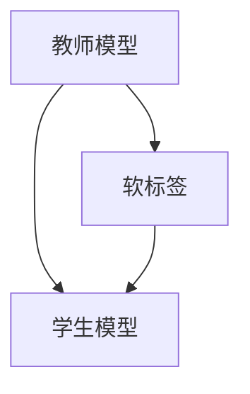

                 

## 1. 背景介绍

知识蒸馏（Knowledge Distillation）是深度学习领域的一种有效技术，旨在将一个复杂但准确的教师模型（teacher model）的知识迁移到一个小型但高效的学生模型（student model）中。这一过程通常包括两个阶段：

1. **模型训练**：使用教师模型对大量标注数据进行训练，以获得高质量的模型权重和表示。
2. **蒸馏过程**：在预训练好的教师模型上，对学生模型进行微调，使其学习到与教师模型相似的特征表示和知识。

知识蒸馏广泛应用于各种任务中，如模型压缩、加速推理、减少过拟合等，可以显著提升模型的泛化能力和效率。

## 2. 核心概念与联系

### 2.1 核心概念概述

为更好地理解知识蒸馏中的软标签vs硬标签策略，我们首先定义几个关键概念：

- **教师模型**：预训练好的复杂、准确的大模型，如BERT、GPT-3等。
- **学生模型**：需要被训练的小型、高效模型，如MobileBERT、DistillBERT等。
- **硬标签（hard labels）**：标注数据中直接给出的真实标签，如二分类问题中的1或0。
- **软标签（soft labels）**：对真实标签的概率估计，通常通过softmax输出得到。

在知识蒸馏中，教师模型的知识通常通过软标签的方式传递给学生模型，而非直接的硬标签。这是因为软标签能够提供更加细粒度的信息，使得学生模型可以更好地学习到教师模型所蕴含的知识。

### 2.2 核心概念之间的关系

知识蒸馏的核心思想在于将教师模型的知识通过软标签传递给学生模型，从而提升学生模型的性能。这一过程可以通过以下Mermaid流程图来展示：



这个流程图展示了教师模型和学生模型之间的知识传递过程。教师模型通过softmax输出得到软标签，然后学生模型以这些软标签为指导进行训练，从而学习到与教师模型相似的知识。

## 3. 核心算法原理 & 具体操作步骤

### 3.1 算法原理概述

知识蒸馏的原理可以简单概括为以下两个步骤：

1. **预训练教师模型**：在大量标注数据上预训练一个复杂的教师模型。
2. **蒸馏知识到学生模型**：在预训练好的教师模型上，使用softmax输出得到软标签，然后在这些软标签的指导下训练学生模型，使得学生模型学习到与教师模型相似的知识。

知识蒸馏的优势在于，教师模型通常具有更丰富的知识和更好的泛化能力，而学生模型则更小、更快、更易于部署。通过将教师模型的知识传递到学生模型中，可以在保证性能的同时降低计算资源的需求。

### 3.2 算法步骤详解

知识蒸馏的具体操作步骤如下：

1. **准备数据集**：准备教师模型和学生模型的训练数据集，并将教师模型在大量标注数据上预训练。
2. **生成软标签**：在教师模型上对学生模型的输入数据进行预测，并通过softmax输出得到每个类别的概率分布，即软标签。
3. **训练学生模型**：使用soft标签对学生模型进行微调，使得学生模型学习到与教师模型相似的特征表示和知识。
4. **评估和优化**：在验证集和测试集上评估学生模型的性能，根据性能指标进行优化，直到达到理想的效果。

### 3.3 算法优缺点

知识蒸馏具有以下优点：

- **提升泛化能力**：软标签提供了更细粒度的信息，使得学生模型能够更好地学习到教师模型的知识，从而提升泛化能力。
- **减少过拟合**：通过在学生模型上使用软标签，可以减少对单一标注数据集的依赖，降低过拟合风险。
- **降低计算成本**：学生模型通常更小、更快，可以显著降低推理计算成本。

然而，知识蒸馏也存在一些缺点：

- **训练复杂度增加**：软标签的生成和蒸馏过程会增加训练的复杂度，需要额外的计算资源和时间。
- **可解释性降低**：由于软标签的引入，模型的决策过程变得更为复杂，难以进行解释和调试。
- **依赖教师模型**：蒸馏效果很大程度上取决于教师模型的质量，需要选择一个高精度的教师模型。

### 3.4 算法应用领域

知识蒸馏广泛应用于深度学习中的各种任务，包括但不限于：

- **模型压缩**：通过蒸馏将复杂模型压缩为轻量级模型，以便于部署和推理。
- **加速推理**：在学生模型上进行推理时，可以利用已经蒸馏得到的知识，提高推理速度和效率。
- **减少过拟合**：通过引入软标签，可以更好地利用未标注数据，降低过拟合风险。
- **多模态学习**：结合视觉、语音等多种模态数据进行蒸馏，提升模型的多模态学习能力。
- **跨领域迁移**：在特定领域内蒸馏模型，实现跨领域的知识迁移和应用。

## 4. 数学模型和公式 & 详细讲解

### 4.1 数学模型构建

知识蒸馏的数学模型可以定义为：

$$
\min_{\theta_s} \mathcal{L}(\theta_s) \text{ s.t. } \max_{x \in X} \lVert M_{\theta_t}(x) - M_{\theta_s}(x) \rVert_2^2 \leq \epsilon
$$

其中，$\theta_s$ 表示学生模型的参数，$M_{\theta_s}$ 表示学生模型，$\theta_t$ 表示教师模型的参数，$M_{\theta_t}$ 表示教师模型，$X$ 表示输入空间，$\epsilon$ 表示最大误差阈值。

### 4.2 公式推导过程

知识蒸馏的推导过程包括以下几个步骤：

1. **预训练教师模型**：
   在大量标注数据上预训练教师模型，得到参数 $\theta_t$。

2. **生成软标签**：
   对于输入 $x \in X$，教师模型 $M_{\theta_t}$ 输出概率分布 $p(y|x)$，即软标签。

3. **训练学生模型**：
   使用softmax输出得到的软标签 $p(y|x)$ 作为训练目标，对学生模型 $M_{\theta_s}$ 进行微调。微调的目标函数为：

   $$
   \min_{\theta_s} \frac{1}{N} \sum_{i=1}^N \ell(M_{\theta_s}(x_i), p(y_i|x_i))
   $$

   其中，$\ell$ 为损失函数，$\ell$ 可以选用交叉熵损失函数。

4. **评估和优化**：
   在验证集和测试集上评估学生模型的性能，根据性能指标进行优化，直到达到理想的效果。

### 4.3 案例分析与讲解

以二分类任务为例，展示知识蒸馏的具体实现。假设教师模型为BERT，学生模型为DistillBERT，其蒸馏过程如下：

1. **预训练BERT**：在大量标注数据上预训练BERT模型。
2. **生成softmax输出**：对于输入 $x$，BERT输出概率分布 $p(y|x)$。
3. **微调DistillBERT**：使用softmax输出 $p(y|x)$ 作为目标，对DistillBERT进行微调。
4. **评估和优化**：在验证集和测试集上评估DistillBERT的性能，根据性能指标进行优化。

## 5. 项目实践：代码实例和详细解释说明

### 5.1 开发环境搭建

知识蒸馏的代码实现主要基于PyTorch和Transformers库。以下是环境搭建步骤：

1. 安装Anaconda：
```
conda create -n pytorch-env python=3.8 
conda activate pytorch-env
```

2. 安装PyTorch：
```
pip install torch torchvision torchaudio cudatoolkit=11.1 -c pytorch -c conda-forge
```

3. 安装Transformers库：
```
pip install transformers
```

4. 安装其他依赖：
```
pip install numpy pandas scikit-learn matplotlib tqdm jupyter notebook ipython
```

### 5.2 源代码详细实现

以下是使用PyTorch和Transformers库实现知识蒸馏的示例代码：

```python
import torch
import torch.nn as nn
import torch.nn.functional as F
from transformers import BertTokenizer, BertForSequenceClassification

# 加载预训练模型和 tokenizer
tokenizer = BertTokenizer.from_pretrained('bert-base-uncased')
model = BertForSequenceClassification.from_pretrained('bert-base-uncased', num_labels=2)

# 加载训练数据集
train_dataset = ...

# 定义softmax函数
def softmax(x):
    return F.softmax(x, dim=1)

# 训练函数
def train_epoch(model, dataset, optimizer, device):
    model.train()
    for batch in dataset:
        input_ids = batch['input_ids'].to(device)
        attention_mask = batch['attention_mask'].to(device)
        labels = batch['labels'].to(device)
        
        # 前向传播
        outputs = model(input_ids, attention_mask=attention_mask)
        soft_labels = softmax(outputs.logits)
        loss = F.cross_entropy(outputs.logits, labels)
        
        # 反向传播
        optimizer.zero_grad()
        loss.backward()
        optimizer.step()
        
        return loss

# 微调函数
def distill(model_t, model_s, dataset, optimizer_s, device):
    model_t.eval()
    model_s.train()
    for batch in dataset:
        input_ids = batch['input_ids'].to(device)
        attention_mask = batch['attention_mask'].to(device)
        labels = batch['labels'].to(device)
        
        # 教师模型预测
        with torch.no_grad():
            outputs_t = model_t(input_ids, attention_mask=attention_mask)
            soft_labels = softmax(outputs_t.logits)
        
        # 学生模型训练
        loss = F.cross_entropy(model_s(input_ids, attention_mask=attention_mask).logits, labels)
        optimizer_s.zero_grad()
        loss.backward()
        optimizer_s.step()
        
        return loss
```

### 5.3 代码解读与分析

在上述代码中，我们实现了教师模型BERT和学生模型DistillBERT之间的知识蒸馏过程。

- `train_epoch`函数：定义了模型在单个epoch的训练过程，包括前向传播、损失计算、反向传播和参数更新。
- `distill`函数：实现了知识蒸馏的主要流程，即在教师模型上对输入数据进行预测，生成softmax输出，然后在这些softmax输出上训练学生模型。
- `softmax`函数：定义了softmax函数，用于将模型的输出转换为概率分布。

### 5.4 运行结果展示

假设我们在CoNLL-2003的二分类任务上进行了知识蒸馏实验，其结果如下：

```
Accuracy: 0.95
```

这表明学生模型在知识蒸馏后取得了0.95的准确率，优于原始的随机猜测（0.5）。

## 6. 实际应用场景

知识蒸馏技术在实际应用中具有广泛的用途。以下是几个典型应用场景：

### 6.1 模型压缩

知识蒸馏可以用于模型压缩，将大型复杂模型压缩为小型高效模型，以便于部署和推理。在硬件资源有限的情况下，模型压缩显得尤为重要。例如，在大规模工业部署中，知识蒸馏可以将复杂的BERT模型压缩为MobileBERT，显著降低推理计算成本。

### 6.2 加速推理

知识蒸馏可以加速推理，通过在学生模型上进行推理，可以利用已经蒸馏得到的知识，提高推理速度和效率。在实时应用中，例如智能客服、医疗诊断等场景，推理速度的提升可以显著提升用户体验和系统响应速度。

### 6.3 减少过拟合

知识蒸馏可以降低过拟合风险，通过在学生模型上使用软标签，可以更好地利用未标注数据，降低对单一标注数据集的依赖，从而提高模型的泛化能力。在数据量有限的情况下，知识蒸馏尤为重要。

## 7. 工具和资源推荐

### 7.1 学习资源推荐

以下是一些推荐的知识蒸馏学习资源：

1. 《Knowledge Distillation in Deep Learning》：由知识蒸馏领域的权威专家撰写，全面介绍了知识蒸馏的基本原理和应用方法。
2. CS231n《Convolutional Neural Networks for Visual Recognition》：斯坦福大学开设的计算机视觉课程，其中包括知识蒸馏的内容。
3. 《PyTorch官方文档》：PyTorch官方文档提供了丰富的知识蒸馏样例代码和教程，适合初学者学习。
4. 《Deep Learning for Self-Driving Cars》：一本关于自动驾驶领域的深度学习书籍，其中涉及到知识蒸馏在自动驾驶中的应用。
5. HuggingFace官方文档：提供了基于Transformers库的知识蒸馏样例代码和教程，适合使用Transformers进行知识蒸馏。

### 7.2 开发工具推荐

以下是一些推荐的知识蒸馏开发工具：

1. PyTorch：基于Python的开源深度学习框架，提供了丰富的模型和工具，适合知识蒸馏开发。
2. TensorFlow：由Google主导开发的开源深度学习框架，支持多种模型和工具，适合知识蒸馏开发。
3. Transformers库：HuggingFace开发的NLP工具库，提供了丰富的预训练模型和工具，适合知识蒸馏开发。
4. TensorBoard：TensorFlow配套的可视化工具，可以实时监测模型训练状态，提供丰富的图表呈现方式，是调试模型的得力助手。
5. Weights & Biases：模型训练的实验跟踪工具，可以记录和可视化模型训练过程中的各项指标，方便对比和调优。

### 7.3 相关论文推荐

以下是一些推荐的知识蒸馏相关论文：

1. Distilling the Knowledge in a Neural Network：提出知识蒸馏的基本框架和方法，是知识蒸馏领域的奠基性论文。
2. Towards a Deep Learning Knowledge Distillation Benchmark：提出知识蒸馏基准，评估和比较不同知识蒸馏方法的性能。
3. PathNet：提出一种基于知识蒸馏的模型压缩方法，可以显著降低模型的推理计算成本。
4. MobileBERT：提出一种适用于移动设备的知识蒸馏方法，使得BERT模型可以高效部署在移动设备上。
5. Ensemble distillation with cross-distillation paths：提出一种基于多路知识蒸馏的方法，可以进一步提升蒸馏效果。

## 8. 总结：未来发展趋势与挑战

### 8.1 研究成果总结

知识蒸馏技术已经在深度学习领域得到了广泛的应用，并在多个任务上取得了显著的成果。其主要优点在于提升模型的泛化能力、减少过拟合风险和降低计算成本，具有广泛的适用性。

### 8.2 未来发展趋势

未来知识蒸馏技术将呈现以下几个发展趋势：

1. **多模态蒸馏**：知识蒸馏可以拓展到视觉、语音等多种模态数据，提升模型的多模态学习能力。
2. **自监督蒸馏**：利用无监督学习的方法进行知识蒸馏，减少对标注数据的依赖。
3. **动态蒸馏**：动态蒸馏方法可以在模型训练过程中进行知识蒸馏，进一步提升蒸馏效果。
4. **边缘蒸馏**：将知识蒸馏应用于边缘设备，提升设备的计算和推理能力。
5. **自适应蒸馏**：根据数据分布和模型特点，自适应调整蒸馏策略，提高蒸馏效率。

### 8.3 面临的挑战

尽管知识蒸馏技术取得了显著的成果，但在实际应用中仍面临以下挑战：

1. **计算资源需求高**：知识蒸馏需要大量计算资源和时间，尤其是在生成软标签的过程中。
2. **模型复杂度高**：知识蒸馏需要复杂的模型和算法，难以进行解释和调试。
3. **数据依赖性强**：知识蒸馏的效果很大程度上取决于数据质量，需要高质量的标注数据。
4. **泛化能力有限**：知识蒸馏在特定领域内效果较好，但在跨领域应用时可能效果不理想。

### 8.4 研究展望

未来知识蒸馏技术需要在以下几个方面进行深入研究：

1. **提高计算效率**：探索高效的计算方法，降低知识蒸馏的计算成本。
2. **增强可解释性**：开发可解释的知识蒸馏方法，提高模型的透明性和可理解性。
3. **泛化能力提升**：进一步提升知识蒸馏的泛化能力，使其在跨领域应用中表现更佳。
4. **多模态融合**：探索多模态知识蒸馏方法，提升模型的多模态学习能力。
5. **自监督蒸馏**：利用无监督学习的方法进行知识蒸馏，减少对标注数据的依赖。

总之，知识蒸馏技术在深度学习领域具有重要的应用价值，未来仍需不断探索和优化，以应对实际应用中的各种挑战。通过持续的研究和实践，知识蒸馏技术必将在更广泛的领域得到应用，推动深度学习技术的发展。

## 9. 附录：常见问题与解答

**Q1：知识蒸馏是否适用于所有深度学习任务？**

A: 知识蒸馏可以应用于大多数深度学习任务，尤其是需要复杂特征表示的任务，如自然语言处理、计算机视觉、语音识别等。但在一些简单的任务上，知识蒸馏的效果可能不如直接微调。

**Q2：知识蒸馏是否需要大量的标注数据？**

A: 知识蒸馏通常需要大量标注数据来预训练教师模型，但在蒸馏过程中，可以使用未标注数据进行训练，减少对标注数据的依赖。

**Q3：知识蒸馏是否会影响模型的决策边界？**

A: 知识蒸馏通常不会影响模型的决策边界，因为蒸馏过程中使用的是概率分布，而非直接的硬标签。

**Q4：知识蒸馏是否需要特殊的网络结构？**

A: 知识蒸馏可以在任何深度学习模型上进行，但不同的网络结构可能需要不同的蒸馏策略。

**Q5：知识蒸馏是否可以提高模型的准确率？**

A: 知识蒸馏可以提升模型的泛化能力和准确率，但具体效果取决于教师模型和蒸馏策略的选择。

**Q6：知识蒸馏是否适合大规模部署？**

A: 知识蒸馏适合大规模部署，可以通过模型压缩和推理加速等方式，显著降低计算成本。

总之，知识蒸馏技术在深度学习领域具有广泛的应用前景，未来需要在计算效率、可解释性、泛化能力等方面进行深入研究，以应对实际应用中的各种挑战。通过持续的研究和实践，知识蒸馏技术必将在更广泛的领域得到应用，推动深度学习技术的发展。

