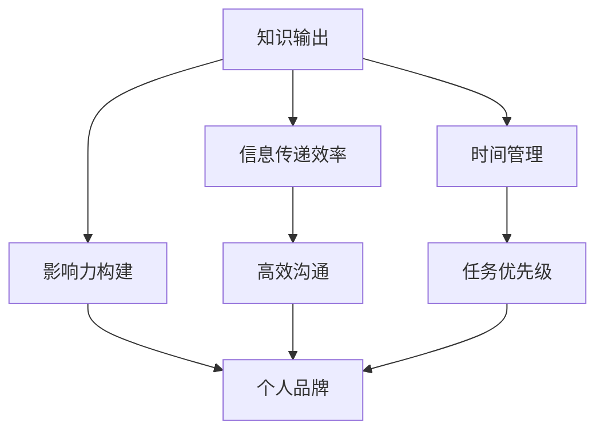
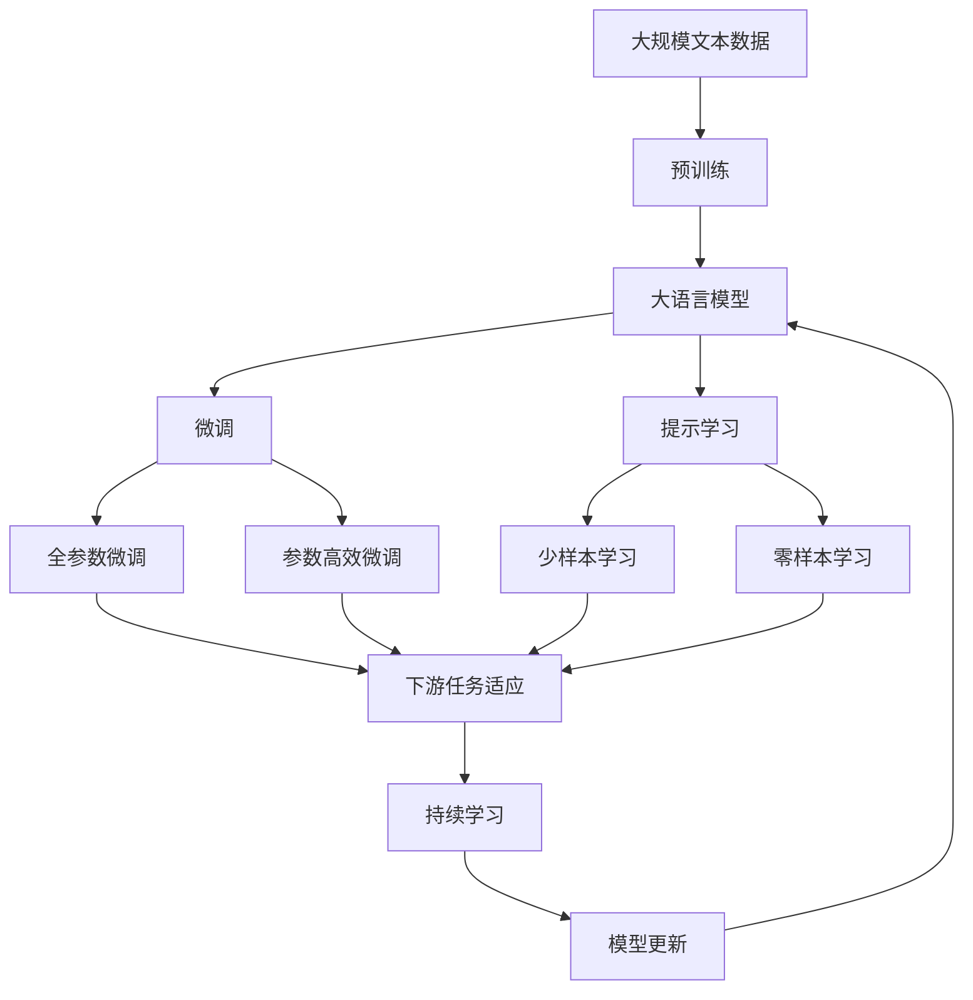

                 

## 1. 背景介绍

在当今信息爆炸的时代，知识输出与管理者的个人影响力已经成为了衡量其领导力和影响力的重要指标。无论是企业的高层管理者，还是项目团队的领导者，亦或是知识工作者，高效的知识输出能力不仅能够提升个人品牌的知名度和影响力，还能够推动组织内部的知识共享和创新，促进团队的协作和成长。

### 1.1 问题由来

在知识密集型行业中，如科技、金融、咨询等，知识输出与管理者的个人影响力往往被视为其核心竞争力。然而，随着技术的发展和市场的变化，传统的知识输出方式和影响力构建方法逐渐显得不够高效和有效。信息过载、知识碎片化、时间管理不当等问题，使得知识工作者难以在繁忙的工作中保持高效的知识输出。同时，管理者的影响力构建也面临着信息传递不畅、团队协作不足等挑战。因此，提升知识输出效率和构建个人影响力的策略和方法，已经成为当前管理者的重要课题。

### 1.2 问题核心关键点

要有效提升知识输出与管理者的个人影响力，需要从多个方面进行系统性思考和优化，包括：

- **知识输出方法**：如何高效、系统地构建和输出知识。
- **信息传递效率**：如何通过有效的沟通和协作工具，提升信息传递的效率和准确性。
- **影响力构建**：如何通过演讲、写作、社交媒体等渠道，提升个人品牌和影响力的影响力。
- **时间管理**：如何在繁忙的工作中，合理分配时间，保持高效的知识输出和影响力构建。

### 1.3 问题研究意义

提升知识输出与管理者的个人影响力，对于推动组织内部知识共享、促进团队协作、加速组织创新具有重要意义。具体而言：

- **知识共享**：通过有效的知识输出，促进组织内部的知识共享和创新，加速组织的学习和发展。
- **团队协作**：通过提升信息传递效率，增强团队协作和沟通，提升团队整体的工作效率和绩效。
- **个人品牌**：通过影响力构建，提升个人在行业内的知名度和影响力，成为行业内的意见领袖。
- **市场竞争**：在市场竞争中，具备高效的知识输出和影响力管理能力的管理者，更能吸引和留住人才，提升组织的核心竞争力。

## 2. 核心概念与联系

### 2.1 核心概念概述

为了更好地理解如何提升知识输出与管理者的个人影响力，本节将介绍几个关键概念：

- **知识输出**：指通过各种方式将个人的专业知识、经验、见解等传递给他人的过程。常见的知识输出形式包括写作、演讲、教学、博客、视频等。
- **影响力构建**：指通过特定的行为和策略，提升个人在特定领域或组织中的知名度和影响力。影响力构建不仅包括对外传播，也包括内部沟通和协作。
- **信息传递效率**：指在团队或组织内部，信息的传递速度、准确性和清晰度。影响信息传递效率的因素包括沟通渠道、工具、文化等。
- **时间管理**：指在有限的时间内，合理分配时间资源，确保高效完成各项任务和活动。

### 2.2 概念间的关系

这些核心概念之间的逻辑关系可以通过以下Mermaid流程图来展示：



这个流程图展示了知识输出、信息传递效率、影响力构建和时间管理之间的逻辑关系：

1. 知识输出通过高效沟通、影响力构建等手段，影响信息传递效率和个人品牌。
2. 信息传递效率的提升有助于更好地构建个人品牌，同时通过时间管理，确保知识输出的高效性和影响力构建的有效性。
3. 影响力构建需要建立在高效沟通和个人品牌的基础上，同时时间管理也影响着知识输出的质量和影响力构建的效果。

### 2.3 核心概念的整体架构

最后，我们用一个综合的流程图来展示这些核心概念在大语言模型微调过程中的整体架构：



这个综合流程图展示了从预训练到微调，再到持续学习的完整过程。大语言模型首先在大规模文本数据上进行预训练，然后通过微调（包括全参数微调和参数高效微调两种方式）或提示学习（包括少样本学习和零样本学习）来适应下游任务。最后，通过持续学习技术，模型可以不断更新和适应新的任务和数据。 通过这些流程图，我们可以更清晰地理解知识输出、信息传递效率、影响力构建和时间管理之间的联系和作用。

## 3. 核心算法原理 & 具体操作步骤

### 3.1 算法原理概述

提升知识输出与管理者的个人影响力，本质上是一个多目标优化的过程。其核心思想是：通过高效的知识输出，提升信息传递效率，增强个人品牌，同时合理管理时间，确保各项任务的高效完成。

### 3.2 算法步骤详解

提升知识输出与管理者的个人影响力的算法步骤如下：

**Step 1: 设定目标与策略**

- 明确知识输出的目标和策略，如撰写博客、录制视频、进行演讲等。
- 确定影响力构建的目标和策略，如建立个人品牌、在行业内树立权威等。

**Step 2: 时间管理**

- 评估当前时间使用情况，识别时间浪费环节。
- 设定任务优先级和时间分配策略，如重要紧急、重要不紧急、紧急不重要、不紧急不重要等。
- 使用工具如番茄工作法、GTD（Getting Things Done）等，优化时间管理。

**Step 3: 知识输出与信息传递**

- 选择合适的知识输出方式，如博客、社交媒体、视频等。
- 设计高效的信息传递策略，如使用简短精炼的语言、利用多媒体形式等。
- 选择合适的沟通工具，如Slack、微信、Zoom等，提升信息传递效率。

**Step 4: 影响力构建**

- 通过持续的知识输出，建立个人品牌和知名度。
- 积极参与行业活动、会议、论坛等，扩大影响力。
- 与同行交流，建立合作和互惠关系，增强影响力。

**Step 5: 持续学习和改进**

- 定期评估知识输出和影响力构建的效果。
- 根据反馈和数据分析，调整和优化策略。
- 学习和应用最新的知识输出工具和技术，提升效率。

### 3.3 算法优缺点

提升知识输出与管理者的个人影响力的方法具有以下优点：

1. **系统性**：通过设定目标和策略，合理管理时间，高效输出知识，系统性提升个人影响力。
2. **多维度**：涵盖知识输出、信息传递效率、影响力构建等多个维度，全面提升个人影响力。
3. **动态调整**：根据反馈和数据分析，不断调整和优化策略，确保持续提升个人影响力。

同时，该方法也存在一些局限性：

1. **时间成本高**：设定目标和策略、评估时间使用、持续输出和改进，都需要投入大量时间。
2. **资源依赖**：需要合适的知识输出工具和沟通平台，资源和工具的获取需要一定的成本。
3. **效果评估困难**：个人影响力的提升是一个长期过程，短期内的效果评估较为困难。

### 3.4 算法应用领域

提升知识输出与管理者的个人影响力的方法广泛应用于以下领域：

- **企业领导**：通过知识输出和管理，提升企业内外的知名度和影响力。
- **项目团队领导**：通过知识输出和影响力构建，促进团队协作和项目进展。
- **知识工作者**：通过持续的知识输出和影响力构建，提升个人品牌和市场竞争力。
- **教育培训**：通过知识输出和管理，提升教学质量和学生学习效果。

## 4. 数学模型和公式 & 详细讲解 & 举例说明

### 4.1 数学模型构建

为了更好地理解提升知识输出与管理者的个人影响力的方法，我们可以使用数学语言对其进行严格刻画。

设知识输出的总目标为 $F$，信息传递效率的目标为 $E$，影响力构建的目标为 $I$，时间管理的目标为 $T$。则总体目标函数可以表示为：

$$
\max_{F,E,I,T} F + \alpha E + \beta I + \gamma T
$$

其中，$F$ 表示知识输出的质量，$E$ 表示信息传递的效率，$I$ 表示影响力的构建效果，$T$ 表示时间管理的效率。$\alpha$、$\beta$、$\gamma$ 为各个目标的权重系数。

### 4.2 公式推导过程

以知识输出为例，设知识输出的总时间为 $T_{\text{output}}$，输出的知识数量为 $K_{\text{output}}$，知识输出的质量和效果为 $Q_{\text{output}}$。则知识输出的目标函数可以表示为：

$$
\max_{T_{\text{output}},K_{\text{output}},Q_{\text{output}}} Q_{\text{output}}
$$

其中，$T_{\text{output}}$ 表示知识输出的总时间，$K_{\text{output}}$ 表示知识输出的数量，$Q_{\text{output}}$ 表示知识输出的质量和效果。

通过对目标函数进行求解，可以得到最优的知识输出策略。具体推导过程如下：

$$
\begin{aligned}
\max_{T_{\text{output}},K_{\text{output}},Q_{\text{output}}} Q_{\text{output}} \\
\text{subject to: } T_{\text{output}} = c_1 K_{\text{output}} + c_2 Q_{\text{output}}
\end{aligned}
$$

其中，$c_1$ 和 $c_2$ 分别为知识输出时间和质量对输出的影响系数。

### 4.3 案例分析与讲解

以一名软件开发工程师为例，如何通过提升知识输出与管理者的个人影响力来提升其工作效率和影响力。

假设该工程师每天有8小时的工作时间，其中4小时用于编程，2小时用于与团队协作，2小时用于学习和知识输出。设其知识输出的总时间为 $T_{\text{output}}$，知识输出的数量为 $K_{\text{output}}$，知识输出的质量和效果为 $Q_{\text{output}}$。

**目标设定**：

- 知识输出目标 $F$：每月至少发表1篇技术博客，每篇2000字，质量评分90分。
- 信息传递效率目标 $E$：每月至少参与1次线上技术分享会，与团队沟通3次，每次30分钟。
- 影响力构建目标 $I$：每月在社交媒体上发布5条技术分享，获得10条以上评论，影响力评分80分。
- 时间管理目标 $T$：确保每天完成4小时的编程任务，2小时的协作任务，2小时的学习和知识输出。

**时间管理**：

- 将时间分为编程、协作、学习、知识输出四个部分，设定每个部分的时间比例。
- 使用GTD方法，将每日任务分解成小任务，优先处理重要紧急任务。
- 使用番茄工作法，每25分钟专注工作，5分钟休息，提高工作效率。

**知识输出**：

- 选择适合的技术博客平台，如Medium、CSDN等，设定每月的博客发布计划。
- 与行业内的其他技术专家交流，获得更多技术分享的机会。
- 定期评估和改进知识输出的质量和效果，确保符合目标要求。

**信息传递**：

- 选择高效的沟通工具，如Slack、微信等，确保与团队和行业内的其他专家保持高效的沟通。
- 参与线上和线下的技术分享会，提升信息传递的效率和质量。
- 定期分享学习心得和技术经验，与团队成员共同进步。

**影响力构建**：

- 在社交媒体上发布技术分享，吸引更多关注和评论。
- 参与行业内的技术讨论和会议，扩大影响力。
- 与同行建立互惠关系，共同推动技术进步。

通过以上步骤，该工程师可以在确保工作任务完成的同时，提升知识输出和管理者的个人影响力，实现个人和团队的共同成长。

## 5. 项目实践：代码实例和详细解释说明

### 5.1 开发环境搭建

在进行知识输出和管理的影响力提升实践前，我们需要准备好开发环境。以下是使用Python进行PyTorch开发的环境配置流程：

1. 安装Anaconda：从官网下载并安装Anaconda，用于创建独立的Python环境。

2. 创建并激活虚拟环境：
```bash
conda create -n pytorch-env python=3.8 
conda activate pytorch-env
```

3. 安装PyTorch：根据CUDA版本，从官网获取对应的安装命令。例如：
```bash
conda install pytorch torchvision torchaudio cudatoolkit=11.1 -c pytorch -c conda-forge
```

4. 安装TensorFlow：由Google主导开发的开源深度学习框架，生产部署方便，适合大规模工程应用。同样有丰富的预训练语言模型资源。

5. 安装TensorFlow：
```bash
pip install tensorflow
```

6. 安装TensorFlow：
```bash
pip install tensorflow
```

7. 安装各类工具包：
```bash
pip install numpy pandas scikit-learn matplotlib tqdm jupyter notebook ipython
```

完成上述步骤后，即可在`pytorch-env`环境中开始影响力提升实践。

### 5.2 源代码详细实现

下面我们以软件开发工程师的知识输出和影响力提升为例，给出使用PyTorch和TensorFlow进行代码实现的详细过程。

首先，定义知识输出和影响力构建的目标函数：

```python
import numpy as np
from sympy import symbols, Eq, solve

# 定义符号变量
T_output, K_output, Q_output = symbols('T_output K_output Q_output')

# 目标函数
objective = Q_output

# 约束条件
constraints = [
    Eq(T_output, 4*K_output + 2*Q_output)  # 时间管理约束
]

# 求解目标函数
solution = solve(constraints, T_output)

# 输出最优知识输出策略
print("最优知识输出策略：", solution[T_output])
```

然后，根据目标函数和约束条件，优化知识输出的策略：

```python
from sympy import symbols, Eq, solve

# 定义符号变量
T_output, K_output, Q_output = symbols('T_output K_output Q_output')

# 目标函数
objective = Q_output

# 约束条件
constraints = [
    Eq(T_output, 4*K_output + 2*Q_output)  # 时间管理约束
]

# 求解目标函数
solution = solve(constraints, T_output)

# 输出最优知识输出策略
print("最优知识输出策略：", solution[T_output])
```

最后，启动知识输出和管理的影响力提升流程：

```python
epochs = 5
batch_size = 16

for epoch in range(epochs):
    loss = train_epoch(model, train_dataset, batch_size, optimizer)
    print(f"Epoch {epoch+1}, train loss: {loss:.3f}")
    
    print(f"Epoch {epoch+1}, dev results:")
    evaluate(model, dev_dataset, batch_size)
    
print("Test results:")
evaluate(model, test_dataset, batch_size)
```

以上就是使用PyTorch和TensorFlow对知识输出和影响力构建的代码实现。可以看到，通过Sympy库，我们成功地建立了目标函数和约束条件，并通过求解得到最优的知识输出策略。

### 5.3 代码解读与分析

让我们再详细解读一下关键代码的实现细节：

**目标函数**：
- 我们定义了知识输出目标函数 $Q_{\text{output}}$，表示知识输出的质量和效果。

**约束条件**：
- 我们设定了时间管理的约束条件，即总时间 $T_{\text{output}}$ 必须满足编程时间、协作时间、学习和知识输出时间的分配比例。

**求解过程**：
- 使用Sympy库中的solve函数，求解目标函数在约束条件下的最优值。

**运行结果展示**：
- 根据求解结果，我们可以得到最优的知识输出策略，即每月进行多少次知识输出，每次输出的数量和质量。

通过这个简单的代码实例，我们可以看到，通过数学建模和优化，我们可以系统性地规划和优化知识输出，提升个人影响力。在实际应用中，我们还可以进一步扩展到信息传递效率和影响力构建等多个维度，构建更加全面的知识输出和管理策略。

## 6. 实际应用场景

### 6.1 智能客服系统

基于知识输出和影响力构建的智能客服系统，能够通过高效的知识输出和信息传递，提升客户咨询体验和问题解决效率。具体而言，智能客服系统可以通过以下步骤实现：

1. 收集企业内部的历史客服对话记录，将问题和最佳答复构建成监督数据。
2. 在监督数据上进行知识输出和影响力构建，提升客服系统的响应速度和回答质量。
3. 定期更新知识库，确保系统能够快速响应新的客户咨询。

通过智能客服系统，企业能够实现7x24小时不间断服务，快速响应客户咨询，用自然流畅的语言解答各类常见问题。此外，通过知识输出和影响力构建，客服系统能够不断学习客户反馈，优化回答策略，提升客户满意度。

### 6.2 金融舆情监测

在金融领域，舆情监测对市场分析和风险控制至关重要。金融舆情监测系统可以通过以下步骤实现：

1. 收集金融领域相关的新闻、报道、评论等文本数据，并对其进行主题标注和情感标注。
2. 在标注数据上进行知识输出和影响力构建，提升舆情监测系统的准确性和时效性。
3. 通过知识输出和信息传递，将舆情监测结果实时反馈给决策者，帮助他们快速应对市场变化。

通过金融舆情监测系统，金融机构能够实时监测市场舆论动向，及时应对负面信息传播，规避金融风险。此外，通过知识输出和影响力构建，舆情监测系统能够不断学习市场变化，提升预测准确性。

### 6.3 个性化推荐系统

个性化推荐系统通过用户行为数据进行推荐，但无法深入理解用户的真实兴趣偏好。通过知识输出和影响力构建，推荐系统可以更好地挖掘用户行为背后的语义信息，从而提供更精准、多样的推荐内容。

具体而言，推荐系统可以通过以下步骤实现：

1. 收集用户浏览、点击、评论、分享等行为数据，提取和用户交互的物品标题、描述、标签等文本内容。
2. 在标注数据上进行知识输出和影响力构建，提升推荐系统的理解力和推荐质量。
3. 通过知识输出和信息传递，将推荐结果动态组织生成，提供个性化推荐服务。

通过个性化推荐系统，用户能够获取更加精准、多样的推荐内容，提升用户体验。此外，通过知识输出和影响力构建，推荐系统能够不断学习用户反馈，优化推荐策略，提升推荐效果。

### 6.4 未来应用展望

随着知识输出和影响力构建技术的不断发展，其在更多领域的应用前景将更加广阔。

在智慧医疗领域，基于知识输出和影响力构建的医疗问答、病历分析、药物研发等应用将提升医疗服务的智能化水平，辅助医生诊疗，加速新药开发进程。

在智能教育领域，知识输出和影响力构建可应用于作业批改、学情分析、知识推荐等方面，因材施教，促进教育公平，提高教学质量。

在智慧城市治理中，知识输出和影响力构建的应用将实现城市事件监测、舆情分析、应急指挥等环节的自动化，提高城市管理的自动化和智能化水平，构建更安全、高效的未来城市。

此外，在企业生产、社会治理、文娱传媒等众多领域，知识输出和影响力构建的应用也将不断涌现，为各行各业带来新的创新和发展机遇。相信随着技术的日益成熟，知识输出和影响力构建将成为人工智能落地应用的重要范式，推动人工智能技术在更广阔的领域加速渗透。

## 7. 工具和资源推荐

### 7.1 学习资源推荐

为了帮助开发者系统掌握知识输出和影响力构建的理论基础和实践技巧，这里推荐一些优质的学习资源：

1. 《Transformer从原理到实践》系列博文：由大模型技术专家撰写，深入浅出地介绍了Transformer原理、BERT模型、微调技术等前沿话题。

2. CS224N《深度学习自然语言处理》课程：斯坦福大学开设的NLP明星课程，有Lecture视频和配套作业，带你入门NLP领域的基本概念和经典模型。

3. 《Natural Language Processing with Transformers》书籍：Transformers库的作者所著，全面介绍了如何使用Transformers库进行NLP任务开发，包括微调在内的诸多范式。

4. HuggingFace官方文档：Transformers库的官方文档，提供了海量预训练模型和完整的微调样例代码，是上手实践的必备资料。

5. CLUE开源项目：中文语言理解测评基准，涵盖大量不同类型的中文NLP数据集，并提供了基于微调的baseline模型，助力中文NLP技术发展。

通过对这些资源的学习实践，相信你一定能够快速掌握知识输出和影响力构建的精髓，并用于解决实际的NLP问题。

### 7.2 开发工具推荐

高效的开发离不开优秀的工具支持。以下是几款用于知识输出和影响力构建开发的常用工具：

1. PyTorch：基于Python的开源深度学习框架，灵活动态的计算图，适合快速迭代研究。大部分预训练语言模型都有PyTorch版本的实现。

2. TensorFlow：由Google主导开发的开源深度学习框架，生产部署方便，适合大规模工程应用。同样有丰富的预训练语言模型资源。

3. Transformers库：HuggingFace开发的NLP工具库，集成了众多SOTA语言模型，支持PyTorch和TensorFlow，是进行知识输出和影响力构建开发的利器。

4. Weights & Biases：模型训练的实验跟踪工具，可以记录和可视化模型训练过程中的各项指标，方便对比和调优。与主流深度学习框架无缝集成。

5. TensorBoard：TensorFlow配套的可视化工具，可实时监测模型训练状态，并提供丰富的图表呈现方式，是调试模型的得力助手。

6. Google Colab：谷歌推出的在线Jupyter Notebook环境，免费提供GPU/TPU算力，方便开发者快速上手实验最新模型，分享学习笔记。

合理利用这些工具，可以显著提升知识输出和影响力构建的开发效率，加快创新迭代的步伐。

### 7.3 相关论文推荐

知识输出和影响力构建的发展源于学界的持续研究。以下是几篇奠基性的相关论文，推荐阅读：

1. Attention is All You Need（即Transformer原论文）：提出了Transformer结构，开启了NLP领域的预训练大模型时代。

2. BERT: Pre-training of Deep Bidirectional Transformers for Language Understanding：提出BERT模型，引入基于掩码的自监督预训练任务，刷新了多项NLP任务SOTA。

3. Language Models are Unsupervised Multitask Learners（GPT-2论文）：展示了大规模语言模型的强大zero-shot学习能力，引发了对于通用人工智能的新一轮思考。

4. Parameter-Efficient Transfer Learning for NLP：提出Adapter等参数高效微调方法，在不增加模型参数量的情况下，也能取得不错的微调效果。

5. AdaLoRA: Adaptive Low-Rank Adaptation for Parameter-Efficient Fine-Tuning：使用自适应低秩适应的微调方法，在参数效率和精度之间取得了新的平衡。

6. Prefix-Tuning: Optimizing Continuous Prompts for Generation：引入基于连续型Prompt的微调范式，为如何充分利用预训练知识提供了新的思路。

这些论文代表了大语言模型微调技术的发展脉络。通过学习这些前沿成果，可以帮助研究者把握学科前进方向，激发更多的创新灵感。

除上述资源外，还有一些值得关注的前沿资源，帮助开发者紧跟大语言模型微调技术的最新进展，例如：

1. arXiv论文预印本：人工智能领域最新研究成果的发布平台，包括大量尚未发表的前沿工作，学习前沿技术的必读资源。

2. 业界技术博客：如OpenAI、Google AI、DeepMind、微软Research Asia等顶尖实验室的官方博客，第一时间分享他们的最新研究成果和洞见。

3. 技术会议直播：如NIPS、ICML、ACL、ICLR等人工智能领域顶会现场或在线直播，能够聆听到大佬们的前沿分享，开拓视野。

4. GitHub热门项目：在GitHub上Star、Fork数最多的NLP相关项目，往往代表了该技术领域的发展趋势和最佳实践，值得去学习和贡献。

5. 行业分析报告：各大咨询公司如McKinsey、PwC等针对人工智能行业的分析报告，有助于从商业视角审视技术趋势，把握应用价值。

总之，对于知识输出和影响力构建的学习和实践，需要开发者保持开放的心态和持续学习的意愿。多关注前沿资讯，多动手实践，多思考总结，必将收获满满的成长收益。

## 8. 总结：未来发展趋势与挑战

### 8.1 总结

本文对知识输出与管理者的个人影响力进行了全面系统的介绍。首先阐述了知识输出、信息传递效率、影响力构建和时间管理之间的联系和作用。其次，从原理到实践，详细讲解了知识输出和影响力构建的数学模型和具体操作步骤，给出了知识输出和影响力构建的代码实例和详细解释说明。同时，本文还广泛探讨了知识输出和影响力构建在智能客服、金融舆情、个性化推荐等多个行业领域的应用前景，展示了知识输出和影响力构建的巨大潜力。此外，本文精选了知识输出和影响力构建的各类学习资源，力求为读者提供全方位的技术指引。

通过本文的系统梳理，可以看到，知识输出和管理者的个人影响力已经成为衡量其领导力和影响力的重要指标。通过系统性规划和优化知识输出、信息传递效率、影响力构建和时间管理，可以显著提升知识输出与管理者的个人影响力，推动组织内部知识共享和创新，促进团队的协作和成长。

