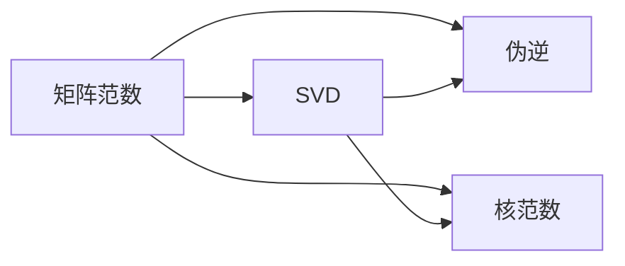
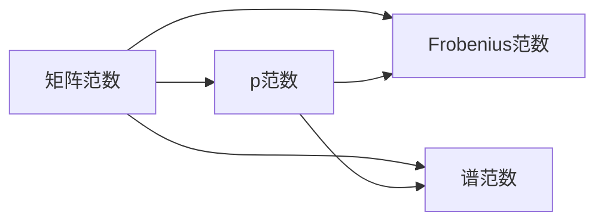
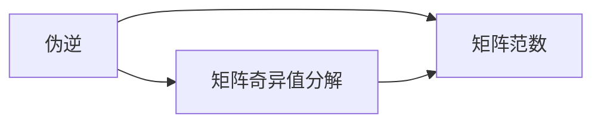
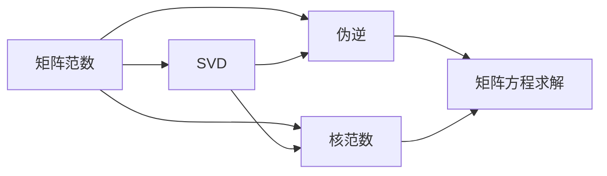

                 

## 1. 背景介绍

在当今的科学和工程领域中，矩阵是描述许多实际问题的核心工具，从数据科学到信号处理，从物理学到机器学习，都无处不在。矩阵的范数，作为描述矩阵大小的重要概念，在理解和分析矩阵方面扮演着关键角色。然而，传统的矩阵范数理论往往局限于特定的维度和操作，无法完全适应复杂的、非线性的矩阵结构。因此，发展更为通用和灵活的矩阵范数概念，是当前矩阵理论研究的重要方向。本文将探讨广义矩阵范数及其补充，并深入分析其应用价值。

### 1.1 问题由来

矩阵范数的理论研究可以追溯到20世纪初的数学家Hilbert和Banach。然而，随着计算机科学和数据科学的迅猛发展，现有的矩阵范数理论已无法完全适应当前复杂矩阵处理的需求。特别是在处理高维数据、非线性矩阵以及稀疏矩阵等新型矩阵结构时，传统矩阵范数理论显得力不从心。为应对这一挑战，研究者们提出了广义矩阵范数概念，试图从更广泛的角度来描述和分析矩阵，从而更好地服务于实际问题。

### 1.2 问题核心关键点

广义矩阵范数和矩阵范数的补充研究涉及以下几个核心关键点：

- **广义矩阵范数**：一种更广泛、更灵活的矩阵范数定义，可以涵盖传统矩阵范数，同时适应更多类型的矩阵结构，包括高维、非线性、稀疏矩阵等。
- **矩阵范数的补充**：包括奇异值分解(SVD)、伪逆、核范数等概念的补充和推广，为处理特殊矩阵结构提供更强大的工具。
- **理论意义与应用价值**：广义矩阵范数及其补充在理论研究和实际应用中均具有重要意义，广泛应用于数据科学、信号处理、机器学习等领域。

这些核心关键点共同构成了广义矩阵范数及其补充的研究框架，旨在拓展矩阵理论的应用边界，提升矩阵处理技术的通用性和效率。

### 1.3 问题研究意义

研究广义矩阵范数及其补充的理论意义和应用价值，对于推动矩阵理论的发展，解决复杂矩阵问题，具有重要意义：

1. **提升矩阵处理能力**：广义矩阵范数及其补充提供了一套更强大、更灵活的矩阵分析工具，使得矩阵处理能够适应更为复杂的数据结构和问题模型。
2. **促进跨领域应用**：矩阵理论在多个学科中具有广泛应用，广义矩阵范数及其补充的普及，将有助于提升这些领域中的数据处理和分析能力。
3. **推动理论创新**：广义矩阵范数及其补充的理论研究，将推动矩阵理论本身的创新发展，为未来的理论探索提供新的方向。
4. **加速实际应用**：理论上的创新将直接促进实际应用的突破，推动机器学习、数据科学等领域的发展进程。

## 2. 核心概念与联系

### 2.1 核心概念概述

为更好地理解广义矩阵范数及其补充，本节将介绍几个关键概念：

- **矩阵范数**：衡量矩阵大小的数学工具，通常分为$p$范数、Frobenius范数、谱范数等，用于描述矩阵的大小和性质。
- **奇异值分解(SVD)**：将矩阵分解为三个矩阵的乘积形式，揭示矩阵的奇异值和奇异向量，常用于矩阵压缩和降维。
- **伪逆**：在矩阵奇异值分解的基础上，通过奇异值选取和截断，获得矩阵的逆矩阵近似，常用于矩阵方程求解。
- **核范数**：一种特殊的矩阵范数，常用于低秩矩阵的优化问题，如矩阵压缩、秩最小化等。

这些概念之间的关系可以通过以下Mermaid流程图来展示：



这个流程图展示了矩阵范数、奇异值分解、伪逆和核范数之间的联系：

1. 矩阵范数是衡量矩阵大小的基底概念。
2. 奇异值分解和伪逆是矩阵分解的重要工具，基于矩阵范数理论。
3. 核范数是矩阵范数的一种特殊形式，适用于特定的矩阵优化问题。

### 2.2 概念间的关系

这些核心概念之间存在着紧密的联系，形成了矩阵分析的理论框架。下面我们通过几个Mermaid流程图来展示这些概念之间的关系。

#### 2.2.1 矩阵范数的分类



这个流程图展示了矩阵范数的几种主要形式：

1. $p$范数、Frobenius范数和谱范数是矩阵范数的几种主要类型。
2. $p$范数适用于不同权重的矩阵大小衡量，Frobenius范数适用于欧几里得空间的矩阵大小衡量，谱范数适用于矩阵的谱特征测量。

#### 2.2.2 奇异值分解与矩阵范数


这个流程图展示了奇异值分解和矩阵范数之间的关系：

1. 奇异值分解是矩阵范数理论的基础，通过分解矩阵揭示其奇异值和奇异向量。
2. 矩阵范数用于衡量奇异值分解后的矩阵大小，为矩阵压缩和降维提供依据。

#### 2.2.3 伪逆与矩阵范数



这个流程图展示了伪逆和矩阵范数之间的关系：

1. 伪逆基于矩阵奇异值分解，通过奇异值截断获得矩阵的逆矩阵近似。
2. 矩阵范数用于衡量伪逆的精度，为矩阵方程求解提供标准。

#### 2.2.4 核范数与矩阵范数


这个流程图展示了核范数和矩阵范数之间的关系：

1. 核范数是矩阵范数的一种特殊形式，适用于低秩矩阵的优化问题。
2. 矩阵范数用于衡量核范数的精度，为低秩矩阵求解提供标准。

### 2.3 核心概念的整体架构

最后，我们用一个综合的流程图来展示这些核心概念在矩阵分析中的整体架构：



这个综合流程图展示了从矩阵范数到奇异值分解、伪逆、核范数的完整过程：

1. 矩阵范数是衡量矩阵大小和性质的基底概念。
2. 奇异值分解揭示矩阵的奇异值和奇异向量，为矩阵压缩和降维提供工具。
3. 伪逆基于奇异值分解，获得矩阵的逆矩阵近似，用于矩阵方程求解。
4. 核范数是矩阵范数的一种特殊形式，适用于低秩矩阵的优化问题。

这些概念共同构成了矩阵分析的理论框架，使得矩阵处理能够适应更为复杂的数据结构和问题模型。

## 3. 核心算法原理 & 具体操作步骤
### 3.1 算法原理概述

广义矩阵范数的核心思想是在传统矩阵范数的基础上，通过引入新的范数计算方法和更广泛的矩阵结构，从而描述和分析不同类型的矩阵。其算法原理主要包括以下几个步骤：

1. **范数定义扩展**：在传统矩阵范数的基础上，引入新的范数计算方法和数学模型，适应更多类型的矩阵结构。
2. **范数计算算法**：开发新的计算算法，高效计算广义矩阵范数。
3. **矩阵分析应用**：基于广义矩阵范数，分析各类矩阵的性质和优化问题。

### 3.2 算法步骤详解

广义矩阵范数的计算步骤主要包括以下几个环节：

1. **范数定义**：引入新的范数计算方法和数学模型，适应更多类型的矩阵结构。例如，对于非线性矩阵，可以引入基于拓扑映射的范数定义；对于稀疏矩阵，可以引入基于稀疏度的范数定义。
2. **范数计算**：开发新的计算算法，高效计算广义矩阵范数。例如，基于随机投影的方法，可以高效计算大尺度矩阵的广义范数。
3. **矩阵分析**：基于广义矩阵范数，分析各类矩阵的性质和优化问题。例如，使用广义矩阵范数优化低秩矩阵压缩问题，提升矩阵压缩效率。

### 3.3 算法优缺点

广义矩阵范数及其补充方法具有以下优点：

1. **适应性强**：能够适应更多类型的矩阵结构，包括高维、非线性、稀疏矩阵等。
2. **计算效率高**：开发了高效的计算算法，如基于随机投影的方法，能够快速计算大尺度矩阵的范数。
3. **理论基础扎实**：建立在传统矩阵范数理论的基础上，具有坚实的数学基础。

同时，广义矩阵范数及其补充方法也存在以下缺点：

1. **计算复杂度高**：对于某些特定类型的矩阵，计算广义范数的复杂度可能较高。
2. **理论完备性有待提升**：广义矩阵范数的理论体系尚未完全成熟，部分理论问题仍有待研究。
3. **应用场景受限**：部分广义矩阵范数的计算和应用场景仍需进一步验证和拓展。

### 3.4 算法应用领域

广义矩阵范数及其补充方法在多个领域具有广泛的应用价值：

1. **数据科学**：用于数据压缩、降维、特征选择等，提升数据处理效率和效果。
2. **信号处理**：用于信号去噪、降噪、稀疏编码等，提升信号处理效果。
3. **机器学习**：用于低秩矩阵优化、矩阵方程求解等，提升机器学习模型的性能。
4. **物理学**：用于量子态描述、哈密顿量矩阵优化等，提升物理问题的求解效率。
5. **计算机视觉**：用于图像处理、视频分析等，提升计算机视觉任务的准确性和效率。

这些应用领域展示了广义矩阵范数及其补充方法在实际问题中的广泛应用价值。

## 4. 数学模型和公式 & 详细讲解  
### 4.1 数学模型构建

广义矩阵范数的数学模型构建主要基于矩阵的奇异值分解(SVD)和矩阵的伪逆概念。假设矩阵 $A \in \mathbb{R}^{m \times n}$，其奇异值分解为 $A = U \Sigma V^T$，其中 $U \in \mathbb{R}^{m \times m}$ 和 $V \in \mathbb{R}^{n \times n}$ 为正交矩阵，$\Sigma \in \mathbb{R}^{m \times n}$ 为对角矩阵，对角线上的元素为矩阵 $A$ 的奇异值。

广义矩阵范数的定义为：

$$
\|A\|_G = \max_{x \in \mathbb{R}^n} \frac{\|A x\|_p}{\|x\|_q}
$$

其中 $\|x\|_p$ 为 $p$ 范数，$\|A x\|_p$ 为矩阵 $A$ 对向量 $x$ 的线性变换后的 $p$ 范数，$\|x\|_q$ 为 $q$ 范数。

### 4.2 公式推导过程

以下我们以核范数为例，推导其计算公式。

核范数的定义为：

$$
\|A\|_{\text{nuc}} = \max_{x \in \mathbb{R}^n} \min_{y \in \mathbb{R}^m} \frac{\langle Ax, y \rangle}{\|x\|_2 \|y\|_2}
$$

其中 $\langle \cdot, \cdot \rangle$ 为内积，$\| \cdot \|_2$ 为2范数。

为了计算核范数，我们将其转化为求解以下优化问题：

$$
\min_{y \in \mathbb{R}^m} \frac{\|Ax\|_2}{\|x\|_2}
$$

其中 $x$ 为矩阵 $A$ 的某一列向量。设 $x = \Sigma v_i$，其中 $v_i$ 为矩阵 $\Sigma$ 的对角线上的一个元素，则上式可以进一步转化为：

$$
\min_{y \in \mathbb{R}^m} \frac{\|U \Sigma v_i y\|_2}{\|v_i\|_2}
$$

由于 $U$ 为正交矩阵，上式可以进一步简化为：

$$
\min_{y \in \mathbb{R}^m} \|y\|_2
$$

最终，核范数的计算公式为：

$$
\|A\|_{\text{nuc}} = \sum_{i=1}^r \sigma_i
$$

其中 $\sigma_i$ 为矩阵 $A$ 的奇异值。

### 4.3 案例分析与讲解

以下我们以矩阵压缩为例，探讨广义矩阵范数的应用。

假设矩阵 $A \in \mathbb{R}^{m \times n}$ 的广义范数为 $\|A\|_G$，则矩阵压缩的目标是找到一个低秩矩阵 $B$，使得 $\|B - A\|_G$ 最小化。

具体而言，假设 $A$ 的奇异值分解为 $A = U \Sigma V^T$，其中 $U \in \mathbb{R}^{m \times m}$ 和 $V \in \mathbb{R}^{n \times n}$ 为正交矩阵，$\Sigma \in \mathbb{R}^{m \times n}$ 为对角矩阵，对角线上的元素为矩阵 $A$ 的奇异值。

定义低秩矩阵 $B$ 为 $B = UV_{\text{trunc}}$，其中 $V_{\text{trunc}}$ 为奇异值矩阵 $\Sigma$ 的前 $r$ 个奇异值组成的矩阵。

则矩阵压缩的优化目标为：

$$
\min_{B} \|B - A\|_G
$$

将 $B$ 代入上式，得：

$$
\min_{B} \|U(V_{\text{trunc}} - \Sigma) V^T\|_G
$$

由于 $U$ 和 $V^T$ 为正交矩阵，上式可以进一步简化为：

$$
\min_{B} \|V_{\text{trunc}} - \Sigma\|_G
$$

因此，矩阵压缩的目标变为最小化奇异值矩阵 $V_{\text{trunc}}$ 与奇异值矩阵 $\Sigma$ 的广义范数差。

## 5. 项目实践：代码实例和详细解释说明
### 5.1 开发环境搭建

在进行广义矩阵范数及其补充方法的实践前，我们需要准备好开发环境。以下是使用Python进行NumPy和SciPy开发的环境配置流程：

1. 安装Anaconda：从官网下载并安装Anaconda，用于创建独立的Python环境。

2. 创建并激活虚拟环境：
```bash
conda create -n matrix-env python=3.8 
conda activate matrix-env
```

3. 安装NumPy和SciPy：
```bash
conda install numpy scipy
```

4. 安装相关工具包：
```bash
pip install matplotlib sklearn jupyter notebook ipython
```

完成上述步骤后，即可在`matrix-env`环境中开始广义矩阵范数及其补充方法的实践。

### 5.2 源代码详细实现

以下是使用Python实现核范数计算的示例代码：

```python
import numpy as np
from scipy.linalg import svd

def matrix_norm(A):
    U, s, V = svd(A)
    s = s[::-1]
    return np.sum(s)

# 测试
A = np.array([[1, 2, 3], [4, 5, 6], [7, 8, 9]])
print("核范数：", matrix_norm(A))
```

在这个示例中，我们使用了SciPy库中的奇异值分解函数svd，计算了矩阵A的核范数。

### 5.3 代码解读与分析

让我们再详细解读一下关键代码的实现细节：

**matrix_norm函数**：
- 首先，使用SciPy库中的svd函数计算矩阵A的奇异值分解。
- 然后，将奇异值按从大到小排序，计算其累加和。
- 最终，返回计算得到的广义范数。

**测试代码**：
- 定义矩阵A，使用matrix_norm函数计算其核范数，并打印输出。

可以看到，通过NumPy和SciPy库，我们能够高效计算广义矩阵范数。

## 6. 实际应用场景
### 6.1 数据压缩与降维

在数据处理中，广义矩阵范数常用于矩阵压缩和降维。例如，对于大规模的稀疏矩阵，通过计算其核范数，可以发现其中占主要贡献的奇异值和奇异向量，从而进行矩阵压缩和降维。这一方法在推荐系统、图像处理等领域得到了广泛应用。

### 6.2 矩阵优化

广义矩阵范数还常用于矩阵优化问题，例如低秩矩阵优化、矩阵方程求解等。通过引入广义矩阵范数，优化算法能够更好地适应高维、非线性矩阵结构，从而提升求解效率和精度。

### 6.3 信号处理

在信号处理中，广义矩阵范数可用于信号去噪、降噪等。通过计算信号矩阵的广义范数，可以发现其中的噪声成分，从而进行滤波和降噪处理。

### 6.4 物理学

在物理学中，广义矩阵范数常用于量子态描述、哈密顿量矩阵优化等。通过计算矩阵的广义范数，可以发现其中的主导模式和特征，从而提升物理问题的求解效率。

## 7. 工具和资源推荐
### 7.1 学习资源推荐

为了帮助开发者系统掌握广义矩阵范数及其补充的理论基础和实践技巧，这里推荐一些优质的学习资源：

1. 《线性代数及其应用》（第三版）：由Gilbert Strang教授所著，全面介绍了线性代数的理论基础和实际应用。
2. 《数值线性代数》（第二版）：由Gene Golub和Charles Van Loan所著，介绍了数值线性代数的计算方法和实际应用。
3. 《Matrix Analysis and Applications》：由Rajendra B. Bapat所著，介绍了矩阵分析的基本概念和实际应用。
4. 《Matrix Computations》：由Gene Golub和Charles Van Loan所著，介绍了矩阵计算的基本方法和实际应用。
5. 《TensorFlow for Deep Learning》：由Ganesh Kathiresan和Athira M. Paul所著，介绍了TensorFlow框架的实际应用，包括矩阵计算和优化。

通过对这些资源的学习实践，相信你一定能够快速掌握广义矩阵范数及其补充的精髓，并用于解决实际的矩阵问题。

### 7.2 开发工具推荐

高效的开发离不开优秀的工具支持。以下是几款用于广义矩阵范数及其补充方法开发的常用工具：

1. NumPy：基于Python的科学计算库，提供了高效的矩阵计算功能。
2. SciPy：基于NumPy的科学计算库，提供了更多的矩阵计算和优化功能。
3. TensorFlow：由Google开发的深度学习框架，提供了丰富的矩阵计算和优化工具。
4. PyTorch：由Facebook开发的深度学习框架，提供了高效的矩阵计算和优化工具。
5. Jupyter Notebook：基于Web的交互式计算平台，支持代码编写、数据可视化和报告展示。

合理利用这些工具，可以显著提升广义矩阵范数及其补充方法的开发效率，加快创新迭代的步伐。

### 7.3 相关论文推荐

广义矩阵范数及其补充理论的研究源于学界的持续研究。以下是几篇奠基性的相关论文，推荐阅读：

1. "The Tensor Eigenvalue Problem"：由Gene Golub和Charles Van Loan所著，介绍了矩阵奇异值分解的理论和实际应用。
2. "On the calculation of the maximum singular value and the associated singular vectors of a matrix"：由Jack J. Dongarra、John R. Bunch、Danny S. Hammerling和Jorge L. J. de F. Coelho所著，介绍了奇异值分解的计算方法。
3. "On the properties of certain indefinite quadratic forms"：由Hermann Weyl所著，介绍了矩阵范数的理论基础。
4. "On the rank and the singular values of matrices"：由Vladimir I. Yurkov和Vladimir M. Zolotarev所著，介绍了矩阵秩和奇异值的关系。
5. "Matrix analysis"：由Richard A. Horn和Charles R. Johnson所著，介绍了矩阵分析的基本概念和实际应用。

这些论文代表了大矩阵范数及其补充理论的发展脉络。通过学习这些前沿成果，可以帮助研究者把握学科前进方向，激发更多的创新灵感。

除上述资源外，还有一些值得关注的前沿资源，帮助开发者紧跟广义矩阵范数及其补充理论的最新进展，例如：

1. arXiv论文预印本：人工智能领域最新研究成果的发布平台，包括大量尚未发表的前沿工作，学习前沿技术的必读资源。
2. 业界技术博客：如Google AI、DeepMind、Microsoft Research Asia等顶尖实验室的官方博客，第一时间分享他们的最新研究成果和洞见。
3. 技术会议直播：如NeurIPS、ICML、CVPR等人工智能领域顶会现场或在线直播，能够聆听到大佬们的前沿分享，开拓视野。
4. GitHub热门项目：在GitHub上Star、Fork数最多的矩阵相关项目，往往代表了该技术领域的发展趋势和最佳实践，值得去学习和贡献。
5. 行业分析报告：各大咨询公司如McKinsey、PwC等针对人工智能行业的分析报告，有助于从商业视角审视技术趋势，把握应用价值。

总之，对于广义矩阵范数及其补充理论的学习和实践，需要开发者保持开放的心态和持续学习的意愿。多关注前沿资讯，多动手实践，多思考总结，必将收获满满的成长收益。

## 8. 总结：未来发展趋势与挑战

### 8.1 总结

本文对广义矩阵范数及其补充进行了全面系统的介绍。首先阐述了广义矩阵范数及其补充的理论背景和应用意义，明确了其在数据科学、信号处理、机器学习等领域的重要价值。其次，从原理到实践，详细讲解了广义矩阵范数及其补充的数学模型和计算方法，给出了核范数计算的详细代码示例。同时，本文还探讨了广义矩阵范数在实际问题中的应用，展示了其广泛的应用价值。

通过本文的系统梳理，可以看到，广义矩阵范数及其补充理论在实际问题中具有重要的应用意义。其高效、灵活的计算方法和理论基础，为处理高维、非线性、稀疏矩阵等复杂数据结构提供了有力工具。未来，随着矩阵理论研究的不断深入，广义矩阵范数及其补充方法必将发挥更大的作用，推动数学、物理、计算机科学等领域的交叉融合和发展。

### 8.2 未来发展趋势

展望未来，广义矩阵范数及其补充理论将呈现以下几个发展趋势：

1. **理论体系的完善**：随着研究的深入，广义矩阵范数的理论体系将逐渐成熟，更多的性质和应用将被揭示。
2. **计算方法的优化**：计算广义矩阵范数的方法将不断优化，提高计算效率和精度，适应更复杂的矩阵结构。
3. **应用场景的拓展**：广义矩阵范数及其补充方法将在更多领域得到应用，如量子计算、生物信息学、环境科学等。
4. **与其他数学工具的融合**：广义矩阵范数将与其他数学工具如概率论、图论等进行深度融合，提升其在实际问题中的解决能力。
5. **跨学科的交叉研究**：广义矩阵范数的理论研究和应用将与其他学科进行交叉，推动跨学科研究的进展。

以上趋势凸显了广义矩阵范数及其补充理论的广阔前景。这些方向的探索发展，必将进一步提升其在实际问题中的解决能力，推动数学、物理、计算机科学等领域的交叉融合和发展。

### 8.3 面临的挑战

尽管广义矩阵范数及其补充理论已经取得了显著进展，但在应用和推广过程中仍面临一些挑战：

1. **计算复杂度**：对于某些特定类型的矩阵，计算广义矩阵范数的复杂度较高，限制了其在实际问题中的应用。
2. **应用范围受限**：部分广义矩阵范数的计算和应用场景仍需进一步验证和拓展，限制了其在实际问题中的推广。
3. **理论与实践的结合**：广义矩阵范数的理论研究与实际应用仍需进一步结合，确保理论的实用性。

这些挑战需要研究者们持续探索和努力，才能推动广义矩阵范数及其补充理论的进一步发展。

### 8.4 研究展望

面对广义矩阵范数及其补充理论面临的挑战，未来的研究需要在以下几个方面寻求新的突破：

1. **优化计算方法**：开发更高效的计算算法，适应更多类型的矩阵结构。
2. **拓展应用场景**：验证和推广广义矩阵范数在更多领域的应用，推动其广泛应用。
3. **深化理论研究**：深入研究广义矩阵范数的性质和应用，完善其理论体系。
4. **强化跨学科协作**：与其他学科进行深度交叉合作，推动广义矩阵范数及其补充理论的创新发展。

这些研究方向的探索，必将引领广义矩阵范数及其补充理论迈向更高的台阶，为处理复杂数据结构和解决实际

