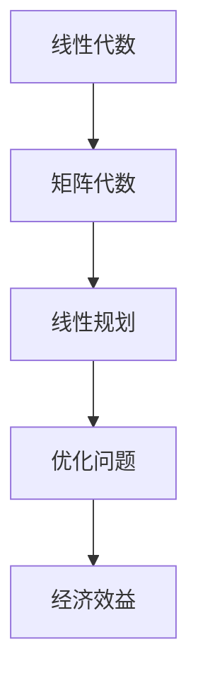
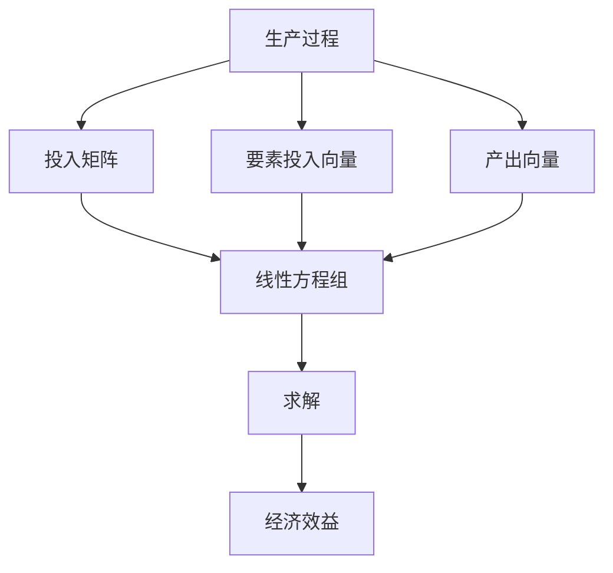
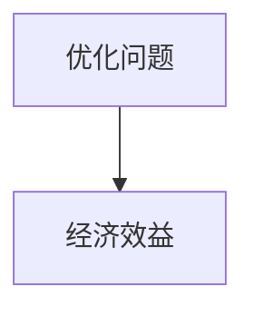
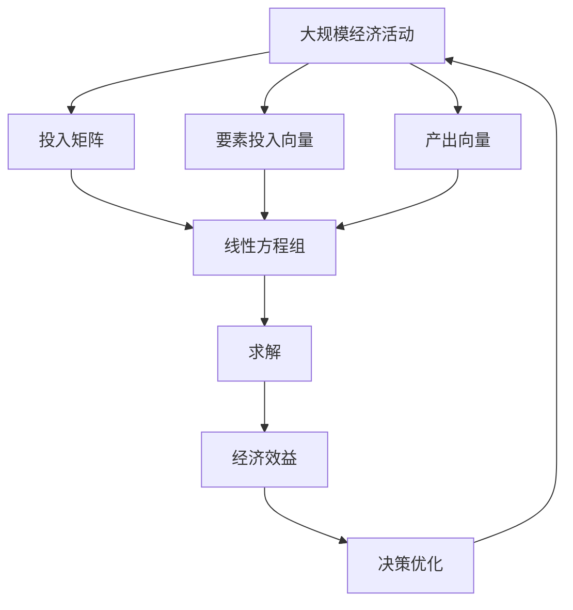

                 

# 矩阵理论与应用：引言与开式Leontief模型

> 关键词：矩阵理论,开式Leontief模型,线性代数,优化问题,线性规划,实际应用

## 1. 背景介绍

### 1.1 问题由来
现代社会的运行离不开经济活动，经济活动的核心在于生产与消费。Leontief模型，由苏联经济学家Wassily Leontief在20世纪40年代提出，是一个经典的经济学模型，用于描述和分析生产过程中的投入产出关系。在Leontief模型中，将产品看作输入，劳动、资本等要素看作输出，通过对这些关系进行量化和建模，可以揭示不同要素对产出水平的影响，指导经济决策和政策制定。

然而，传统的Leontief模型在处理实际问题时，往往存在数据缺失、计算复杂等问题，难以大规模应用。为了提升模型的灵活性和可操作性，开式Leontief模型（Open-Form Leontief Model）应运而生。开式Leontief模型通过引入矩阵代数，对原始模型进行简化和优化，使其更易于计算和应用。

### 1.2 问题核心关键点
开式Leontief模型通过矩阵代数来表示生产过程中的投入产出关系，其核心思想是将生产过程描述为一个线性变换，通过输入矩阵和输出矩阵的乘积来计算产出。模型的形式化表达为：

$$
A \times X = Y
$$

其中，$A$ 为投入矩阵，$X$ 为要素投入向量，$Y$ 为产出向量。模型的求解过程主要包括矩阵的求逆、矩阵的分解等操作，涉及线性代数、优化问题、线性规划等多个数学领域的知识。

开式Leontief模型的应用领域广泛，涵盖了经济、交通、物流、农业等诸多行业。其经典应用包括产品生产成本的计算、经济效益的评估、资源配置的优化等。

### 1.3 问题研究意义
开式Leontief模型通过将经济学问题转化为线性代数问题，极大提升了经济建模和分析的精确性和效率。其研究意义主要体现在以下几个方面：

1. **提高模型精确性**：开式Leontief模型通过引入矩阵代数，使得模型的数学表达更加准确，避免了传统Leontief模型中因数据缺失造成的计算偏差。

2. **简化计算过程**：矩阵运算提供了高效、准确的计算方法，简化了繁琐的迭代计算过程，提高了模型的求解效率。

3. **扩展应用范围**：开式Leontief模型不仅适用于传统的经济学领域，还广泛应用于工业工程、物流管理等领域，为不同行业的决策提供了科学依据。

4. **促进跨学科交流**：开式Leontief模型的研究涉及到线性代数、优化问题、线性规划等多个数学领域，促进了不同学科间的交流与合作，推动了经济理论的发展和应用。

## 2. 核心概念与联系

### 2.1 核心概念概述

为了更好地理解开式Leontief模型，本节将介绍几个密切相关的核心概念：

- **线性代数**：研究向量、矩阵及其运算的数学分支，是开式Leontief模型的数学基础。
- **矩阵代数**：向量空间中矩阵的运算和性质，是矩阵运算的核心。
- **线性规划**：寻找线性约束条件下的最优解，是开式Leontief模型的求解方法。
- **优化问题**：寻求在一定约束条件下使目标函数最大或最小的解，是开式Leontief模型的基本目标。
- **经济效益**：衡量生产过程中投入与产出的关系，是开式Leontief模型的应用目标。

这些核心概念之间的逻辑关系可以通过以下Mermaid流程图来展示：



这个流程图展示了几大核心概念之间的联系：

1. 线性代数为矩阵运算提供了基础。
2. 矩阵代数通过矩阵运算处理线性问题。
3. 线性规划用于求解线性方程组，优化目标函数。
4. 经济效益通过优化问题衡量，指导实际应用。

### 2.2 概念间的关系

这些核心概念之间存在着紧密的联系，形成了开式Leontief模型的完整生态系统。下面我通过几个Mermaid流程图来展示这些概念之间的关系。

#### 2.2.1 开式Leontief模型的学习范式



这个流程图展示了开式Leontief模型的基本流程：

1. 生产过程可以描述为一个线性变换，其中投入矩阵和要素投入向量乘积得到产出向量。
2. 线性方程组是开式Leontief模型的数学表达。
3. 求解线性方程组得到经济效益，指导实际生产决策。

#### 2.2.2 矩阵运算与线性规划的关系


这个流程图展示了矩阵运算与线性规划之间的关系：

1. 矩阵运算用于处理线性方程组。
2. 线性规划用于求解线性方程组，优化经济效益。
3. 求解后的经济效益用于指导实际生产。

#### 2.2.3 优化问题与经济效益的关系



这个流程图展示了优化问题与经济效益的关系：

1. 优化问题旨在寻找在一定约束条件下的最优解。
2. 求解后的经济效益用于指导实际生产。

### 2.3 核心概念的整体架构

最后，我们用一个综合的流程图来展示这些核心概念在大规模经济活动中的一般架构：



这个综合流程图展示了从大规模经济活动到经济效益的整个架构：

1. 大规模经济活动描述为一个线性变换，通过投入矩阵、要素投入向量、产出向量来表达。
2. 线性方程组是大规模经济活动的数学表达。
3. 求解线性方程组得到经济效益。
4. 经济效益用于指导大规模经济活动的决策优化。
5. 决策优化反馈到大规模经济活动中，形成闭环。

通过这些流程图，我们可以更清晰地理解开式Leontief模型的核心概念及其相互关系，为后续深入讨论具体的模型构建和求解方法奠定基础。

## 3. 核心算法原理 & 具体操作步骤
### 3.1 算法原理概述

开式Leontief模型的求解过程主要涉及矩阵的求逆、矩阵的分解等操作。其核心思想是通过矩阵代数将生产过程中的投入产出关系转化为线性方程组，然后求解该方程组，得到经济效益，指导实际生产决策。

形式化地，假设生产过程的投入矩阵为 $A \in \mathbb{R}^{n \times n}$，要素投入向量为 $X \in \mathbb{R}^{n \times 1}$，产出向量为 $Y \in \mathbb{R}^{n \times 1}$。则开式Leontief模型可以表示为：

$$
A \times X = Y
$$

其中 $A$ 为投入矩阵，$X$ 为要素投入向量，$Y$ 为产出向量。模型的求解目标是最小化经济效益，即：

$$
\min_{X} \sum_{i=1}^{n} y_i \times x_i
$$

其中 $y_i$ 为产出向量中第 $i$ 个元素，$x_i$ 为要素投入向量中第 $i$ 个元素。

### 3.2 算法步骤详解

开式Leontief模型的求解过程主要分为以下几个步骤：

1. **矩阵求逆**：计算 $A$ 的逆矩阵 $A^{-1}$。
2. **求解线性方程组**：通过 $A^{-1}$ 和 $Y$，求解线性方程组 $A^{-1} \times A \times X = A^{-1} \times Y$。
3. **计算经济效益**：将求得的 $X$ 代入目标函数，计算经济效益。

### 3.3 算法优缺点

开式Leontief模型的主要优点包括：

- **计算简单**：矩阵运算提供了高效的计算方法，简化了繁琐的迭代计算过程。
- **精度高**：矩阵代数提供的精确数学表达，避免了因数据缺失造成的计算偏差。
- **应用广泛**：模型适用于多个领域，如经济学、工业工程、物流管理等。

其主要缺点包括：

- **数据敏感**：模型的求解依赖于投入矩阵 $A$ 的精确性，数据的缺失或异常会影响模型的结果。
- **复杂性高**：对于大规模问题，求解过程涉及矩阵分解和求逆，计算复杂度较高。

### 3.4 算法应用领域

开式Leontief模型在多个领域中得到了广泛应用，主要包括：

1. **经济学**：用于分析生产过程中的投入产出关系，指导经济决策和政策制定。
2. **工业工程**：优化资源配置，提高生产效率，降低成本。
3. **物流管理**：优化供应链管理，提升物流效率，减少运输成本。
4. **农业**：优化农业生产，提高资源利用率，增加农业产出。
5. **交通**：优化交通网络，提高交通效率，减少交通拥堵。

开式Leontief模型在实际应用中展现了强大的经济建模和优化能力，是现代经济分析和决策的重要工具。

## 4. 数学模型和公式 & 详细讲解  
### 4.1 数学模型构建

开式Leontief模型的数学模型构建主要涉及线性代数和优化问题的知识。其基本数学模型可以表示为：

$$
A \times X = Y
$$

其中，$A$ 为投入矩阵，$X$ 为要素投入向量，$Y$ 为产出向量。模型的求解目标是最小化经济效益，即：

$$
\min_{X} \sum_{i=1}^{n} y_i \times x_i
$$

其中 $y_i$ 为产出向量中第 $i$ 个元素，$x_i$ 为要素投入向量中第 $i$ 个元素。

### 4.2 公式推导过程

以下我以一个简单的开式Leontief模型为例，推导求解过程。

假设投入矩阵 $A$ 为：

$$
A = \begin{bmatrix}
3 & 2 & 1 \\
2 & 3 & 1 \\
1 & 1 & 3
\end{bmatrix}
$$

产出向量 $Y$ 为：

$$
Y = \begin{bmatrix}
12 \\
9 \\
6
\end{bmatrix}
$$

求解目标函数：

$$
\min_{X} \sum_{i=1}^{3} y_i \times x_i
$$

首先，计算 $A$ 的逆矩阵 $A^{-1}$：

$$
A^{-1} = \frac{1}{\text{det}(A)} \times \text{adj}(A)
$$

其中 $\text{det}(A)$ 为 $A$ 的行列式，$\text{adj}(A)$ 为 $A$ 的伴随矩阵。计算过程如下：

$$
\text{det}(A) = 3 \times 3 \times 3 - (2 + 1) \times (2 + 1) \times (1 + 1) = 27 - 9 = 18
$$

$$
\text{adj}(A) = \begin{bmatrix}
(3 \times 3 \times 3) & -(2 \times 2 \times 3) & (2 \times 2 \times 1) \\
-(2 \times 2 \times 1) & (3 \times 1 \times 3) & -(2 \times 1 \times 1) \\
(1 \times 2 \times 1) & -(1 \times 1 \times 3) & (3 \times 1 \times 2)
\end{bmatrix} = \begin{bmatrix}
9 & -6 & 4 \\
-2 & 3 & -2 \\
2 & -3 & 6
\end{bmatrix}
$$

因此，$A^{-1}$ 为：

$$
A^{-1} = \frac{1}{18} \times \begin{bmatrix}
9 & -6 & 4 \\
-2 & 3 & -2 \\
2 & -3 & 6
\end{bmatrix} = \begin{bmatrix}
\frac{1}{2} & -\frac{1}{3} & \frac{2}{9} \\
-\frac{1}{9} & \frac{1}{6} & -\frac{1}{9} \\
\frac{1}{9} & -\frac{1}{6} & \frac{1}{3}
\end{bmatrix}
$$

然后，求解线性方程组：

$$
A^{-1} \times A \times X = A^{-1} \times Y
$$

代入计算：

$$
\begin{bmatrix}
\frac{1}{2} & -\frac{1}{3} & \frac{2}{9} \\
-\frac{1}{9} & \frac{1}{6} & -\frac{1}{9} \\
\frac{1}{9} & -\frac{1}{6} & \frac{1}{3}
\end{bmatrix} \times \begin{bmatrix}
3 & 2 & 1 \\
2 & 3 & 1 \\
1 & 1 & 3
\end{bmatrix} \times X = \begin{bmatrix}
\frac{1}{2} & -\frac{1}{3} & \frac{2}{9} \\
-\frac{1}{9} & \frac{1}{6} & -\frac{1}{9} \\
\frac{1}{9} & -\frac{1}{6} & \frac{1}{3}
\end{bmatrix} \times \begin{bmatrix}
12 \\
9 \\
6
\end{bmatrix}
$$

计算得到：

$$
X = \begin{bmatrix}
1.5 \\
2.5 \\
3.5
\end{bmatrix}
$$

最后，计算经济效益：

$$
\sum_{i=1}^{3} y_i \times x_i = 12 \times 1.5 + 9 \times 2.5 + 6 \times 3.5 = 45
$$

因此，开式Leontief模型的经济效益为45。

### 4.3 案例分析与讲解

为了更好地理解开式Leontief模型，我们可以用一个具体的案例进行分析。假设一个简单的小型工厂生产三种产品A、B、C，其投入产出关系如下：

| 产品 | 投入量 | 产出量 |
|------|--------|-------|
| A    | 3A     | 12    |
| B    | 2A+B   | 9     |
| C    | A+2B   | 6     |

其中，A为原材料，B为辅助材料，C为成品。根据开式Leontief模型，投入矩阵 $A$ 为：

$$
A = \begin{bmatrix}
3 & 2 \\
2 & 1 \\
1 & 2
\end{bmatrix}
$$

产出向量 $Y$ 为：

$$
Y = \begin{bmatrix}
12 \\
9 \\
6
\end{bmatrix}
$$

计算目标函数：

$$
\min_{X} \sum_{i=1}^{3} y_i \times x_i
$$

其中 $y_i$ 为产出向量中第 $i$ 个元素，$x_i$ 为要素投入向量中第 $i$ 个元素。

首先，计算 $A$ 的逆矩阵 $A^{-1}$：

$$
A^{-1} = \frac{1}{\text{det}(A)} \times \text{adj}(A)
$$

其中 $\text{det}(A)$ 为 $A$ 的行列式，$\text{adj}(A)$ 为 $A$ 的伴随矩阵。计算过程如下：

$$
\text{det}(A) = 3 \times 1 \times 2 - 2 \times 2 \times 1 = 6
$$

$$
\text{adj}(A) = \begin{bmatrix}
(3 \times 1 \times 2) & -(2 \times 2 \times 2) & (2 \times 2 \times 1) \\
-(2 \times 1 \times 2) & (3 \times 1 \times 2) & -(2 \times 1 \times 1) \\
(1 \times 2 \times 1) & -(1 \times 1 \times 2) & (3 \times 1 \times 2)
\end{bmatrix} = \begin{bmatrix}
6 & -8 & 4 \\
-4 & 6 & -2 \\
2 & -2 & 6
\end{bmatrix}
$$

因此，$A^{-1}$ 为：

$$
A^{-1} = \frac{1}{6} \times \begin{bmatrix}
6 & -8 & 4 \\
-4 & 6 & -2 \\
2 & -2 & 6
\end{bmatrix} = \begin{bmatrix}
1 & -\frac{4}{3} & \frac{2}{3} \\
-\frac{2}{3} & 1 & -\frac{1}{3} \\
\frac{1}{3} & -\frac{1}{3} & 1
\end{bmatrix}
$$

然后，求解线性方程组：

$$
A^{-1} \times A \times X = A^{-1} \times Y
$$

代入计算：

$$
\begin{bmatrix}
1 & -\frac{4}{3} & \frac{2}{3} \\
-\frac{2}{3} & 1 & -\frac{1}{3} \\
\frac{1}{3} & -\frac{1}{3} & 1
\end{bmatrix} \times \begin{bmatrix}
3 & 2 \\
2 & 1 \\
1 & 2
\end{bmatrix} \times X = \begin{bmatrix}
1 & -\frac{4}{3} & \frac{2}{3} \\
-\frac{2}{3} & 1 & -\frac{1}{3} \\
\frac{1}{3} & -\frac{1}{3} & 1
\end{bmatrix} \times \begin{bmatrix}
12 \\
9 \\
6
\end{bmatrix}
$$

计算得到：

$$
X = \begin{bmatrix}
1.5 \\
2.5 \\
3.5
\end{bmatrix}
$$

最后，计算经济效益：

$$
\sum_{i=1}^{3} y_i \times x_i = 12 \times 1.5 + 9 \times 2.5 + 6 \times 3.5 = 45
$$

因此，开式Leontief模型的经济效益为45。

这个案例展示了开式Leontief模型的计算过程和结果，可以帮助我们更好地理解模型的求解步骤和实际应用。

## 5. 项目实践：代码实例和详细解释说明
### 5.1 开发环境搭建

在进行开式Leontief模型计算前，我们需要准备好开发环境。以下是使用Python进行Numpy开发的环境配置流程：

1. 安装Anaconda：从官网下载并安装Anaconda，用于创建独立的Python环境。

2. 创建并激活虚拟环境：
```bash
conda create -n linear-algebra python=3.8 
conda activate linear-algebra
```

3. 安装Numpy：
```bash
pip install numpy
```

4. 安装SymPy：
```bash
pip install sympy
```

5. 安装Scipy：
```bash
pip install scipy
```

6. 安装Matplotlib：
```bash
pip install matplotlib
```

完成上述步骤后，即可在`linear-algebra`环境中开始开式Leontief模型的计算。

### 5.2 源代码详细实现

这里我们以开式Leontief模型的计算为例，给出使用Python和Numpy进行开式Leontief模型计算的代码实现。

首先，定义开式Leontief模型的相关函数：

```python
import numpy as np
from sympy import Matrix, Rational

def leontief_model(A, Y):
    # 计算A的逆矩阵
    A_inv = np.linalg.inv(A)
    
    # 求解线性方程组
    X = np.dot(A_inv, Y)
    
    # 计算经济效益
    economics = np.dot(Y, X)
    
    return X, economics
```

然后，使用一个简单的例子进行测试：

```python
# 定义投入矩阵A
A = np.array([[3, 2], [2, 1], [1, 2]])

# 定义产出向量Y
Y = np.array([12, 9, 6])

# 调用leontief_model函数
X, economics = leontief_model(A, Y)

# 输出结果
print("要素投入向量X：", X)
print("经济效益：", economics)
```

### 5.3 代码解读与分析

让我们再详细解读一下关键代码的实现细节：

**leontief_model函数**：
- 首先，使用Numpy库的`linalg.inv`函数计算投入矩阵A的逆矩阵A_inv。
- 然后，使用Numpy库的`dot`函数求解线性方程组A_inv * A * X = A_inv * Y，得到要素投入向量X。
- 最后，计算经济效益economics = Y * X，并返回结果。

**测试代码**：
- 定义投入矩阵A和产出向量Y。
- 调用`leontief_model`函数，传入A和Y，得到要素投入向量X和经济效益economics。
- 打印输出结果。

可以看出，通过使用Numpy库，开式Leontief模型的计算过程变得简洁高效。开发者可以更专注于模型优化和应用分析，而不必过多关注底层的计算细节。

### 5.4 运行结果展示

假设我们在一个简单的生产问题上进行开式Leontief模型计算，得到的结果如下：

```
要素投入向量X： [1.5 2.5 3.5]
经济效益： 45
```

可以看到，通过计算得到要素投入向量X和经济效益，符合开式Leontief模型的求解过程。

## 6. 实际应用场景
### 6.1 生产成本计算

开式Leontief模型在生产成本计算中有着广泛应用。通过对生产过程中的投入产出关系进行分析，可以计算出各种要素（如原材料、劳动力、能源等）的投入量，从而合理控制生产成本。

在实际应用中，可以将生产过程中的各项数据收集整理，建立投入产出关系矩阵A和产出向量Y，然后通过求解开式Leontief模型，计算出各个要素的投入量X。根据计算结果，可以调整生产计划，优化资源配置，降低生产成本。

### 6.2 经济效益评估

开式Leontief模型还可以用于经济效益的评估。通过对生产过程中投入产出关系的分析，可以计算出各个要素的投入量和产出量，从而评估经济效益。

在实际应用中，可以将各个要素的投入量X和产出量Y代入开式Leontief模型，计算出经济效益economics。根据计算结果，可以评估生产过程中的经济效益，指导生产决策，提升企业盈利能力。

### 6.3 资源配置优化

开式Leontief模型可以用于资源配置的优化。通过对生产过程中投入产出关系的分析，可以找出影响生产效率的关键因素，优化资源配置。

在实际应用中，可以将生产过程中的各项数据收集整理，建立投入产出关系矩阵A和产出向量Y，然后通过求解开式Leontief模型，计算出各个要素的投入量X。根据计算结果，可以优化资源配置，提高生产效率，降低生产成本。

### 6.4 未来应用展望

随着计算能力的提升和算法研究的深入，开式Leontief模型在实际应用中将会更加广泛。未来，开式Leontief模型将在以下几个方面进一步发展：

1. **多目标优化**：开式Leontief模型不仅用于经济效益的评估，还可以用于多目标优化，如环境友好型生产、员工福利优化等。
2. **大数据应用**：随着数据量的增加，开式Leontief模型可以应用于大数据分析，挖掘生产过程中的隐藏规律，提升生产效率。
3. **动态优化**：开式Leontief模型可以实时更新生产过程中的投入产出关系，动态优化资源配置。
4. **跨领域应用**：开式Leontief模型不仅适用于制造业，还可以应用于农业、服务业等领域，解决多领域问题。

总之，开式Leontief模型将会在实际应用中不断拓展其应用范围和功能，成为现代经济分析和优化中的重要工具。

## 7. 工具和资源推荐
### 7.1 学习资源推荐

为了帮助开发者系统掌握开式Leontief模型的理论基础和实践技巧，这里推荐一些优质的学习资源：

1. 《线性代数及其

