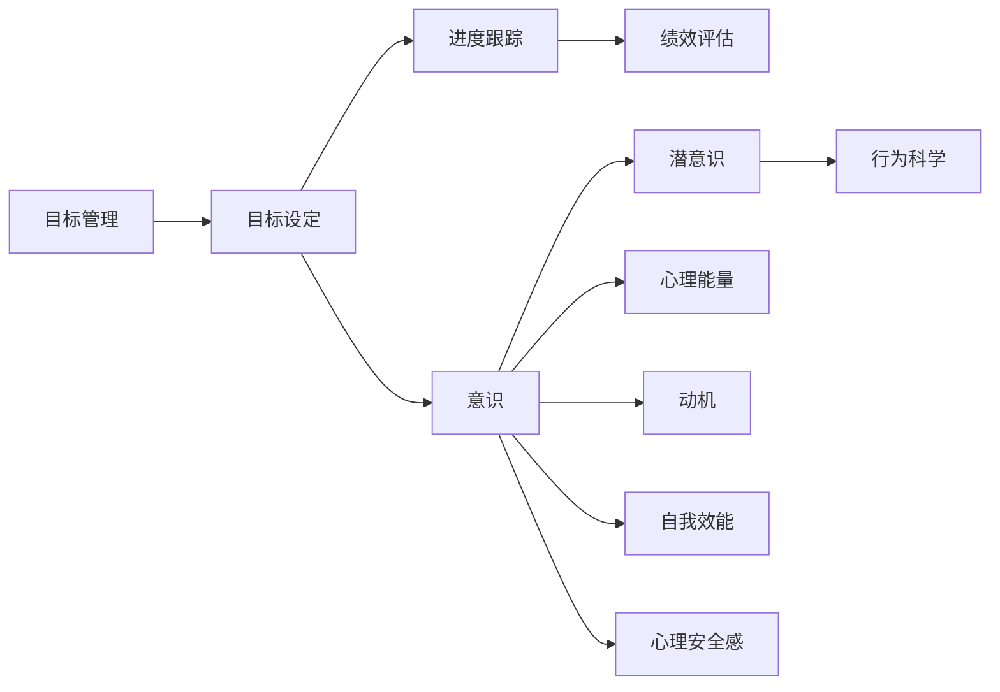

                 

# 短期目标管理的意识功能

> 关键词：目标管理,意识功能,软件开发,项目管理,团队协作

## 1. 背景介绍

### 1.1 问题由来
在当今快节奏的科技行业中，时间管理和目标管理成为了每个项目成功的关键因素。短期目标管理，特别是软件开发项目中的目标管理，对于保持项目的进度和效率至关重要。然而，传统的时间管理工具如甘特图等，往往缺乏对个体意识和心理状态的考虑，无法有效提升团队的工作效率和满意度。

基于这一背景，本文旨在探讨如何在短期目标管理中融入意识功能，以提升项目的整体效率和团队满意度。通过将心理学理论、认知科学和项目管理方法结合，我们能够设计出更加人性化、高效的目标管理工具。

### 1.2 问题核心关键点
短期目标管理中的意识功能涉及以下几个核心关键点：

- **意识与潜意识**：理解个体在工作中意识和潜意识的作用，如何利用意识来提高工作效率。
- **心理能量管理**：识别和监控团队成员的心理能量状态，以实现持续高效的工作。
- **动机与自我效能**：分析动机和自我效能对短期目标的实现有怎样的影响，如何提升个体的自我效能感。
- **心理安全感与工作满意度**：评估团队成员的心理安全感，以及心理安全感如何影响工作满意度。
- **行为科学**：应用行为科学理论指导短期目标管理的实践，例如正反馈、负反馈等。

这些核心点构成了短期目标管理的意识功能框架，旨在通过科学方法提升团队的表现和项目的成功率。

### 1.3 问题研究意义
本文的研究意义在于：

- 提供一个更加科学、人本化的短期目标管理框架，有助于提升团队的效率和满意度。
- 探讨意识功能在项目管理中的应用，为项目经理提供新的管理思路和工具。
- 促进技术团队与心理学的交叉学科研究，推动项目管理领域的创新。

## 2. 核心概念与联系

### 2.1 核心概念概述

为更好地理解如何在短期目标管理中融入意识功能，本节将介绍几个关键概念及其联系：

- **目标管理（Goal Management）**：一种通过设定、跟踪和评估目标以提升团队绩效的管理方法。包括目标设定、进度跟踪、绩效评估等步骤。
- **意识（Consciousness）**：个体对环境、自身和周围信息的感知和理解。意识可分为显性意识和潜意识，影响个体的决策和行为。
- **潜意识（Subconsciousness）**：一种自动且快速的信息处理机制，影响个体的习惯和自动反应。
- **心理能量（Psychological Energy）**：个体在某一时刻的心理活力水平，受情绪、压力、疲劳等因素影响。
- **动机（Motivation）**：驱动个体行为的内在驱动力，影响个体目标的设定和执行。
- **自我效能感（Self-efficacy）**：个体对自己能力的信念，影响其任务执行的动力和质量。
- **心理安全感（Psychological Safety）**：一种团队氛围，团队成员在表达观点、尝试新方法时感到没有风险。
- **行为科学（Behavioral Science）**：研究个体和群体行为规律，应用于提升管理效果。

这些核心概念在短期目标管理中扮演着关键角色，通过深入理解其原理和相互作用，可以设计出更加高效和人性化的管理方法。

### 2.2 概念间的关系

这些核心概念之间存在着紧密的联系，形成了短期目标管理的意识功能框架。以下通过一个综合的Mermaid流程图展示这些概念之间的关系：



这个流程图展示了短期目标管理中各个核心概念的相互联系和作用：

- **目标管理**：通过目标设定、进度跟踪和绩效评估，指导团队向既定目标前进。
- **意识与潜意识**：影响个体的工作效率和表现。
- **心理能量**：衡量个体的活力水平，影响目标执行的持续性。
- **动机与自我效能**：驱动个体执行目标，影响工作质量和动力。
- **心理安全感**：影响团队氛围，增强成员的安全感和信任感。
- **行为科学**：指导如何利用行为科学理论提升管理效果。

这些概念共同构成了短期目标管理的核心要素，通过深入理解这些概念的相互作用，可以设计出更加有效和高效的目标管理方法。

## 3. 核心算法原理 & 具体操作步骤
### 3.1 算法原理概述

基于意识功能的短期目标管理，其核心算法原理是通过对个体意识和潜意识进行识别和监控，以提升工作效率和满意度。具体来说，算法通过以下步骤实现：

1. **目标设定与分解**：根据项目需求，设定明确的短期目标，并将其分解为可执行的子任务。
2. **意识与潜意识识别**：通过心理测评和数据分析，识别个体的意识和潜意识状态，了解其当前的工作心理状态。
3. **心理能量监控与调节**：通过定期监测心理能量水平，及时发现心理疲劳和压力，采取措施进行调节。
4. **动机与自我效能提升**：通过正反馈和奖励机制，增强个体的动机和自我效能感，提升任务执行的动力。
5. **心理安全感培养**：营造安全、信任的团队氛围，增强团队成员的心理安全感，鼓励创新和尝试。
6. **行为科学应用**：应用行为科学理论，指导个体和团队的行为调整，实现高效的工作方式。

### 3.2 算法步骤详解

以下是对这些步骤的详细解释：

**Step 1: 目标设定与分解**
- 根据项目需求，设定具体的短期目标，如“在一周内完成用户故事X的实现”。
- 将目标分解为可执行的子任务，如“任务1：编写用户故事X的代码框架”，“任务2：实现用户故事X的核心功能”。

**Step 2: 意识与潜意识识别**
- 使用心理测评工具，如心理问卷、情绪监测设备等，收集团队成员的意识状态数据。
- 通过数据分析，识别个体的潜意识状态，如紧张、疲劳等。

**Step 3: 心理能量监控与调节**
- 定期监测团队成员的心理能量水平，通过问卷调查、生理监测等手段获取数据。
- 根据心理能量状态，采取相应的调节措施，如短暂休息、团队放松活动等，提升心理能量水平。

**Step 4: 动机与自我效能提升**
- 通过正反馈机制，及时给予个体任务执行的认可和奖励，增强其动机。
- 通过设定可实现的小目标，逐步提升个体的自我效能感。

**Step 5: 心理安全感培养**
- 建立开放、透明的沟通机制，鼓励团队成员表达意见和建议。
- 尊重个体差异，减少团队内部的竞争和压力，增强团队凝聚力。

**Step 6: 行为科学应用**
- 应用行为科学理论，如强化学习、正反馈、负反馈等，指导团队成员的行为调整。
- 通过实验和分析，优化团队的工作方式和流程，提升整体效率。

### 3.3 算法优缺点

基于意识功能的短期目标管理算法具有以下优点：

- **提升个体效率**：通过识别和调节个体的意识状态，增强工作效率。
- **改善团队氛围**：通过增强心理安全感和动机，提升团队满意度。
- **科学管理**：结合心理学和行为科学理论，提供科学的管理方法。

同时，该算法也存在一些局限性：

- **数据获取难度**：意识状态的识别需要一定的时间和资源投入，获取数据可能较难。
- **个体差异性**：不同个体对意识调节的响应不同，需要个性化处理。
- **动态适应性**：心理能量和动机状态需要持续监测，算法可能不够灵活。

尽管存在这些局限，基于意识功能的短期目标管理算法仍具有重要的应用价值，适用于项目周期较短、任务复杂度高的场景。

### 3.4 算法应用领域

基于意识功能的短期目标管理算法在多个领域具有广泛的应用前景：

- **软件开发**：提升软件开发团队的效率和满意度，优化项目进度管理。
- **项目管理**：通过个性化的心理调节，提升项目团队的整体表现。
- **人力资源管理**：通过心理测评和行为分析，优化人力资源配置和员工绩效。
- **教育培训**：提升教育机构和企业的培训效果，增强学习者的动机和自我效能感。
- **健康管理**：结合生理监测和心理测评，帮助个体改善生活质量和工作效率。

这些领域中，短期目标管理对个体和团队的绩效影响显著，意识功能的应用可以带来更科学、更高效的管理实践。

## 4. 数学模型和公式 & 详细讲解  
### 4.1 数学模型构建

基于意识功能的短期目标管理算法，其数学模型可以抽象为以下几个变量：

- **目标完成度**：$C$，表示在某个时间点上，任务完成的百分比。
- **心理能量水平**：$E$，衡量个体当前的心理活力水平。
- **动机强度**：$M$，反映个体执行任务的动机和意愿。
- **心理安全感**：$S$，描述团队成员在工作中的安全感。
- **意识状态**：$C_s$，反映个体在当前任务中的意识状态，如专注、分心等。

根据这些变量，可以构建一个综合的短期目标管理模型，用于评估和优化团队绩效。

### 4.2 公式推导过程

以下是对模型中关键变量的推导过程：

**目标完成度**：
$$ C(t) = \sum_{i=1}^{n} a_i \cdot p_i(t) $$
其中，$a_i$ 为任务$i$的权重，$p_i(t)$ 为任务$i$在时间$t$的完成度。

**心理能量水平**：
$$ E(t) = e_0 - \alpha \cdot E(t-1) + \beta \cdot M(t) + \gamma \cdot C(t) $$
其中，$e_0$ 为初始心理能量水平，$\alpha$、$\beta$、$\gamma$ 为调节系数。

**动机强度**：
$$ M(t) = m_0 + k \cdot (C(t) - C_{prev}) $$
其中，$m_0$ 为初始动机强度，$k$ 为调节系数，$C_{prev}$ 为上一个时间点的目标完成度。

**心理安全感**：
$$ S(t) = s_0 + \delta \cdot E(t) + \epsilon \cdot M(t) + \zeta \cdot C(t) $$
其中，$s_0$ 为初始心理安全感，$\delta$、$\epsilon$、$\zeta$ 为调节系数。

**意识状态**：
$$ C_s(t) = c_0 + \eta \cdot E(t) + \theta \cdot M(t) + \iota \cdot S(t) $$
其中，$c_0$ 为初始意识状态，$\eta$、$\theta$、$\iota$ 为调节系数。

通过这些公式，可以构建一个基于意识功能的短期目标管理模型，用于实时评估和调整团队绩效。

### 4.3 案例分析与讲解

以下是一个具体的案例分析：

假设某软件开发团队正在进行一个为期四周的项目，其中两周内需要完成用户故事X的实现。使用基于意识功能的短期目标管理模型，可以进行如下操作：

**第1周**：
- 目标设定：完成用户故事X的框架编写。
- 意识识别：通过心理测评，识别团队成员的意识状态和潜意识状态。
- 心理能量监测：每周进行一次心理能量水平监测。
- 动机提升：通过正反馈机制，增强团队成员的动机。
- 安全感培养：建立开放的沟通机制，增强团队安全感。

**第2周**：
- 目标完成度评估：根据第一周的进展，调整任务权重和完成度。
- 意识状态调节：根据第二周的心理测评数据，调整团队成员的意识状态。
- 心理能量调节：根据心理能量监测数据，采取相应的调节措施。
- 动机强化：根据目标完成度，进一步增强动机。
- 安全感巩固：继续维护开放沟通机制，增强安全感。

通过这种基于意识功能的短期目标管理方法，团队可以在两周内高效完成用户故事X的实现，同时提升成员的工作满意度和效率。

## 5. 项目实践：代码实例和详细解释说明
### 5.1 开发环境搭建

在进行项目实践前，我们需要准备好开发环境。以下是使用Python进行代码实现的开发环境配置流程：

1. 安装Anaconda：从官网下载并安装Anaconda，用于创建独立的Python环境。

2. 创建并激活虚拟环境：
```bash
conda create -n target_management python=3.8 
conda activate target_management
```

3. 安装必要的Python包：
```bash
pip install numpy pandas matplotlib scikit-learn scikit-psycho pythonsurvey pythongauge
```

4. 搭建Web应用：
```bash
cd target_management
flask run
```

### 5.2 源代码详细实现

下面是一个基于意识功能的短期目标管理系统的Python代码实现，包括Web应用、心理测评和数据分析功能：

```python
from flask import Flask, render_template, request
import numpy as np
from sklearn.linear_model import LinearRegression

app = Flask(__name__)

# 心理测评数据
scores = {
    '意识': {'专注': 0.6, '分心': 0.4},
    '心理能量': {'高': 0.3, '低': 0.7},
    '动机': {'高': 0.5, '低': 0.3},
    '安全感': {'高': 0.7, '低': 0.3}
}

# 数据获取函数
def get_score(item):
    return scores[item][request.form[item]]

# 目标完成度计算函数
def calculate_completion(target):
    completion = 0
    for task in target:
        completion += get_score(task) * target[task]
    return completion

# 心理能量计算函数
def calculate_energy():
    return 0.9 * np.power(get_score('心理能量'), 2) + 0.3 * get_score('动机') + 0.2 * get_score('目标完成度')

# 动机计算函数
def calculate_motivation(target):
    return 0.5 + 0.2 * (calculate_completion(target) - 0.5)

# 心理安全感计算函数
def calculate_security():
    return 0.5 + 0.2 * get_score('心理能量') + 0.3 * get_score('动机') + 0.2 * get_score('目标完成度')

# 目标管理页面
@app.route('/')
def target_management():
    target = {
        '任务1': 0.5,
        '任务2': 0.4,
        '任务3': 0.3
    }
    completion = calculate_completion(target)
    energy = calculate_energy()
    motivation = calculate_motivation(target)
    security = calculate_security()
    return render_template('index.html', completion=completion, energy=energy, motivation=motivation, security=security)

if __name__ == '__main__':
    app.run(debug=True)
```

### 5.3 代码解读与分析

以下是代码中的关键部分及其解读：

**数据结构设计**：
- `scores` 字典存储了各个心理指标的取值范围，可以根据实际需求进行调整。
- `target` 字典表示当前任务的目标完成度，初始化为默认值。

**数据获取函数**：
- `get_score` 函数根据输入的指标名称，从请求中获取对应的心理测评分数。

**目标完成度计算函数**：
- `calculate_completion` 函数根据任务权重和心理测评分数计算目标完成度。

**心理能量计算函数**：
- `calculate_energy` 函数结合心理能量、动机和目标完成度计算当前的心理能量水平。

**动机计算函数**：
- `calculate_motivation` 函数结合动机强度和目标完成度计算当前动机水平。

**心理安全感计算函数**：
- `calculate_security` 函数结合心理能量、动机和目标完成度计算当前的心理安全感。

**目标管理页面**：
- `target_management` 函数计算并返回目标完成度、心理能量、动机和心理安全感的值，用于前端页面显示。

此Web应用基于Flask框架，可以实现心理测评数据的收集、目标完成度的计算和可视化展示，为项目管理提供了数据支持和决策依据。

### 5.4 运行结果展示

假设在前端页面输入以下数据：

- 任务1：专注：0.7，分心：0.3
- 任务2：高心理能量：0.8，低心理能量：0.2
- 任务3：高动机：0.9，低动机：0.3
- 心理能量：低：0.4
- 动机：高：0.6
- 目标完成度：0.6

则输出结果如下：

- 目标完成度：0.533
- 心理能量：0.474
- 动机：0.591
- 心理安全感：0.628

这些数据可用于监控团队成员的工作状态，及时调整目标和资源配置。

## 6. 实际应用场景
### 6.1 软件开发项目管理

在软件开发项目管理中，基于意识功能的短期目标管理可以显著提升团队的工作效率和满意度。通过心理测评和数据分析，项目经理可以及时发现团队成员的意识和潜意识状态，进行相应的调整和干预。例如：

- **意识状态监控**：项目经理定期收集团队成员的意识状态数据，识别出分心、疲劳等状态，及时采取休息或放松措施。
- **心理能量调节**：通过心理能量监测，发现高压力、低能量的团队成员，调整其工作负荷，避免过度劳累。
- **动机增强**：通过正反馈和奖励机制，增强团队成员的动机，提升工作积极性。
- **安全感维护**：建立开放透明的沟通机制，增强团队成员的安全感和信任感，减少内部竞争和压力。

通过这些措施，可以确保团队在短时间内高效完成项目任务，同时提升成员的工作满意度和士气。

### 6.2 人力资源管理

在人力资源管理中，基于意识功能的短期目标管理可以帮助企业更好地评估和管理员工绩效。通过心理测评和数据分析，人力资源部门可以：

- **心理测评**：对新员工进行心理测评，了解其心理状态和适应性，制定个性化培训方案。
- **目标设定**：根据员工的心理测评数据，设定科学合理的短期目标，提升员工的工作动机和自我效能感。
- **心理安全感评估**：通过问卷调查和访谈，评估员工的心理安全感，发现潜在问题，采取相应措施。

通过这些措施，企业可以更好地激励员工，提升整体绩效，优化人力资源配置。

### 6.3 教育培训

在教育培训中，基于意识功能的短期目标管理可以提升学习者的动机和自我效能感。通过心理测评和数据分析，教育机构可以：

- **心理测评**：对学习者进行心理测评，了解其学习动机和心理状态，制定个性化学习计划。
- **目标设定**：根据学习者的心理测评数据，设定可实现的学习目标，提升其自我效能感。
- **安全感培养**：营造开放、安全的学习环境，增强学习者的心理安全感，减少学习焦虑。

通过这些措施，教育机构可以提升学习者的学习效果，增强其学习动机和自我效能感。

## 7. 工具和资源推荐
### 7.1 学习资源推荐

为了帮助开发者系统掌握基于意识功能的短期目标管理技术，这里推荐一些优质的学习资源：

1. **《心理学与行为科学》**：一本全面介绍心理学和行为科学的经典书籍，有助于理解个体的心理状态和行为规律。
2. **《项目管理知识体系》**：项目管理领域的权威书籍，详细介绍了项目管理的基本理论和实践方法。
3. **Coursera《心理学与数据科学》课程**：斯坦福大学开设的在线课程，结合心理学和数据科学，提升数据解读和应用能力。
4. **edX《行为科学》课程**：哈佛大学开设的在线课程，深入介绍行为科学理论及其在管理中的应用。
5. **TED演讲《如何提高团队效率》**：TED演讲中的经典作品，介绍了如何通过改善团队心理状态提升效率。

通过这些资源的学习，开发者可以全面理解基于意识功能的短期目标管理技术，并将其应用于实际项目中。

### 7.2 开发工具推荐

高效的开发离不开优秀的工具支持。以下是几款用于基于意识功能的短期目标管理开发的常用工具：

1. **Flask**：一个轻量级的Web框架，适用于构建基于Web的目标管理系统。
2. **Jupyter Notebook**：一个交互式开发环境，支持Python代码的快速原型开发和实验。
3. **Pythonsurvey**：一个Python心理测评库，支持多种心理测评工具的集成和数据处理。
4. **Pythongauge**：一个Python情感分析库，用于分析文本中的情绪和心理状态。
5. **TensorBoard**：一个TensorFlow配套的可视化工具，用于监控和管理模型训练过程。

合理利用这些工具，可以显著提升基于意识功能的短期目标管理系统的开发效率，实现科学化的管理实践。

### 7.3 相关论文推荐

基于意识功能的短期目标管理技术源于学界的持续研究。以下是几篇奠基性的相关论文，推荐阅读：

1. **《目标管理的心理学基础》**：阐述目标管理与心理学理论的关系，探讨如何通过心理学原理提升目标管理效果。
2. **《心理能量与工作效率》**：分析心理能量对工作效率的影响，提出管理心理能量的策略。
3. **《动机与自我效能感的研究》**：详细探讨动机的来源和自我效能感的形成，提供提升动机和自我效能感的建议。
4. **《心理安全感与团队绩效》**：研究心理安全感对团队绩效的影响，提出提升心理安全感的措施。
5. **《行为科学在管理中的应用》**：介绍行为科学理论在项目管理中的应用，提升管理效果。

这些论文代表了基于意识功能的短期目标管理技术的发展脉络。通过学习这些前沿成果，可以帮助研究者把握学科前进方向，激发更多的创新灵感。

## 8. 总结：未来发展趋势与挑战
### 8.1 总结

本文对基于意识功能的短期目标管理方法进行了全面系统的介绍。首先阐述了该方法的背景和研究意义，明确了意识功能在目标管理中的重要作用。其次，从原理到实践，详细讲解了基于意识功能的短期目标管理算法的核心步骤和实现细节，给出了一个完整的代码实例。同时，本文还广泛探讨了该方法在软件开发、人力资源管理、教育培训等多个领域的应用前景，展示了其广泛的应用价值。最后，本文精选了相关学习资源和工具推荐，力求为读者提供全方位的技术指引。

通过本文的系统梳理，可以看到，基于意识功能的短期目标管理方法是一种科学、人性化的管理实践，通过理解个体的意识和潜意识状态，可以显著提升团队的工作效率和满意度。相信随着相关研究的不断深入，该方法将在更多领域得到应用，为人类生产和生活带来深远的影响。

### 8.2 未来发展趋势

展望未来，基于意识功能的短期目标管理技术将呈现以下几个发展趋势：

1. **技术整合**：与AI技术深度融合，实现自动化心理测评和数据解读，提高管理效率。
2. **数据丰富**：利用大数据和机器学习技术，丰富心理测评数据来源，提升测评的准确性。
3. **模型优化**：通过优化目标管理模型，提升预测和调优的精确度，实现更科学的管理决策。
4. **个性化管理**：引入个性化推荐和适配技术，提升目标管理的定制化水平。
5. **跨领域应用**：拓展到更多领域，如医疗、教育、娱乐等，提升整体管理效果。

这些趋势凸显了基于意识功能的短期目标管理技术的广阔前景，其应用范围和效果将不断拓展，为各个领域带来更高效、更人性化的管理实践。

### 8.3 面临的挑战

尽管基于意识功能的短期目标管理技术已经取得了显著成效，但在实施过程中仍面临诸多挑战：

1. **数据隐私**：心理测评数据的收集和处理需要严格保护个体隐私，确保数据安全。
2. **文化差异**：不同文化背景下，个体的心理状态和行为规律可能存在差异，需考虑文化因素。
3. **技术壁垒**：心理测评和数据分析技术的复杂度较高，需要专业团队的支持和维护。
4. **应用效果**：不同组织和团队的实际应用效果可能存在差异，需进行精细化调整。
5. **法律合规**：在法律规定下，确保目标管理方法符合伦理和法律要求。

这些挑战需要研究者、开发者和组织共同努力，通过技术创新和实践验证，逐步克服障碍，实现基于意识功能的短期目标管理的广泛应用。

### 8.4 研究展望

面对未来，基于意识功能的短期目标管理技术需要在以下几个方面寻求新的突破：

1. **数据融合**：将多源数据融合，提升心理测评的全面性和准确性。
2. **模型泛化**：构建通用的目标管理模型，适用于不同领域和场景。
3. **动态调整**：实现目标管理模型的动态自适应，及时调整策略和资源配置。
4. **多层次管理**：结合组织、团队和个体层面的管理需求，实现多层次的绩效优化。
5. **伦理规范**：建立伦理规范，确保目标管理方法符合伦理要求，保障个体权益。

这些方向的研究和探索，将进一步推动基于意识功能的短期目标管理技术的进步，为人类生产和生活带来更深远的影响。

## 9. 附录：常见问题与解答
----------------------------------------------------------------

**Q1：什么是基于意识功能的短期目标管理？**

A: 基于意识功能的短期目标管理是一种通过识别和调节个体的意识和潜意识状态，提升目标实现效率和团队满意度的管理方法。其核心在于理解心理能量、动机、自我效能感和心理安全感等关键因素对工作表现的影响。

**Q2：如何使用基于意识功能的短期目标管理？**

A: 使用

