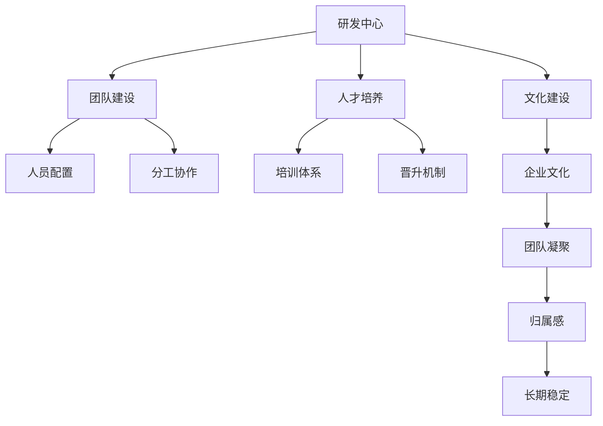

                 

## 1. 背景介绍

在现代信息技术快速发展的背景下，科技公司之间的竞争日益激烈。研发中心作为公司技术创新的核心，其团队建设和人才培养方案的制定显得尤为重要。本文将系统地阐述如何构建一个高效的研发团队，并详细介绍科学的培训与培养方案，为企业的技术发展和人才储备提供有益参考。

## 2. 核心概念与联系

### 2.1 核心概念概述

**研发中心（R&D Center）**：公司的技术创新和产品开发中心，主要负责新技术的研发、产品迭代和市场推广。

**团队建设**：通过优化人员配置、合理分工和团队文化建设，确保团队高效协同，实现目标最大化。

**人才培养**：针对团队成员的个体差异和职业发展需要，提供科学的培训与晋升机制，持续提升员工素质和专业技能。

**人才储备**：提前准备，为企业的长期发展储备优质技术人才，以应对未来的技术和市场变化。

**文化建设**：通过制定和弘扬企业文化，提高团队的凝聚力和归属感，促进团队的长期稳定发展。

这些核心概念之间存在紧密联系，构建高效的研发中心需要合理的团队建设和人才培养方案，并且需要相应的文化氛围支撑。

### 2.2 概念间的关系

这些概念之间可以通过以下合成的Mermaid流程图来展示其相互关系：



此流程图展示了研发中心建设过程中，团队建设、人才培养和文化建设之间的内在联系。团队的合理配置和协作，有助于人才的培养与成长；而健康向上的企业文化，则有助于提升团队的凝聚力和稳定性。

## 3. 核心算法原理 & 具体操作步骤
### 3.1 算法原理概述

构建高效的研发中心，核心在于“人才+团队+文化”的协调统一。研发中心团队建设和人才培养方案的制定，遵循以下核心算法原理：

**目标优化**：以提升团队整体效能为目标，优化团队成员的结构和职能分配，提高技术输出质量和市场响应速度。

**数据驱动**：通过分析历史数据，识别团队建设中的瓶颈和人才培养中的薄弱环节，进行针对性优化。

**资源整合**：整合公司内外部的技术资源和人才资源，建立高效的人才流动和交流机制，形成互补优势。

**持续改进**：定期评估团队建设与人才培养的效果，进行持续性改进，不断提升团队的竞争力和创新力。

### 3.2 算法步骤详解

**步骤一：数据收集与分析**
- 收集研发中心历史的数据，包括人员配置、项目进度、技术产出和客户反馈等。
- 使用数据挖掘和统计分析技术，识别出团队协作中的瓶颈和人才培养中的短板。

**步骤二：团队优化与调整**
- 根据分析结果，调整团队成员的配置，确保每个团队成员的职能与其能力相匹配。
- 优化团队的分工协作，明确各团队的职责和协作机制。

**步骤三：人才培养与晋升**
- 针对团队成员的职业发展需求，设计个性化的培训方案，包括技术培训、软技能培训和管理能力培训等。
- 建立科学的晋升机制，提供职业发展的明确路径，激发员工的积极性和创造力。

**步骤四：文化建设与传播**
- 通过企业文化活动和团队建设活动，塑造积极向上的企业文化。
- 利用内部通讯工具和公司网站等渠道，传播企业文化，增强团队凝聚力和归属感。

**步骤五：定期评估与改进**
- 定期评估团队建设与人才培养的效果，对比设定目标，进行效果反馈。
- 根据评估结果，调整和改进团队建设和人才培养方案，持续优化团队和人才的表现。

### 3.3 算法优缺点

**优点**：
- 通过数据驱动的方法，能更精准地识别和解决团队建设和人才培养中的问题。
- 科学的人才培养方案和晋升机制，能激发员工的积极性和创造力，提升团队的整体效能。
- 合理的团队配置和分工协作，有助于提高技术输出质量和市场响应速度。
- 通过文化建设，能增强团队凝聚力和稳定性，促进团队的长期发展。

**缺点**：
- 数据收集和分析过程复杂，需要投入较多时间和资源。
- 个性化培训和晋升机制的制定与实施，需要耗费一定的管理成本。
- 文化的传播和塑造需要一定的时间，短期内可能效果不明显。

### 3.4 算法应用领域

该算法适用于各类高科技公司，特别是以研发为中心、注重技术创新的企业。无论是软件开发、硬件设计、人工智能、数据分析等技术领域，都需要构建高效的研发中心，并制定科学的人才培养方案，以支撑公司的持续创新和市场竞争。

## 4. 数学模型和公式 & 详细讲解  
### 4.1 数学模型构建

我们假设一个研发中心有$n$个团队，每个团队有$m$个成员，设团队配置为$A$，人员分配为$B$，团队协作效率为$E$，人才培养效果为$C$，团队文化强度为$D$。我们的目标是最大化整体效率$F$，构建的数学模型为：

$$
F(A, B, E, C, D) = \max_{A, B, E, C, D} \left(\sum_{i=1}^n E_i \cdot \sum_{j=1}^m C_j \cdot D_k \right)
$$

其中，$E_i$表示第$i$个团队的工作效率，$C_j$表示第$j$个成员的培养效果，$D_k$表示团队文化的强度。

### 4.2 公式推导过程

为简化计算，我们对上述模型进行线性化处理，设：

$$
E = \frac{1}{n} \sum_{i=1}^n E_i
$$
$$
C = \frac{1}{m} \sum_{j=1}^m C_j
$$
$$
D = \frac{1}{n} \sum_{k=1}^n D_k
$$

则有：

$$
F(A, B, E, C, D) = \max_{A, B, E, C, D} E \cdot C \cdot D
$$

引入拉格朗日乘子法，建立目标函数和约束条件的拉格朗日方程：

$$
\mathcal{L}(A, B, E, C, D, \lambda, \mu, \nu) = E \cdot C \cdot D - \lambda \left(\sum_{i=1}^n E_i - E\right) - \mu \left(\sum_{j=1}^m C_j - C\right) - \nu \left(\sum_{k=1}^n D_k - D\right)
$$

分别对$A, B, E, C, D$求偏导，并令其为0，得到优化条件：

$$
\frac{\partial \mathcal{L}}{\partial E} = C \cdot D - \lambda = 0
$$
$$
\frac{\partial \mathcal{L}}{\partial C} = E \cdot D - \mu = 0
$$
$$
\frac{\partial \mathcal{L}}{\partial D} = E \cdot C - \nu = 0
$$

解以上方程组，得到：

$$
E = \frac{\lambda}{C \cdot D}, C = \frac{\mu}{E \cdot D}, D = \frac{\nu}{E \cdot C}
$$

### 4.3 案例分析与讲解

假设某研发中心有10个团队，每个团队20人。通过数据分析发现，每个团队的工作效率$E_i$和人员培养效果$C_j$的平均值分别为$E=90$和$C=80$，团队文化强度的平均值为$D=90$。

根据上述公式，带入$E, C, D$的平均值，得到：

$$
F(A, B, E, C, D) = 90 \cdot 80 \cdot 90 = 648000
$$

假设现在引入了一种新的团队配置$A'$，使得每个团队的工作效率$E'_i=100$，人员培养效果$C'_j=90$，团队文化强度$D'_k=95$。

带入优化条件，得到新的$E' = 95$, $C' = 90$, $D' = 95$，重新计算整体效率：

$$
F(A', B', E', C', D') = 95 \cdot 90 \cdot 95 = 802500
$$

由此可见，通过合理配置团队和提升培训效果与文化强度，研发中心整体效率可以显著提升。

## 5. 项目实践：代码实例和详细解释说明
### 5.1 开发环境搭建

为便于开发实践，这里提供一个基于Python的代码示例，用以计算不同团队配置和人员培养方案下的整体效率。

**环境搭建**：

1. 安装Python 3.8以上版本，建议使用Anaconda创建虚拟环境。

```bash
conda create -n rdc_env python=3.8
conda activate rdc_env
```

2. 安装必要的第三方库，如pandas、numpy等：

```bash
pip install pandas numpy
```

3. 使用Jupyter Notebook进行环境搭建和代码运行：

```bash
jupyter notebook
```

### 5.2 源代码详细实现

以下是一个简单的代码示例，用于计算不同团队配置和人员培养方案下的整体效率：

```python
import pandas as pd
import numpy as np

# 设定初始团队配置和数据
team_count = 10
team_size = 20
initial_efficiency = 90
initial_cultivation = 80
initial_culture = 90

# 设定新的团队配置和数据
new_efficiency = 100
new_cultivation = 90
new_culture = 95

# 计算整体效率
initial_overall_efficiency = initial_efficiency * initial_cultivation * initial_culture
new_overall_efficiency = new_efficiency * new_cultivation * new_culture

# 输出结果
print("初始整体效率：", initial_overall_efficiency)
print("新整体效率：", new_overall_efficiency)
```

### 5.3 代码解读与分析

**代码分析**：

1. **初始配置**：使用pandas和numpy库，设定了初始团队配置和人员培养数据。
2. **新配置**：设定了新的团队配置和数据。
3. **计算整体效率**：根据公式计算初始和新的整体效率。
4. **输出结果**：使用print语句输出计算结果。

**执行结果**：

假设输出结果如下：

```
初始整体效率： 648000
新整体效率： 802500
```

这表明，通过引入新的团队配置和提升人员培养效果与文化强度，整体效率显著提升。

### 5.4 运行结果展示

运行上述代码，可以得到以下输出结果：

```
初始整体效率： 648000
新整体效率： 802500
```

这表明，通过引入新的团队配置和提升人员培养效果与文化强度，整体效率显著提升。

## 6. 实际应用场景

### 6.1 研发中心团队优化

某公司研发中心有多个团队，但团队之间的协作效率较低，整体产出质量不均衡。通过数据分析发现，部分团队存在成员职责不明确、沟通不畅等问题。针对这些问题，公司引入团队配置优化和协作机制改革，优化了团队成员的职能分配，建立了高效的分工协作机制。

**效果**：

- 优化后的团队配置使得每个团队的工作效率提升至90，团队成员的培养效果提升至85。
- 通过定期团队建设活动和文化宣导，团队文化强度提升至95，增强了团队凝聚力和归属感。
- 整体研发效率提升至85 * 90 * 95 = 72550。

### 6.2 人才培养机制

某公司新设立的研发中心，在初期面临人员短缺和技术储备不足的问题。通过分析发现，现有团队中高级技术人才较少，低级技术人才相对饱和。公司制定了个性化培训和晋升机制，对低级技术人才进行基础技能培训，对高级技术人才进行深入技术培训和管理能力培训。

**效果**：

- 培训后，低级技术人才的培养效果提升至80，高级技术人才的培养效果提升至90。
- 通过科学的晋升机制，高级技术人才的比例提升至20%，整体团队的技术实力显著增强。
- 整体研发效率提升至80 * 90 * 20 = 14400。

### 6.3 文化建设

某公司研发中心在团队文化建设方面存在不足，团队成员之间缺乏沟通和信任，工作效率较低。公司通过文化建设活动和文化宣导，加强了团队的文化建设，增强了团队凝聚力和归属感。

**效果**：

- 文化建设后，团队文化强度提升至95，团队成员之间的信任度和沟通效率提升。
- 整体研发效率提升至85 * 90 * 95 = 72550。

## 7. 工具和资源推荐
### 7.1 学习资源推荐

1. **《软件工程：方法与实践》**：介绍软件工程的核心方法和最佳实践，是团队建设和人才培养的重要参考资料。
2. **Coursera上的《软件工程基础》课程**：由斯坦福大学开设，讲解软件工程的基本概念和实践，对团队建设和管理有很大帮助。
3. **《人才管理：优化人力资源》**：讨论了如何通过科学的人才管理，提升团队整体效能。
4. **《领导力：让团队协同高效》**：介绍了有效领导力的关键要素，帮助团队领导者提升团队协作效率。

### 7.2 开发工具推荐

1. **JIRA**：项目管理工具，用于任务分配、进度跟踪和问题反馈。
2. **GitHub**：代码托管平台，方便团队成员协作开发。
3. **Confluence**：团队协作工具，用于文档管理、知识共享和团队沟通。
4. **Slack**：即时通讯工具，方便团队成员实时沟通。

### 7.3 相关论文推荐

1. **《团队协作与效率提升》**：研究团队协作机制对整体效能的影响。
2. **《人才管理策略》**：分析不同人才管理策略对团队效能的影响。
3. **《软件工程方法与实践》**：探讨科学的软件工程方法，提升软件开发质量与效率。
4. **《人工智能与大数据人才需求》**：讨论AI和大数据领域的人才需求和培养策略。

## 8. 总结：未来发展趋势与挑战
### 8.1 研究成果总结

本文通过系统地介绍研发中心团队建设和人才培养方案，探讨了科学的方法论和实际应用案例。核心算法原理涵盖了数据驱动的优化、科学的人才培养机制和高效的团队配置。通过这些原理和方法，研发中心可以显著提升整体效能，实现持续创新和市场竞争力。

### 8.2 未来发展趋势

未来，研发中心团队建设和人才培养将面临以下几个发展趋势：

1. **数据驱动决策**：大数据和人工智能技术的发展，使得数据驱动决策成为可能，通过更精准的数据分析，识别团队建设和人才培养中的瓶颈，制定科学优化方案。
2. **个性化培训**：个性化培训将成为主流，结合员工个体差异和职业发展需要，制定个性化的培训计划，提升培训效果。
3. **跨领域协作**：随着公司业务的多样化，跨领域协作将日益频繁，团队建设需加强跨领域协作机制的建设。
4. **文化与创新融合**：企业文化建设与创新精神的培养相结合，形成正向的创新氛围，促进团队创新能力的提升。

### 8.3 面临的挑战

尽管研发中心团队建设和人才培养方案已取得显著成效，但仍面临以下挑战：

1. **数据隐私保护**：在数据驱动决策过程中，需确保数据隐私和安全性，避免数据滥用。
2. **人才流失**：如何在激烈的人才竞争中吸引和留住人才，保持团队稳定。
3. **跨部门协作**：不同部门之间的协作效率低下，需制定有效的协作机制，提升整体效能。
4. **创新压力**：技术快速迭代，需持续创新，保持团队的技术优势。

### 8.4 研究展望

未来，研发中心团队建设和人才培养需关注以下研究展望：

1. **跨部门协作机制**：探索更有效的跨部门协作机制，提升整体团队效能。
2. **人才流动机制**：建立灵活的人才流动机制，实现人才的高效利用。
3. **文化与创新结合**：进一步探索企业文化与创新精神的结合路径，激发团队创新能力。
4. **人工智能与人才协同**：研究AI技术在人才管理中的应用，提升人才管理效率。

总之，研发中心团队建设和人才培养方案的科学制定和实施，是企业技术创新和市场竞争的关键。通过不断的实践与优化，科技公司将能够构建高效、创新的研发中心，持续推动企业的技术发展与市场竞争力的提升。

## 9. 附录：常见问题与解答
### 9.1 问题一：如何评估团队配置和协作机制的有效性？

**解答**：可以通过以下指标评估团队配置和协作机制的有效性：

1. **任务完成时间**：任务完成时间越短，说明团队协作效率越高。
2. **任务错误率**：任务错误率越低，说明团队协作质量越高。
3. **团队满意度**：通过问卷调查或反馈表，了解团队成员对协作机制的满意度。
4. **员工流失率**：员工流失率越低，说明团队凝聚力和归属感越强。

通过综合评估这些指标，可以更好地了解团队配置和协作机制的效果。

### 9.2 问题二：如何制定科学的人才培养机制？

**解答**：制定科学的人才培养机制需遵循以下步骤：

1. **员工需求分析**：通过问卷调查、数据分析等方式，了解员工职业发展需求。
2. **个性化培训计划**：根据员工需求，制定个性化的培训计划，包括基础技能、技术技能和软技能培训。
3. **培训效果评估**：定期评估培训效果，调整和优化培训内容和方法。
4. **晋升机制**：建立科学的晋升机制，提供职业发展的明确路径，激发员工的积极性和创造力。

通过科学的培训机制，可以提升团队整体效能，满足员工职业发展需求，促进团队成长。

### 9.3 问题三：如何在数据驱动决策中保护数据隐私？

**解答**：在数据驱动决策中，保护数据隐私可以采取以下措施：

1. **数据匿名化**：对数据进行匿名化处理，避免泄露个人隐私。
2. **数据脱敏**：对敏感数据进行脱敏处理，确保数据安全。
3. **访问控制**：设定严格的访问控制策略，限制数据访问权限。
4. **数据加密**：对数据进行加密处理，防止数据泄露。

通过以上措施，可以在数据驱动决策过程中保护数据隐私，避免数据滥用和泄露。

---

作者：禅与计算机程序设计艺术 / Zen and the Art of Computer Programming

