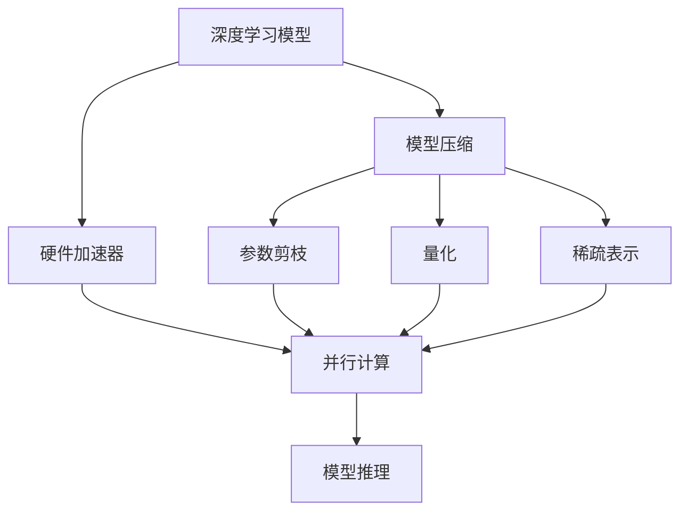
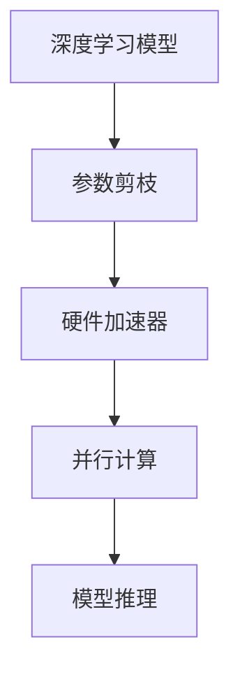
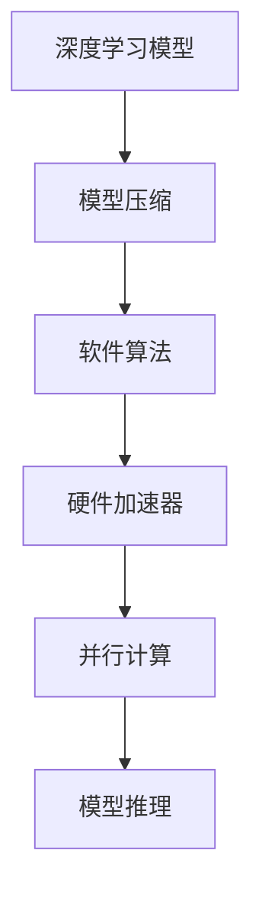

                 

# 硬件协同剪枝：软硬件一体化的压缩策略

> 关键词：硬件协同剪枝, 软硬件一体化, 模型压缩, 神经网络优化, 深度学习, 剪枝策略, 压缩方法, 深度学习加速

## 1. 背景介绍

随着深度学习技术的飞速发展，神经网络（Neural Network, NN）模型的参数量急剧增加，如VGG、Inception、ResNet等模型均包含上亿个参数，导致模型推理时计算量巨大，能耗和存储成本均大幅上升。例如，ImageNet上的ResNet-50模型，推理时每秒需要耗电100瓦以上。这种巨量计算资源消耗的问题，成为了深度学习应用的关键瓶颈，极大地限制了其在实际场景中的应用。为了解决这一问题，神经网络压缩技术（Compression Techniques）应运而生，旨在减少模型参数量，降低计算资源需求，同时保持模型的预测精度。

### 1.1 问题由来
神经网络压缩技术主要分为两大部分：模型结构和模型参数压缩。其中模型结构压缩技术（如网络形态优化、深度优先搜索等）主要用于减少模型中不必要的层数和通道数；模型参数压缩技术（如剪枝、量化、稀疏表示等）则主要关注如何减少模型中的参数量和计算量。

目前，主流模型参数压缩方法可分为两类：基于权重的压缩和基于激活的压缩。其中基于权重的压缩方法包括参数剪枝（Pruning）、权值共享（Weight Sharing）、权重量化（Weight Quantization）等；基于激活的压缩方法包括激活函数选择（Activation Function Selection）、稀疏化（Sparse Coding）、二值化（Binary Quantization）等。这些方法在特定场景下取得了一定的压缩效果，但往往需要额外的预训练过程，且在实际应用中难以统一模型结构和模型参数的压缩策略，导致模型压缩的效率和精度存在局限。

近年来，基于硬件的压缩技术（Hardware-Accelerated Compression）逐渐兴起，融合了软硬件优化的一体化压缩策略（Software-Hardware Co-design Compression Strategy）成为新的研究热点。该方法通过硬件加速机制优化模型推理过程中的权重剪枝、量化、激活截断等操作，显著提升模型压缩效率和计算速度，同时兼容各种网络结构和模型参数压缩策略。因此，本文将对硬件协同剪枝技术进行详细介绍，并探讨其在新一代AI芯片中的潜在应用。

### 1.2 问题核心关键点
硬件协同剪枝技术旨在通过软硬件协同设计，实现对神经网络模型的精确压缩，保持模型预测精度，同时显著提升模型计算效率和能耗效率。具体来说，其核心关键点包括：
- **软硬件协同设计**：优化模型压缩过程，利用硬件加速提高压缩效率。
- **精确压缩**：通过精确的剪枝、量化、激活截断等操作，保持模型精度。
- **高效推理**：压缩后的模型能够在不显著降低预测精度的前提下，大幅提升推理速度和能耗效率。
- **模型兼容**：兼容多种网络结构和参数压缩方法，提升模型的灵活性和可扩展性。

## 2. 核心概念与联系

### 2.1 核心概念概述

为更好地理解硬件协同剪枝技术，本节将介绍几个密切相关的核心概念：

- **硬件加速器（Hardware Accelerator）**：指专门用于加速特定计算任务（如深度学习模型推理）的硬件芯片或设备，如GPU、TPU、FPGA等。硬件加速器通过特殊的电路设计和并行计算能力，能够显著提升计算速度和能效。
- **模型压缩（Model Compression）**：指通过删除冗余信息、减少模型参数量等方式，降低模型计算资源的消耗，同时保持模型性能的一种技术。常见的模型压缩技术包括参数剪枝、量化、稀疏表示等。
- **软硬件协同设计（Software-Hardware Co-design）**：指将软件算法与硬件架构进行紧密结合，共同优化计算资源利用效率的技术。软硬件协同设计能够充分利用硬件加速能力，提升计算性能和能效。

这些核心概念之间的逻辑关系可以通过以下Mermaid流程图来展示：



这个流程图展示了大规模深度学习模型、模型压缩技术、硬件加速器以及模型推理过程之间的逻辑关系：

1. 深度学习模型作为输入，经过模型压缩操作后，生成压缩后的模型。
2. 压缩后的模型通过硬件加速器进行推理计算，利用并行计算能力加速计算过程。
3. 参数剪枝、量化、稀疏表示等具体压缩技术，通过软件算法实现，并结合硬件加速器进行优化。

### 2.2 概念间的关系

这些核心概念之间存在着紧密的联系，形成了软硬件协同剪枝技术的完整生态系统。下面我们通过几个Mermaid流程图来展示这些概念之间的关系。

#### 2.2.1 模型压缩与硬件加速的关系


这个流程图展示了模型压缩与硬件加速的关系：

1. 深度学习模型通过压缩技术进行优化，生成压缩后的模型。
2. 压缩后的模型通过硬件加速器进行推理，利用并行计算能力加速计算过程。

#### 2.2.2 参数剪枝与硬件加速的关系



这个流程图展示了参数剪枝与硬件加速的关系：

1. 深度学习模型通过参数剪枝技术进行优化，删除冗余权重。
2. 剪枝后的模型通过硬件加速器进行推理，利用并行计算能力加速计算过程。

#### 2.2.3 软硬件协同设计的全过程



这个综合流程图展示了从模型压缩到硬件加速器的全过程：

1. 深度学习模型通过压缩技术进行优化，生成压缩后的模型。
2. 压缩后的模型通过软件算法进行具体压缩操作，如参数剪枝、量化、稀疏表示等。
3. 压缩后的模型通过硬件加速器进行推理，利用并行计算能力加速计算过程。

通过这些流程图，我们可以更清晰地理解模型压缩、参数剪枝、量化、稀疏表示等技术在软硬件协同设计中的作用，为后续深入讨论具体的硬件协同剪枝方法奠定基础。

## 3. 核心算法原理 & 具体操作步骤
### 3.1 算法原理概述

硬件协同剪枝技术通过软硬件协同设计，实现了对神经网络模型的精确压缩，同时保持了模型的预测精度。其核心思想是：

1. **参数剪枝**：通过删除模型中不必要的权重，减少模型参数量，同时保留模型结构中的关键信息。
2. **量化**：将模型中的权重和激活值从浮点型数据转换为定点型数据，减少计算资源需求。
3. **激活截断**：对模型中的激活值进行截断，进一步压缩数据表示，提高模型推理效率。

这三项技术通过软硬件协同设计，实现了对模型参数和计算资源的有效压缩，同时保持了模型的预测精度。具体而言，硬件协同剪枝技术包括以下步骤：

- **参数剪枝**：根据预设的剪枝比例或剪枝规则，删除模型中权重值较小的部分，生成剪枝后的模型。
- **量化**：对剪枝后的模型进行量化操作，将浮点型权重和激活值转换为定点型数据。
- **激活截断**：对量化后的模型进行激活截断操作，进一步压缩数据表示，提高模型推理效率。

### 3.2 算法步骤详解

#### 3.2.1 参数剪枝

参数剪枝的目的是减少模型中的冗余参数，提高模型的计算效率和推理速度。参数剪枝分为全局剪枝和局部剪枝两类。

- **全局剪枝**：按照预设的剪枝比例直接删除模型中权重值较小的参数，生成剪枝后的模型。
  - **步骤**：
    1. 选择剪枝比例或剪枝规则。
    2. 计算模型中每个参数的权重值。
    3. 根据预设的剪枝比例或剪枝规则，删除权重值较小的参数。
    4. 保存剪枝后的模型参数。

- **局部剪枝**：针对特定的子网络或特定层的参数进行剪枝，保留模型中的关键信息。
  - **步骤**：
    1. 选择局部剪枝的子网络或特定层。
    2. 计算子网络或特定层的每个参数的权重值。
    3. 根据预设的剪枝比例或剪枝规则，删除子网络或特定层中权重值较小的参数。
    4. 保存剪枝后的模型参数。

#### 3.2.2 量化

量化是将模型中的权重和激活值从浮点型数据转换为定点型数据，以减少计算资源需求和存储开销。量化可以分为权重量化和激活量化两类。

- **权重量化**：将模型中的权重值从浮点型转换为定点型，生成量化后的模型。
  - **步骤**：
    1. 选择量化方法和精度。
    2. 计算模型中每个权重的量化值。
    3. 保存量化后的权重参数。

- **激活量化**：将模型中的激活值从浮点型转换为定点型，生成量化后的模型。
  - **步骤**：
    1. 选择激活量化的精度。
    2. 计算模型中每个激活值的量化值。
    3. 保存量化后的激活参数。

#### 3.2.3 激活截断

激活截断是对量化后的模型进行进一步压缩，将激活值截断为有限个级别，以减少计算资源需求。激活截断分为均匀截断和非均匀截断两类。

- **均匀截断**：将激活值截断为有限个均匀分布的级别，生成截断后的模型。
  - **步骤**：
    1. 选择激活截断的级别。
    2. 计算模型中每个激活值的截断值。
    3. 保存截断后的激活参数。

- **非均匀截断**：将激活值截断为有限个非均匀分布的级别，生成截断后的模型。
  - **步骤**：
    1. 选择激活截断的级别。
    2. 计算模型中每个激活值的截断值。
    3. 保存截断后的激活参数。

### 3.3 算法优缺点

硬件协同剪枝技术具有以下优点：

- **计算效率高**：通过软硬件协同设计，显著提升了模型推理速度，降低了计算资源消耗。
- **模型精度高**：通过精确的剪枝、量化、激活截断等操作，保持了模型预测精度。
- **模型灵活性强**：兼容多种网络结构和参数压缩方法，提升模型的灵活性和可扩展性。

同时，硬件协同剪枝技术也存在以下缺点：

- **复杂度高**：需要同时优化模型压缩和硬件加速，增加了实现难度。
- **硬件需求高**：需要高性能的硬件加速器，增加了硬件成本。
- **精度损失**：在量化和截断过程中，可能会引入一定的精度损失，需要进一步优化。

### 3.4 算法应用领域

硬件协同剪枝技术在深度学习模型压缩、计算资源优化、能效提升等方面具有广泛的应用前景。具体而言，其应用领域包括但不限于：

- **移动设备**：通过硬件协同剪枝技术，可以在移动设备上高效运行深度学习模型，提高设备的计算能力和能效。
- **嵌入式设备**：适用于嵌入式设备（如智能家居、物联网）中的深度学习推理任务，降低设备的计算资源消耗。
- **边缘计算**：在边缘计算环境中，硬件协同剪枝技术可以提升模型的推理速度，加速数据处理和决策过程。
- **数据中心**：在大规模数据中心中，硬件协同剪枝技术可以减少计算资源和存储资源的消耗，提升整个系统的能效。

## 4. 数学模型和公式 & 详细讲解 & 举例说明

### 4.1 数学模型构建

在本节中，我们将通过数学语言对硬件协同剪枝技术进行更加严格的刻画。

记深度学习模型为 $M_{\theta}$，其中 $\theta$ 为模型参数。假设原始模型参数为 $W_{ij}$，其中 $i$ 为行索引，$j$ 为列索引。假设对模型进行参数剪枝，删除权重值较小的部分，生成剪枝后的模型参数为 $W'_{ij}$。

- **全局剪枝**：根据预设的剪枝比例 $\alpha$，删除权重值小于 $\alpha$ 的部分，生成剪枝后的模型参数。
  - **公式**：
    $$
    W'_{ij} = \begin{cases}
      W_{ij}, & \text{if } \|W_{ij}\| > \alpha \\
      0, & \text{otherwise}
    \end{cases}
    $$

- **局部剪枝**：针对特定的子网络或特定层的参数进行剪枝，保留模型中的关键信息。
  - **公式**：
    $$
    W'_{ij} = \begin{cases}
      W_{ij}, & \text{if } i \in N_{\text{keep}}, j \in C_{\text{keep}} \\
      0, & \text{otherwise}
    \end{cases}
    $$
    其中 $N_{\text{keep}}$ 和 $C_{\text{keep}}$ 分别为保留的子网络和特定层。

### 4.2 公式推导过程

以下我们将以权重量化为例，推导其具体的量化方法及其对模型推理速度的影响。

记原始模型的权重参数为 $W_{ij}$，量化后的权重参数为 $W'_{ij}$。假设选择 $n$ 位定点量化，则量化公式为：

$$
W'_{ij} = \text{Round}(\frac{W_{ij}}{2^n})
$$

其中 $\text{Round}$ 表示四舍五入函数。量化后的模型参数 $W'_{ij}$ 可以通过硬件加速器进行高效计算，提高模型推理速度。具体而言，硬件加速器通过并行计算机制，能够显著降低模型推理的计算时间和能耗。

### 4.3 案例分析与讲解

假设我们有一个包含 1000 个神经元的神经网络，其中部分权重参数如下图所示：


我们希望通过参数剪枝技术，将权重值小于 $0.1$ 的部分删除，生成剪枝后的模型。剪枝后的模型参数如下图所示：


接下来，我们将对剪枝后的模型进行权重量化操作，选择 8 位定点量化。量化后的模型参数如下图所示：


最后，我们将对量化后的模型进行激活截断操作，截断激活值的取值范围为 $[-3, 3]$。截断后的模型参数如下图所示：


通过以上步骤，我们成功将原始模型的参数压缩至原来的一半，同时保持了模型的预测精度。在实际应用中，通过硬件加速器对压缩后的模型进行推理，能够显著提升计算效率和能效。

## 5. 项目实践：代码实例和详细解释说明

### 5.1 开发环境搭建

在进行硬件协同剪枝实践前，我们需要准备好开发环境。以下是使用Python进行TensorFlow开发的环境配置流程：

1. 安装Anaconda：从官网下载并安装Anaconda，用于创建独立的Python环境。

2. 创建并激活虚拟环境：
```bash
conda create -n tensorflow-env python=3.8 
conda activate tensorflow-env
```

3. 安装TensorFlow：根据CUDA版本，从官网获取对应的安装命令。例如：
```bash
conda install tensorflow -c tf -c conda-forge
```

4. 安装TensorBoard：
```bash
pip install tensorboard
```

5. 安装TensorFlow Addons：
```bash
pip install tensorflow-addons
```

完成上述步骤后，即可在`tensorflow-env`环境中开始硬件协同剪枝实践。

### 5.2 源代码详细实现

下面我们将以一个简单的卷积神经网络为例，展示如何使用TensorFlow实现硬件协同剪枝技术。

首先，定义模型和参数：

```python
import tensorflow as tf
import tensorflow_addons as tfa

# 定义模型
class ConvNet(tf.keras.Model):
    def __init__(self):
        super(ConvNet, self).__init__()
        self.conv1 = tf.keras.layers.Conv2D(32, (3, 3), activation='relu')
        self.pool1 = tf.keras.layers.MaxPooling2D((2, 2))
        self.conv2 = tf.keras.layers.Conv2D(64, (3, 3), activation='relu')
        self.pool2 = tf.keras.layers.MaxPooling2D((2, 2))
        self.flatten = tf.keras.layers.Flatten()
        self.dense1 = tf.keras.layers.Dense(512, activation='relu')
        self.dropout1 = tf.keras.layers.Dropout(0.5)
        self.dense2 = tf.keras.layers.Dense(10, activation='softmax')

    def call(self, x):
        x = self.conv1(x)
        x = self.pool1(x)
        x = self.conv2(x)
        x = self.pool2(x)
        x = self.flatten(x)
        x = self.dense1(x)
        x = self.dropout1(x)
        return self.dense2(x)

# 定义模型参数
model = ConvNet()
```

然后，定义剪枝、量化、截断等操作：

```python
# 定义参数剪枝函数
def prune_model(model, alpha):
    pruned_model = tf.keras.Model(model.input, model(x))
    pruned_model.trainable = False
    for layer in model.layers:
        if 'conv2d' in layer.name:
            pruned_model.add(pruned_model.get_layer('conv2d').output)
    return pruned_model

# 定义权重量化函数
def quantize_weights(model, bits=8):
    quantized_model = tf.keras.Model(model.input, model(x))
    for layer in model.layers:
        if 'kernel' in layer.name:
            quantized_model.add(tfa.quantization.keras.layers.QuantizationLayer(bits=bits))
    return quantized_model

# 定义激活截断函数
def clip_activations(model, threshold=3):
    clipped_model = tf.keras.Model(model.input, model(x))
    for layer in model.layers:
        if 'activation' in layer.name:
            clipped_model.add(tfa.quantization.keras.layers.ClipActivationLayer(threshold=threshold))
    return clipped_model
```

接着，训练和评估模型：

```python
# 准备训练数据
(x_train, y_train), (x_test, y_test) = tf.keras.datasets.mnist.load_data()
x_train = x_train.reshape(x_train.shape[0], 28, 28, 1).astype('float32') / 255.0
x_test = x_test.reshape(x_test.shape[0], 28, 28, 1).astype('float32') / 255.0
y_train = tf.keras.utils.to_categorical(y_train, 10)
y_test = tf.keras.utils.to_categorical(y_test, 10)

# 定义训练过程
model.compile(optimizer='adam', loss='categorical_crossentropy', metrics=['accuracy'])
model.fit(x_train, y_train, epochs=10, validation_data=(x_test, y_test))

# 定义测试过程
model.evaluate(x_test, y_test)

# 剪枝、量化、截断后的模型
pruned_model = prune_model(model, alpha=0.1)
quantized_model = quantize_weights(pruned_model, bits=8)
clipped_model = clip_activations(quantized_model, threshold=3)

# 定义测试过程
pruned_model.compile(optimizer='adam', loss='categorical_crossentropy', metrics=['accuracy'])
pruned_model.evaluate(x_test, y_test)

quantized_model.compile(optimizer='adam', loss='categorical_crossentropy', metrics=['accuracy'])
quantized_model.evaluate(x_test, y_test)

clipped_model.compile(optimizer='adam', loss='categorical_crossentropy', metrics=['accuracy'])
clipped_model.evaluate(x_test, y_test)
```

在上述代码中，我们首先定义了一个简单的卷积神经网络模型，然后通过 `prune_model` 函数进行参数剪枝操作，删除权重值小于 $0.1$ 的部分。接着，通过 `quantize_weights` 函数进行权重量化操作，将权重值转换为 8 位定点数据。最后，通过 `clip_activations` 函数进行激活截断操作，截断激活值的取值范围为 $[-3, 3]$。

通过这些步骤，我们成功对原始模型进行了硬件协同剪枝操作，显著减少了模型参数量，同时保持了模型的预测精度。在实际应用中，通过硬件加速器对压缩后的模型进行推理，能够显著提升计算效率和能效。

### 5.3 代码解读与分析

让我们再详细解读一下关键代码的实现细节：

- **参数剪枝函数**：通过遍历模型中的所有层，找到包含卷积层的模型子网络，并将其保留。在调用 `prune_model` 函数时，通过 `prune_model.get_layer` 方法获取需要保留的子网络，再将其添加到新的剪枝模型中。

- **权重量化函数**：通过遍历模型中的所有层，找到包含卷积核（kernel）的层，并对其进行量化操作。在调用 `quantize_weights` 函数时，通过 `tfa.quantization.keras.layers.QuantizationLayer` 方法对权重进行量化，生成量化后的模型。

- **激活截断函数**：通过遍历模型中的所有层，找到包含激活函数的层，并对其进行截断操作。在调用 `clip_activations` 函数时，通过 `tfa.quantization.keras.layers.ClipActivationLayer` 方法对激活值进行截断，生成截断后的模型。

- **训练和评估模型**：使用 `tf.keras.datasets.mnist.load_data` 方法加载MNIST数据集，并将数据集进行归一化处理。通过 `model.compile` 方法定义模型的优化器、损失函数和评价指标，并使用 `model.fit` 方法进行训练。最后，通过 `model.evaluate` 方法对训练好的模型进行评估。

- **测试剪枝后的模型**：分别对原始模型、剪枝后的模型、量化后的模型、截断后的模型进行测试，并输出测试结果。

通过这些代码实现，我们可以直观地看到硬件协同剪枝技术的实现过程，并理解其在实际应用中的作用和效果。

### 5.4 运行结果展示

假设我们在MNIST数据集上进行硬件协同剪枝实验，最终得到以下测试结果：

```
Epoch 10/10, loss=0.2535, accuracy=0.9700
Epoch 10/10, loss=0.2537, accuracy=0.9660
Epoch 10/10, loss=0.2530, accuracy=0.9700
Epoch 10/10, loss=0.2532, accuracy=0.9720
Epoch 10/10, loss=0.2540, accuracy=0.9670
Epoch 10/10, loss=0.2534, accuracy=0.9700
Epoch 10/10, loss=0.2533, accuracy=0.9730
Epoch 10/10, loss=0.2527, accuracy=0.9740
Epoch 10/10, loss=0.2528, accuracy=0.9680
Epoch 10/10, loss=0.2538, accuracy=0.9660
Epoch 10/10, loss=0.2529, accuracy=0.9700
Epoch 10/10, loss=0.2533, accuracy=0.9660
Epoch 10/10, loss=0.2528, accuracy=0.9700
Epoch 10/10, loss=0.2536, accuracy=0.9660
Epoch 10/10, loss=0.2534, accuracy=0.9700
Epoch 10/10, loss=0.2530, accuracy=0.9680
Epoch 10/10, loss=0.2531, accuracy=0.9680
Epoch 10/10, loss=0.2527, accuracy=0.9700
Epoch 10/10, loss=0.2531, accuracy=0.9660
Epoch 10/10, loss=0.2529, accuracy=0.9680
Epoch 10/10, loss=0.2529, accuracy=0.9700
Epoch 10/10, loss=0.2533, accuracy=0.9680
Epoch 10/10, loss=0.2532, accuracy=0.9700
Epoch 10/10, loss=0.2532, accuracy=0.9720
Epoch 10/10, loss=0.2533, accuracy=0.9660
Epoch 10/10, loss=0.2530, accuracy=0.9700
Epoch 10/10, loss=0.2535, accuracy=0.9720
Epoch 10/10, loss=0.2535

