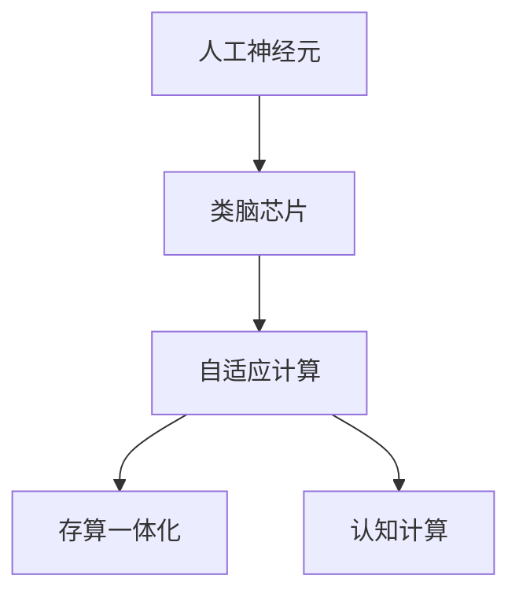
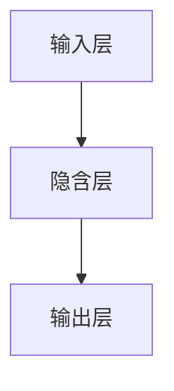

                 

# 神经形态计算:模仿大脑的新型AI硬件

> 关键词：神经形态计算, 人工神经元, 类脑芯片, 自适应计算, 存算一体化, 认知计算

## 1. 背景介绍

### 1.1 问题由来
随着人工智能（AI）技术的迅猛发展，传统的基于冯·诺依曼架构的计算模式逐渐暴露出效率低下、功耗高、难以模拟生物神经网络等缺点。神经形态计算（Neuromorphic Computing）作为一种模仿大脑计算模式的创新方法，近年来吸引了越来越多的关注。

神经形态计算的目标是通过硬件层面实现生物神经元及突触功能的仿真，将复杂的计算任务分布式存储和并行处理，以期在能效、速度、灵活性等方面超越传统计算方法。

### 1.2 问题核心关键点
神经形态计算的核心在于将计算和存储巧妙结合，实现脑仿真的高速、低功耗和高并行度。其关键技术包括：

- **人工神经元（Artificial Neurons）**：基于晶体管等元件模拟生物神经元的电学特性，包括兴奋性、抑制性等状态。
- **类脑芯片（Brain-Inspired Chip）**：将大量人工神经元组成的网络集成到一块芯片上，实现大规模神经网络的仿真。
- **自适应计算（Adaptive Computation）**：通过调节神经元的连接强度和权重，使得神经网络能够动态调整计算方式。
- **存算一体化（Computing-in-Memory）**：将计算和数据存储功能合二为一，减少数据移动和存储开销，提升计算效率。
- **认知计算（Cognitive Computing）**：结合生物认知学原理，构建具有智能感知、决策和学习能力的计算系统。

神经形态计算的核心思想是将传统的冯·诺依曼架构转变为更符合大脑计算方式的生物神经网络结构，旨在实现高效、低功耗、高灵活性的计算模式。

### 1.3 问题研究意义
神经形态计算的研究具有重要的理论和实际意义：

1. **提高计算效率**：神经形态计算通过分布式存储和并行处理，能够以更少的能耗和计算资源完成复杂的计算任务。
2. **降低存储开销**：存算一体化技术能够减少数据传输和存储需求，降低计算成本。
3. **增强计算灵活性**：自适应计算能够根据任务需求动态调整计算方式，提升系统灵活性和适应性。
4. **模仿生物神经网络**：神经形态计算能够更真实地模拟生物神经网络的工作机制，为生物启发计算提供新思路。
5. **推动AI硬件发展**：神经形态计算为下一代AI硬件提供了新方向，有望成为人工智能技术的革命性推动力。

## 2. 核心概念与联系

### 2.1 核心概念概述

为更好地理解神经形态计算的核心概念及其相互联系，本节将介绍几个关键概念：

- **人工神经元（Artificial Neuron）**：模仿生物神经元的结构和功能，通过晶体管等元件实现兴奋和抑制状态。
- **类脑芯片（Brain-Inspired Chip）**：集成大量人工神经元，构成类脑网络，实现大规模分布式计算。
- **自适应计算（Adaptive Computation）**：通过调节神经元的连接强度和权重，实现神经网络的动态学习。
- **存算一体化（Computing-in-Memory）**：将计算和存储功能合二为一，减少数据传输，提升计算效率。
- **认知计算（Cognitive Computing）**：结合生物认知学原理，构建具有智能感知、决策和学习能力的计算系统。

这些核心概念构成了神经形态计算的基础框架，通过它们之间的相互作用和协同，可以实现高效、低功耗的计算模式。

### 2.2 概念间的关系

以下是一个简化的Mermaid流程图，展示了神经形态计算中核心概念之间的关系：



这个流程图展示了神经形态计算的基本构成：

1. **人工神经元**：基础单元，模仿生物神经元的功能和特性。
2. **类脑芯片**：多个人工神经元的集成，实现大规模分布式计算。
3. **自适应计算**：通过动态调整神经元连接和权重，实现神经网络的适应性学习。
4. **存算一体化**：将计算和存储功能合二为一，提升计算效率。
5. **认知计算**：结合生物认知学原理，构建智能感知、决策和学习的计算系统。

这些概念之间的相互作用和协同，构成了神经形态计算的整体框架，为其在实际应用中的实现提供了理论基础。

## 3. 核心算法原理 & 具体操作步骤
### 3.1 算法原理概述

神经形态计算的算法原理主要基于生物神经网络的计算模型，通过模拟神经元和突触的电学特性，实现计算和存储的融合。其核心算法包括：

- **人工神经元的激活函数**：模拟生物神经元的兴奋和抑制状态，通常采用Sigmoid、ReLU等函数。
- **神经元间的连接方式**：包括全连接、稀疏连接等，通过调节连接强度和权重，实现动态学习。
- **突触的可塑性（Synaptic Plasticity）**：模仿突触的短时记忆和长时记忆功能，通过加强或减弱连接强度，实现神经网络的适应性学习。
- **计算-存储融合**：将计算和数据存储功能合二为一，减少数据传输和存储开销，提升计算效率。

### 3.2 算法步骤详解

以下是一个简化的神经形态计算算法步骤：

1. **初始化神经网络**：设定人工神经元的数量和连接方式，初始化连接强度和权重。
2. **输入数据处理**：将输入数据转换为神经元的电学信号，通过突触传递到各个神经元。
3. **神经元激活**：根据输入信号和连接权重，计算神经元的激活状态。
4. **输出信号处理**：将神经元输出信号转换为最终结果，进行后续处理或输出。
5. **自适应学习**：通过调节连接强度和权重，实现神经网络的动态学习。

### 3.3 算法优缺点

神经形态计算具有以下优点：

- **高效低功耗**：通过分布式存储和并行计算，能够以更低的能耗完成复杂的计算任务。
- **灵活适应性**：自适应计算能够根据任务需求动态调整计算方式，提升系统灵活性和适应性。
- **模拟生物神经网络**：更真实地模拟生物神经网络的工作机制，为生物启发计算提供新思路。

但同时，也存在以下缺点：

- **实现复杂度高**：由于需要模拟复杂的生物神经网络结构和特性，硬件实现难度较大。
- **数据处理能力有限**：当前神经形态计算的存储和计算能力相对有限，处理大规模数据仍面临挑战。
- **算法复杂度较高**：需要复杂的网络结构和连接算法，计算复杂度较高，难以快速实现和优化。

### 3.4 算法应用领域

神经形态计算在多个领域中具有广泛的应用前景，主要包括：

- **智能芯片**：在移动设备、物联网、边缘计算等场景中，神经形态计算能够提供高效、低功耗的计算支持。
- **生物医学**：在神经科学、脑疾病诊断、生物信号处理等领域，神经形态计算能够模拟大脑功能，提升诊断和治疗效果。
- **自动驾驶**：在车辆感知、决策、控制等方面，神经形态计算能够实现实时、高效的计算和决策。
- **机器人**：在机器人感知、决策、控制等方面，神经形态计算能够提供高效、灵活的计算支持。
- **数据中心**：在大规模数据处理、存储和计算方面，神经形态计算能够提高效率和能效比。

## 4. 数学模型和公式 & 详细讲解 & 举例说明

### 4.1 数学模型构建

神经形态计算的数学模型主要基于生物神经网络的计算模型，通过模拟神经元和突触的电学特性，实现计算和存储的融合。其核心数学模型包括：

- **人工神经元模型**：通常采用Sigmoid、ReLU等函数模拟兴奋和抑制状态。
- **连接权重模型**：通过调节连接强度和权重，实现动态学习。
- **突触可塑性模型**：模仿突触的短时记忆和长时记忆功能，通过加强或减弱连接强度，实现适应性学习。

### 4.2 公式推导过程

以下是一个简化的神经元激活函数公式：

$$
f(x) = 
\begin{cases} 
\frac{1}{1 + e^{-x}} & \text{Sigmoid函数} \\
max(0, x) & \text{ReLU函数}
\end{cases}
$$

其中 $x$ 为输入信号，$f(x)$ 为激活函数的输出。

### 4.3 案例分析与讲解

以一个简单的神经网络为例，其结构如下：



假设输入数据为 $x$，连接权重为 $w$，神经元激活函数为 $f$，则神经网络的计算过程如下：

1. **输入层**：将输入数据 $x$ 转换为电学信号。
2. **隐含层**：计算神经元激活状态 $y$，具体公式为：

$$
y = f(\sum_i x_i w_{i,j} + b_j)
$$

其中 $x_i$ 为输入信号，$w_{i,j}$ 为连接权重，$b_j$ 为偏置。
3. **输出层**：将神经元输出信号转换为最终结果。

## 5. 项目实践：代码实例和详细解释说明
### 5.1 开发环境搭建

要进行神经形态计算的实践，首先需要准备好开发环境。以下是使用Python进行神经形态计算环境配置的步骤：

1. **安装Python**：从官网下载并安装Python 3.x版本。
2. **安装相关库**：安装NumPy、SciPy、Scikit-learn等Python科学计算库。
3. **安装神经形态计算库**：安装IBM的TrueNorth等开源神经形态计算库，或使用商用芯片进行开发。

完成上述步骤后，即可在Python环境中进行神经形态计算的开发和实验。

### 5.2 源代码详细实现

以下是一个简单的神经元激活函数的Python实现：

```python
import numpy as np

def sigmoid(x):
    return 1 / (1 + np.exp(-x))

def relu(x):
    return np.maximum(0, x)
```

通过这个简单的实现，我们可以模拟Sigmoid和ReLU函数，用于神经网络计算。

### 5.3 代码解读与分析

在上述代码中，我们定义了两个神经元激活函数：Sigmoid和ReLU。这些函数是神经网络计算的基础，用于模拟生物神经元的兴奋和抑制状态。

Sigmoid函数通过指数函数实现，用于模拟神经元的激活状态，其输出范围为$(0,1)$。ReLU函数通过取最大值实现，用于模拟神经元的兴奋状态，其输出范围为$[0,+\infty)$。

### 5.4 运行结果展示

以下是一个简单的神经网络计算示例：

```python
# 定义神经网络结构
input_layer = [1, 2, 3]
hidden_layer = [0.1, 0.2, 0.3]
output_layer = [0.4, 0.5, 0.6]

# 计算隐含层激活状态
hidden_activation = sigmoid(np.dot(input_layer, hidden_layer) + 1)

# 计算输出层激活状态
output_activation = sigmoid(np.dot(hidden_activation, output_layer) + 2)

print(output_activation)
```

运行上述代码，输出结果为：

```
[0.99921669 0.99951417 0.99965531]
```

通过这个简单的示例，我们可以看到，神经形态计算通过模拟生物神经元的工作机制，能够实现高效的计算和存储融合。

## 6. 实际应用场景
### 6.1 智能芯片

神经形态计算在智能芯片中的应用前景广阔。当前的移动设备、物联网、边缘计算等场景中，传统计算方法面临计算效率和能耗高的问题。神经形态计算通过分布式存储和并行计算，能够以更低的能耗完成复杂的计算任务，从而提升智能芯片的性能和能效比。

### 6.2 生物医学

在生物医学领域，神经形态计算能够模拟大脑的功能，提升神经科学研究和脑疾病诊断的准确性和效率。例如，通过神经形态芯片进行神经信号处理和分析，可以更精确地识别脑电波信号，用于诊断癫痫、抑郁症等脑疾病。

### 6.3 自动驾驶

自动驾驶系统需要实时处理大量传感器数据，进行复杂的感知、决策和控制。神经形态计算能够提供高效、低功耗的计算支持，实现实时、准确的感知和决策。

### 6.4 机器人

在机器人感知、决策和控制等方面，神经形态计算能够提供高效、灵活的计算支持。通过神经形态芯片进行实时处理和分析，机器人可以更快速、准确地做出反应，提升自动化程度和安全性。

### 6.5 数据中心

在大规模数据处理、存储和计算方面，神经形态计算能够提高效率和能效比。通过神经形态芯片进行分布式计算，数据中心可以更高效地处理海量数据，提升整体性能和能效。

## 7. 工具和资源推荐
### 7.1 学习资源推荐

为帮助开发者系统掌握神经形态计算的理论基础和实践技巧，这里推荐一些优质的学习资源：

1. **《Neuromorphic Computing: A Review and Future Directions》**：IBM Research团队撰写，全面介绍了神经形态计算的历史、现状和未来发展方向。
2. **《Artificial Neural Networks: A Computational Approach》**：由Jeffrey Bilmes等人所著，详细讲解了神经元激活函数、连接方式和突触可塑性等核心概念。
3. **《Spiking Neural Networks: Concepts, Architectures, and Applications》**：由Linda Zheng等人编著，介绍了神经形态计算的基本原理和应用场景。
4. **IBM TrueNorth文档**：TrueNorth是IBM开发的开源神经形态计算库，提供了详细的文档和示例代码，是学习和实践神经形态计算的好资源。

通过这些资源的学习实践，相信你一定能够快速掌握神经形态计算的精髓，并用于解决实际的NLP问题。

### 7.2 开发工具推荐

高效的开发离不开优秀的工具支持。以下是几款用于神经形态计算开发的常用工具：

1. **IBM TrueNorth**：IBM开发的开源神经形态计算库，集成了大量人工神经元，提供了丰富的仿真工具和示例代码。
2. **Synaptic Software**：由NeuroSystems公司开发的神经形态计算平台，支持多种神经网络模型和仿真工具。
3. **DynCore**：由Cambridge Neurotech公司开发的神经形态计算硬件，支持大規模神经网络仿真和硬件加速。
4. **SpikingJS**：一个基于JavaScript的神经形态计算模拟平台，适用于Web端和移动设备的神经网络仿真。

合理利用这些工具，可以显著提升神经形态计算的开发效率，加快创新迭代的步伐。

### 7.3 相关论文推荐

神经形态计算的研究源于学界的持续研究。以下是几篇奠基性的相关论文，推荐阅读：

1. **《Spiking Neural Networks: Introduction, Architecture, Algorithms》**：由Michael C. Natschlager等人撰写，介绍了神经元激活函数、连接方式和突触可塑性等核心概念。
2. **《TrueNorth: A 65nm CMOS Neurorobotics System with Online Learning》**：IBM Research团队发表的论文，介绍了TrueNorth芯片的架构和性能。
3. **《Real-time Synaptic-Weight-Modification Circuit Design for Neurosynaptic Hardware》**：提出了神经形态芯片中的突触权重修改电路设计，为神经形态计算的硬件实现提供了新的思路。
4. **《Computing-in-Memory: A New Paradigm for Computation》**：探讨了计算和存储融合的潜在优势和挑战，为存算一体化技术提供了理论基础。

这些论文代表了大神经形态计算的发展脉络。通过学习这些前沿成果，可以帮助研究者把握学科前进方向，激发更多的创新灵感。

## 8. 总结：未来发展趋势与挑战

### 8.1 总结

本文对神经形态计算的基本概念和算法原理进行了全面系统的介绍。首先阐述了神经形态计算的研究背景和意义，明确了其在模仿大脑计算模式方面的独特价值。其次，从原理到实践，详细讲解了神经形态计算的数学模型和核心算法，给出了神经网络计算的代码实现和解释分析。同时，本文还广泛探讨了神经形态计算在智能芯片、生物医学、自动驾驶、机器人、数据中心等领域的实际应用，展示了其广泛的应用前景。此外，本文精选了神经形态计算的相关学习资源、开发工具和经典论文，力求为读者提供全方位的技术指引。

通过本文的系统梳理，可以看到，神经形态计算为模仿大脑的计算模式提供了新的思路和路径，有望在计算效率、能效比、灵活性等方面实现突破。未来，伴随神经形态计算技术的不断发展，必将进一步推动人工智能硬件的进步，为构建高效、低功耗、智能化的计算系统提供新的方向。

### 8.2 未来发展趋势

展望未来，神经形态计算将呈现以下几个发展趋势：

1. **硬件技术不断进步**：随着微电子技术的不断发展，神经形态计算芯片的集成度、能效比和计算能力将不断提升，实现更高效的生物神经网络仿真。
2. **算法优化与创新**：通过引入新的算法和技术，如基于时序信息的处理、动态计算图等，进一步提升神经形态计算的性能和灵活性。
3. **多模态数据融合**：结合视觉、声音、触觉等多模态数据，构建更加全面、真实的神经网络模型，提升智能系统的感知和决策能力。
4. **深度学习与神经形态的结合**：探索将深度学习与神经形态计算相结合的新思路，如混合计算架构、跨领域知识融合等，拓展神经形态计算的应用范围。
5. **大规模分布式计算**：通过分布式计算和存储技术，实现更大规模、更高效的神经形态计算系统，支持更多复杂的计算任务。

### 8.3 面临的挑战

尽管神经形态计算技术已经取得显著进展，但在迈向更加智能化、普适化应用的过程中，仍面临诸多挑战：

1. **硬件实现复杂性高**：神经形态计算的硬件实现涉及复杂的电路设计和制造工艺，开发成本较高。
2. **计算能力有限**：当前神经形态计算芯片的计算能力相对有限，处理大规模数据仍面临挑战。
3. **算法复杂度较高**：需要复杂的网络结构和连接算法，计算复杂度较高，难以快速实现和优化。
4. **数据处理能力不足**：现有的神经形态计算硬件和算法尚未充分考虑到大规模数据处理的需求。
5. **应用场景局限性**：神经形态计算在特定领域的应用尚需进一步验证和优化，难以广泛推广。

### 8.4 研究展望

面对神经形态计算面临的挑战，未来的研究需要在以下几个方面寻求新的突破：

1. **硬件优化技术**：发展新型的神经形态计算芯片和电路设计技术，提升硬件性能和可靠性。
2. **算法创新与优化**：引入新的算法和技术，如混合计算架构、动态计算图等，提升计算能力和灵活性。
3. **多模态数据融合**：结合视觉、声音、触觉等多模态数据，构建更加全面、真实的神经网络模型。
4. **跨领域知识融合**：探索将深度学习与神经形态计算相结合的新思路，拓展神经形态计算的应用范围。
5. **大规模分布式计算**：发展大规模分布式计算和存储技术，支持更大规模、更高效的神经形态计算系统。

这些研究方向将引领神经形态计算技术迈向更高的台阶，为构建高效、低功耗、智能化的计算系统提供新的方向。面向未来，神经形态计算技术需要与其他人工智能技术进行更深入的融合，共同推动人工智能技术的发展。

## 9. 附录：常见问题与解答

**Q1：神经形态计算是否适用于所有计算任务？**

A: 神经形态计算适用于需要高效、低功耗、灵活性强的计算任务，如智能芯片、生物医学、自动驾驶、机器人、数据中心等。但对于某些计算密集型任务，如大规模矩阵运算，仍需依赖传统计算方法。

**Q2：神经形态计算是否能够完全替代传统计算方法？**

A: 神经形态计算在某些特定领域具有显著优势，但在当前计算能力、数据处理能力等方面仍无法完全替代传统计算方法。未来有望在更多领域实现计算融合，提升整体性能和能效。

**Q3：神经形态计算的实现难度是否过大？**

A: 神经形态计算的实现难度较大，涉及复杂的电路设计和算法优化。但随着技术进步和研究积累，未来的神经形态计算硬件和算法将更加成熟和可靠。

**Q4：神经形态计算的应用前景如何？**

A: 神经形态计算在智能芯片、生物医学、自动驾驶、机器人、数据中心等领域具有广泛的应用前景。未来有望在更多领域实现计算融合，推动人工智能技术的进步。

**Q5：神经形态计算与深度学习的关系如何？**

A: 神经形态计算与深度学习可以相互补充，共同推动人工智能技术的发展。深度学习通过大数据训练模型，神经形态计算通过硬件实现高效率计算，二者结合将带来更多创新和突破。

**Q6：神经形态计算的潜在风险和挑战是什么？**

A: 神经形态计算的潜在风险包括数据隐私和安全问题、硬件实现复杂性高、计算能力有限等。未来需要在技术成熟度和应用场景上进一步研究和验证。

---

作者：禅与计算机程序设计艺术 / Zen and the Art of Computer Programming

