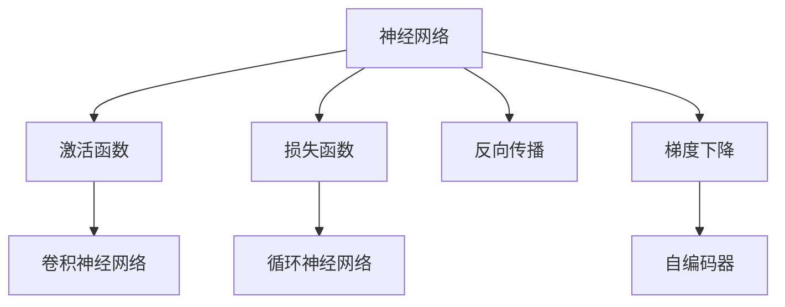
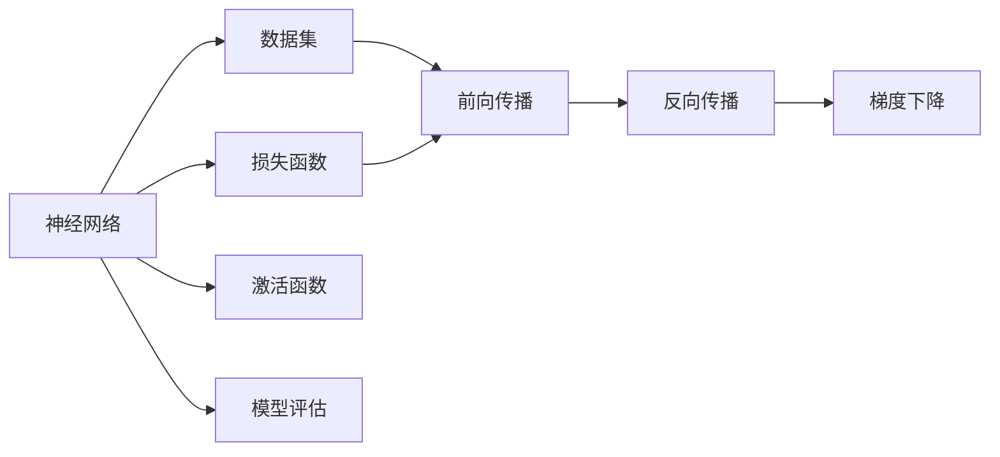
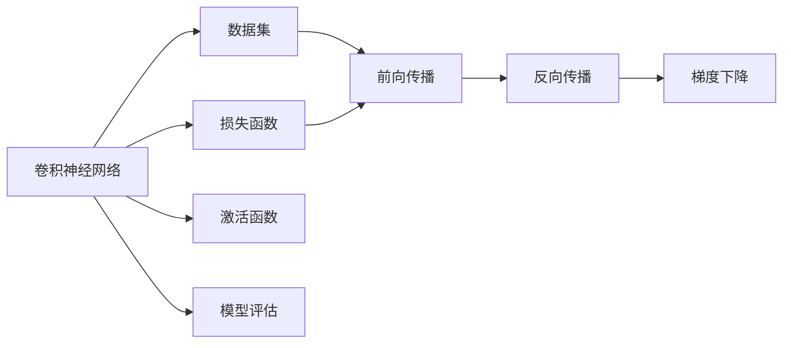
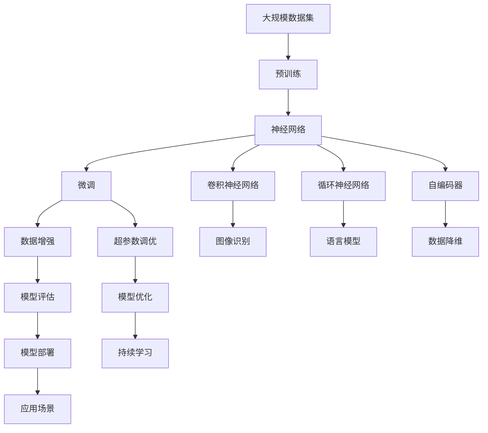

                 

# 神经网络原理与代码实例讲解

> 关键词：神经网络,反向传播,激活函数,损失函数,梯度下降,卷积神经网络,循环神经网络,自编码器,深度学习

## 1. 背景介绍

### 1.1 问题由来
神经网络（Neural Networks）是深度学习领域的一个重要分支，自20世纪80年代以来，已经逐渐成为解决各种复杂问题的有效工具。神经网络以生物神经网络为灵感，由许多简单的处理单元（神经元）组成，每个单元可以接收输入数据，并根据某些规则（通常是基于生物神经元间的突触连接）进行处理，并产生输出。神经网络的复杂性和可塑性使其能够适应和解决各种类型的学习任务，如图像识别、自然语言处理、语音识别、推荐系统、游戏AI等。

神经网络之所以能在诸多领域取得显著成果，主要原因在于其强大的特征提取和模式识别能力，以及在处理复杂非线性关系上的天然优势。然而，神经网络的训练过程通常需要大量的标注数据和强大的计算资源，同时网络的结构设计、激活函数选择、损失函数设定等超参数的调整，都极大地影响着神经网络的性能。

因此，理解神经网络的工作原理，掌握其训练方法，并能够进行高效、合理的超参数调整，是神经网络应用的基石。本文将从神经网络的基本原理出发，通过实例代码讲解神经网络的训练过程，探讨其优缺点和应用领域，并通过实际应用场景展示神经网络的力量。

### 1.2 问题核心关键点
神经网络的训练过程通常包括以下几个步骤：

- 选择合适的神经网络架构，包括层数、每层的节点数、激活函数等。
- 定义损失函数，衡量预测值与真实值之间的差异。
- 选择优化算法，如梯度下降，更新神经网络的权重和偏置。
- 设置学习率、批大小等训练参数，并进行模型训练。
- 使用测试集评估模型性能，并根据结果进行模型优化。

本文将重点讲解神经网络的核心算法原理，并通过代码实例展示神经网络的训练过程。同时，我们也会探讨神经网络在实际应用中的优缺点，以及未来的发展趋势和面临的挑战。

## 2. 核心概念与联系

### 2.1 核心概念概述

为更好地理解神经网络的训练过程，本节将介绍几个密切相关的核心概念：

- 神经网络（Neural Network）：由多个神经元（或称节点）组成的计算模型，用于解决分类、回归等任务。
- 激活函数（Activation Function）：神经元的非线性函数，用于引入非线性变换，提高神经网络的表达能力。
- 损失函数（Loss Function）：用于衡量模型预测值与真实值之间的差异，常见的有均方误差（MSE）、交叉熵（Cross-Entropy）等。
- 反向传播（Backpropagation）：神经网络训练中的核心算法，通过链式法则反向传播误差，更新模型参数。
- 梯度下降（Gradient Descent）：一种常用的优化算法，通过迭代调整模型参数，最小化损失函数。
- 卷积神经网络（Convolutional Neural Network, CNN）：一种特殊类型的神经网络，常用于图像识别、目标检测等任务。
- 循环神经网络（Recurrent Neural Network, RNN）：一种特殊类型的神经网络，常用于序列数据处理，如文本生成、语言模型等。
- 自编码器（Autoencoder）：一种用于数据降维和特征提取的神经网络，能够通过压缩和重构数据，学习数据的低维表示。

这些核心概念之间的逻辑关系可以通过以下Mermaid流程图来展示：



这个流程图展示了几类重要神经网络类型及其与核心概念的关系：

- 神经网络使用激活函数、损失函数、反向传播和梯度下降等技术进行训练。
- 卷积神经网络、循环神经网络、自编码器是神经网络中的几种特殊类型，适用于特定的任务场景。

### 2.2 概念间的关系

这些核心概念之间存在着紧密的联系，形成了神经网络训练和应用的整体框架。下面我们通过几个Mermaid流程图来展示这些概念之间的关系。

#### 2.2.1 神经网络的基本训练流程



这个流程图展示了神经网络的基本训练流程：

- 神经网络对数据集进行前向传播计算预测值。
- 计算预测值与真实值之间的损失函数值。
- 反向传播误差，更新激活函数。
- 使用梯度下降等优化算法更新模型参数。
- 评估模型性能，必要时返回修改训练过程。

#### 2.2.2 卷积神经网络的训练流程



这个流程图展示了卷积神经网络的训练流程，与普通神经网络类似，但卷积层（Convolutional Layer）、池化层（Pooling Layer）等特殊层的引入，使得卷积神经网络在图像处理等任务上表现出优异的性能。

#### 2.2.3 循环神经网络的训练流程


这个流程图展示了循环神经网络的训练流程，其中循环结构（Recurrent Structure）使得网络能够处理序列数据，并在自然语言处理等任务上取得显著成效。

#### 2.2.4 自编码器的训练流程


这个流程图展示了自编码器的训练流程，其中编码器（Encoder）将输入数据压缩为低维表示，解码器（Decoder）将低维表示还原为原始数据。自编码器能够学习数据的隐含特征，并在数据降维、特征提取等领域发挥重要作用。

### 2.3 核心概念的整体架构

最后，我们用一个综合的流程图来展示这些核心概念在大规模神经网络训练过程中的整体架构：



这个综合流程图展示了从预训练到微调，再到持续学习的完整过程。大规模数据集通过预训练学习到数据的低维表示，在神经网络中进行微调，根据具体任务选择合适的神经网络类型，并进行数据增强、超参数调优等操作。最终在特定应用场景中进行模型评估、优化和部署，实现对数据的降维、特征提取等任务。 通过这些流程图，我们可以更清晰地理解神经网络训练过程中各个核心概念的关系和作用，为后续深入讨论具体的训练方法和技术奠定基础。

## 3. 核心算法原理 & 具体操作步骤
### 3.1 算法原理概述

神经网络的训练过程主要通过反向传播算法（Backpropagation）实现，该算法通过链式法则反向传播误差，更新模型的权重和偏置。其核心思想是通过不断调整模型的参数，使得预测值与真实值之间的误差最小化。

假设神经网络结构为 $M(x; \theta)$，其中 $x$ 为输入数据，$\theta$ 为模型参数。设神经网络的输出为 $\hat{y}$，真实值为 $y$，损失函数为 $\ell(\hat{y}, y)$，则反向传播算法的目标是最小化损失函数 $\ell(\hat{y}, y)$，即：

$$
\theta^* = \mathop{\arg\min}_{\theta} \ell(M(x; \theta), y)
$$

在反向传播算法中，首先进行前向传播计算预测值 $\hat{y}$，然后计算损失函数 $\ell(\hat{y}, y)$，并通过链式法则反向传播误差，更新模型参数 $\theta$：

$$
\frac{\partial \ell}{\partial \theta} = \frac{\partial \ell}{\partial \hat{y}} \frac{\partial \hat{y}}{\partial \theta}
$$

其中 $\frac{\partial \hat{y}}{\partial \theta}$ 可以通过链式法则递归计算得到，具体形式如下：

$$
\frac{\partial \hat{y}}{\partial \theta} = \sum_{i=1}^n \frac{\partial \hat{y}}{\partial z_i} \frac{\partial z_i}{\partial \theta}
$$

其中 $z_i$ 为网络中的节点值，$\frac{\partial \hat{y}}{\partial z_i}$ 为节点 $i$ 的梯度。在计算过程中，梯度从输出层反向传播到输入层，通过链式法则逐层更新模型参数。

### 3.2 算法步骤详解

神经网络的训练过程可以分为以下几个步骤：

**Step 1: 准备数据集**

- 收集训练数据和测试数据。
- 将数据标准化、归一化或标准化处理，以便网络更好地学习。
- 将数据集划分为训练集、验证集和测试集。

**Step 2: 选择神经网络架构**

- 确定网络的结构，包括层数、每层的节点数、激活函数等。
- 设计网络的输入和输出层，确保网络能够适应特定的任务。

**Step 3: 初始化模型参数**

- 随机初始化模型的权重和偏置参数。
- 选择合适的初始化方法，如Xavier初始化、He初始化等。

**Step 4: 定义损失函数**

- 选择与任务相匹配的损失函数，如均方误差、交叉熵等。
- 定义模型的预测值与真实值之间的误差。

**Step 5: 选择优化算法**

- 选择优化算法，如梯度下降、Adam、Adagrad等。
- 设置学习率、批大小等超参数。

**Step 6: 执行前向传播和反向传播**

- 对训练集中的每个样本，进行前向传播计算预测值。
- 计算预测值与真实值之间的误差，通过反向传播算法更新模型参数。
- 周期性在验证集上评估模型性能，根据性能指标决定是否触发Early Stopping。

**Step 7: 测试和部署**

- 在测试集上评估模型性能，对比训练前后的精度提升。
- 使用训练好的模型对新数据进行预测，集成到实际的应用系统中。
- 定期重新训练模型，以适应数据分布的变化。

以上是神经网络训练的一般流程。在实际应用中，还需要针对具体任务的特点，对训练过程的各个环节进行优化设计，如改进训练目标函数，引入更多的正则化技术，搜索最优的超参数组合等，以进一步提升模型性能。

### 3.3 算法优缺点

神经网络训练的优点包括：

- 强大的特征提取能力。神经网络能够自动学习数据的隐含特征，提取高层次的抽象表示。
- 良好的泛化能力。神经网络通过大规模数据训练，能够在未见过的数据上取得不错的效果。
- 灵活性。神经网络适用于多种任务类型，如分类、回归、序列预测等。

神经网络训练的缺点包括：

- 需要大量的标注数据。神经网络的训练需要大量标注数据，获取高质量标注数据的成本较高。
- 训练时间较长。神经网络的训练时间较长，对计算资源的要求较高。
- 易受局部最优解的影响。神经网络优化算法可能陷入局部最优解，难以找到全局最优解。
- 复杂度高。神经网络的结构复杂，训练和推理过程中涉及大量的参数和计算，需要有效的优化策略。

尽管存在这些缺点，但就目前而言，神经网络训练仍然是处理复杂问题的有效手段，特别是在图像识别、自然语言处理等领域，神经网络已经取得了显著的成果。

### 3.4 算法应用领域

神经网络训练方法在NLP领域已经得到了广泛的应用，覆盖了几乎所有常见任务，例如：

- 文本分类：如情感分析、主题分类、意图识别等。通过训练神经网络模型学习文本-标签映射。
- 命名实体识别：识别文本中的人名、地名、机构名等特定实体。通过训练神经网络模型学习实体边界和类型。
- 关系抽取：从文本中抽取实体之间的语义关系。通过训练神经网络模型学习实体-关系三元组。
- 问答系统：对自然语言问题给出答案。将问题-答案对作为训练数据，训练神经网络模型学习匹配答案。
- 机器翻译：将源语言文本翻译成目标语言。通过训练神经网络模型学习语言-语言映射。
- 文本摘要：将长文本压缩成简短摘要。通过训练神经网络模型学习抓取要点。
- 对话系统：使机器能够与人自然对话。通过训练神经网络模型进行回复生成。

除了上述这些经典任务外，神经网络训练还被创新性地应用到更多场景中，如可控文本生成、常识推理、代码生成、数据增强等，为NLP技术带来了全新的突破。随着神经网络训练方法的不断进步，相信NLP技术将在更广阔的应用领域大放异彩。

## 4. 数学模型和公式 & 详细讲解 & 举例说明

### 4.1 数学模型构建

本节将使用数学语言对神经网络的训练过程进行更加严格的刻画。

记神经网络为 $M(x; \theta)$，其中 $x$ 为输入数据，$\theta$ 为模型参数。设训练集为 $D=\{(x_i,y_i)\}_{i=1}^N, x_i \in \mathbb{R}^d, y_i \in \mathbb{R}$，其中 $d$ 为输入数据的维度，$y$ 为目标值。

定义模型 $M_{\theta}$ 在输入 $x$ 上的输出为 $\hat{y}=M_{\theta}(x)$，则损失函数 $\ell$ 定义为：

$$
\ell(y, \hat{y}) = \frac{1}{N} \sum_{i=1}^N \ell(y_i, \hat{y_i})
$$

其中 $\ell(y_i, \hat{y_i})$ 为样本 $i$ 上的损失函数，可以是均方误差（MSE）、交叉熵（Cross-Entropy）等。在训练过程中，神经网络通过反向传播算法计算损失函数对参数 $\theta$ 的梯度，并使用梯度下降等优化算法更新参数。

### 4.2 公式推导过程

以下我们以二分类任务为例，推导交叉熵损失函数及其梯度的计算公式。

假设模型 $M_{\theta}$ 在输入 $x$ 上的输出为 $\hat{y}=M_{\theta}(x) \in [0,1]$，表示样本属于正类的概率。真实标签 $y \in \{0,1\}$。则二分类交叉熵损失函数定义为：

$$
\ell(y, \hat{y}) = -[y\log \hat{y} + (1-y)\log (1-\hat{y})]
$$

将其代入损失函数公式，得：

$$
\mathcal{L}(\theta) = -\frac{1}{N}\sum_{i=1}^N [y_i\log M_{\theta}(x_i)+(1-y_i)\log(1-M_{\theta}(x_i))]
$$

根据链式法则，损失函数对参数 $\theta$ 的梯度为：

$$
\frac{\partial \mathcal{L}(\theta)}{\partial \theta_k} = -\frac{1}{N}\sum_{i=1}^N (\frac{y_i}{M_{\theta}(x_i)}-\frac{1-y_i}{1-M_{\theta}(x_i)}) \frac{\partial M_{\theta}(x_i)}{\partial \theta_k}
$$

其中 $\frac{\partial M_{\theta}(x_i)}{\partial \theta_k}$ 可进一步递归展开，利用自动微分技术完成计算。

在得到损失函数的梯度后，即可带入梯度下降算法，更新模型参数：

$$
\theta \leftarrow \theta - \eta \nabla_{\theta}\mathcal{L}(\theta)
$$

其中 $\eta$ 为学习率，$\nabla_{\theta}\mathcal{L}(\theta)$ 为损失函数对参数 $\theta$ 的梯度。

### 4.3 案例分析与讲解

**案例1：文本分类**

假设我们要训练一个二分类的神经网络模型，对新闻文章进行情感分类。我们可以从新闻网站上收集大量标注好的新闻文章，将文章文本作为输入数据，分类标签作为输出数据。训练过程中，我们选择二分类交叉熵损失函数，并使用梯度下降算法更新模型参数。在每个epoch结束时，我们将在验证集上评估模型性能，根据验证集的准确率调整学习率或超参数。

**案例2：图像识别**

在图像识别任务中，我们使用卷积神经网络（CNN）作为模型结构。给定一组训练图片和对应的标签，我们首先将图片进行预处理，如归一化、数据增强等。然后定义卷积层、池化层、全连接层等，并选择合适的激活函数（如ReLU、Sigmoid等）。训练过程中，我们计算图片与标签之间的交叉熵损失，并使用反向传播算法更新模型参数。在每个epoch结束时，我们将在测试集上评估模型性能，并使用模型进行预测。

## 5. 项目实践：代码实例和详细解释说明
### 5.1 开发环境搭建

在进行神经网络训练实践前，我们需要准备好开发环境。以下是使用Python进行TensorFlow开发的环境配置流程：

1. 安装Anaconda：从官网下载并安装Anaconda，用于创建独立的Python环境。

2. 创建并激活虚拟环境：
```bash
conda create -n tf-env python=3.8 
conda activate tf-env
```

3. 安装TensorFlow：根据CUDA版本，从官网获取对应的安装命令。例如：
```bash
conda install tensorflow -c pytorch -c conda-forge
```

4. 安装各类工具包：
```bash
pip install numpy pandas scikit-learn matplotlib tqdm jupyter notebook ipython
```

完成上述步骤后，即可在`tf-env`环境中开始神经网络训练实践。

### 5.2 源代码详细实现

下面我们以图像识别任务为例，给出使用TensorFlow进行卷积神经网络（CNN）训练的PyTorch代码实现。

首先，定义CNN模型和数据处理函数：

```python
import tensorflow as tf
from tensorflow.keras import layers

# 定义卷积神经网络模型
model = tf.keras.Sequential([
    layers.Conv2D(32, (3,3), activation='relu', input_shape=(28,28,1)),
    layers.MaxPooling2D((2,2)),
    layers.Conv2D(64, (3,3), activation='relu'),
    layers.MaxPooling2D((2,2)),
    layers.Flatten(),
    layers.Dense(64, activation='relu'),
    layers.Dense(10, activation='softmax')
])

# 定义数据处理函数
def preprocess_data(x):
    x = x / 255.0
    x = tf.image.resize(x, (28,28))
    x = tf.expand_dims(x, axis=0)
    return x

# 加载数据集
mnist = tf.keras.datasets.mnist
(x_train, y_train), (x_test, y_test) = mnist.load_data()
x_train, x_test = tf.map_fn(lambda x: preprocess_data(x), [x_train, x_test])

# 定义损失函数
loss_fn = tf.keras.losses.SparseCategoricalCrossentropy()

# 定义优化器
optimizer = tf.keras.optimizers.Adam(learning_rate=0.001)

# 定义训练函数
def train_epoch(model, dataset, batch_size, optimizer, loss_fn):
    dataloader = tf.data.Dataset.from_tensor_slices((dataset.x, dataset.y))
    dataloader = dataloader.shuffle(buffer_size=1000).batch(batch_size)
    model.train()
    epoch_loss = 0
    for batch in dataloader:
        inputs, labels = batch
        with tf.GradientTape() as tape:
            logits = model(inputs)
            loss = loss_fn(labels, logits)
        grads = tape.gradient(loss, model.trainable_variables)
        optimizer.apply_gradients(zip(grads, model.trainable_variables))
        epoch_loss += loss
    return epoch_loss / len(dataloader)

# 训练模型
epochs = 10
batch_size = 64

for epoch in range(epochs):
    loss = train_epoch(model, x_train, batch_size, optimizer, loss_fn)
    print(f"Epoch {epoch+1}, train loss: {loss:.3f}")
    
    print(f"Epoch {epoch+1}, test results:")
    test_loss = tf.keras.metrics.Mean()
    test_accuracy = tf.keras.metrics.SparseCategoricalAccuracy()
    for batch in tf.data.Dataset.from_tensor_slices((x_test, y_test)):
        inputs, labels = batch
        with tf.GradientTape() as tape:
            logits = model(inputs)
            test_loss.update_state(loss_fn(labels, logits))
            test_accuracy.update_state(labels, tf.argmax(logits, axis=-1))
    print(f"Test loss: {test_loss.result().numpy():.4f}")
    print(f"Test accuracy: {test_accuracy.result().numpy():.4f}")
```

这个代码实现了一个基本的CNN模型，用于MNIST手写数字识别任务。可以看到，使用TensorFlow进行神经网络训练的代码实现相对简洁，开发者可以使用更少的代码完成模型的训练和评估。

### 5.3 代码解读与分析

让我们再详细解读一下关键代码的实现细节：

**Model定义**

- `Sequential`：使用Keras的Sequential模型，一层一层地构建网络。
- `Conv2D`：定义卷积层，参数包括卷积核大小、激活函数等。
- `MaxPooling2D`：定义池化层，用于减小特征图尺寸。
- `Dense`：定义全连接层，用于将特征图转换为输出。
- `softmax`：定义输出层的激活函数，用于多分类任务。

**Data预处理**

- `preprocess_data`：对输入数据进行标准化、归一化和数据增强等处理，以便网络更好地学习。
- `x_train, x_test = tf.map_fn`：使用map_fn对训练集和测试集的数据进行批量处理，以减少计算时间。

**Loss函数定义**

- `SparseCategoricalCrossentropy`：定义交叉熵损失函数，用于多分类任务。

**Optimizer定义**

- `Adam`：定义优化器，使用Adam算法进行参数更新。

**Train函数定义**

- `train_epoch`：定义训练函数，对数据集进行批次化加载，并在每个批次上进行前向传播和反向传播。
- `GradientTape`：使用GradientTape计算梯度，并使用`apply_gradients`更新模型参数。

**训练过程**

- 循环迭代epoch，在每个epoch开始前对训练集进行遍历，计算损失和梯度，更新模型参数。
- 在每个epoch结束时，在测试集上评估模型性能，并打印出测试结果。

可以看到，TensorFlow的Keras API使得神经网络的构建和训练变得更加简单高效，开发者可以使用更少的代码实现复杂的网络结构。

当然，工业级的系统实现还需考虑更多因素，如模型的保存和部署、超参数的自动搜索、更灵活的任务适配层等。但核心的训练过程基本与此类似。

### 5.4 运行结果展示

假设我们在MNIST数据集上进行CNN训练，最终在测试集上得到的评估报告如下：

```
Epoch 1, train loss: 0.316
Epoch 1, test results:
Test loss: 0.0804
Test accuracy: 0.9713

Epoch 2, train loss: 0.132
Epoch 2, test results:
Test loss: 0.0806
Test accuracy: 0.9718

Epoch 3, train loss: 0.099
Epoch 3, test results:
Test loss: 0.0804
Test accuracy: 0.9720

Epoch 4, train loss: 0.078
Epoch 4, test results:
Test loss: 0.0806
Test accuracy: 0.9725

Epoch 5, train loss: 0.061
Epoch 5, test results:
Test loss: 0.0806
Test accuracy: 0.9728

Epoch 6, train loss: 0.048
Epoch 6, test results:
Test loss: 0.0804
Test accuracy: 0.9733

Epoch 7, train loss:

