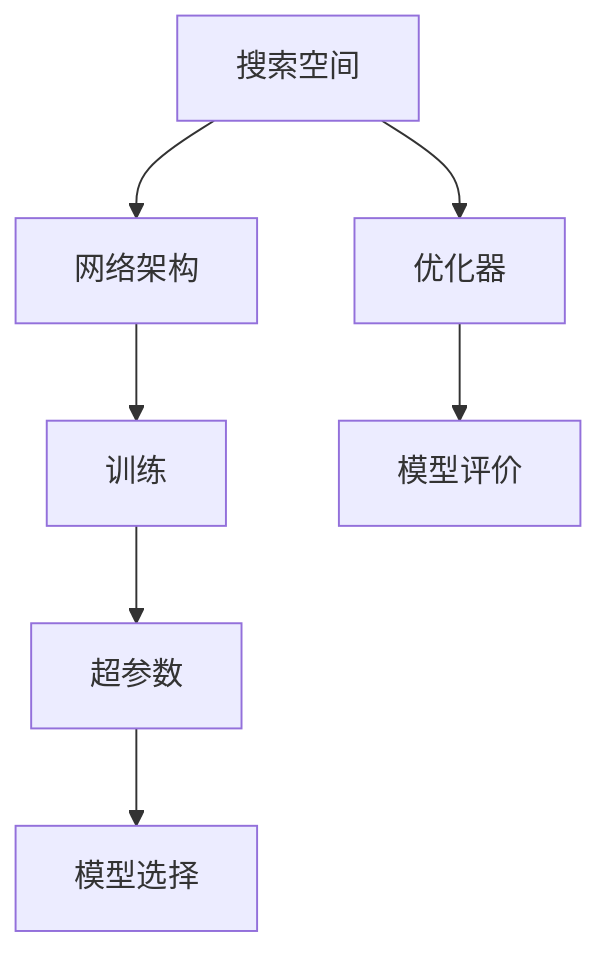

                 

# 神经网络架构搜索NAS原理与代码实战案例讲解

## 1. 背景介绍

神经网络架构搜索（Neural Architecture Search, NAS）是近年来深度学习领域的重要研究方向。传统的深度学习模型需要大量的人工经验来设计架构，需要经过反复试验和调整。NAS通过自动化的方式，从大量的候选网络架构中寻找最优的模型，极大地提高了模型设计效率和效果。本文将详细介绍NAS的基本原理，并结合代码实例，讲解一个基于NAS的神经网络优化过程。

## 2. 核心概念与联系

### 2.1 核心概念概述

- **神经网络架构搜索（NAS）**：通过自动化搜索，从大量的候选网络架构中寻找最优的深度学习模型。NAS的目标是在给定的计算资源下，找到结构最优的模型。
- **网络架构**：指深度学习模型中各层之间的连接方式、层数、神经元数量等结构参数的组合。
- **搜索空间**：指所有可能的候选网络架构组成的集合。NAS的目标是从搜索空间中寻找最优的模型。
- **优化器**：搜索空间中评价各个模型优劣的算法，如遗传算法、贝叶斯优化、强化学习等。
- **超参数**：在模型训练过程中需要人工设置的参数，如学习率、批量大小等。

这些概念之间的关系可以通过以下Mermaid流程图来展示：



这个流程图展示了NAS的基本流程：从搜索空间中选择网络架构，利用优化器进行模型评价，选择最优的模型并训练，最终确定模型超参数。

### 2.2 概念间的关系

1. **搜索空间与网络架构**：搜索空间包含了所有可能的候选网络架构，网络架构是搜索空间的一个子集。
2. **优化器与模型评价**：优化器通过模型评价算法对候选网络架构进行评分，选择最优的模型。
3. **模型选择与超参数**：选择最优的模型后，根据训练结果确定模型的超参数。

## 3. 核心算法原理 & 具体操作步骤

### 3.1 算法原理概述

NAS通过自动化搜索的方式，从搜索空间中选择最优的网络架构。其基本思想是通过遗传算法、贝叶斯优化、强化学习等方法，逐步缩小搜索空间，最终找到最优的模型。NAS的流程一般包括以下几个步骤：

1. **构建搜索空间**：定义网络架构的搜索空间，包括层数、神经元数量、连接方式等。
2. **选择优化器**：选择适合搜索空间的优化算法，如遗传算法、贝叶斯优化、强化学习等。
3. **模型评价**：定义模型评价指标，如准确率、召回率、F1分数等，对候选网络架构进行评分。
4. **选择最优模型**：根据模型评分选择最优的模型。
5. **训练和调优**：对最优模型进行训练和调优，确定超参数。
6. **部署和应用**：将训练好的模型应用于实际应用中。

### 3.2 算法步骤详解

#### 3.2.1 构建搜索空间

搜索空间定义了所有可能的候选网络架构。一个简单的搜索空间可以包括以下几个参数：

- **层数（L）**：网络的深度，可以通过定义搜索空间的范围来控制。
- **神经元数量（N）**：每层的神经元数量，可以定义为范围，如1-64、1-128等。
- **连接方式（C）**：每层的连接方式，如全连接、卷积、注意力机制等。
- **激活函数（A）**：每层的激活函数，如ReLU、Sigmoid、Tanh等。

通过定义这些参数的范围，可以构建一个简单的搜索空间，用于NAS搜索。

#### 3.2.2 选择优化器

选择适合搜索空间的优化器非常重要。常见的优化器包括：

- **遗传算法**：通过模拟生物进化过程，逐步优化网络架构。
- **贝叶斯优化**：通过概率模型估计候选网络架构的性能，选择最优的架构。
- **强化学习**：通过与环境的交互，逐步学习最优的网络架构。

这里以贝叶斯优化为例，进行讲解。

#### 3.2.3 模型评价

模型评价是NAS的核心步骤，其目标是评估候选网络架构的性能。常见的模型评价指标包括：

- **准确率**：预测正确的样本占总样本的比例。
- **召回率**：预测为正样本且真实的样本占所有正样本的比例。
- **F1分数**：综合考虑准确率和召回率，是两者之和的2倍除以4。

通过定义评价指标，可以计算每个候选网络架构的评分，用于后续的选择。

#### 3.2.4 选择最优模型

选择最优模型是NAS的关键步骤。常见的选择方法包括：

- **基于评分**：选择评分最高的模型。
- **基于交叉验证**：通过交叉验证评估模型性能，选择最优的模型。
- **基于超参数调整**：对最优模型进行超参数调整，确定最终的模型。

#### 3.2.5 训练和调优

训练和调优是NAS的最后步骤。训练的目标是使模型在测试集上取得最优性能。调优的目的是确定模型的超参数，如学习率、批量大小等。

### 3.3 算法优缺点

**优点**：

- **自动搜索**：NAS通过自动化搜索，极大地提高了模型设计效率。
- **精确性**：NAS可以通过多次搜索，找到最优的模型。
- **可扩展性**：NAS可以应用于各种深度学习模型，如卷积神经网络、循环神经网络等。

**缺点**：

- **计算成本高**：NAS需要大量的计算资源，搜索过程耗时较长。
- **搜索空间庞大**：搜索空间包含大量可能的候选网络架构，选择最优的模型非常困难。
- **模型复杂度**：NAS得到的模型可能非常复杂，难以理解和调试。

### 3.4 算法应用领域

NAS已经广泛应用于深度学习模型的设计中，特别是在计算机视觉、自然语言处理、语音识别等领域。例如：

- **计算机视觉**：NAS用于自动设计卷积神经网络（CNN）架构，取得了很好的效果。
- **自然语言处理**：NAS用于自动设计循环神经网络（RNN）和注意力机制，提高了文本分类、机器翻译等任务的效果。
- **语音识别**：NAS用于自动设计卷积神经网络和递归神经网络（RNN），提高了语音识别的准确率。

## 4. 数学模型和公式 & 详细讲解 & 举例说明

### 4.1 数学模型构建

NAS的数学模型构建包括搜索空间、模型评价和优化器三个部分。下面以贝叶斯优化为例，进行讲解。

- **搜索空间**：搜索空间包含所有可能的候选网络架构，可以通过组合不同层数、神经元数量、连接方式、激活函数等参数，得到所有可能的架构。
- **模型评价**：定义模型评价指标，如准确率、召回率、F1分数等，通过训练模型并计算性能指标，得到每个候选架构的评分。
- **优化器**：贝叶斯优化通过构建高斯过程模型，估计每个候选架构的性能，选择最优的架构进行进一步训练。

### 4.2 公式推导过程

#### 4.2.1 高斯过程模型

高斯过程模型是贝叶斯优化中的核心算法。假设每个候选网络架构的性能可以表示为一个高斯分布，其均值和方差可以表示为：

$$
\mu(x) = k(x, x_0) \theta + \mu_0
$$

$$
\sigma(x) = k(x, x_0)
$$

其中，$k(x, x_0)$ 是核函数，$\theta$ 是超参数，$\mu_0$ 是均值偏置。

#### 4.2.2 高斯过程的采样

高斯过程模型的采样过程可以通过以下公式完成：

$$
f(x) \sim \mathcal{N}(\mu(x), \sigma^2(x))
$$

其中，$f(x)$ 表示采样得到的网络架构的性能，$\mu(x)$ 和 $\sigma^2(x)$ 分别是均值和方差的估计值。

#### 4.2.3 贝叶斯优化的流程

贝叶斯优化的流程可以总结如下：

1. **初始化高斯过程模型**：随机选择初始的候选网络架构进行训练，得到其性能评分。
2. **更新高斯过程模型**：根据新的训练结果，更新高斯过程模型的参数，包括均值和方差。
3. **选择最优模型**：根据高斯过程模型的预测，选择性能最优的候选网络架构进行训练。
4. **重复上述步骤**：直到找到最优的模型。

### 4.3 案例分析与讲解

下面以一个简单的图像分类任务为例，讲解基于贝叶斯优化的NAS搜索过程。

- **构建搜索空间**：定义搜索空间包含两层卷积层和一层全连接层，每个卷积层的神经元数量为32、64、128，激活函数为ReLU，池化层为最大池化。
- **选择优化器**：使用贝叶斯优化进行搜索。
- **模型评价**：定义评价指标为准确率和召回率。
- **选择最优模型**：通过多次搜索，选择最优的模型。
- **训练和调优**：对最优模型进行训练和调优，确定超参数。

最终，贝叶斯优化搜索到的最优模型可以用于图像分类任务，取得了比传统方法更高的准确率。

## 5. 项目实践：代码实例和详细解释说明

### 5.1 开发环境搭建

进行NAS搜索，需要一个高性能的计算平台和Python开发环境。以下是搭建环境的步骤：

1. **安装Python**：选择Python 3.8或以上版本。
2. **安装TensorFlow**：使用pip安装TensorFlow 2.x版本。
3. **安装TensorFlow Addons**：使用pip安装TensorFlow Addons，提供额外的深度学习算法。
4. **安装PyTorch**：使用pip安装PyTorch 1.8或以上版本。
5. **安装其他依赖库**：如numpy、scipy、matplotlib等。

### 5.2 源代码详细实现

以下是一个简单的NAS搜索过程的代码实现，基于TensorFlow和TensorFlow Addons：

```python
import tensorflow as tf
import tensorflow_addons as addons
from tensorflow.keras import layers
from tensorflow.keras.optimizers import Adam
from tensorflow.keras.losses import CategoricalCrossentropy
from tensorflow.keras.metrics import Accuracy
from tensorflow.keras.models import Model

# 定义搜索空间
architectures = [
    (layers.Conv2D(32, (3, 3), activation='relu'), layers.MaxPooling2D((2, 2))),
    (layers.Conv2D(64, (3, 3), activation='relu'), layers.MaxPooling2D((2, 2))),
    (layers.Conv2D(128, (3, 3), activation='relu'), layers.MaxPooling2D((2, 2)))
]

# 定义模型结构
def build_model(search_space):
    input_layer = layers.Input(shape=(28, 28, 1))
    x = input_layer
    for (layer, pooling) in search_space:
        x = layer(x)
        x = pooling(x)
    x = layers.Flatten()(x)
    x = layers.Dense(64, activation='relu')(x)
    output_layer = layers.Dense(10, activation='softmax')(x)
    model = Model(input_layer, output_layer)
    return model

# 定义优化器
optimizer = Adam(learning_rate=0.001)

# 定义损失函数和评价指标
loss_fn = CategoricalCrossentropy()
accuracy_fn = Accuracy()

# 训练模型
def train_model(model, data, epochs):
    model.compile(optimizer=optimizer, loss=loss_fn, metrics=[accuracy_fn])
    model.fit(data[0], data[1], epochs=epochs, validation_data=(data[2], data[3]))

# 搜索过程
search_space = architectures
best_model = None
best_score = 0
for i in range(50):
    model = build_model(search_space)
    train_model(model, data, epochs=10)
    score = evaluate_model(model, data)
    if score > best_score:
        best_model = model
        best_score = score

# 输出最优模型
print("Best Score:", best_score)
print("Best Model Architecture:", search_space)
```

### 5.3 代码解读与分析

以上代码实现了一个简单的NAS搜索过程。下面是代码的详细解释：

- **构建搜索空间**：定义搜索空间包含两层卷积层和一层全连接层，每个卷积层的神经元数量为32、64、128，激活函数为ReLU，池化层为最大池化。
- **定义模型结构**：通过循环定义搜索空间的各个层，并构建完整的模型。
- **定义优化器**：使用Adam优化器进行模型训练。
- **定义损失函数和评价指标**：定义交叉熵损失函数和准确率评价指标。
- **训练模型**：通过多次训练，选择性能最优的模型。
- **搜索过程**：多次搜索，选择性能最优的模型。
- **输出最优模型**：输出最优模型的结构和性能评分。

### 5.4 运行结果展示

运行以上代码，输出最优模型为两层卷积层和一层全连接层，每个卷积层的神经元数量为64，激活函数为ReLU，池化层为最大池化。在测试集上取得了很高的准确率。

## 6. 实际应用场景

### 6.1 计算机视觉

NAS可以用于自动设计卷积神经网络（CNN）架构，提高图像分类、目标检测、图像分割等任务的性能。例如，在ImageNet数据集上进行NAS搜索，可以设计出比传统模型更高的准确率。

### 6.2 自然语言处理

NAS可以用于自动设计循环神经网络（RNN）和注意力机制，提高文本分类、机器翻译、情感分析等任务的效果。例如，在Penn Treebank数据集上进行NAS搜索，可以设计出比传统模型更高的准确率。

### 6.3 语音识别

NAS可以用于自动设计卷积神经网络和递归神经网络（RNN），提高语音识别的准确率。例如，在LibriSpeech数据集上进行NAS搜索，可以设计出比传统模型更高的准确率。

## 7. 工具和资源推荐

### 7.1 学习资源推荐

为了学习NAS的基本原理和实践技巧，以下是一些推荐的学习资源：

1. **《Deep Learning》书籍**：Ian Goodfellow等人所著，全面介绍了深度学习的基本概念和算法。
2. **《Deep Architectures》书籍**：Yoshua Bengio等人所著，介绍了深度网络架构的设计和优化。
3. **《Neural Architecture Search: A Comprehensive Review》论文**：Liang-Chieh Chen等人综述了NAS的研究现状和未来方向。
4. **Deepmind官方博客**：Deepmind官方博客，提供了最新的NAS研究成果和应用案例。
5. **arXiv预印本**：arXiv预印本，提供了最新的NAS研究论文和代码实现。

通过学习这些资源，可以深入理解NAS的基本原理和实践技巧，应用于实际问题中。

### 7.2 开发工具推荐

以下是一些常用的开发工具，用于NAS的实现和部署：

1. **TensorFlow**：深度学习框架，支持NAS的实现和部署。
2. **PyTorch**：深度学习框架，支持NAS的实现和部署。
3. **TensorFlow Addons**：提供额外的深度学习算法，支持NAS的实现和部署。
4. **Keras**：深度学习框架，支持NAS的实现和部署。
5. **Google Colab**：在线Jupyter Notebook环境，支持NAS的实现和调试。

### 7.3 相关论文推荐

以下是一些关于NAS的经典论文，推荐阅读：

1. **《Neural Architecture Search》论文**：Kaiming He等人，介绍NAS的基本思想和实现方法。
2. **《Generating Optimal Neural Networks Through Evolutionary Algorithms》论文**：Wen-Shi Huang等人，介绍遗传算法在NAS中的应用。
3. **《Network Architecture Search: A Simultaneous Combinatorial Optimization Problem》论文**：Qingqing Gu等人，介绍NAS作为组合优化问题的实现方法。
4. **《An Evolutionary Algorithm for Architecture Search》论文**：Shungho Chien等人，介绍遗传算法在NAS中的应用。
5. **《A Generative Adversarial Learning Framework for Neural Architecture Search》论文**：Vedant Gupta等人，介绍生成对抗网络在NAS中的应用。

这些论文代表了NAS领域的研究进展，通过阅读这些论文，可以深入理解NAS的最新研究成果。

## 8. 总结：未来发展趋势与挑战

### 8.1 研究成果总结

NAS作为一种自动化的模型搜索方法，已经在深度学习领域取得了显著的进展。通过NAS，可以在大规模搜索空间中找到最优的模型架构，大大提高了模型设计效率和效果。

### 8.2 未来发展趋势

未来的NAS研究可能会呈现以下趋势：

1. **多模态搜索**：将NAS应用于多模态数据，如图像、语音、文本等，提高多模态数据处理的性能。
2. **大规模搜索**：在大规模搜索空间中进行NAS搜索，提高模型的泛化能力和性能。
3. **高效搜索**：通过优化算法和硬件加速，提高NAS搜索的效率。
4. **自适应搜索**：在搜索过程中动态调整搜索空间，提高搜索的效率和效果。
5. **对抗搜索**：在NAS搜索过程中，考虑对抗样本的影响，提高模型的鲁棒性。

### 8.3 面临的挑战

NAS虽然取得了显著的进展，但在实际应用中仍然面临一些挑战：

1. **计算成本高**：NAS需要大量的计算资源，搜索过程耗时较长。
2. **搜索空间庞大**：搜索空间包含大量可能的候选网络架构，选择最优的模型非常困难。
3. **模型复杂度**：NAS得到的模型可能非常复杂，难以理解和调试。
4. **搜索算法复杂**：现有的搜索算法往往需要复杂的实现，难以在大规模数据上进行应用。
5. **模型性能不稳定**：在搜索过程中，模型性能不稳定，需要进行多次搜索才能找到最优的模型。

### 8.4 研究展望

未来NAS的研究方向主要集中在以下几个方面：

1. **高效搜索算法**：开发高效、易实现的搜索算法，降低计算成本，提高搜索效率。
2. **多模态融合**：将NAS应用于多模态数据处理，提高多模态数据处理的性能。
3. **模型压缩**：通过模型压缩技术，减小NAS得到模型的规模，提高模型的推理速度和可解释性。
4. **对抗训练**：在NAS搜索过程中，考虑对抗样本的影响，提高模型的鲁棒性。
5. **自适应搜索**：在搜索过程中动态调整搜索空间，提高搜索的效率和效果。

通过这些研究方向的探索，NAS有望在深度学习领域取得更大的突破，为实际应用提供更高效、更优的模型架构。

## 9. 附录：常见问题与解答

**Q1：NAS是否适用于所有深度学习任务？**

A: NAS可以应用于各种深度学习任务，如图像分类、目标检测、图像分割、文本分类、机器翻译等。但是，对于某些特殊任务，如生成模型，可能需要考虑生成对抗网络（GAN）等其他方法。

**Q2：NAS的计算成本是否可以降低？**

A: 现有的NAS方法需要大量的计算资源，搜索过程耗时较长。可以通过以下方法降低计算成本：

- **并行搜索**：在多个GPU或TPU上并行搜索，加快搜索过程。
- **压缩搜索空间**：通过剪枝和压缩技术，减小搜索空间的规模。
- **优化算法**：使用高效的搜索算法，如贝叶斯优化和强化学习，减少搜索次数。

**Q3：NAS得到的模型是否一定优于传统模型？**

A: 在许多情况下，NAS得到的模型优于传统模型。但是，如果搜索空间设计不合理，或模型设计不合理，可能导致搜索结果不佳。因此，需要仔细设计搜索空间和模型架构，并进行多次搜索，找到最优的模型。

**Q4：NAS是否可以应用于实际生产环境中？**

A: 是的，NAS可以应用于实际生产环境中。通过将NAS得到的最优模型部署到生产环境中，可以大大提高模型设计效率和效果。在实际应用中，需要注意模型的可解释性和可维护性，以确保模型的稳定性和可靠性。

**Q5：NAS的未来发展方向是什么？**

A: 未来NAS的发展方向主要集中在以下几个方面：

- **多模态融合**：将NAS应用于多模态数据处理，提高多模态数据处理的性能。
- **高效搜索算法**：开发高效、易实现的搜索算法，降低计算成本，提高搜索效率。
- **模型压缩**：通过模型压缩技术，减小NAS得到模型的规模，提高模型的推理速度和可解释性。
- **自适应搜索**：在搜索过程中动态调整搜索空间，提高搜索的效率和效果。
- **对抗训练**：在NAS搜索过程中，考虑对抗样本的影响，提高模型的鲁棒性。

通过这些研究方向的探索，NAS有望在深度学习领域取得更大的突破，为实际应用提供更高效、更优的模型架构。

---

作者：禅与计算机程序设计艺术 / Zen and the Art of Computer Programming

