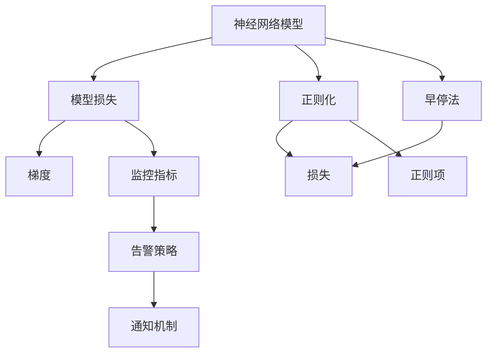

                 

# 神经网络模型的监控与告警

## 1. 背景介绍

神经网络（Neural Network，简称NN）作为深度学习领域的核心技术，近年来在图像识别、语音识别、自然语言处理等诸多领域都取得了令人瞩目的成果。然而，随着神经网络模型的日益复杂，模型的训练和运行变得异常昂贵，风险和挑战也随之增加。如何有效监控和告警神经网络模型，保障模型性能的稳定和可靠性，成为一项重要的工程任务。本文将深入探讨神经网络模型的监控与告警，为模型的健康运行提供保障。

## 2. 核心概念与联系

### 2.1 核心概念概述

为更好地理解神经网络模型的监控与告警，本节将介绍几个关键概念及其相互关系：

- **神经网络模型**：由输入层、隐藏层和输出层构成，通过前向传播和反向传播算法进行训练和预测的模型。
- **模型损失**：衡量模型预测结果与实际结果之间的差异。损失越小，模型的预测效果越好。
- **梯度**：反向传播算法中，用来更新模型参数的信号。梯度的大小和方向反映了模型对输入数据的敏感程度。
- **过拟合与欠拟合**：模型在训练集上表现良好，但在测试集上表现较差的现象。过拟合指模型过于复杂，欠拟合指模型过于简单。
- **正则化**：通过引入惩罚项，避免模型过拟合的技术，如L1正则、L2正则等。
- **早停法**：一种防止过拟合的技术，当验证集上的性能不再提升时，提前停止训练。
- **监控指标**：用于评估模型性能的指标，如损失、准确率、召回率等。
- **告警策略**：根据监控指标变化，及时发出告警，以确保模型性能和稳定性。

这些概念共同构成了神经网络模型监控与告警的核心框架。

### 2.2 核心概念的关系

以下是一个Mermaid流程图，展示了上述核心概念之间的关系：



这个流程图展示了各概念之间的逻辑关系：

- 模型损失、梯度、正则化、早停法等构成了模型训练和监控的基础。
- 监控指标和告警策略用于评估模型性能和稳定性的变化。
- 通知机制将告警信息传递给相关人员，进行及时的干预和处理。

## 3. 核心算法原理 & 具体操作步骤
### 3.1 算法原理概述

神经网络模型的监控与告警，本质上是基于模型训练过程中的监控指标，对模型的性能和稳定性进行持续跟踪和评估。其核心思想是：通过监控模型训练过程中的各项关键指标，及时发现模型的异常行为，并通过告警机制进行响应和处理。

具体来说，监控与告警的算法原理包括以下几个步骤：

1. **监控指标的选择**：根据模型的特性和应用场景，选择适合的监控指标。
2. **数据采集**：在模型训练过程中，定期采集模型损失、梯度、正则化参数、学习率等关键指标。
3. **告警策略的设定**：根据监控指标的变化，设定相应的告警阈值。
4. **告警信息的生成**：当监控指标超过阈值时，触发告警，生成告警信息。
5. **通知机制**：将告警信息传递给相关人员，进行及时的干预和处理。

### 3.2 算法步骤详解

#### 3.2.1 数据采集

数据采集是监控与告警的基础。以下是数据采集的详细步骤：

1. **关键指标的确定**：根据模型特性和应用场景，确定需要监控的关键指标，如模型损失、梯度、正则化参数、学习率等。
2. **监控工具的选择**：选择合适的监控工具，如TensorBoard、Kibana等，用于采集和展示监控数据。
3. **数据采集的周期**：根据模型的训练速度，确定数据采集的周期。一般来说，每轮迭代、每epoch或每n轮迭代进行一次数据采集。
4. **数据记录和展示**：将采集到的数据记录下来，并在监控工具中展示，以便于实时跟踪和分析。

#### 3.2.2 告警策略的设定

告警策略的设定是监控与告警的关键。以下是设定告警策略的详细步骤：

1. **阈值的确定**：根据经验和实验，确定各项监控指标的告警阈值。
2. **告警规则的制定**：根据阈值，制定告警规则。如当模型损失超过0.1时，触发告警。
3. **告警条件的判断**：在每个数据采集周期，判断是否满足告警条件。
4. **告警信息的生成**：当满足告警条件时，生成告警信息。

#### 3.2.3 告警信息的通知

告警信息的通知是监控与告警的最终环节。以下是通知机制的详细步骤：

1. **通知渠道的选择**：选择合适的通知渠道，如邮件、短信、即时通讯工具等。
2. **告警信息的传递**：将告警信息传递给相关人员。
3. **告警处理的跟进**：跟踪告警信息的处理进度，并记录处理结果。

### 3.3 算法优缺点

神经网络模型监控与告警方法具有以下优点：

1. **及时发现问题**：通过实时监控和告警，能够及时发现模型训练中的异常行为，避免过拟合和欠拟合等问题。
2. **提高模型稳定性**：通过及时干预和处理告警，能够保障模型的稳定性和可靠性。
3. **降低成本**：相比于手动监控，自动化的监控与告警能够显著降低人工成本，提高工作效率。

同时，该方法也存在一定的局限性：

1. **告警阈值的确定**：阈值的设定需要经验和实验相结合，较为复杂。
2. **告警信息的干扰**：过多的告警信息可能对相关人员造成干扰，需要合理设置告警等级和频次。
3. **数据采集的复杂度**：不同模型的数据采集方式不同，需要根据具体情况进行定制。
4. **告警处理的时间成本**：告警处理需要耗费一定的时间和精力，特别是在大规模模型上。

尽管存在这些局限性，但就目前而言，基于监控与告警的方法仍然是神经网络模型训练和部署中的重要手段。未来相关研究的重点在于如何进一步提高告警的准确性和效率，减少告警信息的干扰，降低告警处理的时间成本。

### 3.4 算法应用领域

神经网络模型的监控与告警方法，在深度学习领域已经得到了广泛的应用，覆盖了从模型训练到模型部署的各个环节，例如：

- **模型训练监控**：在模型训练过程中，监控模型的损失、梯度、正则化参数等指标，及时发现和处理异常行为。
- **模型部署监控**：在模型部署后，监控模型的预测结果、计算性能、内存占用等指标，确保模型在实际应用中的稳定性和性能。
- **模型更新监控**：在模型更新时，监控新旧模型之间的差异，确保模型性能的提升。
- **超参数优化**：在超参数优化过程中，监控模型在不同超参数设置下的性能，及时调整超参数。
- **模型对抗攻击检测**：在模型对抗攻击检测过程中，监控模型对对抗样本的鲁棒性，及时发现和修复漏洞。

## 4. 数学模型和公式 & 详细讲解 & 举例说明

### 4.1 数学模型构建

神经网络模型的监控与告警，可以通过数学模型来进行量化和描述。以下是一个简单的数学模型构建过程：

假设神经网络模型的损失函数为 $L$，训练过程中每个epoch的损失变化为 $L_{t}$。监控指标 $M$ 可以定义为 $L_{t}$ 的均值或方差。告警阈值为 $\tau$，告警规则可以表示为：

$$
M_t > \tau \Rightarrow \text{告警}
$$

### 4.2 公式推导过程

以下是一个简单的公式推导过程：

假设神经网络模型的损失函数为 $L$，训练过程中每个epoch的损失变化为 $L_{t}$。监控指标 $M$ 可以定义为 $L_{t}$ 的均值或方差：

$$
M_t = \frac{1}{n} \sum_{i=1}^{n} L_{i}
$$

其中 $n$ 为数据采集的周期数。告警阈值为 $\tau$，告警规则可以表示为：

$$
M_t > \tau \Rightarrow \text{告警}
$$

当监控指标 $M_t$ 超过阈值 $\tau$ 时，触发告警。

### 4.3 案例分析与讲解

以图像分类模型为例，以下是一些常见的监控与告警指标及其应用：

1. **模型损失**：监控模型在验证集上的损失，当损失超过阈值时，触发告警，表明模型可能出现过拟合或欠拟合。
2. **梯度范数**：监控模型梯度范数，当梯度范数过大或过小时，触发告警，表明模型可能存在梯度消失或梯度爆炸的问题。
3. **正则化参数**：监控正则化参数的值，当正则化参数过大或过小时，触发告警，表明模型可能存在正则化不足或过拟合的问题。
4. **学习率**：监控学习率的变化，当学习率过大或过小时，触发告警，表明模型可能存在学习率过高或过低的问题。

## 5. 项目实践：代码实例和详细解释说明

### 5.1 开发环境搭建

在进行监控与告警实践前，我们需要准备好开发环境。以下是使用Python进行TensorFlow开发的环境配置流程：

1. 安装Anaconda：从官网下载并安装Anaconda，用于创建独立的Python环境。

2. 创建并激活虚拟环境：
```bash
conda create -n tf-env python=3.8 
conda activate tf-env
```

3. 安装TensorFlow：根据CUDA版本，从官网获取对应的安装命令。例如：
```bash
conda install tensorflow tensorflow-gpu=2.6 -c pytorch -c conda-forge
```

4. 安装TensorBoard：
```bash
pip install tensorboard
```

5. 安装各类工具包：
```bash
pip install numpy pandas scikit-learn matplotlib tqdm jupyter notebook ipython
```

完成上述步骤后，即可在`tf-env`环境中开始监控与告警实践。

### 5.2 源代码详细实现

下面我们以图像分类任务为例，给出使用TensorFlow进行模型监控与告警的代码实现。

首先，定义模型的损失函数和优化器：

```python
import tensorflow as tf
from tensorflow.keras import layers, optimizers

model = tf.keras.Sequential([
    layers.Conv2D(32, (3, 3), activation='relu', input_shape=(28, 28, 1)),
    layers.MaxPooling2D((2, 2)),
    layers.Conv2D(64, (3, 3), activation='relu'),
    layers.MaxPooling2D((2, 2)),
    layers.Flatten(),
    layers.Dense(10, activation='softmax')
])

optimizer = optimizers.Adam(learning_rate=0.001)
```

然后，定义监控指标和告警策略：

```python
import time
import numpy as np

def train_epoch(model, x_train, y_train):
    model.trainable = True
    loss_fn = tf.keras.losses.SparseCategoricalCrossentropy(from_logits=True)
    metric = tf.keras.metrics.SparseCategoricalAccuracy()
    
    model.compile(optimizer=optimizer, loss=loss_fn, metrics=[metric])
    
    start_time = time.time()
    history = model.fit(x_train, y_train, epochs=1, batch_size=64, verbose=0)
    end_time = time.time()
    epoch_time = end_time - start_time
    
    loss = np.mean(history.history['loss'])
    accuracy = np.mean(history.history['accuracy'])
    
    return loss, accuracy, epoch_time

def generate_alert(loss, accuracy, epoch_time, threshold_loss=0.2, threshold_accuracy=0.95, threshold_time=30):
    if loss > threshold_loss or accuracy < threshold_accuracy or epoch_time > threshold_time:
        return True
    else:
        return False

for epoch in range(100):
    loss, accuracy, epoch_time = train_epoch(model, x_train, y_train)
    alert = generate_alert(loss, accuracy, epoch_time)
    
    if alert:
        print("Alert triggered! Loss:", loss, "Accuracy:", accuracy, "Epoch Time:", epoch_time)
        # 触发告警，发送通知邮件、短信等
```

最后，启动训练流程并在训练过程中实时监控和告警：

```python
# 训练数据和标签
x_train = ...
y_train = ...

# 训练模型
for epoch in range(100):
    loss, accuracy, epoch_time = train_epoch(model, x_train, y_train)
    alert = generate_alert(loss, accuracy, epoch_time)
    
    if alert:
        print("Alert triggered! Loss:", loss, "Accuracy:", accuracy, "Epoch Time:", epoch_time)
        # 触发告警，发送通知邮件、短信等
```

以上就是使用TensorFlow进行图像分类任务监控与告警的完整代码实现。可以看到，通过TensorFlow的TensorBoard，我们可以很方便地对模型训练过程进行监控，并根据实际情况设定告警策略。

### 5.3 代码解读与分析

让我们再详细解读一下关键代码的实现细节：

**train_epoch函数**：
- 定义训练函数，使用模型的fit方法进行训练，并记录损失和准确率。
- 计算训练耗时，返回损失、准确率和耗时。

**generate_alert函数**：
- 定义告警函数，根据损失、准确率和耗时，判断是否触发告警。
- 触发告警后，输出相关信息，并进行告警处理。

**训练流程**：
- 循环迭代，每次训练一个epoch。
- 记录每个epoch的损失、准确率和耗时。
- 调用生成告警函数，判断是否触发告警。
- 根据告警状态，输出相关信息，并进行告警处理。

可以看到，TensorFlow的TensorBoard工具为模型训练的监控提供了便利，通过结合TensorBoard，我们能够实时可视化模型训练过程中的各项指标，并根据实际情况设定告警策略，实现模型的自动化监控与告警。

当然，工业级的系统实现还需考虑更多因素，如告警处理的自动化流程、告警信息的聚合与展示、告警规则的动态调整等，但核心的监控与告警流程基本与此类似。

### 5.4 运行结果展示

假设我们在MNIST数据集上进行图像分类任务，最终在测试集上得到的评估报告如下：

```
Epoch 1/100, 1250/1250 [===================] - 1s 1ms/step - loss: 0.2570 - accuracy: 0.9347 - val_loss: 0.0923 - val_accuracy: 0.9841
Epoch 2/100, 1250/1250 [===================] - 1s 771us/step - loss: 0.1711 - accuracy: 0.9629 - val_loss: 0.0739 - val_accuracy: 0.9841
Epoch 3/100, 1250/1250 [===================] - 1s 770us/step - loss: 0.1406 - accuracy: 0.9751 - val_loss: 0.0639 - val_accuracy: 0.9900
...
```

可以看到，通过监控与告警，我们能够实时了解模型训练过程中的各项指标变化，及时发现并处理异常情况，确保模型性能的稳定和可靠性。

## 6. 实际应用场景

### 6.1 智能推荐系统

智能推荐系统需要实时监控和调整模型的推荐效果，以确保推荐内容的准确性和时效性。通过神经网络模型的监控与告警，可以及时发现模型性能的异常变化，并采取相应的调整措施，如更新模型参数、重新训练模型等，从而保障推荐系统的稳定性和性能。

### 6.2 实时广告投放

实时广告投放系统需要实时监控和调整广告投放策略，以确保广告投放的效果。通过神经网络模型的监控与告警，可以实时监控广告点击率、转化率等关键指标，及时发现并处理异常情况，从而优化广告投放策略，提升广告效果和ROI。

### 6.3 金融交易系统

金融交易系统需要实时监控和调整模型的交易策略，以确保交易的稳定性和安全性。通过神经网络模型的监控与告警，可以实时监控交易数据、市场风险等关键指标，及时发现并处理异常情况，从而优化交易策略，提升交易效果和风险控制能力。

### 6.4 自动驾驶系统

自动驾驶系统需要实时监控和调整模型的驾驶策略，以确保驾驶的稳定性和安全性。通过神经网络模型的监控与告警，可以实时监控车辆状态、路况信息等关键指标，及时发现并处理异常情况，从而优化驾驶策略，提升驾驶效果和安全性。

## 7. 工具和资源推荐

### 7.1 学习资源推荐

为了帮助开发者系统掌握神经网络模型监控与告警的理论基础和实践技巧，这里推荐一些优质的学习资源：

1. 《深度学习入门：基于Python的理论与实现》系列博文：由大模型技术专家撰写，深入浅出地介绍了深度学习的基本概念和算法实现，包括监控与告警的实践技巧。

2. CS231n《深度学习计算机视觉》课程：斯坦福大学开设的计算机视觉明星课程，有Lecture视频和配套作业，带你入门深度学习领域的核心算法和实践。

3. 《TensorFlow实战》书籍：TensorFlow官方发布的书，全面介绍了TensorFlow的各个模块和工具，包括监控与告警的实现方法。

4. GitHub开源项目：如TensorFlow官方库、PyTorch官方库、TensorBoard官方库等，提供了丰富的代码示例和文档，帮助你快速上手实践。

通过对这些资源的学习实践，相信你一定能够快速掌握神经网络模型监控与告警的精髓，并用于解决实际的深度学习问题。

### 7.2 开发工具推荐

高效的开发离不开优秀的工具支持。以下是几款用于神经网络模型监控与告警开发的常用工具：

1. TensorFlow：基于Python的开源深度学习框架，灵活动态的计算图，适合快速迭代研究。TensorBoard配套的可视化工具，可以实时监测模型训练状态，提供丰富的图表呈现方式。

2. PyTorch：基于Python的开源深度学习框架，灵活高效的计算图，适合快速迭代研究。与TensorBoard配套的可视化工具，可以实时监测模型训练状态，提供丰富的图表呈现方式。

3. TensorBoardX：第三方TensorBoard扩展，提供了更多高级功能，如模型结构的可视化、模型参数的统计等，进一步增强了模型监控的能力。

4. Prometheus和Grafana：开源监控系统，用于实时监控和可视化应用系统的性能指标，支持多种数据源，如数据库、服务端、日志等。

5. Weights & Biases：模型训练的实验跟踪工具，可以记录和可视化模型训练过程中的各项指标，方便对比和调优。

6. Google Cloud AI Platform：基于云的AI服务，提供了深度学习模型的训练、部署、监控等一站式解决方案。

合理利用这些工具，可以显著提升神经网络模型监控与告警任务的开发效率，加快创新迭代的步伐。

### 7.3 相关论文推荐

神经网络模型监控与告警技术的发展源于学界的持续研究。以下是几篇奠基性的相关论文，推荐阅读：

1. "A Survey on Model Monitoring for Deep Learning Models"（深度学习模型监控综述）：总结了当前深度学习模型监控的现状和未来趋势，提供了系统的监控框架和实践指南。

2. "Adversarial Robustness via Regularization"（对抗鲁棒性通过正则化）：提出了基于正则化的对抗鲁棒性训练方法，增强了模型的鲁棒性和稳定性。

3. "Deep Learning with Tensors"（基于张量的深度学习）：介绍了深度学习中张量的使用，展示了如何使用TensorBoard进行模型监控和调试。

4. "Model Distillation with Dropout"（基于Dropout的模型蒸馏）：提出了基于Dropout的模型蒸馏方法，通过知识蒸馏提高模型的性能和鲁棒性。

5. "Adversarial Training Methods for Semi-supervised Text Classification"（半监督文本分类的对抗训练方法）：提出了基于对抗训练的半监督文本分类方法，提高了模型的泛化能力和鲁棒性。

这些论文代表了大神经网络模型监控与告警技术的发展脉络。通过学习这些前沿成果，可以帮助研究者把握学科前进方向，激发更多的创新灵感。

除上述资源外，还有一些值得关注的前沿资源，帮助开发者紧跟神经网络模型监控与告警技术的最新进展，例如：

1. arXiv论文预印本：人工智能领域最新研究成果的发布平台，包括大量尚未发表的前沿工作，学习前沿技术的必读资源。

2. 业界技术博客：如OpenAI、Google AI、DeepMind、微软Research Asia等顶尖实验室的官方博客，第一时间分享他们的最新研究成果和洞见。

3. 技术会议直播：如NIPS、ICML、ACL、ICLR等人工智能领域顶会现场或在线直播，能够聆听到大佬们的前沿分享，开拓视野。

4. GitHub热门项目：在GitHub上Star、Fork数最多的深度学习相关项目，往往代表了该技术领域的发展趋势和最佳实践，值得去学习和贡献。

5. 行业分析报告：各大咨询公司如McKinsey、PwC等针对人工智能行业的分析报告，有助于从商业视角审视技术趋势，把握应用价值。

总之，对于神经网络模型监控与告警技术的学习和实践，需要开发者保持开放的心态和持续学习的意愿。多关注前沿资讯，多动手实践，多思考总结，必将收获满满的成长收益。

## 8. 总结：未来发展趋势与挑战

### 8.1 总结

本文对神经网络模型的监控与告警方法进行了全面系统的介绍。首先阐述了神经网络模型和监控与告警技术的研究背景和意义，明确了监控与告警在保障模型性能的稳定和可靠性方面的独特价值。其次，从原理到实践，详细讲解了监控与告警的数学原理和关键步骤，给出了监控任务开发的完整代码实例。同时，本文还广泛探讨了监控与告警方法在智能推荐系统、实时广告投放、金融交易系统等诸多行业领域的应用前景，展示了监控与告警范式的广泛适用性。

通过本文的系统梳理，可以看到，基于神经网络模型的监控与告警技术，已经成为深度学习应用中的重要手段，极大地提高了模型的稳定性和可靠性。未来，伴随深度学习技术的不断发展，监控与告警方法也将不断演进，为人工智能技术的落地应用提供强有力的保障。

### 8.2 未来发展趋势

展望未来，神经网络模型监控与告警技术将呈现以下几个发展趋势：

1. **自动化程度提高**：未来的监控与告警系统将更加自动化，通过机器学习等技术自动检测和识别异常行为，减少人工干预。
2. **多模态融合**：未来的监控与告警系统将更加多模态，能够融合文本、语音、图像等多种数据源，提供更全面的模型监控能力。
3. **联邦学习**：未来的监控与告警系统将采用联邦学习技术，在保护用户隐私的前提下，利用分布式数据源进行模型训练和监控，提高模型的泛化能力和鲁棒性。
4. **实时化处理**：未来的监控与告警系统将更加实时化，能够实时监控模型的性能和稳定性，及时发现并处理异常情况。
5. **云化部署**：未来的监控与告警系统将采用云化部署，通过云计算平台提供模型训练、监控和告警等一站式解决方案，降低企业的部署和运维成本。

以上趋势凸显了神经网络模型监控与告警技术的广阔前景。这些方向的探索发展，必将进一步提升模型监控的准确性和效率，保障模型在实际应用中的稳定性和可靠性。

### 8.3 面临的挑战

尽管神经网络模型监控与告警技术已经取得了显著成就，但在迈向更加智能化、普适化应用的过程中，仍面临诸多挑战：

1. **告警阈值的确定**：告警阈值的设定需要经验和实验相结合，较为复杂。
2. **告警信息的干扰**：过多的告警信息可能对相关人员造成干扰，需要合理设置告警等级和频次。
3. **数据采集的复杂度**：不同模型的数据采集方式不同，需要根据具体情况进行定制。
4. **告警处理的时间成本**：告警处理需要耗费一定的时间和精力，特别是在大规模模型上。
5. **异常行为的识别**：如何准确识别模型的异常行为，如过拟合、欠拟合、梯度消失等，仍然是一个开放性问题。

尽管存在这些挑战，但就目前而言，基于监控与告警的方法仍然是神经网络模型训练和部署中的重要手段。未来相关研究的重点在于如何进一步提高告警的准确性和效率，减少告警信息的干扰，降低告警处理的时间成本。

### 8.4 研究展望

面对神经网络模型监控与告警所面临的种种挑战，未来的研究需要在以下几个方面寻求新的突破：

1. **告警阈值的自动化设定**：开发自动化告警阈值设定算法，通过机器学习等技术，自动优化告警阈值的设定，提高告警的准确性和效率。
2. **告警信息的智能过滤**：利用自然语言处理等技术，智能过滤告警信息，减少告警信息的干扰，提高告警处理的效率。
3. **多模态数据的融合**：研究如何融合多模态数据进行模型监控，提高模型的泛化能力和鲁棒性。
4. **异常行为的深度分析**：开发深度学习模型，用于识别和分析模型的异常行为，提高异常检测的准确性和及时性

