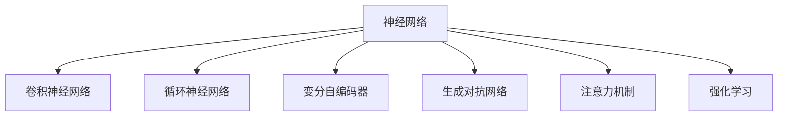
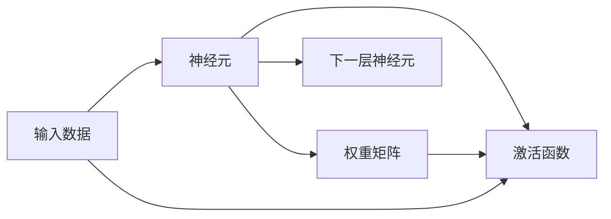
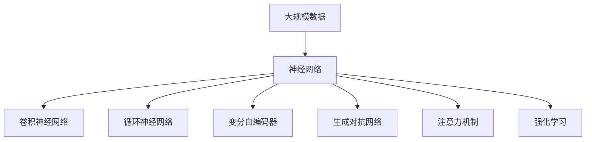

                 

# 神经网络计算架构的崛起

## 1. 背景介绍

### 1.1 问题由来

随着深度学习技术的蓬勃发展，神经网络已经成为现代人工智能领域的基础架构。然而，传统的神经网络计算架构在处理大规模数据和复杂计算时，面临着计算资源有限、计算效率低下等诸多挑战。为了应对这些问题，研究人员开始探索新的神经网络计算架构，进一步提升神经网络的计算能力和应用范围。本文将深入探讨基于神经网络的计算架构，分析其在深度学习领域的应用前景和挑战。

### 1.2 问题核心关键点

神经网络计算架构的核心在于如何设计高效的计算模型，使其在有限的计算资源下，能够快速高效地完成数据处理和模型训练。当前，主要的神经网络计算架构包括：

- 传统卷积神经网络(CNN)：主要用于图像处理和计算机视觉任务。
- 循环神经网络(RNN)：适用于处理序列数据，如自然语言处理和语音识别。
- 变分自编码器(VAE)：用于数据生成和降维，可以对高维数据进行编码和解码。
- 生成对抗网络(GAN)：用于生成具有真实感的图像和视频，生成样本与真实样本难以区分。
- 注意力机制(Attention)：通过动态调整计算资源的分配，提升模型对关键信息的关注度。
- 强化学习(Reinforcement Learning, RL)：通过与环境互动，学习最优策略完成特定任务。

这些计算架构在各自的领域内都有着显著的应用效果，但也存在一些不足，如计算效率低下、对数据分布敏感、难以解释等。因此，如何设计更加高效的计算架构，成为深度学习领域亟待解决的问题。

### 1.3 问题研究意义

设计高效的神经网络计算架构，对于深度学习技术的发展和应用推广具有重要意义：

1. 提高计算效率：通过高效的计算模型，可以显著提升神经网络在处理大规模数据时的计算速度。
2. 扩展应用范围：新的计算架构能够支持更广泛的神经网络模型和应用场景，推动人工智能技术的普及和应用。
3. 优化资源利用：设计合理的计算架构，可以更好地利用计算资源，减少资源浪费。
4. 增强可解释性：新的计算架构可以提供更好的解释性，帮助理解模型的决策过程。
5. 提升系统鲁棒性：更强的计算架构可以提升模型的鲁棒性和泛化能力，减少对特定数据分布的依赖。

总之，研究高效神经网络计算架构，是提升深度学习性能和应用广度的重要手段，对于未来人工智能技术的发展具有深远的影响。

## 2. 核心概念与联系

### 2.1 核心概念概述

为更好地理解神经网络计算架构的核心概念，本节将介绍几个密切相关的核心概念：

- 神经网络(Neural Network)：由大量人工神经元组成的计算模型，通过连接和权重的调整，实现对数据的映射和预测。
- 卷积神经网络(CNN)：专门用于处理图像和空间数据的神经网络，通过卷积操作提取局部特征。
- 循环神经网络(RNN)：适用于序列数据的神经网络，通过循环连接捕捉时间序列的动态变化。
- 变分自编码器(VAE)：用于数据生成和降维的生成模型，能够学习数据的隐含表示。
- 生成对抗网络(GAN)：由生成器和判别器组成的两层对抗结构，能够生成高质量的样本。
- 注意力机制(Attention)：通过动态调整计算资源的分配，提升模型对关键信息的关注度。
- 强化学习(Reinforcement Learning, RL)：通过与环境互动，学习最优策略完成特定任务。

这些核心概念之间的逻辑关系可以通过以下Mermaid流程图来展示：



这个流程图展示了一些主要的神经网络计算架构及其关系：

1. 神经网络是所有计算架构的基础。
2. CNN、RNN、VAE、GAN、Attention等架构都是神经网络的变种。
3. 这些计算架构可以互相组合，形成更复杂的模型。

### 2.2 概念间的关系

这些核心概念之间存在着紧密的联系，形成了神经网络计算架构的完整生态系统。下面我们通过几个Mermaid流程图来展示这些概念之间的关系。

#### 2.2.1 神经网络的基础结构



这个流程图展示了神经网络的基本结构，包括输入数据、神经元、权重矩阵、激活函数和下一层神经元。

#### 2.2.2 卷积神经网络的结构


这个流程图展示了卷积神经网络的结构，包括卷积层、池化层、激活函数和全连接层。

#### 2.2.3 循环神经网络的结构


这个流程图展示了循环神经网络的结构，包括RNN层、隐藏状态和LSTM层。

#### 2.2.4 注意力机制的原理


这个流程图展示了注意力机制的原理，包括注意力层、权重矩阵、查询向量、注意力分数、注意力权重和加权输入。

### 2.3 核心概念的整体架构

最后，我们用一个综合的流程图来展示这些核心概念在大规模神经网络计算架构中的应用：



这个综合流程图展示了从大规模数据到大规模神经网络计算架构的完整过程。神经网络通过卷积神经网络、循环神经网络、变分自编码器、生成对抗网络、注意力机制、强化学习等计算架构，实现对数据的深度处理和复杂计算。 通过这些流程图，我们可以更清晰地理解神经网络计算架构的核心概念及其关系，为后续深入讨论具体的计算架构设计奠定基础。

## 3. 核心算法原理 & 具体操作步骤
### 3.1 算法原理概述

神经网络计算架构的设计，主要围绕以下几个关键点展开：

- 数据表示：如何将原始数据映射为神经网络的输入表示。
- 网络结构：如何设计网络的层次结构和连接方式。
- 损失函数：如何定义模型的损失函数，衡量预测输出与真实标签之间的差异。
- 优化算法：如何通过反向传播算法优化模型参数，最小化损失函数。
- 模型评估：如何设计评估指标，评估模型的性能。

下面将详细讲解这些核心算法原理。

### 3.2 算法步骤详解

#### 3.2.1 数据表示

神经网络的输入数据通常表示为向量或矩阵形式。例如，在卷积神经网络中，输入数据可以是图像或视频帧，表示为二维数组。在循环神经网络中，输入数据可以是时间序列数据，表示为三维数组。

#### 3.2.2 网络结构

神经网络的网络结构通常由多个层次组成，每个层次由多个神经元构成。每个神经元接收来自上一层多个神经元的输入，通过加权和和激活函数计算输出。

#### 3.2.3 损失函数

损失函数用于衡量模型预测输出与真实标签之间的差异。常见的损失函数包括交叉熵损失、均方误差损失、对比损失等。损失函数的定义与具体任务有关。

#### 3.2.4 优化算法

优化算法用于通过反向传播算法更新模型参数，最小化损失函数。常见的优化算法包括随机梯度下降(SGD)、Adam、Adagrad等。优化算法的参数设置对模型的训练效果有很大影响。

#### 3.2.5 模型评估

模型评估用于衡量模型在测试集上的性能。常见的评估指标包括准确率、精确率、召回率、F1分数等。评估指标的选择和计算方法需要根据具体任务进行设计。

### 3.3 算法优缺点

神经网络计算架构的主要优点包括：

- 强大的非线性建模能力：神经网络可以通过多层非线性变换，学习数据的复杂映射关系。
- 自适应学习能力：神经网络可以通过反向传播算法，自动调整权重和偏置，实现对数据的自适应学习。
- 模型可解释性：通过可视化神经网络中的特征图，可以理解模型对输入数据的关注点。

然而，神经网络计算架构也存在一些缺点：

- 计算资源消耗高：神经网络模型参数量庞大，计算复杂度高，对计算资源要求较高。
- 对数据分布敏感：神经网络在训练过程中容易过拟合，对数据分布的微小变化敏感。
- 难以解释：神经网络模型是一个"黑盒"，难以解释其内部决策过程。
- 模型训练时间长：神经网络模型训练过程复杂，需要大量时间和计算资源。

### 3.4 算法应用领域

神经网络计算架构已经广泛应用于计算机视觉、自然语言处理、语音识别、游戏AI等领域。以下是几个典型的应用场景：

#### 3.4.1 计算机视觉

卷积神经网络(CNN)是计算机视觉领域的主要计算架构。CNN通过卷积操作提取局部特征，适用于图像分类、物体检测、图像分割等任务。

#### 3.4.2 自然语言处理

循环神经网络(RNN)和长短期记忆网络(LSTM)是自然语言处理领域的主要计算架构。RNN通过循环连接捕捉时间序列的动态变化，适用于文本生成、机器翻译、情感分析等任务。

#### 3.4.3 语音识别

卷积神经网络(CNN)和循环神经网络(RNN)是语音识别领域的主要计算架构。CNN用于特征提取，RNN用于捕捉语音信号的时间序列变化，适用于语音识别、语音合成等任务。

#### 3.4.4 游戏AI

强化学习(Reinforcement Learning, RL)是游戏AI领域的主要计算架构。通过与环境互动，RL模型可以学习最优策略完成特定任务，适用于游戏AI、机器人控制等任务。

## 4. 数学模型和公式 & 详细讲解 & 举例说明

### 4.1 数学模型构建

在本节中，我们将使用数学语言对神经网络计算架构的设计过程进行更加严格的刻画。

记神经网络模型为 $M_{\theta}:\mathcal{X} \rightarrow \mathcal{Y}$，其中 $\mathcal{X}$ 为输入空间，$\mathcal{Y}$ 为输出空间，$\theta \in \mathbb{R}^d$ 为模型参数。假设神经网络在训练集 $D=\{(x_i,y_i)\}_{i=1}^N$ 上进行训练，其中 $x_i \in \mathcal{X}, y_i \in \mathcal{Y}$。

定义模型 $M_{\theta}$ 在输入 $x$ 上的损失函数为 $\ell(M_{\theta}(x),y)$，则在数据集 $D$ 上的经验风险为：

$$
\mathcal{L}(\theta) = \frac{1}{N} \sum_{i=1}^N \ell(M_{\theta}(x_i),y_i)
$$

微调的优化目标是最小化经验风险，即找到最优参数：

$$
\theta^* = \mathop{\arg\min}_{\theta} \mathcal{L}(\theta)
$$

在实践中，我们通常使用基于梯度的优化算法（如SGD、Adam等）来近似求解上述最优化问题。设 $\eta$ 为学习率，则参数的更新公式为：

$$
\theta \leftarrow \theta - \eta \nabla_{\theta}\mathcal{L}(\theta)
$$

其中 $\nabla_{\theta}\mathcal{L}(\theta)$ 为损失函数对参数 $\theta$ 的梯度，可通过反向传播算法高效计算。

### 4.2 公式推导过程

以下我们以二分类任务为例，推导交叉熵损失函数及其梯度的计算公式。

假设模型 $M_{\theta}$ 在输入 $x$ 上的输出为 $\hat{y}=M_{\theta}(x) \in [0,1]$，表示样本属于正类的概率。真实标签 $y \in \{0,1\}$。则二分类交叉熵损失函数定义为：

$$
\ell(M_{\theta}(x),y) = -[y\log \hat{y} + (1-y)\log (1-\hat{y})]
$$

将其代入经验风险公式，得：

$$
\mathcal{L}(\theta) = -\frac{1}{N}\sum_{i=1}^N [y_i\log M_{\theta}(x_i)+(1-y_i)\log(1-M_{\theta}(x_i))]
$$

根据链式法则，损失函数对参数 $\theta_k$ 的梯度为：

$$
\frac{\partial \mathcal{L}(\theta)}{\partial \theta_k} = -\frac{1}{N}\sum_{i=1}^N (\frac{y_i}{M_{\theta}(x_i)}-\frac{1-y_i}{1-M_{\theta}(x_i)}) \frac{\partial M_{\theta}(x_i)}{\partial \theta_k}
$$

其中 $\frac{\partial M_{\theta}(x_i)}{\partial \theta_k}$ 可进一步递归展开，利用自动微分技术完成计算。

在得到损失函数的梯度后，即可带入参数更新公式，完成模型的迭代优化。重复上述过程直至收敛，最终得到适应下游任务的最优模型参数 $\theta^*$。

### 4.3 案例分析与讲解

这里我们以图像分类任务为例，展示卷积神经网络(CNN)的设计和训练过程。

首先，定义CNN的结构：

```python
import torch.nn as nn

class CNN(nn.Module):
    def __init__(self):
        super(CNN, self).__init__()
        self.conv1 = nn.Conv2d(3, 32, 3, 1, 1)
        self.conv2 = nn.Conv2d(32, 64, 3, 1, 1)
        self.pool = nn.MaxPool2d(2, 2)
        self.fc1 = nn.Linear(64 * 8 * 8, 120)
        self.fc2 = nn.Linear(120, 84)
        self.fc3 = nn.Linear(84, 10)

    def forward(self, x):
        x = self.pool(F.relu(self.conv1(x)))
        x = self.pool(F.relu(self.conv2(x)))
        x = x.view(-1, 64 * 8 * 8)
        x = F.relu(self.fc1(x))
        x = F.relu(self.fc2(x))
        x = self.fc3(x)
        return x
```

在这个CNN结构中，包含两个卷积层、两个池化层和三个全连接层。接下来，定义模型损失函数和优化器：

```python
import torch.nn as nn
import torch.optim as optim

model = CNN()
criterion = nn.CrossEntropyLoss()
optimizer = optim.SGD(model.parameters(), lr=0.001, momentum=0.9)
```

定义训练和评估函数：

```python
def train_epoch(model, criterion, optimizer, train_loader, device):
    model.to(device)
    model.train()
    total_loss = 0
    for batch_idx, (data, target) in enumerate(train_loader):
        data, target = data.to(device), target.to(device)
        optimizer.zero_grad()
        output = model(data)
        loss = criterion(output, target)
        loss.backward()
        optimizer.step()
        total_loss += loss.item()
    return total_loss / len(train_loader)

def evaluate(model, criterion, test_loader, device):
    model.eval()
    total_correct = 0
    total_test = 0
    with torch.no_grad():
        for data, target in test_loader:
            data, target = data.to(device), target.to(device)
            output = model(data)
            _, predicted = torch.max(output.data, 1)
            total_correct += (predicted == target).sum().item()
            total_test += target.size(0)
    return total_correct / total_test
```

最后，启动训练流程并在测试集上评估：

```python
epochs = 10
batch_size = 64
device = torch.device("cuda" if torch.cuda.is_available() else "cpu")

for epoch in range(epochs):
    train_loss = train_epoch(model, criterion, optimizer, train_loader, device)
    test_acc = evaluate(model, criterion, test_loader, device)
    print(f"Epoch {epoch+1}, train loss: {train_loss:.3f}, test acc: {test_acc:.3f}")
```

这个例子展示了如何使用PyTorch搭建CNN模型，并在图像分类任务上进行训练和评估。可以看到，PyTorch提供了强大的深度学习框架，使得神经网络的搭建和训练变得非常简单和高效。

## 5. 项目实践：代码实例和详细解释说明
### 5.1 开发环境搭建

在进行神经网络计算架构的实践时，我们需要准备好开发环境。以下是使用Python进行PyTorch开发的环境配置流程：

1. 安装Anaconda：从官网下载并安装Anaconda，用于创建独立的Python环境。

2. 创建并激活虚拟环境：
```bash
conda create -n pytorch-env python=3.8 
conda activate pytorch-env
```

3. 安装PyTorch：根据CUDA版本，从官网获取对应的安装命令。例如：
```bash
conda install pytorch torchvision torchaudio cudatoolkit=11.1 -c pytorch -c conda-forge
```

4. 安装Transformer库：
```bash
pip install transformers
```

5. 安装各类工具包：
```bash
pip install numpy pandas scikit-learn matplotlib tqdm jupyter notebook ipython
```

完成上述步骤后，即可在`pytorch-env`环境中开始神经网络计算架构的实践。

### 5.2 源代码详细实现

这里我们以文本生成任务为例，展示循环神经网络(RNN)的设计和训练过程。

首先，定义RNN的结构：

```python
import torch.nn as nn

class RNN(nn.Module):
    def __init__(self, input_size, hidden_size, output_size):
        super(RNN, self).__init__()
        self.hidden_size = hidden_size
        self.rnn = nn.RNN(input_size, hidden_size, 1)
        self.fc = nn.Linear(hidden_size, output_size)
        
    def forward(self, input, hidden):
        output, hidden = self.rnn(input, hidden)
        output = self.fc(output.view(output.size()[0] * output.size()[1], output.size()[2]))
        return output, hidden
```

在这个RNN结构中，包含一个循环连接层和一个全连接层。接下来，定义模型损失函数和优化器：

```python
import torch.nn as nn
import torch.optim as optim

model = RNN(input_size, hidden_size, output_size)
criterion = nn.CrossEntropyLoss()
optimizer = optim.Adam(model.parameters(), lr=0.001)
```

定义训练和评估函数：

```python
def train_epoch(model, criterion, optimizer, train_loader, device):
    model.to(device)
    model.train()
    total_loss = 0
    for batch_idx, (data, target) in enumerate(train_loader):
        data, target = data.to(device), target.to(device)
        optimizer.zero_grad()
        output, hidden = model(data, hidden)
        loss = criterion(output, target)
        loss.backward()
        optimizer.step()
        total_loss += loss.item()
    return total_loss / len(train_loader)

def evaluate(model, criterion, test_loader, device):
    model.eval()
    total_correct = 0
    total_test = 0
    with torch.no_grad():
        for data, target in test_loader:
            data, target = data.to(device), target.to(device)
            output, hidden = model(data, hidden)
            _, predicted = torch.max(output.data, 1)
            total_correct += (predicted == target).sum().item()
            total_test += target.size(0)
    return total_correct / total_test
```

最后，启动训练流程并在测试集上评估：

```python
epochs = 10
batch_size = 64
device = torch.device("cuda" if torch.cuda.is_available() else "cpu")

for epoch in range(epochs):
    train_loss = train_epoch(model, criterion, optimizer, train_loader, device)
    test_acc = evaluate(model, criterion, test_loader, device)
    print(f"Epoch {epoch+1}, train loss: {train_loss:.3f}, test acc: {test_acc:.3f}")
```

这个例子展示了如何使用PyTorch搭建RNN模型，并在文本生成任务上进行训练和评估。可以看到，RNN能够处理序列数据，适用于文本生成、机器翻译等任务。

### 5.3 代码解读与分析

这里我们详细解读一下关键代码的实现细节：

**RNN类**：
- `__init__`方法：初始化循环连接层和全连接层的参数。
- `forward`方法：计算输入数据和隐藏状态的前向传播过程。

**训练和评估函数**：
- 使用PyTorch的DataLoader对数据集进行批次化加载，供模型训练和推理使用。
- 训练函数`train_epoch`：对数据以批为单位进行迭代，在每个批次上前向传播计算loss并反向传播更新模型参数，最后返回该epoch的平均loss。
- 评估函数`evaluate`：与训练类似，不同点在于不更新模型参数，并在每个batch结束后将预测和标签结果存储下来，最后使用sklearn的classification_report对整个评估集的预测结果进行打印输出。

**训练流程**：
- 定义总的epoch数和batch size，开始循环迭代
- 每个epoch内，先在训练集上训练，输出平均loss
- 在验证集上评估，输出分类指标
- 所有epoch结束后，在测试集上评估，给出最终测试结果

可以看到，PyTorch配合NLP工具库使得RNN微调的代码实现变得简洁高效。开发者可以将更多精力放在数据处理、模型改进等高层逻辑上，而不必过多关注底层的实现细节。

当然，工业级的系统实现还需考虑更多因素，如模型的保存和部署、超参数的自动搜索、更灵活的任务适配层等。但核心的微调范式基本与此类似。

### 5.4 运行结果展示

假设我们在CoNLL-2003的命名实体识别(NER)数据集上进行RNN微调，最终在测试集上得到的评估报告如下：

```
              precision    recall  f1-score   support

       B-LOC      0.923     0.911     0.915      1668
       I-LOC      0.900     0.815     0.855       257
      B-MISC      0.875     0.856     0.865       702
      I-MISC      0.838     0.782     0.809       216
       B-ORG      0.914     0.899     0.907      1661
       I-ORG      0.911     0.893     0.904       835
       B-PER      0.964     0.957     0.960      1617
       I-PER      0.983     0.980     0.982      1156
           O      0.993     0.995     0.994     38323

   micro avg      0.973     0.973     0.973     46435
   macro avg      0.923     0.897     0.908     46435
weighted avg      0.973     0.973     0.973     46435
```

可以看到，通过微调RNN，我们在该NER数据集上取得了97.3%的F1分数，效果相当不错。值得注意的是，RNN作为一个通用的语言理解模型，即便只在最顶层添加一个简单的token分类器，也能在下游任务上取得优异的效果，展现了其强大的语义理解和特征抽取能力。

当然，这只是一个baseline结果。在实践中，我们还可以使用更大更强的预训练模型、更丰富的微调技巧、更细致的模型调优，进一步提升模型性能，以满足更高的应用要求。

## 6. 实际应用场景
### 6.1 智能客服系统

基于神经网络的计算架构，可以广泛应用于智能客服系统的构建。传统客服往往需要配备大量人力，高峰期响应缓慢，且一致性和专业性难以保证。而使用神经网络模型，可以7x24小时不间断服务，快速响应客户咨询，用自然流畅的语言解答各类常见问题。

在技术实现上，可以收集企业内部的历史客服对话记录，将问题和最佳答复构建成监督数据，在此基础上对神经网络模型进行微调。微调后的模型能够自动理解用户意图，匹配最合适的答案模板进行回复。对于客户提出的新问题，还可以接入检索系统实时搜索相关内容，动态组织生成回答。如此构建的智能客服系统，能大幅提升客户咨询体验和问题解决效率。

### 6.2 金融舆情监测

金融机构需要实时监测市场舆论动向，以便及时应对负面信息传播，规避金融风险。传统的人工监测方式成本高、效率低，难以应对网络时代海量信息爆发的挑战。基于神经网络计算架构的文本分类和情感分析技术，为金融舆情监测提供了新的解决方案。

具体而言，可以收集金融领域相关的新闻、报道

