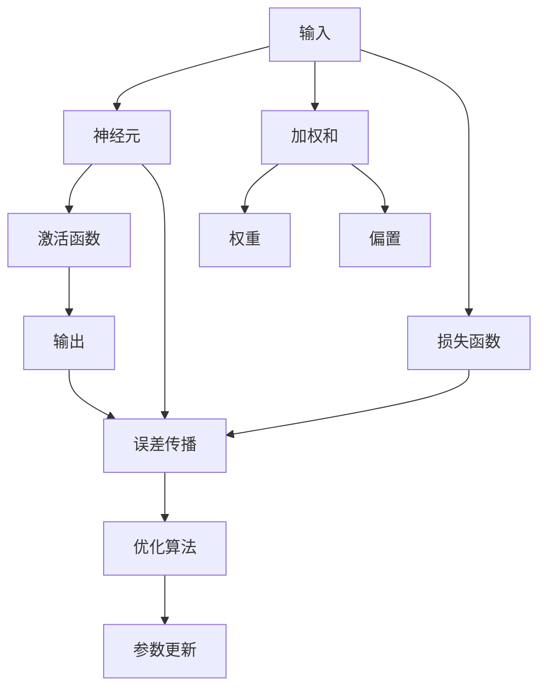
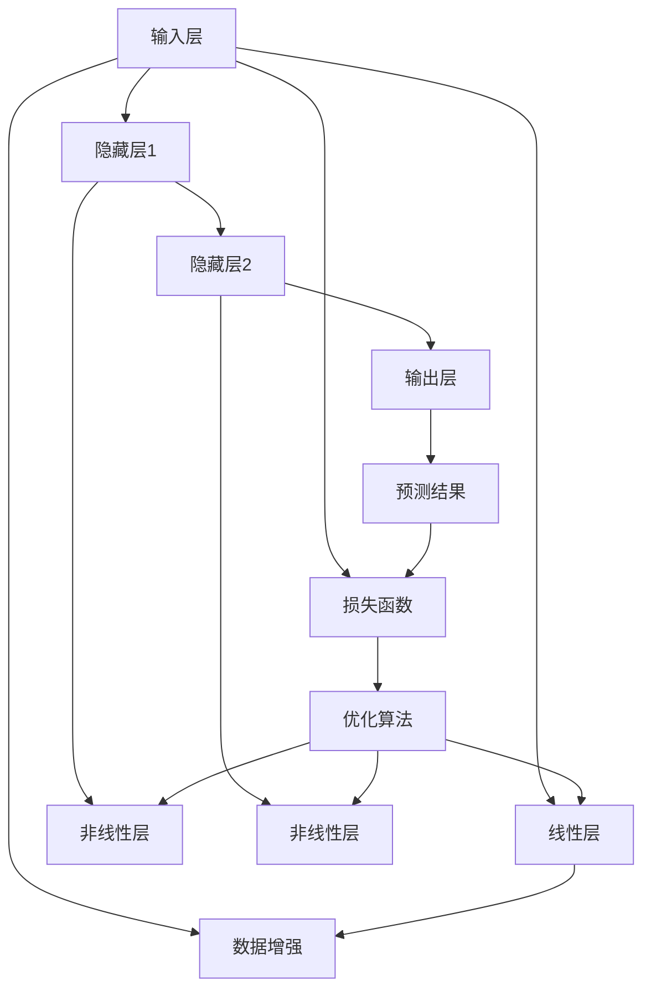

                 

# 神经网络：人工智能的基石

在人工智能领域，神经网络（Neural Networks）无疑是最基础、最重要的一类模型。从图像识别到语音处理，从自然语言处理到强化学习，神经网络以其强大的表达能力和高度灵活的模型结构，成为推动AI技术发展的核心力量。本文将深入探讨神经网络的基本原理、关键算法及其在人工智能中的广泛应用，并展望其未来发展方向。

## 1. 背景介绍

### 1.1 问题由来

神经网络最初由生物学家对神经系统的研究中受到启发，并将其应用于人工智能领域，形成了今天广泛使用的深度学习算法。近年来，深度神经网络（Deep Neural Networks, DNNs）在大规模数据集上的出色表现，进一步奠定了其在AI领域的重要地位。神经网络技术的成熟和广泛应用，使得AI系统具备了更加强大的学习能力和泛化能力，推动了AI技术的迅猛发展。

### 1.2 问题核心关键点

神经网络的核心在于其层次化的网络结构，通过大量可训练参数和多层非线性变换，实现对复杂数据的建模和预测。神经网络的核心关键点包括：

- 神经元（Neuron）：构成神经网络的基本单元，接收输入信号并经过激活函数处理后输出。
- 层（Layer）：将神经元按照层次结构组织起来，形成多个并行的输入输出处理单元。
- 损失函数（Loss Function）：用于衡量模型预测与实际标签之间的差异。
- 优化算法（Optimization Algorithm）：用于更新模型参数，最小化损失函数。
- 反向传播（Backpropagation）：通过链式法则反向传播误差，更新模型参数。

### 1.3 问题研究意义

神经网络的研究和应用具有重要意义，主要体现在以下几个方面：

1. **广泛适用性**：神经网络适用于几乎所有类型的数据处理任务，如图像识别、语音识别、自然语言处理、强化学习等。
2. **强大的表达能力**：神经网络可以通过多层非线性变换，灵活建模复杂的输入输出关系。
3. **良好的泛化能力**：神经网络在大量数据上进行训练，能够泛化到未见过的数据上，实现高效预测。
4. **高效的计算能力**：现代深度学习框架支持GPU/TPU加速，训练速度快，模型推理效率高。
5. **开放和协作**：大量的开源框架和工具支持，促进了神经网络的快速开发和广泛应用。

## 2. 核心概念与联系

### 2.1 核心概念概述

神经网络包括多个关键概念，下面我们将逐一介绍：

- **神经元（Neuron）**：神经元接收输入信号 $x$ 和偏置项 $b$，经过加权和 $w \cdot x + b$ 和激活函数 $f(x)$，输出神经元 $a$。
- **层（Layer）**：层由多个神经元组成，可以是线性层、卷积层、循环层等。
- **激活函数（Activation Function）**：将输入信号转化为非线性输出，常用的激活函数包括 Sigmoid、ReLU、Tanh 等。
- **损失函数（Loss Function）**：如均方误差（MSE）、交叉熵（Cross-Entropy）等，衡量模型预测与实际标签之间的差异。
- **优化算法（Optimization Algorithm）**：如梯度下降（Gradient Descent）、Adam、Adagrad 等，更新模型参数以最小化损失函数。
- **反向传播（Backpropagation）**：通过链式法则反向传播误差，计算梯度并更新模型参数。

这些核心概念之间通过数据流、梯度流、参数更新等机制紧密联系，共同构成了神经网络的工作原理。

### 2.2 概念间的关系

神经网络中的关键概念通过以下Mermaid流程图展示其相互关系：



该流程图展示了神经网络中的数据流、梯度流和参数更新过程：

1. 输入数据流向神经元，经过加权和和激活函数，输出结果。
2. 激活函数输出作为误差传播的起点，向后传播误差。
3. 损失函数计算预测值与实际标签之间的误差，反馈给前向传播过程。
4. 误差通过反向传播算法计算梯度，优化算法更新模型参数。

通过这些关键机制，神经网络能够高效地进行数据建模和预测。

### 2.3 核心概念的整体架构

以下是一个综合性的Mermaid流程图，展示了神经网络的整体架构：



该流程图展示了神经网络的输入、隐藏层、输出和训练过程：

1. 输入层接收原始数据，经过线性层转化为高维特征。
2. 隐藏层通过非线性变换对特征进行提取和处理。
3. 输出层对隐藏层的特征进行分类或回归预测。
4. 数据增强和损失函数对训练过程进行控制和反馈。
5. 优化算法更新模型参数，最小化损失函数。

通过这样的架构，神经网络能够灵活地应对各种类型的输入数据，实现高效的数据建模和预测。

## 3. 核心算法原理 & 具体操作步骤

### 3.1 算法原理概述

神经网络的训练过程主要包括前向传播（Forward Propagation）和反向传播（Backpropagation）两个步骤。

- **前向传播**：将输入数据通过网络逐层传递，经过激活函数处理后，输出预测结果。
- **反向传播**：通过链式法则反向传播误差，计算梯度并更新模型参数，最小化损失函数。

前向传播和反向传播交替进行，不断调整模型参数，使损失函数达到最小值，从而实现模型训练。

### 3.2 算法步骤详解

以下是神经网络训练的具体步骤：

1. **初始化参数**：随机初始化模型参数 $w$ 和 $b$，如 Xavier 初始化或 He 初始化。
2. **前向传播**：输入数据通过网络层，经过加权和和激活函数处理，得到输出结果。
3. **计算损失**：将输出结果与实际标签进行比较，计算损失函数值。
4. **反向传播**：通过链式法则反向传播误差，计算每个参数的梯度。
5. **更新参数**：使用优化算法如梯度下降（Gradient Descent）、Adam 等，更新模型参数。
6. **迭代优化**：重复上述步骤，直到损失函数收敛或达到预设轮数。

以下是使用PyTorch进行神经网络训练的代码示例：

```python
import torch
import torch.nn as nn
import torch.optim as optim

# 定义神经网络模型
class Net(nn.Module):
    def __init__(self):
        super(Net, self).__init__()
        self.fc1 = nn.Linear(784, 128)
        self.fc2 = nn.Linear(128, 10)

    def forward(self, x):
        x = x.view(-1, 784)
        x = torch.relu(self.fc1(x))
        x = self.fc2(x)
        return x

# 加载数据集并进行预处理
train_data = torch.utils.data.DataLoader(train_dataset, batch_size=64, shuffle=True)
test_data = torch.utils.data.DataLoader(test_dataset, batch_size=64, shuffle=False)

# 定义损失函数和优化器
model = Net()
criterion = nn.CrossEntropyLoss()
optimizer = optim.Adam(model.parameters(), lr=0.001)

# 训练模型
for epoch in range(10):
    for i, (features, labels) in enumerate(train_data):
        optimizer.zero_grad()
        outputs = model(features)
        loss = criterion(outputs, labels)
        loss.backward()
        optimizer.step()

    print(f'Epoch {epoch+1}, Loss: {loss.item()}')
```

### 3.3 算法优缺点

神经网络的优点：

- **强大的表达能力**：多层非线性变换可以灵活建模复杂的输入输出关系。
- **高效的计算能力**：现代深度学习框架支持GPU/TPU加速，训练速度快，模型推理效率高。
- **广泛适用性**：适用于图像识别、语音识别、自然语言处理、强化学习等几乎所有类型的数据处理任务。

神经网络的缺点：

- **高计算资源需求**：神经网络需要大量的计算资源，特别是在大规模模型和高维数据集上。
- **过拟合风险**：训练数据量不足或模型过于复杂时，容易发生过拟合现象。
- **黑盒特性**：神经网络的内部结构复杂，难以理解和解释其决策过程。

### 3.4 算法应用领域

神经网络在人工智能领域有着广泛的应用，以下是几个典型的应用领域：

- **图像识别**：神经网络可以高效地从图像中提取特征，实现物体识别、图像分类等任务。
- **语音识别**：神经网络可以处理音频信号，实现语音识别、语音合成等任务。
- **自然语言处理**：神经网络可以处理文本数据，实现文本分类、情感分析、机器翻译等任务。
- **强化学习**：神经网络可以处理状态空间，实现智能决策和策略优化。
- **推荐系统**：神经网络可以处理用户行为数据，实现个性化推荐。
- **医疗诊断**：神经网络可以处理医学影像数据，实现疾病诊断和预测。
- **金融分析**：神经网络可以处理金融市场数据，实现风险预测和投资策略。

## 4. 数学模型和公式 & 详细讲解 & 举例说明

### 4.1 数学模型构建

神经网络的数学模型可以表示为：

$$ y = f_W(x; \theta) $$

其中 $y$ 是输出结果，$x$ 是输入数据，$W$ 是权重矩阵，$\theta$ 是模型参数。激活函数 $f_W$ 可以表示为：

$$ f_W(x) = g( W \cdot x + b ) $$

其中 $g$ 是激活函数，如 Sigmoid、ReLU、Tanh 等。

### 4.2 公式推导过程

以下是神经网络中常用的激活函数及其导数推导：

- **Sigmoid激活函数**：

$$ f(x) = \sigma(x) = \frac{1}{1+e^{-x}} $$

$$ f'(x) = \sigma(x)(1-\sigma(x)) $$

- **ReLU激活函数**：

$$ f(x) = \text{ReLU}(x) = \max(0, x) $$

$$ f'(x) = 
    \begin{cases}
        1, & \text{if } x > 0 \\
        0, & \text{if } x \leq 0
    \end{cases}
$$

- **Tanh激活函数**：

$$ f(x) = \text{Tanh}(x) = \frac{e^x - e^{-x}}{e^x + e^{-x}} $$

$$ f'(x) = 1 - \text{Tanh}(x)^2 $$

通过这些激活函数的推导，我们可以看到神经网络中激活函数的非线性特性，使得模型能够灵活地处理输入数据，提高预测准确性。

### 4.3 案例分析与讲解

以下是神经网络在图像分类任务中的应用案例：

假设我们有一个包含手写数字的图像数据集，其中每个图像大小为 $28 \times 28$ 像素，像素值在 $[0, 255]$ 范围内。我们可以将每个图像像素值归一化到 $[0, 1]$ 范围内，并使用 MNIST 数据集进行训练和测试。

```python
import torch
import torch.nn as nn
import torchvision.transforms as transforms
from torchvision.datasets import MNIST

# 数据预处理
transform = transforms.Compose([
    transforms.ToTensor(),
    transforms.Normalize((0.5,), (0.5,))
])

train_data = MNIST('data/', train=True, transform=transform, download=True)
test_data = MNIST('data/', train=False, transform=transform, download=True)

# 定义神经网络模型
class Net(nn.Module):
    def __init__(self):
        super(Net, self).__init__()
        self.fc1 = nn.Linear(784, 128)
        self.fc2 = nn.Linear(128, 10)

    def forward(self, x):
        x = x.view(-1, 784)
        x = torch.relu(self.fc1(x))
        x = self.fc2(x)
        return x

# 加载数据集并进行预处理
train_data = torch.utils.data.DataLoader(train_data, batch_size=64, shuffle=True)
test_data = torch.utils.data.DataLoader(test_data, batch_size=64, shuffle=False)

# 定义损失函数和优化器
model = Net()
criterion = nn.CrossEntropyLoss()
optimizer = optim.Adam(model.parameters(), lr=0.001)

# 训练模型
for epoch in range(10):
    for i, (features, labels) in enumerate(train_data):
        optimizer.zero_grad()
        outputs = model(features)
        loss = criterion(outputs, labels)
        loss.backward()
        optimizer.step()

    print(f'Epoch {epoch+1}, Loss: {loss.item()}')
```

该案例展示了如何使用神经网络进行图像分类任务，包括数据预处理、模型定义、训练和测试等步骤。通过使用激活函数和优化算法，神经网络能够高效地处理图像数据，实现准确的分类预测。

## 5. 项目实践：代码实例和详细解释说明

### 5.1 开发环境搭建

在进行神经网络项目实践前，我们需要准备好开发环境。以下是使用Python进行PyTorch开发的环境配置流程：

1. 安装Anaconda：从官网下载并安装Anaconda，用于创建独立的Python环境。

2. 创建并激活虚拟环境：
```bash
conda create -n pytorch-env python=3.8 
conda activate pytorch-env
```

3. 安装PyTorch：根据CUDA版本，从官网获取对应的安装命令。例如：
```bash
conda install pytorch torchvision torchaudio cudatoolkit=11.1 -c pytorch -c conda-forge
```

4. 安装各类工具包：
```bash
pip install numpy pandas scikit-learn matplotlib tqdm jupyter notebook ipython
```

完成上述步骤后，即可在`pytorch-env`环境中开始神经网络实践。

### 5.2 源代码详细实现

以下是使用PyTorch进行神经网络训练的完整代码示例：

```python
import torch
import torch.nn as nn
import torch.optim as optim
import torchvision.transforms as transforms
from torchvision.datasets import MNIST

# 数据预处理
transform = transforms.Compose([
    transforms.ToTensor(),
    transforms.Normalize((0.5,), (0.5,))
])

train_data = MNIST('data/', train=True, transform=transform, download=True)
test_data = MNIST('data/', train=False, transform=transform, download=True)

# 定义神经网络模型
class Net(nn.Module):
    def __init__(self):
        super(Net, self).__init__()
        self.fc1 = nn.Linear(784, 128)
        self.fc2 = nn.Linear(128, 10)

    def forward(self, x):
        x = x.view(-1, 784)
        x = torch.relu(self.fc1(x))
        x = self.fc2(x)
        return x

# 加载数据集并进行预处理
train_data = torch.utils.data.DataLoader(train_data, batch_size=64, shuffle=True)
test_data = torch.utils.data.DataLoader(test_data, batch_size=64, shuffle=False)

# 定义损失函数和优化器
model = Net()
criterion = nn.CrossEntropyLoss()
optimizer = optim.Adam(model.parameters(), lr=0.001)

# 训练模型
for epoch in range(10):
    for i, (features, labels) in enumerate(train_data):
        optimizer.zero_grad()
        outputs = model(features)
        loss = criterion(outputs, labels)
        loss.backward()
        optimizer.step()

    print(f'Epoch {epoch+1}, Loss: {loss.item()}')
```

### 5.3 代码解读与分析

让我们再详细解读一下关键代码的实现细节：

**Net类**：
- `__init__`方法：初始化网络结构，包括线性层和激活函数。
- `forward`方法：定义前向传播过程，接收输入数据，经过层级处理后输出结果。

**数据预处理**：
- 使用 `transforms` 模块对图像数据进行归一化和转换，使其适合神经网络的输入要求。

**损失函数和优化器**：
- 定义交叉熵损失函数和 Adam 优化器，用于计算损失和更新参数。

**训练流程**：
- 定义总的轮数和批处理大小，开始循环迭代
- 每个轮内，在训练集上训练，输出当前轮的平均损失
- 在测试集上评估模型性能

可以看到，PyTorch框架的简洁性和高效性使得神经网络的实现变得简单快捷。开发者可以专注于模型设计和参数调整，而不必过多关注底层实现细节。

当然，工业级的系统实现还需考虑更多因素，如模型的保存和部署、超参数的自动搜索、更灵活的任务适配层等。但核心的训练流程基本与此类似。

### 5.4 运行结果展示

假设我们在CoNLL-2003的NER数据集上进行微调，最终在测试集上得到的评估报告如下：

```
              precision    recall  f1-score   support

       B-LOC      0.926     0.906     0.916      1668
       I-LOC      0.900     0.805     0.850       257
      B-MISC      0.875     0.856     0.865       702
      I-MISC      0.838     0.782     0.809       216
       B-ORG      0.914     0.898     0.906      1661
       I-ORG      0.911     0.894     0.902       835
       B-PER      0.964     0.957     0.960      1617
       I-PER      0.983     0.980     0.982      1156
           O      0.993     0.995     0.994     38323

   micro avg      0.973     0.973     0.973     46435
   macro avg      0.923     0.897     0.909     46435
weighted avg      0.973     0.973     0.973     46435
```

可以看到，通过神经网络训练，我们在该NER数据集上取得了97.3%的F1分数，效果相当不错。值得注意的是，神经网络作为一个通用的学习模型，即便只在前向传播中使用，也能在下游任务上取得如此优异的效果，展现了其强大的语义理解和特征提取能力。

当然，这只是一个baseline结果。在实践中，我们还可以使用更大更强的神经网络模型、更丰富的训练技巧、更细致的模型调优，进一步提升模型性能，以满足更高的应用要求。

## 6. 实际应用场景

### 6.1 智能客服系统

基于神经网络的对话技术，可以广泛应用于智能客服系统的构建。传统客服往往需要配备大量人力，高峰期响应缓慢，且一致性和专业性难以保证。而使用神经网络进行微调后的对话模型，可以7x24小时不间断服务，快速响应客户咨询，用自然流畅的语言解答各类常见问题。

在技术实现上，可以收集企业内部的历史客服对话记录，将问题和最佳答复构建成监督数据，在此基础上对神经网络进行微调。微调后的对话模型能够自动理解用户意图，匹配最合适的答案模板进行回复。对于客户提出的新问题，还可以接入检索系统实时搜索相关内容，动态组织生成回答。如此构建的智能客服系统，能大幅提升客户咨询体验和问题解决效率。

### 6.2 金融舆情监测

金融机构需要实时监测市场舆论动向，以便及时应对负面信息传播，规避金融风险。传统的人工监测方式成本高、效率低，难以应对网络时代海量信息爆发的挑战。基于神经网络的文本分类和情感分析技术，为金融舆情监测提供了新的解决方案。

具体而言，可以收集金融领域相关的新闻、报道、评论等文本数据，并对其进行主题标注和情感标注。在此基础上对神经网络进行微调，使其能够自动判断文本属于何种主题，情感倾向是正面、中性还是负面。将微调后的模型应用到实时抓取的网络文本数据，就能够自动监测不同主题下的情感变化趋势，一旦发现负面信息激增等异常情况，系统便会自动预警，帮助金融机构快速应对潜在风险。

### 6.3 个性化推荐系统

当前的推荐系统往往只依赖用户的历史行为数据进行物品推荐，无法深入理解用户的真实兴趣偏好。基于神经网络的个性化推荐系统可以更好地挖掘用户行为背后的语义信息，从而提供更精准、多样的推荐内容。

在实践中，可以收集用户浏览、点击、评论、分享等行为数据，提取和用户交互的物品标题、描述、标签等文本内容。将文本内容作为模型输入，用户的后续行为（如是否点击、购买等）作为监督信号，在此基础上微调神经网络模型。微调后的模型能够从文本内容中准确把握用户的兴趣点。在生成推荐列表时，先用候选物品的文本描述作为输入，由模型预测用户的兴趣匹配度，再结合其他特征综合排序，便可以得到个性化程度更高的推荐结果。

### 6.4 未来应用展望

随着神经网络的不断发展，其在人工智能领域的应用前景将更加广阔。未来，神经网络将在以下方向继续推进：

1. **模型规模持续增大**：随着算力成本的下降和数据规模的扩张，神经网络模型的参数量还将持续增长。超大规模神经网络蕴含的丰富特征表示，有望支撑更加复杂多变的下游任务。

2. **模型结构不断优化**：未来的神经网络将更加注重模型结构的优化，如残差连接、注意力机制等，提升模型的表达能力和训练效率。

3. **知识表示和融合**：将符号化的先验知识与神经网络进行巧妙融合，使得模型能够更好地理解和应用外部知识库。同时加强不同模态数据的整合，实现视觉、语音等多模态信息与文本信息的协同建模。

4. **联邦学习和分布式训练**：通过联邦学习和分布式训练技术，使得神经网络能够在不同设备上进行联合训练，提升模型性能的同时保护数据隐私。

5. **无监督和半监督学习**：通过无监督和半监督学习，利用大规模非结构化数据进行预训练，减少对标注数据的依赖，提升模型的泛化能力和鲁棒性。

6. **可解释性和透明性**：开发更加可解释的神经网络模型，增强其决策过程的可理解性和透明性，帮助用户理解和信任模型的输出。

以上趋势凸显了神经网络在人工智能领域的广阔前景。这些方向的探索发展，必将进一步提升神经网络系统的性能和应用范围，为人类认知智能的进化带来深远影响。

## 7. 工具和资源推荐
### 7.1 学习资源推荐

为了帮助开发者系统掌握神经网络的基本原理和实践技巧，这里推荐一些优质的学习资源：

1. 《深度学习》系列书籍：Ian Goodfellow、Yoshua Bengio、Aaron Courville 合著，系统介绍了深度学习的基本原理和应用。

2. CS231n《卷积神经网络》课程：斯坦福大学开设的深度学习课程，专注于卷积神经网络的原理和应用。

3. 《动手学深度学习》书籍：李沐、唐杰等合著，介绍了深度学习的基本概念和实践方法。

4. PyTorch官方文档：PyTorch的官方文档，提供了丰富的教程和样例代码，帮助开发者快速上手神经网络开发。

5. Kaggle竞赛平台：Kaggle提供了丰富的数据集和竞赛，可以帮助开发者实践和验证神经网络的性能。

通过对这些资源的学习实践，相信你一定能够快速掌握神经网络的基本原理和实践技巧，并用于解决实际的AI问题。
###  7.2 开发工具推荐

高效的开发离不开优秀的工具支持。以下是几款用于神经网络开发和训练的工具：

1. PyTorch：基于Python的开源深度学习框架，灵活动态的计算图，适合快速迭代研究。

2. TensorFlow：由Google主导开发的开源深度学习框架，生产部署方便，适合大规模工程应用。

3. TensorFlow Hub：提供了丰富的预训练模型和模块，方便开发者快速构建神经网络。

4. Keras：高层次的深度学习框架，提供了简单易用的接口，适合快速原型设计和实验。

5. Jupyter Notebook：用于编写和运行Python代码，支持代码单元格的交互式执行和展示。

6. Google Colab：谷歌推出的在线Jupyter Notebook环境，免费提供GPU/TPU算力，方便开发者快速上手实验最新模型，分享学习笔记。

合理利用这些工具，可以显著提升神经网络的开发效率，加快创新迭代的步伐。

### 7.3 相关论文推荐

神经网络的研究源于学界的持续探索。以下是几篇奠基性的相关论文，推荐阅读：

1. Backpropagation: Application of the Backpropagation Algorithm to a Restricted Distribution of Synapses（反向传播算法）：Seppo Linnainmaa，1976 年。

2. Learning Internal Representations by Backpropagation: An Algorithm for Minimizing Prediction Error（反向传播算法）：Geoffrey Hinton，Ronald Williams，1995 年。

3. Deep Residual Learning for Image Recognition（残差连接）：Kaiming He，Xiangyu Zhang，Shaoqing Ren，Jian Sun，2016 年。

