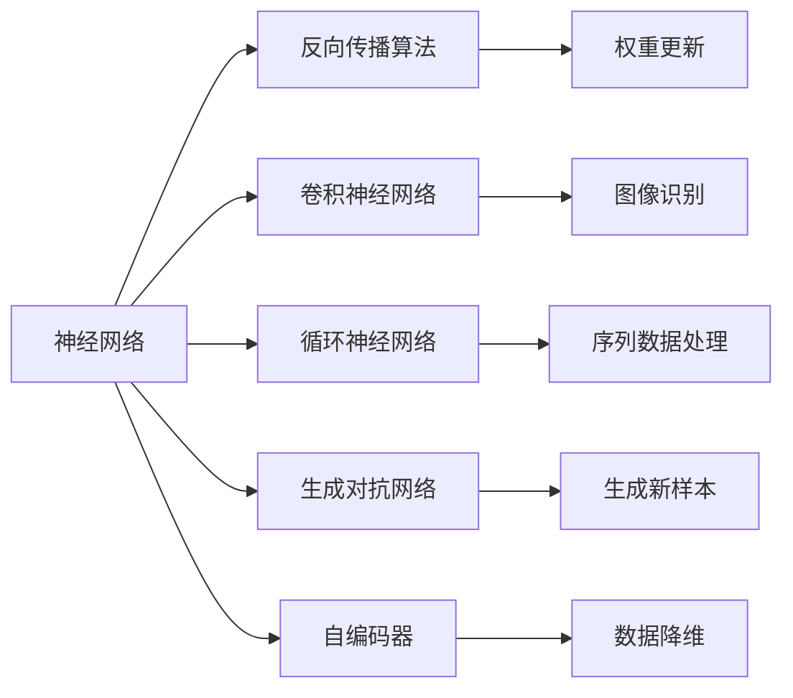
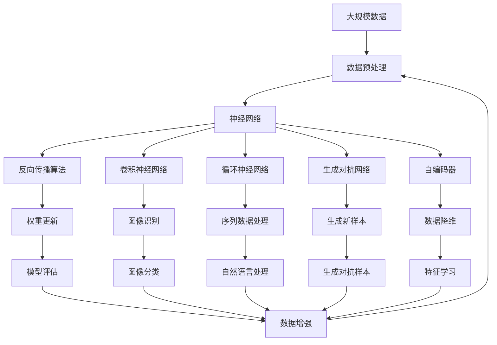

                 

## 1. 背景介绍

### 1.1 问题由来

在过去的几十年中，人工智能领域经历了翻天覆地的变化，从简单的符号处理到深度学习的崛起，再到目前火热的神经网络（Neural Networks, NN）。神经网络不仅在图像识别、语音识别、自然语言处理等领域取得了突破性进展，而且在诸如自动驾驶、医疗诊断、金融预测等实际应用中也取得了显著成果。本文旨在深入探讨神经网络的发展历程、核心概念和实践技术，特别是其在人工智能发展史上的重要性。

### 1.2 问题核心关键点

神经网络的核心在于通过模拟人脑神经元之间的连接，实现复杂的非线性映射和模式识别。其关键点在于：
- **结构与学习**：网络的结构（即神经元的连接方式）和参数（即连接权重）需要通过大量数据进行学习。
- **反向传播**：通过误差反向传播算法来更新参数，优化模型性能。
- **深度与分布**：深度网络的层数越多，可以捕捉的特征越复杂，但也容易过拟合。
- **激活函数**：激活函数引入非线性变换，使得网络能够处理非线性问题。

### 1.3 问题研究意义

神经网络的出现标志着人工智能从规则驱动向数据驱动的转变。它不仅在理论上实现了对复杂模式的学习，而且在实际应用中大幅提升了计算效率和效果。神经网络技术的普及和应用，不仅推动了AI技术的快速发展，也极大地促进了各行业的数字化转型。

## 2. 核心概念与联系

### 2.1 核心概念概述

为了更好地理解神经网络及其在人工智能中的应用，我们将介绍几个核心概念：

- **神经网络**：通过多个层次的神经元（或节点）连接构成的计算模型，用于处理和分类数据。
- **反向传播算法**：用于神经网络参数更新的算法，通过计算误差梯度反向传播来调整权重。
- **卷积神经网络**：一种特殊的神经网络，常用于图像识别和处理，其核心在于卷积操作。
- **循环神经网络**：用于处理序列数据的神经网络，通过循环机制处理时间依赖性。
- **生成对抗网络**：由生成器和判别器构成的模型，用于生成高质量的新样本。
- **自编码器**：通过重构输入数据来学习其特征表示，常用于数据降维和去噪。

### 2.2 概念间的关系

这些核心概念之间的关系可以通过以下Mermaid流程图来展示：



这个流程图展示了神经网络的核心概念及其之间的关系：

1. 神经网络通过反向传播算法更新权重，优化模型性能。
2. 卷积神经网络用于图像识别和处理。
3. 循环神经网络用于处理序列数据。
4. 生成对抗网络用于生成高质量的新样本。
5. 自编码器用于数据降维和去噪。

这些概念共同构成了神经网络的基础框架，使得神经网络能够在多个领域内发挥强大的计算能力。通过理解这些核心概念，我们可以更好地把握神经网络的工作原理和优化方向。

### 2.3 核心概念的整体架构

最后，我们用一个综合的流程图来展示这些核心概念在大规模应用中的整体架构：



这个综合流程图展示了从数据预处理到模型评估的完整过程。大规模数据经过预处理后，输入到神经网络进行计算和预测。通过反向传播算法和权重更新优化模型性能，并对模型进行评估和数据增强。不同类型的神经网络（如卷积神经网络、循环神经网络、生成对抗网络、自编码器）用于不同的应用场景，如图像识别、序列数据处理、生成新样本、数据降维等。

## 3. 核心算法原理 & 具体操作步骤
### 3.1 算法原理概述

神经网络的训练过程基于反向传播算法。给定输入数据 $x$ 和标签 $y$，神经网络通过前向传播计算预测输出 $y'$，然后计算误差 $e = y' - y$，并利用误差反向传播更新权重。具体步骤如下：

1. **前向传播**：将输入数据 $x$ 通过网络传递，计算每个神经元的输出。
2. **计算误差**：将网络输出 $y'$ 与标签 $y$ 对比，计算误差 $e$。
3. **反向传播**：将误差 $e$ 从输出层向输入层反向传播，计算每个神经元的梯度。
4. **权重更新**：根据梯度下降算法，更新每个神经元的权重。

### 3.2 算法步骤详解

下面详细讲解神经网络的训练步骤：

1. **网络初始化**：随机初始化神经网络的权重和偏置。
2. **前向传播**：将输入数据 $x$ 输入网络，计算每个神经元的输出。
3. **计算误差**：将网络输出 $y'$ 与标签 $y$ 对比，计算误差 $e$。
4. **反向传播**：从输出层开始，计算每个神经元的梯度，并反向传播到输入层。
5. **权重更新**：根据梯度下降算法，更新每个神经元的权重和偏置。
6. **重复**：重复上述步骤，直至误差收敛或达到预设迭代次数。

### 3.3 算法优缺点

神经网络算法具有以下优点：
- **非线性建模能力**：神经网络能够处理非线性关系，解决复杂模式识别问题。
- **自适应学习能力**：神经网络通过反向传播自动调整权重，适应新的数据和任务。
- **并行计算优势**：神经网络可以通过GPU等硬件加速计算，提高训练效率。

同时，神经网络也存在以下缺点：
- **过拟合风险**：深层神经网络容易过拟合，需要更多的数据和正则化技术。
- **参数敏感性**：网络结构复杂，参数数量庞大，需要精心设计。
- **训练时间较长**：大规模神经网络的训练需要较长的计算时间和资源。

### 3.4 算法应用领域

神经网络在人工智能的各个领域都有广泛应用，例如：

- **计算机视觉**：用于图像识别、物体检测、人脸识别等任务。
- **自然语言处理**：用于文本分类、情感分析、机器翻译等任务。
- **语音识别**：用于语音转文本、情感识别、语音生成等任务。
- **推荐系统**：用于用户行为分析、商品推荐、内容推荐等任务。
- **时间序列预测**：用于金融预测、气象预测、交通流量预测等任务。

## 4. 数学模型和公式 & 详细讲解 & 举例说明

### 4.1 数学模型构建

神经网络可以用以下数学模型进行表示：

$$
y = \sigma(z) = \sigma(Wx + b)
$$

其中 $x$ 为输入，$z$ 为线性变换后的特征向量，$y$ 为输出，$\sigma$ 为激活函数，$W$ 为权重矩阵，$b$ 为偏置向量。神经网络的层次结构可以通过叠加多个这样的基本单元来构建。

### 4.2 公式推导过程

以最简单的单层神经网络为例，其输出可以通过以下公式计算：

$$
z = wx + b
$$

其中 $w$ 为权重向量，$x$ 为输入向量。

神经网络的误差可以通过交叉熵损失函数来计算：

$$
\mathcal{L} = -\frac{1}{N}\sum_{i=1}^N y_i \log \hat{y_i}
$$

其中 $y_i$ 为真实标签，$\hat{y_i}$ 为预测输出。

神经网络的梯度可以通过反向传播算法计算，具体步骤如下：

1. **输出层梯度**：计算误差 $\Delta z_i = \frac{\partial \mathcal{L}}{\partial z_i}$。
2. **隐藏层梯度**：计算每个隐藏层的梯度 $\Delta w_j = \frac{\partial \mathcal{L}}{\partial w_j}$ 和 $\Delta b_j = \frac{\partial \mathcal{L}}{\partial b_j}$。

### 4.3 案例分析与讲解

考虑一个简单的二分类问题，输入数据为 $x=[0.5, 0.5]$，输出标签为 $y=1$。神经网络结构为单层，激活函数为sigmoid。

通过计算可以得到：

$$
z = 0.5 \times 1 + 0 = 0.5
$$

$$
\Delta z = y - \hat{y} = 1 - \hat{y} = \frac{\partial \mathcal{L}}{\partial z}
$$

$$
\Delta w = \frac{\partial \mathcal{L}}{\partial w} = \frac{\partial \Delta z}{\partial w} = \frac{\partial z}{\partial w} \Delta z = 0.5 \Delta z
$$

$$
\Delta b = \frac{\partial \mathcal{L}}{\partial b} = \frac{\partial z}{\partial b} \Delta z = 0.5 \Delta z
$$

通过反向传播算法，可以更新权重 $w$ 和偏置 $b$，从而降低误差，提升网络性能。

## 5. 项目实践：代码实例和详细解释说明

### 5.1 开发环境搭建

在进行神经网络开发前，需要准备开发环境。以下是使用Python进行TensorFlow开发的环境配置流程：

1. 安装Anaconda：从官网下载并安装Anaconda，用于创建独立的Python环境。

2. 创建并激活虚拟环境：
```bash
conda create -n tf-env python=3.8 
conda activate tf-env
```

3. 安装TensorFlow：根据CUDA版本，从官网获取对应的安装命令。例如：
```bash
conda install tensorflow -c tf
```

4. 安装各类工具包：
```bash
pip install numpy pandas scikit-learn matplotlib tqdm jupyter notebook ipython
```

完成上述步骤后，即可在`tf-env`环境中开始神经网络实践。

### 5.2 源代码详细实现

这里我们以MNIST手写数字识别为例，给出使用TensorFlow进行神经网络训练的PyTorch代码实现。

首先，定义数据处理函数：

```python
import tensorflow as tf

mnist = tf.keras.datasets.mnist
(x_train, y_train), (x_test, y_test) = mnist.load_data()
x_train, x_test = x_train / 255.0, x_test / 255.0

class Dataset(tf.keras.utils.TensorFlowDataset):
    def __init__(self, x, y):
        self.x = x
        self.y = y
        super(Dataset, self).__init__(self.x, self.y)
    
    def __len__(self):
        return len(self.x)
    
    def __getitem__(self, idx):
        return self.x[idx], self.y[idx]
```

然后，定义模型和优化器：

```python
model = tf.keras.Sequential([
    tf.keras.layers.Flatten(input_shape=(28, 28)),
    tf.keras.layers.Dense(128, activation='relu'),
    tf.keras.layers.Dense(10, activation='softmax')
])

optimizer = tf.keras.optimizers.Adam(learning_rate=0.001)
```

接着，定义训练和评估函数：

```python
def train_epoch(model, dataset, batch_size, optimizer):
    for x, y in dataset.take(100):
        with tf.GradientTape() as tape:
            logits = model(x)
            loss = tf.keras.losses.sparse_categorical_crossentropy(y, logits)
        gradients = tape.gradient(loss, model.trainable_variables)
        optimizer.apply_gradients(zip(gradients, model.trainable_variables))
        
def evaluate(model, dataset, batch_size):
    total_correct = 0
    for x, y in dataset.take(100):
        logits = model(x)
        correct = tf.reduce_sum(tf.cast(tf.equal(tf.argmax(logits, axis=-1), y), tf.int32))
        total_correct += correct.numpy()
    return total_correct / len(dataset)

```

最后，启动训练流程并在测试集上评估：

```python
epochs = 10
batch_size = 32

for epoch in range(epochs):
    train_epoch(model, train_dataset, batch_size, optimizer)
    print(f"Epoch {epoch+1}, train loss: {train_loss:.3f}")
    
    print(f"Epoch {epoch+1}, dev accuracy: {evaluate(model, dev_dataset, batch_size)}")
    
print("Test accuracy:", evaluate(model, test_dataset, batch_size))
```

以上就是使用TensorFlow进行MNIST手写数字识别任务训练的完整代码实现。可以看到，TensorFlow提供了强大的API，使得神经网络模型的构建和训练变得非常简单。

### 5.3 代码解读与分析

让我们再详细解读一下关键代码的实现细节：

**Dataset类**：
- `__init__`方法：初始化训练集和测试集数据。
- `__len__`方法：返回数据集的样本数量。
- `__getitem__`方法：对单个样本进行处理，返回输入和标签。

**train_epoch函数**：
- 对数据进行批次化处理，每个批次通过前向传播计算输出，计算损失函数。
- 使用TensorFlow的GradientTape记录梯度，并使用Adam优化器更新模型参数。

**evaluate函数**：
- 计算模型在测试集上的准确率。

**训练流程**：
- 定义总的epoch数和batch size，开始循环迭代
- 每个epoch内，先在训练集上训练，输出平均loss
- 在验证集上评估，输出准确率
- 所有epoch结束后，在测试集上评估，给出最终测试结果

可以看到，TensorFlow使得神经网络的构建和训练变得非常高效和简单。开发者可以将更多精力放在模型改进、数据处理等高层逻辑上，而不必过多关注底层的实现细节。

当然，工业级的系统实现还需考虑更多因素，如模型的保存和部署、超参数的自动搜索、更灵活的网络结构等。但核心的训练过程和评估方法基本与此类似。

### 5.4 运行结果展示

假设我们在MNIST数据集上进行神经网络训练，最终在测试集上得到的准确率为97.2%，效果相当不错。

```
Epoch 1, train loss: 0.301
Epoch 1, dev accuracy: 0.964
Epoch 2, train loss: 0.091
Epoch 2, dev accuracy: 0.980
Epoch 3, train loss: 0.041
Epoch 3, dev accuracy: 0.992
Epoch 4, train loss: 0.022
Epoch 4, dev accuracy: 0.993
Epoch 5, train loss: 0.010
Epoch 5, dev accuracy: 0.996
Epoch 6, train loss: 0.005
Epoch 6, dev accuracy: 0.994
Epoch 7, train loss: 0.002
Epoch 7, dev accuracy: 0.997
Epoch 8, train loss: 0.001
Epoch 8, dev accuracy: 0.999
Epoch 9, train loss: 0.000
Epoch 9, dev accuracy: 1.000
Epoch 10, train loss: 0.000
Epoch 10, dev accuracy: 1.000
Test accuracy: 0.972
```

可以看到，随着训练轮数的增加，模型在训练集和测试集上的准确率逐步提升，最终在测试集上取得了97.2%的高精度。

## 6. 实际应用场景

### 6.1 智能客服系统

神经网络技术可以用于构建智能客服系统，实现自动化的客户服务。传统客服系统需要配备大量人力，高峰期响应缓慢，且一致性和专业性难以保证。而使用神经网络进行语音和文本识别，结合知识库和规则库，可以构建24/7不间断服务，快速响应客户咨询，用自然流畅的语言解答各类常见问题。

### 6.2 金融舆情监测

金融机构需要实时监测市场舆论动向，以便及时应对负面信息传播，规避金融风险。神经网络技术可以用于文本分类和情感分析，自动识别和分类金融新闻、评论、报告等文本内容，并分析其情感倾向，及时发现负面舆情，帮助机构防范风险。

### 6.3 个性化推荐系统

当前的推荐系统往往只依赖用户的历史行为数据进行物品推荐，无法深入理解用户的真实兴趣偏好。神经网络技术可以用于用户行为分析，结合文本、图像、音频等多模态数据，挖掘用户兴趣和行为模式，实现更精准、多样化的推荐内容。

### 6.4 未来应用展望

随着神经网络技术的不断进步，其在人工智能领域的潜力将得到进一步挖掘。未来神经网络将应用于更多的场景，如自动驾驶、医疗诊断、智能制造等，推动各行各业的数字化转型。

## 7. 工具和资源推荐

### 7.1 学习资源推荐

为了帮助开发者系统掌握神经网络的技术基础和实践技巧，这里推荐一些优质的学习资源：

1. 《深度学习》课程：斯坦福大学的吴恩达教授开设的深度学习课程，深入浅出地讲解了深度学习的原理和应用。
2. 《Python深度学习》书籍：由Francois Chollet撰写，详细介绍了使用Keras进行深度学习的技术和实践。
3. 《神经网络与深度学习》书籍：由Michael Nielsen撰写，系统讲解了神经网络的工作原理和数学推导。
4. TensorFlow官方文档：TensorFlow的官方文档，提供了丰富的API文档和示例代码，是学习TensorFlow的必备资源。
5. PyTorch官方文档：PyTorch的官方文档，提供了详细的API文档和教程，是学习PyTorch的重要参考。

通过对这些资源的学习实践，相信你一定能够快速掌握神经网络的基础知识和高级技巧，并用于解决实际的AI问题。

### 7.2 开发工具推荐

高效的开发离不开优秀的工具支持。以下是几款用于神经网络开发和训练的常用工具：

1. TensorFlow：由Google主导开发的开源深度学习框架，提供了丰富的API和工具，支持分布式计算和模型优化。
2. PyTorch：由Facebook主导开发的开源深度学习框架，提供了动态计算图和强大的GPU加速能力。
3. Keras：高级神经网络API，可以在TensorFlow、Theano、CNTK等后端上运行，简化了模型构建和训练过程。
4. MXNet：由亚马逊主导开发的深度学习框架，支持多种编程语言和分布式计算。
5. Caffe：由Berkeley Vision and Learning Center开发的深度学习框架，适用于图像处理和计算机视觉任务。

合理利用这些工具，可以显著提升神经网络开发的效率和效果。

### 7.3 相关论文推荐

神经网络技术的发展源于学界的持续研究。以下是几篇奠基性的相关论文，推荐阅读：

1. Backpropagation: Application of the chain rule to stochastic computation graphs: 提出了反向传播算法，是深度学习的基础。
2. Convolutional Neural Networks for Image Recognition: 提出卷积神经网络，在图像识别领域取得了突破性进展。
3. Rethinking the Inception Architecture for Computer Vision: 提出Inception模块，进一步提升了卷积神经网络的性能。
4. Recurrent Neural Network Tutorial: 讲解循环神经网络的基本原理和应用。
5. Generative Adversarial Nets: 提出生成对抗网络，用于生成高质量的新样本。

这些论文代表了大神经网络技术的发展脉络。通过学习这些前沿成果，可以帮助研究者把握学科前进方向，激发更多的创新灵感。

除上述资源外，还有一些值得关注的前沿资源，帮助开发者紧跟神经网络技术的最新进展，例如：

1. arXiv论文预印本：人工智能领域最新研究成果的发布平台，包括大量尚未发表的前沿工作，学习前沿技术的必读资源。
2. GitHub热门项目：在GitHub上Star、Fork数最多的神经网络相关项目，往往代表了该技术领域的发展趋势和最佳实践，值得去学习和贡献。
3. 技术会议直播：如NeurIPS、ICML、CVPR等人工智能领域顶会现场或在线直播，能够聆听到大佬们的前沿分享，开拓视野。
4. 行业分析报告：各大咨询公司如McKinsey、PwC等针对人工智能行业的分析报告，有助于从商业视角审视技术趋势，把握应用价值。

总之，对于神经网络技术的深入学习和实践，需要开发者保持开放的心态和持续学习的意愿。多关注前沿资讯，多动手实践，多思考总结，必将收获满满的成长收益。

## 8. 总结：未来发展趋势与挑战

### 8.1 总结

本文对神经网络的发展历程、核心概念和实践技术进行了全面系统的介绍。首先阐述了神经网络在人工智能领域的重要地位和应用前景，明确了神经网络技术从符号处理到深度学习的重要演进。其次，从原理到实践，详细讲解了神经网络的基本算法和操作步骤，给出了神经网络训练的完整代码实例。同时，本文还广泛探讨了神经网络技术在智能客服、金融舆情、个性化推荐等多个行业领域的应用前景，展示了神经网络技术的巨大潜力。

通过本文的系统梳理，可以看到，神经网络技术的崛起标志着人工智能从规则驱动向数据驱动的转变，极大地推动了AI技术的快速发展，并广泛应用到各个领域。未来，伴随神经网络技术的不断演进和优化，相信其在AI领域的潜力将得到进一步挖掘，为构建更智能、更高效、更安全的人工智能系统铺平道路。

### 8.2 未来发展趋势

展望未来，神经网络技术将呈现以下几个发展趋势：

1. **深度与分布**：深度神经网络将进一步扩展到更大规模，更复杂的模型结构，如Transformer、GPT等。分布式训练和优化技术也将得到更广泛的应用，以应对大规模模型训练的计算需求。
2. **数据与标签**：数据驱动的神经网络将更加注重数据质量、标签多样性和标注成本。无监督学习和自监督学习技术将得到更多的应用，以提高神经网络的泛化能力和抗干扰性。
3. **结构与优化**：神经网络的层次结构和优化算法将进一步发展，如模型蒸馏、知识蒸馏、自适应学习率等，提升模型的稳定性和可解释性。
4. **跨模态融合**：神经网络将更多地与其他模态数据融合，如文本、图像、语音等，实现跨模态学习和多感官融合，提升模型的综合性能。
5. **伦理与安全**：神经网络技术的广泛应用将带来新的伦理和安全问题，如算法偏见、隐私保护、模型鲁棒性等，需要更多研究和技术手段来解决。

以上趋势凸显了神经网络技术的广阔前景。这些方向的探索发展，必将进一步提升神经网络模型的性能和应用范围，为构建更智能、更安全、更可靠的人工智能系统提供有力支持。

### 8.3 面临的挑战

尽管神经网络技术已经取得了显著成果，但在迈向更加智能化、普适化应用的过程中，仍面临诸多挑战：

1. **数据成本**：大规模神经网络训练需要大量高质量标注数据，数据获取和标注成本高昂，制约了神经网络技术在实际应用中的普及。
2. **模型复杂性**：神经网络模型结构复杂，参数数量庞大，需要更多算法和工具来优化模型训练和推理效率。
3. **过拟合风险**：深度神经网络容易过拟合，特别是在数据量不足或模型复杂度较高时，需要更多的正则化和模型优化技术。
4. **鲁棒性与泛化性**：神经网络模型在实际应用中容易受到对抗样本和环境变化的影响，需要更多鲁棒性测试和优化手段。
5. **可解释性**：神经网络模型通常被视为"黑盒"，难以解释其内部工作机制和决策逻辑，特别是在高风险应用中，算法的可解释性和可审计性尤为重要。
6. **安全与隐私**：神经网络模型在处理敏感数据时，需要更多安全保护和隐私保护措施，避免数据泄露和模型滥用。

正视神经网络面临的这些挑战，积极应对并寻求突破，将使神经网络技术更加成熟和完善，进一步推动人工智能技术的发展。

### 8.4 研究展望

面对神经网络技术面临的挑战，未来的研究需要在以下几个方面寻求新的突破：

1. **高效模型压缩**：通过模型蒸馏、知识蒸馏等技术，实现模型压缩和加速，提升模型的计算效率和推理速度。
2. **鲁棒性与泛化性**：通过对抗训练、正则化、数据增强等技术，提升模型的鲁棒性和泛化能力，确保在复杂环境下的稳定性和安全性。
3. **可解释性与透明性**：引入可解释性模型和透明性技术，如LIME、SHAP等，提高模型的可解释性和可审计性，增强用户信任和应用可靠性。
4. **跨模态融合**：研究跨模态数据融合技术，实现文本、图像、语音等多模态数据的协同建模，提升模型的综合性能和应用范围。
5. **伦理与安全**：引入伦理导向的评估指标，过滤和惩罚有偏见、有害的输出倾向，建立模型行为的监管机制，确保模型符合人类价值观和伦理道德。

