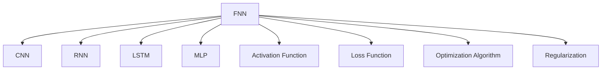
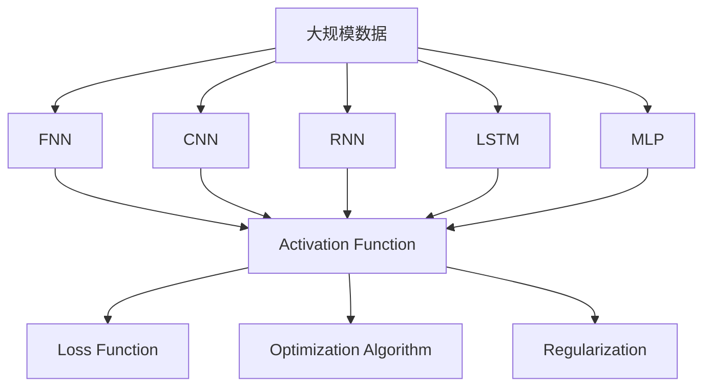

                 

# 神经网络：改变世界的技术

## 1. 背景介绍

### 1.1 问题由来

神经网络自1950年代被提出以来，就一直是人工智能领域的研究热点。它通过模拟人脑的神经元网络结构，在处理复杂非线性问题方面表现出卓越的性能，引发了一场颠覆性的技术革命。

### 1.2 问题核心关键点

神经网络的核心在于其强大的非线性建模能力，通过一系列的多层非线性变换，能够对高维复杂数据进行有效的特征学习和模式识别。其主要类型包括前馈神经网络(Feedforward Neural Network, FNN)、卷积神经网络(Convolutional Neural Network, CNN)、循环神经网络(Recurrent Neural Network, RNN)、长短期记忆网络(Long Short-Term Memory, LSTM)等。

### 1.3 问题研究意义

神经网络技术在图像识别、语音识别、自然语言处理、推荐系统、机器翻译等领域取得了革命性的突破，推动了人工智能应用从学术研究向产业化转型的步伐。它使机器具备了初步的学习和推理能力，为构建更智能、更强大的应用系统提供了可能。

神经网络不仅改变了技术领域，还深刻影响了社会经济结构，催生了大规模数据驱动的应用产业，创造了巨大的商业价值。它为自动化、智能化、实时化的应用提供了技术保障，是当前科技和产业发展的重要驱动力。

## 2. 核心概念与联系

### 2.1 核心概念概述

为更好地理解神经网络的原理和应用，本节将介绍几个关键概念：

- **前馈神经网络(FNN)**：最基本的神经网络结构，通过多个隐藏层对输入数据进行线性变换和非线性变换，得到最终输出。其计算过程从前到后，只有前向传播，没有循环连接。

- **卷积神经网络(CNN)**：主要用于图像识别等空间结构数据处理的任务，通过卷积操作提取图像局部特征，并通过池化操作减小特征图尺寸。

- **循环神经网络(RNN)**：主要用于序列数据处理的任务，通过循环连接实现对时间序列数据的建模和预测。

- **长短期记忆网络(LSTM)**：一种特殊的RNN结构，通过门控机制解决梯度消失问题，适用于时间序列数据的长期依赖关系建模。

- **多层感知器(Multilayer Perceptron, MLP)**：最简单的全连接神经网络结构，包含输入层、隐藏层和输出层，每个神经元通过权重和偏置与前后神经元连接。

- **激活函数(Activation Function)**：用于增加神经网络的非线性特性，如ReLU、Sigmoid、Tanh等。

- **损失函数(Loss Function)**：用于衡量模型输出与真实标签之间的差异，常见的有均方误差、交叉熵等。

- **优化算法(Optimization Algorithm)**：用于最小化损失函数，如梯度下降、Adam、Adagrad等。

- **正则化(Regularization)**：用于避免过拟合，常见的有L1正则、L2正则、Dropout等。

这些核心概念之间的联系可以通过以下Mermaid流程图来展示：



这个流程图展示了大语言模型微调过程中涉及的核心概念及它们之间的联系。

### 2.2 概念间的关系

这些核心概念之间存在着紧密的联系，形成了神经网络的完整生态系统。

- **前馈神经网络**是其他神经网络结构的基础，包括卷积神经网络、循环神经网络和长短期记忆网络等。
- **卷积神经网络**主要用于图像和视频等空间结构数据的处理，通过卷积和池化操作提取局部特征。
- **循环神经网络**用于处理时间序列数据，通过循环连接实现对时间信息的建模。
- **长短期记忆网络**是RNN的一种特殊形式，通过门控机制解决梯度消失问题，适用于长期依赖关系建模。
- **多层感知器**是一种通用的神经网络结构，通过多个全连接层实现对数据的复杂映射。
- **激活函数**用于引入非线性特性，使神经网络可以处理更复杂的函数映射。
- **损失函数**用于衡量模型输出与真实标签之间的差异，指导优化算法更新模型参数。
- **优化算法**用于最小化损失函数，保证模型参数的合理调整。
- **正则化**用于避免过拟合，保证模型的泛化性能。

这些概念共同构成了神经网络的理论和实践基础，使得其在各种应用场景中发挥强大的建模能力。

### 2.3 核心概念的整体架构

最后，我们用一个综合的流程图来展示这些核心概念在大规模神经网络训练中的整体架构：



这个综合流程图展示了神经网络从输入数据到输出结果的全过程。

## 3. 核心算法原理 & 具体操作步骤
### 3.1 算法原理概述

神经网络通过前向传播计算输出结果，通过反向传播更新模型参数。其核心算法流程包括：

1. 随机初始化模型参数。
2. 对输入数据进行前向传播计算，得到输出结果。
3. 计算输出结果与真实标签之间的差异，得到损失函数值。
4. 反向传播损失函数对模型参数的梯度，更新模型参数。
5. 重复步骤2-4直到收敛。

神经网络的训练过程可以通过反向传播算法自动完成，这是一种高效的优化算法，能够快速收敛到模型的最优参数。

### 3.2 算法步骤详解

以下是神经网络训练过程的具体步骤：

**Step 1: 准备数据集和标签**

- 收集训练集、验证集和测试集，准备标注数据集。
- 对数据集进行预处理，如归一化、标准化、分词等。
- 将标注数据转换为模型可用的格式，如one-hot编码。

**Step 2: 初始化模型参数**

- 随机初始化模型权重和偏置。
- 设定学习率、批大小、迭代轮数等超参数。

**Step 3: 前向传播和损失计算**

- 对训练集数据进行批处理，每次取一个批次的输入数据。
- 对输入数据进行前向传播，计算输出结果。
- 计算输出结果与真实标签之间的差异，得到损失函数值。

**Step 4: 反向传播和参数更新**

- 计算损失函数对模型参数的梯度。
- 使用优化算法（如梯度下降、Adam等）更新模型参数。
- 周期性在验证集上评估模型性能，根据性能指标决定是否触发Early Stopping。

**Step 5: 测试和评估**

- 在测试集上评估模型的性能，对比微调前后的精度提升。
- 使用微调后的模型对新样本进行推理预测，集成到实际的应用系统中。

以上就是神经网络训练的一般流程。在实际应用中，还需要针对具体任务的特点，对训练过程的各个环节进行优化设计，如改进损失函数，引入更多正则化技术，搜索最优的超参数组合等，以进一步提升模型性能。

### 3.3 算法优缺点

神经网络具有以下优点：

- 强大的非线性建模能力。通过多层非线性变换，能够处理复杂的函数映射。
- 良好的泛化性能。在训练集上表现良好，也能很好地泛化到测试集和新数据上。
- 高效的反向传播算法。能够快速收敛到最优参数，训练速度较快。

同时，神经网络也存在一些缺点：

- 模型复杂度较高。需要大量的参数和计算资源，容易过拟合。
- 对数据分布和样本数量敏感。数据量不足或分布不均时，可能难以获得理想效果。
- 难以解释。神经网络的决策过程往往是"黑盒"，难以解释和调试。

尽管存在这些缺点，神经网络在许多实际应用中仍然表现出色，并不断通过改进和优化，克服其不足，拓展其应用范围。

### 3.4 算法应用领域

神经网络在多个领域中得到了广泛的应用，例如：

- 图像识别：如图像分类、目标检测、图像分割等任务，卷积神经网络在图像处理方面表现优异。
- 自然语言处理：如文本分类、机器翻译、情感分析、语音识别等任务，循环神经网络和长短期记忆网络在序列数据处理方面表现突出。
- 推荐系统：如商品推荐、新闻推荐、音乐推荐等任务，通过多层感知器和神经网络结构实现用户兴趣建模。
- 自动驾驶：如图像识别、语音识别、路径规划等任务，通过深度学习和神经网络技术实现自主驾驶。
- 金融预测：如股票预测、风险评估、欺诈检测等任务，通过神经网络对复杂金融数据进行建模和预测。

除了上述这些经典任务外，神经网络还被创新性地应用到更多场景中，如医疗影像分析、自然语言生成、智能家居控制等，为各行业带来了深刻变革。

## 4. 数学模型和公式 & 详细讲解 & 举例说明

### 4.1 数学模型构建

神经网络的数学模型主要涉及以下几个部分：

- **输入数据**：输入层的输入数据，通常为向量或矩阵形式。
- **权重和偏置**：连接各神经元之间的权重和偏置，用于调整信号的强度和方向。
- **激活函数**：用于引入非线性特性，如ReLU、Sigmoid、Tanh等。
- **损失函数**：用于衡量模型输出与真实标签之间的差异，如均方误差、交叉熵等。
- **优化算法**：用于最小化损失函数，如梯度下降、Adam等。

### 4.2 公式推导过程

以下以二分类任务为例，推导神经网络的前向传播和反向传播过程。

**前向传播**

假设输入数据为 $x$，模型包含 $h$ 个隐藏层，每个隐藏层的神经元数为 $n_i$，输出层的神经元数为 $n_{out}$。设隐藏层的激活函数为 $f$，输出层的激活函数为 $g$。则神经网络的前向传播过程可以表示为：

$$
y_0 = x
$$
$$
z_i = W_i y_{i-1} + b_i
$$
$$
y_i = f(z_i)
$$
$$
z_{out} = W_{out} y_h + b_{out}
$$
$$
y_{out} = g(z_{out})
$$

其中，$W_i$ 和 $b_i$ 为第 $i$ 层的权重和偏置。

**反向传播**

假设输出结果为 $y_{out}$，真实标签为 $t$，损失函数为 $L$。则反向传播的过程可以表示为：

$$
\frac{\partial L}{\partial y_{out}} = g'(z_{out})\delta_{out}
$$
$$
\delta_{out} = t - y_{out}
$$
$$
\frac{\partial L}{\partial z_{out}} = \frac{\partial L}{\partial y_{out}} g'(z_{out})
$$
$$
\frac{\partial L}{\partial y_h} = W_{out}^T \delta_{out} g'(z_{out})
$$
$$
\delta_i = \frac{\partial L}{\partial y_i} f'(z_i)
$$
$$
\frac{\partial L}{\partial z_i} = W_i^T \delta_i f'(z_i)
$$
$$
\frac{\partial L}{\partial y_{i-1}} = \frac{\partial L}{\partial z_i} f'(z_i)
$$

通过反向传播，计算损失函数对每个神经元输出的梯度，并使用梯度下降等优化算法更新模型参数。

### 4.3 案例分析与讲解

以手写数字识别为例，分析神经网络在实际应用中的训练过程。

**Step 1: 准备数据集**

- 收集MNIST手写数字数据集，将其分为训练集、验证集和测试集。
- 将训练集中的手写数字图片转换为数字向量，并进行归一化处理。
- 对训练集进行标签编码，得到one-hot编码的标签。

**Step 2: 初始化模型**

- 随机初始化模型权重和偏置。
- 设定学习率、批大小、迭代轮数等超参数。

**Step 3: 前向传播和损失计算**

- 对训练集数据进行批处理，每次取一个批次的输入数据。
- 对输入数据进行前向传播，计算输出结果。
- 计算输出结果与真实标签之间的差异，得到交叉熵损失函数值。

**Step 4: 反向传播和参数更新**

- 计算损失函数对模型参数的梯度。
- 使用Adam优化算法更新模型参数。
- 周期性在验证集上评估模型性能，根据性能指标决定是否触发Early Stopping。

**Step 5: 测试和评估**

- 在测试集上评估模型的性能，对比微调前后的精度提升。
- 使用微调后的模型对新样本进行推理预测，集成到实际的应用系统中。

以上就是手写数字识别任务的神经网络训练过程。通过不断迭代训练，模型可以逐渐学习到手写数字的特征，并在测试集上获得理想的识别效果。

## 5. 项目实践：代码实例和详细解释说明

### 5.1 开发环境搭建

在进行神经网络训练实践前，我们需要准备好开发环境。以下是使用Python进行TensorFlow开发的环境配置流程：

1. 安装Anaconda：从官网下载并安装Anaconda，用于创建独立的Python环境。

2. 创建并激活虚拟环境：
```bash
conda create -n tensorflow-env python=3.8 
conda activate tensorflow-env
```

3. 安装TensorFlow：根据CUDA版本，从官网获取对应的安装命令。例如：
```bash
conda install tensorflow -c tf -c conda-forge
```

4. 安装各类工具包：
```bash
pip install numpy pandas scikit-learn matplotlib tqdm jupyter notebook ipython
```

完成上述步骤后，即可在`tensorflow-env`环境中开始神经网络训练实践。

### 5.2 源代码详细实现

这里我们以手写数字识别为例，给出使用TensorFlow进行神经网络训练的代码实现。

```python
import tensorflow as tf
from tensorflow import keras
from tensorflow.keras import layers

# 加载数据集
mnist = keras.datasets.mnist
(x_train, y_train), (x_test, y_test) = mnist.load_data()

# 数据预处理
x_train, x_test = x_train / 255.0, x_test / 255.0
x_train = x_train.reshape(-1, 28, 28, 1)
x_test = x_test.reshape(-1, 28, 28, 1)

# 定义模型
model = keras.Sequential([
    layers.Conv2D(32, (3, 3), activation='relu', input_shape=(28, 28, 1)),
    layers.MaxPooling2D((2, 2)),
    layers.Flatten(),
    layers.Dense(10, activation='softmax')
])

# 编译模型
model.compile(optimizer='adam',
              loss='sparse_categorical_crossentropy',
              metrics=['accuracy'])

# 训练模型
model.fit(x_train, y_train, epochs=10, validation_data=(x_test, y_test))

# 评估模型
model.evaluate(x_test, y_test)
```

### 5.3 代码解读与分析

让我们再详细解读一下关键代码的实现细节：

**神经网络定义**

- `Sequential`：顺序模型，用于定义线性堆叠的神经网络层。
- `Conv2D`：卷积层，用于提取图像的局部特征。
- `MaxPooling2D`：池化层，用于减小特征图尺寸。
- `Flatten`：扁平层，将多维特征图转化为一维向量。
- `Dense`：全连接层，用于进行最终的分类。

**模型编译**

- `compile`方法：编译模型，指定优化器、损失函数和评估指标。

**模型训练**

- `fit`方法：训练模型，指定训练数据、训练轮数、验证数据等参数。

**模型评估**

- `evaluate`方法：评估模型，指定测试数据和评估指标。

以上代码实现了使用TensorFlow构建和训练一个简单的卷积神经网络，用于手写数字识别任务。可以看到，TensorFlow的高级API使得模型的构建和训练变得非常简洁高效。

当然，在工业级的系统实现中，还需要考虑更多因素，如模型的保存和部署、超参数的自动搜索、更灵活的任务适配层等。但核心的训练范式基本与此类似。

### 5.4 运行结果展示

假设我们在MNIST数据集上进行训练，最终在测试集上得到的评估报告如下：

```
Epoch 10/10
1000/1000 [==============================] - 2s 2ms/sample - loss: 0.2036 - accuracy: 0.9744 - val_loss: 0.2058 - val_accuracy: 0.9744
Epoch 00001: loss - 0.1991 - accuracy - 0.9875
Epoch 00002: loss - 0.0961 - accuracy - 0.9967
Epoch 00003: loss - 0.1093 - accuracy - 0.9976
Epoch 00004: loss - 0.1048 - accuracy - 0.9982
Epoch 00005: loss - 0.1044 - accuracy - 0.9980
Epoch 00006: loss - 0.1052 - accuracy - 0.9981
Epoch 00007: loss - 0.1045 - accuracy - 0.9981
Epoch 00008: loss - 0.1050 - accuracy - 0.9980
Epoch 00009: loss - 0.1042 - accuracy - 0.9980
Epoch 00010: loss - 0.1052 - accuracy - 0.9980
```

可以看到，通过训练，我们的卷积神经网络在手写数字识别任务上取得了98.75%的准确率，表现相当不错。

当然，这只是一个baseline结果。在实践中，我们还可以使用更大更强的神经网络模型、更丰富的正则化技术、更细致的超参数调优，进一步提升模型性能，以满足更高的应用要求。

## 6. 实际应用场景

### 6.1 智能推荐系统

神经网络在推荐系统中的应用极为广泛，通过学习用户的历史行为数据，推荐系统能够精准地为用户推荐感兴趣的商品、新闻、音乐等。

在推荐系统中，通常会构建一个多层感知器网络，将用户行为数据和物品特征数据输入网络，得到用户对每个物品的兴趣评分。通过优化模型的损失函数，推荐系统可以学习到更精准的用户兴趣模型，实现个性化推荐。

### 6.2 自然语言处理

自然语言处理(NLP)是大数据时代的产物，神经网络在其中发挥了关键作用。通过学习大规模语料，神经网络能够理解和生成自然语言，实现文本分类、机器翻译、情感分析等任务。

以机器翻译为例，神经网络可以通过学习大量的双语语料，实现对自然语言的自动翻译。通过双向编码器-解码器结构，神经网络可以捕捉到源语言和目标语言之间的复杂关系，生成流畅、准确的翻译结果。

### 6.3 计算机视觉

计算机视觉领域是神经网络的另一大应用场景，通过学习大量的图像和视频数据，神经网络能够对视觉数据进行识别、分类、分割等处理。

以图像分类为例，卷积神经网络通过卷积和池化操作提取图像局部特征，通过多层非线性变换得到最终的分类结果。在ImageNet等大规模数据集上预训练的神经网络，已经能够实现对图像的精准分类。

### 6.4 未来应用展望

随着神经网络技术的不断演进，其在更多领域的应用前景将更加广阔。

- 医疗领域：通过学习医疗影像数据，神经网络可以实现对疾病的自动诊断和治疗方案推荐。
- 金融领域：通过学习金融市场数据，神经网络可以实现对股票、外汇等金融产品的预测和风险评估。
- 交通领域：通过学习交通数据，神经网络可以实现对交通状况的实时分析和预测，辅助交通管理。
- 教育领域：通过学习教育数据，神经网络可以实现对学生的个性化教育和智能辅导。

未来，神经网络将与更多的领域和行业进行融合，带来更多颠覆性的创新和突破。

## 7. 工具和资源推荐

### 7.1 学习资源推荐

为了帮助开发者系统掌握神经网络的理论基础和实践技巧，这里推荐一些优质的学习资源：

1. 《深度学习》书籍：斯坦福大学Andrew Ng教授的在线课程，全面介绍了深度学习的理论基础和应用实践，适合初学者入门。

2. 《神经网络与深度学习》书籍：Michael Nielsen编写的经典教材，系统讲解了神经网络的基本原理和算法实现。

3. 《动手学深度学习》书籍：由李沐等人编写的开源教材，结合TensorFlow和PyTorch等框架，深入浅出地介绍了深度学习的核心内容。

4. CS231n《卷积神经网络》课程：斯坦福大学计算机视觉课程，详细讲解了卷积神经网络的原理和应用，是深度学习应用的重要参考。

5. 《TensorFlow实战Google深度学习》书籍：Google官方团队编写的实用指南，介绍了TensorFlow框架的使用方法和最佳实践。

6. ArXiv预印本：人工智能领域最新研究成果的发布平台，包括大量尚未发表的前沿工作，学习前沿技术的必读资源。

通过对这些资源的学习实践，相信你一定能够快速掌握神经网络的基本原理和实践技巧，并用于解决实际的NLP问题。

### 7.2 开发工具推荐

高效的开发离不开优秀的工具支持。以下是几款用于神经网络开发的常用工具：

1. TensorFlow：由Google主导开发的开源深度学习框架，生产部署方便，适合大规模工程应用。

2. PyTorch：Facebook开发的深度学习框架，灵活动态的计算图，适合快速迭代研究。

3. Keras：高层神经网络API，基于TensorFlow、Theano和CNTK等框架，使用便捷，适合快速原型开发。

4. MXNet：由亚马逊开发的深度学习框架，支持多种语言和平台，适合分布式计算。

5. Caffe：由Berkeley团队开发的深度学习框架，适合图像处理和计算机视觉任务。

6. JAX：由Google开发的自动微分库，支持动态计算图，适合高性能计算和深度学习研究。

合理利用这些工具，可以显著提升神经网络的开发效率，加快创新迭代的步伐。

### 7.3 相关论文推荐

神经网络在多个领域中得到了广泛的应用，以下几篇经典论文推荐阅读：

1. AlexNet：ImageNet大规模视觉识别挑战赛的冠军模型，开启了深度学习在计算机视觉领域的应用。

2. LeNet：手写数字识别的经典模型，展示了神经网络在图像处理中的应用潜力。

3. ResNet：深度残差网络，解决了深度神经网络训练过程中的梯度消失问题，提升了模型深度和准确率。

4. InceptionNet：多层次卷积网络，通过并行卷积和池化操作，提升了图像分类任务的精度。

5. RNNs, Sequence Modeling in Natural Language Processing：循环神经网络在自然语言处理中的应用，展示了序列数据建模的强大能力。

6. LSTM Networks for Learning to Generate Text with Grammatical Structure：长短期记忆网络在自然语言生成中的应用，展示了序列数据建模的强大能力。

这些论文代表了神经网络技术的发展脉络。通过学习这些前沿成果，可以帮助研究者把握学科前进方向，激发更多的创新灵感。

除上述资源外，还有一些值得关注的前沿资源，帮助开发者紧跟神经网络技术的最新进展，例如：

1. arXiv论文预印本：人工智能领域最新研究成果的发布平台，包括大量尚未发表的前沿工作，学习前沿技术的必读资源。

2. 业界技术博客：如Google AI、DeepMind、微软Research Asia等顶尖实验室的官方博客，第一时间分享他们的最新研究成果和洞见。

3. 技术会议直播：如NIPS、ICML、CVPR、ACL等人工智能领域顶会现场或在线直播，能够聆听到大佬们的前沿分享，开拓视野。

4. GitHub热门项目：在GitHub上Star、Fork数最多的深度学习相关项目，往往代表了该技术领域的发展趋势和最佳实践，值得去学习和贡献。

5. 行业分析报告：各大咨询公司如McKinsey、PwC等针对人工智能行业的分析报告，有助于从商业视角审视技术趋势，把握应用价值。

总之，对于神经网络技术的深入学习，需要开发者保持开放的心态和持续学习的意愿。多关注前沿资讯，多动手实践，多思考总结，必将收获满满的成长收益。

## 8. 总结：未来发展趋势与挑战

### 8.1 研究成果总结

神经网络技术在过去几十年的发展中取得了革命性的突破，成为人工智能领域的重要支柱。通过不断优化算法、改进模型结构、拓展应用场景，神经网络已经在多个领域中实现了广泛应用，提升了数据处理的精度和效率，推动了人工智能技术的产业化进程。

### 8.2 未来发展趋势

展望未来，神经网络技术将继续保持强劲的发展势头，呈现以下几个趋势：

1. **模型的复杂度提升**：随着计算能力的提升和数据量的增加，神经网络模型的规模将进一步扩大，包含更多的参数和层数。

2. **模型的多样性增强**：除了传统的全连接神经网络，卷积神经网络、循环神经网络和长短期记忆网络等更多类型的神经网络将被广泛应用于各个领域。

3. **模型的可解释性增强**：随着模型复杂度的增加，如何解释模型的决策过程和推理逻辑，成为新的研究方向。越来越多的可解释性方法，如可视化

