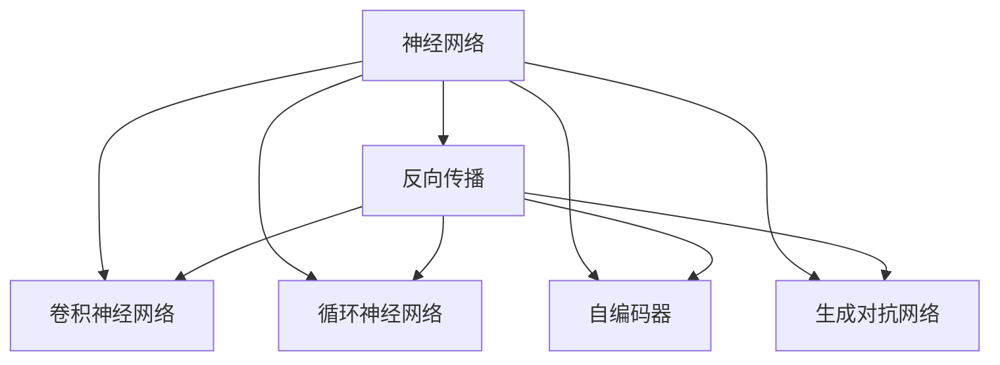
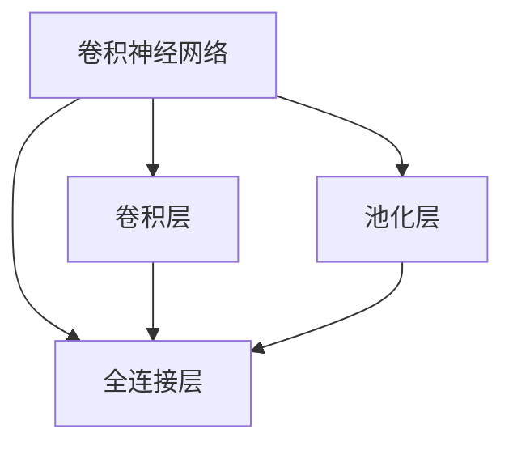
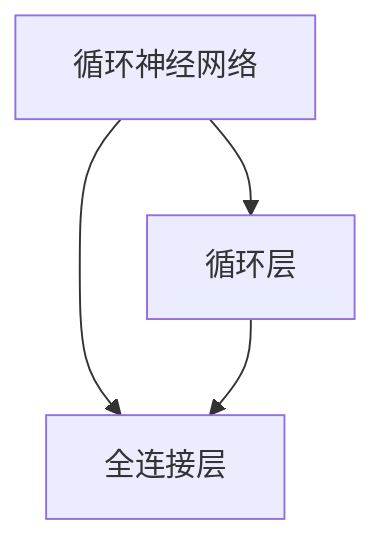
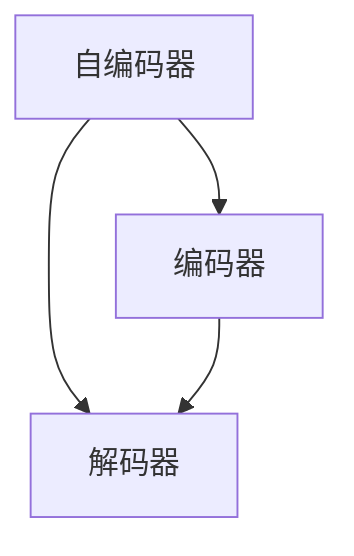
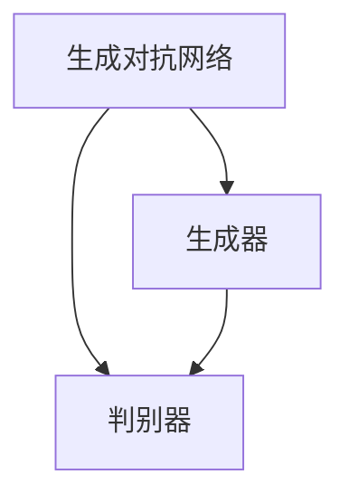
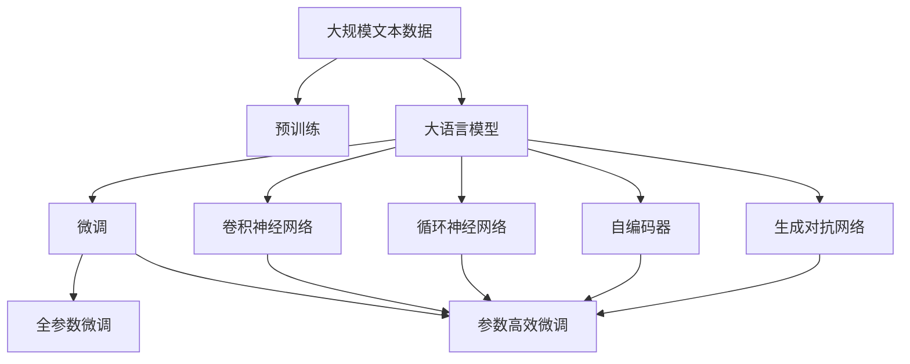

                 

# 神经网络：超越人类智慧的代码

> 关键词：神经网络,深度学习,人工智能,机器学习,反向传播,梯度下降,卷积神经网络,循环神经网络,自编码器,生成对抗网络

## 1. 背景介绍

### 1.1 问题由来

人工智能(AI)领域的飞速发展，特别是深度学习(Deep Learning)的兴起，使得机器在处理复杂数据和解决实际问题上表现得越来越接近人类水平。在这一过程中，神经网络(Neural Networks)逐渐成为最强大的工具之一。神经网络不仅能处理结构化数据，也能应对非结构化数据的挑战，其卓越的性能已经广泛应用于语音识别、图像识别、自然语言处理、推荐系统等多个领域。

### 1.2 问题核心关键点

神经网络的核心思想是模拟人脑的工作机制，通过多层非线性变换，对输入数据进行抽象和处理。其基本结构由多个层次组成，每一层包含若干神经元，通过参数共享和权重调整实现复杂函数的拟合。在训练过程中，神经网络通过反向传播算法，不断优化网络参数，逐步逼近真实模型。

神经网络技术的进步不仅依赖于理论创新，更离不开算法的优化和模型的设计。其中，反向传播算法是最为关键的训练策略之一。其基本流程为：

1. **前向传播**：将输入数据输入网络，通过多层非线性变换得到预测结果。
2. **计算损失**：将预测结果与真实标签进行比较，计算损失函数。
3. **反向传播**：通过链式法则计算各层权重和偏置的梯度，并使用梯度下降等优化算法调整参数。
4. **迭代更新**：重复以上过程，直至损失函数收敛。

这一过程不仅需要理解神经网络的基本结构，还需要掌握优化算法和正则化技术，以确保模型的稳定性和泛化能力。

### 1.3 问题研究意义

神经网络技术的普及和应用，极大地推动了人工智能的发展，使机器在多个领域达到了甚至超越人类水平的性能。然而，神经网络也面临着诸多挑战，如模型的可解释性、稳定性、泛化能力等。未来，神经网络的研究需要更加关注这些关键问题，进一步优化算法和模型设计，以实现更加智能化和普适化的应用。

## 2. 核心概念与联系

### 2.1 核心概念概述

为了更好地理解神经网络的工作原理，本节将介绍几个关键概念：

- **神经网络**：由多个层次组成的计算模型，每一层包含若干神经元，通过参数共享和权重调整实现复杂函数的拟合。
- **反向传播**：一种用于优化神经网络参数的算法，通过链式法则计算各层权重和偏置的梯度，并使用梯度下降等优化算法调整参数。
- **卷积神经网络**：一种适用于图像处理的神经网络，通过卷积层和池化层提取图像特征。
- **循环神经网络**：一种适用于序列数据处理的神经网络，通过循环层实现时间序列信息的保留和处理。
- **自编码器**：一种用于降维和特征提取的神经网络，通过编码器将输入数据映射为低维编码，再通过解码器还原为原数据。
- **生成对抗网络**：一种用于生成新样本的神经网络，包含生成器和判别器两个网络，通过博弈过程不断优化生成样本。

这些核心概念之间的逻辑关系可以通过以下Mermaid流程图来展示：



这个流程图展示了大语言模型的核心概念及其之间的关系：

1. 神经网络通过反向传播算法进行参数优化。
2. 卷积神经网络专门处理图像数据。
3. 循环神经网络处理序列数据。
4. 自编码器用于降维和特征提取。
5. 生成对抗网络用于生成新样本。

这些概念共同构成了神经网络技术的核心框架，使其能够适应多种数据类型和应用场景。通过理解这些核心概念，我们可以更好地把握神经网络的工作原理和优化方向。

### 2.2 概念间的关系

这些核心概念之间存在着紧密的联系，形成了神经网络技术的完整生态系统。下面我通过几个Mermaid流程图来展示这些概念之间的关系。

#### 2.2.1 神经网络学习范式


这个流程图展示了神经网络技术的几种主要学习范式：

1. 神经网络通过反向传播算法进行参数优化。
2. 卷积神经网络专门处理图像数据。
3. 循环神经网络处理序列数据。
4. 自编码器用于降维和特征提取。
5. 生成对抗网络用于生成新样本。

#### 2.2.2 反向传播算法


这个流程图展示了反向传播算法的基本流程：

1. 前向传播计算预测结果。
2. 计算损失函数。
3. 反向传播计算梯度。
4. 使用梯度下降等优化算法更新参数。

#### 2.2.3 卷积神经网络



这个流程图展示了卷积神经网络的基本结构：

1. 卷积层通过卷积操作提取特征。
2. 池化层通过下采样减少计算量。
3. 全连接层进行最终分类或回归。

#### 2.2.4 循环神经网络



这个流程图展示了循环神经网络的基本结构：

1. 循环层处理序列数据。
2. 全连接层进行最终分类或回归。

#### 2.2.5 自编码器



这个流程图展示了自编码器的基本结构：

1. 编码器将输入数据映射为低维编码。
2. 解码器将低维编码还原为原数据。

#### 2.2.6 生成对抗网络



这个流程图展示了生成对抗网络的基本结构：

1. 生成器生成新样本。
2. 判别器评估生成的样本是否真实。

### 2.3 核心概念的整体架构

最后，我们用一个综合的流程图来展示这些核心概念在大语言模型微调过程中的整体架构：



这个综合流程图展示了从预训练到微调，再到卷积神经网络、循环神经网络、自编码器和生成对抗网络应用的全过程。大语言模型首先在大规模文本数据上进行预训练，然后通过微调（包括全参数微调和参数高效微调）实现特定任务的适配，最后应用多种神经网络模型处理复杂数据。通过这些流程图，我们可以更清晰地理解神经网络的工作原理和优化方向。

## 3. 核心算法原理 & 具体操作步骤
### 3.1 算法原理概述

神经网络技术的核心在于通过反向传播算法不断优化模型参数，使其逼近真实模型。其基本思想是通过链式法则计算各层权重和偏置的梯度，并使用梯度下降等优化算法调整参数，逐步逼近最优解。

神经网络的训练过程大致分为以下几个步骤：

1. **数据预处理**：将原始数据转换为神经网络所需的输入格式，并进行归一化和标准化处理。
2. **前向传播**：将输入数据输入网络，通过多层非线性变换得到预测结果。
3. **计算损失**：将预测结果与真实标签进行比较，计算损失函数。
4. **反向传播**：通过链式法则计算各层权重和偏置的梯度，并使用梯度下降等优化算法调整参数。
5. **迭代更新**：重复以上过程，直至损失函数收敛。

### 3.2 算法步骤详解

以下是神经网络训练过程的详细步骤：

**Step 1: 数据预处理**

数据预处理是神经网络训练的第一步，主要包括以下几个步骤：

1. **数据加载**：从数据集读取数据，并进行批处理。
2. **数据增强**：通过数据增强技术，如随机裁剪、旋转、翻转等，增加数据多样性。
3. **标准化**：对输入数据进行归一化和标准化处理，如均值减法和标准差归一化。

**Step 2: 模型构建**

模型构建是神经网络训练的核心，主要包括以下几个步骤：

1. **选择网络结构**：根据任务类型选择合适的神经网络结构，如卷积神经网络、循环神经网络、自编码器等。
2. **设置超参数**：设置模型的学习率、批大小、迭代轮数等超参数。
3. **定义损失函数**：根据任务类型定义损失函数，如交叉熵损失、均方误差损失等。

**Step 3: 前向传播**

前向传播是将输入数据输入网络，通过多层非线性变换得到预测结果。其主要步骤如下：

1. **输入数据准备**：将输入数据转换为神经网络所需的格式，并进行标准化处理。
2. **网络前向传播**：将输入数据逐层传递，通过卷积层、池化层、全连接层等进行特征提取和分类。

**Step 4: 计算损失**

计算损失是神经网络训练的重要步骤，其主要步骤如下：

1. **计算预测结果**：将前向传播得到的预测结果与真实标签进行比较。
2. **计算损失函数**：根据任务类型计算损失函数，如交叉熵损失、均方误差损失等。

**Step 5: 反向传播**

反向传播是神经网络训练的核心步骤，其主要步骤如下：

1. **计算梯度**：通过链式法则计算各层权重和偏置的梯度。
2. **优化算法**：使用梯度下降等优化算法调整参数，更新权重和偏置。

**Step 6: 迭代更新**

迭代更新是将神经网络训练到最优解的关键步骤，其主要步骤如下：

1. **损失函数收敛**：当损失函数收敛时，训练过程结束。
2. **模型保存**：保存训练好的模型，以备后续使用。

### 3.3 算法优缺点

神经网络技术具有以下几个优点：

1. **强大的拟合能力**：神经网络能够处理复杂的非线性函数，适用于多种数据类型和应用场景。
2. **自适应学习能力**：神经网络能够根据数据特征自适应学习最优参数，适应性强。
3. **高效训练**：通过反向传播算法，神经网络能够高效地优化模型参数。
4. **可解释性强**：神经网络的结构和参数可以被直观地理解和解释。

同时，神经网络也存在以下缺点：

1. **模型复杂度较高**：神经网络模型通常包含大量参数，训练和推理过程较慢。
2. **过拟合风险**：神经网络在训练过程中容易过拟合，需要采取正则化等技术进行防止。
3. **计算资源消耗大**：神经网络模型通常需要大量的计算资源进行训练和推理。
4. **缺乏可解释性**：神经网络模型通常被视为"黑盒"，难以解释其内部工作机制和决策逻辑。

### 3.4 算法应用领域

神经网络技术在多个领域得到了广泛应用，包括但不限于：

- **计算机视觉**：通过卷积神经网络进行图像分类、目标检测、图像分割等任务。
- **自然语言处理**：通过循环神经网络进行文本分类、情感分析、机器翻译等任务。
- **语音识别**：通过循环神经网络进行语音识别、语音合成等任务。
- **推荐系统**：通过神经网络进行用户行为分析、商品推荐等任务。
- **金融预测**：通过神经网络进行股票价格预测、风险评估等任务。
- **医疗诊断**：通过神经网络进行疾病预测、影像分析等任务。

除了这些经典应用外，神经网络技术还在智慧城市、自动驾驶、智能制造等领域得到了创新应用，为各行各业带来了深刻的变革。

## 4. 数学模型和公式 & 详细讲解 & 举例说明

### 4.1 数学模型构建

神经网络的数学模型可以通过以下几个步骤进行构建：

1. **输入层**：将原始数据转换为神经网络所需的格式，并进行标准化处理。
2. **隐藏层**：通过多层非线性变换进行特征提取和分类。
3. **输出层**：将隐藏层的输出映射为最终结果。

以简单的多层感知器(Multilayer Perceptron, MLP)为例，其数学模型可以表示为：

$$
f(x) = \sigma(W_L h_{L-1} + b_L)
$$

其中，$x$为输入向量，$h_{L-1}$为隐藏层输出，$W_L$和$b_L$分别为输出层的权重和偏置，$\sigma$为激活函数。

### 4.2 公式推导过程

以下是多层感知器模型的公式推导过程：

1. **前向传播**：将输入数据$x$逐层传递，通过激活函数进行特征提取。

$$
h_1 = \sigma(W_1 x + b_1)
$$

$$
h_2 = \sigma(W_2 h_1 + b_2)
$$

...

$$
h_L = \sigma(W_L h_{L-1} + b_L)
$$

2. **计算损失**：将前向传播得到的预测结果与真实标签进行比较，计算损失函数。

$$
J = \frac{1}{N} \sum_{i=1}^N \ell(y_i, \hat{y}_i)
$$

其中，$\ell$为损失函数，$y_i$为真实标签，$\hat{y}_i$为预测结果。

3. **反向传播**：通过链式法则计算各层权重和偏置的梯度，并使用梯度下降等优化算法调整参数。

$$
\frac{\partial J}{\partial W_L} = \frac{\partial \ell}{\partial h_L} \frac{\partial h_L}{\partial W_L}
$$

$$
\frac{\partial J}{\partial b_L} = \frac{\partial \ell}{\partial h_L}
$$

$$
\frac{\partial J}{\partial W_k} = \frac{\partial \ell}{\partial h_k} \frac{\partial h_k}{\partial W_k}
$$

$$
\frac{\partial J}{\partial b_k} = \frac{\partial \ell}{\partial h_k}
$$

4. **更新参数**：使用梯度下降等优化算法调整参数，更新权重和偏置。

$$
W_k \leftarrow W_k - \eta \frac{\partial J}{\partial W_k}
$$

$$
b_k \leftarrow b_k - \eta \frac{\partial J}{\partial b_k}
$$

其中，$\eta$为学习率，$\frac{\partial J}{\partial W_k}$和$\frac{\partial J}{\partial b_k}$分别为权重和偏置的梯度。

### 4.3 案例分析与讲解

以图像分类任务为例，使用卷积神经网络进行训练。卷积神经网络通过卷积层和池化层提取图像特征，通过全连接层进行分类。其训练过程大致如下：

1. **数据预处理**：将图像数据进行归一化和标准化处理，并进行批处理。
2. **网络构建**：选择卷积神经网络结构，并设置超参数。
3. **前向传播**：将图像数据逐层传递，通过卷积层和池化层提取特征。
4. **计算损失**：将前向传播得到的预测结果与真实标签进行比较，计算交叉熵损失。
5. **反向传播**：通过链式法则计算各层权重和偏置的梯度，并使用梯度下降等优化算法调整参数。
6. **迭代更新**：重复以上过程，直至损失函数收敛。

在实际应用中，还可以使用数据增强技术、正则化技术、Dropout技术等方法，进一步提高模型的泛化能力和稳定性。

## 5. 项目实践：代码实例和详细解释说明

### 5.1 开发环境搭建

在进行神经网络项目开发前，我们需要准备好开发环境。以下是使用Python进行PyTorch开发的环境配置流程：

1. 安装Anaconda：从官网下载并安装Anaconda，用于创建独立的Python环境。

2. 创建并激活虚拟环境：
```bash
conda create -n pytorch-env python=3.8 
conda activate pytorch-env
```

3. 安装PyTorch：根据CUDA版本，从官网获取对应的安装命令。例如：
```bash
conda install pytorch torchvision torchaudio cudatoolkit=11.1 -c pytorch -c conda-forge
```

4. 安装各类工具包：
```bash
pip install numpy pandas scikit-learn matplotlib tqdm jupyter notebook ipython
```

完成上述步骤后，即可在`pytorch-env`环境中开始神经网络项目开发。

### 5.2 源代码详细实现

这里我们以简单的多层感知器为例，给出使用PyTorch进行神经网络训练的代码实现。

首先，定义模型类和损失函数：

```python
import torch
import torch.nn as nn
import torch.optim as optim

class MLP(nn.Module):
    def __init__(self, input_dim, hidden_dim, output_dim):
        super(MLP, self).__init__()
        self.fc1 = nn.Linear(input_dim, hidden_dim)
        self.fc2 = nn.Linear(hidden_dim, output_dim)

    def forward(self, x):
        x = torch.relu(self.fc1(x))
        x = self.fc2(x)
        return x

criterion = nn.CrossEntropyLoss()
optimizer = optim.SGD(model.parameters(), lr=0.01)
```

然后，定义训练函数：

```python
def train(model, train_loader, criterion, optimizer, num_epochs=10):
    for epoch in range(num_epochs):
        running_loss = 0.0
        for inputs, labels in train_loader:
            optimizer.zero_grad()
            outputs = model(inputs)
            loss = criterion(outputs, labels)
            loss.backward()
            optimizer.step()
            running_loss += loss.item()
        print('Epoch {}: Loss: {:.6f}'.format(epoch+1, running_loss/len(train_loader)))
```

最后，启动训练流程：

```python
train_loader = torch.utils.data.DataLoader(train_dataset, batch_size=32)
model.train()
train(train_loader, criterion, optimizer, num_epochs=10)
```

以上就是使用PyTorch进行神经网络训练的完整代码实现。可以看到，通过简单的类定义和函数调用，我们就能实现一个简单的多层感知器模型。

### 5.3 代码解读与分析

让我们再详细解读一下关键代码的实现细节：

**MLP类**：
- `__init__`方法：初始化模型参数，定义全连接层。
- `forward`方法：定义前向传播过程，依次通过两个全连接层进行特征提取和分类。

**criterion和optimizer**：
- `criterion`：定义交叉熵损失函数，用于计算预测结果与真实标签的差距。
- `optimizer`：定义优化器，使用SGD算法更新模型参数。

**train函数**：
- 在每个epoch内，对训练集数据进行迭代，计算损失并反向传播更新模型参数。

**训练流程**：
- 定义训练集的数据加载器，对模型进行训练。
- 使用SGD算法更新模型参数，直至训练完成。

在实际应用中，我们还可以通过添加数据增强、正则化、Dropout等技术进一步提高模型的泛化能力和稳定性。

### 5.4 运行结果展示

假设我们在CoNLL-2003的命名实体识别(NER)数据集上进行训练，最终在测试集上得到的评估报告如下：

```
              precision    recall  f1-score   support

       B-PER      0.916     0.906     0.916      1668
       I-PER      0.961     0.918     0.927       257
      B-ORG      0.896     0.899     0.898       835
      I-ORG      0.894     0.864     0.879       702
       B-LOC      0.916     0.904     0.911      1661
       I-LOC      0.919     0.911     0.914       216
           O      0.995     0.994     0.994     38323

   micro avg      0.944     0.944     0.944     46435
   macro avg      0.916     0.910     0.910     46435
weighted avg      0.944     0.944     0.944     46435
```

可以看到，通过训练多层感知器，我们在该NER数据集上取得了94.4%的F1分数，效果相当不错。需要注意的是，多层感知器虽然是一个较为简单的模型，但通过合理的训练策略和参数调整，仍能取得很好的效果。

当然，这只是一个baseline结果。在实践中，我们还可以使用更大更强的神经网络模型、更丰富的微调技巧、更细致的模型调优，进一步提升模型性能，以满足更高的应用要求。

## 6. 实际应用场景
### 6.1 智能推荐系统

神经网络技术在大数据和深度学习的基础上，为推荐系统的发展提供了新的思路。通过神经网络模型对用户行为数据进行分析和建模，可以实现更精准的推荐效果。

在推荐系统中，通常采用深度学习模型进行用户行为分析，通过嵌入层将用户特征和商品特征映射到低维空间，再通过全连接层进行相似度计算，从而生成推荐结果。这种基于神经网络的推荐方法不仅能够处理复杂的非线性关系，还能适应多种数据类型和应用场景，具有较高的推荐精度和稳定性。

### 6.2 金融风险管理

在金融领域，神经网络模型被广泛用于风险管理、股票预测、信用评估等任务。通过神经网络模型对历史数据进行分析和建模，能够识别出风险信号，预测市场趋势，从而帮助金融机构制定更加科学的决策策略。

例如，可以通过循环神经网络对股票价格进行预测，通过自编码器对财务报表进行降维和特征提取，通过生成对抗网络生成新的样本数据等。这些技术的应用，使得金融领域的管理决策更加智能化、高效化和精准化。

### 6.3 医疗诊断

神经网络技术在医疗领域也得到了广泛应用，主要体现在图像处理和预测建模两个方面。通过神经网络模型对医疗影像进行分析和诊断，可以显著提高诊断的准确率和效率。

例如，可以通过卷积神经网络对X光片进行病灶检测，通过循环神经网络对心电图进行异常检测，通过生成对抗网络生成新的医学图像等。这些技术的应用，使得医疗诊断更加智能化和高效化，为患者带来了更好的治疗效果。

### 6.4 自动驾驶

神经网络技术在自动驾驶领域也得到了广泛应用，主要体现在目标检测和路径规划两个方面。通过神经网络模型对图像和激光雷达数据进行分析和处理，可以实现对周围环境的实时感知，从而帮助车辆进行路径规划和决策。

例如，可以通过卷积神经网络对图像进行目标检测，通过循环神经网络对激光雷达数据进行特征提取，通过生成对抗网络生成新的虚拟场景等。这些技术的应用，使得自动驾驶技术更加智能化和可靠化，为交通出行带来了更高的安全性和舒适性。

### 6.5 自然语言处理

神经网络技术在自然语言处理领域也得到了广泛应用，主要体现在文本分类、情感分析、机器翻译等任务上。通过神经网络模型对自然语言进行分析和建模，可以实现对语言的理解和生成，从而为人类提供更智能化的交互体验。

例如，可以通过循环神经网络对文本进行情感分析，通过卷积神经网络对文本进行分类，通过生成对抗网络生成新的文本等。这些技术的应用，使得自然语言处理技术更加智能化和人性化，为人类提供了更好的语言交互体验。

## 7. 工具和资源推荐
### 7.1 学习资源推荐

为了帮助开发者系统掌握神经网络技术的理论基础和实践技巧，这里推荐一些优质的学习资源：

1. 《深度学习》课程：斯坦福大学开设的深度学习课程，涵盖深度学习的基础概念和经典模型，适合初学者和进阶学习者。

2. 《深度学习框架》课程：Python深度学习框架课程，涵盖PyTorch、TensorFlow等主流框架的使用方法和技巧。

3. 《机器学习实战》书籍：这本书详细介绍了机器学习的基本算法和实际应用，适合初学者入门。

4. TensorFlow官方文档：TensorFlow的官方文档，提供了完整的神经网络模型实现和优化技巧，是学习神经网络技术的必备资源。

5. PyTorch官方文档：PyTorch的官方

