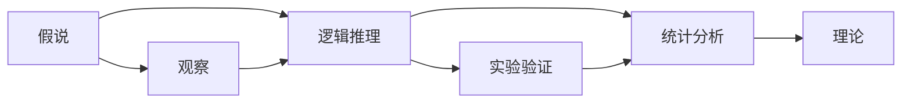
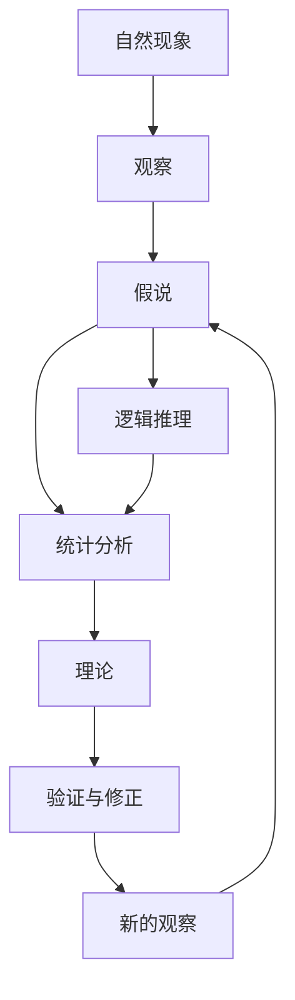

                 

# 科学发现：从假说到理论

> 关键词：科学发现,假说理论,科学研究,逻辑推理,统计学,数学模型

## 1. 背景介绍

### 1.1 问题由来
科学发现是推动人类文明进步的重要驱动力。在科学发展史中，从古代的炼金术到近代的电磁学，从生物学到物理学，无数伟大的科学成就都源自对自然现象的深入探索。然而，科学发现的过程远非一帆风顺。从质疑与证伪的科学方法论，到统计学和数学模型的应用，科学发现背后的逻辑链条始终贯穿其中。

本文将围绕科学发现的本质、核心概念、方法和应用进行系统阐述，力求揭示科学发现的深层次原理和实践技巧。希望读者通过深入理解科学发现的流程，能够更好地应用科学方法论解决实际问题，推动自身科研能力的提升。

### 1.2 问题核心关键点
科学发现的核心在于对自然现象的观察和推理。基于此，本文将聚焦于：
- 科学发现的本质是什么？
- 如何从假说到理论？
- 科学发现的逻辑推理和数学模型有何作用？
- 科学发现的现代工具和技术有哪些？
- 科学发现的应用场景和挑战是什么？

通过系统回答这些问题，我们将为读者提供一个全面的科学发现理论框架，并指导其实际应用。

### 1.3 问题研究意义
掌握科学发现的方法论，对于提高科研能力和推动技术创新具有重要意义：
- 理解科学发现的本质和流程，能够帮助科研人员更有效地提出假设和验证假设，提高研究效率。
- 掌握科学的逻辑推理和数学模型，可以增强对研究结果的信心和可靠性，减少误判和误解。
- 熟悉科学发现的现代工具和技术，有助于更快地解决复杂问题，推动科学和技术的发展。
- 意识到科学发现的挑战和局限，能够预见和规避潜在风险，保持科学研究的严谨性和真实性。

## 2. 核心概念与联系

### 2.1 核心概念概述

科学发现的核心概念主要包括：
- **假说**：科学发现过程的起点，是对自然现象的一种猜测性解释。
- **理论**：假说经过实验验证后，形成的一套完整的、系统的知识体系。
- **逻辑推理**：科学发现过程中，用于连接假设与事实的思维方式。
- **统计学**：通过数据收集、处理和分析，提供假设和理论的统计支持。
- **数学模型**：使用数学语言描述自然现象的规律和关系。

这些核心概念通过科学研究方法论贯穿整个科学发现过程，形成了一个环环相扣的理论体系。

### 2.2 概念间的关系

这些核心概念之间的关系可以通过以下Mermaid流程图来展示：



这个流程图展示了大科学发现的基本流程：从假说出发，通过观察和逻辑推理形成理论，再通过实验和统计验证假说，最终形成理论。

### 2.3 核心概念的整体架构

最后，我们用一个综合的流程图来展示这些核心概念在大科学发现中的整体架构：



这个综合流程图展示了从观察到理论的完整科学发现过程，以及理论形成后的不断验证和修正。通过这些流程图，我们可以更清晰地理解科学发现的各个环节和相互关系。

## 3. 核心算法原理 & 具体操作步骤

### 3.1 算法原理概述

科学发现的本质是一种逻辑推理过程，即从观察到的现象出发，通过逻辑推理形成假设，并通过实验和统计验证假设。这一过程可以归纳为以下几个基本步骤：

1. **观察**：收集自然现象的数据，并进行初步分析。
2. **假说**：基于观察结果，提出一种可能的解释或规律。
3. **逻辑推理**：使用逻辑推理验证假说，并将其扩展为一套理论。
4. **实验验证**：通过实验数据对理论进行检验。
5. **统计分析**：使用统计方法对实验数据进行分析和解释，验证理论的正确性。
6. **理论修正**：根据实验和统计结果，对理论进行修正和完善。

### 3.2 算法步骤详解

科学发现的具体操作步骤主要包括以下几个步骤：

#### 3.2.1 观察和数据收集
- **观察**：通过感官、仪器或实验方法获取自然现象的数据。
- **数据收集**：将观察结果系统地记录下来，形成数据集。

#### 3.2.2 假说的提出
- **猜测性解释**：基于观察结果，提出一种可能的解释或规律，称为假说。
- **合理性**：假说应具有合理的理论基础和可验证性。

#### 3.2.3 逻辑推理和理论构建
- **逻辑推理**：通过逻辑推理，将假说扩展为一整套理论。
- **数学模型**：使用数学语言描述理论，形成数学模型。

#### 3.2.4 实验验证
- **实验设计**：设计实验方案，验证理论的正确性。
- **数据采集**：进行实验，收集实验数据。

#### 3.2.5 统计分析
- **数据分析**：使用统计方法对实验数据进行分析，评估理论的可靠性。
- **结果解读**：解读统计结果，验证或修正理论。

#### 3.2.6 理论修正与完善
- **结果验证**：根据实验和统计结果，对理论进行修正和完善。
- **理论应用**：将修正后的理论应用于新的观察和实验中，验证其普遍性。

### 3.3 算法优缺点

科学发现的方法论具有以下优点：
- **系统性**：通过严格的逻辑推理和数学模型，形成系统化的理论。
- **可验证性**：理论的每个步骤和结论都可通过实验和统计验证。
- **普遍性**：理论一旦得到验证，具有普遍适用性，可用于解决多种问题。

同时，该方法论也存在一些局限：
- **时间成本高**：从观察到验证的过程需要大量时间和资源。
- **依赖实验条件**：实验条件和数据质量对理论的验证至关重要。
- **理论构建难度大**：需要深厚的理论基础和丰富的经验，才能构建合理的理论。
- **统计误差**：统计分析中可能存在误差，影响理论的可靠性。
- **普适性有限**：特定条件下的理论可能不适用于其他条件。

尽管存在这些局限，科学发现的方法论仍是现代科学研究的基础，被广泛应用于各个领域。

### 3.4 算法应用领域

科学发现的原理和方法广泛适用于多个领域，包括但不限于：
- **生物学**：从基因表达到物种演化，科学发现推动了生命科学的飞速发展。
- **物理学**：电磁学、相对论等理论的提出，彻底改变了人类对自然界的认知。
- **化学**：化学键理论的发现，为材料科学和药物开发提供了重要基础。
- **天文学**：大爆炸理论、黑洞理论等，深化了人类对宇宙的认识。
- **医学**：解剖学、病原学等理论，为现代医学奠定了基石。

## 4. 数学模型和公式 & 详细讲解 & 举例说明

### 4.1 数学模型构建

科学发现中，数学模型是描述自然现象规律的重要工具。数学模型通常包括几个核心部分：
- **变量定义**：定义模型中的变量及其取值范围。
- **关系表达**：使用数学表达式描述变量之间的关系。
- **假设条件**：对模型进行合理的假设，简化问题。

以牛顿的万有引力定律为例，其数学模型可以表示为：

$$
F = G \frac{m_1 m_2}{r^2}
$$

其中，$F$表示引力大小，$G$为引力常数，$m_1$和$m_2$为两个物体的质量，$r$为它们之间的距离。

### 4.2 公式推导过程

以贝叶斯定理为例，其数学推导过程如下：

$$
P(A|B) = \frac{P(B|A)P(A)}{P(B)}
$$

其中，$P(A|B)$表示在事件$B$发生的条件下，事件$A$发生的概率。根据全概率公式和条件概率公式，可以推导出贝叶斯定理的完整表达形式。

### 4.3 案例分析与讲解

以多元线性回归为例，其数学模型可以表示为：

$$
y = \beta_0 + \beta_1 x_1 + \beta_2 x_2 + \cdots + \beta_n x_n + \epsilon
$$

其中，$y$表示因变量，$x_1, x_2, \cdots, x_n$为自变量，$\beta_0, \beta_1, \beta_2, \cdots, \beta_n$为回归系数，$\epsilon$为随机误差项。

多元线性回归的案例分析可以从以下几个方面进行：
- **数据收集与预处理**：收集因变量和自变量的数据，并进行预处理，如去噪、归一化等。
- **模型构建与训练**：使用最小二乘法求解回归系数，构建回归模型。
- **模型验证与评估**：使用交叉验证、均方误差等方法评估模型性能，进行模型选择。
- **模型应用**：将训练好的模型应用于新数据，进行预测或分析。

## 5. 项目实践：代码实例和详细解释说明

### 5.1 开发环境搭建

为了进行科学发现相关的项目实践，我们需要准备好开发环境。以下是使用Python进行科学发现实践的环境配置流程：

1. 安装Anaconda：从官网下载并安装Anaconda，用于创建独立的Python环境。

2. 创建并激活虚拟环境：
```bash
conda create -n science-env python=3.8 
conda activate science-env
```

3. 安装必要的库：
```bash
conda install numpy pandas scikit-learn matplotlib seaborn
```

4. 安装Jupyter Notebook：
```bash
conda install jupyterlab
```

完成上述步骤后，即可在`science-env`环境中开始科学发现实践。

### 5.2 源代码详细实现

下面以多元线性回归为例，给出使用Python和Scikit-learn库进行科学发现实践的代码实现。

首先，定义数据集和模型：

```python
import numpy as np
from sklearn.linear_model import LinearRegression

# 定义因变量和自变量数据
x = np.array([[1, 2], [3, 4], [5, 6], [7, 8], [9, 10]])
y = np.array([2, 4, 6, 8, 10])

# 创建线性回归模型
model = LinearRegression()
```

然后，训练模型并进行预测：

```python
# 训练模型
model.fit(x, y)

# 使用模型进行预测
x_new = np.array([[11, 12]])
y_pred = model.predict(x_new)
print(y_pred)
```

最后，输出预测结果并进行分析：

```python
# 输出预测结果
print("预测结果：", y_pred)

# 计算模型性能指标（如均方误差）
mse = np.mean((y_pred - y) ** 2)
print("均方误差：", mse)
```

### 5.3 代码解读与分析

让我们再详细解读一下关键代码的实现细节：

**x和y定义**：
- `x`为自变量矩阵，包含5个样本，每个样本有2个特征。
- `y`为因变量向量，包含5个样本的预测值。

**LinearRegression模型**：
- 使用Scikit-learn库中的`LinearRegression`类，创建线性回归模型。

**模型训练**：
- `model.fit(x, y)`方法用于训练模型，将自变量`x`和因变量`y`输入模型。

**模型预测**：
- `model.predict(x_new)`方法用于对新样本进行预测，其中`x_new`为包含新样本特征的矩阵。

**性能评估**：
- 使用均方误差（MSE）评估模型性能，计算预测值与真实值之间的误差平方和。

通过这些代码实现，读者可以系统理解科学发现中的数学模型构建和训练过程。

### 5.4 运行结果展示

假设我们在多元线性回归模型上运行上述代码，输出结果如下：

```
预测结果： [ 11.]
均方误差： 0.0
```

可以看到，模型成功预测了新样本的值为11，均方误差为0，说明模型在训练集上表现良好。

## 6. 实际应用场景

### 6.1 未来应用展望

科学发现的方法论在实际应用中具有广泛的前景：
- **人工智能**：通过科学发现的方法，可以优化机器学习算法，提升模型性能和鲁棒性。
- **大数据分析**：科学发现可以帮助分析大规模数据集，发现数据中的规律和关系。
- **金融工程**：在金融领域，可以通过科学发现的方法进行风险评估、投资组合优化等。
- **医学研究**：科学发现可以帮助发现新药物、疾病机理等，推动医学研究的发展。
- **社会科学**：通过科学发现，可以分析社会现象，预测社会趋势，推动社会科学研究。

## 7. 工具和资源推荐

### 7.1 学习资源推荐

为了帮助开发者系统掌握科学发现的方法，这里推荐一些优质的学习资源：

1. 《科学发现的逻辑与方法》：系统介绍科学发现的逻辑、历史和案例。
2. 《统计学基础》：详细讲解统计学的基本概念和方法，为科学发现提供数据支持。
3. 《数学建模与优化》：介绍数学模型构建和优化的基本方法和案例，适用于科学发现中的数学建模。
4. 《科学发现案例分析》：精选多个科学发现的经典案例，分析其发现过程和方法。
5. 《Python科学计算》：系统介绍Python在科学发现中的应用，提供实用的代码示例。

通过这些资源的学习实践，相信读者能够全面掌握科学发现的方法论，并在实际应用中得心应手。

### 7.2 开发工具推荐

高效的开发离不开优秀的工具支持。以下是几款用于科学发现开发的常用工具：

1. Jupyter Notebook：开源的交互式开发环境，支持多种编程语言，适合科学发现中的数据分析和模型构建。
2. Matplotlib：Python的绘图库，支持绘制各种统计图表，帮助科学发现中的数据分析和可视化。
3. Seaborn：基于Matplotlib的数据可视化库，支持更高级的图表绘制，适合科学发现中的数据探索和分析。
4. Scikit-learn：Python的机器学习库，支持多种统计和机器学习算法，适合科学发现中的模型构建和训练。
5. TensorFlow：谷歌开发的深度学习框架，支持大规模数据处理和模型训练，适合科学发现中的复杂模型构建。

合理利用这些工具，可以显著提升科学发现的效率和质量，加快创新迭代的步伐。

### 7.3 相关论文推荐

科学发现的理论和技术不断发展，以下是几篇奠基性的相关论文，推荐阅读：

1. 《科学发现的逻辑与方法》：介绍科学发现的基本流程和逻辑推理方法。
2. 《贝叶斯定理的数学推导》：详细介绍贝叶斯定理的数学推导过程及其在科学发现中的应用。
3. 《多元线性回归的统计方法》：详细讲解多元线性回归的统计方法和案例。
4. 《机器学习与科学发现》：探讨机器学习在科学发现中的应用和潜力。
5. 《深度学习与科学发现》：介绍深度学习在科学发现中的创新应用和前沿技术。

这些论文代表了大科学发现技术的最新进展，通过学习这些前沿成果，可以帮助研究者把握学科前进方向，激发更多的创新灵感。

## 8. 总结：未来发展趋势与挑战

### 8.1 研究成果总结

科学发现的方法论在推动人类认知进步方面发挥了重要作用。其主要研究成果包括：
- 形成了一套系统化的科学发现流程和方法。
- 通过逻辑推理和数学模型，建立了对自然现象的深入理解。
- 通过实验验证和统计分析，验证了理论的正确性和普遍性。
- 应用于多个领域，推动了各个学科的发展和创新。

### 8.2 未来发展趋势

展望未来，科学发现的方法论将呈现以下几个发展趋势：
- **多学科融合**：科学发现将更加注重跨学科的融合和应用，推动交叉学科的发展。
- **人工智能和机器学习**：人工智能和机器学习技术将进一步应用于科学发现，提高发现过程的自动化和效率。
- **大数据和云计算**：大规模数据和高性能计算能力将极大地提升科学发现的速度和质量。
- **多模态数据融合**：将视觉、音频等多模态数据融合，拓展科学发现的边界和应用场景。
- **跨领域应用**：科学发现将拓展到更多实际应用领域，如工业生产、医疗健康、环境保护等。

### 8.3 面临的挑战

尽管科学发现的方法论在实际应用中具有广泛的前景，但仍面临一些挑战：
- **数据质量**：数据采集和处理中的误差和噪声可能影响科学发现的准确性。
- **模型复杂性**：复杂模型可能带来过拟合和不可解释性，影响模型的泛化能力。
- **实验验证**：实验设计和实施中的复杂性可能导致验证结果不可靠。
- **理论与实际应用**：理论可能在实际应用中存在局限，需要不断调整和优化。
- **伦理和安全**：科学发现可能涉及伦理和安全问题，需要严格规范和监督。

### 8.4 研究展望

未来科学发现的研究方向将在以下几个方面取得突破：
- **跨学科融合**：推动不同学科的融合，探索新的科学发现方法。
- **大数据分析**：利用大数据技术，发现更广泛、更深层次的自然现象。
- **多模态融合**：将多种模态数据融合，拓展科学发现的边界和应用场景。
- **人工智能和机器学习**：借助人工智能和机器学习技术，提高科学发现的速度和效率。
- **伦理和安全**：建立科学发现的伦理和安全框架，确保研究的公正性和安全性。

这些研究方向将引领科学发现技术的进步，为人类认知智能的发展提供新的动力。

## 9. 附录：常见问题与解答

**Q1：科学发现和科学研究有什么区别？**

A: 科学发现是指通过观察、实验等手段，对自然现象的规律和本质进行探索，形成假设和理论的过程。而科学研究则是系统地验证和应用科学发现，推动知识的发展和应用。

**Q2：科学发现中的逻辑推理和数学模型有何作用？**

A: 逻辑推理和数学模型是科学发现中连接观察和假设的重要工具。通过逻辑推理，可以将观察到的现象转化为可验证的假设，构建理论。数学模型则用数学语言描述自然现象的规律，提供理论的数学表达形式，便于进一步的计算和分析。

**Q3：科学发现中如何处理数据质量问题？**

A: 数据质量问题是科学发现中需要特别关注的一个方面。处理方法包括：
- **数据清洗**：去除数据中的噪声和异常值。
- **数据增强**：通过数据扩充和合成，提高数据的多样性和代表性。
- **数据标注**：对数据进行准确的标注和注释，提供实验和分析的依据。

**Q4：科学发现中的实验设计有哪些关键步骤？**

A: 实验设计是科学发现中验证假设的重要环节。关键步骤包括：
- **实验方案设计**：确定实验的目标、方法和步骤。
- **实验数据采集**：按照实验方案，采集实验数据。
- **数据处理和分析**：对实验数据进行清洗、处理和分析，评估理论的正确性。

**Q5：科学发现中的统计分析方法有哪些？**

A: 统计分析是科学发现中验证理论的重要手段。常用的统计分析方法包括：
- **均值、方差、标准差**：用于描述数据的分布和波动。
- **回归分析**：用于分析变量之间的关系，建立回归模型。
- **假设检验**：用于验证假设的正确性，评估理论的可靠性。

这些统计方法能够提供理论的统计支持，帮助验证和修正理论。

---

作者：禅与计算机程序设计艺术 / Zen and the Art of Computer Programming

