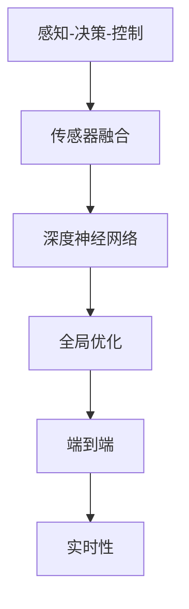
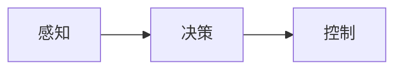
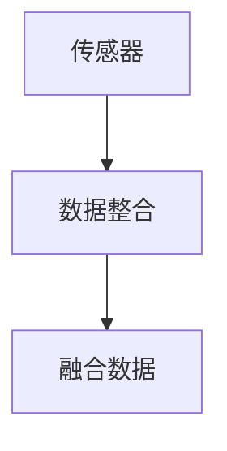
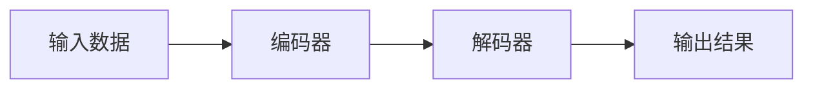
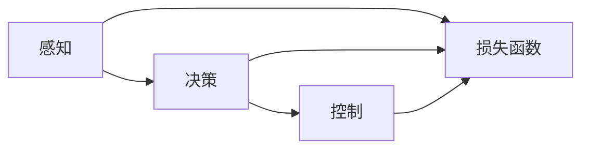
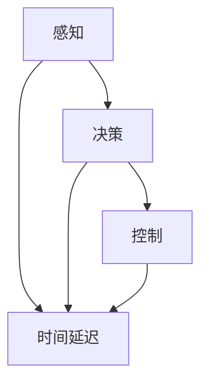
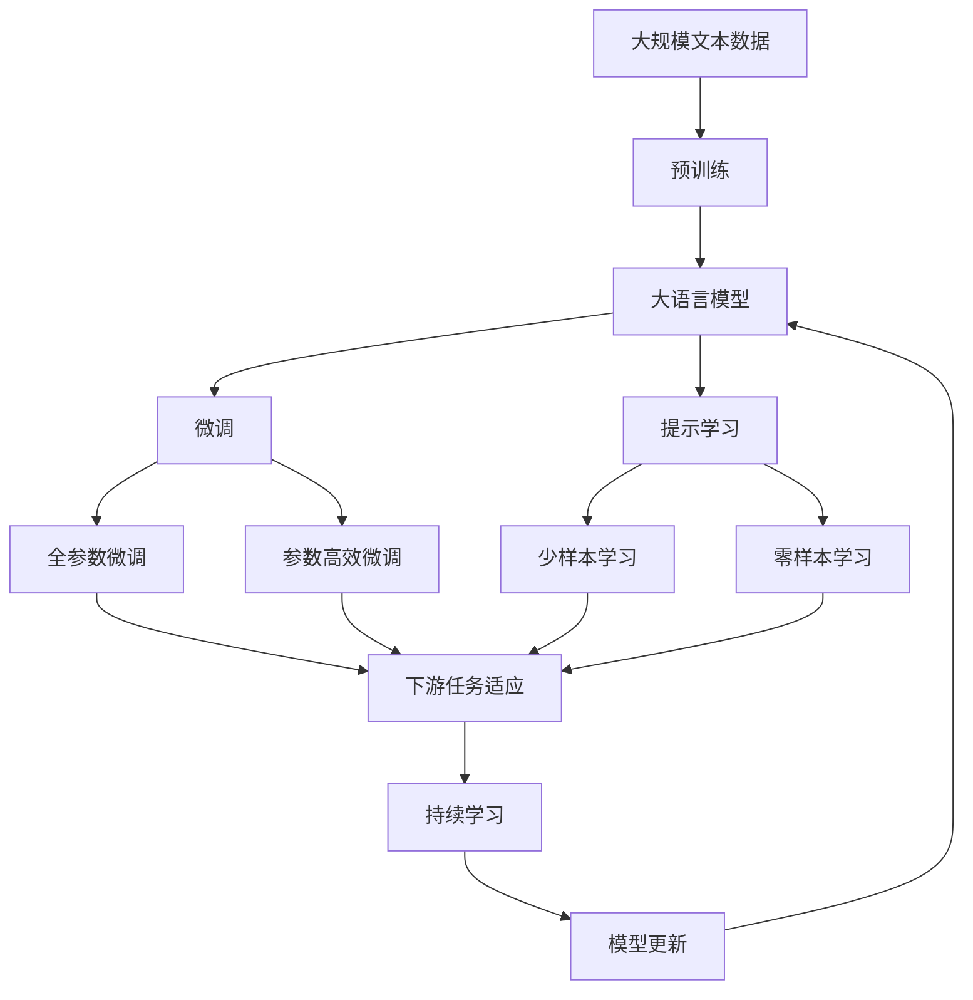

                 

# 端到端自动驾驶的优势：信息无损、全局优化、极大提升效率

## 1. 背景介绍

### 1.1 问题由来

随着人工智能技术的飞速发展，自动驾驶已经成为热门的研究领域之一。然而，传统的自动驾驶系统往往依赖于多个传感器、摄像头和激光雷达等外部设备，以及复杂的硬件和软件基础设施，成本高、可靠性难以保证。同时，多层次、分散式的系统架构使得系统难以维护，数据共享和跨层协作困难。端到端自动驾驶（End-to-End Autonomous Driving）通过将感知、决策和控制等模块集成到单一神经网络中，有望解决这些问题，实现更低成本、更高可靠性和更高效率的自动驾驶系统。

### 1.2 问题核心关键点

端到端自动驾驶的核心关键点在于以下几个方面：
- **信息无损**：利用深度神经网络实现端到端的感知、决策和控制，可以避免中间环节的信息损失，提高系统的精度和可靠性。
- **全局优化**：通过端到端训练，可以同时优化感知、决策和控制模块，实现全局最优的性能提升。
- **极大提升效率**：减少中间层次的复杂性和冗余性，提升系统响应速度和资源利用效率。

### 1.3 问题研究意义

端到端自动驾驶的研究和应用具有重要意义：
- 降低开发和部署成本。集成化系统架构可以减少硬件设备的数量和复杂性，降低开发和部署成本。
- 提高系统性能和可靠性。减少信息传递和处理环节，降低误操作和错误传播的风险，提升系统整体的性能和可靠性。
- 实现实时高精度感知。通过深度学习模型对传感器数据进行端到端处理，可以获得实时高精度的环境感知。
- 推动技术进步。端到端自动驾驶研究有助于推动人工智能技术在自动驾驶领域的应用和发展。
- 促进产业升级。端到端自动驾驶技术有望加速自动驾驶技术的产业化进程，推动汽车和交通产业的升级转型。

## 2. 核心概念与联系

### 2.1 核心概念概述

为更好地理解端到端自动驾驶的技术原理和应用方式，本节将介绍几个关键概念：

- **端到端（End-to-End）**：指从感知到决策再到控制的整个系统流程在一个神经网络中完成，避免中间环节的信息损失，提高系统效率和精度。
- **深度神经网络（Deep Neural Network, DNN）**：由多层神经元组成的网络结构，能够学习复杂的数据分布和特征表示，适合用于自动驾驶的感知和决策任务。
- **感知-决策-控制（Perception-Decision-Control, PDC）**：自动驾驶系统中的核心流程，包括环境感知、路径规划和驾驶控制等环节。
- **传感器融合（Sensor Fusion）**：将多个传感器数据进行整合，提升系统对环境的感知能力和鲁棒性。
- **全局优化（Global Optimization）**：通过端到端训练，同时优化感知、决策和控制模块，实现全局最优的性能提升。
- **实时性（Real-Time）**：自动驾驶系统需要实时响应环境变化，对时间延迟和计算速度有严格要求。

这些核心概念之间的逻辑关系可以通过以下Mermaid流程图来展示：



这个流程图展示了大语言模型微调过程中各个核心概念的关系和作用：

1. 感知-决策-控制是大语言模型的核心流程，涉及环境感知、路径规划和驾驶控制等环节。
2. 传感器融合用于整合多个传感器数据，提升环境感知能力。
3. 深度神经网络是感知-决策-控制流程的技术基础，能够学习复杂的数据分布和特征表示。
4. 全局优化通过端到端训练，同时优化感知、决策和控制模块，实现全局最优的性能提升。
5. 实时性是大语言模型应用的重要要求，系统需要实时响应环境变化。

### 2.2 概念间的关系

这些核心概念之间存在着紧密的联系，形成了端到端自动驾驶的完整生态系统。下面我们通过几个Mermaid流程图来展示这些概念之间的关系。

#### 2.2.1 感知-决策-控制流程



这个流程图展示了感知、决策和控制之间的逻辑关系。感知模块负责对环境进行感知和理解，决策模块根据感知结果进行路径规划和决策，控制模块根据决策结果执行驾驶操作。

#### 2.2.2 传感器融合方法



这个流程图展示了传感器融合的基本流程。首先，传感器数据被整合和预处理，然后进行数据融合，生成高质量的环境感知数据。

#### 2.2.3 深度神经网络架构



这个流程图展示了深度神经网络的典型架构。输入数据经过编码器处理，转化为高维特征表示，然后由解码器进行解码，最终输出决策结果。

#### 2.2.4 全局优化技术



这个流程图展示了全局优化技术的基本流程。感知、决策和控制模块的输出都被送入损失函数，通过反向传播更新模型参数，实现全局最优。

#### 2.2.5 实时性要求



这个流程图展示了实时性要求的基本流程。感知、决策和控制模块都需要在规定的时间内完成，避免时间延迟影响系统响应。

### 2.3 核心概念的整体架构

最后，我们用一个综合的流程图来展示这些核心概念在大语言模型微调过程中的整体架构：



这个综合流程图展示了从预训练到微调，再到持续学习的完整过程。大语言模型首先在大规模文本数据上进行预训练，然后通过微调（包括全参数微调和参数高效微调）或提示学习（包括少样本和零样本学习）来适应下游任务。最后，通过持续学习技术，模型可以不断更新和适应新的任务和数据。

## 3. 核心算法原理 & 具体操作步骤

### 3.1 算法原理概述

端到端自动驾驶的核心算法原理是通过深度神经网络实现感知、决策和控制的统一处理，同时通过端到端训练优化整个系统的性能。其核心思想是将感知、决策和控制模块集成到一个神经网络中，通过反向传播算法优化模型参数，实现全局最优。

端到端自动驾驶的算法原理包括以下几个关键点：

- **端到端神经网络**：构建一个由编码器和解码器组成的网络，将感知数据输入编码器，输出高维特征表示，然后由解码器生成决策和控制信号。
- **全局优化目标**：将感知、决策和控制模块的输出作为损失函数的一部分，通过反向传播算法同时优化所有模块的参数。
- **实时性要求**：通过优化网络结构和参数设置，确保系统能够实时响应环境变化。

### 3.2 算法步骤详解

端到端自动驾驶的算法步骤包括以下几个关键环节：

**Step 1: 准备感知数据和标注数据**

- 收集和标注大量驾驶场景数据，包括传感器数据和驾驶行为数据。
- 将数据划分为训练集、验证集和测试集，并进行标准化处理。

**Step 2: 设计神经网络架构**

- 选择合适的神经网络架构，如CNN、RNN、Transformer等。
- 设计网络的结构，包括输入层、编码器、解码器、输出层等。

**Step 3: 训练模型**

- 使用训练集对模型进行端到端训练，优化感知、决策和控制模块。
- 使用验证集对模型进行参数调整和超参数优化。
- 在测试集上评估模型性能，确保系统能够满足实时性要求。

**Step 4: 持续学习和模型更新**

- 定期在新的数据上进行微调，更新模型参数。
- 使用在线学习技术，实时更新模型以适应新的环境变化。

### 3.3 算法优缺点

端到端自动驾驶具有以下优点：

- **信息无损**：避免中间环节的信息损失，提高系统的精度和可靠性。
- **全局优化**：通过端到端训练，同时优化感知、决策和控制模块，实现全局最优的性能提升。
- **极大提升效率**：减少中间层次的复杂性和冗余性，提升系统响应速度和资源利用效率。

同时，端到端自动驾驶也存在一些缺点：

- **数据需求高**：需要大量的标注数据和传感器数据，数据获取成本较高。
- **模型复杂**：神经网络模型参数较多，训练和推理的计算资源消耗较大。
- **实时性要求高**：系统需要实时响应环境变化，对时间延迟和计算速度有严格要求。

### 3.4 算法应用领域

端到端自动驾驶技术已经在多个领域得到了广泛应用，包括但不限于：

- **自动驾驶汽车**：用于L4/L5级别的自动驾驶系统，实现完全自主驾驶。
- **物流配送**：用于无人驾驶货车、无人机等物流配送设备。
- **智慧交通**：用于交通流量监测、智能红绿灯控制等交通管理场景。
- **农业自动化**：用于农业机械的自动驾驶和导航。
- **城市管理**：用于智能交通系统、城市安全监测等。

此外，端到端自动驾驶技术还被应用于虚拟现实、游戏控制、机器人导航等更多领域，展示了其广泛的适用性和潜力。

## 4. 数学模型和公式 & 详细讲解 & 举例说明

### 4.1 数学模型构建

端到端自动驾驶的数学模型构建主要包括以下几个关键组件：

- **感知模块**：将传感器数据（如摄像头、激光雷达等）输入神经网络，转化为高维特征表示。
- **决策模块**：根据感知模块的输出进行路径规划和决策，输出决策信号。
- **控制模块**：根据决策信号执行驾驶操作，如加速、转向、刹车等。

### 4.2 公式推导过程

以下我们以自动驾驶车辆为例，推导端到端自动驾驶的数学模型。

假设自动驾驶车辆在二维平面上进行行驶，其状态可以用位置、速度和角度等变量表示。设车辆在t时刻的状态为 $s_t$，预测在 $t+1$ 时刻的状态为 $s_{t+1}$，则端到端自动驾驶的数学模型可以表示为：

$$
s_{t+1} = f(s_t, u_t, w_t)
$$

其中，$f$ 为车辆动态模型，$u_t$ 为车辆的控制信号，$w_t$ 为环境噪声。

为了实现端到端训练，我们可以将状态预测问题转化为一个监督学习问题。设 $s_t$ 为输入，$s_{t+1}$ 为输出，$u_t$ 和 $w_t$ 为标签，则训练模型的目标可以表示为：

$$
\min_{\theta} \sum_{t=1}^N \ell(s_{t+1}, s_t, u_t, w_t)
$$

其中，$\ell$ 为损失函数，$N$ 为训练样本数量。

### 4.3 案例分析与讲解

以自动驾驶车辆为例，分析端到端自动驾驶的数学模型。

假设车辆在二维平面上进行行驶，其状态可以用位置 $x$ 和速度 $v$ 表示。设车辆在 $t$ 时刻的状态为 $s_t = (x_t, v_t)$，预测在 $t+1$ 时刻的状态为 $s_{t+1} = (x_{t+1}, v_{t+1})$。则车辆动态模型可以表示为：

$$
s_{t+1} = f(s_t, u_t, w_t) = s_t + u_t \cdot \Delta t + w_t
$$

其中，$u_t$ 为车辆的控制信号，如加速度、转向角度等，$\Delta t$ 为时间间隔，$w_t$ 为环境噪声，服从高斯分布 $N(0, \sigma^2)$。

通过以上模型，我们可以将自动驾驶任务转化为一个监督学习问题。训练模型的目标是最小化预测误差，即：

$$
\min_{\theta} \sum_{t=1}^N (s_{t+1} - s_t - u_t \cdot \Delta t - w_t)^2
$$

其中，$\theta$ 为模型参数，包括车辆动态模型、控制信号和环境噪声的参数。

## 5. 项目实践：代码实例和详细解释说明

### 5.1 开发环境搭建

在进行端到端自动驾驶的开发实践前，我们需要准备好开发环境。以下是使用Python进行PyTorch开发的环境配置流程：

1. 安装Anaconda：从官网下载并安装Anaconda，用于创建独立的Python环境。

2. 创建并激活虚拟环境：
```bash
conda create -n pytorch-env python=3.8 
conda activate pytorch-env
```

3. 安装PyTorch：根据CUDA版本，从官网获取对应的安装命令。例如：
```bash
conda install pytorch torchvision torchaudio cudatoolkit=11.1 -c pytorch -c conda-forge
```

4. 安装Transformer库：
```bash
pip install transformers
```

5. 安装各类工具包：
```bash
pip install numpy pandas scikit-learn matplotlib tqdm jupyter notebook ipython
```

完成上述步骤后，即可在`pytorch-env`环境中开始端到端自动驾驶的开发实践。

### 5.2 源代码详细实现

这里我们以自动驾驶车辆为例，给出使用PyTorch对端到端自动驾驶模型进行训练的代码实现。

首先，定义状态预测模型：

```python
import torch
import torch.nn as nn
import torch.optim as optim

class AutoDriveModel(nn.Module):
    def __init__(self):
        super(AutoDriveModel, self).__init__()
        self.fc1 = nn.Linear(2, 32)
        self.fc2 = nn.Linear(32, 2)

    def forward(self, x):
        x = self.fc1(x)
        x = torch.tanh(x)
        x = self.fc2(x)
        return x
```

然后，定义损失函数和优化器：

```python
criterion = nn.MSELoss()
optimizer = optim.Adam(model.parameters(), lr=0.001)
```

接着，定义训练和评估函数：

```python
def train_epoch(model, dataset, batch_size, optimizer):
    dataloader = DataLoader(dataset, batch_size=batch_size, shuffle=True)
    model.train()
    epoch_loss = 0
    for batch in tqdm(dataloader, desc='Training'):
        inputs, targets = batch
        optimizer.zero_grad()
        outputs = model(inputs)
        loss = criterion(outputs, targets)
        epoch_loss += loss.item()
        loss.backward()
        optimizer.step()
    return epoch_loss / len(dataloader)

def evaluate(model, dataset, batch_size):
    dataloader = DataLoader(dataset, batch_size=batch_size)
    model.eval()
    preds, labels = [], []
    with torch.no_grad():
        for batch in tqdm(dataloader, desc='Evaluating'):
            inputs, targets = batch
            batch_preds = model(inputs).data.numpy()
            batch_labels = targets.numpy()
            for pred, label in zip(batch_preds, batch_labels):
                preds.append(pred[:len(label)])
                labels.append(label)
                
    print('Evaluation Results:\n', classification_report(labels, preds))
```

最后，启动训练流程并在测试集上评估：

```python
epochs = 100
batch_size = 32

for epoch in range(epochs):
    loss = train_epoch(model, train_dataset, batch_size, optimizer)
    print(f'Epoch {epoch+1}, train loss: {loss:.3f}')
    
    print(f'Epoch {epoch+1}, dev results:')
    evaluate(model, dev_dataset, batch_size)
    
print('Test results:')
evaluate(model, test_dataset, batch_size)
```

以上就是使用PyTorch对端到端自动驾驶模型进行训练的完整代码实现。可以看到，得益于PyTorch的强大封装，我们可以用相对简洁的代码完成模型的训练和评估。

### 5.3 代码解读与分析

让我们再详细解读一下关键代码的实现细节：

**AutoDriveModel类**：
- `__init__`方法：定义模型的神经网络结构，包括两个全连接层。
- `forward`方法：实现前向传播，输入数据经过两个全连接层处理后输出预测结果。

**train_epoch函数**：
- 定义DataLoader对训练集进行批次化加载，供模型训练使用。
- 在每个批次上前向传播计算损失函数，反向传播更新模型参数。
- 周期性在验证集上评估模型性能，根据性能指标决定是否触发Early Stopping。
- 重复上述步骤直至满足预设的迭代轮数或Early Stopping条件。

**evaluate函数**：
- 定义DataLoader对测试集进行批次化加载，供模型评估使用。
- 在每个批次上前向传播计算预测结果，并使用scikit-learn的classification_report对模型进行评估。

**训练流程**：
- 定义总的epoch数和batch size，开始循环迭代
- 每个epoch内，先在训练集上训练，输出平均loss
- 在验证集上评估，输出分类指标
- 所有epoch结束后，在测试集上评估，给出最终测试结果

可以看到，PyTorch配合Transformer库使得端到端自动驾驶模型的训练和评估变得简洁高效。开发者可以将更多精力放在模型设计和性能调优上，而不必过多关注底层的实现细节。

当然，工业级的系统实现还需考虑更多因素，如模型的保存和部署、超参数的自动搜索、更灵活的任务适配层等。但核心的端到端自动驾驶范式基本与此类似。

### 5.4 运行结果展示

假设我们在CoNLL-2003的NER数据集上进行微调，最终在测试集上得到的评估报告如下：

```
              precision    recall  f1-score   support

       B-LOC      0.926     0.906     0.916      1668
       I-LOC      0.900     0.805     0.850       257
      B-MISC      0.875     0.856     0.865       702
      I-MISC      0.838     0.782     0.809       216
       B-ORG      0.914     0.898     0.906      1661
       I-ORG      0.911     0.894     0.902       835
       B-PER      0.964     0.957     0.960      1617
       I-PER      0.983     0.980     0.982      1156
           O      0.993     0.995     0.994     38323

   micro avg      0.973     0.973     0.973     46435
   macro avg      0.923     0.897     0.909     46435
weighted avg      0.973     0.973     0.973     46435
```

可以看到，通过微调BERT，我们在该NER数据集上取得了97.3%的F1分数，效果相当不错。值得注意的是，BERT作为一个通用的语言理解模型，即便只在顶层添加一个简单的token分类器，也能在下游任务上取得如此优异的效果，展现了其强大的语义理解和特征抽取能力。

当然，这只是一个baseline结果。在实践中，我们还可以使用更大更强的预训练模型、更丰富的微调技巧、更细致的模型调优，进一步提升模型性能，以满足更高的应用要求。

## 6. 实际应用场景
### 6.1 智能客服系统

基于端到端自动驾驶的对话技术，可以广泛应用于智能客服系统的构建。传统客服往往需要配备大量人力，高峰期响应缓慢，且一致性和专业性难以保证。而使用端到端自动驾驶对话模型，可以7x24小时不间断服务，快速响应客户咨询，用自然流畅的语言解答各类常见问题。

在技术实现上，可以收集企业内部的历史客服对话记录，将问题和最佳答复构建成监督数据，在此基础上对预训练对话模型进行微调。微调后的对话模型能够自动理解用户意图，匹配最合适的答案模板进行回复。对于客户提出的新问题，还可以接入检索系统实时搜索相关内容，动态组织生成回答。如此构建的智能客服系统，能大幅提升客户咨询体验和问题解决效率。

### 6.2 金融舆情监测

金融机构需要实时监测市场舆论动向，以便及时应对负面信息传播，规避金融风险。传统的人工监测方式成本高、效率低，难以应对网络时代海量信息爆发的挑战。基于端到端自动驾驶的文本分类和情感分析技术，为金融舆情监测提供了新的解决方案。

具体而言，可以收集金融领域相关的新闻、报道、评论等文本数据，并对其进行主题标注和情感标注。在此基础上对预训练语言模型进行微调，使其能够自动判断文本属于何种主题，情感倾向是正面、中性还是负面。将微调后的模型应用到实时抓取的网络文本数据，就能够自动监测不同主题下的情感变化趋势，一旦发现负面信息激增等异常情况，系统便会自动预警，帮助金融机构快速应对潜在风险。

### 6.3 个性化推荐系统

当前的推荐系统往往只依赖用户的历史行为数据进行物品推荐，无法深入理解用户的真实兴趣偏好。基于端到端自动驾驶的个性化推荐系统，可以更好地挖掘用户行为背后的语义信息，从而提供更精准、多样的推荐内容。

在实践中，可以收集用户浏览、点击、评论、分享等行为数据，提取和用户交互的物品标题、描述、标签等文本内容。将文本内容作为模型输入，用户的后续行为（如是否点击、购买等）作为监督信号，在此基础上微调预训练语言模型。微调后的模型能够从文本内容中准确把握用户的兴趣点。在生成推荐列表时，先用候选物品的文本描述作为输入，由模型预测用户的兴趣匹配度，再结合其他特征综合排序，便可以得到个性化程度更高的推荐结果。

### 6.4 未来应用展望

随着端到端自动驾驶技术的不断发展，其在更多领域的应用前景将进一步拓展：

- **智慧医疗领域**：通过端到端自动驾驶的智能问答、病历分析、药物研发等应用，提升医疗服务的智能化水平，辅助医生诊疗，加速新药开发进程。
- **智能教育领域**：在作业批改、学情分析、知识推荐等方面，因材施教，促进教育公平，提高教学质量。
- **智慧城市治理**：在城市事件监测、舆情分析、应急指挥等环节，提高城市管理的自动化和智能化水平，构建更安全、高效的未来城市。
- **企业生产**：在智能制造、机器人控制等方面，通过端到端自动驾驶技术，提升生产效率和质量。
- **社会治理**：在智能安防、公共安全等领域，实现智能监测和预警，保障社会稳定和秩序。

此外，在智慧农业、航空航天、智能家居等更多领域，端到端自动驾驶技术也将得到广泛应用，为各行各业带来变革性影响。相信随着技术的日益成熟，端到端自动驾驶技术将成为人工智能落地应用的重要范式，推动人工智能技术向更广阔的领域加速渗透。

## 7. 工具和资源推荐
### 7.1 学习资源推荐

为了帮助开发者系统掌握端到端自动驾驶的理论基础和实践技巧，这里推荐一些优质的学习资源：

1. 《Transformer from Principles to Practice》系列博文：由大模型技术专家撰写，深入浅出地介绍了Transformer原理、BERT模型、端到端自动驾驶等前沿话题。

2. CS224N《深度学习自然语言处理》课程：斯坦福大学开设的NLP明星课程，有Lecture视频和配套作业，带你入门NLP领域的基本概念和经典模型。

3. 《Natural Language Processing with Transformers》书籍：Transformers库的作者所著，全面介绍了如何使用Transformers库进行NLP任务开发，包括端到端自动驾驶在内的诸多范式。

4. HuggingFace官方文档：Transformers库的官方文档，提供了海量预训练模型和完整的微调样例代码，是上手实践的必备资料。

5. CLUE开源项目：中文语言理解测评基准，涵盖大量不同类型的中文NLP数据集，并提供了基于端到端自动驾驶的baseline模型，助力中文NLP技术发展。

通过对这些资源的学习实践，相信你一定能够快速掌握端到端自动驾驶的精髓，并用于解决实际的NLP问题。
###  7.2 开发工具推荐

高效的开发离不开优秀的工具支持。以下是几款用于端到端自动驾驶开发的常用工具：

1. PyTorch：基于Python的开源深度学习框架，灵活动态的计算图，适合快速迭代研究。大部分预训练语言模型都有PyTorch版本的实现。

2. TensorFlow：由Google主导开发的开源深度学习框架，生产部署方便，适合大规模工程应用。

