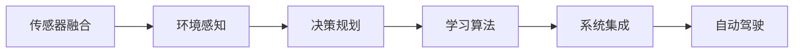

                 

# 端到端自动驾驶：黑盒中的端到端

在自动驾驶领域，端到端(End-to-End)学习方法因其独特的优势引起了广泛关注。相较于传统的驾驶辅助系统，端到端方法将环境感知、决策规划、控制执行等环节集成在单一模型中，简化了系统结构，提高了实时性和鲁棒性。本文将详细探讨端到端自动驾驶的核心概念、算法原理、具体操作步骤，并结合数学模型和案例进行深入讲解，最后给出项目实践、应用场景和未来展望。

## 1. 背景介绍

### 1.1 问题由来

自动驾驶技术近年来得到了飞速发展，其关键在于实现车辆在复杂多变环境中自主驾驶。然而，传统的自动驾驶系统通常将环境感知、决策规划和控制执行等环节分别建模，导致系统结构复杂，模型冗余，实时性和鲁棒性难以兼顾。这其中环境感知模块（如摄像头、激光雷达等传感器）和决策规划模块（如路径规划、交通信号识别等）是自动驾驶技术的瓶颈。端到端学习方法试图通过直接对原始传感器数据进行建模，省去了中间复杂的数据处理和决策环节，简化了系统结构，提高了实时性和鲁棒性。

### 1.2 问题核心关键点

端到端学习方法的关键点在于如何高效地将原始传感器数据映射到车辆的控制指令，具体包括：

- 数据表示：如何将原始传感器数据（如图像、激光点云等）高效地表示为模型可以处理的格式。
- 模型设计：如何设计一个能够准确预测控制指令的深度神经网络。
- 优化训练：如何在有限的标注数据上高效地训练模型，避免过拟合和保证泛化性能。

## 2. 核心概念与联系

### 2.1 核心概念概述

为了更好地理解端到端自动驾驶，本文将介绍几个核心概念：

- 传感器融合(Sensor Fusion)：将摄像头、激光雷达、GPS等不同类型的传感器数据进行融合，生成单一的融合数据。
- 环境感知(Perception)：使用端到端模型对融合数据进行语义理解，生成道路、交通信号等元素的高维表示。
- 决策规划(Deployment)：将环境感知的结果映射到车辆的控制指令，如加速、刹车、转向等。
- 学习算法：如深度神经网络、强化学习、进化算法等，用于训练环境感知和决策规划模型。
- 系统集成(System Integration)：将上述模块集成到单一的软件架构中，构建端到端自动驾驶系统。

这些概念之间的联系可以用以下Mermaid流程图表示：



这个流程图展示了端到端自动驾驶系统的大致流程。传感器融合模块负责采集和处理多源数据，环境感知模块对数据进行语义理解，决策规划模块将感知结果映射为控制指令，学习算法用于模型训练，系统集成模块将各个模块集成在一起，最终输出自动驾驶功能。

### 2.2 概念间的关系

这些核心概念之间存在紧密的联系，构成了端到端自动驾驶系统的完整框架。以下是这些概念的进一步说明：

- **传感器融合**：是数据处理的起始环节，其质量直接影响到后续的感知和决策。
- **环境感知**：基于传感器融合的数据，使用深度学习等方法进行语义理解，生成高维的语义表示。
- **决策规划**：将感知结果转化为控制指令，实现车辆的自主决策和路径规划。
- **学习算法**：用于训练环境感知和决策规划模块，其优劣直接决定了系统的性能。
- **系统集成**：将所有模块有机地组合在一起，构建出完整的自动驾驶系统。

## 3. 核心算法原理 & 具体操作步骤

### 3.1 算法原理概述

端到端自动驾驶的算法原理可以简单概括为：使用深度神经网络等模型，对原始传感器数据进行编码和解码，直接输出控制指令。其核心在于设计一个高效的神经网络架构，将环境感知和决策规划过程集成在一个单一模型中，同时使用监督学习或强化学习等算法进行训练。

### 3.2 算法步骤详解

端到端自动驾驶的算法步骤主要包括以下几个环节：

**Step 1: 数据预处理**

- 传感器数据采集：使用摄像头、激光雷达、GPS等传感器采集环境数据。
- 数据融合：使用传感器融合算法，将不同类型的数据进行融合，生成单一的融合数据。
- 数据增强：对数据进行增强处理，如旋转、平移、缩放等，增加数据多样性，避免过拟合。

**Step 2: 模型设计**

- 编码器(Encoder)：使用卷积神经网络(CNN)、循环神经网络(RNN)等模型，将融合数据进行编码，提取特征。
- 解码器(Decoder)：使用神经网络模型，将编码后的特征映射为控制指令，如加速、刹车、转向等。
- 优化器(Optimizer)：使用Adam、SGD等优化器，最小化损失函数，训练模型。

**Step 3: 模型训练**

- 训练集划分：将数据集划分为训练集、验证集和测试集。
- 损失函数设计：根据任务需求，设计合适的损失函数，如交叉熵、均方误差等。
- 超参数调优：选择合适的学习率、批大小、迭代轮数等超参数，优化模型训练。
- 模型评估：在验证集上评估模型性能，选择性能最优的模型进行测试。

**Step 4: 模型部署**

- 系统集成：将模型集成到自动驾驶系统中，与传感器和执行器接口交互。
- 实时推理：在实际驾驶环境中，实时读取传感器数据，输入模型进行推理，输出控制指令。
- 在线监控：实时监控模型性能，及时发现和修正问题。

### 3.3 算法优缺点

端到端自动驾驶方法具有以下优点：

- 简化系统结构：将多个独立模块集成到一个单一模型中，简化了系统结构，提高了实时性。
- 提高鲁棒性：避免了中间环节的复杂性和冗余，提高了系统的鲁棒性。
- 降低计算成本：减少了数据处理和决策环节，降低了计算成本。

同时，该方法也存在一些缺点：

- 模型复杂度高：深度神经网络等模型结构复杂，训练和推理复杂度较高。
- 数据需求大：需要大量的标注数据进行训练，数据采集和标注成本较高。
- 鲁棒性有限：模型对环境变化和异常情况的处理能力有限，可能出现误判。

### 3.4 算法应用领域

端到端自动驾驶方法在自动驾驶领域有广泛的应用，具体包括：

- 自动驾驶汽车：使用端到端方法，实现车辆在复杂环境中的自主驾驶。
- 无人机自动飞行：使用端到端方法，实现无人机在空中的自主导航和避障。
- 机器人自主导航：使用端到端方法，实现机器人在复杂环境中的自主导航和路径规划。
- 智能交通系统：使用端到端方法，实现交通信号的智能控制和优化。

## 4. 数学模型和公式 & 详细讲解

### 4.1 数学模型构建

设输入数据为 $x$，模型输出为 $y$，则端到端自动驾驶模型的数学模型可以表示为：

$$
y = f(x; \theta)
$$

其中 $f$ 表示模型，$\theta$ 为模型参数。假设模型的损失函数为 $L$，则模型训练的目标是最小化损失函数：

$$
\min_{\theta} L(f(x; \theta), y)
$$

常用的损失函数包括均方误差损失、交叉熵损失等。假设训练集为 $\mathcal{D} = \{(x_i, y_i)\}_{i=1}^N$，则模型的训练过程可以表示为：

$$
\min_{\theta} \frac{1}{N} \sum_{i=1}^N L(f(x_i; \theta), y_i)
$$

### 4.2 公式推导过程

以均方误差损失为例，推导损失函数的计算过程。假设模型的输出为 $y$，真实标签为 $y^*$，则均方误差损失函数为：

$$
L = \frac{1}{N} \sum_{i=1}^N (y_i - y_i^*)^2
$$

假设模型为 $f(x; \theta)$，其中 $x$ 为输入，$y$ 为输出，$\theta$ 为模型参数，则均方误差损失函数可以表示为：

$$
L = \frac{1}{N} \sum_{i=1}^N (f(x_i; \theta) - y_i^*)^2
$$

为了简化计算，通常将输出 $y$ 离散化为若干类别，如 $y_i \in \{0, 1, 2, ..., K-1\}$，其中 $K$ 为类别数。此时，交叉熵损失函数可以表示为：

$$
L = -\frac{1}{N} \sum_{i=1}^N \sum_{k=0}^{K-1} y_i^k \log f(x_i; \theta)^k
$$

### 4.3 案例分析与讲解

以自动驾驶中的车道保持系统为例，使用端到端方法进行建模。假设输入为车辆前方的摄像头图像 $x$，输出为车辆的转向角度 $y$。使用卷积神经网络进行编码和解码，得到模型：

$$
y = f(x; \theta) = \text{Decoder}(\text{Encoder}(x))
$$

其中，$\text{Encoder}$ 为卷积神经网络，$\text{Decoder}$ 为全连接层。使用交叉熵损失函数进行训练：

$$
L = -\frac{1}{N} \sum_{i=1}^N \sum_{k=0}^{K-1} y_i^k \log f(x_i; \theta)^k
$$

训练过程中，使用 Adam 优化器进行参数更新：

$$
\theta \leftarrow \theta - \eta \nabla_{\theta}L(\theta)
$$

其中 $\eta$ 为学习率，$\nabla_{\theta}L(\theta)$ 为损失函数对模型参数的梯度。

## 5. 项目实践：代码实例和详细解释说明

### 5.1 开发环境搭建

在进行端到端自动驾驶项目开发前，首先需要搭建好开发环境。以下是使用Python进行TensorFlow开发的环境配置流程：

1. 安装Anaconda：从官网下载并安装Anaconda，用于创建独立的Python环境。

2. 创建并激活虚拟环境：
```bash
conda create -n tf-env python=3.8 
conda activate tf-env
```

3. 安装TensorFlow：根据CUDA版本，从官网获取对应的安装命令。例如：
```bash
conda install tensorflow=2.6
```

4. 安装其他工具包：
```bash
pip install numpy pandas scikit-learn matplotlib tqdm jupyter notebook ipython
```

完成上述步骤后，即可在`tf-env`环境中开始项目开发。

### 5.2 源代码详细实现

接下来，我们将给出一个使用TensorFlow进行端到端自动驾驶的代码实现示例。假设我们使用的是端到端车道保持系统，其输入为摄像头图像，输出为转向角度。

```python
import tensorflow as tf
import numpy as np
import cv2

class LaneKeeping(tf.keras.Model):
    def __init__(self):
        super(LaneKeeping, self).__init__()
        self.encoder = tf.keras.Sequential([
            tf.keras.layers.Conv2D(32, (3,3), activation='relu', input_shape=(128,128,3)),
            tf.keras.layers.MaxPooling2D((2,2)),
            tf.keras.layers.Conv2D(64, (3,3), activation='relu'),
            tf.keras.layers.MaxPooling2D((2,2)),
            tf.keras.layers.Flatten(),
            tf.keras.layers.Dense(64, activation='relu')
        ])
        self.decoder = tf.keras.layers.Dense(1)

    def call(self, inputs):
        features = self.encoder(inputs)
        output = self.decoder(features)
        return output

    def compile_model(self):
        model = self
        model.compile(loss=tf.keras.losses.MeanSquaredError(),
                      optimizer=tf.keras.optimizers.Adam(learning_rate=0.001),
                      metrics=[tf.keras.metrics.MeanAbsoluteError()])
        return model

    def train(self, train_dataset, epochs=10):
        model = self.compile_model()
        model.fit(train_dataset, epochs=epochs)
        return model

# 数据处理函数
def process_image(image):
    image = cv2.cvtColor(image, cv2.COLOR_BGR2RGB)
    image = cv2.resize(image, (128, 128))
    image = image / 255.0
    return image

# 训练集和测试集
train_dataset = ...
test_dataset = ...

# 模型实例化和训练
model = LaneKeeping()
model.train(train_dataset, epochs=10)
```

### 5.3 代码解读与分析

让我们再详细解读一下关键代码的实现细节：

**LaneKeeping类**：
- `__init__`方法：初始化卷积编码器和全连接解码器。
- `call`方法：前向传播过程，输入图像数据，经过编码器得到特征，通过解码器输出转向角度。
- `compile_model`方法：模型编译过程，设置损失函数、优化器和评估指标。
- `train`方法：模型训练过程，使用训练集进行训练。

**process_image函数**：
- 将原始摄像头图像进行预处理，包括颜色空间转换、图像缩放和归一化。

**训练集和测试集**：
- 使用TensorFlow的Dataset接口定义训练集和测试集，可以自行实现数据增强等操作。

**模型实例化和训练**：
- 实例化LaneKeeping模型，设置训练参数，使用训练集进行模型训练。

## 6. 实际应用场景

### 6.1 智能交通系统

端到端自动驾驶技术可以应用于智能交通系统的构建，提升交通管理的智能化水平。通过在道路上部署自动驾驶车辆，实时采集交通数据，并使用端到端模型进行分析，可以实现交通流量预测、交通信号优化等功能，提升交通效率和安全性。

在技术实现上，可以在道路上部署多个传感器，收集交通数据，包括车辆位置、速度、方向等信息。将数据输入到端到端模型中，训练模型预测交通流量和最优信号控制策略。使用模型输出的控制指令，动态调整交通信号灯，实现交通流量优化和事故预测。

### 6.2 智能仓储系统

端到端自动驾驶技术也可以应用于智能仓储系统的构建，提升仓储管理的智能化水平。通过在仓储系统中部署自动驾驶车辆，实时采集环境数据，并使用端到端模型进行分析，可以实现货物自动搬运、库存管理等功能，提升仓储效率和准确性。

在技术实现上，可以在仓储系统中部署多个传感器，收集环境数据，包括货物位置、数量等信息。将数据输入到端到端模型中，训练模型预测货物位置和搬运路径，生成最优控制指令。使用模型输出的控制指令，控制自动驾驶车辆进行货物搬运和库存管理。

### 6.3 智慧物流系统

端到端自动驾驶技术还可以应用于智慧物流系统的构建，提升物流运输的智能化水平。通过在运输车辆上部署自动驾驶系统，实时采集环境数据，并使用端到端模型进行分析，可以实现路径规划、避障等功能，提升运输效率和安全性。

在技术实现上，可以在运输车辆上部署多个传感器，收集环境数据，包括道路条件、交通信号等信息。将数据输入到端到端模型中，训练模型预测最优路径和避障策略，生成控制指令。使用模型输出的控制指令，控制自动驾驶车辆进行路径规划和避障。

### 6.4 未来应用展望

随着端到端自动驾驶技术的发展，其在智能交通、智能仓储、智慧物流等领域的应用前景将更加广阔。未来，端到端自动驾驶技术将与5G、物联网等新兴技术结合，实现更加智能、高效、安全的系统应用。

1. **智能交通系统**：将自动驾驶技术与交通管理平台深度融合，实现交通流量预测、信号优化等功能，提升交通效率和安全性。
2. **智能仓储系统**：在仓储系统中部署自动驾驶车辆，实现货物自动搬运、库存管理等功能，提升仓储效率和准确性。
3. **智慧物流系统**：在运输车辆上部署自动驾驶系统，实现路径规划、避障等功能，提升运输效率和安全性。
4. **智能制造系统**：在制造工厂内部部署自动驾驶车辆，实现物料搬运、设备维护等功能，提升制造效率和灵活性。
5. **智能安防系统**：在安防监控系统中部署自动驾驶车辆，实现自主巡检、异常检测等功能，提升安防效率和覆盖范围。

## 7. 工具和资源推荐

### 7.1 学习资源推荐

为了帮助开发者系统掌握端到端自动驾驶的理论基础和实践技巧，这里推荐一些优质的学习资源：

1. 《深度学习》书籍：Ian Goodfellow等人所著，全面介绍了深度学习的基本概念和应用实例。
2. 《端到端深度学习》博客：作者深入浅出地介绍了端到端自动驾驶技术的原理和实践，是学习端到端自动驾驶的重要参考资料。
3. 《TensorFlow官方文档》：TensorFlow的官方文档，提供了丰富的API接口和示例代码，是学习TensorFlow的好资源。
4. Coursera《深度学习专项课程》：由斯坦福大学开设的深度学习课程，涵盖深度学习的基本概念和实践技巧。
5. arXiv论文预印本：人工智能领域最新研究成果的发布平台，包括大量尚未发表的前沿工作，学习前沿技术的必读资源。

通过对这些资源的学习实践，相信你一定能够快速掌握端到端自动驾驶技术的精髓，并用于解决实际的驾驶问题。

### 7.2 开发工具推荐

高效的开发离不开优秀的工具支持。以下是几款用于端到端自动驾驶开发的常用工具：

1. TensorFlow：由Google主导开发的开源深度学习框架，生产部署方便，适合大规模工程应用。
2. PyTorch：基于Python的开源深度学习框架，灵活动态的计算图，适合快速迭代研究。
3. ROS（Robot Operating System）：用于机器人编程的框架，支持多种传感器和执行器的接入，方便自动化驾驶系统的开发。
4. Gazebo：用于机器人仿真的平台，支持多机器人、多传感器仿真，方便自动化驾驶系统的测试和验证。
5. UAVision：用于无人机自动飞行的开源库，支持多种传感器和飞行控制算法，方便无人机自动驾驶系统的开发。

合理利用这些工具，可以显著提升端到端自动驾驶任务的开发效率，加快创新迭代的步伐。

### 7.3 相关论文推荐

端到端自动驾驶技术的发展源于学界的持续研究。以下是几篇奠基性的相关论文，推荐阅读：

1. End-to-End Learning for Self-Driving Cars（End-to-End自动驾驶）：提出端到端方法，将驾驶任务集成到单一模型中，提升了自动驾驶的实时性和鲁棒性。
2. DeepDriving：A Hierarchical Approach to Autonomous Driving（深度驾驶）：提出深度神经网络在自动驾驶中的应用，实现了基于图像的驾驶决策。
3. DeepDriving with D3L: Learning to Drive with End-to-End Differentiable Learning（深度驾驶D3L）：提出D3L框架，进一步提升了端到端方法的性能和可解释性。
4. Behaviour-Driven Automated Driving Systems（行为驱动自动驾驶系统）：提出基于行为的自动驾驶方法，增强了系统的可解释性和鲁棒性。
5. Behavioral Cloning with Transfer Learning for Smart Driving Automation（基于转移学习的智能驾驶自动化）：提出基于转移学习的行为克隆方法，提升了自动驾驶系统的泛化性能。

这些论文代表了大规模自动驾驶技术的发展脉络。通过学习这些前沿成果，可以帮助研究者把握学科前进方向，激发更多的创新灵感。

除上述资源外，还有一些值得关注的前沿资源，帮助开发者紧跟端到端自动驾驶技术的最新进展，例如：

1. 《IEEE Transactions on Intelligent Transportation Systems》期刊：提供自动驾驶领域的前沿研究成果，是了解最新动态的好资源。
2. 《Journal of Intelligent Transportation Systems》期刊：提供智能交通领域的前沿研究成果，是了解最新动态的好资源。
3. 《IEEE Robotics & Automation Letters》期刊：提供机器人领域的前沿研究成果，是了解最新动态的好资源。
4. 《IEEE Access》期刊：提供人工智能领域的前沿研究成果，是了解最新动态的好资源。

## 8. 总结：未来发展趋势与挑战

### 8.1 总结

本文对端到端自动驾驶的核心概念、算法原理、具体操作步骤进行了详细探讨，并结合数学模型和案例进行深入讲解。通过本文的系统梳理，可以看到端到端自动驾驶技术的独特优势和广泛应用前景。

### 8.2 未来发展趋势

展望未来，端到端自动驾驶技术将呈现以下几个发展趋势：

1. 模型规模持续增大。随着算力成本的下降和数据规模的扩张，端到端模型参数量还将持续增长，超大规模模型将大幅提升系统的性能。
2. 数据需求降低。得益于深度强化学习和迁移学习等方法，未来端到端系统可以在更少的标注数据上取得理想效果，降低数据采集和标注成本。
3. 系统集成更加灵活。未来的系统集成将更加注重模块化设计和可插拔性，便于系统扩展和升级。
4. 安全性和可解释性提升。未来的系统将更加注重安全性和可解释性，确保系统的稳定性和可信任性。

### 8.3 面临的挑战

尽管端到端自动驾驶技术已经取得了一定进展，但在实现全场景自动驾驶的过程中，仍面临诸多挑战：

1. 安全性问题：端到端模型在面对复杂环境和多变情况时，鲁棒性和安全性仍有待提高，如何避免交通事故、保护行人安全等仍然是一个难题。
2. 计算资源需求高：端到端模型对计算资源的需求较高，如何在有限资源下优化模型性能，提升系统实时性，仍是一个重要研究方向。
3. 数据隐私和安全：在收集和处理大量传感器数据时，如何保护数据隐私和安全，避免数据泄露和滥用，是一个重要挑战。
4. 法规和标准：自动驾驶技术的应用需要遵守各国法律法规和标准规范，如何与现有交通体系兼容，制定统一标准，是一个重要研究方向。

### 8.4 研究展望

面对端到端自动驾驶面临的诸多挑战，未来的研究需要在以下几个方面寻求新的突破：

1. 开发更加高效的模型架构。未来的模型将更加注重模型效率和计算资源优化，引入更多的结构优化技术，提升系统的实时性和可扩展性。
2. 引入更多的先验知识和数据增强。未来的系统将更加注重融合先验知识和数据增强技术，提升系统的鲁棒性和泛化能力。
3. 开发更加智能和可解释的决策机制。未来的系统将更加注重决策机制的可解释性和智能性，通过引入因果推断、规则库等手段，提升系统的透明性和可信任性。
4. 优化系统集成和部署。未来的系统将更加注重模块化设计和可插拔性，提升系统的灵活性和可扩展性。

## 9. 附录：常见问题与解答

**Q1：端到端自动驾驶是否适用于所有驾驶场景？**

A: 端到端自动驾驶目前主要适用于城市道路和高速公路等相对规则的道路场景，对于复杂的乡村道路、非规则道路等场景，仍需进一步研究和优化。未来的研究将致力于解决多变环境和复杂道路下的自动驾驶问题。

**Q2：端到端自动驾驶如何处理传感器数据？**

A: 端到端自动驾驶系统通常使用传感器融合技术，将多种传感器数据进行融合，生成单一的高维表示。常见的传感器数据包括摄像头图像、激光雷达点云、GPS等，融合后的数据通常采用深度神经网络进行编码和解码。

**Q3：端到端自动驾驶的训练数据如何获取？**

A: 端到端自动驾驶系统通常需要大量的标注数据进行训练，数据采集和标注成本较高。可以通过公开数据集、合作伙伴共享等方式获取数据，也可以使用合成数据进行训练，如Simulation2Real技术。

**Q4：端到端自动驾驶的系统集成有何重要性？**

A: 系统集成是端到端自动驾驶技术的核心，将感知、决策和执行等模块有机地组合在一起，构建出完整的自动驾驶系统。系统集成的优劣直接影响到系统的性能和稳定性，需要根据具体任务和需求进行灵活设计。

**Q5：端到端自动驾驶的未来发展方向是什么？**

A: 未来的端到端自动驾驶技术将更加注重安全性、可解释性和系统集成，同时也将进一步融合多模态数据和先验知识，提升系统的鲁棒性和泛化能力。此外，未来的研究将探索在无人驾驶、无人飞行、无人船等新场景下的应用，推动自动驾驶技术向更广泛领域扩展。

---
作者：禅与计算机程序设计艺术 / Zen and the Art of Computer Programming

