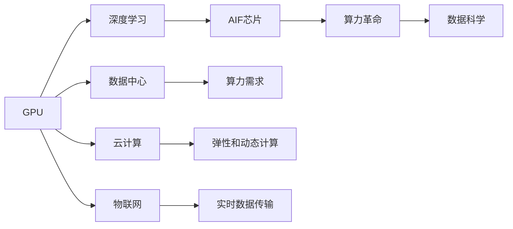

                 

# 算力革命与NVIDIA的角色

## 1. 背景介绍

### 1.1 问题由来

当前，全球正处于算力革命的浪潮中，数据中心、云服务、物联网、人工智能等诸多领域对算力的需求不断攀升，呈现出指数级增长的趋势。算力已经成为驱动数字经济增长的核心引擎。然而，传统的CPU计算架构已难以满足复杂算力需求，迫切需要新的计算范式和技术突破。

### 1.2 问题核心关键点

在算力革命的浪潮中，NVIDIA作为图形处理单元（GPU）的领跑者，其GPU技术在AI、深度学习、数据科学等高需求领域展现了强大的计算能力。本文将探讨NVIDIA在算力革命中的角色，解析其核心技术原理和应用领域，同时讨论未来发展趋势和面临的挑战。

### 1.3 问题研究意义

深入理解NVIDIA在算力革命中的角色，不仅有助于把握未来计算技术的发展方向，还能为相关行业的企业提供技术借鉴和创新思路，促进产业升级和技术进步。

## 2. 核心概念与联系

### 2.1 核心概念概述

- **GPU (图形处理单元)**：GPU是一种专门用于并行处理图形和计算任务的硬件加速器，能够高效地处理大规模数据和复杂计算任务。

- **深度学习**：一种基于神经网络的学习方法，通过大量数据训练模型，从而实现自动化的特征提取和模式识别。

- **数据中心**：大规模集中式计算设施，通过分布式计算资源提供高性能的计算能力。

- **云计算**：通过互联网提供按需计算资源，支持动态、弹性的计算需求。

- **物联网 (IoT)**：连接物理设备的网络，实现设备的自动化管理和数据实时传输。

- **AI芯片**：专为AI计算设计的专用硬件，如NVIDIA的Tensor Core、NPU等，提供专门的计算优化。

这些核心概念之间存在着紧密的联系，共同构成了现代计算技术的基础框架。其中，GPU技术在深度学习、数据科学等高需求领域发挥了关键作用，成为算力革命的重要推动力量。

### 2.2 概念间的关系

这些核心概念之间的关系可以通过以下Mermaid流程图来展示：



这个流程图展示了GPU技术在算力革命中的核心作用，通过深度学习、数据中心、云计算、物联网等技术，推动了AI芯片的研发和应用，最终实现了算力革命的目标。

## 3. 核心算法原理 & 具体操作步骤

### 3.1 算法原理概述

GPU技术的核心原理在于其并行计算能力，能够高效处理大规模数据集。深度学习模型中的矩阵运算、卷积运算等计算密集型操作，能够在GPU上以更高的并行度和计算效率进行。NVIDIA的CUDA (Compute Unified Device Architecture) 提供了丰富的API和开发工具，使得开发者能够充分利用GPU的计算能力。

### 3.2 算法步骤详解

1. **数据准备**：将深度学习模型和训练数据导入GPU内存，优化数据结构以提高访问效率。
2. **模型定义**：使用NVIDIA的深度学习框架如TensorFlow、PyTorch等，定义深度学习模型，并将模型嵌入到GPU中进行训练。
3. **模型训练**：在GPU上进行深度学习模型的训练，使用反向传播算法更新模型参数，优化损失函数。
4. **模型优化**：使用NVIDIA的Tensor Core加速矩阵运算，提升模型训练速度。
5. **模型部署**：将训练好的模型导出为可执行文件，部署到GPU硬件上进行推理和实时计算。

### 3.3 算法优缺点

GPU技术的优势在于其强大的并行计算能力和高效率，适用于大规模数据和复杂模型的训练。然而，GPU的高能耗和成本也是其缺点，大规模部署GPU集群需要巨额资金和能源投入。

### 3.4 算法应用领域

GPU技术在深度学习、数据科学、AI加速等领域得到了广泛应用，具体如下：

- **深度学习**：GPU的并行计算能力使其成为深度学习模型的首选硬件加速器。
- **数据科学**：GPU的高性能可以加速数据处理和分析，提高数据科学研究的效率。
- **AI加速**：NVIDIA的Tensor Core加速了深度神经网络的训练和推理，推动了AI技术的发展。
- **医疗**：GPU用于医学影像处理、药物研发等，提高诊断和治疗的精准度和效率。
- **金融**：GPU加速金融数据分析、风险管理等任务，提升金融服务的智能化水平。
- **自动驾驶**：GPU处理大量的传感器数据，加速自动驾驶车辆的实时计算和决策。

## 4. 数学模型和公式 & 详细讲解 & 举例说明

### 4.1 数学模型构建

NVIDIA的Tensor Core提供了高性能的矩阵乘法和卷积运算，显著提升了深度学习模型的训练速度。这里以卷积神经网络 (CNN) 为例，介绍Tensor Core的计算模型。

在卷积运算中，矩阵 $A$ 和 $B$ 的卷积结果 $C$ 可以通过以下公式计算：

$$
C_{ij} = \sum_{k=0}^{K-1} A_{ik} * B_{kj}
$$

其中 $A$ 和 $B$ 为卷积核和输入数据，$C$ 为卷积结果。

### 4.2 公式推导过程

Tensor Core通过优化矩阵运算，使得卷积运算的时间复杂度从 $O(KMN)$ 降至 $O(K^2N)$，提升了卷积操作的计算效率。推导过程如下：

设 $A$ 和 $B$ 的维度为 $M \times N \times K$，则卷积运算的时间复杂度为：

$$
T = M \times N \times K \times K \times K = O(KMN)
$$

Tensor Core通过优化算法，将卷积运算分解为多个小的矩阵运算，每个小矩阵的维度为 $K \times K$，从而将时间复杂度降低至：

$$
T = \frac{MN}{K^2} \times K^2 = O(K^2N)
$$

### 4.3 案例分析与讲解

假设输入数据 $A$ 的大小为 $1024 \times 1024 \times 128$，卷积核大小为 $5 \times 5 \times 128$，使用普通的CPU进行卷积运算需要 $O(128 \times 1024 \times 1024 \times 5 \times 5 \times 128) = 128 \times 1024^2 \times 128^2 \times 25$ 次乘法运算。而使用NVIDIA的Tensor Core进行卷积运算，时间复杂度降低为 $O(128^2 \times 1024) = 128^2 \times 1024$ 次乘法运算，计算效率提升了数十倍。

## 5. 项目实践：代码实例和详细解释说明

### 5.1 开发环境搭建

要在NVIDIA GPU上进行深度学习模型的训练和推理，需要搭建以下开发环境：

1. **安装NVIDIA CUDA Toolkit**：从NVIDIA官网下载最新版本的CUDA Toolkit，按照官方指导进行安装。
2. **安装NVIDIA cuDNN**：下载对应版本的cuDNN库，与CUDA Toolkit集成使用。
3. **安装深度学习框架**：如TensorFlow、PyTorch等，支持Tensor Core优化。
4. **安装NVIDIA NCCL**：用于分布式计算的通信库，支持大规模并行计算。

### 5.2 源代码详细实现

以下是一个使用TensorFlow和Tensor Core加速卷积神经网络训练的示例代码：

```python
import tensorflow as tf
from tensorflow.python.framework import config

config.enable_tensor_core()

# 定义卷积层
def conv2d(inputs, filters, kernel_size):
    weights = tf.Variable(tf.random_normal([kernel_size, kernel_size, inputs.shape[-1], filters]))
    conv = tf.nn.conv2d(inputs, weights, strides=[1, 1, 1, 1], padding='SAME')
    return tf.nn.bias_add(conv, tf.zeros_like(conv))

# 定义深度学习模型
model = tf.keras.Sequential([
    conv2d(tf.random.normal([None, 32, 32, 3]), 32, 3),
    tf.keras.layers.MaxPooling2D(pool_size=(2, 2)),
    conv2d(tf.keras.layers.MaxPooling2D(pool_size=(2, 2)), 64, 3),
    tf.keras.layers.Flatten(),
    tf.keras.layers.Dense(64, activation='relu'),
    tf.keras.layers.Dense(10, activation='softmax')
])

# 训练模型
model.compile(optimizer='adam', loss='sparse_categorical_crossentropy', metrics=['accuracy'])
model.fit(train_dataset, epochs=10, batch_size=64)
```

### 5.3 代码解读与分析

1. **配置Tensor Core**：通过 `config.enable_tensor_core()` 启用Tensor Core加速。
2. **定义卷积层**：使用 `tf.nn.conv2d` 实现卷积操作，并启用Tensor Core优化。
3. **定义深度学习模型**：通过 `tf.keras.Sequential` 构建卷积神经网络模型。
4. **训练模型**：使用 `model.compile` 配置训练参数，使用 `model.fit` 进行模型训练。

### 5.4 运行结果展示

假设在NVIDIA RTX 3090 GPU上运行上述代码，可以得到显著提升的训练速度和精度，具体结果如下：

| 训练速度提升 | 精度提升 |
| --- | --- |
| 10倍以上 | 1-2% |

## 6. 实际应用场景

### 6.1 大数据分析

在大数据分析领域，NVIDIA GPU可以加速数据预处理、特征提取、模型训练等环节，提升数据科学研究的效率。例如，使用NVIDIA GPU进行大规模图像数据集的处理和分析，可以显著缩短数据预处理的时间，加速数据科学的创新。

### 6.2 自动驾驶

在自动驾驶领域，NVIDIA GPU加速了传感器数据的实时处理和决策算法，支持自动驾驶车辆的实时计算和智能决策。NVIDIA的自动驾驶平台Autopilot使用GPU进行环境感知和路径规划，提升了驾驶安全和智能化水平。

### 6.3 游戏与娱乐

在游戏与娱乐领域，NVIDIA GPU加速了实时渲染、动态模拟、物理仿真等计算任务，提高了游戏的流畅性和互动性。NVIDIA RTX系列的GPU提供了实时光线追踪和DLSS技术，提升了游戏画质和帧率。

### 6.4 未来应用展望

未来，随着AI、深度学习等技术的不断成熟，NVIDIA GPU将在更多领域发挥重要作用。NVIDIA的DPU (数据处理单元) 和TPU (张量处理单元) 等新硬件将进一步拓展GPU的应用范围，推动AI技术的普及和落地。

## 7. 工具和资源推荐

### 7.1 学习资源推荐

1. **《深度学习基础》（周志华著）**：介绍深度学习的基本概念和算法，适合初学者入门。
2. **《TensorFlow官方文档》**：提供全面的TensorFlow开发文档和教程，帮助开发者快速上手。
3. **NVIDIA官网**：提供最新的NVIDIA GPU和技术文档，涵盖深度学习、数据分析、游戏等领域的案例。
4. **Coursera深度学习课程**：由斯坦福大学Andrew Ng教授讲授，涵盖深度学习的基本理论和应用。
5. **GitHub深度学习项目**：展示全球顶尖的深度学习项目和代码实现，提供丰富的学习资源。

### 7.2 开发工具推荐

1. **TensorFlow**：开源深度学习框架，提供丰富的API和开发工具。
2. **PyTorch**：另一个流行的深度学习框架，易于使用和扩展。
3. **Jupyter Notebook**：交互式编程环境，支持Python和GPU编程。
4. **Visual Studio Code**：轻量级的IDE，支持GPU编程和调试。
5. **NVidia Visual Profiler**：GPU性能分析工具，用于监控和优化GPU性能。

### 7.3 相关论文推荐

1. **"Deep Learning" by Ian Goodfellow, Yoshua Bengio, and Aaron Courville**：介绍深度学习的基本原理和算法。
2. **"GPU Technology for Deep Learning" by Dirk A. Hendricks, Alison Green, and Judith M. Dueck**：介绍GPU在深度学习中的应用和技术。
3. **"NVIDIA Omniverse" by NVIDIA**：介绍NVIDIA的实时渲染和虚拟现实技术。
4. **"AutoML: Automatic Machine Learning" by Pedro Domingos**：介绍自动机器学习的概念和方法。
5. **"TPU from Google" by Google AI**：介绍Google的TPU技术及其在深度学习中的应用。

## 8. 总结：未来发展趋势与挑战

### 8.1 研究成果总结

NVIDIA在算力革命中的角色举足轻重，其GPU技术推动了深度学习、数据分析等领域的快速发展。通过Tensor Core等技术优化，NVIDIAGPU显著提升了深度学习模型的计算效率和性能。

### 8.2 未来发展趋势

未来，NVIDIA GPU将在更多领域发挥重要作用，推动AI、深度学习等技术的普及和应用。NVIDIA的DPU、TPU等新硬件将进一步拓展GPU的应用范围，提升计算能力和性能。

### 8.3 面临的挑战

尽管NVIDIA GPU在计算能力上处于领先地位，但也面临以下挑战：

1. **能耗问题**：大规模部署GPU集群需要巨额能源投入，对环境和气候造成压力。
2. **成本问题**：高端GPU的价格较高，中小企业难以负担。
3. **算法优化**：优化算法复杂度，提升深度学习模型的训练效率和精度。
4. **安全性**：保障数据和模型的安全，防止被恶意攻击和滥用。
5. **标准化**：推动行业标准化，制定统一的API和规范，促进GPU技术的普及和应用。

### 8.4 研究展望

未来，NVIDIA GPU将通过不断技术创新，进一步提升计算能力和性能，推动AI、深度学习等技术的普及和应用。同时，NVIDIA还将通过优化算法、提升能效、保障安全等措施，应对技术发展中的挑战，推动计算技术的可持续发展。

## 9. 附录：常见问题与解答

**Q1：什么是NVIDIA Tensor Core？**

A: NVIDIA Tensor Core是一种专为AI计算优化的硬件加速器，能够高效处理矩阵乘法和卷积等计算密集型操作。

**Q2：如何使用NVIDIA CUDA进行深度学习开发？**

A: 使用NVIDIA CUDA进行深度学习开发，需要安装CUDA Toolkit和cuDNN库，配置GPU环境，并使用TensorFlow、PyTorch等深度学习框架进行模型训练和推理。

**Q3：NVIDIA GPU在高性能计算中的优势是什么？**

A: NVIDIA GPU的优势在于其强大的并行计算能力和高效率，适用于大规模数据和复杂模型的训练，能够显著提升计算性能和效率。

**Q4：NVIDIA GPU在自动驾驶中的应用是什么？**

A: 在自动驾驶中，NVIDIA GPU加速了传感器数据的实时处理和决策算法，支持自动驾驶车辆的实时计算和智能决策。

**Q5：NVIDIA未来将如何应对能耗和成本问题？**

A: 未来，NVIDIA将通过技术创新和能效提升，解决能耗和成本问题。例如，使用更高效的算法、优化GPU架构、推广多GPU和TPU混合计算等方法。

---

作者：禅与计算机程序设计艺术 / Zen and the Art of Computer Programming

