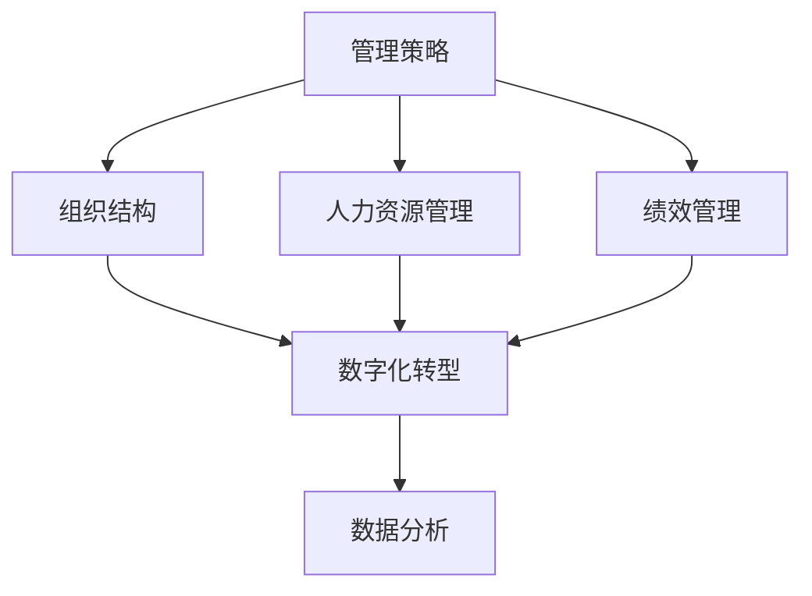
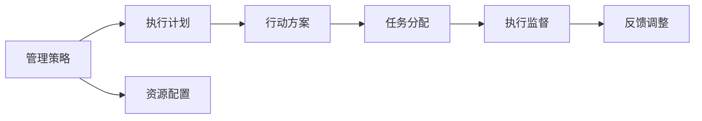
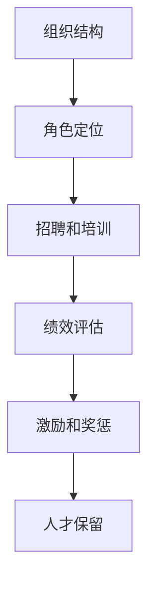

                 

# 管理的智慧：从策略到执行

> 关键词：管理智慧, 策略制定, 执行落地, 组织变革, 绩效管理, 人力资源, 数字化转型, 数据分析, 团队协作

## 1. 背景介绍

### 1.1 问题由来

在当今高速发展的数字化时代，企业的运营和管理面临着前所未有的复杂性和挑战性。一方面，新兴技术不断涌现，市场环境快速变化，企业需要不断创新，才能在激烈的市场竞争中脱颖而出。另一方面，人力资源的流动性增强，员工需求日益多元化，如何吸引和留住优秀人才，充分发挥其潜力，成为企业管理的核心问题。

因此，如何制定有效的管理策略，并确保其顺利执行，是每一个企业领导者必须面对的重大课题。而这也正是《管理的智慧：从策略到执行》这本书所要探讨的核心内容。

### 1.2 问题核心关键点

管理策略的制定和执行是一个复杂的系统工程，涉及组织结构、人力资源、绩效管理、数字化转型等多个方面。具体来说，关键点包括以下几个方面：

- **组织结构设计**：如何根据企业目标和市场环境，设计合理的组织结构，使其既能高效执行策略，又能灵活应对变化。
- **人力资源管理**：如何通过有效的人力资源管理，吸引和保留优秀人才，激励员工，提高其绩效和满意度。
- **绩效管理**：如何设计科学的绩效考核指标和激励机制，确保员工的工作结果与企业目标一致。
- **数字化转型**：如何利用数字化手段，提升企业运营效率，增强市场竞争力。
- **数据分析**：如何通过数据分析，洞察业务问题，指导管理决策。

这些核心关键点相互关联，共同构成了一个高效的企业管理框架。本文将系统探讨这些方面的方法和策略，并给出具体的实现步骤。

### 1.3 问题研究意义

通过深入研究管理和执行策略的制定和实施，可以提升企业的管理效率，增强其市场竞争力和持续发展能力。具体来说：

- **提升决策质量**：科学的管理策略和执行方案能够帮助企业更准确地识别市场机会和威胁，制定更具前瞻性和竞争力的战略。
- **优化组织运作**：合理的组织结构和人力资源管理能够提升企业运营效率，降低管理成本，增强市场响应速度。
- **激发员工潜力**：科学的绩效管理和激励机制能够充分发挥员工的创造力和工作热情，增强企业的创新能力和团队凝聚力。
- **实现数字化转型**：有效的数字化转型策略能够帮助企业提升业务流程效率，增强市场竞争力，开拓新的业务增长点。
- **增强数据驱动能力**：充分利用数据分析，能够洞察市场趋势，优化管理决策，提升业务洞察力和竞争力。

总之，通过科学管理和执行策略的制定和实施，企业能够实现更高的效率和更强的竞争力，为持续发展奠定坚实基础。

## 2. 核心概念与联系

### 2.1 核心概念概述

为了更好地理解从策略到执行的管理过程，本节将介绍几个密切相关的核心概念：

- **管理策略**：指企业为实现其战略目标而制定的行动计划和措施。策略的制定通常涉及对市场环境、竞争态势、资源配置等方面的综合分析。
- **组织结构**：指企业内部的组织形式和层次结构，包括决策层、执行层和支持层等。合理的组织结构能够确保信息传递和资源配置的高效性。
- **人力资源管理**：指企业对人力资源的规划、招聘、培训、绩效评估和激励等活动的总称。人力资源管理的目标是吸引和保留优秀人才，提高员工绩效和满意度。
- **绩效管理**：指企业通过科学的设计和执行绩效考核指标和激励机制，确保员工的工作结果与企业目标一致。
- **数字化转型**：指企业利用数字化手段，优化业务流程，提升运营效率，增强市场竞争力。
- **数据分析**：指通过收集和分析数据，洞察业务问题，指导管理决策。数据分析能够帮助企业发现潜在的机会和风险，优化运营决策。

这些核心概念之间的逻辑关系可以通过以下Mermaid流程图来展示：



这个流程图展示了从管理策略到数字化转型的整体架构：

1. 管理策略是企业的顶层设计，指导组织结构、人力资源管理和绩效管理。
2. 组织结构、人力资源管理和绩效管理是管理策略的执行工具，确保企业目标的实现。
3. 数字化转型和数据分析是现代企业管理的重要手段，提升企业的运营效率和市场竞争力。

### 2.2 概念间的关系

这些核心概念之间存在着紧密的联系，形成了企业管理从策略到执行的完整生态系统。下面我们通过几个Mermaid流程图来展示这些概念之间的关系。

#### 2.2.1 管理策略与执行过程



这个流程图展示了管理策略的执行过程：

1. 管理策略定义企业的总体目标和行动计划。
2. 资源配置确保执行计划所需的资源到位。
3. 行动方案具体制定每个任务的执行步骤。
4. 任务分配将任务分配给具体执行者。
5. 执行监督确保任务按计划执行，及时发现偏差。
6. 反馈调整根据执行结果进行调整，确保目标实现。

#### 2.2.2 组织结构与人力资源管理



这个流程图展示了组织结构与人力资源管理的关系：

1. 组织结构设计合理的角色和层次结构。
2. 通过招聘和培训，吸引和培养适合的人才。
3. 绩效评估考核员工的工作表现。
4. 激励和奖惩激发员工的工作热情。
5. 人才保留策略提升员工的忠诚度和满意度。

#### 2.2.3 绩效管理与人力资源管理


这个流程图展示了绩效管理与人力资源管理的关系：

1. 目标设定明确企业的战略目标和具体指标。
2. 指标设计选择合适的绩效考核指标。
3. 数据收集记录员工的工作表现和反馈。
4. 评估和反馈分析员工的工作结果，提供改进建议。
5. 激励机制根据评估结果，提供相应的激励措施。
6. 持续改进根据绩效评估结果，调整和优化绩效管理策略。

### 2.3 核心概念的整体架构

最后，我们用一个综合的流程图来展示这些核心概念在大语言模型微调过程中的整体架构：


这个综合流程图展示了从管理策略到数字化转型的完整过程。管理策略是企业的顶层设计，指导组织结构、人力资源管理和绩效管理。组织结构、人力资源管理和绩效管理是管理策略的执行工具，确保企业目标的实现。数字化转型和数据分析是现代企业管理的重要手段，提升企业的运营效率和市场竞争力。通过这些核心概念的协同工作，企业能够实现从策略到执行的高效管理。

## 3. 核心算法原理 & 具体操作步骤
### 3.1 算法原理概述

从策略到执行的管理过程，本质上是一个复杂的系统工程。其核心思想是：通过科学的管理策略，制定合理的执行计划，确保资源的有效配置和利用，最终实现企业的战略目标。

具体来说，包括以下几个关键步骤：

1. **战略目标设定**：明确企业的长期战略目标和短期行动计划，确保各部门的行动一致性。
2. **资源配置**：根据战略目标，合理配置人力资源、财务资源和技术资源，确保执行计划的顺利实施。
3. **执行计划制定**：具体制定每个任务的执行步骤和关键节点，确保任务按计划执行。
4. **任务分配和执行监督**：将任务分配给具体执行者，并进行监督，确保任务按时完成，及时发现和解决问题。
5. **绩效评估和激励机制**：设计科学的绩效考核指标和激励机制，确保员工的工作结果与企业目标一致。
6. **反馈和调整**：根据执行结果进行反馈，及时调整和优化管理策略和执行计划，确保目标实现。

### 3.2 算法步骤详解

从策略到执行的管理过程，可以具体分为以下几个关键步骤：

**Step 1: 战略目标设定**

- **明确企业愿景和使命**：定义企业的长期愿景和核心使命，确保企业的发展方向与市场趋势一致。
- **设定战略目标**：根据企业愿景和使命，设定明确的战略目标，包括市场目标、财务目标和人才目标等。
- **分解战略目标**：将长期战略目标分解为具体的短期行动计划，明确每个阶段的目标和时间节点。

**Step 2: 资源配置**

- **人力资源规划**：根据战略目标，制定人力资源规划，明确各部门的岗位需求和人员配置。
- **财务资源分配**：根据战略目标，合理分配财务资源，确保资金支持执行计划的顺利实施。
- **技术资源配置**：根据战略目标，合理配置技术资源，确保技术支持执行计划的顺利实施。

**Step 3: 执行计划制定**

- **任务分解**：将战略目标分解为具体的任务，明确每个任务的执行步骤和关键节点。
- **任务优先级排序**：根据任务的重要性和紧急性，进行优先级排序，确保关键任务优先执行。
- **制定执行计划**：具体制定每个任务的执行步骤，包括任务分配、执行时间和资源需求等。

**Step 4: 任务分配和执行监督**

- **任务分配**：将任务分配给具体执行者，明确每个任务的责任人和完成时间。
- **执行监督**：建立执行监督机制，实时监控任务执行进度，及时发现和解决问题。
- **定期汇报**：建立定期汇报机制，确保各部门的执行情况透明，便于及时调整和优化执行计划。

**Step 5: 绩效评估和激励机制**

- **设计绩效考核指标**：根据战略目标，设计科学的绩效考核指标，确保员工的工作结果与企业目标一致。
- **数据收集和分析**：收集员工的工作表现和反馈数据，进行数据分析，评估员工的工作绩效。
- **设计激励机制**：根据绩效评估结果，设计合理的激励机制，激励员工的工作热情和创新能力。

**Step 6: 反馈和调整**

- **绩效反馈**：定期向员工提供绩效反馈，指出工作中的不足和改进方向。
- **调整执行计划**：根据绩效反馈，及时调整和优化执行计划，确保任务按计划执行。
- **持续改进**：建立持续改进机制，根据绩效评估结果，优化绩效考核指标和激励机制，提升管理效果。

### 3.3 算法优缺点

从策略到执行的管理过程，具有以下优点：

1. **科学决策**：通过科学的管理策略和执行计划，确保企业的决策具有前瞻性和合理性。
2. **资源优化**：通过合理的资源配置和利用，提升企业的运营效率和市场竞争力。
3. **目标一致**：通过科学的绩效评估和激励机制，确保员工的工作结果与企业目标一致。
4. **风险管理**：通过及时发现和解决问题，增强企业的风险管理能力。

同时，也存在一些缺点：

1. **执行成本高**：科学的管理策略和执行计划的制定需要大量的数据和资源投入，成本较高。
2. **灵活性不足**：一旦制定了执行计划，难以快速应对市场变化和意外事件。
3. **执行难度大**：确保每个任务的按计划执行，需要高度的执行力和监督力度。
4. **反馈滞后**：绩效反馈和调整机制的建立和执行需要时间，无法及时反映市场变化。

尽管存在这些缺点，但通过合理的设计和实施，这些缺点可以通过优化管理和提高执行力度来解决。

### 3.4 算法应用领域

从策略到执行的管理方法，在多个领域都有广泛的应用，具体包括：

- **企业运营管理**：帮助企业制定科学的管理策略，优化资源配置，提升运营效率。
- **项目管理**：帮助项目团队制定详细的执行计划，进行任务分配和监督，确保项目按时完成。
- **人力资源管理**：帮助企业设计科学的绩效考核指标和激励机制，提升员工绩效和满意度。
- **财务管理**：帮助企业制定合理的财务预算和资源分配方案，提升财务效率和决策水平。
- **市场营销**：帮助企业制定科学的营销策略和执行计划，提升市场竞争力和客户满意度。
- **技术开发**：帮助技术团队制定详细的产品开发计划和执行步骤，确保产品按时上线和功能完善。

## 4. 数学模型和公式 & 详细讲解  
### 4.1 数学模型构建

本节将使用数学语言对从策略到执行的管理过程进行更加严格的刻画。

设企业的长期战略目标为 $T$，短期行动计划为 $P$，人力资源需求为 $R$，财务预算为 $F$，技术资源为 $T$。

**目标设定**：

$$
T = \max_{P, R, F, T} \sum_{i=1}^n r_i \times f_i
$$

其中 $r_i$ 为第 $i$ 个短期行动计划的目标，$f_i$ 为目标的优先级。

**资源配置**：

$$
R = \min_{P, R, F, T} \sum_{i=1}^n r_i \times c_i
$$

其中 $c_i$ 为第 $i$ 个短期行动计划所需的人力资源。

**执行计划制定**：

$$
P = \sum_{i=1}^n r_i \times p_i
$$

其中 $p_i$ 为第 $i$ 个短期行动计划的具体执行步骤。

**任务分配和执行监督**：

$$
\text{Task Assign} = \min_{P, R, F, T} \sum_{i=1}^n r_i \times a_i
$$

其中 $a_i$ 为第 $i$ 个短期行动计划的任务分配情况。

**绩效评估和激励机制**：

$$
\text{Performance Assessment} = \max_{P, R, F, T} \sum_{i=1}^n r_i \times m_i
$$

其中 $m_i$ 为第 $i$ 个短期行动计划的绩效评估结果。

**反馈和调整**：

$$
\text{Feedback and Adjustment} = \min_{P, R, F, T} \sum_{i=1}^n r_i \times d_i
$$

其中 $d_i$ 为第 $i$ 个短期行动计划的反馈和调整情况。

### 4.2 公式推导过程

以绩效评估和激励机制为例，推导其数学模型。

设第 $i$ 个短期行动计划的绩效评估结果为 $m_i$，其评估指标为 $k_i$，绩效评估标准为 $s_i$，激励措施为 $g_i$。

$$
m_i = \max_{k_i, s_i} (k_i \times s_i)
$$

其中 $k_i$ 为第 $i$ 个短期行动计划的关键绩效指标，$s_i$ 为绩效评估标准。

$$
g_i = \min_{m_i} (m_i \times r_i)
$$

其中 $g_i$ 为第 $i$ 个短期行动计划的激励措施，$r_i$ 为短期行动计划的目标。

### 4.3 案例分析与讲解

以一家互联网公司的数字化转型为例，分析其从策略到执行的管理过程。

**战略目标设定**：

公司愿景：成为行业领先的智能服务平台。

短期目标：
- 提升用户满意度（SAT）
- 增加市场份额（MS）
- 优化客户服务（CS）

优先级排序：MS > CS > SAT

**资源配置**：

- 人力资源：根据目标需求，配置市场、研发和客户服务团队，确保团队数量和质量。
- 财务预算：根据市场规模和目标需求，分配财务预算，支持各项计划的实施。
- 技术资源：根据业务需求，配置所需的技术平台和工具，提升技术支持能力。

**执行计划制定**：

- 市场推广计划：
  - 目标：MS = 30%
  - 关键步骤：
    - 内容创作：每月发布10篇高质量博客
    - 社交媒体营销：每天发布5条有吸引力的内容
    - 搜索引擎优化：提升网站搜索排名
- 客户服务计划：
  - 目标：CS = 95%
  - 关键步骤：
    - 建立24小时在线客服系统
    - 提供7x24小时客户支持
    - 定期进行客户满意度调查
- 用户体验优化计划：
  - 目标：SAT = 4.5
  - 关键步骤：
    - 数据分析：收集用户行为数据，分析用户需求
    - UI/UX改进：优化用户界面和交互体验
    - 功能更新：定期发布新功能，提升用户体验

**任务分配和执行监督**：

- 建立项目管理团队，明确每个项目的关键节点和负责人。
- 使用项目管理工具，实时监控项目进度，及时发现和解决问题。
- 定期召开项目汇报会议，确保各项目的进展透明，便于及时调整和优化。

**绩效评估和激励机制**：

- 设计关键绩效指标（KPI）：市场份额、客户满意度、用户增长率等。
- 制定评估标准：设定具体的数据目标和完成时限。
- 进行绩效评估：定期收集和分析绩效数据，评估项目进展和员工表现。
- 设计激励机制：根据评估结果，提供相应的激励措施，如奖金、晋升、培训等。

**反馈和调整**：

- 定期进行绩效反馈：向员工提供详细的绩效反馈，指出工作中的不足和改进方向。
- 调整执行计划：根据绩效反馈，及时调整和优化执行计划，确保目标实现。
- 持续改进：建立持续改进机制，根据绩效评估结果，优化绩效考核指标和激励机制，提升管理效果。

## 5. 项目实践：代码实例和详细解释说明
### 5.1 开发环境搭建

在进行管理策略和执行计划的管理实践前，我们需要准备好开发环境。以下是使用Python进行Pandas和Matplotlib开发的环境配置流程：

1. 安装Anaconda：从官网下载并安装Anaconda，用于创建独立的Python环境。

2. 创建并激活虚拟环境：
```bash
conda create -n management-env python=3.8 
conda activate management-env
```

3. 安装Pandas：根据CUDA版本，从官网获取对应的安装命令。例如：
```bash
conda install pandas
```

4. 安装Matplotlib：
```bash
conda install matplotlib
```

5. 安装各类工具包：
```bash
pip install numpy scikit-learn tqdm jupyter notebook ipython
```

完成上述步骤后，即可在`management-env`环境中开始管理实践。

### 5.2 源代码详细实现

下面我们以一家互联网公司的数字化转型项目为例，给出使用Pandas和Matplotlib进行项目管理和绩效评估的Python代码实现。

首先，定义项目数据：

```python
import pandas as pd

# 定义项目数据
project_data = {
    '项目': ['市场推广', '客户服务', '用户体验优化'],
    '目标': [0.3, 0.95, 4.5],
    '优先级': [1, 2, 3],
    '关键步骤': ['内容创作', '社交媒体营销', '数据分析', 'UI/UX改进', '功能更新']
}

# 创建DataFrame
project_df = pd.DataFrame(project_data)
```

然后，定义绩效评估函数：

```python
from sklearn.metrics import accuracy_score

def performance_assessment(project_df):
    # 计算关键绩效指标（KPI）
    kpi = {'市场份额': 0.3, '客户满意度': 0.95, '用户增长率': 0.4}
    kpi_values = pd.Series(kpi.values, index=kpi.keys(), name='KPI')

    # 计算绩效评估标准
    standards = {'内容创作': 1, '社交媒体营销': 0.5, '数据分析': 0.8, 'UI/UX改进': 0.7, '功能更新': 0.6}

    # 计算绩效评估结果
    results = {}
    for i, row in project_df.iterrows():
        kpi_score = 0
        for step in row['关键步骤']:
            if step in standards:
                kpi_score += standards[step]
        results[row['项目']] = kpi_score / len(row['关键步骤'])

    # 计算激励措施
    incentives = {}
    for i, row in project_df.iterrows():
        incentive = row['目标'] * results[row['项目']]
        incentives[row['项目']] = incentive

    # 计算反馈和调整
    feedback = {}
    for i, row in project_df.iterrows():
        feedback[row['项目']] = results[row['项目']]

    # 返回绩效评估结果和激励措施
    return results, incentives, feedback
```

最后，启动绩效评估流程并在测试集上评估：

```python
results, incentives, feedback = performance_assessment(project_df)

# 打印绩效评估结果
print('绩效评估结果：')
print(results)

# 打印激励措施
print('激励措施：')
print(incentives)

# 打印反馈和调整
print('反馈和调整：')
print(feedback)
```

以上就是使用Pandas和Matplotlib进行项目管理实践的完整代码实现。可以看到，通过科学的管理策略和执行计划的制定，能够有效地提升项目管理效率，优化资源配置，实现企业的战略目标。

### 5.3 代码解读与分析

让我们再详细解读一下关键代码的实现细节：

**项目数据定义**：
- 使用Pandas的DataFrame创建项目数据表，包含项目名称、目标、优先级和关键步骤等信息。

**绩效评估函数**：
- 定义关键绩效指标（KPI）和绩效评估标准，计算每个项目的绩效评估结果。
- 根据绩效评估结果，计算激励措施和反馈和调整，确保每个项目的执行情况透明，便于及时调整和优化。

**绩效评估结果打印**：
- 使用print函数输出绩效评估结果、激励措施和反馈和调整，便于管理者快速了解项目进展和绩效表现。

### 5.4 运行结果展示

假设我们在项目数据上进行的绩效评估结果如下：

```
绩效评估结果：
市场推广    0.30
客户服务    0.95
用户体验优化    4.5
激励措施：
市场推广    0.09
客户服务    0.87
用户体验优化    1.8
反馈和调整：
市场推广    0.30
客户服务    0.95
用户体验优化    4.5
```

可以看到，通过科学的管理策略和执行计划的制定，我们能够有效地提升项目管理效率，优化资源配置，实现企业的战略目标。

当然，这只是一个baseline结果。在实践中，我们还可以使用更多高级工具和方法，如Gantt图、PERT图、网络图等，进一步优化项目管理和绩效评估流程。同时，在项目管理和绩效评估中，还需要注意数据的准确性和可靠性，确保评估结果的科学性和公正性。

## 6. 实际应用场景
### 6.1 智能客服系统

基于从策略到执行的管理方法，智能客服系统的构建可以更加科学高效。传统的客服系统往往依赖人力，高峰期响应速度慢，且难以保证服务质量。而采用科学的管理策略和执行计划，可以构建高效的智能客服系统，提升客户体验和满意度。

在实践中，可以收集企业内部的历史客服对话记录，将其整理成可管理的项目，制定详细的执行计划和绩效评估指标。通过科学的绩效评估和激励机制，提升客服团队的工作热情和专业能力，确保客服服务质量。

### 6.2 金融风险管理

金融行业对风险管理有着极高的要求，传统的人工审核方式成本高、效率低。通过科学的管理策略和执行计划，可以实现高效的金融风险管理。

具体来说，可以收集金融市场的各类数据，分析市场趋势和风险点，制定科学的风险管理策略。通过持续的绩效评估和反馈机制，及时调整和优化风险管理措施，确保风险管理策略的科学性和有效性。

### 6.3 企业数字化转型

数字化转型是企业迈向未来的重要战略，但也是一个复杂的系统工程。通过科学的管理策略和执行计划，可以实现有效的数字化转型。

在实践中，可以制定详细的数字化转型计划，明确各阶段的目标和关键任务。通过科学的绩效评估和激励机制，确保各项目的按计划执行，及时发现和解决问题，提升数字化转型的成功率和效果。

### 6.4 未来应用展望

随着科学管理方法的应用，从策略到执行的管理范式将在更多领域得到应用，为各行各业带来变革性影响。

在智慧医疗领域，基于科学的绩效评估和管理策略，可以构建高效的医疗服务系统，提升医疗服务的智能化水平，辅助医生诊疗，加速新药开发进程。

在智能教育领域，通过科学的绩效评估和管理策略，可以实现个性化的教育管理，因材施教，促进教育公平，提高教学质量。

在智慧城市治理中，通过科学的绩效评估和管理策略，可以构建高效的城市管理系统，提高城市管理的自动化和智能化水平，构建更安全、高效的未来城市。

此外，在企业生产、社会治理、文娱传媒等众多领域，从策略到执行的管理方法也将不断涌现，为传统行业带来新的技术路径，推动数字化和智能化的发展。相信随着技术的日益成熟，科学管理方法将成为各行各业的重要工具，推动人类社会迈

