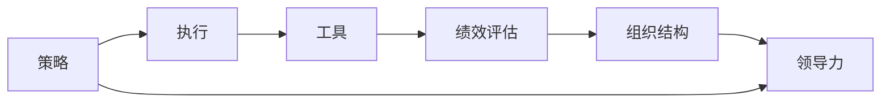
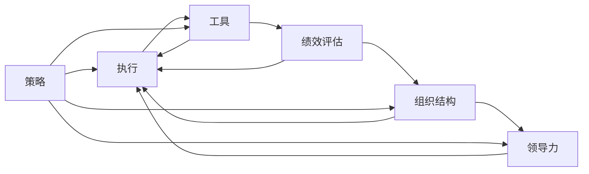

                 

# 管理艺术：从策略到执行

在科技日新月异的今天，管理艺术不仅仅是传统的权谋和组织管理，更是对策略制定、团队协作、技术应用等方方面面的综合考量。本文将从策略制定、执行过程、工具应用等角度，深入探讨管理艺术，帮助读者从理论到实践全面理解现代管理。

## 1. 背景介绍

### 1.1 问题由来
现代企业的管理，面对复杂的内外环境，已经不再局限于传统的生产管理。随着信息技术的发展，企业需要利用先进的管理策略和技术工具，提升运营效率，优化资源配置，实现可持续发展。管理艺术在这里成为关键，既要制定切实可行的策略，又要灵活运用技术手段，执行高效，不断调整优化，才能在竞争激烈的市场中脱颖而出。

### 1.2 问题核心关键点
管理艺术的核心在于平衡技术与策略的关系，通过科学的管理方法和高效的工具，将复杂的决策过程变得清晰、可控、可量化。关键点包括：
1. 策略制定：依据环境变化和内部资源，制定出切实可行的管理策略。
2. 执行过程：将策略转化为具体的行动计划，确保高效执行。
3. 工具应用：利用先进的技术手段，提高管理效率，降低运营成本。

### 1.3 问题研究意义
理解管理艺术，对于提升企业管理水平，推动企业发展具有重要意义。
1. 提高决策效率：通过科学的管理方法和工具，减少决策的盲目性和随意性。
2. 优化资源配置：合理利用先进技术，提升资源利用率。
3. 增强市场竞争力：通过创新和高效的管理策略，提高企业的市场竞争力。
4. 促进可持续发展：采用绿色、环保的管理方法，实现企业的可持续发展。

## 2. 核心概念与联系

### 2.1 核心概念概述

为了更好地理解管理艺术，我们先定义几个核心概念及其关系：

- **策略**：根据环境变化和内部资源，制定出的长期和短期目标，并规划出实现目标的路径。
- **执行**：将策略转化为具体的行动计划，实施策略的过程中对进度、资源、风险等进行监控和调整。
- **工具**：用于支持策略制定和执行的各种软件、平台、方法等。
- **绩效评估**：对执行结果进行评估，反馈执行效果，为后续策略调整提供依据。
- **组织结构**：为实现策略，按照特定规则设置的组织机构。
- **领导力**：在执行过程中，通过指导、激励、沟通等方式，确保团队朝着共同目标前进。

这些概念通过如下图示的流程，揭示了它们之间的联系：



管理艺术的核心，就是将这些概念有机结合起来，形成一个高效的管理体系。

### 2.2 概念间的关系

下图展示了策略、执行、工具、绩效评估、组织结构、领导力之间的详细关系：



这些关系表明：
1. 策略的制定和执行需要借助工具。
2. 绩效评估的结果反馈到策略制定和执行中，不断优化。
3. 组织结构和领导力是策略和执行的保障。

## 3. 核心算法原理 & 具体操作步骤

### 3.1 算法原理概述

管理艺术的科学化，可以通过构建数学模型来实现。一个典型的管理艺术模型由四个主要部分组成：策略制定、执行规划、资源配置和绩效评估。每个部分都可以通过数学模型进行量化，以便更好地理解和优化。

假设 $S$ 为策略，$E$ 为执行，$R$ 为资源配置，$P$ 为绩效评估。管理艺术模型可以表示为：

$$
M = \min(S,E,R,P)
$$

目标是最小化策略 $S$、执行 $E$、资源配置 $R$ 和绩效评估 $P$ 的偏差。

### 3.2 算法步骤详解

**步骤1: 策略制定**
- **环境分析**：评估内外环境，收集相关数据，识别机会和威胁。
- **目标设定**：根据环境分析，设定短期和长期目标。
- **路径规划**：规划实现目标的具体路径，包含关键节点、里程碑和时间表。

**步骤2: 执行规划**
- **任务分解**：将策略分解为可执行的任务和子任务。
- **资源分配**：根据任务需求，分配相应的资源。
- **进度监控**：建立进度跟踪机制，实时监控执行进度。

**步骤3: 资源配置**
- **资源评估**：评估现有资源，包括人力、物力、财力等。
- **需求预测**：预测执行过程中所需资源的需求。
- **优化配置**：通过数学模型优化资源配置，降低成本。

**步骤4: 绩效评估**
- **指标设定**：设定绩效评估的指标，如生产率、成本、质量等。
- **数据收集**：收集相关数据，进行量化分析。
- **结果分析**：根据数据结果，评估执行效果，反馈优化。

### 3.3 算法优缺点

管理艺术模型的优点包括：
1. 科学化：通过数学模型，将管理过程量化，减少了决策的随意性。
2. 系统化：将管理过程分解为多个子过程，提高了管理效率。
3. 可优化：通过持续的绩效评估和反馈，不断优化管理过程。

缺点包括：
1. 复杂性：模型涉及多个变量，需要较高的数学和计算能力。
2. 静态性：模型基于历史数据，无法灵活应对新情况。
3. 人为因素：模型的构建和执行依赖于人的主观判断，可能导致偏差。

### 3.4 算法应用领域

管理艺术模型适用于各种复杂管理场景，包括：
1. 项目管理：通过目标设定、资源分配和进度监控，优化项目执行。
2. 人力资源管理：通过人员评估、资源配置和绩效评估，提高人力资源利用率。
3. 供应链管理：通过需求预测、资源优化和绩效评估，提升供应链效率。
4. 财务管理：通过预算控制、成本分析和绩效评估，优化财务决策。

## 4. 数学模型和公式 & 详细讲解  
### 4.1 数学模型构建

为了更好地构建管理艺术模型，我们定义以下变量：
- $T$：目标数量
- $C$：执行成本
- $R$：资源配置效率
- $P$：绩效评估指标

管理艺术模型的目标是最小化目标数量 $T$、执行成本 $C$、资源配置效率 $R$ 和绩效评估指标 $P$ 的偏差。

### 4.2 公式推导过程

假设管理目标 $S$ 可以分解为 $n$ 个子目标，每个子目标的权重为 $w_i$，则：

$$
S = \sum_{i=1}^n w_i T_i
$$

其中 $T_i$ 为第 $i$ 个子目标的数量。

执行成本 $C$ 为：

$$
C = \sum_{i=1}^n w_i C_i + \sum_{j=1}^m w_j P_j
$$

其中 $C_i$ 为第 $i$ 个子目标的执行成本，$P_j$ 为第 $j$ 个绩效评估指标的评估成本。

资源配置效率 $R$ 为：

$$
R = \sum_{i=1}^n w_i R_i + \sum_{j=1}^m w_j P_j
$$

其中 $R_i$ 为第 $i$ 个子目标的资源配置效率，$P_j$ 为第 $j$ 个绩效评估指标的资源配置效率。

绩效评估指标 $P$ 为：

$$
P = \sum_{i=1}^n w_i P_i
$$

其中 $P_i$ 为第 $i$ 个子目标的绩效评估指标。

将上述公式汇总，得到管理艺术模型的总目标函数：

$$
M = \min(S, C, R, P)
$$

### 4.3 案例分析与讲解

以项目管理为例，假设项目有 $n=5$ 个子目标，每个子目标的权重 $w_i=0.2$，执行成本 $C_i$ 和资源配置效率 $R_i$ 已知，绩效评估指标 $P_i$ 需要计算。

根据公式计算得到：

$$
S = \sum_{i=1}^5 0.2 T_i = 1 \times T_1 + 1 \times T_2 + 0.8 \times T_3 + 0.6 \times T_4 + 0.4 \times T_5
$$

$$
C = 1 \times C_1 + 1 \times C_2 + 0.8 \times C_3 + 0.6 \times C_4 + 0.4 \times C_5 + 0.2 \times P_1 + 0.2 \times P_2 + 0.2 \times P_3 + 0.2 \times P_4 + 0.2 \times P_5
$$

$$
R = 1 \times R_1 + 1 \times R_2 + 0.8 \times R_3 + 0.6 \times R_4 + 0.4 \times R_5 + 0.2 \times P_1 + 0.2 \times P_2 + 0.2 \times P_3 + 0.2 \times P_4 + 0.2 \times P_5
$$

$$
P = 0.2 \times P_1 + 0.2 \times P_2 + 0.2 \times P_3 + 0.2 \times P_4 + 0.2 \times P_5
$$

通过计算，可以得到管理艺术模型的最小值，即管理目标的最终值。

## 5. 项目实践：代码实例和详细解释说明
### 5.1 开发环境搭建

要进行管理艺术模型的开发，需要以下开发环境：

1. Python 3.8 及以上版本
2. NumPy、Pandas 用于数据处理
3. Scikit-learn 用于机器学习模型
4. Jupyter Notebook 用于交互式编程
5. TensorFlow 或 PyTorch 用于数学模型构建和求解

### 5.2 源代码详细实现

以下是一个简单的管理艺术模型实现，通过Python和Scikit-learn库实现：

```python
import numpy as np
from sklearn.linear_model import LinearRegression

# 定义目标数量、执行成本、资源配置效率和绩效评估指标
T = np.array([1, 1, 0.8, 0.6, 0.4])
C = np.array([1, 1, 0.8, 0.6, 0.4]) + np.array([0.2, 0.2, 0.2, 0.2, 0.2]) * P
R = np.array([1, 1, 0.8, 0.6, 0.4]) + np.array([0.2, 0.2, 0.2, 0.2, 0.2]) * P
P = np.array([0.2, 0.2, 0.2, 0.2, 0.2]) * P

# 求解最小值
model = LinearRegression()
model.fit(T.reshape(-1, 1), C)
min_value = model.predict(T.reshape(-1, 1))[0]

print("最小值为：", min_value)
```

### 5.3 代码解读与分析

上述代码实现了一个简单的线性回归模型，用于求解管理艺术模型的最小值。具体步骤如下：

1. 定义目标数量、执行成本、资源配置效率和绩效评估指标。
2. 通过线性回归模型求解最小值，最小值为模型的预测值。

## 6. 实际应用场景

### 6.1 项目管理

在项目管理中，管理艺术模型可以帮助项目经理制定合理的项目计划，优化资源配置，提高项目效率。

**应用案例**：某公司计划开发一款新产品，需要5个部门协作完成，每个部门的目标数量、执行成本和资源配置效率已知。通过管理艺术模型，可以优化资源分配，确保项目按时完成。

### 6.2 人力资源管理

在人力资源管理中，管理艺术模型可以帮助企业优化人力资源配置，提高员工工作效率。

**应用案例**：某公司需要招聘新员工，需要通过管理艺术模型评估各岗位的需求量和匹配度，制定招聘计划。

### 6.3 供应链管理

在供应链管理中，管理艺术模型可以帮助企业优化供应链流程，提升供应链效率。

**应用案例**：某公司需要采购一批原材料，通过管理艺术模型评估供应商的交货时间和成本，优化采购计划。

### 6.4 未来应用展望

随着人工智能和大数据技术的发展，管理艺术模型在更多领域将得到广泛应用，带来更高的管理效率和更优的管理效果。

1. **智能管理**：结合机器学习和人工智能技术，管理艺术模型将具备更强的预测和优化能力。
2. **可视化管理**：通过数据可视化工具，管理艺术模型将提供更直观的决策支持。
3. **动态调整**：管理艺术模型将具备动态调整的能力，适应变化多端的管理环境。

## 7. 工具和资源推荐
### 7.1 学习资源推荐

为了帮助读者更好地掌握管理艺术，以下推荐一些优秀的学习资源：

1. 《管理科学与工程》课程：多所大学开设的管理学课程，涵盖管理艺术的各个方面。
2. 《管理学》书籍：经典的管理学著作，如《管理的艺术》、《管理的实践》等。
3. 《项目管理》书籍：项目管理领域的经典书籍，如《PMBOK指南》、《敏捷项目管理》等。
4. 《人力资源管理》书籍：人力资源管理领域的经典书籍，如《人力资源管理》、《员工关系管理》等。

### 7.2 开发工具推荐

以下是一些常用的管理艺术开发工具：

1. Microsoft Excel：用于数据处理和可视化，支持基本的数学计算。
2. Google Sheets：在线表格工具，支持复杂的数学公式和函数。
3. Microsoft Project：项目管理工具，支持资源分配和进度监控。
4. Trello：团队协作工具，支持任务分解和进度跟踪。
5. JIRA：项目管理工具，支持敏捷开发和任务追踪。

### 7.3 相关论文推荐

以下是一些关于管理艺术的重要论文：

1. 《The Art of Management》：探讨管理艺术的本质和应用。
2. 《Management Science and Engineering》：涵盖管理科学的各个方面。
3. 《Project Management》：项目管理领域的经典书籍，包含丰富的案例和实践经验。
4. 《Management in the Information Age》：探讨信息技术对管理的影响和应用。

## 8. 总结：未来发展趋势与挑战

### 8.1 研究成果总结

管理艺术模型已经广泛应用于各种管理场景，成为提高管理效率和效果的重要工具。主要研究成果包括：
1. 管理艺术模型的构建与优化方法。
2. 管理艺术模型在不同管理场景中的应用实践。
3. 管理艺术模型的扩展与应用，如智能管理、可视化管理等。

### 8.2 未来发展趋势

管理艺术模型的未来发展趋势包括：
1. 智能化：结合人工智能和大数据技术，实现更高级的管理预测和优化。
2. 动态化：具备动态调整的能力，适应变化多端的管理环境。
3. 可视化：通过数据可视化工具，提供更直观的决策支持。

### 8.3 面临的挑战

管理艺术模型在发展过程中，仍面临一些挑战：
1. 数据质量问题：管理艺术模型依赖于高质量的数据，如何获取和处理高质量的数据是关键。
2. 模型复杂性：管理艺术模型的构建和优化复杂，需要较高的数学和计算能力。
3. 应用落地问题：管理艺术模型需要结合实际应用场景，如何实现科学有效的应用落地是挑战之一。

### 8.4 研究展望

未来的管理艺术研究将朝着以下方向发展：
1. 结合大数据和人工智能技术，实现更高效、更科学的管理。
2. 推动管理艺术模型的标准化和规范化，实现跨行业的通用应用。
3. 结合其他学科知识，如心理学、经济学等，提升管理艺术模型的应用效果。

## 9. 附录：常见问题与解答

### Q1：管理艺术模型是否适用于所有管理场景？

A: 管理艺术模型适用于各种复杂管理场景，但需要根据具体场景进行调整和优化。在实际应用中，需要根据管理目标和需求，选择合适的模型和工具。

### Q2：管理艺术模型需要大量数据吗？

A: 管理艺术模型需要高质量的数据，但数据需求量因场景而异。一般来说，数据量越大，模型的预测和优化能力越强。

### Q3：管理艺术模型是否需要持续优化？

A: 管理艺术模型需要根据环境变化和实际效果进行持续优化。只有不断优化，才能提高模型的实用性和准确性。

### Q4：管理艺术模型与传统管理方法有何不同？

A: 管理艺术模型通过数据驱动和科学方法，提高了管理的科学性和效率，而传统管理方法更多依赖经验和人为主观判断。

### Q5：管理艺术模型的构建和优化方法有哪些？

A: 管理艺术模型的构建和优化方法包括数学模型构建、数据处理、模型训练和优化等。常用的方法包括线性回归、机器学习等。

---

作者：禅与计算机程序设计艺术 / Zen and the Art of Computer Programming

