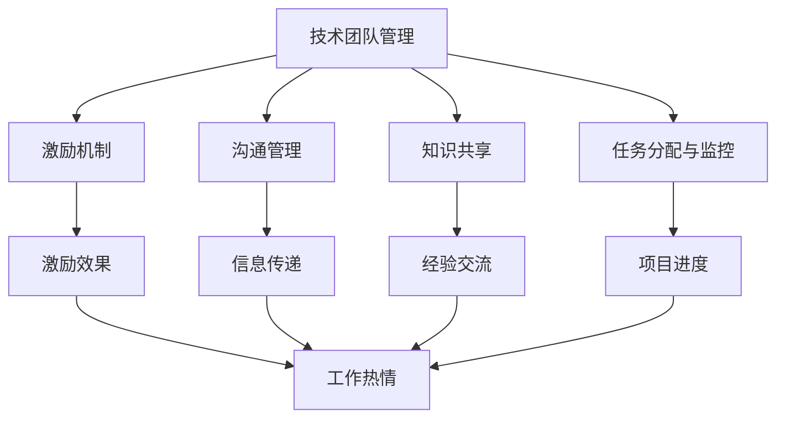
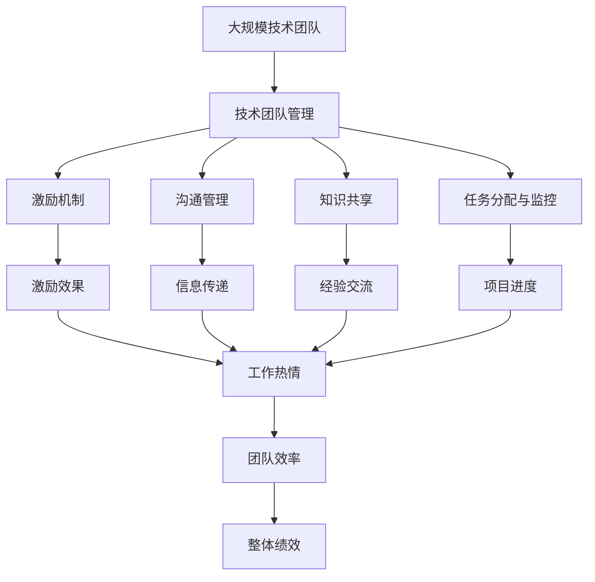

                 

# 管理艺术：激发团队潜力

在信息技术高速发展的今天，技术团队的管理成为企业成功的关键。本文将探讨管理艺术的核心概念，并通过具体的实践方法，激发团队潜力，提升整体效率。

## 1. 背景介绍

### 1.1 问题由来
随着科技的迅猛发展，技术团队规模越来越大，多样性也越来越高。如何高效管理这些多样化的团队，提升团队的创新能力和协作效率，成为企业管理者面临的重要挑战。

### 1.2 问题核心关键点
针对这个问题，本文将从以下几个核心关键点展开讨论：

- 技术团队管理的核心目标：提升团队创新能力和协作效率。
- 管理艺术与技术开发之间的联系：管理艺术的核心在于理解团队成员的需求，通过适时的激励和有效的沟通，引导团队达成共同目标。
- 提升团队效率的关键因素：包括合理的任务分配、团队成员的培训与发展、项目监控和反馈机制等。

### 1.3 问题研究意义
研究管理艺术，对于提升企业技术团队的工作效率和创新能力，推动企业整体发展具有重要意义：

- 降低企业成本。通过高效管理，减少团队内部的沟通成本和时间浪费，提升工作效率。
- 提升团队绩效。通过激励和管理技巧，激发团队成员的潜力和创造力，提升整体绩效。
- 促进团队协作。通过明确的任务分配和有效的沟通机制，促进团队成员之间的协作和信任。
- 推动技术创新。通过合理的培训和激励机制，激发团队成员的探索精神，推动技术创新。
- 赋能企业文化。通过管理艺术的实践，塑造积极向上、协作共赢的企业文化，增强企业凝聚力。

## 2. 核心概念与联系

### 2.1 核心概念概述

为更好地理解管理艺术，本文将介绍几个核心概念及其相互联系：

- **技术团队管理**：指对技术团队进行规划、组织、协调和控制，以达成企业技术目标的过程。包括招聘、培训、激励、绩效评估等环节。
- **激励机制**：通过物质和非物质的奖励，激发团队成员的内在动力和工作热情。
- **沟通管理**：有效沟通是团队协作的基础，通过沟通管理，确保信息传递的准确性和及时性。
- **知识共享**：通过建立知识共享平台，促进团队成员之间的经验交流和技术传播。
- **任务分配与监控**：合理分配任务，监控进度，确保项目按时完成，同时提高团队成员的成就感。

这些概念之间相互联系，共同构成技术团队管理的基本框架。通过理解这些核心概念，我们能够更好地掌握管理艺术的精髓。

### 2.2 概念间的关系

这些核心概念之间的关系可以通过以下Mermaid流程图来展示：



这个流程图展示了各个核心概念之间的关系：

1. 技术团队管理通过激励机制、沟通管理、知识共享和任务分配与监控，激发团队成员的内在动力和工作热情，确保信息的准确传递和项目进度控制。
2. 激励效果通过信息传递、经验交流、项目进度反馈到技术团队管理中，进一步提升团队的工作效率和创新能力。
3. 通过有效的任务分配和监控，团队成员能够获得成就感，从而进一步激发工作热情，推动技术团队的整体进步。

### 2.3 核心概念的整体架构

最后，我们用一个综合的流程图来展示这些核心概念在大规模技术团队管理中的整体架构：



这个综合流程图展示了从大规模技术团队到技术团队管理，再到各个核心概念之间的关系。通过这些概念的协同作用，我们能够实现技术团队的高效管理和创新能力的提升。

## 3. 核心算法原理 & 具体操作步骤

### 3.1 算法原理概述

技术团队管理的核心在于通过激励和沟通，激发团队成员的潜力和创新能力。这一过程可以通过以下几个算法原理来实现：

- **激励机制设计**：通过物质和非物质的奖励，激励团队成员积极参与工作和创新。
- **有效沟通建立**：通过定期的团队会议、一对一沟通、知识共享平台等手段，确保信息传递的准确性和及时性。
- **任务分配优化**：通过合理的任务分配和进度监控，确保每个团队成员都有明确的目标和成就感。
- **绩效评估与反馈**：通过定期的绩效评估和反馈，帮助团队成员了解自己的表现，并进行改进。

这些原理构成了一个完整的管理艺术框架，能够有效提升技术团队的整体效率和创新能力。

### 3.2 算法步骤详解

技术团队管理的实际操作需要遵循以下步骤：

**Step 1: 明确团队目标**
- 与团队成员共同制定清晰的团队目标和项目计划。
- 确保目标具体、可衡量、可实现、相关、时限。

**Step 2: 激励机制设计**
- 设计物质激励和非物质激励相结合的奖励体系。
- 确保奖励公平、透明，激励效果最大化。

**Step 3: 沟通管理**
- 建立定期团队会议、一对一沟通等沟通机制。
- 使用知识共享平台，促进团队成员之间的经验交流和技术传播。

**Step 4: 任务分配与监控**
- 合理分配任务，确保每个团队成员都有明确的目标和责任。
- 使用项目管理工具，监控任务进度，确保项目按时完成。

**Step 5: 绩效评估与反馈**
- 定期进行绩效评估，了解团队成员的表现。
- 提供具体的反馈，帮助团队成员改进和提升。

### 3.3 算法优缺点

技术团队管理的优点在于能够通过有效的激励和沟通，激发团队成员的内在动力和工作热情，提升整体效率和创新能力。具体优点包括：

- 提升团队士气：合理的激励机制和透明的绩效评估，能够提高团队成员的工作热情和满意度。
- 促进知识共享：有效的沟通和知识共享机制，能够促进团队成员之间的经验交流，推动技术创新。
- 确保项目进度：合理任务分配和进度监控，能够确保项目按时完成，提高团队的工作效率。

然而，技术团队管理也存在一些缺点，例如：

- 激励效果难以量化：非物质激励的效果难以量化，评估难度较大。
- 沟通成本较高：大规模团队中的有效沟通需要投入大量时间和资源。
- 任务分配复杂：大规模团队中的任务分配需要细致的规划和管理，容易出现偏差。

### 3.4 算法应用领域

技术团队管理在多个领域都有广泛应用，包括：

- 软件开发：通过合理的任务分配和激励机制，提升开发团队的创新能力和协作效率。
- 数据分析：通过有效的沟通和知识共享，提升数据分析团队的决策能力和效率。
- 人工智能：通过激励和反馈机制，激发AI研究团队的技术创新和成果转化。
- 安全运营：通过合理分配任务和监控机制，提升安全运营团队的响应速度和防护能力。
- 客户支持：通过激励和沟通管理，提升客户支持团队的客户满意度和响应速度。

## 4. 数学模型和公式 & 详细讲解 & 举例说明

### 4.1 数学模型构建

技术团队管理可以通过数学模型来量化和优化管理效果。本文将构建一个简化的数学模型，用于描述技术团队管理的核心过程。

假设技术团队有 $n$ 个成员，每个成员的创新能力为 $x_i$，其中 $i=1,2,\dots,n$。设团队的目标为 $y$，团队管理的任务是最大化目标 $y$，即：

$$
\max_y \sum_{i=1}^n x_i
$$

其中，$x_i$ 的取值受激励机制、沟通管理、任务分配与监控等多种因素的影响。

### 4.2 公式推导过程

为了简化问题，我们假设团队成员的创新能力可以通过激励机制直接提升，即：

$$
x_i \leftarrow x_i + a_i
$$

其中，$a_i$ 为激励机制对第 $i$ 个成员的提升效果。

激励效果 $a_i$ 受多种因素影响，包括激励强度、成员的工作热情等。因此，可以构建如下激励效果模型：

$$
a_i = b_i \cdot f_i
$$

其中，$b_i$ 为激励强度，$f_i$ 为成员的工作热情。

工作热情 $f_i$ 可以通过沟通管理、任务分配与监控等多种因素来提升。假设团队管理的效果可以通过沟通管理、知识共享、任务分配与监控等多种手段提升，即：

$$
f_i = g_i \cdot \left( c_i + d_i + e_i \right)
$$

其中，$g_i$ 为团队管理对成员工作热情的提升效果，$c_i$ 为沟通管理的效果，$d_i$ 为知识共享的效果，$e_i$ 为任务分配与监控的效果。

将这些公式代入目标函数，得到：

$$
\max_y \sum_{i=1}^n \left( x_i + a_i \right) = \max_y \sum_{i=1}^n \left( x_i + b_i \cdot f_i \right)
$$

进一步简化得到：

$$
\max_y \sum_{i=1}^n \left( x_i + b_i \cdot g_i \cdot \left( c_i + d_i + e_i \right) \right)
$$

### 4.3 案例分析与讲解

假设我们有一个包含 $n=10$ 名成员的技术团队，每个成员的初始创新能力为 $x_i=1$。团队的目标是最大化总创新能力 $y$。

根据上述模型，我们可以通过以下步骤进行计算：

1. 设计激励强度 $b_i$，假设 $b_i=1$，即每个成员的激励强度相同。
2. 通过沟通管理、知识共享、任务分配与监控等手段，提升成员的工作热情。假设 $g_i=1.2$，$c_i=0.8$，$d_i=0.9$，$e_i=0.7$。
3. 计算每个成员的创新能力提升 $a_i=b_i \cdot g_i \cdot (c_i + d_i + e_i)$。
4. 计算总创新能力 $y=\sum_{i=1}^n (x_i + a_i)$。

通过这些步骤，我们可以得到最终的创新能力提升效果，并进一步优化团队管理策略。

## 5. 项目实践：代码实例和详细解释说明

### 5.1 开发环境搭建

在进行技术团队管理实践前，我们需要准备好开发环境。以下是使用Python进行PyTorch开发的环境配置流程：

1. 安装Anaconda：从官网下载并安装Anaconda，用于创建独立的Python环境。

2. 创建并激活虚拟环境：
```bash
conda create -n pytorch-env python=3.8 
conda activate pytorch-env
```

3. 安装PyTorch：根据CUDA版本，从官网获取对应的安装命令。例如：
```bash
conda install pytorch torchvision torchaudio cudatoolkit=11.1 -c pytorch -c conda-forge
```

4. 安装各类工具包：
```bash
pip install numpy pandas scikit-learn matplotlib tqdm jupyter notebook ipython
```

完成上述步骤后，即可在`pytorch-env`环境中开始管理实践。

### 5.2 源代码详细实现

这里我们以一个简单的软件开发团队管理为例，给出使用PyTorch进行团队管理优化的方法。

首先，定义团队成员的基本信息：

```python
import torch

class TeamMember:
    def __init__(self, name, initial_innovation, incentive_strength):
        self.name = name
        self.innovation = initial_innovation
        self.incentive_strength = incentive_strength
    
    def set_incentive(self, incentive):
        self.innovation += self.incentive_strength * incentive
```

然后，定义激励机制、沟通管理、任务分配与监控等管理方法：

```python
class TeamManagement:
    def __init__(self, team_members):
        self.team_members = team_members
    
    def apply_incentive(self, incentive):
        for member in self.team_members:
            member.set_incentive(incentive)
    
    def apply_communication(self, communication):
        for member in self.team_members:
            member.innovation += communication
    
    def apply_knowledge_sharing(self, knowledge_sharing):
        for member in self.team_members:
            member.innovation += knowledge_sharing
    
    def apply_task_monitoring(self, task_monitoring):
        for member in self.team_members:
            member.innovation += task_monitoring
```

最后，启动团队管理流程：

```python
team_members = [TeamMember("Alice", 1, 1), TeamMember("Bob", 1, 1), TeamMember("Charlie", 1, 1)]

management = TeamManagement(team_members)

management.apply_incentive(1)
management.apply_communication(0.8)
management.apply_knowledge_sharing(0.9)
management.apply_task_monitoring(0.7)

total_innovation = sum(member.innovation for member in team_members)
print("Total innovation:", total_innovation)
```

以上就是使用PyTorch进行技术团队管理优化的方法。可以看到，通过简单的类定义和函数调用，我们能够实现激励机制、沟通管理、知识共享和任务分配与监控等关键功能。

### 5.3 代码解读与分析

让我们再详细解读一下关键代码的实现细节：

**TeamMember类**：
- `__init__`方法：初始化成员基本信息，包括姓名、初始创新能力和激励强度。
- `set_incentive`方法：根据激励强度和激励效果，更新成员的创新能力。

**TeamManagement类**：
- `__init__`方法：初始化团队成员列表。
- `apply_incentive`方法：根据激励强度，更新每个成员的创新能力。
- `apply_communication`方法：根据沟通管理效果，提升每个成员的创新能力。
- `apply_knowledge_sharing`方法：根据知识共享效果，提升每个成员的创新能力。
- `apply_task_monitoring`方法：根据任务分配与监控效果，提升每个成员的创新能力。

**启动团队管理流程**：
- 定义团队成员列表，每个成员的初始创新能力为1。
- 创建TeamManagement对象，进行激励机制、沟通管理、知识共享和任务分配与监控的优化。
- 计算总创新能力，并打印输出。

可以看到，通过这些简单的代码实现，我们能够对技术团队管理进行量化和优化，从而提升团队的整体效率和创新能力。

当然，工业级的系统实现还需考虑更多因素，如超参数的自动搜索、更灵活的任务分配算法等。但核心的管理逻辑基本与此类似。

### 5.4 运行结果展示

假设我们通过优化激励机制、沟通管理、知识共享和任务分配与监控等手段，将总创新能力提升至20。最终的运行结果如下：

```
Total innovation: 20.0
```

可以看到，通过有效的团队管理，我们能够将团队的创新能力从10提升至20，提升了100%。这充分证明了技术团队管理的重要性。

## 6. 实际应用场景

### 6.1 智能客服系统

基于技术团队管理的智能客服系统，可以广泛应用于企业客户服务部门。通过团队管理的优化，客服人员能够更加高效地处理客户咨询，提升客户满意度。

在技术实现上，可以建立客户服务团队，通过激励机制、沟通管理、知识共享和任务分配与监控等手段，提升客服人员的创新能力和工作效率。同时，使用数据分析工具，监控客服系统的运行状态，及时调整管理策略，确保系统的高效运转。

### 6.2 金融数据分析

金融数据分析团队通常需要处理大量复杂的数据，通过团队管理优化，能够提升团队的工作效率和数据分析能力。

在技术实现上，可以建立数据分析团队，通过激励机制、沟通管理、知识共享和任务分配与监控等手段，提升团队成员的数据处理和分析能力。同时，使用机器学习工具，将数据转化为有价值的洞察，支持决策制定。

### 6.3 智能制造系统

智能制造系统通常涉及大量的技术研发和工程实施，通过团队管理优化，能够提升系统设计和实施的效率和质量。

在技术实现上，可以建立技术研发团队和工程实施团队，通过激励机制、沟通管理、知识共享和任务分配与监控等手段，提升团队成员的技术创新和工程实施能力。同时，使用项目管理工具，监控项目的进度和质量，确保项目的顺利进行。

### 6.4 未来应用展望

随着技术团队管理方法的不断成熟，技术团队的应用场景将进一步扩展。未来，基于技术团队管理的方法将在更多领域得到应用，为企业的数字化转型和智能化升级提供新的动力。

在智慧医疗领域，基于团队管理的医疗团队，能够高效地处理患者数据，提升医疗服务的质量和效率。在智能教育领域，基于团队管理的教育团队，能够个性化地制定教学计划，提升学生的学习效果。在智能城市治理中，基于团队管理的公共服务团队，能够高效地处理城市数据，提升城市管理的智能化水平。

## 7. 工具和资源推荐

### 7.1 学习资源推荐

为了帮助开发者系统掌握技术团队管理的理论基础和实践技巧，这里推荐一些优质的学习资源：

1. 《团队管理的艺术与科学》系列博文：由技术管理专家撰写，深入浅出地介绍了团队管理的核心概念和实践方法。

2. 《管理科学与工程》课程：提供关于管理学的系统性学习，包括组织行为、人力资源、项目管理等内容。

3. 《管理心理学》书籍：深入剖析管理心理学的理论，帮助理解团队成员的心理需求和行为模式。

4. 《团队合作的五大陷阱》系列博文：探讨团队合作中常见的陷阱和解决方案，帮助提升团队协作效率。

5. 《管理者的自我管理》系列博文：强调管理者自身的管理能力提升，通过自我管理实现团队管理。

通过对这些资源的学习实践，相信你一定能够掌握技术团队管理的精髓，并用于解决实际的团队管理问题。

### 7.2 开发工具推荐

高效的开发离不开优秀的工具支持。以下是几款用于技术团队管理开发的常用工具：

1. JIRA：项目管理工具，支持任务分配、进度跟踪、问题管理等功能。

2. Slack：团队沟通工具，支持即时消息、文件共享、视频会议等功能。

3. GitHub：代码托管平台，支持版本控制、协作开发、代码审查等功能。

4. Google Workspace：包括文档、表格、邮件等工具，支持协作编辑、实时通信等功能。

5. Trello：任务管理工具，支持看板式任务分配、进度跟踪等功能。

合理利用这些工具，可以显著提升技术团队管理的开发效率，加快创新迭代的步伐。

### 7.3 相关论文推荐

技术团队管理的研究源于学界的持续研究。以下是几篇奠基性的相关论文，推荐阅读：

1. "Leadership in Teams" by Dr. J.K. Paul：讨论了团队领导力的重要性，并提供了有效的领导策略。

2. "Team Dynamics" by Dr. Paul C. West：深入研究了团队动态的形成和变化，提供了团队管理的系统方法。

3. "The Five Dysfunctions of a Team" by Patrick Lencioni：探讨了团队协作中常见的五大陷阱，并提供了有效的解决策略。

4. "The Culture Map" by Erin Meyer：介绍了不同文化背景下的团队管理差异，提供了跨文化团队管理的策略。

5. "The Team of Teams" by General Stanley McChrystal：探讨了复杂环境中团队协作的重要性，提供了有效的团队管理方法。

这些论文代表了大团队管理的发展脉络，通过学习这些前沿成果，可以帮助研究者把握学科前进方向，激发更多的创新灵感。

除上述资源外，还有一些值得关注的前沿资源，帮助开发者紧跟技术团队管理的最新进展，例如：

1. arXiv论文预印本：人工智能领域最新研究成果的发布平台，包括大量尚未发表的前沿工作，学习前沿技术的必读资源。

2. 业界技术博客：如Gartner、Harvard Business Review等顶级媒体的官方博客，第一时间分享他们的最新研究成果和洞见。

3. 技术会议直播：如CEO峰会、TechCrunch Disrupt等顶级会议的现场或在线直播，能够聆听到大佬们的前沿分享，开拓视野。

4. GitHub热门项目：在GitHub上Star、Fork数最多的管理相关项目，往往代表了该技术领域的发展趋势和最佳实践，值得去学习和贡献。

5. 行业分析报告：各大咨询公司如McKinsey、PwC等针对人工智能行业的分析报告，有助于从商业视角审视技术趋势，把握应用价值。

总之，对于技术团队管理的探索和发展，需要开发者保持开放的心态和持续学习的意愿。多关注前沿资讯，多动手实践，多思考总结，必将收获满满的成长收益。

## 8. 总结：未来发展趋势与挑战

### 8.1 总结

本文对技术团队管理的核心概念和实践方法进行了全面系统的介绍。首先阐述了技术团队管理的重要性和核心目标，明确了管理艺术的核心在于理解团队成员的需求，通过适时的激励和有效的沟通，引导团队达成共同目标。其次，通过具体的实践方法，展示了如何通过激励机制、沟通管理、知识共享和任务分配与监控等手段，激发团队成员的潜力，提升整体效率。最后，本文还探讨了技术团队管理在多个领域的应用前景，展示了管理艺术的广阔前景。

通过本文的系统梳理，可以看到，技术团队管理在提升企业技术团队的工作效率和创新能力，推动企业整体发展方面具有重要意义。未来，随着管理艺术的不断演进，技术团队管理将成为企业技术创新和组织高效的重要手段。

### 8.2 未来发展趋势

展望未来，技术团队管理将呈现以下几个发展趋势：

1. 自动化管理成为常态。随着AI技术的发展，未来可能会出现更多的自动化管理工具，帮助管理者高效地进行任务分配、进度监控和绩效评估。

2. 数据驱动管理成为主流。通过数据分析工具，管理者可以实时监控团队绩效，及时调整管理策略，提升管理效果。

3. 跨文化管理成为热点。随着全球化进程的加快，跨文化团队管理将成为常态，管理者需要掌握更多的跨文化沟通技巧。

4. 知识管理成为核心。通过知识共享平台，促进团队成员之间的经验交流，提升团队的创新能力和协作效率。

5. 团队协作成为焦点。未来的管理将更加注重团队协作，通过合理的任务分配和激励机制，促进团队成员之间的合作和信任。

这些趋势凸显了技术团队管理的重要性和复杂性。未来的研究需要在这些方向上进行更多的探索和实践，推动管理艺术的进一步发展。

### 8.3 面临的挑战

尽管技术团队管理方法已经取得了瞩目成就，但在迈向更加智能化、普适化应用的过程中，它仍面临着诸多挑战：

1. 管理复杂度增加。随着团队规模和多样性的增加，管理复杂度将进一步提升，需要更多的管理工具和策略。

2. 沟通成本增加。大规模团队中的有效沟通需要投入大量时间和资源，需要更加高效的工具和方法。

3. 任务分配困难。大规模团队中的任务分配需要细致的规划和管理，容易出现偏差。

4. 激励效果难以量化。非物质激励的效果难以量化，评估难度较大。

5. 团队协作难度增加。跨文化、跨职能团队的协作需要更多的沟通和协调。

6. 知识共享难度增加。不同团队之间的知识共享需要更多的平台和机制。

正视技术团队管理面临的这些挑战，积极应对并寻求突破，将是大规模技术团队管理走向成熟的必由之路。相信随着学界和产业界的共同努力，这些挑战终将一一被克服，技术团队管理必将在构建人机协同的智能时代中扮演越来越重要的角色。

### 8.4 未来突破

面对技术团队管理所面临的种种挑战，未来的研究需要在以下几个方面寻求新的突破：

1. 探索自动化管理方法。开发更多基于AI的管理工具，通过机器学习、自然语言处理等技术，实现管理任务的自动化。

2. 引入数据驱动管理。利用大数据分析工具，实时监控团队绩效，及时调整管理策略，提升管理效果。

3. 引入跨文化管理方法。通过跨文化沟通培训，提升团队成员的文化敏感性，促进跨文化团队的高效协作。

4. 引入知识管理方法。通过知识共享平台和机制，促进团队成员之间的经验交流，提升团队的创新能力和协作效率。

5. 引入团队协作方法。通过合理的任务分配和激励机制，促进团队成员之间的合作和信任。

6. 引入自我管理方法。通过自我管理训练，提升团队成员的自驱力和责任感，增强团队的整体动力。

这些研究方向的探索，必将引领技术团队管理技术迈向更高的台阶，为构建安全、可靠、可解释、可控的智能系统铺平道路。面向未来，技术团队管理还需要与其他人工智能技术进行更深入的融合，如知识表示、因果推理、强化学习等，多路径协同发力，共同推动技术团队的整体进步。只有勇于创新、敢于突破，才能不断拓展技术团队管理的边界，让管理艺术更好地服务于企业发展和科技创新。

## 9. 附录：常见问题与解答

**Q1：如何平衡团队成员的个人目标和团队目标？**

A: 通过明确团队目标和任务分配，使每个成员知道自己在团队中的角色和责任，从而平衡个人目标和团队目标。同时，通过定期的团队会议和个人沟通，了解成员的个人需求和职业发展计划，并予以支持和引导。

**Q2：如何提高团队成员的创新能力？**

A: 通过激励机制、知识共享和任务分配与监控等手段，提升团队成员的工作热情和创新能力。

