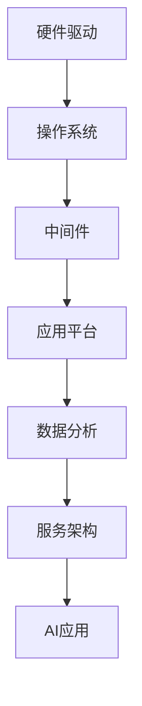
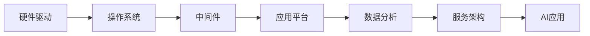

                 

## 1. 背景介绍

### 1.1 问题由来
在当前的技术发展浪潮中，人工智能（AI）正成为推动社会进步、促进经济增长的关键力量。然而，AI的发展并非一帆风顺，诸多挑战与瓶颈亟待解决。特别是，系统的可扩展性、稳定性和安全性成为制约AI技术发展的重要因素。

系统软件作为AI技术体系的基础支撑，直接关系到整个AI生态系统的稳定性和可持续性。系统软件的可靠性、稳定性和高性能，是AI技术能够安全运行、稳定扩展和灵活迭代的前提。因此，探讨系统软件在AI创新体系中的重要性，具有重要理论和现实意义。

### 1.2 问题核心关键点
系统软件的重要性主要体现在以下几个方面：

- **基础设施**：系统软件为AI算法、模型和应用提供了必要的基础设施，包括硬件驱动、操作系统、数据库、网络协议等。这些基础设施的稳定性和高效性，直接影响AI系统的性能。
- **中间件**：系统软件中的中间件提供了数据传输、分布式计算、负载均衡、安全管理等功能，为AI应用的高效运行提供了保障。
- **应用平台**：系统软件中的应用平台（如Web应用、移动应用、桌面应用等）提供了用户交互界面，使得AI算法和模型能够被大众广泛使用。
- **数据分析**：系统软件中的数据管理系统（如大数据、数据库、数据湖等）提供了数据存储、处理和分析的能力，为AI模型训练和优化提供了重要数据支撑。
- **服务架构**：系统软件中的微服务、API网关等架构，支持AI系统的模块化、可扩展性和弹性，是AI系统迭代升级的关键。

### 1.3 问题研究意义
系统软件在AI创新体系中具有不可替代的重要作用，研究其重要性有助于我们更好地理解AI技术体系的构建和运行机制。系统软件作为AI技术的基础设施和支撑平台，对AI的应用、扩展和安全有着深远的影响。了解和优化系统软件，可以提升AI技术的整体性能，推动AI技术在更广泛的领域中落地应用。

## 2. 核心概念与联系

### 2.1 核心概念概述

系统软件在AI创新体系中的作用可以从多个维度进行剖析：

- **基础设施**：包括硬件驱动、操作系统、数据库等，为AI应用提供底层支持。
- **中间件**：如消息队列、负载均衡、分布式数据库等，提供系统内部和外部通信和数据处理的功能。
- **应用平台**：包括Web、移动、桌面等应用平台，为用户提供直接交互界面。
- **数据分析**：如大数据、数据仓库、数据湖等，提供数据存储、处理和分析能力。
- **服务架构**：如微服务、API网关等，支持系统的模块化、可扩展性和弹性。

这些概念相互交织，构成了系统软件在AI创新体系中的核心框架。以下是一个Mermaid流程图，展示系统软件在AI体系中的关键作用和联系：



这个流程图展示了系统软件在AI体系中的基础设施、通信、计算、存储和应用各环节中的作用。硬件驱动和操作系统提供底层支持；中间件实现通信和数据处理；应用平台提供用户接口；数据分析提供数据支持；服务架构提供系统扩展和弹性。

### 2.2 概念间的关系

系统软件中的各个组成部分相互配合，共同支撑AI创新体系的运行。具体来说，硬件驱动和操作系统是AI应用运行的基础；中间件实现系统内部的通信和数据处理；应用平台提供用户接口；数据分析提供数据支持；服务架构提供系统扩展和弹性。这些概念之间的关系可以通过以下Mermaid流程图来展示：



这个流程图展示了系统软件各组成部分之间的相互依赖关系。硬件驱动和操作系统是基础，中间件实现通信和数据处理，应用平台提供用户接口，数据分析提供数据支持，服务架构提供系统扩展和弹性。

### 2.3 核心概念的整体架构

最后，我们用一个综合的流程图来展示系统软件在AI创新体系中的整体架构：


这个综合流程图展示了系统软件在AI创新体系中的整体架构，从基础设施到应用平台的各个环节相互依赖，共同支持AI应用的运行和扩展。

## 3. 核心算法原理 & 具体操作步骤
### 3.1 算法原理概述

系统软件在AI创新体系中的重要性，不仅体现在其提供的基础设施和支撑平台，更在于其背后的算法原理和技术实现。以下是系统软件中几个关键算法的概述：

- **分布式计算**：在AI系统中，数据和计算任务通常分布在多个节点上进行，分布式计算算法（如MapReduce、Spark）能够高效地管理和调度这些任务，保证系统的计算效率和扩展性。
- **负载均衡**：通过动态调整资源分配，保证系统的负载均衡，避免单一节点的过载和资源浪费。
- **数据管理**：通过高效的数据存储和处理算法（如Hadoop、Flink等），实现大规模数据的快速读写和分析。
- **网络协议**：通过优化网络协议（如TCP/IP、HTTP/HTTPS等），提高系统的网络通信效率和安全性。
- **安全管理**：通过加密、访问控制、身份认证等技术，保证系统数据的隐私和安全。

### 3.2 算法步骤详解

系统软件的核心算法步骤通常包括以下几个环节：

1. **需求分析**：明确系统目标和功能需求，确定系统架构和技术方案。
2. **设计实现**：基于需求分析，设计系统各组件的功能和接口，实现具体功能。
3. **测试优化**：对系统进行全面测试，包括单元测试、集成测试、性能测试和安全测试，优化系统性能和稳定性。
4. **部署上线**：将系统部署到生产环境，进行监控和维护，保证系统稳定运行。

### 3.3 算法优缺点

系统软件的核心算法具备以下优点：

- **高可扩展性**：通过分布式计算和负载均衡等技术，系统可以高效地扩展计算资源和数据处理能力。
- **高性能**：优化算法能够提高系统的计算效率和网络通信效率，满足AI算法的高性能需求。
- **高可靠性**：冗余设计、故障切换等机制，确保系统的稳定性和高可用性。
- **高安全性**：加密、访问控制等安全技术，保障系统数据和算法的安全。

同时，系统软件也存在一些缺点：

- **复杂性高**：系统软件架构复杂，涉及硬件、网络、安全等多个领域，开发和维护难度较大。
- **资源消耗高**：系统软件需要大量的计算资源和存储资源，成本较高。
- **开发周期长**：系统软件的开发周期较长，需要经过需求分析、设计实现、测试优化等多个环节。

### 3.4 算法应用领域

系统软件作为AI创新体系的基础设施，广泛应用于以下领域：

- **大数据分析**：通过数据管理系统和大数据算法，实现大规模数据的存储、处理和分析。
- **云计算**：通过分布式计算和弹性调度算法，支持云平台的高效计算和资源管理。
- **分布式AI**：通过分布式计算和负载均衡算法，支持大规模AI模型的训练和推理。
- **自动化测试**：通过测试框架和自动化工具，实现系统的高效测试和持续集成。
- **网络通信**：通过网络协议和安全算法，实现高效的网络通信和数据传输。

## 4. 数学模型和公式 & 详细讲解  
### 4.1 数学模型构建

系统软件的核心算法通常涉及数据管理、分布式计算、负载均衡、安全管理等多个领域，以下我们将以数据管理系统为例，介绍其数学模型构建。

假设系统中有n个数据节点，每个节点上有m个数据块，每个数据块的大小为s。系统的数据处理算法可以表示为：

$$
\text{处理时间} = \sum_{i=1}^{n} \sum_{j=1}^{m} \frac{s}{b_i} \times t_i
$$

其中，$b_i$为第i个节点的带宽，$t_i$为节点i的处理时间。

### 4.2 公式推导过程

在分布式计算中，处理时间公式可以进一步推导为：

$$
\text{处理时间} = \frac{n \times m \times s}{\min(b_1, b_2, \ldots, b_n)} \times T
$$

其中，$T$为单个数据块处理时间。

### 4.3 案例分析与讲解

以Hadoop分布式计算为例，其数据处理算法可以通过MapReduce框架实现。MapReduce框架将大规模数据划分为多个小数据块，在分布式集群上并行处理。通过优化MapReduce的计算图和任务调度算法，可以显著提升系统的计算效率和扩展性。

## 5. 项目实践：代码实例和详细解释说明
### 5.1 开发环境搭建

在进行系统软件项目实践前，我们需要准备好开发环境。以下是使用Python进行Django开发的环境配置流程：

1. 安装Anaconda：从官网下载并安装Anaconda，用于创建独立的Python环境。

2. 创建并激活虚拟环境：
```bash
conda create -n django-env python=3.8 
conda activate django-env
```

3. 安装Django：
```bash
pip install django
```

4. 安装各类工具包：
```bash
pip install numpy pandas scikit-learn matplotlib tqdm jupyter notebook ipython
```

完成上述步骤后，即可在`django-env`环境中开始项目实践。

### 5.2 源代码详细实现

这里我们以Django框架开发一个简单的API服务为例，展示系统软件项目的代码实现。

首先，定义API服务的基本结构：

```python
from django.urls import path
from django.http import HttpResponse

def hello_world(request):
    return HttpResponse("Hello, World!")
```

然后，配置Django项目的URL路由：

```python
urlpatterns = [
    path('hello/', hello_world),
]
```

最后，启动Django服务：

```bash
python manage.py runserver 0.0.0.0:8000
```

### 5.3 代码解读与分析

让我们再详细解读一下关键代码的实现细节：

**hello_world函数**：
- 定义了一个简单的HTTP响应，返回"Hello, World!"。

**urls.py文件**：
- 配置了URL路由，将/hello/路径映射到hello_world函数。

**runserver命令**：
- 启动Django服务，监听本地8000端口，接受HTTP请求。

这个简单的例子展示了使用Django开发API服务的基本流程。通过Django，开发者可以高效地搭建和管理Web应用，实现RESTful API接口。Django的ORM、模板、表单等特性，使得Web开发更加方便快捷。

### 5.4 运行结果展示

假设我们启动了上述Django服务，访问http://localhost:8000/hello/，即可在浏览器或HTTP客户端看到"Hello, World!"的响应。

## 6. 实际应用场景

### 6.1 云计算平台

云计算平台是大数据、分布式计算和弹性调度的典型应用场景。通过系统软件中的分布式计算和负载均衡算法，云计算平台可以高效地管理和调度计算资源，支持大规模的AI模型训练和推理。

例如，Google Cloud、AWS和阿里云等云平台，提供了丰富的分布式计算服务，如Spark、Hadoop、Kubernetes等，支持大规模数据处理和机器学习任务。

### 6.2 大数据分析

大数据分析需要处理海量数据，系统软件的核心算法（如Hadoop、Spark等）提供了高效的数据存储、处理和分析能力。通过这些算法，可以实现大规模数据的高效处理，支持AI模型的训练和优化。

例如，Cloudera和Hortonworks等大数据平台，提供了Hadoop生态系统的完整支持，实现了大数据分析的高效实现。

### 6.3 分布式AI

分布式AI需要高效管理和调度大规模计算资源，系统软件的分布式计算和负载均衡算法可以支持这一需求。通过分布式计算，可以实现大规模AI模型的并行训练和推理，提升算法的性能和扩展性。

例如，Apache MXNet和TensorFlow等深度学习框架，提供了分布式计算支持，实现了大规模深度学习的分布式训练。

## 7. 工具和资源推荐
### 7.1 学习资源推荐

为了帮助开发者系统掌握系统软件的理论和实践，这里推荐一些优质的学习资源：

1. 《深入理解计算机系统》系列博文：深入浅出地介绍了计算机系统原理、操作系统、网络协议等基础内容，是系统软件学习的不二之选。

2. CS401《操作系统原理》课程：斯坦福大学开设的操作系统课程，全面讲解了操作系统的基本原理和实现细节，适合深入学习。

3. 《计算机网络》书籍：由计算机网络权威人士编写，详细介绍了计算机网络的基本原理和应用，是网络协议学习的重要参考书。

4. Linux命令行指南：从零开始学习Linux命令行操作，掌握系统软件的安装、配置和管理。

5. GitHub开源项目：在GitHub上Star、Fork数最多的系统软件项目，往往代表了该领域的发展趋势和最佳实践，值得学习和贡献。

通过对这些资源的学习实践，相信你一定能够快速掌握系统软件的核心知识和实践技巧，成为系统软件开发的专家。

### 7.2 开发工具推荐

高效的开发离不开优秀的工具支持。以下是几款用于系统软件开发的常用工具：

1. Python：Python是一种高层次的编程语言，简单易学，适合开发系统软件的基础应用。

2. Django：基于Python的Web框架，提供了丰富的ORM、模板、表单等特性，适合开发Web应用。

3. Flask：轻量级的Web框架，适合快速开发简单的Web应用和API服务。

4. Docker：容器化技术，使得系统软件的部署和运行更加灵活和稳定。

5. Kubernetes：容器编排技术，支持大规模分布式系统的管理和调度。

6. Jenkins：自动化测试和持续集成工具，支持系统软件的自动化测试和部署。

合理利用这些工具，可以显著提升系统软件开发的效率，加快创新迭代的步伐。

### 7.3 相关论文推荐

系统软件的核心算法和技术不断发展和演进，以下是几篇奠基性的相关论文，推荐阅读：

1. The MapReduce: Simplified Data Processing on Large Clusters：提出了MapReduce算法，实现了大规模数据的分布式处理。

2. GFS: Google文件系统：介绍了Google文件系统的设计原理和实现细节，为分布式文件系统提供了借鉴。

3. S3: Simple Storage Service: 介绍了Amazon S3的架构和实现细节，是云存储的典型代表。

4. Prometheus: monitoring and alerting toolkit：介绍了Prometheus监控系统的设计和实现，是分布式系统监控的利器。

5. Kubernetes: A Distributed, Extensible, Large-Scale Cluster Management Tool: 介绍了Kubernetes的架构和实现细节，是容器编排技术的典型代表。

这些论文代表了大规模分布式系统的发展脉络。通过学习这些前沿成果，可以帮助研究者把握系统软件技术的演进方向，激发更多的创新灵感。

除上述资源外，还有一些值得关注的前沿资源，帮助开发者紧跟系统软件技术的最新进展，例如：

1. arXiv论文预印本：人工智能领域最新研究成果的发布平台，包括大量尚未发表的前沿工作，学习前沿技术的必读资源。

2. 业界技术博客：如Google Cloud、AWS、Microsoft Azure等顶尖厂商的官方博客，第一时间分享他们的最新研究成果和洞见。

3. 技术会议直播：如SIGCOMM、NSDI、USENIX等网络系统会议现场或在线直播，能够聆听到专家们的最新分享，开拓视野。

4. GitHub热门项目：在GitHub上Star、Fork数最多的系统软件相关项目，往往代表了该技术领域的发展趋势和最佳实践，值得去学习和贡献。

5. 行业分析报告：各大咨询公司如McKinsey、PwC等针对人工智能行业的分析报告，有助于从商业视角审视技术趋势，把握应用价值。

总之，对于系统软件的学习和实践，需要开发者保持开放的心态和持续学习的意愿。多关注前沿资讯，多动手实践，多思考总结，必将收获满满的成长收益。

## 8. 总结：未来发展趋势与挑战

### 8.1 研究成果总结

系统软件作为AI创新体系的基础设施和支撑平台，对AI系统的稳定性和性能有着至关重要的影响。本文从基础设施、中间件、应用平台、数据分析和服务架构等多个维度，全面探讨了系统软件在AI创新体系中的重要性。

系统软件的核心算法包括分布式计算、负载均衡、数据管理、网络协议和安全管理等，这些算法在大数据、云计算、分布式AI等领域得到了广泛应用。系统软件的理论和技术不断发展和演进，推动了AI技术体系的成熟和完善。

### 8.2 未来发展趋势

展望未来，系统软件的发展将呈现以下几个趋势：

1. **云原生架构**：云原生架构（如Kubernetes、Docker、CNCF等）将成为系统软件的标准架构，提供高效、灵活、可扩展的云计算和容器化解决方案。

2. **自动化运维**：通过自动化工具（如Ansible、Jenkins、Prometheus等），实现系统软件的自动化部署、监控和管理，提升系统运维效率。

3. **微服务架构**：微服务架构（如Spring Cloud、Istio等）将成为系统软件的核心架构，支持系统的模块化、可扩展性和弹性。

4. **边缘计算**：边缘计算技术（如IoT、雾计算等）将与系统软件深度融合，提供高效、实时、低延迟的系统解决方案。

5. **区块链技术**：区块链技术（如Hyperledger、Ethereum等）将应用于系统软件的安全管理、数据管理和身份认证等方面，提升系统的安全性。

6. **大数据与AI融合**：大数据技术与AI技术深度融合，通过数据驱动的AI模型优化，提升系统性能和效率。

### 8.3 面临的挑战

尽管系统软件的发展取得了显著进展，但在迈向更加智能化、普适化应用的过程中，仍面临诸多挑战：

1. **系统复杂性**：系统软件架构复杂，涉及多个领域的知识和技能，开发和维护难度较大。

2. **性能瓶颈**：系统软件需要高效地处理大规模数据和复杂计算任务，面临高性能和可扩展性的挑战。

3. **安全性**：系统软件需要保证数据和算法的安全，面临恶意攻击和隐私泄露的风险。

4. **成本控制**：系统软件开发和运维成本较高，需要平衡成本和性能，提升系统的经济性。

5. **自动化程度**：系统软件的自动化程度有待提高，需要进一步提升自动化测试、持续集成和部署等环节的效率。

6. **标准化**：系统软件的标准化和规范化需要进一步提升，避免不同系统和组件之间的兼容性问题。

### 8.4 研究展望

针对系统软件面临的挑战，未来的研究需要在以下几个方面寻求新的突破：

1. **自动化工具的改进**：开发更高效、易用的自动化工具，提升系统软件的自动化程度。

2. **分布式架构的优化**：优化分布式计算和负载均衡算法，提高系统的性能和可扩展性。

3. **安全性的提升**：引入先进的加密、访问控制和安全管理技术，提升系统的安全性。

4. **成本控制的优化**：优化系统软件的设计和实现，降低开发和运维成本，提升系统的经济性。

5. **标准化和规范化**：制定系统软件的标准化和规范化标准，提高系统组件之间的兼容性。

总之，系统软件在AI创新体系中具有不可替代的重要作用。未来的研究需要在基础设施、中间件、应用平台、数据分析和服务架构等多个方面进行深入探索，不断提升系统软件的性能、安全性和经济性，推动AI技术的创新和应用。

## 9. 附录：常见问题与解答

**Q1：系统软件与AI算法之间的区别是什么？**

A: 系统软件作为AI技术的基础设施和支撑平台，负责提供计算资源、数据管理、网络通信、安全管理等功能，为AI算法提供运行环境。而AI算法则专注于模型训练、推理、优化等核心任务，实现具体的功能和应用。系统软件和AI算法相辅相成，共同支撑AI系统的运行和扩展。

**Q2：系统软件在AI创新体系中的具体作用是什么？**

A: 系统软件在AI创新体系中承担了基础设施和支撑平台的角色。具体作用包括：

1. **提供计算资源**：系统软件提供高效的计算资源，支持大规模AI模型的训练和推理。
2. **管理数据资源**：系统软件提供高效的数据存储、处理和分析能力，支持AI模型的数据驱动优化。
3. **实现网络通信**：系统软件提供高效的网络通信协议，支持AI模型的高效数据传输和交互。
4. **保证安全性**：系统软件提供加密、访问控制和安全管理技术，保障AI系统的数据和算法安全。

**Q3：如何保证系统软件的安全性？**

A: 系统软件的安全性主要通过以下几个方面进行保障：

1. **加密技术**：使用先进的加密技术（如SSL/TLS、AES等），保护数据传输和存储的安全。
2. **访问控制**：实现严格的访问控制机制，限制系统资源的使用权限。
3. **身份认证**：通过身份认证技术（如OAuth、JWT等），确保系统用户和服务的身份真实性。
4. **安全审计**：建立安全审计机制，记录和分析系统的操作日志，及时发现和响应安全威胁。

**Q4：系统软件在AI创新体系中面临的主要挑战是什么？**

A: 系统软件在AI创新体系中面临的主要挑战包括：

1. **系统复杂性**：系统软件架构复杂，涉及多个领域的知识和技能，开发和维护难度较大。
2. **性能瓶颈**：系统软件需要高效地处理大规模数据和复杂计算任务，面临高性能和可扩展性的挑战。
3. **安全性**：系统软件需要保证数据和算法的安全，面临恶意攻击和隐私泄露的风险。
4. **成本控制**：系统软件开发和运维成本较高，需要平衡成本和性能，提升系统的经济性。
5. **自动化程度**：系统软件的自动化程度有待提高，需要进一步提升自动化测试、持续集成和部署等环节的效率。
6. **标准化**：系统软件的标准化和规范化需要进一步提升，避免不同系统和组件之间的兼容性问题。

**Q5：系统软件如何支持AI模型的训练和推理？**

A: 系统软件通过以下方式支持AI模型的训练和推理：

1. **分布式计算**：系统软件提供高效的分布式计算框架（如Spark、Hadoop等），支持大规模AI模型的分布式训练和推理。
2. **数据管理**：系统软件提供高效的数据管理系统（如Hadoop、Flink等），支持大规模数据的存储、处理和分析。
3. **网络通信**：系统软件提供高效的网络通信协议（如TCP/IP、HTTPS等），支持AI模型的高效数据传输和交互。
4. **安全性**：系统软件提供加密、访问控制和安全管理技术，保障AI模型的数据和算法安全。

总之，系统软件在AI创新体系中具有不可替代的重要作用。通过不断优化和提升系统软件的性能、安全性和经济性，可以有效支撑AI技术体系的稳定运行和扩展。

---

作者：禅与计算机程序设计艺术 / Zen and the Art of Computer Programming

