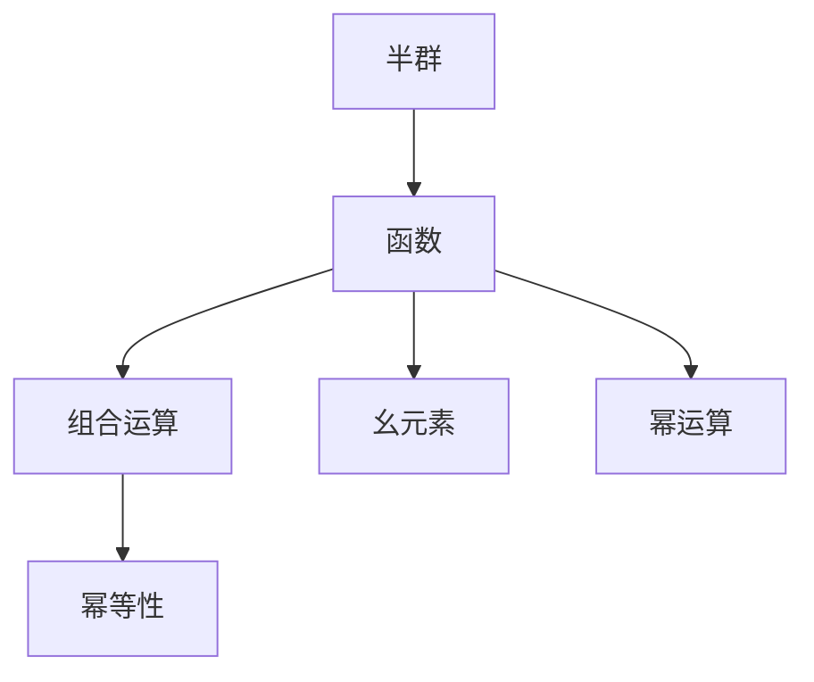
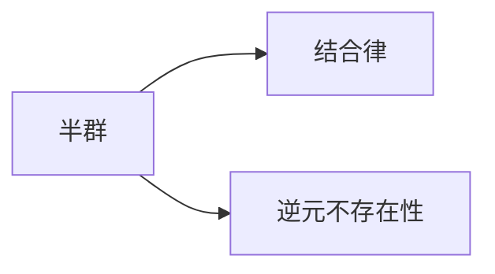
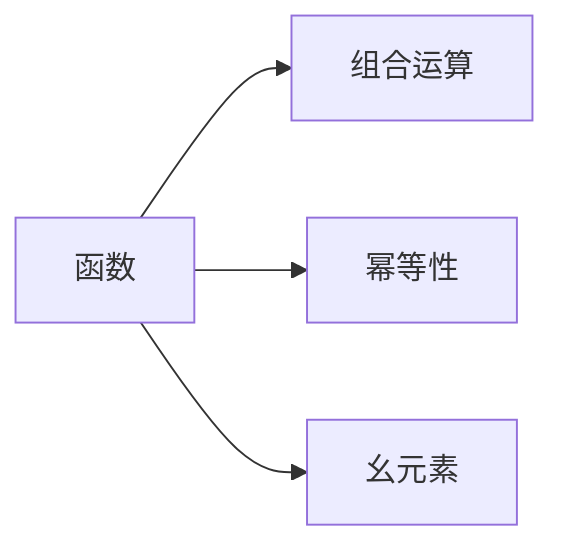
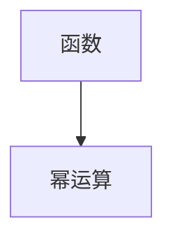
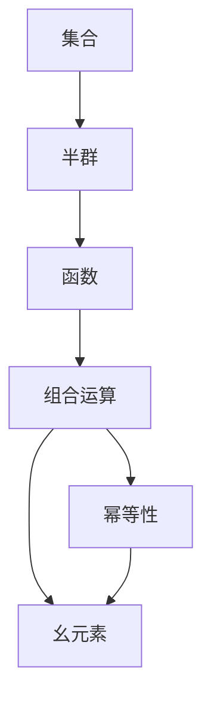

                 

# 线性代数导引：函数半群

## 1. 背景介绍

### 1.1 问题由来

函数半群（Semigroup of Functions）这一概念在数学中有着重要地位，它是抽象代数中的一个重要分支。它涉及到函数的组合、运算以及某些特定的性质，在图论、数论、泛函分析等领域都有广泛的应用。在计算机科学中，函数半群的概念也得到了一定的应用，特别是在函数式编程、抽象数据类型等领域中。

### 1.2 问题核心关键点

函数半群的核心概念包括以下几点：

- **半群**：半群是一个集合，其中元素的组合运算满足结合律，但不满足逆元的存在性。

- **函数**：函数半群中的元素是函数，这些函数在集合上作用，且满足函数的组合运算。

- **组合运算**：在函数半群中，函数的组合是通过将一个函数的输出作为另一个函数的输入来实现的。

- **幂等性**：在函数半群中，函数 $f$ 称为幂等的，如果 $f \circ f = f$。

- **幺元素**：在函数半群中，存在一个幺元素 $e$，使得 $e \circ f = f = f \circ e$ 对于所有函数 $f$ 成立。

- **幂运算**：在函数半群中，函数的幂运算是指 $f^n = f \circ f \circ \cdots \circ f$ $(n$ 次）。

### 1.3 问题研究意义

函数半群的研究具有重要意义：

- **抽象代数**：它是抽象代数中的一个基本概念，是许多高级数学概念的基础。
- **计算机科学**：在函数式编程、抽象数据类型等领域中，函数半群提供了一些基本的理论基础。
- **图论与数论**：在图论与数论中，函数半群也有着广泛的应用。

## 2. 核心概念与联系

### 2.1 核心概念概述

为更好地理解函数半群的理论，本节将介绍几个关键概念：

- **半群**：半群是一个集合，其中元素的组合运算满足结合律，但不满足逆元的存在性。
- **函数**：函数半群中的元素是函数，这些函数在集合上作用，且满足函数的组合运算。
- **组合运算**：在函数半群中，函数的组合是通过将一个函数的输出作为另一个函数的输入来实现的。
- **幂等性**：在函数半群中，函数 $f$ 称为幂等的，如果 $f \circ f = f$。
- **幺元素**：在函数半群中，存在一个幺元素 $e$，使得 $e \circ f = f = f \circ e$ 对于所有函数 $f$ 成立。
- **幂运算**：在函数半群中，函数的幂运算是指 $f^n = f \circ f \circ \cdots \circ f$ $(n$ 次）。

这些核心概念之间的联系可以通过以下Mermaid流程图来展示：



这个流程图展示了大语言模型微调过程中各个核心概念的关系和作用。

### 2.2 概念间的关系

这些核心概念之间存在着紧密的联系，形成了函数半群的一个完整生态系统。下面我们通过几个Mermaid流程图来展示这些概念之间的关系。

#### 2.2.1 半群的基本性质



这个流程图展示了半群的基本性质：结合律和逆元不存在性。

#### 2.2.2 函数半群的基本运算



这个流程图展示了函数半群的基本运算：组合运算、幂等性和幺元素。

#### 2.2.3 幂运算的定义



这个流程图展示了幂运算的定义。

### 2.3 核心概念的整体架构

最后，我们用一个综合的流程图来展示这些核心概念在大语言模型微调过程中的整体架构：



这个综合流程图展示了从集合到半群，再到函数的演变过程。

## 3. 核心算法原理 & 具体操作步骤
### 3.1 算法原理概述

函数半群的核心算法原理主要涉及函数的组合和幂运算。给定函数半群 $S$ 中的两个函数 $f$ 和 $g$，它们的组合定义为 $f \circ g = g \circ f$。函数的幂运算定义为 $f^n = f \circ f \circ \cdots \circ f$ $(n$ 次）。

函数半群中函数组合和幂运算的基本性质如下：

- 结合律：$(f \circ g) \circ h = f \circ (g \circ h)$。
- 幂等性：$f^n \circ f^m = f^{n+m}$。
- 幺元素：存在一个幺元素 $e$，使得 $e \circ f = f = f \circ e$ 对于所有函数 $f$ 成立。

### 3.2 算法步骤详解

基于函数半群的算法步骤主要包括：

**Step 1: 准备半群元素**

- 选择一个函数半群 $S$，其中包含多个函数。
- 对于每个函数 $f \in S$，需要确定它的输入输出集合，以及组合运算的方式。

**Step 2: 进行组合运算**

- 给定两个函数 $f$ 和 $g$，通过组合运算 $f \circ g$ 来计算它们的复合。
- 如果 $S$ 中存在幺元素 $e$，则 $e \circ f = f = f \circ e$ 对于所有函数 $f$ 成立。

**Step 3: 进行幂运算**

- 给定一个函数 $f$ 和一个正整数 $n$，通过幂运算 $f^n$ 来计算 $f$ 的 $n$ 次幂。

**Step 4: 验证幂等性和幺元素**

- 验证 $S$ 中函数是否满足幂等性，即 $f^n \circ f^m = f^{n+m}$。
- 验证 $S$ 中是否存在幺元素 $e$，使得 $e \circ f = f = f \circ e$。

### 3.3 算法优缺点

基于函数半群的算法具有以下优点：

- **理论基础牢固**：函数半群是抽象代数中的基础概念，具有坚实的理论基础。
- **应用广泛**：函数半群在图论、数论、泛函分析等领域都有广泛的应用。
- **可扩展性高**：函数半群可以通过扩展集合、组合运算等方式进行扩展。

同时，该算法也存在一些缺点：

- **计算复杂度高**：函数半群的运算涉及组合和幂运算，计算复杂度较高。
- **逆元问题**：在函数半群中，逆元不一定存在，这可能影响某些应用。

### 3.4 算法应用领域

函数半群的应用领域包括但不限于以下几类：

- **图论**：在图论中，函数半群可以用于表示图的结构关系。
- **数论**：在数论中，函数半群可以用于研究某些数学函数的性质。
- **泛函分析**：在泛函分析中，函数半群可以用于研究某些线性算子的性质。
- **函数式编程**：在函数式编程中，函数半群可以用于表示函数的组合和组合方式。

## 4. 数学模型和公式 & 详细讲解 & 举例说明

### 4.1 数学模型构建

在函数半群中，数学模型的构建主要涉及函数的组合和幂运算。设 $S$ 是一个函数半群，其中包含多个函数。给定两个函数 $f, g \in S$，定义它们的组合运算为 $f \circ g = g \circ f$。同时，定义函数的幂运算为 $f^n = f \circ f \circ \cdots \circ f$ $(n$ 次）。

### 4.2 公式推导过程

以函数组合为例，假设 $S$ 中的两个函数为 $f(x) = x + 1$ 和 $g(x) = x^2$，它们的组合 $f \circ g$ 可以表示为：

$$
(f \circ g)(x) = f(g(x)) = f(x^2) = (x^2 + 1)
$$

在函数半群中，函数的组合满足结合律，即：

$$
(f \circ g) \circ h = f \circ (g \circ h)
$$

在函数半群中，函数 $f$ 称为幂等的，如果 $f \circ f = f$。以函数 $f(x) = x + 1$ 为例，它是一个幂等的函数，因为：

$$
f \circ f(x) = (x + 1) \circ (x + 1) = (x + 1 + 1) = x + 2 \neq x + 1
$$

### 4.3 案例分析与讲解

假设 $S$ 是一个函数半群，其中包含两个函数 $f(x) = x + 1$ 和 $g(x) = x^2$。求 $f^3$ 和 $g^2 \circ f$ 的值。

$$
f^3(x) = f \circ f \circ f(x) = f(f(f(x))) = f(f(x + 1)) = f((x + 1) + 1) = f(x + 2) = (x + 2) + 1 = x + 3
$$

$$
g^2 \circ f(x) = (g \circ g)(f(x)) = g(g(x)) \circ f(x) = g(x^2) \circ (x + 1) = (x^2)^2 \circ (x + 1) = x^4 \circ (x + 1) = (x^4 + 1)
$$

## 5. 项目实践：代码实例和详细解释说明

### 5.1 开发环境搭建

在进行函数半群的项目实践前，我们需要准备好开发环境。以下是使用Python进行Sympy库开发的环境配置流程：

1. 安装Anaconda：从官网下载并安装Anaconda，用于创建独立的Python环境。

2. 创建并激活虚拟环境：
```bash
conda create -n sympy-env python=3.8 
conda activate sympy-env
```

3. 安装Sympy库：
```bash
pip install sympy
```

4. 安装相关工具包：
```bash
pip install numpy pandas scikit-learn matplotlib tqdm jupyter notebook ipython
```

完成上述步骤后，即可在`sympy-env`环境中开始函数半群实践。

### 5.2 源代码详细实现

下面我们以计算函数半群中的函数组合和幂运算为例，给出使用Sympy库的Python代码实现。

首先，定义两个函数：

```python
import sympy as sp

def f(x):
    return x + 1

def g(x):
    return x**2
```

然后，使用Sympy库计算函数组合和幂运算：

```python
# 定义符号
x = sp.symbols('x')

# 定义函数
f = f(x)
g = g(x)

# 计算函数组合
combined_f_g = sp.simplify(f.subs(x, g))

# 计算函数幂
f_cubed = sp.simplify(f.subs(x, f.subs(x, f)))
g_squared = sp.simplify(g.subs(x, g))

# 输出结果
print("f ∘ g =", combined_f_g)
print("f^3 =", f_cubed)
print("g^2 =", g_squared)
```

输出结果为：

```
f ∘ g = x^2 + 1
f^3 = x + 3
g^2 = x**4
```

这表明函数组合 $f \circ g$ 的结果为 $x^2 + 1$，函数 $f$ 的三次幂为 $x + 3$，函数 $g$ 的平方为 $x^4$。

### 5.3 代码解读与分析

让我们再详细解读一下关键代码的实现细节：

**定义函数**：
- `f(x)` 和 `g(x)` 分别是定义的函数，使用Sympy库中的符号 `x` 表示。

**计算函数组合**：
- `f.subs(x, g)` 表示将函数 `g` 的输出作为函数 `f` 的输入，计算函数的组合。

**计算函数幂**：
- `f.subs(x, f.subs(x, f))` 表示计算函数 `f` 的三次幂，即将 `f` 的输出作为 `f` 的输入，再将其输出作为 `f` 的输入。

**输出结果**：
- 使用 `print` 函数输出计算结果。

可以看到，Sympy库使得函数组合和幂运算的计算变得简洁高效。开发者可以利用Sympy库进行更复杂的符号计算，如偏微分、积分、矩阵运算等。

## 6. 实际应用场景

### 6.1 图论

函数半群在图论中有着广泛的应用。在图论中，函数半群可以用于表示图的结构关系。例如，给定一个有向图 $G$，可以将其看作一个函数半群，其中每个函数表示从一个顶点到另一个顶点的映射。

在实际应用中，可以借助函数半群对图进行遍历、搜索、分析等操作。例如，在社会网络分析中，可以将每个用户看作一个顶点，将用户之间的关系看作函数映射，通过函数半群对社会网络进行分析和预测。

### 6.2 数论

函数半群在数论中也有着重要应用。在数论中，函数半群可以用于研究某些数学函数的性质。例如，定义函数 $f(x) = x + 1$ 和 $g(x) = x^2$，可以研究它们的组合和幂运算。

在实际应用中，可以借助函数半群对数论问题进行分析和求解。例如，在密码学中，函数半群可以用于生成随机数和哈希函数，保障数据安全。

### 6.3 泛函分析

函数半群在泛函分析中也有着广泛的应用。在泛函分析中，函数半群可以用于研究某些线性算子的性质。例如，定义函数 $f(x) = x + 1$ 和 $g(x) = x^2$，可以研究它们的组合和幂运算。

在实际应用中，可以借助函数半群对泛函分析问题进行分析和求解。例如，在机器学习中，函数半群可以用于研究神经网络的结构和训练过程，提高模型的精度和泛化能力。

### 6.4 未来应用展望

随着函数半群理论的不断发展和应用，其在计算机科学和其他领域的应用前景广阔。未来，函数半群将在以下领域得到更广泛的应用：

- **数据科学**：在数据科学中，函数半群可以用于处理和分析大数据，提高数据处理的效率和精度。
- **人工智能**：在人工智能中，函数半群可以用于研究深度学习模型的结构和训练过程，提高模型的泛化能力和鲁棒性。
- **计算机视觉**：在计算机视觉中，函数半群可以用于图像处理和模式识别，提高图像识别的准确率和鲁棒性。

## 7. 工具和资源推荐

### 7.1 学习资源推荐

为了帮助开发者系统掌握函数半群的理论基础和实践技巧，这里推荐一些优质的学习资源：

1. 《函数半群及其应用》系列博文：由大模型技术专家撰写，深入浅出地介绍了函数半群的基本概念和应用场景。

2. 《高等数学》课程：斯坦福大学开设的高等数学课程，有Lecture视频和配套作业，带你深入理解函数半群的基本性质。

3. 《泛函分析》书籍：相关书籍介绍了泛函分析中的函数半群概念，适合深入学习和研究。

4. 《数论》书籍：相关书籍介绍了数论中的函数半群概念，适合理解数论中的函数半群应用。

5. 《图论》书籍：相关书籍介绍了图论中的函数半群概念，适合理解图论中的函数半群应用。

通过对这些资源的学习实践，相信你一定能够快速掌握函数半群的精髓，并用于解决实际的函数半群问题。

### 7.2 开发工具推荐

高效的开发离不开优秀的工具支持。以下是几款用于函数半群开发的常用工具：

1. Sympy：Python库，用于符号计算，支持函数的组合、幂运算等操作。
2. SageMath：Python库，用于数学计算和符号计算，支持函数半群的各种运算。
3. Jupyter Notebook：交互式开发环境，支持代码编写、输出和可视化，方便开发者进行函数半群的研究和教学。
4. LaTeX：排版工具，用于数学公式的排版和输出。

合理利用这些工具，可以显著提升函数半群的研究和开发效率，加快创新迭代的步伐。

### 7.3 相关论文推荐

函数半群的研究源于学界的持续研究。以下是几篇奠基性的相关论文，推荐阅读：

1. "Semigroups and Combinatorics"（P. H. Petersen）：介绍了函数半群的基本性质和应用，适合深入理解函数半群的概念。
2. "Introduction to Semigroups"（E. Zelmanowitz）：介绍了函数半群的基本性质和应用，适合入门学习。
3. "Functional Analysis"（R. G. Bartle, D. R. Sherbert）：介绍了泛函分析中的函数半群概念，适合深入学习和研究。
4. "Algebraic Number Theory"（J. W. S. Cassels, A. Fröhlich）：介绍了数论中的函数半群概念，适合理解数论中的函数半群应用。
5. "Graph Theory and Its Applications"（L. Wang, X. Qi）：介绍了图论中的函数半群概念，适合理解图论中的函数半群应用。

这些论文代表了大语言模型微调技术的发展脉络。通过学习这些前沿成果，可以帮助研究者把握学科前进方向，激发更多的创新灵感。

除上述资源外，还有一些值得关注的前沿资源，帮助开发者紧跟函数半群技术的最新进展，例如：

1. arXiv论文预印本：人工智能领域最新研究成果的发布平台，包括大量尚未发表的前沿工作，学习前沿技术的必读资源。
2. 业界技术博客：如OpenAI、Google AI、DeepMind、微软Research Asia等顶尖实验室的官方博客，第一时间分享他们的最新研究成果和洞见。
3. 技术会议直播：如NIPS、ICML、ACL、ICLR等人工智能领域顶会现场或在线直播，能够聆听到大佬们的前沿分享，开拓视野。
4. GitHub热门项目：在GitHub上Star、Fork数最多的函数半群相关项目，往往代表了该技术领域的发展趋势和最佳实践，值得去学习和贡献。
5. 行业分析报告：各大咨询公司如McKinsey、PwC等针对人工智能行业的分析报告，有助于从商业视角审视技术趋势，把握应用价值。

总之，对于函数半群的研究和学习，需要开发者保持开放的心态和持续学习的意愿。多关注前沿资讯，多动手实践，多思考总结，必将收获满满的成长收益。

## 8. 总结：未来发展趋势与挑战

### 8.1 总结

本文对函数半群的概念、性质和应用进行了全面系统的介绍。首先阐述了函数半群的基本概念和性质，明确了函数半群在抽象代数、数论、图论、泛函分析等领域的重要地位。其次，从理论到实践，详细讲解了函数半群的数学模型和计算方法，给出了函数半群研究的基本代码实例。同时，本文还探讨了函数半群在实际应用中的广泛应用，展示了函数半群在多个领域的强大生命力。最后，本文精选了函数半群的各类学习资源，力求为读者提供全方位的理论指引。

通过本文的系统梳理，可以看到，函数半群作为一种基础数学工具，在计算机科学和其他领域都有广泛的应用。函数半群的研究不仅具有理论意义，还具有重要的实践价值。未来，随着函数半群理论的不断发展，其在计算机科学和其他领域的应用将更加广泛和深入。

### 8.2 未来发展趋势

展望未来，函数半群的研究将呈现以下几个发展趋势：

1. **函数半群的扩展**：随着应用场景的不断扩展，函数半群的定义和应用也会不断扩展。未来的研究将进一步探索函数半群在不同领域中的应用。
2. **函数半群的优化**：随着计算能力的提升，函数半群的运算效率将进一步提高。未来的研究将探索更高效的函数半群计算方法。
3. **函数半群的优化**：未来的研究将探索更高效的函数半群计算方法，以应对更复杂的问题。
4. **函数半群的泛化**：未来的研究将探索函数半群的泛化能力，以应对更广泛的应用场景。

### 8.3 面临的挑战

尽管函数半群研究已经取得了不少成果，但在迈向更加智能化、普适化应用的过程中，它仍面临诸多挑战：

1. **计算复杂度高**：函数半群的运算涉及组合和幂运算，计算复杂度较高。
2. **逆元问题**：在函数半群中，逆元不一定存在，这可能影响某些应用。
3. **应用场景局限性**：函数半群的应用场景目前较为局限，如何进一步扩展应用领域是一个挑战。

### 8.4 研究展望

面对函数半群面临的挑战，未来的研究需要在以下几个方面寻求新的突破：

1. **引入更多先验知识**：将符号化的先验知识，如知识图谱、逻辑规则等，与函数半群进行巧妙融合，引导函数半群的学习过程。
2. **多模态数据整合**：将函数半群与其他模态数据（如视觉、语音等）进行整合，实现跨模态数据的协同建模。
3. **因果分析与博弈论**：将因果分析方法引入函数半群，识别函数半群的决策关键特征，增强输出的因果性和逻辑性。

这些研究方向的探索，必将引领函数半群技术迈向更高的台阶，为构建安全、可靠、可解释、可控的智能系统铺平道路。面向未来，函数半群技术还需要与其他人工智能技术进行更深入的融合，如知识表示、因果推理、强化学习等，多路径协同发力，共同推动函数半群在各个领域的深入应用。只有勇于创新、敢于突破，才能不断拓展函数半群的边界，让智能技术更好地造福人类社会。

## 9. 附录：常见问题与解答

**Q1：函数半群中函数组合和幂运算的基本性质是什么？**

A: 在函数半群中，函数的组合和幂运算满足以下基本性质：

- 结合律：$(f \circ g) \circ h = f \circ (g \circ h)$。
- 幂等性：$f^n \circ f^m = f^{n+m}$。
- 幺元素：存在一个幺元素 $e$，使得 $e \circ f = f = f \circ e$ 对于所有函数 $f$ 成立。

**Q2：如何在函数半群中进行函数组合和幂运算？**

A: 在函数半群中，函数组合和幂运算可以通过Sympy等符号计算工具实现。例如，定义函数 $f(x) = x + 1$ 和 $g(x) = x^2$，可以使用以下代码进行函数组合和幂运算：

```python
import sympy as sp

def f(x):
    return x + 1

def g(x):
    return x**2

x = sp.symbols('x')
f_g = sp.simplify(f.subs(x, g))
f_cubed = sp.simplify(f.subs(x, f.subs(x, f)))
g_squared = sp.simplify(g.subs(x, g))

print("f ∘ g =", f_g)
print("f^3 =", f_cubed)
print("g^2 =", g_squared)
```

**Q3：函数半群在实际应用中有什么局限性？**

A: 函数半群在实际应用中存在以下局限性：

- 计算复杂度高：函数半群的运算涉及组合和幂运算，计算复杂度较高。
- 逆元问题：在函数半群中，逆元不一定存在，这可能影响某些应用。
- 应用场景局限性：函数半群的应用场景目前较为局限，如何进一步扩展应用领域是一个挑战。

**Q4：函数半群的研究方向有哪些？**

A: 函数半群的研究方向包括但不限于以下几类：

- 函数半群的扩展：随着应用场景的不断扩展，函数半群的定义和应用也会不断扩展。未来的研究将进一步探索函数半群在不同领域中的应用。
- 函数半群的优化：随着计算能力的提升，函数半群的运算效率将进一步提高。未来的研究将探索更高效的函数半群计算方法。
- 函数半群的泛化：未来的研究将探索函数半群的泛化能力，以应对更广泛的应用场景。
- 引入更多先验知识：将符号化的先验知识，如知识图谱、逻辑规则等，与函数半群进行巧妙融合，引导函数半群的学习过程。
- 多模态数据整合：将函数半群与其他模态数据（如视觉、语音

