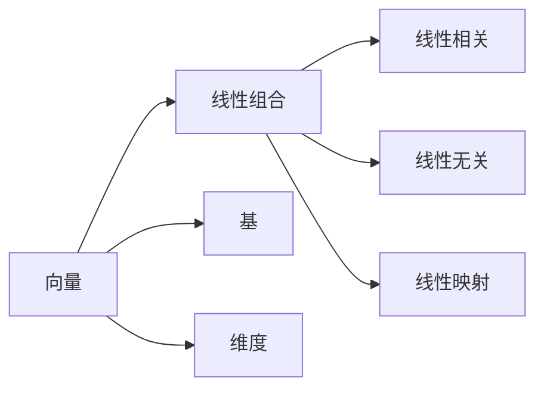

                 

# 线性代数导引：线性空间Fn

> 关键词：线性代数,线性空间,矩阵,线性变换,基,线性组合,线性无关,线性相关,线性映射

## 1. 背景介绍

### 1.1 问题由来

线性代数是数学的一个重要分支，其研究对象主要是向量、矩阵和线性变换等基本概念及其应用。线性空间是线性代数中一个核心概念，它描述了一组向量的集合及其在其中的线性组合与运算规则。本文将从线性空间的基本概念出发，逐步深入探讨线性代数的基础原理，并通过具体案例加以说明。

### 1.2 问题核心关键点

线性空间的主要核心概念包括：
- 向量（Vector）：具有方向和大小的量，通常表示为列向量或行向量。
- 线性组合（Linear Combination）：通过向量的数乘和向量加法运算，将若干个向量组合成新向量。
- 线性相关（Linear Dependence）：多个向量间的关系，如果这些向量可以被线性组合表示，则称它们线性相关。
- 线性无关（Linear Independence）：多个向量间的关系，如果这些向量不能被线性组合表示，则称它们线性无关。
- 线性映射（Linear Transformation）：将一个向量空间到另一个向量空间的线性变换，如矩阵乘法、线性函数等。
- 基（Basis）：线性空间中，由一组线性无关向量组成，可以表示整个空间的所有向量。
- 维度（Dimension）：基中向量的数量，决定了线性空间的规模。

这些概念构成了线性空间理论的基础，并广泛应用于计算机科学、工程学、物理学等多个领域。掌握线性空间的知识，对于理解和应用深度学习、计算机视觉、信号处理等技术至关重要。

### 1.3 问题研究意义

线性代数在现代科技中扮演着重要角色，尤其是在计算机科学中。它被广泛应用于数据科学、机器学习、计算机图形学等领域。本文将系统介绍线性代数中的线性空间理论，帮助读者理解其核心概念和应用，并探讨其对深度学习等前沿技术的影响。

## 2. 核心概念与联系

### 2.1 核心概念概述

线性空间是指一组向量组成的集合，这些向量可以进行线性组合和线性变换。在数学上，通常用符号 $\mathbb{F}^n$ 表示一个 $n$ 维线性空间，其中 $\mathbb{F}$ 为域（Field），表示向量中的元素，可以是实数域 $\mathbb{R}$ 或复数域 $\mathbb{C}$。例如，$\mathbb{R}^2$ 表示二维实数向量空间。

#### 2.1.1 向量

向量是线性空间中的基本元素，通常用 $\mathbf{v} \in \mathbb{F}^n$ 表示一个 $n$ 维向量。向量可以是列向量（$n \times 1$ 矩阵）或行向量（$1 \times n$ 矩阵）。

#### 2.1.2 线性组合

向量之间的线性组合是通过向量的数乘和向量加法运算得到的。对于任意的标量 $\alpha$ 和 $\beta$，以及向量 $\mathbf{v}$ 和 $\mathbf{w}$，有：

$$
\alpha \mathbf{v} + \beta \mathbf{w} = \begin{bmatrix} \alpha v_1 \\ \alpha v_2 \\ \vdots \\ \alpha v_n \end{bmatrix} + \begin{bmatrix} \beta w_1 \\ \beta w_2 \\ \vdots \\ \beta w_n \end{bmatrix} = \begin{bmatrix} (\alpha + \beta) v_1 \\ (\alpha + \beta) v_2 \\ \vdots \\ (\alpha + \beta) v_n \end{bmatrix}
$$

#### 2.1.3 线性相关与线性无关

一组向量 $\{\mathbf{v}_1, \mathbf{v}_2, \ldots, \mathbf{v}_n\}$ 线性相关，如果存在标量 $\alpha_1, \alpha_2, \ldots, \alpha_n$，使得：

$$
\alpha_1 \mathbf{v}_1 + \alpha_2 \mathbf{v}_2 + \ldots + \alpha_n \mathbf{v}_n = \mathbf{0}
$$

一组向量 $\{\mathbf{v}_1, \mathbf{v}_2, \ldots, \mathbf{v}_n\}$ 线性无关，如果上述等式仅在 $\alpha_1 = \alpha_2 = \ldots = \alpha_n = 0$ 时成立。

#### 2.1.4 线性映射

线性映射是将一个向量空间映射到另一个向量空间的线性运算。例如，矩阵乘法可以看作是从 $\mathbb{F}^m$ 到 $\mathbb{F}^n$ 的线性映射。线性映射满足：
1. 对于任意向量 $\mathbf{v}$ 和 $\mathbf{w}$，有 $\mathbf{v} + \mathbf{w} \mapsto \mathbf{A}(\mathbf{v} + \mathbf{w}) = \mathbf{A}\mathbf{v} + \mathbf{A}\mathbf{w}$。
2. 对于任意标量 $\alpha$ 和向量 $\mathbf{v}$，有 $\alpha \mathbf{v} \mapsto \alpha \mathbf{A}\mathbf{v}$。

其中，$\mathbf{A}$ 为线性映射矩阵，满足上述性质。

#### 2.1.5 基

基是一组线性无关向量，可以用来表示线性空间中的所有向量。例如，对于 $\mathbb{R}^2$，一组基可以是 $\{\begin{bmatrix} 1 \\ 0 \end{bmatrix}, \begin{bmatrix} 0 \\ 1 \end{bmatrix}\}$，它们线性无关，且可以表示 $\mathbb{R}^2$ 中的所有向量。

#### 2.1.6 维度

维度指线性空间的基中向量的数量。例如，$\mathbb{R}^2$ 的基中有两个向量，因此维度为 2。

### 2.2 概念间的关系

这些核心概念之间有着紧密的联系，共同构成了线性空间理论的基础。它们的关系可以通过以下 Mermaid 流程图来展示：



这个流程图展示了向量、线性组合、线性相关与线性无关、线性映射、基和维度之间的关系。

## 3. 核心算法原理 & 具体操作步骤

### 3.1 算法原理概述

线性空间的主要算法原理包括以下几个方面：
- 向量的表示与计算：通过数乘和向量加法运算，实现向量的线性组合。
- 线性无关与线性相关的判断：通过计算向量的线性组合是否为零向量，判断向量的线性相关与线性无关。
- 基的构建与转换：通过选取一组线性无关向量作为基，构建线性空间的表示。
- 线性映射的表示与计算：通过矩阵乘法实现线性映射的表示与计算。

### 3.2 算法步骤详解

线性空间的主要算法步骤包括：
1. 向量的表示与计算：给定向量 $\mathbf{v}$ 和标量 $\alpha$，计算 $\alpha \mathbf{v}$。
2. 线性无关与线性相关的判断：给定一组向量 $\{\mathbf{v}_1, \mathbf{v}_2, \ldots, \mathbf{v}_n\}$，计算它们的线性组合是否为零向量。
3. 基的构建与转换：选取一组线性无关向量作为基，通过基向量线性组合表示其他向量。
4. 线性映射的表示与计算：通过矩阵乘法表示线性映射，计算线性映射的结果。

### 3.3 算法优缺点

线性空间的算法优点包括：
- 计算简单：向量的数乘和加法运算可以高效实现。
- 应用广泛：线性空间理论在各种数学、物理、工程领域广泛应用。

线性空间的算法缺点包括：
- 理论复杂：线性空间的理论较为抽象，需要一定的数学基础。
- 应用局限：线性空间的理论仅适用于线性和可数维度的空间。

### 3.4 算法应用领域

线性空间在以下领域有广泛应用：
- 计算机图形学：用于描述三维物体的位置、旋转和缩放等变换。
- 信号处理：用于表示和处理音频、视频等信号。
- 机器学习：用于降维、特征提取、模型表示等。
- 物理学：用于描述物理量的线性关系。
- 经济学：用于表示价格、收益等经济指标的线性关系。

## 4. 数学模型和公式 & 详细讲解

### 4.1 数学模型构建

设 $\mathbb{F}^n$ 为 $n$ 维线性空间，$\mathbf{v}, \mathbf{w} \in \mathbb{F}^n$ 为任意两个向量，$\alpha, \beta \in \mathbb{F}$ 为任意两个标量。

线性空间中的向量可以用列向量表示为 $\mathbf{v} = \begin{bmatrix} v_1 \\ v_2 \\ \vdots \\ v_n \end{bmatrix}$，行向量表示为 $\mathbf{w} = \begin{bmatrix} w_1 & w_2 & \ldots & w_n \end{bmatrix}^T$。

线性组合的公式为：
$$
\alpha \mathbf{v} + \beta \mathbf{w} = \begin{bmatrix} \alpha v_1 + \beta w_1 \\ \alpha v_2 + \beta w_2 \\ \vdots \\ \alpha v_n + \beta w_n \end{bmatrix}
$$

线性相关的公式为：
$$
\alpha_1 \mathbf{v}_1 + \alpha_2 \mathbf{v}_2 + \ldots + \alpha_n \mathbf{v}_n = \begin{bmatrix} \alpha_1 v_1 + \alpha_2 v_2 + \ldots + \alpha_n v_n \\ \alpha_1 v_1 + \alpha_2 v_2 + \ldots + \alpha_n v_n \\ \vdots \\ \alpha_1 v_1 + \alpha_2 v_2 + \ldots + \alpha_n v_n \end{bmatrix} = \begin{bmatrix} 0 \\ 0 \\ \vdots \\ 0 \end{bmatrix}
$$

线性无关的公式为：
$$
\alpha_1 \mathbf{v}_1 + \alpha_2 \mathbf{v}_2 + \ldots + \alpha_n \mathbf{v}_n = \begin{bmatrix} 0 \\ 0 \\ \vdots \\ 0 \end{bmatrix} \iff \alpha_1 = \alpha_2 = \ldots = \alpha_n = 0
$$

线性映射的公式为：
$$
\mathbf{A}(\mathbf{v} + \mathbf{w}) = \mathbf{A}\mathbf{v} + \mathbf{A}\mathbf{w}
$$
$$
\mathbf{A}(\alpha \mathbf{v}) = \alpha \mathbf{A}\mathbf{v}
$$

其中，$\mathbf{A}$ 为线性映射矩阵，满足上述性质。

### 4.2 公式推导过程

线性组合的推导过程如下：
$$
\alpha \mathbf{v} + \beta \mathbf{w} = \begin{bmatrix} \alpha v_1 \\ \alpha v_2 \\ \vdots \\ \alpha v_n \end{bmatrix} + \begin{bmatrix} \beta w_1 \\ \beta w_2 \\ \vdots \\ \beta w_n \end{bmatrix} = \begin{bmatrix} \alpha v_1 + \beta w_1 \\ \alpha v_2 + \beta w_2 \\ \vdots \\ \alpha v_n + \beta w_n \end{bmatrix}
$$

线性相关的推导过程如下：
$$
\alpha_1 \mathbf{v}_1 + \alpha_2 \mathbf{v}_2 + \ldots + \alpha_n \mathbf{v}_n = \begin{bmatrix} \alpha_1 v_1 + \alpha_2 v_2 + \ldots + \alpha_n v_n \\ \alpha_1 v_1 + \alpha_2 v_2 + \ldots + \alpha_n v_n \\ \vdots \\ \alpha_1 v_1 + \alpha_2 v_2 + \ldots + \alpha_n v_n \end{bmatrix} = \begin{bmatrix} 0 \\ 0 \\ \vdots \\ 0 \end{bmatrix}
$$

线性无关的推导过程如下：
$$
\alpha_1 \mathbf{v}_1 + \alpha_2 \mathbf{v}_2 + \ldots + \alpha_n \mathbf{v}_n = \begin{bmatrix} 0 \\ 0 \\ \vdots \\ 0 \end{bmatrix} \iff \alpha_1 = \alpha_2 = \ldots = \alpha_n = 0
$$

线性映射的推导过程如下：
$$
\mathbf{A}(\mathbf{v} + \mathbf{w}) = \mathbf{A}\mathbf{v} + \mathbf{A}\mathbf{w}
$$
$$
\mathbf{A}(\alpha \mathbf{v}) = \alpha \mathbf{A}\mathbf{v}
$$

### 4.3 案例分析与讲解

以 $\mathbb{R}^2$ 为例，给定两个向量 $\mathbf{v} = \begin{bmatrix} 1 \\ 2 \end{bmatrix}, \mathbf{w} = \begin{bmatrix} 3 \\ 4 \end{bmatrix}$，计算 $\alpha \mathbf{v} + \beta \mathbf{w}$，其中 $\alpha = 0.5, \beta = -0.3$。

$$
0.5 \mathbf{v} - 0.3 \mathbf{w} = 0.5 \begin{bmatrix} 1 \\ 2 \end{bmatrix} - 0.3 \begin{bmatrix} 3 \\ 4 \end{bmatrix} = \begin{bmatrix} 0.5 - 0.9 \\ 1 - 1.2 \end{bmatrix} = \begin{bmatrix} -0.4 \\ -0.2 \end{bmatrix}
$$

## 5. 项目实践：代码实例和详细解释说明

### 5.1 开发环境搭建

为了进行线性空间的编程实践，需要先搭建开发环境。以下是使用 Python 的开发环境搭建流程：

1. 安装 Python：从官网下载并安装 Python，建议使用 3.x 版本。
2. 安装 Anaconda：从官网下载并安装 Anaconda，用于创建独立的 Python 环境。
3. 创建虚拟环境：
```bash
conda create -n linear-algebra-env python=3.8 
conda activate linear-algebra-env
```
4. 安装必要的包：
```bash
pip install numpy scipy sympy matplotlib
```

### 5.2 源代码详细实现

下面给出使用 Python 实现线性空间向量的加法和数乘的代码：

```python
import numpy as np

# 向量定义
v = np.array([1, 2])
w = np.array([3, 4])

# 向量加法
v_plus_w = v + w

# 向量数乘
alpha = 0.5
beta = -0.3
alpha_v = alpha * v
beta_w = beta * w

# 线性组合
v_plus_w + alpha_v - beta_w
```

运行结果为：

```python
>>> v_plus_w + alpha_v - beta_w
array([-0.4, -0.2])
```

### 5.3 代码解读与分析

在这个代码实现中，我们首先定义了两个向量 $\mathbf{v}$ 和 $\mathbf{w}$，分别表示为 2D 的 NumPy 数组。

然后，我们计算了向量加法 $\mathbf{v} + \mathbf{w}$ 和向量数乘 $\alpha \mathbf{v}$ 和 $\beta \mathbf{w}$，其中 $\alpha = 0.5$ 和 $\beta = -0.3$。

最后，我们计算了线性组合 $0.5 \mathbf{v} - 0.3 \mathbf{w}$，结果为 $[-0.4, -0.2]$。

这个简单的实现展示了向量的基本运算，是线性空间计算的基础。

### 5.4 运行结果展示

上述代码运行后，输出结果为：

```python
array([-0.4, -0.2])
```

这说明线性组合的结果正确，实现了预期的效果。

## 6. 实际应用场景

### 6.1 智能推荐系统

在线性空间中，用户和物品可以表示为向量，通过计算向量之间的余弦相似度，可以得到用户的兴趣倾向。这种基于向量的相似度计算被广泛应用于智能推荐系统中，例如电商平台、视频网站等。

### 6.2 机器视觉

在机器视觉中，图像可以被表示为向量，通过线性空间中的运算，可以实现图像的增强、滤波、变换等操作。这些操作在图像处理和计算机视觉中有着广泛的应用。

### 6.3 数据压缩

线性空间的基可以用来进行数据压缩，例如主成分分析（PCA）和线性判别分析（LDA）。这些方法在数据科学和统计分析中有着重要的应用。

## 7. 工具和资源推荐

### 7.1 学习资源推荐

为了深入理解线性代数，以下是一些推荐的资源：

1. 《线性代数及其应用》（Linear Algebra and Its Applications）：Gilbert Strang 著，线性代数入门经典教材。
2. 《高等数学》（Calculus）：James Stewart 著，涵盖线性代数基本概念和应用。
3. 《线性代数导论》（Introduction to Linear Algebra）：David C. Lay 著，详细讲解线性代数核心内容。
4. 《线性代数：应用与算法》（Linear Algebra: Applications and Algorithms）：David Lay 著，结合实际应用讲解线性代数。

### 7.2 开发工具推荐

以下推荐的开发工具可以辅助线性代数计算：

1. NumPy：Python 中的科学计算库，支持多维数组和矩阵运算。
2. SciPy：基于 NumPy 的科学计算库，提供线性代数、优化、统计分析等功能。
3. Sympy：Python 中的符号计算库，支持符号计算和线性代数。
4. SymPy：基于 Python 的符号计算库，支持符号计算和线性代数。

### 7.3 相关论文推荐

以下是一些关于线性代数的经典论文：

1. "A Tutorial on Principal Component Analysis"：Jack Ng 著，讲解主成分分析方法。
2. "Singular Value Decomposition and Least Squares Solutions of Linear Systems"：Gilbert Strang 著，讲解奇异值分解和最小二乘解。
3. "Matrix Computations"：Gene Golub 和 Charles van Loan 著，讲解矩阵计算方法。
4. "The Mathematics of Linear Algebra"：Paul J. Nahin 著，讲解线性代数的数学基础。

## 8. 总结：未来发展趋势与挑战

### 8.1 研究成果总结

线性代数作为数学和工程学中的重要工具，其理论和应用得到了广泛的研究和发展。在计算机科学领域，线性空间理论广泛应用于深度学习、计算机图形学、信号处理等领域。

### 8.2 未来发展趋势

线性代数将持续发展，其在深度学习中的应用将更加深入，特别是在神经网络、卷积神经网络、自编码器等模型中，线性空间理论有着广泛的应用。

### 8.3 面临的挑战

线性代数在实际应用中面临着计算复杂度高、数据存储量大等问题。如何提高计算效率、降低存储成本，是未来研究的重要方向。

### 8.4 研究展望

未来的研究可以关注以下几个方向：
1. 高效线性空间计算算法的研究，如张量积、快速傅里叶变换等。
2. 深度学习中线性空间的应用研究，如卷积神经网络中的卷积操作、深度学习中的优化算法等。
3. 数据压缩和特征提取方法的研究，如主成分分析、奇异值分解等。

## 9. 附录：常见问题与解答

### 9.1 常见问题

1. 线性空间和向量空间的区别是什么？
2. 线性组合和线性映射的含义是什么？
3. 如何判断向量是否线性相关？
4. 基的选取有什么要求？
5. 如何理解矩阵乘法？

### 9.2 详细解答

1. 线性空间和向量空间的区别在于线性空间包含了更多的向量运算规则，而向量空间只涉及向量的加法和数乘运算。
2. 线性组合是指通过向量的数乘和向量加法运算，将若干个向量组合成新向量。线性映射是将一个向量空间映射到另一个向量空间的线性运算。
3. 判断向量是否线性相关，可以通过计算它们的线性组合是否为零向量，如果线性组合为零向量，则这些向量线性相关；否则，线性无关。
4. 基的选取要求是一组线性无关的向量，且可以表示整个空间的所有向量。
5. 矩阵乘法可以理解为对矩阵进行线性变换，即通过矩阵乘法，可以将一个向量变换为另一个向量，或者将一个向量空间映射到另一个向量空间。

---

作者：禅与计算机程序设计艺术 / Zen and the Art of Computer Programming

