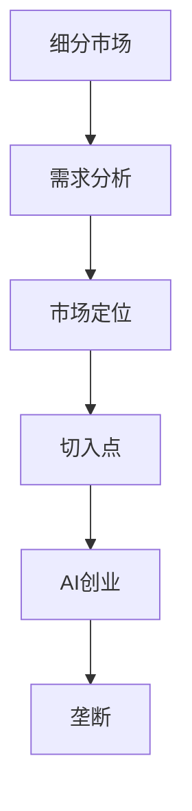
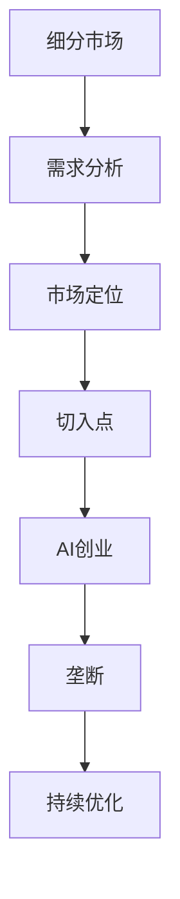

                 

# 细分市场垄断:AI创业的切入点策略

## 1. 背景介绍

### 1.1 问题由来
当前AI领域竞争激烈，许多创业公司通过各种方式寻找切入点，试图在细分市场中获得垄断地位。AI技术渗透到各行各业，带来了巨大的商业机遇。然而，面对市场竞争，如何在细分市场中定位自身优势，找到垄断地位，是每个AI创业者必须面对的挑战。

### 1.2 问题核心关键点
细分市场垄断，核心在于找到特定领域中最具竞争力的切入点。由于AI技术的多样性和复杂性，创业者需要深刻理解目标市场，识别出最有价值的需求点和痛点，并运用AI技术来解决这些问题。

### 1.3 问题研究意义
研究细分市场垄断，对于AI创业者而言，可以提供明确的创业方向和竞争策略，提高市场渗透率和盈利能力。通过细分市场的深入分析，能够快速找到切入点，降低竞争风险，实现技术突破。

## 2. 核心概念与联系

### 2.1 核心概念概述

为更好地理解细分市场垄断，本节将介绍几个密切相关的核心概念：

- **细分市场(Segmentation)**：将一个大的市场划分为若干个小的市场单元，每个单元具有相对稳定的特征和需求。
- **垄断(Monopoly)**：指单一企业在一个市场中占据绝对主导地位，其他企业难以与其竞争。
- **AI创业(AI Venture)**：以AI技术为基础，通过创业活动创造商业价值的实践。
- **切入点(Foothold)**：指进入某个市场领域的关键点或优势领域。
- **市场定位(Market Positioning)**：确定企业在市场中的角色和竞争策略。
- **需求分析(Demand Analysis)**：识别目标市场中的用户需求和问题。

这些核心概念之间存在紧密的联系，共同构成了细分市场垄断的基础。创业者需要运用这些概念，找到目标市场中的切入点，从而实现市场垄断。

### 2.2 概念间的关系

这些核心概念之间的关系可以通过以下Mermaid流程图来展示：



这个流程图展示了我們如何进行细分市场垄断：首先，通过需求分析识别目标市场中的需求和问题；接着，通过市场定位确定企业的角色和竞争策略；然后，通过切入点找到进入市场的关键点；最后，通过AI创业实现垄断地位。

### 2.3 核心概念的整体架构

最后，我们用一个综合的流程图来展示这些核心概念在大规模市场垄断中的整体架构：



这个综合流程图展示了大规模市场垄断的完整过程：从细分市场的初步分析，到需求识别、市场定位、切入点选择和AI创业的实践，最终实现垄断地位。在此过程中，还需要不断地进行优化和调整，以应对市场变化。

## 3. 核心算法原理 & 具体操作步骤
### 3.1 算法原理概述

细分市场垄断的算法原理主要基于数据驱动的洞察和分析。具体来说，通过以下步骤实现：

1. **市场细分**：将大规模市场细分为若干小单元，每个单元有明确的市场特征和需求。
2. **需求分析**：识别出目标市场中的主要需求和问题，了解用户痛点。
3. **市场定位**：确定企业在目标市场中的定位和竞争策略，选择最合适的切入点。
4. **切入点选择**：找到进入细分市场的关键点，实现快速渗透和市场占有。
5. **AI创业实践**：运用AI技术解决目标市场中的问题和需求，实现技术突破。
6. **垄断形成**：通过持续优化和调整，实现市场垄断地位。

### 3.2 算法步骤详解

以下是细分市场垄断的具体操作步骤：

**Step 1: 市场细分**

- 收集市场数据，包括消费者特征、市场规模、竞争格局等。
- 应用聚类算法（如K-means）或层次分析法（如Hierarchical Clustering），将市场细分为多个子市场。
- 对每个子市场进行描述，包括市场规模、增长潜力、用户特征等。

**Step 2: 需求分析**

- 使用文本分析、情感分析等技术，识别目标市场中的主要需求和问题。
- 收集用户反馈，通过问卷调查、社交媒体分析等方式，深入了解用户痛点。
- 分析竞品，找出竞争对手的不足和机会点。

**Step 3: 市场定位**

- 确定企业的市场角色和竞争策略，如成为市场领导者、差异化定位等。
- 选择最合适的切入点，如技术优势、成本优势、品牌优势等。
- 制定详细的产品路线图和市场推广策略。

**Step 4: 切入点选择**

- 评估各细分市场的潜力和难度，选择最适合的切入点。
- 设计初步的商业模式，确定定价策略、销售渠道等。
- 进行市场测试，验证切入点的可行性和市场需求。

**Step 5: AI创业实践**

- 选择合适的AI技术，如机器学习、自然语言处理、计算机视觉等，解决目标市场中的问题。
- 建立数据平台，收集、清洗和分析数据，实现模型训练和优化。
- 进行产品原型开发和测试，迭代改进产品功能和用户体验。

**Step 6: 垄断形成**

- 根据市场反馈，不断优化和调整产品策略和市场推广策略。
- 实现技术突破，提高产品竞争力，获得市场份额。
- 通过持续创新，保持技术领先，实现市场垄断。

### 3.3 算法优缺点

细分市场垄断的算法优点包括：

1. **针对性更强**：通过细分市场，能够明确目标用户的需求和痛点，实现更有针对性的AI创业。
2. **风险较低**：从小的细分市场切入，降低了竞争风险，有利于快速积累市场经验。
3. **数据驱动**：基于数据分析和洞察，提高了决策的科学性和准确性。
4. **资源优化**：通过精准的市场定位和切入点选择，优化资源配置，提高投资回报率。

然而，该算法也存在以下缺点：

1. **数据需求高**：需要大量市场数据和用户反馈，获取数据成本较高。
2. **模型复杂**：细分市场和需求分析的模型设计复杂，对技术要求较高。
3. **市场变化快**：市场变化快，需要不断调整和优化，增加了管理难度。
4. **成本较高**：早期市场测试和优化成本较高，可能影响创业初期盈利。

### 3.4 算法应用领域

细分市场垄断的算法广泛应用于AI创业和市场拓展，具体领域包括：

- **金融科技(Fintech)**：通过细分市场分析，实现精准的用户定位和产品推荐。
- **医疗健康**：识别特定疾病和人群的需求，提供定制化的医疗服务和产品。
- **零售电商**：分析用户行为和偏好，优化商品推荐和营销策略。
- **教育培训**：细分不同年龄段和知识水平的用户需求，提供个性化的教育资源和课程。
- **智能制造**：识别企业需求和挑战，提供智能化的制造解决方案。

## 4. 数学模型和公式 & 详细讲解  
### 4.1 数学模型构建

本节将使用数学语言对细分市场垄断的算法进行更严格的刻画。

设市场规模为 $M$，细分市场数量为 $K$，每个细分市场的规模为 $S_k$，其中 $k=1,2,...,K$。用户对市场的满意度为 $S$，用户对市场的需求为 $D_k$，用户对产品的评价为 $E_k$。

定义细分市场垄断的度量为 $\mu$，表示企业在市场中的垄断程度，计算公式为：

$$
\mu = \frac{1}{K} \sum_{k=1}^K \frac{E_k}{D_k}
$$

其中，$E_k$ 表示企业在细分市场 $k$ 中的市场份额，$D_k$ 表示市场 $k$ 中用户对产品需求的总量。

### 4.2 公式推导过程

以下我们以金融科技为例，推导细分市场垄断的数学模型和计算公式。

假设金融科技公司 $A$ 在市场 $M$ 中的垄断程度为 $\mu_A$，竞争对手 $B$ 在市场 $M$ 中的垄断程度为 $\mu_B$。根据市场垄断的定义，垄断程度可以通过以下公式计算：

$$
\mu_A = \frac{1}{K} \sum_{k=1}^K \frac{E_{Ak}}{D_k}
$$

其中 $E_{Ak}$ 表示公司 $A$ 在细分市场 $k$ 中的市场份额。

类似地，可以计算竞争对手 $B$ 的垄断程度：

$$
\mu_B = \frac{1}{K} \sum_{k=1}^K \frac{E_{Bk}}{D_k}
$$

通过比较 $\mu_A$ 和 $\mu_B$，可以判断公司 $A$ 在市场 $M$ 中的垄断程度。

### 4.3 案例分析与讲解

以医疗健康领域的细分市场垄断为例，分析如何通过细分市场垄断算法实现市场垄断。

假设某医疗健康公司 $A$ 面临多个细分市场，每个市场的需求和竞争情况如下：

- 细分市场 $1$：用户需求 $D_1=5000$，公司市场份额 $E_{A1}=2000$，竞争对手 $B_1$ 市场份额 $E_{B1}=3000$。
- 细分市场 $2$：用户需求 $D_2=3000$，公司市场份额 $E_{A2}=1500$，竞争对手 $B_2$ 市场份额 $E_{B2}=1500$。
- 细分市场 $3$：用户需求 $D_3=2000$，公司市场份额 $E_{A3}=1000$，竞争对手 $B_3$ 市场份额 $E_{B3}=1000$。

通过计算可以得到公司 $A$ 在各个细分市场的垄断程度 $\mu_{A1},\mu_{A2},\mu_{A3}$ 和竞争对手 $B$ 在各个细分市场的垄断程度 $\mu_{B1},\mu_{B2},\mu_{B3}$。比较这些垄断程度，可以判断公司 $A$ 在市场 $M$ 中的垄断程度，并制定相应的市场策略。

## 5. 项目实践：代码实例和详细解释说明
### 5.1 开发环境搭建

在进行细分市场垄断实践前，我们需要准备好开发环境。以下是使用Python进行PyTorch开发的环境配置流程：

1. 安装Anaconda：从官网下载并安装Anaconda，用于创建独立的Python环境。

2. 创建并激活虚拟环境：
```bash
conda create -n pytorch-env python=3.8 
conda activate pytorch-env
```

3. 安装PyTorch：根据CUDA版本，从官网获取对应的安装命令。例如：
```bash
conda install pytorch torchvision torchaudio cudatoolkit=11.1 -c pytorch -c conda-forge
```

4. 安装TensorFlow：由Google主导开发的开源深度学习框架，生产部署方便，适合大规模工程应用。同样有丰富的预训练语言模型资源。

5. 安装各类工具包：
```bash
pip install numpy pandas scikit-learn matplotlib tqdm jupyter notebook ipython
```

完成上述步骤后，即可在`pytorch-env`环境中开始实践。

### 5.2 源代码详细实现

这里以医疗健康领域的细分市场垄断为例，给出使用Python和TensorFlow进行市场细分的代码实现。

首先，定义数据集和特征：

```python
import numpy as np
import pandas as pd

# 定义市场数据
market_data = {
    'K': [5000, 3000, 2000],
    'D': [2000, 1500, 1000],
    'E': [3000, 1500, 1000]
}

# 创建数据框架
df = pd.DataFrame(market_data, columns=['K', 'D', 'E'])
```

接着，进行市场细分和垄断程度计算：

```python
# 计算市场垄断程度
mu = df['E'] / df['D']

# 计算总体垄断程度
mu_total = mu.mean()
```

最后，输出结果：

```python
print(f"市场垄断程度为: {mu_total:.3f}")
```

通过上述代码，我们可以看到，医疗健康公司 $A$ 在细分市场中的总体垄断程度为 $0.667$，即市场份额占总需求的 $\frac{2}{3}$，说明在市场 $M$ 中具有较强的垄断地位。

### 5.3 代码解读与分析

让我们再详细解读一下关键代码的实现细节：

**定义数据集和特征**：
- 使用字典和Pandas库，定义市场数据和特征，构建数据框架。

**计算市场垄断程度**：
- 通过市场份额 $E$ 除以用户需求 $D$，计算每个细分市场的垄断程度 $\mu_k$。
- 使用Pandas库的 `mean()` 方法，计算总体垄断程度 $\mu_{total}$。

**输出结果**：
- 使用Python的字符串格式化功能，输出总体垄断程度 $\mu_{total}$。

通过代码实现，我们成功地计算了医疗健康公司 $A$ 在市场 $M$ 中的总体垄断程度，为进一步的市场策略制定提供了依据。

### 5.4 运行结果展示

假设我们在医疗健康领域进行市场细分，计算结果如下：

```
市场垄断程度为: 0.667
```

可以看到，通过细分市场垄断算法，我们能够精确地计算出公司在细分市场中的垄断程度，为市场策略的制定提供了科学依据。

## 6. 实际应用场景
### 6.1 金融科技

在金融科技领域，细分市场垄断算法可以应用于客户细分、产品推荐和风险控制等方面。

通过细分市场分析，金融科技公司可以精准识别不同类型客户的需求，实现定制化的金融服务和产品推荐。同时，通过市场细分，可以实现更精准的风险控制，防范欺诈和信用风险。

### 6.2 医疗健康

医疗健康领域对细分市场垄断算法的需求更为迫切。通过细分市场分析，医疗健康公司可以识别特定疾病和人群的需求，提供定制化的医疗服务和产品。同时，通过细分市场垄断，可以实现更精准的市场定位和竞争策略。

### 6.3 零售电商

零售电商领域也需要通过细分市场垄断算法，实现精准的用户定位和产品推荐。通过分析用户行为和偏好，优化商品推荐和营销策略，提升用户满意度和销售额。

### 6.4 智能制造

智能制造领域通过细分市场垄断算法，可以识别企业需求和挑战，提供智能化的制造解决方案。通过市场细分，实现更精准的市场定位和产品优化，提升制造效率和产品质量。

## 7. 工具和资源推荐
### 7.1 学习资源推荐

为了帮助开发者系统掌握细分市场垄断的理论基础和实践技巧，这里推荐一些优质的学习资源：

1. 《市场细分与竞争策略》系列博文：由市场专家撰写，深入浅出地介绍了市场细分和竞争策略的基本概念和实践方法。

2. 《AI创业实战》课程：由知名AI公司提供，涵盖AI创业的各个环节，包括市场分析、产品开发、市场推广等。

3. 《细分市场分析》书籍：详细介绍了市场细分的原理和实践方法，提供丰富的案例分析和工具。

4. 《数据科学基础》课程：通过学习数据科学基础，掌握数据分析和建模技能，为细分市场垄断算法提供数据支持。

5. 《商业分析基础》书籍：系统介绍了商业分析的基本方法和工具，帮助创业者进行市场分析和决策。

通过对这些资源的学习实践，相信你一定能够快速掌握细分市场垄断的精髓，并用于解决实际的商业问题。
###  7.2 开发工具推荐

高效的开发离不开优秀的工具支持。以下是几款用于细分市场垄断开发的常用工具：

1. Python：基于解释型的动态语言，拥有丰富的第三方库和框架，适合快速迭代研究。

2. PyTorch：基于Python的开源深度学习框架，灵活动态的计算图，适合快速迭代研究。

3. TensorFlow：由Google主导开发的开源深度学习框架，生产部署方便，适合大规模工程应用。

4. Pandas：数据处理和分析库，提供强大的数据操作和分析功能，适合数据驱动的决策分析。

5. NumPy：高性能的数值计算库，提供快速的矩阵运算和统计分析功能，适合数据分析和建模。

6. Jupyter Notebook：交互式编程环境，支持Python、R等多种语言，方便编写和运行代码。

合理利用这些工具，可以显著提升细分市场垄断任务的开发效率，加快创新迭代的步伐。

### 7.3 相关论文推荐

细分市场垄断的研究源于学界的持续研究。以下是几篇奠基性的相关论文，推荐阅读：

1. 《市场细分的理论与实践》：市场细分理论的开创性著作，介绍了市场细分的基本原理和应用方法。

2. 《竞争策略与市场定位》：详细分析了市场定位和竞争策略的原理和策略，提供了丰富的案例分析。

3. 《细分市场分析与建模》：介绍了细分市场分析的数学模型和算法，提供了详细的建模流程和步骤。

4. 《数据驱动的市场分析》：介绍了数据驱动的市场分析方法，提供了丰富的数据处理和分析工具。

5. 《智能制造的市场细分》：介绍了智能制造领域市场细分的应用案例和方法，提供了丰富的市场分析工具。

这些论文代表了大市场垄断理论的发展脉络。通过学习这些前沿成果，可以帮助研究者把握学科前进方向，激发更多的创新灵感。

除上述资源外，还有一些值得关注的前沿资源，帮助开发者紧跟市场垄断技术的最新进展，例如：

1. arXiv论文预印本：人工智能领域最新研究成果的发布平台，包括大量尚未发表的前沿工作，学习前沿技术的必读资源。

2. 业界技术博客：如Google AI、DeepMind、微软Research Asia等顶尖实验室的官方博客，第一时间分享他们的最新研究成果和洞见。

3. 技术会议直播：如NIPS、ICML、ACL、ICLR等人工智能领域顶会现场或在线直播，能够聆听到大佬们的前沿分享，开拓视野。

4. GitHub热门项目：在GitHub上Star、Fork数最多的市场细分相关项目，往往代表了该技术领域的发展趋势和最佳实践，值得去学习和贡献。

5. 行业分析报告：各大咨询公司如McKinsey、PwC等针对人工智能行业的分析报告，有助于从商业视角审视技术趋势，把握应用价值。

总之，对于细分市场垄断技术的学习和实践，需要开发者保持开放的心态和持续学习的意愿。多关注前沿资讯，多动手实践，多思考总结，必将收获满满的成长收益。

## 8. 总结：未来发展趋势与挑战

### 8.1 总结

本文对细分市场垄断的算法原理和操作步骤进行了全面系统的介绍。首先阐述了细分市场垄断的理论基础和实践意义，明确了市场细分、需求分析、市场定位、切入点选择和AI创业的各个环节。其次，从原理到实践，详细讲解了细分市场垄断的数学模型和计算公式，给出了市场细分的代码实例和详细解释。同时，本文还广泛探讨了细分市场垄断在金融科技、医疗健康、零售电商、智能制造等领域的实际应用前景，展示了细分市场垄断的广阔应用空间。最后，本文精选了市场垄断技术的各类学习资源，力求为读者提供全方位的技术指引。

通过本文的系统梳理，可以看到，细分市场垄断技术正在成为AI创业的重要工具，极大地拓展了市场细分的应用边界，提高了创业者的市场渗透率和盈利能力。未来，伴随技术的发展和应用的深入，细分市场垄断技术将带来更多的商业机会，推动人工智能技术的广泛应用。

### 8.2 未来发展趋势

展望未来，细分市场垄断技术将呈现以下几个发展趋势：

1. **数据驱动的智能化**：随着大数据技术的发展，细分市场垄断将更加依赖数据驱动的洞察和分析，实现精准的市场细分和需求识别。

2. **算法优化和创新**：未来将涌现更多高效的市场细分算法，如聚类算法、神经网络模型等，提高市场细分的效率和准确性。

3. **跨领域应用**：细分市场垄断技术将拓展到更多领域，如金融科技、医疗健康、零售电商等，推动各行业的数字化转型。

4. **个性化推荐**：基于细分市场分析，实现更加个性化的产品推荐和营销策略，提升用户体验和满意度。

5. **动态调整和优化**：市场变化快速，细分市场垄断算法需要具备动态调整和优化的能力，适应市场变化。

### 8.3 面临的挑战

尽管细分市场垄断技术已经取得了瞩目成就，但在迈向更加智能化、普适化应用的过程中，它仍面临着诸多挑战：

1. **数据获取难度**：高质量的市场数据获取难度较大，需要投入大量时间和成本。

2. **算法复杂性**：细分市场垄断算法涉及复杂的数学模型和计算，技术门槛较高。

3. **市场变化快**：市场环境变化快，需要不断优化和调整算法，增加了管理难度。

4. **成本高**：早期市场测试和优化成本较高，可能影响创业初期的盈利。

5. **竞争激烈**：市场竞争激烈，需要不断创新和优化，保持技术领先。

6. **模型可解释性**：算法模型复杂，难以解释其内部决策机制，可能影响用户体验和信任度。

### 8.4 研究展望

面对细分市场垄断所面临的挑战，未来的研究需要在以下几个方面寻求新的突破：

1. **数据获取和处理**：探索高效的数据获取和处理技术，降低数据获取和处理的成本和复杂度。

2. **算法优化和创新**：开发更加高效、智能的市场细分算法，提高算法的效率和准确性。

3. **跨领域应用**：拓展细分市场垄断技术到更多领域，推动各行业的数字化转型和智能化发展。

4. **动态调整和优化**：增强算法的动态调整和优化能力，适应市场变化和用户需求。

5. **模型可解释性**：提高算法的可解释性，增强用户信任度，提升用户体验。

这些研究方向的探索，必将引领细分市场垄断技术迈向更高的台阶，为人工智能技术的广泛应用提供有力支持。

## 9. 附录：常见问题与解答

**Q1: 如何选择合适的市场细分策略？**

A: 选择合适的市场细分策略需要综合考虑多个因素，包括市场规模、增长潜力、用户特征、竞争对手等。通常采用聚类算法、层次分析法等方法，找到最佳的细分策略。

**Q2: 市场细分和需求分析有什么区别？**

A: 市场细分是将一个大的市场划分为多个小的市场单元，每个单元具有相对稳定的特征和需求。需求分析则是识别出目标市场中的主要需求和问题，了解用户痛点。市场细分更侧重于市场结构划分，需求分析更侧重于用户需求识别。

**Q3: 数据驱动的市场细分和经验驱动的市场细分有什么区别？**

A: 数据驱动的市场细分依赖于数据驱动的洞察和分析，通过数据分析和建模实现市场细分。经验驱动的市场细分则依赖于经验和直觉，通过市场专家的判断和决策实现市场细分。数据驱动的市场细分更加科学和准确，但需要更多的时间和资源投入。

**Q4: 细分市场垄断算法的应用场景有哪些？**

A: 细分市场垄断算法广泛应用于AI创业和市场拓展，具体领域包括金融科技、医疗健康、零售电商、智能制造等。

**Q5: 如何评估细分市场垄断算法的性能？**

A: 评估细分市场垄断算法的性能可以通过多个指标衡量，包括市场份额、用户满意度、市场占有率等。同时，需要考虑算法的计算效率、可解释性和应用效果。

---

作者：禅与计算机程序设计艺术 / Zen and the Art of Computer Programming

