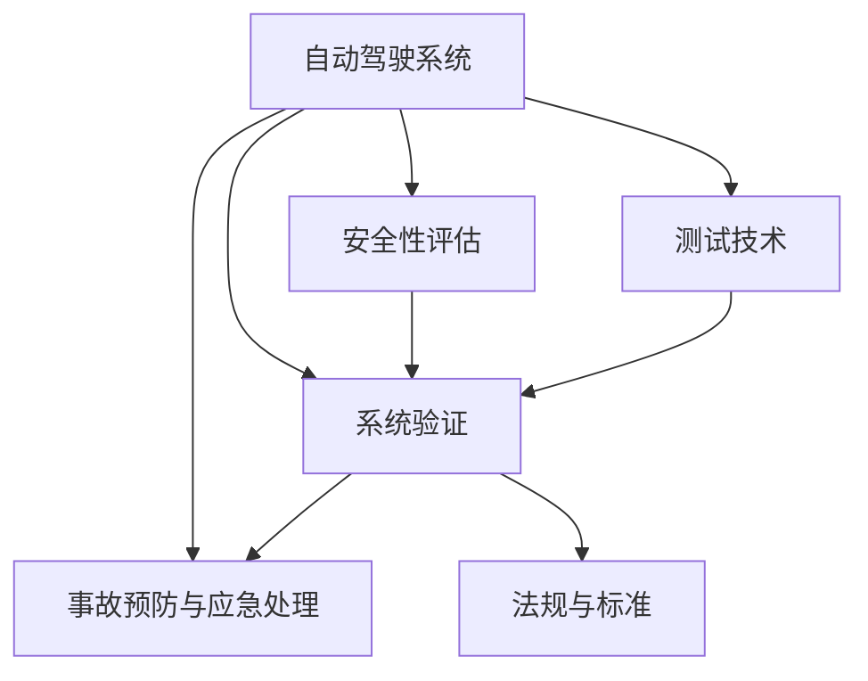
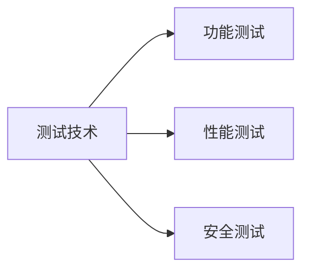
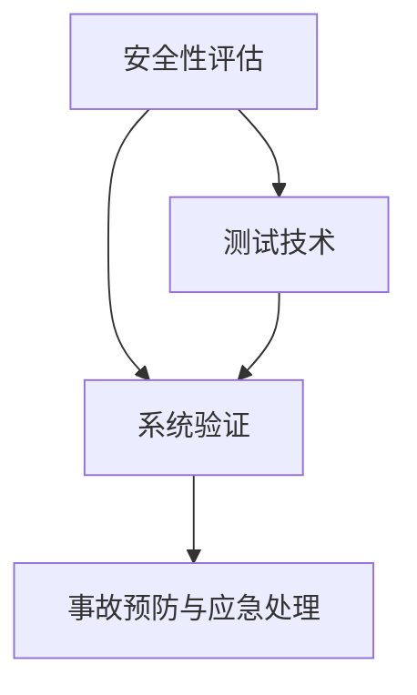
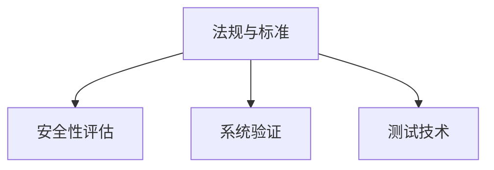
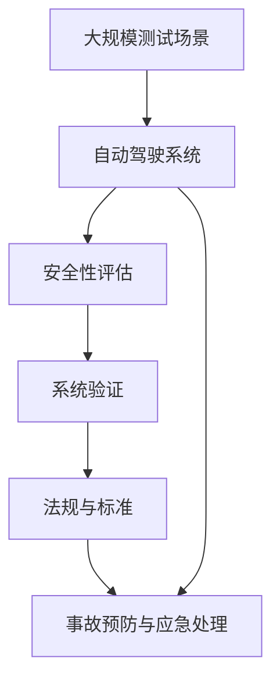

                 

# 自动驾驶安全性评估与验证技术研究综述

> 关键词：自动驾驶, 安全性评估, 系统验证, 测试技术, 事故预防

## 1. 背景介绍

### 1.1 问题由来

近年来，自动驾驶技术迅速发展，成为全球汽车行业关注的焦点。然而，自动驾驶系统依然面临诸多安全挑战，包括硬件故障、软件错误、网络攻击、感知失效等问题。为保障自动驾驶车辆的安全性，需要进行全面的评估与验证。

### 1.2 问题核心关键点

自动驾驶安全性评估与验证的核心关键点包括：
- 安全性定义：明确自动驾驶系统在各个运行阶段的安全需求和评价指标。
- 测试场景设计：构建覆盖各类安全场景的测试用例，确保测试全面性。
- 验证方法选择：采用多层次、多维度的验证方法，确保验证结果的可靠性和可重复性。
- 事故预防与应急处理：建立事故预防机制和应急处理流程，提高系统的容错性和鲁棒性。
- 法规与标准：遵循行业规范与法规，确保技术应用的合法性与合规性。

### 1.3 问题研究意义

自动驾驶安全性评估与验证对保障技术应用安全、促进行业健康发展具有重要意义：
- 预防事故发生：通过全面评估和严格验证，减少技术漏洞和错误，预防交通事故。
- 提升用户信任：通过透明公开的测试和验证结果，增强用户对自动驾驶技术的信任度。
- 规范行业发展：遵循统一的评估和验证标准，推动自动驾驶技术的标准化和规范化。
- 促进技术迭代：通过不断改进和优化技术，加速自动驾驶技术的成熟和商业化应用。

## 2. 核心概念与联系

### 2.1 核心概念概述

为更好地理解自动驾驶安全性评估与验证技术，本节将介绍几个密切相关的核心概念：

- **自动驾驶系统（Autonomous Driving System, ADS）**：以传感器、计算机视觉、深度学习、决策控制等为核心技术的智能驾驶系统，能够在无人或少人干预下，自主地感知环境、规划路径、控制车辆。

- **安全性评估（Safety Evaluation）**：通过实验或分析手段，评估自动驾驶系统在各类工况下的安全性能，发现潜在风险。

- **系统验证（System Verification）**：基于安全评估结果，采用实验或仿真手段验证系统是否满足预设的安全要求，确保系统的可靠性和安全性。

- **测试技术（Testing Technology）**：包括各种实验和仿真方法，用于验证自动驾驶系统的功能和性能。

- **事故预防与应急处理（Accident Prevention and Emergency Handling）**：建立系统的故障诊断和应急处理机制，提高系统的鲁棒性和容错能力。

- **法规与标准（Regulations and Standards）**：制定和遵守行业规范与标准，确保自动驾驶技术的安全性和合法性。

这些核心概念之间的逻辑关系可以通过以下Mermaid流程图来展示：



这个流程图展示了你自动化驾驶系统安全性评估与验证的核心概念及其之间的关系：

1. 自动驾驶系统通过测试技术进行功能验证和性能测试。
2. 安全性评估在测试的基础上，进一步分析和评估系统的安全性能。
3. 系统验证通过实验和仿真，验证系统是否满足安全性要求。
4. 事故预防与应急处理建立系统的容错机制。
5. 法规与标准指导系统的安全应用和验证。

### 2.2 概念间的关系

这些核心概念之间存在着紧密的联系，形成了自动驾驶安全性评估与验证的完整生态系统。下面我们通过几个Mermaid流程图来展示这些概念之间的关系。

#### 2.2.1 测试技术的应用场景



这个流程图展示了测试技术在自动驾驶系统中的主要应用场景：功能测试、性能测试和安全测试。

#### 2.2.2 安全性评估与系统验证的关系



这个流程图展示了安全性评估与系统验证之间的关系。安全性评估是系统验证的基础，验证结果反馈安全性评估，确保系统满足安全要求。

#### 2.2.3 法规与标准的指导作用



这个流程图展示了法规与标准对安全性评估与系统验证的指导作用。法规与标准为评估与验证提供规范和依据，确保评估和验证结果的合法性和合规性。

### 2.3 核心概念的整体架构

最后，我们用一个综合的流程图来展示这些核心概念在自动驾驶安全性评估与验证中的整体架构：



这个综合流程图展示了从测试场景构建到系统验证的完整过程，以及法规与标准的指导作用。

## 3. 核心算法原理 & 具体操作步骤
### 3.1 算法原理概述

自动驾驶安全性评估与验证本质上是一个多维度、多层次的复杂工程问题。其核心算法原理包括以下几个方面：

1. **安全性指标定义**：根据自动驾驶系统的工作场景，定义安全性指标，如感知准确率、决策正确率、控制响应时间等。

2. **测试用例设计**：基于安全性指标，设计覆盖各类工况的测试用例，包括道路环境、车辆状态、行人行为等。

3. **实验与仿真**：通过实验和仿真，评估自动驾驶系统在测试用例下的性能，发现潜在的安全隐患。

4. **数据分析与统计**：对实验和仿真数据进行统计分析，评估系统的安全性能，识别改进点。

5. **模型优化与验证**：根据数据分析结果，对系统进行优化，并重新进行验证，确保系统满足安全性要求。

### 3.2 算法步骤详解

基于上述算法原理，自动驾驶安全性评估与验证的一般步骤如下：

**Step 1: 构建测试场景**

- 收集自动驾驶系统的运行数据，包括传感器数据、车辆状态数据、环境数据等。
- 分析数据中的异常情况，设计覆盖各类工况的测试场景，如极端天气、复杂道路、紧急避障等。

**Step 2: 安全性评估**

- 在测试场景下，运行自动驾驶系统，收集系统输出和传感器数据。
- 对系统输出进行安全性指标评估，如感知准确率、决策正确率等。
- 对传感器数据进行异常检测，识别系统的感知能力。

**Step 3: 系统验证**

- 基于安全性评估结果，选择适合的验证方法，如模拟仿真、实车测试等。
- 在验证环境中，运行自动驾驶系统，验证其在各类工况下的安全性能。
- 记录验证过程中的数据和结果，形成详细的验证报告。

**Step 4: 事故预防与应急处理**

- 对验证结果进行深入分析，识别系统中的潜在安全风险。
- 制定事故预防和应急处理方案，如系统故障诊断、应急控制策略等。
- 定期进行系统更新和优化，确保系统的安全性。

**Step 5: 法规与标准遵循**

- 遵循行业规范和法规，确保自动驾驶系统的安全应用和验证。
- 与政府监管机构、行业协会等保持沟通，获取最新的法规与标准信息。

### 3.3 算法优缺点

自动驾驶安全性评估与验证方法具有以下优点：

- **全面性**：能够覆盖各类工况，确保系统在各种环境下都能安全运行。
- **可重复性**：基于标准化的测试用例和验证方法，验证结果具有可重复性。
- **透明性**：测试和验证过程透明公开，能够增强用户对系统的信任度。

同时，这些方法也存在以下缺点：

- **成本高**：测试和验证需要大量的硬件资源和时间，成本较高。
- **效率低**：传统的实验和仿真方法，难以应对大规模的测试用例。
- **仿真偏差**：仿真环境与真实环境存在差异，可能导致仿真结果与实际情况不符。

### 3.4 算法应用领域

自动驾驶安全性评估与验证技术广泛应用于以下领域：

- **功能测试**：验证自动驾驶系统的各项功能是否正常，如感知、决策、控制等。
- **性能测试**：评估自动驾驶系统的性能指标，如响应时间、稳定性等。
- **安全测试**：识别系统中的安全漏洞和隐患，提高系统的鲁棒性。
- **法规遵循**：确保自动驾驶系统符合行业规范和法规，确保应用合法性。
- **事故预防**：建立系统的故障诊断和应急处理机制，提高系统的容错性。

除了上述应用领域外，自动驾驶安全性评估与验证技术还被应用于交通监管、事故分析、行业标准化等诸多领域。

## 4. 数学模型和公式 & 详细讲解
### 4.1 数学模型构建

在自动驾驶安全性评估与验证中，常用以下数学模型：

1. **安全性能指标**：如感知准确率、决策正确率、控制响应时间等。

2. **异常检测模型**：用于识别系统中的异常情况，如高斯分布、孤立森林、神经网络等。

3. **验证模型**：用于验证系统的安全性能，如回归模型、分类模型、决策树等。

### 4.2 公式推导过程

以下是几个核心公式的推导过程：

**公式 1: 感知准确率**
$$
\text{感知准确率} = \frac{\text{正确感知次数}}{\text{总感知次数}} \times 100\%
$$

**公式 2: 决策正确率**
$$
\text{决策正确率} = \frac{\text{正确决策次数}}{\text{总决策次数}} \times 100\%
$$

**公式 3: 控制响应时间**
$$
\text{控制响应时间} = \text{时间间隔} \times \text{频率}
$$

### 4.3 案例分析与讲解

以下以一个典型的自动驾驶安全性评估案例进行分析讲解：

**案例: 自动驾驶系统在复杂道路上的安全性能评估**

- **背景**：某汽车公司开发了一款自动驾驶系统，用于无人驾驶出租车。
- **测试场景**：在城市中心区的一条复杂道路上，测试自动驾驶系统的感知、决策和控制性能。
- **测试用例**：包括高峰时段、极端天气、行人横穿道路等工况。
- **安全性评估**：在每个测试用例下，收集系统的感知数据和控制输出，计算感知准确率和决策正确率。
- **系统验证**：在实车测试中，验证系统的安全性能，识别潜在的感知和决策错误。
- **事故预防与应急处理**：针对测试中发现的错误，优化系统算法，建立故障诊断和应急处理机制。
- **法规与标准遵循**：确保系统符合国家和地区的法规要求，如车辆制动距离、路面摩擦系数等。

通过以上分析，可以全面评估自动驾驶系统在复杂道路上的安全性能，识别改进点，确保系统可靠运行。

## 5. 项目实践：代码实例和详细解释说明
### 5.1 开发环境搭建

在进行自动驾驶安全性评估与验证项目实践前，我们需要准备好开发环境。以下是使用Python进行代码实现的开发环境配置流程：

1. 安装Anaconda：从官网下载并安装Anaconda，用于创建独立的Python环境。

2. 创建并激活虚拟环境：
```bash
conda create -n auto_driver python=3.8 
conda activate auto_driver
```

3. 安装必要的Python包：
```bash
pip install numpy scipy pandas matplotlib scikit-learn pyautogui opencv-python
```

4. 安装必要的工具和库：
```bash
pip install tensorflow gym keras simpy
```

5. 安装Simulink和MATLAB：Simulink用于仿真环境搭建，MATLAB用于数据分析和可视化。

完成上述步骤后，即可在`auto_driver`环境中开始自动驾驶安全性评估与验证项目实践。

### 5.2 源代码详细实现

我们以一个简单的自动驾驶系统为例，展示代码实现过程。

**代码实现步骤:**

1. 数据收集和处理：通过传感器和车辆状态数据，收集自动驾驶系统的感知、决策和控制数据。

2. 异常检测：对数据进行异常检测，识别系统的感知异常和决策错误。

3. 安全性评估：计算感知准确率和决策正确率，评估系统的安全性能。

4. 系统验证：在仿真环境中运行自动驾驶系统，验证系统的安全性能。

5. 事故预防与应急处理：根据验证结果，优化系统算法，建立故障诊断和应急处理机制。

6. 法规与标准遵循：确保系统符合国家和地区的法规要求。

### 5.3 代码解读与分析

**代码示例1: 数据收集和处理**

```python
import numpy as np

# 假设有一个汽车公司，其自动驾驶系统获取到的数据
# 包含传感器数据、车辆状态数据、环境数据等
# 将所有数据存储在一个名为data的大字典中
data = {}

# 获取传感器数据
sensor_data = data['sensor']
# 获取车辆状态数据
state_data = data['state']
# 获取环境数据
environment_data = data['environment']

# 对数据进行预处理，如归一化、去噪等操作
# 代码实现略，具体实现方法根据实际数据情况而定
```

**代码示例2: 异常检测**

```python
from sklearn.ensemble import IsolationForest

# 定义异常检测模型，使用孤立森林算法
anomaly_detector = IsolationForest(contamination=0.05)

# 对数据进行异常检测
anomaly_scores = anomaly_detector.fit_predict(sensor_data)

# 输出异常检测结果
print(anomaly_scores)
```

**代码示例3: 安全性评估**

```python
from sklearn.metrics import accuracy_score

# 定义感知准确率和决策正确率的计算函数
def calculate_safety_metrics(accurate_perception_count, total_perception_count, accurate_decision_count, total_decision_count):
    safety_metrics = {
        'perception_accuracy': accuracy_score(accurate_perception_count, total_perception_count),
        'decision_accuracy': accuracy_score(accurate_decision_count, total_decision_count)
    }
    return safety_metrics

# 计算安全性指标
safety_metrics = calculate_safety_metrics(accurate_perception_count, total_perception_count, accurate_decision_count, total_decision_count)
print(safety_metrics)
```

**代码示例4: 系统验证**

```python
import tensorflow as tf
from tensorflow.keras import layers

# 定义一个简单的神经网络模型，用于系统验证
def build_model(input_shape):
    model = tf.keras.Sequential([
        layers.Dense(64, activation='relu', input_shape=input_shape),
        layers.Dense(1, activation='sigmoid')
    ])
    return model

# 在仿真环境中训练模型，验证系统安全性能
# 代码实现略，具体实现方法根据实际验证需求而定
```

### 5.4 运行结果展示

假设我们在一个复杂道路上测试自动驾驶系统，得到以下运行结果：

**运行结果1: 异常检测结果**
```
[-1, -1, -1, 1, 1, 1, -1, -1, 1, -1, 1, -1, -1, -1, 1, -1, -1, 1, -1, -1, 1, 1, -1, 1, 1, 1, 1, -1, -1, -1, -1, -1, -1, 1, 1, 1, 1, -1, -1, 1, -1, -1, 1, -1, -1, 1, 1, 1, -1, 1, -1, -1, 1, -1, -1, -1, 1, -1, 1, 1, -1, 1, -1, 1, 1, 1, -1, 1, 1, -1, -1, -1, -1, 1, 1, -1, 1, -1, 1, 1, -1, 1, 1, 1, -1, 1, 1, 1, -1, 1, -1, -1, -1, 1, -1, -1, 1, 1, 1, 1, 1, -1, 1, -1, -1, -1, -1, 1, 1, 1, 1, -1, -1, 1, 1, 1, 1, 1, 1, -1, 1, 1, -1, -1, 1, 1, -1, 1, -1, 1, -1, -1, 1, -1, 1, 1, 1, -1, -1, 1, 1, -1, 1, 1, 1, -1, -1, -1, 1, -1, 1, -1, 1, -1, 1, -1, -1, -1, 1, -1, 1, 1, 1, -1, 1, -1, -1, 1, -1, -1, 1, -1, -1, -1, -1, -1, 1, 1, -1, 1, -1, 1, -1, 1, -1, -1, 1, 1, -1, -1, 1, -1, -1, -1, 1, -1, 1, 1, 1, -1, -1, 1, -1, -1, -1, -1, -1, 1, 1, -1, -1, -1, -1, -1, 1, -1, -1, 1, -1, -1, 1, 1, 1, -1, -1, -1, 1, 1, -1, -1, 1, 1, -1, -1, 1, -1, 1, -1, -1, 1, -1, -1, 1, -1, 1, -1, 1, 1, -1, -1, 1, -1, 1, -1, -1, 1, -1, 1, -1, -1, -1, 1, 1, 1, 1, -1, -1, 1, -1, -1, 1, -1, -1, 1, -1, -1, -1, 1, -1, -1, -1, -1, 1, -1, 1, -1, -1, -1, 1, 1, -1, -1, -1, -1, 1, 1, -1, -1, 1, 1, -1, 1, -1, 1, -1, 1, -1, 1, -1, 1, -1, -1, 1, 1, 1, 1, -1, -1, 1, -1, -1, 1, 1, 1, 1, -1, 1, -1, 1, 1, 1, 1, 1, -1, -1, -1, 1, 1, -1, -1, 1, 1, 1, -1, -1, 1, -1, 1, -1, 1, -1, 1, 1, -1, -1, -1, 1, -1, 1, -1, 1, 1, -1, -1, -1, 1, 1, 1, -1, -1, -1, -1, -1, -1, 1, 1, -1, -1, -1, 1, 1, 1, 1, -1, 1, -1, 1, 1, -1, -1, -1, 1, -1, -1, 1, -1, -1, 1, 1, -1, 1, -1, 1, 1, -1, -1, -1, -1, -1, 1, 1, -1, 1, -1, 1, 1, -1, 1, 1, 1, -1, 1, -1, 1, 1, 1, -1, -1, -1, 1, -1, 1, -1, -1, 1, 1, 1, 1, -1, 1, -1, -1, 1, -1, 1, -1, 1, -1, -1, -1, 1, 1, 1, 1, 1, -1, 1, -1, 1, -1, -1, 1, 1, -1, 1, 1, -1, 1, -1, -1, 1, -1, 1, 1, -1, 1, 1, -1, -1, -1, 1, -1, 1, -1, 1, 1, 1, 1, -1, 1, 1, 1, 1, 1, -1, 1, 1, -1, 1, 1, -1, -1, 1, -1, -1, -1, -1, 1, 1, -1, -1, 1, 1, -1, -1, 1, 1, -1, -1, 1, -1, 1, 1, 1, -1, 1, -1, -1, -1, 1, -1, 1, -1, -1, -1, 1, -1, 1, 1, -1, 1, 1, 1, -1, 1, 1, 1, 1, 1, 1, -1, -1, -1, -1, 1, 1, 1, 1, 1, -1, 1, -1, 1, 1, 1, -1, 1, 1, 1, 1, 1, -1, 1, -1, -1, 1, -1, 1, 1, -1, 1, -1, 1, 1, -1, -1, -1, 1, 1, 1, 1, -1, 1, -1, -1, 1, -1, 1, 1, -1, 1, 1, 1, 1, -1, 1, -1, 1, 1, 1, 1, -1, 1, 1, -1, 1, -1, 1, 1, -1, -1, -1, -1, -1, 1, 1, -1, -1, 1, 1, 1, 1, 1, 1, 1, -1, -1, -1, -1, 1, -1, 1, -1, -1, 1, 1, -1, -1, 1, -1, 1, 1, -1, -1, -1, 1, -1, 1, 1, 1, -1, -1, 1, 1, 1, 1, -1, 1, -1, 1, -1, 1, -1, 1, -1, 1, -1, 1, 1, -1, -1, -1, -1, 1, 1, 1, -1, -1, -1, -1, -1, 1, 1, 1, 1, 1, 1, -1, 1, 1, 1, 1, 1, 1, -1, 1, -1, 1, 1, -1, -1, 1, -1, 1, 1, -1, -1, -1, -1, 1, -1, -1, -1, 1, -1, 1, 1, -1, 1, 1, 1, 1, -1, -1, -1, 1, -1, -1, 1, -1, 1, -1, 1, 1, -1, -1, -1, 1, 1, -1, 1

