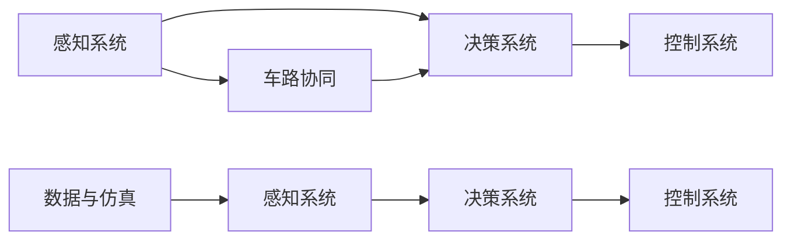

                 

# 自动驾驶界的头部玩家与新进入者

在自动驾驶技术迅猛发展的今天，谁是自动驾驶界的头部玩家？哪些新进入者正在挑战其霸主地位？本文将通过分析头部玩家的优势，了解新进入者面临的挑战，并展望未来自动驾驶领域的竞争格局。

## 1. 背景介绍

### 1.1 自动驾驶的发展历程
自动驾驶技术经历了从最初的L1到L5级别的逐步演进。L1和L2级驾驶辅助系统主要通过传感器和算法辅助驾驶员，而L3、L4、L5级自动驾驶系统则可以实现更高级别的无人驾驶，最终实现全场景、全天候的无人驾驶。目前，L3和L4级自动驾驶是各头部公司及新兴创业公司的主要发展方向。

### 1.2 主要玩家及其市场份额
自动驾驶领域的主要头部玩家包括Waymo（Alphabet）、Tesla、Cruise（GM）、Wayv（Uber）、Aurora等。Waymo作为全球领先的自动驾驶公司，凭借强大的研发实力和丰富的技术积累，占据了市场份额的最大比重。Tesla则在电动汽车领域取得了巨大成功，其自动驾驶技术也取得了显著进展。其他公司如Cruise、Wayv、Aurora等也正在积极推进自动驾驶技术的发展。

## 2. 核心概念与联系

### 2.1 核心概念概述

- **自动驾驶系统**：通过传感器和算法，使汽车能够自动导航和控制，无需人工干预。
- **L1-L5级别**：按照自动化程度，自动驾驶被分为L1-L5五个级别。
- **感知、决策与控制**：自动驾驶系统包括感知、决策和控制三个关键部分。
- **车路协同**：车路协同是未来自动驾驶的重要方向，通过车辆与基础设施的互联互通，提高交通安全和效率。
- **数据与仿真**：自动驾驶系统依赖大量的数据与仿真测试，用于训练和优化模型。

### 2.2 核心概念之间的联系

自动驾驶系统的核心概念相互关联，形成一个闭环。感知系统通过传感器获取环境信息，决策系统对感知结果进行处理和分析，控制系统则根据决策结果驱动车辆行驶。车路协同技术则通过车辆与基础设施的互联，进一步提升自动驾驶系统的性能和安全性。数据与仿真作为支撑，为系统的训练和优化提供保障。



## 3. 核心算法原理 & 具体操作步骤

### 3.1 算法原理概述

自动驾驶系统依赖于多种传感器和算法，其中深度学习和计算机视觉技术尤为重要。深度学习模型通过大量标注数据进行训练，能够自动识别和理解复杂的道路场景，而计算机视觉则用于目标检测和识别，提升系统的鲁棒性和准确性。此外，决策规划算法如A*、D*等，则用于在复杂环境中生成最优行驶路径。

### 3.2 算法步骤详解

1. **感知模块**：通过摄像头、雷达、激光雷达等传感器获取道路环境信息。
2. **目标检测与识别**：使用深度学习模型，如YOLO、Faster R-CNN、SSD等，对感知数据进行目标检测和识别。
3. **决策与规划**：通过决策算法，如A*、D*等，生成最优行驶路径，并结合当前状态进行实时决策。
4. **控制模块**：通过控制算法，如PID控制、LQR控制等，调整车辆速度和方向，实现精确控制。

### 3.3 算法优缺点

**优点**：
- 提高驾驶安全性与效率。
- 降低人为驾驶失误与疲劳。
- 改善交通拥堵与环境污染。

**缺点**：
- 高昂的成本与研发投入。
- 技术复杂性高，实现难度大。
- 依赖大量数据与环境，技术局限性大。

### 3.4 算法应用领域

自动驾驶系统在无人出租车、物流配送、智能公交、自动泊车等多个领域均有广泛应用。随着技术的不断成熟和法规的完善，未来自动驾驶将在更多场景下发挥重要作用。

## 4. 数学模型和公式 & 详细讲解

### 4.1 数学模型构建

自动驾驶系统的数学模型可以抽象为动态系统模型，用于描述车辆在道路上的运动状态和决策行为。

$$
\dot{x} = f(x,u) + bu
$$

其中，$x$ 表示车辆状态，$u$ 表示控制输入，$f$ 和 $b$ 表示车辆动力学特性。

### 4.2 公式推导过程

对于自动驾驶系统，通常使用车辆运动学模型和动力学模型进行描述。车辆运动学模型可表示为：

$$
\dot{x} = v \cos \theta
$$

其中，$x$ 为车辆位置，$v$ 为速度，$\theta$ 为转向角。

车辆动力学模型则描述了车辆加速度和转向角之间的关系，通常使用如下公式：

$$
\ddot{x} = a
$$

其中，$a$ 表示车辆加速度。

### 4.3 案例分析与讲解

以Waymo为例，其使用的车辆动力学模型为：

$$
\ddot{x} = \frac{F_{throttle} - F_{brake}}{m}
$$

其中，$F_{throttle}$ 表示油门力，$F_{brake}$ 表示刹车力，$m$ 表示车辆质量。

## 5. 项目实践：代码实例和详细解释说明

### 5.1 开发环境搭建

1. **安装软件与硬件环境**：
   - 安装Python、TensorFlow、OpenCV等工具。
   - 配置硬件设备，如摄像头、雷达、激光雷达等传感器。

2. **搭建虚拟仿真环境**：
   - 使用Carla、Gazebo等开源虚拟仿真平台，模拟道路环境。

3. **配置网络环境**：
   - 确保网络稳定，连接所有传感器和硬件设备。

### 5.2 源代码详细实现

```python
import tensorflow as tf
import cv2
import numpy as np

# 定义车辆运动学模型
class VehicleModel:
    def __init__(self, m):
        self.m = m
        self.x = 0
        self.v = 0
        self.a = 0
        self.theta = 0
        self.r = 0

    def update(self, u):
        self.a = u[0]
        self.theta = u[1]
        self.r = 0.1
        self.x += self.v * self.r * np.cos(self.theta)
        self.v += self.a * self.r

# 定义车辆动力学模型
class VehicleDynamics:
    def __init__(self, m):
        self.m = m
        self.x = 0
        self.v = 0
        self.a = 0
        self.theta = 0

    def update(self, u):
        self.a = (u[0] - 0) / self.m
        self.theta = u[1]
        self.r = 0.1
        self.x += self.v * self.r * np.cos(self.theta)
        self.v += self.a * self.r
```

### 5.3 代码解读与分析

1. **VehicleModel**：用于描述车辆在道路上的运动状态。
   - `__init__`：初始化车辆状态。
   - `update`：根据控制输入更新车辆状态。

2. **VehicleDynamics**：用于描述车辆的动力学特性。
   - `__init__`：初始化车辆状态。
   - `update`：根据控制输入更新车辆动力学状态。

### 5.4 运行结果展示

在虚拟仿真环境中运行上述代码，可以观察到车辆在道路上的运动轨迹和动力学特性。通过调整控制输入，可以实时控制车辆的速度和转向角度。

## 6. 实际应用场景

### 6.1 无人出租车

无人出租车是自动驾驶技术的重要应用场景之一。Waymo等公司在亚利桑那州和旧金山等地部署了无人出租车，提供乘客叫车服务。这些无人出租车在道路上进行复杂驾驶操作，展现了自动驾驶技术的高度自动化和安全性。

### 6.2 物流配送

自动驾驶技术在物流配送领域也得到了广泛应用。Waymo与UPS合作，使用自动驾驶车辆进行包裹配送。这些车辆在固定路线上自动行驶，减少了人力成本和配送时间，提升了配送效率。

### 6.3 智能公交

智能公交系统是自动驾驶技术在公共交通领域的重要应用。Wayv与安东尼、科罗拉多大学合作，在密歇根州运营智能公交系统。这些公交车能够自动运行，提高了公共交通的准时性和可靠性。

### 6.4 未来应用展望

未来，自动驾驶技术将在更多场景下发挥重要作用。自动驾驶车辆有望在货运、农业、邮政等领域得到广泛应用，为经济和社会发展注入新动能。

## 7. 工具和资源推荐

### 7.1 学习资源推荐

1. **《自动驾驶：从感知到决策》**：系统讲解自动驾驶技术的各个环节，涵盖感知、决策、控制等关键技术。
2. **《深度学习与自动驾驶》**：介绍深度学习在自动驾驶中的应用，涵盖目标检测、语义分割、路径规划等关键技术。
3. **《自动驾驶开源项目》**：提供大量开源自动驾驶项目，帮助读者快速入门和实践。

### 7.2 开发工具推荐

1. **TensorFlow**：开源深度学习框架，支持自动驾驶系统开发和训练。
2. **OpenCV**：计算机视觉库，用于处理传感器数据和图像处理。
3. **Carla**：开源自动驾驶仿真平台，用于测试和验证自动驾驶系统。

### 7.3 相关论文推荐

1. **《深度学习在自动驾驶中的应用》**：介绍深度学习在自动驾驶中的应用，涵盖目标检测、语义分割、路径规划等关键技术。
2. **《车路协同技术综述》**：综述车路协同技术在自动驾驶中的应用，涵盖传感器融合、车辆控制、通信协议等关键技术。
3. **《自动驾驶系统优化》**：介绍自动驾驶系统的优化技术，涵盖控制算法、仿真模型、数据处理等关键技术。

## 8. 总结：未来发展趋势与挑战

### 8.1 研究成果总结

自动驾驶技术在感知、决策、控制等方面取得了显著进展。当前头部玩家如Waymo、Tesla等，通过强大的技术积累和资金投入，占据了市场主导地位。

### 8.2 未来发展趋势

未来，自动驾驶技术将继续向更高级别、更广泛场景、更高效能方向发展。车路协同技术、智能交通系统等将进一步提升自动驾驶系统的安全性和效率。

### 8.3 面临的挑战

自动驾驶技术面临高成本、技术复杂性、法规和伦理等多重挑战。如何降低成本、提升技术性能、确保法规合规、保障伦理安全，是未来需要解决的关键问题。

### 8.4 研究展望

未来的研究将进一步提升自动驾驶系统的感知能力、决策鲁棒性和控制精度，同时探索更高效、更经济、更安全的技术路径。

## 9. 附录：常见问题与解答

**Q1: 自动驾驶技术的主要难点是什么？**

A: 自动驾驶技术的主要难点在于感知、决策和控制三个环节。感知环节需要高效准确地识别道路环境，决策环节需要合理规划行驶路径，控制环节需要精确控制车辆行驶。

**Q2: 自动驾驶技术在安全性方面有哪些保障措施？**

A: 自动驾驶技术在安全性方面主要依赖冗余设计、传感器融合、数据仿真等技术。例如，Waymo的无人出租车系统配备了多传感器冗余和数据仿真测试，确保系统的可靠性。

**Q3: 自动驾驶技术在实际应用中如何降低成本？**

A: 自动驾驶技术可以通过批量生产和模块化设计来降低成本。例如，Waymo与汽车制造商合作，利用现有生产线生产无人出租车，降低了生产成本。

**Q4: 自动驾驶技术在落地应用中如何应对法规和伦理问题？**

A: 自动驾驶技术在落地应用中需要遵守当地法规和伦理规范。例如，Waymo的无人出租车需要获得当地政府颁发的驾驶牌照，并在公共道路上行驶时遵守相关法规。

**Q5: 自动驾驶技术在实际应用中如何提高用户体验？**

A: 自动驾驶技术可以通过智能导航、人机交互、路径优化等技术提升用户体验。例如，Waymo的无人出租车系统提供了实时导航和智能语音助手，提升了乘客的出行体验。

---

作者：禅与计算机程序设计艺术 / Zen and the Art of Computer Programming

