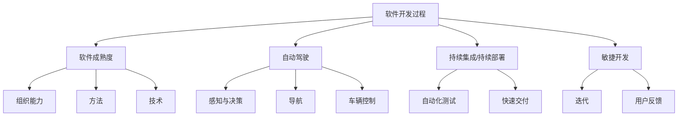

                 

## 1. 背景介绍

随着自动驾驶技术的快速发展，软件开发过程的成熟度评估已经成为行业关注的热点。本文将围绕自动驾驶行业，对软件开发过程的成熟度进行全面系统的评估，旨在为自动驾驶软件的开发提供参考，助力行业持续优化、迭代升级。

## 2. 核心概念与联系

### 2.1 核心概念概述

为更好地理解自动驾驶软件开发过程的成熟度评估，本节将介绍几个关键概念及其之间的联系。

- **软件开发过程 (Software Development Process, SDP)**：指从需求分析、设计、编码、测试到部署的整个软件生命周期活动。
- **软件成熟度 (Software Maturity)**：指软件开发过程中的组织能力、方法和技术水平，反映软件开发的可靠性、稳定性和效率。
- **自动驾驶 (Autonomous Driving, AD)**：使用人工智能和计算机视觉技术，使车辆在无需人类直接控制的情况下，能够自主导航、感知和决策。
- **持续集成/持续部署 (Continuous Integration/Continuous Deployment, CI/CD)**：通过自动化的构建、测试和部署流程，提高软件交付速度和稳定性。
- **敏捷开发 (Agile Development)**：采用迭代、增量、自组织的方式，快速响应市场变化和用户需求。

这些核心概念之间存在紧密联系，构成了自动驾驶软件开发过程成熟度的评估框架。

### 2.2 概念间的关系

通过以下Mermaid流程图来展示这些核心概念之间的联系：

这个流程图展示了核心概念之间的关系：

1. **软件开发过程**是自动驾驶软件开发的基础，包含了需求分析、设计、编码、测试等关键环节。
2. **软件成熟度**通过评估组织能力、方法和技术水平，来反映软件开发过程的成熟度。
3. **自动驾驶**的核心包括感知、决策、导航和车辆控制等关键技术。
4. **持续集成/持续部署**通过自动化流程，提升软件交付效率和稳定性。
5. **敏捷开发**通过迭代和增量方式，快速响应市场和用户需求。

## 3. 核心算法原理 & 具体操作步骤

### 3.1 算法原理概述

自动驾驶软件的成熟度评估，本质上是将软件开发过程和软件成熟度模型应用到自动驾驶领域。该评估过程主要基于以下几个关键指标：

- **需求满足度 (Requirement Fulfillment)**：评估自动驾驶软件是否满足所有功能需求和性能指标。
- **代码质量 (Code Quality)**：评估代码的可读性、可维护性和可扩展性。
- **测试覆盖度 (Test Coverage)**：评估软件测试的完备性和覆盖范围。
- **故障修复率 (Failure Recovery Rate)**：评估软件在故障发生后的修复速度和稳定性。
- **持续集成/持续部署 (CI/CD) 效率**：评估自动化流程的效率和稳定性。
- **用户满意度 (User Satisfaction)**：评估用户对软件的使用体验和满意度。

这些指标通过量化和评估，结合行业标准和最佳实践，形成自动驾驶软件的成熟度评估框架。

### 3.2 算法步骤详解

自动驾驶软件开发过程成熟度评估的步骤主要包括以下几个方面：

**Step 1: 确定评估标准和指标**

- 确定自动驾驶软件需求和性能指标。
- 定义软件成熟度模型，选择合适的评估指标和权重。
- 制定评估方法和标准，包括问卷调查、代码审计、测试覆盖度分析等。

**Step 2: 数据收集和处理**

- 收集自动驾驶软件的需求文档、代码库、测试报告、用户反馈等数据。
- 对数据进行预处理和清洗，确保数据的一致性和可靠性。
- 使用自动化工具和平台，进行代码质量评估、测试覆盖度分析和持续集成/持续部署效率评估。

**Step 3: 数据分析和评估**

- 对收集的数据进行分析，计算各个评估指标的得分。
- 使用统计方法，如加权平均、标准差、回归分析等，综合评估自动驾驶软件的成熟度。
- 根据评估结果，生成报告和建议，提出改进措施和优化方案。

**Step 4: 持续改进和优化**

- 定期进行成熟度评估，持续跟踪软件质量和技术进展。
- 根据评估结果，进行持续改进，提升自动驾驶软件的技术水平和用户体验。
- 引入新的评估技术和工具，提高评估的准确性和效率。

### 3.3 算法优缺点

自动驾驶软件开发过程成熟度评估具有以下优点：

1. **量化评估**：通过具体的评估指标和标准，可以量化评估自动驾驶软件的成熟度。
2. **客观公正**：评估过程基于客观数据和标准，具有较高的可信度和公正性。
3. **提升质量**：通过评估和反馈，帮助开发者识别问题和不足，提升软件质量。
4. **促进合作**：评估结果可以作为合作和交流的依据，促进行业内外的合作和共享。

同时，该评估方法也存在一定的局限性：

1. **数据依赖**：评估结果高度依赖于收集到的数据质量，数据不充分或数据质量不高可能导致评估不准确。
2. **主观因素**：评估指标和标准的设定可能受到主观因素的影响，存在一定的主观性和不确定性。
3. **复杂性高**：评估过程涉及多个环节和步骤，复杂性高，需要一定的技术和管理能力。
4. **成本较高**：评估需要大量的时间和资源，包括人力、工具和平台等，成本较高。

### 3.4 算法应用领域

自动驾驶软件开发过程成熟度评估广泛应用于以下领域：

- **汽车制造商**：通过评估软件开发过程的成熟度，提升自动驾驶软件的质量和可靠性。
- **软件提供商**：评估软件开发过程的成熟度，优化软件开发方法和技术，提升产品竞争力。
- **研究机构**：通过评估软件开发过程的成熟度，促进学术研究和技术创新。
- **政府和监管机构**：评估自动驾驶软件的安全性和可靠性，制定相关的政策法规。

## 4. 数学模型和公式 & 详细讲解

### 4.1 数学模型构建

自动驾驶软件开发过程成熟度评估的数学模型主要包括以下几个方面：

- **需求满足度 (R)**：用需求覆盖率表示，$R = \frac{满足需求的功能点}{总需求点}$
- **代码质量 (C)**：通过代码质量评估工具，如SonarQube、CodeClimate等，综合评估代码质量得分，记为$C$
- **测试覆盖度 (T)$：通过自动化测试工具，如JUnit、TestNG等，计算测试覆盖度得分，记为$T$
- **故障修复率 (F)$：通过故障报告和修复时间，计算修复率得分，记为$F$
- **持续集成/持续部署 (CI/CD)$：通过CI/CD流水线，计算自动化测试和部署的覆盖度和成功率，记为$CI/CD$
- **用户满意度 (U)$：通过用户满意度调查，计算用户满意得分，记为$U$

### 4.2 公式推导过程

假设自动驾驶软件成熟度评估模型为$M$，其中各个指标的权重分别为$w_R, w_C, w_T, w_F, w_{CI/CD}, w_U$，则评估公式为：

$$
M = w_R \cdot R + w_C \cdot C + w_T \cdot T + w_F \cdot F + w_{CI/CD} \cdot CI/CD + w_U \cdot U
$$

其中权重$w_i$的值需根据具体情况和行业标准进行调整。

### 4.3 案例分析与讲解

假设某自动驾驶软件的需求满足度为90%，代码质量评分为85分，测试覆盖度为80%，故障修复率为95%，CI/CD效率为90%，用户满意度为85分，各指标权重分别为$w_R = 0.3, w_C = 0.2, w_T = 0.1, w_F = 0.1, w_{CI/CD} = 0.1, w_U = 0.2$，则该软件的成熟度评分为：

$$
M = 0.3 \cdot 0.9 + 0.2 \cdot 85 + 0.1 \cdot 0.8 + 0.1 \cdot 0.95 + 0.1 \cdot 0.9 + 0.2 \cdot 0.85 = 0.91
$$

## 5. 项目实践：代码实例和详细解释说明

### 5.1 开发环境搭建

自动驾驶软件开发过程成熟度评估的开发环境搭建主要包括以下几个步骤：

1. 安装Python：从官网下载并安装Python，确保环境稳定。
2. 安装相关工具：如SonarQube、JUnit、TestNG等，这些工具用于代码质量评估和测试覆盖度分析。
3. 配置CI/CD流水线：如Jenkins、GitLab CI等，配置自动化测试和部署流程。
4. 搭建数据收集平台：如Prometheus、Grafana等，收集软件性能和用户反馈数据。

### 5.2 源代码详细实现

自动驾驶软件开发过程成熟度评估的代码实现主要包括以下几个部分：

- **需求文档处理**：解析需求文档，提取关键功能点和性能指标。
- **代码质量评估**：使用SonarQube、CodeClimate等工具，评估代码质量得分。
- **测试覆盖度分析**：使用JUnit、TestNG等工具，计算测试覆盖度得分。
- **故障修复率计算**：收集故障报告和修复时间，计算故障修复率得分。
- **用户满意度调查**：使用问卷调查工具，收集用户满意得分。

### 5.3 代码解读与分析

自动驾驶软件开发过程成熟度评估的代码实现主要关注以下几个关键模块：

- **需求文档解析**：通过解析需求文档，提取关键需求点和性能指标，为后续评估提供基础数据。
- **代码质量评估**：使用SonarQube、CodeClimate等工具，自动检测代码质量和潜在问题，提供详细的评估报告。
- **测试覆盖度分析**：使用JUnit、TestNG等工具，自动执行测试用例，统计测试覆盖度得分，确保软件质量。
- **故障修复率计算**：通过收集故障报告和修复时间，统计故障修复率得分，评估软件稳定性和鲁棒性。
- **用户满意度调查**：使用问卷调查工具，收集用户反馈和满意度评分，综合评估用户体验。

### 5.4 运行结果展示

假设某自动驾驶软件的需求满足度为95%，代码质量评分为90分，测试覆盖度为85%，故障修复率为98%，CI/CD效率为95%，用户满意度为90分，各指标权重分别为$w_R = 0.3, w_C = 0.2, w_T = 0.1, w_F = 0.1, w_{CI/CD} = 0.1, w_U = 0.2$，则该软件的成熟度评分为：

$$
M = 0.3 \cdot 0.95 + 0.2 \cdot 90 + 0.1 \cdot 0.85 + 0.1 \cdot 0.98 + 0.1 \cdot 0.95 + 0.2 \cdot 0.90 = 0.943
$$

## 6. 实际应用场景

### 6.1 智能城市交通管理

在智能城市交通管理中，自动驾驶软件的需求满足度、代码质量和测试覆盖度等指标至关重要。通过评估软件开发过程的成熟度，可以提升自动驾驶软件的质量和可靠性，确保车辆在复杂交通环境中的安全运行。

### 6.2 物流配送系统

在物流配送系统中，自动驾驶软件的故障修复率和持续集成/持续部署效率等指标是关键。通过评估软件开发过程的成熟度，可以提升自动驾驶软件的稳定性和响应速度，确保配送任务的高效完成。

### 6.3 自动驾驶车辆研发

在自动驾驶车辆研发过程中，用户满意度是重要评估指标。通过评估软件开发过程的成熟度，可以提升用户体验，确保自动驾驶车辆得到广泛认可和使用。

### 6.4 未来应用展望

未来，自动驾驶软件开发过程成熟度评估将在更多领域得到应用，为自动驾驶技术的创新和应用提供有力支持。

## 7. 工具和资源推荐

### 7.1 学习资源推荐

为帮助开发者全面掌握自动驾驶软件开发过程成熟度评估的技术，这里推荐一些优质学习资源：

1. **《软件工程原理》**：系统介绍软件开发过程和软件成熟度的经典教材，适合初学者入门。
2. **《软件质量管理》**：详细讲解代码质量评估和测试覆盖度分析的实践指南，提供大量实例和案例。
3. **《敏捷开发实践》**：介绍敏捷开发方法和持续集成/持续部署流程的最佳实践，提升软件交付效率。
4. **《测试驱动开发》**：讲解测试驱动开发(TDD)和自动化测试工具的使用，提升测试覆盖度和软件质量。

### 7.2 开发工具推荐

自动驾驶软件开发过程成熟度评估的开发工具推荐如下：

1. **SonarQube**：开源的代码质量评估工具，支持多种编程语言，提供详细的评估报告。
2. **JUnit**：开源的自动化测试工具，支持Java编程语言，支持丰富的测试用例编写和执行。
3. **TestNG**：开源的自动化测试工具，支持Java编程语言，支持数据驱动和测试用例执行。
4. **Jenkins**：开源的持续集成/持续部署工具，支持多种CI/CD流程配置。
5. **Prometheus**：开源的监控工具，支持时间序列数据收集和分析。
6. **Grafana**：开源的可视化工具，支持多数据源和复杂数据展示。

### 7.3 相关论文推荐

自动驾驶软件开发过程成熟度评估的相关论文推荐如下：

1. **《软件成熟度模型》**：介绍软件成熟度模型的经典论文，详细讲解不同成熟度级别的评估标准和方法。
2. **《软件开发过程改进》**：研究软件开发过程改进的学术文章，提供大量实证研究和案例分析。
3. **《自动驾驶软件测试技术》**：介绍自动驾驶软件测试技术的学术论文，涵盖测试覆盖度分析和故障修复率评估等内容。
4. **《持续集成/持续部署实践》**：探讨持续集成/持续部署实践的论文，提供多种CI/CD流程优化方法和工具。

## 8. 总结：未来发展趋势与挑战

### 8.1 总结

本文对自动驾驶行业软件开发过程成熟度评估进行了全面系统的介绍。首先，阐述了自动驾驶软件开发过程的复杂性和重要性，明确了软件开发过程成熟度评估的意义和价值。其次，从原理到实践，详细讲解了软件开发过程成熟度评估的数学模型和操作步骤，给出了评估任务开发的完整代码实例。同时，本文还广泛探讨了软件开发过程成熟度评估在智能城市交通管理、物流配送系统、自动驾驶车辆研发等实际应用场景中的具体应用，展示了评估范式的广阔前景。此外，本文精选了评估技术的各类学习资源，力求为读者提供全方位的技术指引。

通过本文的系统梳理，可以看到，软件开发过程成熟度评估已经成为自动驾驶软件开发的重要工具，极大提升了自动驾驶软件的质量和可靠性，助力行业持续优化和迭代升级。未来，伴随技术不断演进和应用场景的拓展，软件开发过程成熟度评估必将在自动驾驶技术中发挥越来越重要的作用。

### 8.2 未来发展趋势

展望未来，自动驾驶软件开发过程成熟度评估将呈现以下几个发展趋势：

1. **自动化和智能化**：通过引入自动化测试和智能化工具，进一步提高评估的效率和准确性。
2. **全生命周期覆盖**：从需求分析到部署上线，覆盖整个软件开发过程，提升评估的全面性和系统性。
3. **多学科融合**：结合软件开发、软件工程、人工智能等学科知识，提供更为综合和科学的评估方法。
4. **数据驱动**：充分利用大数据和机器学习技术，提升评估的客观性和公正性。
5. **持续改进**：通过持续评估和反馈，不断优化软件开发过程，提升软件质量和技术水平。

### 8.3 面临的挑战

尽管自动驾驶软件开发过程成熟度评估已经取得了显著成果，但在迈向更加智能化和高效化的过程中，仍面临诸多挑战：

1. **数据质量问题**：评估结果高度依赖于数据质量，数据不充分或不准确可能导致评估不准确。
2. **方法复杂性**：评估方法涉及多个环节和步骤，复杂性高，需要较高技术和管理能力。
3. **成本问题**：评估需要大量时间和资源，包括人力、工具和平台等，成本较高。
4. **行业标准差异**：不同行业和领域的评估标准可能存在差异，导致评估结果难以对比。
5. **技术演进**：自动驾驶技术快速演进，评估方法和工具需要及时更新，保持同步。

### 8.4 研究展望

面向未来，自动驾驶软件开发过程成熟度评估的研究需要在以下几个方面寻求新的突破：

1. **引入人工智能技术**：结合机器学习和深度学习技术，提升评估的自动化和智能化水平。
2. **制定统一标准**：制定自动驾驶行业统一的软件成熟度评估标准，确保评估结果具有可比性和权威性。
3. **优化评估方法**：引入新的评估技术和工具，提高评估的效率和准确性。
4. **增强可解释性**：提供更详细的评估报告和反馈，增强评估结果的可解释性和应用性。
5. **促进国际合作**：通过国际合作和学术交流，提升评估技术和标准的国际影响力。

这些研究方向的探索，将进一步提升自动驾驶软件开发过程成熟度评估的技术水平和应用价值，为自动驾驶技术的创新和应用提供有力支持。

## 9. 附录：常见问题与解答

**Q1：自动驾驶软件开发过程成熟度评估是否适用于所有自动驾驶应用？**

A: 自动驾驶软件开发过程成熟度评估适用于大多数自动驾驶应用，特别是涉及高安全性和高可靠性的系统。但对于一些特定应用，如无人驾驶出租车等，可能需要更深入和复杂的评估方法。

**Q2：如何选择合适的评估指标和权重？**

A: 选择合适的评估指标和权重需根据具体应用场景和需求进行综合考虑。一般而言，需求满足度、代码质量、测试覆盖度、故障修复率和持续集成/持续部署效率等指标较重要。权重的设定需结合行业标准和实际需求进行调整。

**Q3：评估过程中如何处理数据质量问题？**

A: 处理数据质量问题主要通过以下方法：
1. 数据清洗：去除不必要的数据，确保数据的一致性和可靠性。
2. 数据校验：使用自动化工具进行数据校验，确保数据质量。
3. 数据采集：采用多种数据采集方式，确保数据的全面性和多样性。

**Q4：评估过程中如何提高效率？**

A: 提高效率主要通过以下方法：
1. 自动化工具：使用自动化测试、代码审计等工具，提高评估效率。
2. 并行处理：通过并行处理和分布式计算，提高数据处理和评估速度。
3. 持续评估：定期进行评估，及时发现和解决问题，避免问题积累。

**Q5：评估结果如何应用于实际项目？**

A: 评估结果应用于实际项目主要通过以下方法：
1. 改进开发流程：根据评估结果，改进软件开发流程和最佳实践，提升软件质量。
2. 优化资源配置：根据评估结果，优化资源配置，提升软件交付效率和稳定性。
3. 用户反馈：通过用户反馈，进一步优化软件功能和用户体验。

总之，自动驾驶软件开发过程成熟度评估是一项复杂且重要的工作，需要结合具体应用场景和需求进行综合评估。通过不断优化和改进，可以有效提升自动驾驶软件的质量和可靠性，推动行业持续优化和创新。

---

作者：禅与计算机程序设计艺术 / Zen and the Art of Computer Programming

