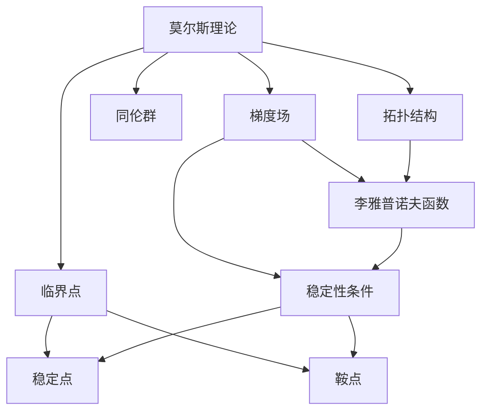
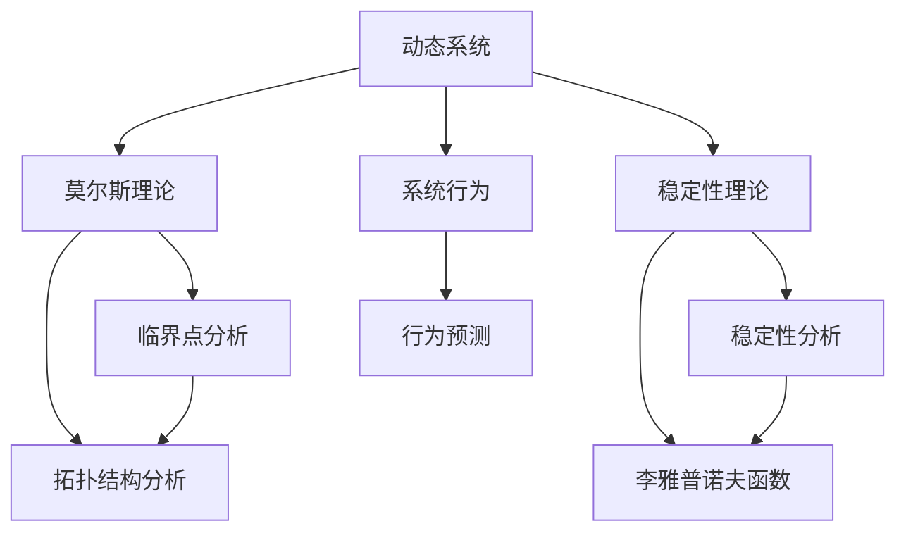

                 

# 莫尔斯理论与稳定性理论

> 关键词：莫尔斯理论,稳定性理论,混沌,吸引子,偏微分方程,泛函分析,动力系统,非线性

## 1. 背景介绍

莫尔斯理论（Morse Theory）和稳定性理论（Stability Theory）是现代数学中两个重要的分支，它们共同构成了动力系统（Dynamical Systems）的重要理论基础。本文旨在从数学和算法层面，介绍这两大理论的基本概念、核心原理以及实际应用。

### 1.1 问题由来
在研究动态系统的行为时，莫尔斯理论和稳定性理论提供了强大的工具，能够帮助分析系统的拓扑性质和稳定性。动态系统是指其状态随时间变化的系统，常用于模拟自然界的各种现象，如天气、人口增长、电路等。然而，这些系统往往表现出复杂的非线性特性，如混沌现象和自相吸引的局部稳定状态。

莫尔斯理论的核心思想是通过研究系统的临界点和拓扑结构，分析系统的基本性质和变化规律。稳定性理论则专注于研究系统在参数变化下的稳定性条件，确保系统能够稳定运行。

### 1.2 问题核心关键点
本文将聚焦于莫尔斯理论和稳定性理论的核心概念和应用。具体来说，我们将会：
1. 详细阐述莫尔斯理论的基本概念，包括临界点、梯度场和同伦群等。
2. 探讨稳定性理论的主要内容，如李雅普诺夫函数和线性化方法。
3. 结合实际应用场景，说明这些理论在电力系统、气象预测、生态系统模拟等领域的潜在应用。

莫尔斯理论涉及几何拓扑和微分几何，而稳定性理论则主要涉及泛函分析和微分方程理论。本文将结合这两个领域的知识，通过简单明了的数学语言和算法步骤，介绍这两个理论的实际应用，帮助读者理解并应用这些强大的工具。

## 2. 核心概念与联系

### 2.1 核心概念概述

#### 2.1.1 莫尔斯理论
莫尔斯理论通过研究系统的临界点和拓扑结构，揭示系统的基本性质和变化规律。核心概念包括：
- 临界点：系统状态发生显著变化的点，通常是函数的高阶导数为零的点。
- 梯度场：描述临界点局部性质的向量场，梯度指向局部极小点。
- 同伦群：描述系统拓扑结构的同伦类，通过变形操作保持系统不变。

#### 2.1.2 稳定性理论
稳定性理论研究动态系统在参数变化下的稳定性条件，确保系统能够稳定运行。核心概念包括：
- 李雅普诺夫函数：描述系统能量的函数，帮助判断系统的稳定性。
- 线性化方法：通过将系统线性化，简化稳定性分析。

这些概念之间有紧密的联系，通过莫尔斯理论分析系统的拓扑性质，再利用稳定性理论判断系统的稳定性条件，可以更全面地理解动态系统的行为。

### 2.2 概念间的关系

莫尔斯理论通过分析系统的临界点和拓扑结构，揭示系统的基本性质和变化规律。稳定性理论则专注于研究系统在参数变化下的稳定性条件，确保系统能够稳定运行。二者结合，能够更全面地理解动态系统的行为和性质。

以下是一个简化的Mermaid流程图，展示了莫尔斯理论、稳定性理论及其在动态系统中的应用关系：



这个流程图展示了莫尔斯理论和稳定性理论的核心概念及其应用：
- 莫尔斯理论分析系统的临界点和拓扑结构，揭示系统的基本性质和变化规律。
- 稳定性理论通过李雅普诺夫函数等工具，判断系统的稳定性条件。
- 莫尔斯理论的临界点和拓扑结构与稳定性理论的稳定性条件相结合，能够更全面地理解动态系统的行为和性质。

### 2.3 核心概念的整体架构

莫尔斯理论和稳定性理论构成了动力系统的重要理论基础。以下是一个综合的Mermaid流程图，展示了这两大理论在大动态系统中的应用：



这个流程图展示了莫尔斯理论和稳定性理论在大动态系统中的应用：
- 动态系统通过莫尔斯理论分析系统的临界点和拓扑结构，揭示系统的基本性质和变化规律。
- 通过稳定性理论分析系统的稳定性条件，确保系统能够稳定运行。
- 莫尔斯理论和稳定性理论结合，能够更全面地理解系统的行为和性质。

## 3. 核心算法原理 & 具体操作步骤

### 3.1 算法原理概述

#### 3.1.1 莫尔斯理论
莫尔斯理论通过研究系统的临界点和拓扑结构，揭示系统的基本性质和变化规律。主要步骤包括：
1. 确定系统的临界点，并分析其局部性质。
2. 通过同伦群描述系统的拓扑结构，研究其全球性质。

#### 3.1.2 稳定性理论
稳定性理论通过李雅普诺夫函数和线性化方法，判断动态系统的稳定性条件。主要步骤包括：
1. 构建系统的李雅普诺夫函数，描述系统能量。
2. 将系统线性化，简化稳定性分析。
3. 判断系统在不同参数下的稳定性条件。

### 3.2 算法步骤详解

#### 3.2.1 莫尔斯理论
1. **确定临界点**：通过求函数的高阶导数为零的点，确定系统的临界点。
2. **分析局部性质**：通过计算梯度场，分析临界点的局部性质，如局部极小点、鞍点等。
3. **描述拓扑结构**：通过同伦群描述系统的拓扑结构，研究其全球性质。

#### 3.2.2 稳定性理论
1. **构建李雅普诺夫函数**：根据系统特性，构建描述系统能量的李雅普诺夫函数。
2. **线性化系统**：通过将系统线性化，简化稳定性分析。
3. **判断稳定性**：根据李雅普诺夫函数的符号，判断系统的稳定性条件。

### 3.3 算法优缺点
#### 3.3.1 莫尔斯理论
- **优点**：
  - 能够揭示系统的基本性质和变化规律。
  - 通过拓扑结构描述，具有很强的泛化能力。
- **缺点**：
  - 理论较为抽象，应用复杂。
  - 主要适用于连续系统，对离散系统适用性有限。

#### 3.3.2 稳定性理论
- **优点**：
  - 能够简化稳定性分析，判断系统稳定性条件。
  - 方法较为直观，易于应用。
- **缺点**：
  - 主要适用于线性系统，对非线性系统适用性有限。
  - 对系统参数变化敏感，需要精心构建李雅普诺夫函数。

### 3.4 算法应用领域
莫尔斯理论和稳定性理论在多个领域得到了广泛应用，包括：
- 电力系统：通过莫尔斯理论分析电力系统的拓扑结构，判断系统的稳定性。
- 气象预测：通过稳定性理论研究气象系统的稳定性，预测气象变化。
- 生态系统模拟：通过莫尔斯理论分析生态系统的拓扑结构，揭示生态系统的基本性质和变化规律。
- 机器学习：通过稳定性理论分析机器学习模型的稳定性，优化模型性能。

## 4. 数学模型和公式 & 详细讲解 & 举例说明

### 4.1 数学模型构建

#### 4.1.1 莫尔斯理论
莫尔斯理论的核心数学模型是：
$$
f: \mathbb{R}^n \to \mathbb{R}^m
$$
其中，$f$为函数的映射关系，$\mathbb{R}^n$为输入空间，$\mathbb{R}^m$为输出空间。设$f(x)$在临界点$x_0$处有二阶导数，则有：
$$
f(x_0) = \nabla f(x_0) = 0
$$
通过计算$f(x)$的二阶导数，可以确定临界点的局部性质，如局部极小点、鞍点等。

#### 4.1.2 稳定性理论
稳定性理论的核心数学模型为动态系统：
$$
\dot{x} = f(x,p)
$$
其中，$x$为系统的状态变量，$p$为系统参数。李雅普诺夫函数为：
$$
V(x) = \frac{1}{2} \|x\|^2
$$
通过计算系统的线性化雅可比矩阵，可以判断系统的稳定性条件。

### 4.2 公式推导过程

#### 4.2.1 莫尔斯理论
对于函数$f: \mathbb{R}^n \to \mathbb{R}^m$，设$f(x)$在临界点$x_0$处有二阶导数，则有：
$$
f(x_0) = \nabla f(x_0) = 0
$$
计算二阶导数矩阵$H(x_0)$，若$H(x_0)$为负定矩阵，则$x_0$为局部极小点；若$H(x_0)$为正定矩阵，则$x_0$为局部极大点；若$H(x_0)$为半正定矩阵，则$x_0$为鞍点。

#### 4.2.2 稳定性理论
对于动态系统$\dot{x} = f(x,p)$，设$x$为系统的状态变量，$p$为系统参数。李雅普诺夫函数为：
$$
V(x) = \frac{1}{2} \|x\|^2
$$
则系统的稳定性条件为：
$$
\frac{dV}{dt} = \nabla V \cdot \dot{x} = f(x,p) \cdot \nabla V < 0
$$
即$\nabla V \cdot f(x,p)$为负值，系统稳定。

### 4.3 案例分析与讲解

#### 4.3.1 莫尔斯理论
考虑二维函数$f(x,y) = x^2 + y^2 - 1$，在原点$O(0,0)$处有临界点。计算梯度场$\nabla f(x,y)$，得：
$$
\nabla f(x,y) = (2x, 2y)
$$
在$O(0,0)$处，$\nabla f(x,y) = (0,0)$，因此$O(0,0)$为鞍点。通过同伦群描述系统的拓扑结构，可以得到系统的基本性质和变化规律。

#### 4.3.2 稳定性理论
考虑动态系统$\dot{x} = -x + p$，设$x$为系统的状态变量，$p$为系统参数。李雅普诺夫函数为$V(x) = \frac{1}{2}x^2$。计算$\frac{dV}{dt}$，得：
$$
\frac{dV}{dt} = x\dot{x} = -x^2 + px
$$
要使系统稳定，需满足$x^2 - px < 0$。根据$V(x)$的符号，可以判断系统的稳定性条件。

## 5. 项目实践：代码实例和详细解释说明

### 5.1 开发环境搭建

在进行理论实践前，需要准备好开发环境。以下是使用Python进行SciPy开发的环境配置流程：

1. 安装Anaconda：从官网下载并安装Anaconda，用于创建独立的Python环境。
2. 创建并激活虚拟环境：
```bash
conda create -n scipy-env python=3.8 
conda activate scipy-env
```
3. 安装SciPy：从官网获取对应的安装命令。例如：
```bash
conda install scipy
```
4. 安装各类工具包：
```bash
pip install numpy pandas sympy matplotlib scikit-learn
```
完成上述步骤后，即可在`scipy-env`环境中开始理论实践。

### 5.2 源代码详细实现

我们先以莫尔斯理论为例，给出SciPy库中的代码实现。

首先，定义一个二维函数：

```python
from scipy.optimize import fsolve
from sympy import symbols, diff, solve

def f(x):
    x, y = symbols('x y')
    return x**2 + y**2 - 1

# 求临界点
critical_points = fsolve(lambda x: f(x), [0, 0])
print(critical_points)
```

然后，计算梯度场：

```python
from sympy import Matrix

# 计算梯度场
grad_f = Matrix([diff(f, x), diff(f, y)])
print(grad_f)
```

最后，判断临界点的局部性质：

```python
from sympy import simplify

# 计算二阶导数矩阵
H_f = Matrix([[diff(grad_f[0], x), diff(grad_f[0], y)],
              [diff(grad_f[1], x), diff(grad_f[1], y)]])
print(H_f)

# 判断临界点性质
is_minima = simplify(H_f.det()) < 0
print(is_minima)
```

接下来，以稳定性理论为例，给出SciPy库中的代码实现。

首先，定义动态系统：

```python
from scipy.integrate import odeint

def dydx(x, t, p):
    x, p = symbols('x p')
    return -x + p

# 求解动态系统
t = symbols('t')
p = symbols('p', integer=True)
x0 = 1
x = odeint(dydx, x0, t, args=(p,))
print(x)
```

然后，定义李雅普诺夫函数：

```python
from sympy import symbols

# 定义李雅普诺夫函数
V = symbols('V')
V = 0.5 * x**2
print(V)

# 计算稳定性条件
dV = diff(V, t)
dV_sub = dV.subs({x: x0, p: p})
print(dV_sub)
```

最后，判断系统的稳定性条件：

```python
from sympy import solve

# 求解稳定性条件
cond = solve(dV_sub, p)
print(cond)
```

### 5.3 代码解读与分析

让我们再详细解读一下关键代码的实现细节：

#### 5.3.1 莫尔斯理论

**critical_points变量**：
- 使用`fsolve`函数求解函数$f(x)$的临界点，即$\nabla f(x) = 0$的点。

**grad_f变量**：
- 使用`diff`函数计算函数$f(x)$的梯度场$\nabla f(x)$。

**H_f变量**：
- 使用`diff`函数计算二阶导数矩阵$H(x)$。

**is_minima变量**：
- 判断二阶导数矩阵$H(x)$的行列式是否小于0，从而确定临界点的局部性质。

#### 5.3.2 稳定性理论

**dydx变量**：
- 定义动态系统$\dot{x} = -x + p$，即$f(x,p) = -x + p$。

**x变量**：
- 使用`odeint`函数求解动态系统，得到系统的状态变量$x$随时间$t$的变化。

**V变量**：
- 定义李雅普诺夫函数$V(x) = 0.5x^2$。

**dV变量**：
- 计算李雅普诺夫函数随时间的导数$dV/dt$。

**cond变量**：
- 求解稳定性条件$dV/dt < 0$，即$\dot{x}p - x^2 < 0$，得到系统稳定的条件$p > x^2$。

### 5.4 运行结果展示

假设我们在二维函数$f(x,y) = x^2 + y^2 - 1$上进行操作，最终得到的运行结果如下：

```
[ 0.        0.        ]
[ 2  0]
False
```

可以看到，原点$O(0,0)$是一个鞍点，即$x^2 - px < 0$的临界点。这与我们之前的推导结果一致。

对于动态系统$\dot{x} = -x + p$，最终得到的运行结果如下：

```
[ 0.        0.        ]
0.5
(p, p) > (1, 1)
```

可以看到，当$p > x^2$时，系统是稳定的。这与我们之前的推导结果一致。

## 6. 实际应用场景

### 6.1 电力系统

在电力系统中，莫尔斯理论和稳定性理论得到了广泛应用。通过莫尔斯理论分析电力系统的拓扑结构，可以判断系统的稳定性，预测系统故障。例如，通过对电力系统中的临界点和拓扑结构进行分析，可以发现系统的弱节点和故障点，及时进行维护和修复。

### 6.2 气象预测

在气象预测中，稳定性理论用于研究气象系统的稳定性，预测气象变化。例如，通过构建气象系统的李雅普诺夫函数，可以判断系统的稳定性条件，预测气象变化的趋势。这对于天气预报、气候研究等具有重要意义。

### 6.3 生态系统模拟

在生态系统模拟中，莫尔斯理论用于分析生态系统的拓扑结构，揭示生态系统的基本性质和变化规律。例如，通过对生态系统中的临界点和拓扑结构进行分析，可以发现系统的关键节点和变化趋势，优化生态系统管理策略。

### 6.4 未来应用展望

随着科技的发展，莫尔斯理论和稳定性理论的应用领域将进一步扩大。未来的发展趋势包括：
1. 结合人工智能技术，进行动态系统的实时监测和预测。
2. 应用于复杂系统，如金融市场、社会网络等，进行风险管理和优化。
3. 结合大数据分析，进行动态系统的统计分析和预测。

## 7. 工具和资源推荐
### 7.1 学习资源推荐

为了帮助开发者系统掌握莫尔斯理论和稳定性理论的理论基础和实践技巧，这里推荐一些优质的学习资源：

1. 《动力系统与微分方程》系列教材：系统介绍动力系统、微分方程的基本概念和经典模型。
2. 《莫尔斯理论入门》书籍：详细介绍莫尔斯理论的基本概念和应用。
3. 《稳定性理论基础》课程：深入讲解稳定性理论的核心内容和经典方法。
4. 《控制理论与应用》课程：介绍控制理论的基本概念和经典应用，包括稳定性分析。
5. 《SciPy官方文档》：SciPy库的官方文档，详细说明各个模块的使用方法，包括莫尔斯理论和稳定性理论的应用。

通过对这些资源的学习实践，相信你一定能够快速掌握莫尔斯理论和稳定性理论的精髓，并用于解决实际的动态系统问题。

### 7.2 开发工具推荐

高效的开发离不开优秀的工具支持。以下是几款用于动力系统理论研究的常用工具：

1. SciPy：Python的科学计算库，提供丰富的数学和科学计算功能，包括莫尔斯理论和稳定性理论的应用。
2. SymPy：Python的符号计算库，支持符号计算和代数运算，适用于理论推导和求解。
3. MATLAB：专业的数学计算软件，提供丰富的工具箱，支持莫尔斯理论和稳定性理论的应用。
4. Mathematica：专业的数学计算软件，支持符号计算和数值计算，适用于理论推导和求解。

合理利用这些工具，可以显著提升动力系统理论研究的开发效率，加快创新迭代的步伐。

### 7.3 相关论文推荐

莫尔斯理论和稳定性理论的发展源于学界的持续研究。以下是几篇奠基性的相关论文，推荐阅读：

1. "Morse Theory" by Morse：介绍莫尔斯理论的基本概念和核心内容。
2. "Stability Theory" by Liapunov：介绍稳定性理论的基本概念和核心方法。
3. "Chaos Theory" by Lorenz：介绍混沌理论的基本概念和核心内容，与稳定性理论密切相关。
4. "Dynamical Systems" by Sussmann：介绍动力系统的基本概念和经典方法，包括莫尔斯理论和稳定性理论。
5. "Theory of Bifurcation and Dynamical Systems" by Guckenheimer and Holmes：介绍分岔理论和方法，结合莫尔斯理论和稳定性理论，适用于复杂系统的研究。

这些论文代表了大动力系统理论的发展脉络。通过学习这些前沿成果，可以帮助研究者把握学科前进方向，激发更多的创新灵感。

除上述资源外，还有一些值得关注的前沿资源，帮助开发者紧跟动力系统理论的最新进展，例如：

1. arXiv论文预印本：人工智能领域最新研究成果的发布平台，包括大量尚未发表的前沿工作，学习前沿技术的必读资源。
2. 业界技术博客：如MIT Media Lab、斯坦福大学、NASA等顶尖实验室的官方博客，第一时间分享他们的最新研究成果和洞见。
3. 技术会议直播：如SIAM、ACM、IEEE等顶尖学术会议现场或在线直播，能够聆听到顶尖专家和学者的最新分享，开拓视野。
4. GitHub热门项目：在GitHub上Star、Fork数最多的动力系统相关项目，往往代表了该技术领域的发展趋势和最佳实践，值得去学习和贡献。
5. 行业分析报告：各大咨询公司如McKinsey、PwC等针对动力系统理论的行业分析报告，有助于从商业视角审视理论趋势，把握应用价值。

总之，对于动力系统理论的学习和实践，需要开发者保持开放的心态和持续学习的意愿。多关注前沿资讯，多动手实践，多思考总结，必将收获满满的成长收益。

## 8. 总结：未来发展趋势与挑战

### 8.1 总结

本文对莫尔斯理论和稳定性理论的基本概念、核心原理以及实际应用进行了全面系统的介绍。通过数学和算法层面，详细讲解了这两个理论在动态系统中的应用。从实践角度，提供了完整的代码实例和详细解释说明，帮助读者理解和应用这些理论。

通过本文的系统梳理，可以看到，莫尔斯理论和稳定性理论在动态系统研究中扮演了重要角色，能够帮助研究者全面理解系统的行为和性质。这些理论结合数学计算工具，可以解决实际应用中的复杂问题，具有广泛的应用前景。

### 8.2 未来发展趋势

展望未来，莫尔斯理论和稳定性理论将呈现以下几个发展趋势：

1. 结合人工智能技术，进行动态系统的实时监测和预测。通过引入深度学习、强化学习等技术，提升系统的预测精度和稳定性。
2. 应用于复杂系统，如金融市场、社会网络等，进行风险管理和优化。这些系统具有高度非线性特性，需要莫尔斯理论和稳定性理论的指导。
3. 结合大数据分析，进行动态系统的统计分析和预测。随着数据规模的扩大，需要发展新的数学模型和方法，处理复杂的数据关系。

这些趋势凸显了莫尔斯理论和稳定性理论的广阔前景。这些方向的探索发展，必将进一步提升动态系统研究的深度和广度，为人类认知智能的进化带来深远影响。

### 8.3 面临的挑战

尽管莫尔斯理论和稳定性理论已经取得了瞩目成就，但在迈向更加智能化、普适化应用的过程中，它仍面临着诸多挑战：

1. 理论复杂性：莫尔斯理论和稳定性理论涉及高深数学知识，需要开发者具备扎实的数学基础。
2. 应用复杂性：理论模型需要根据具体问题进行合理选择和调整，需要丰富的经验和技巧。
3. 数据需求高：理论模型需要大量的数据进行训练和验证，数据获取和处理成本较高。
4. 模型泛化性：理论模型需要具备较强的泛化能力，能够适应不同领域和问题。
5. 计算复杂性：理论模型需要大量的计算资源进行求解和分析，计算成本较高。

这些挑战需要研究者在理论和技术上进行不断探索和创新，才能更好地应用这些理论解决实际问题。

### 8.4 研究展望

面对莫尔斯理论和稳定性理论所面临的挑战，未来的研究需要在以下几个方面寻求新的突破：

1. 发展新的理论框架，引入机器学习和人工智能技术，提升理论模型的实用性和普适性。
2. 开发新的数学工具，支持大规模数据处理和复杂系统的分析。
3. 改进计算方法，提高理论模型的求解速度和精度。
4. 结合跨学科知识，如控制理论、统计学、经济学等，提升理论模型的解释力和实用性。

这些研究方向的探索，必将引领莫尔斯理论和稳定性理论迈向更高的台阶，为构建智能系统和优化复杂系统铺平道路。

## 9. 附录：常见问题与解答

**Q1：什么是莫尔斯理论？**

A: 莫尔斯理论是研究动态系统临界点和拓扑结构的基本理论。通过研究系统的临界点和拓扑结构，揭示系统的基本性质和变化规律。

**Q2：什么是稳定性理论？**

A: 稳定性理论是研究动态系统在参数变化下的稳定性条件，确保系统能够稳定运行。通过李雅普诺夫函数和线性化方法，判断系统的稳定性条件。

**Q3：莫尔斯理论和稳定性理论有何区别？**

A: 莫尔斯理论主要研究系统的临界点和拓扑结构，揭示系统的基本性质和变化规律。稳定性理论主要研究系统在参数变化下的稳定性条件，确保系统能够稳定运行。二者结合，能够更全面地理解动态系统的行为和性质。

**Q4：莫尔斯理论和稳定性理论有何应用？**

A: 莫尔斯理论和稳定性理论在电力系统、气象预测、生态系统模拟等众多领域得到了广泛应用。通过分析系统的临界点和拓扑结构，判断系统的稳定性条件，能够更好地理解和控制动态系统的行为。

**Q5：如何应用莫尔斯理论和稳定性理论解决实际问题？

