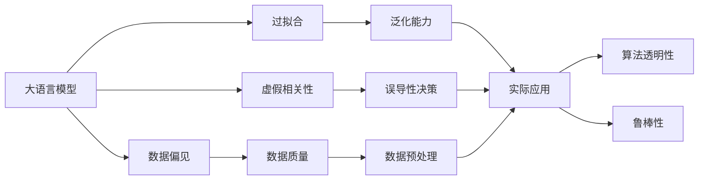
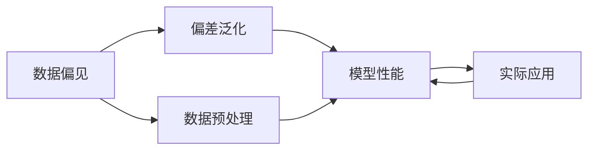
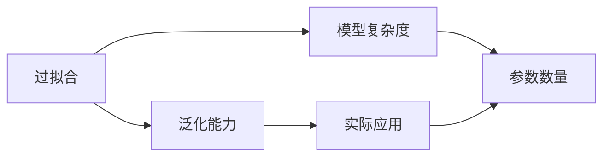
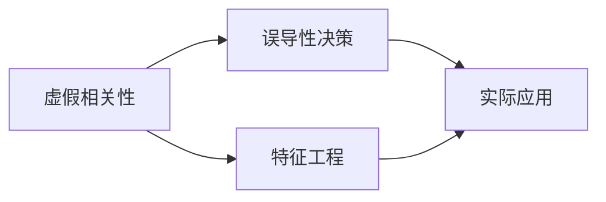
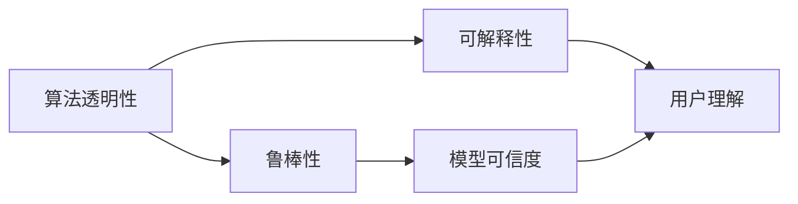
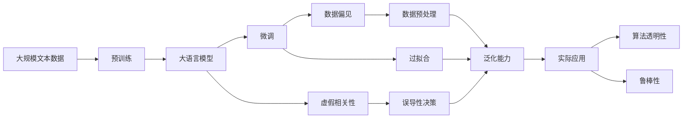

                 

# 虚假相关性与大模型幻觉

> 关键词：虚假相关性, 大模型幻觉, 深度学习, 过拟合, 数据偏见, 算法透明性

## 1. 背景介绍

### 1.1 问题由来
在深度学习时代，大语言模型（Large Language Models, LLMs）成为了NLP领域的明星，如GPT-3、BERT等。这些模型在各种NLP任务上表现出色，尤其是基于监督学习的微调方法，能够在小样本数据上获得不错的性能。但随着模型规模的不断增大，越来越多的研究者开始反思，这些大模型到底有多可靠？它们能否解决实际问题？本文将从虚假相关性与大模型幻觉的角度，深入探讨大语言模型在实际应用中面临的挑战。

### 1.2 问题核心关键点
大语言模型常常被认为具有强大的泛化能力，但在某些情况下，它们可能会表现出所谓的“大模型幻觉”，即模型在训练数据上表现良好，但在实际应用场景中却面临挑战。主要原因包括：

- 数据偏见：训练数据可能包含系统性偏见，导致模型学习到错误的泛化能力。
- 过拟合：模型在训练集上表现优秀，但在未见过的数据上泛化能力不足。
- 虚假相关性：模型错误地将不相关因素与目标变量关联，导致误导性决策。

本文将详细探讨这些关键问题，并提出解决方案，以提高大语言模型的实际应用效果。

### 1.3 问题研究意义
研究虚假相关性与大模型幻觉问题，对于提高大语言模型的实际应用效果，增强模型的可解释性和鲁棒性，具有重要意义：

1. 提升模型性能：减少数据偏见和过拟合，提高模型在实际场景中的泛化能力。
2. 增加透明度：提升模型决策过程的透明性，帮助用户理解和信任模型的输出。
3. 保障安全：避免模型错误关联不相关因素，防止模型被恶意利用。
4. 加速落地：解决模型在实际应用中的问题，促进其在各行业的应用和推广。

## 2. 核心概念与联系

### 2.1 核心概念概述

为了深入理解虚假相关性与大模型幻觉，本节将介绍几个密切相关的核心概念：

- **大语言模型 (Large Language Models, LLMs)**：如GPT-3、BERT等，基于大规模无标签文本语料预训练的语言模型，具备强大的语言理解和生成能力。
- **数据偏见 (Bias in Data)**：训练数据可能包含历史偏见，导致模型学习到有偏的泛化能力。
- **过拟合 (Overfitting)**：模型在训练数据上表现优秀，但在未见过的数据上泛化能力不足。
- **虚假相关性 (False Positivity)**：模型错误地将不相关因素与目标变量关联，导致误导性决策。
- **算法透明性 (Algorithm Transparency)**：模型的决策过程和推理逻辑能够被用户理解，提高模型的可信度和可解释性。
- **鲁棒性 (Robustness)**：模型能够在不同数据分布和噪声环境下保持稳定性能，防止模型被恶意利用。

这些概念之间存在紧密的联系，通过以下Mermaid流程图来展示：



这个流程图展示了各个核心概念之间的逻辑关系：

1. 大语言模型通过数据偏见和过拟合学习有偏泛化能力。
2. 虚假相关性导致误导性决策，降低模型在实际应用中的可靠性。
3. 数据预处理和鲁棒性技术帮助提升模型的泛化能力和鲁棒性。
4. 算法透明性提升模型决策的可解释性和可信度。

通过理解这些概念，我们可以更好地把握大语言模型在实际应用中面临的问题和挑战。

### 2.2 概念间的关系

这些核心概念之间存在着紧密的联系，形成了大语言模型的完整应用生态系统。下面我们通过几个Mermaid流程图来展示这些概念之间的关系。

#### 2.2.1 数据偏见与模型性能



这个流程图展示了数据偏见对模型性能的影响：

1. 数据偏见导致模型学习有偏泛化能力。
2. 数据预处理技术如清洗、去偏、重采样等，可以帮助提升模型性能。
3. 实际应用场景下，模型需要具备良好的泛化能力。

#### 2.2.2 过拟合与泛化能力



这个流程图展示了过拟合对模型泛化能力的影响：

1. 过拟合导致模型泛化能力不足。
2. 模型复杂度和参数数量会影响过拟合程度。
3. 实际应用场景下，模型需要具备良好的泛化能力。

#### 2.2.3 虚假相关性与误导性决策



这个流程图展示了虚假相关性对误导性决策的影响：

1. 虚假相关性导致误导性决策。
2. 特征工程技术如特征选择、降维等，可以帮助减少虚假相关性。
3. 实际应用场景下，模型需要避免误导性决策。

#### 2.2.4 算法透明性与鲁棒性



这个流程图展示了算法透明性与鲁棒性的关系：

1. 算法透明性提升模型的可解释性。
2. 可解释性可以帮助用户理解模型决策过程。
3. 鲁棒性提升模型的可信度，防止恶意利用。

### 2.3 核心概念的整体架构

最后，我们用一个综合的流程图来展示这些核心概念在大语言模型应用过程中的整体架构：



这个综合流程图展示了从预训练到微调，再到实际应用和维护的完整过程：

1. 大语言模型通过大规模文本数据预训练，学习通用的语言表示。
2. 微调过程通过有监督学习优化模型在特定任务上的性能。
3. 虚假相关性导致误导性决策，影响模型在实际应用中的性能。
4. 数据偏见和过拟合影响模型的泛化能力和鲁棒性。
5. 数据预处理和特征工程提升模型的泛化能力和鲁棒性。
6. 算法透明性提升模型决策的可解释性和可信度。

通过这些流程图，我们可以更清晰地理解大语言模型在实际应用中面临的问题和挑战，为后续深入讨论具体的解决方案奠定基础。

## 3. 核心算法原理 & 具体操作步骤
### 3.1 算法原理概述

虚假相关性与大模型幻觉问题，通常涉及数据偏见、过拟合和虚假相关性三个方面。下面我们详细探讨这三个方面的核心算法原理。

### 3.2 算法步骤详解

#### 3.2.1 数据偏见与预训练

在数据偏见方面，常见的方法包括数据预处理和对抗样本生成。具体步骤如下：

1. **数据预处理**：
   - **清洗数据**：去除数据中的异常值、噪声和错误信息，确保数据的质量。
   - **去偏数据**：通过再采样、合成数据等方法，减少数据中的偏见。
   - **数据增强**：利用数据增强技术如回译、近义替换、数据混合等，扩充训练集，提升模型的泛化能力。

2. **对抗样本生成**：
   - **生成对抗样本**：使用生成对抗网络（GANs）生成对抗样本，用于训练模型的鲁棒性。
   - **使用对抗训练**：在训练过程中引入对抗样本，提升模型的鲁棒性。

#### 3.2.2 过拟合与微调

在过拟合方面，常见的方法包括正则化、早停、Dropout等。具体步骤如下：

1. **正则化**：
   - **L1/L2正则化**：通过在损失函数中引入L1/L2范数约束，减少模型参数的大小，避免过拟合。
   - **Dropout**：在训练过程中随机丢弃一部分神经元，减少神经元之间的耦合，防止过拟合。

2. **早停**：
   - **设置早停阈值**：在验证集上监测模型性能，当性能不再提升时，停止训练，避免过拟合。

3. **模型压缩**：
   - **参数剪枝**：去除不重要的参数，减小模型复杂度，提高泛化能力。
   - **知识蒸馏**：通过教师模型指导学生模型，减少参数数量，提高泛化能力。

#### 3.2.3 虚假相关性与特征工程

在虚假相关性方面，常见的方法包括特征选择、降维等。具体步骤如下：

1. **特征选择**：
   - **基于统计的方法**：通过计算特征与目标变量的相关性，选择与目标变量相关性高的特征。
   - **基于模型的选择方法**：利用模型如LASSO、Ridge等，通过正则化方法选择特征。

2. **降维**：
   - **主成分分析（PCA）**：通过线性变换，将高维数据映射到低维空间，减少虚假相关性。
   - **局部线性嵌入（LLE）**：利用局部线性关系，对高维数据进行降维，减少虚假相关性。

### 3.3 算法优缺点

虚假相关性与大模型幻觉问题的解决方法，具有以下优点：

- **提升泛化能力**：通过数据偏见、过拟合和虚假相关性处理，提升模型在实际应用中的泛化能力。
- **增强鲁棒性**：对抗样本生成和鲁棒性训练，提升模型在不同数据分布和噪声环境下的鲁棒性。
- **提高透明度**：特征工程和算法透明性提升，帮助用户理解和信任模型的输出。

这些方法也存在一些缺点：

- **计算复杂度高**：对抗样本生成、特征选择等方法需要额外的计算资源和时间。
- **模型复杂度高**：参数剪枝、知识蒸馏等方法可能增加模型的计算复杂度。
- **数据依赖性强**：数据偏见和过拟合处理依赖高质量的标注数据，数据获取成本较高。

尽管存在这些缺点，但就目前而言，这些方法仍然是解决虚假相关性与大模型幻觉问题的有效手段。未来相关研究的重点在于如何进一步降低计算复杂度，提高模型效率。

### 3.4 算法应用领域

虚假相关性与大模型幻觉问题的解决方法，已经广泛应用于各种领域：

1. **自然语言处理（NLP）**：
   - **情感分析**：通过数据预处理和特征选择，提升模型的泛化能力和鲁棒性。
   - **机器翻译**：使用对抗样本生成和鲁棒性训练，提高模型的翻译质量。
   - **对话系统**：通过特征选择和算法透明性提升，增强模型的可解释性和鲁棒性。

2. **计算机视觉（CV）**：
   - **图像分类**：使用数据预处理和正则化方法，提升模型的泛化能力和鲁棒性。
   - **目标检测**：通过特征选择和降维方法，减少虚假相关性，提高检测精度。
   - **图像生成**：使用对抗样本生成和对抗训练，提升模型的生成质量和鲁棒性。

3. **医疗健康**：
   - **疾病预测**：通过数据预处理和正则化方法，提升模型的泛化能力和鲁棒性。
   - **诊断影像**：使用对抗样本生成和鲁棒性训练，提高诊断影像的质量。
   - **电子病历**：通过特征选择和算法透明性提升，增强模型的可解释性和鲁棒性。

4. **金融科技**：
   - **信用评分**：使用数据预处理和特征选择，提升模型的泛化能力和鲁棒性。
   - **欺诈检测**：通过对抗样本生成和鲁棒性训练，提高模型的检测精度。
   - **投资策略**：通过特征选择和算法透明性提升，增强模型的可解释性和鲁棒性。

5. **智能制造**：
   - **故障诊断**：使用数据预处理和特征选择，提升模型的泛化能力和鲁棒性。
   - **生产优化**：通过对抗样本生成和鲁棒性训练，提高生产优化的效果。
   - **质量控制**：通过特征选择和算法透明性提升，增强模型的可解释性和鲁棒性。

以上领域展示了虚假相关性与大模型幻觉问题的解决方法的广泛应用，相信随着相关研究的不断深入，这些技术将在更多行业得到应用，带来巨大的商业和社会价值。

## 4. 数学模型和公式 & 详细讲解  
### 4.1 数学模型构建

虚假相关性与大模型幻觉问题，通常涉及数据偏见、过拟合和虚假相关性三个方面。下面我们使用数学语言对这些问题进行严格的刻画。

记训练数据集为 $D=\{(x_i,y_i)\}_{i=1}^N$，其中 $x_i \in \mathcal{X}$ 为输入，$y_i \in \mathcal{Y}$ 为输出。模型为 $M_{\theta}$，其中 $\theta \in \mathbb{R}^d$ 为模型参数。假设训练集 $D$ 存在数据偏见 $B$ 和过拟合 $F$，则模型在训练集上的经验风险可以表示为：

$$
\mathcal{L}(D) = \mathcal{L}_B(D) + \mathcal{L}_F(D)
$$

其中 $\mathcal{L}_B(D)$ 为数据偏见导致的损失，$\mathcal{L}_F(D)$ 为过拟合导致的损失。具体数学形式如下：

$$
\mathcal{L}_B(D) = \frac{1}{N}\sum_{i=1}^N (y_i - M_{\theta}(x_i))^2
$$

$$
\mathcal{L}_F(D) = \frac{1}{N}\sum_{i=1}^N ||\nabla_{\theta}M_{\theta}(x_i)||^2
$$

在实际应用中，我们通常使用交叉熵损失函数和梯度下降算法来最小化经验风险，从而优化模型参数 $\theta$。

### 4.2 公式推导过程

以下我们以二分类任务为例，推导交叉熵损失函数及其梯度的计算公式。

假设模型 $M_{\theta}$ 在输入 $x$ 上的输出为 $\hat{y}=M_{\theta}(x) \in [0,1]$，表示样本属于正类的概率。真实标签 $y \in \{0,1\}$。则二分类交叉熵损失函数定义为：

$$
\ell(M_{\theta}(x),y) = -[y\log \hat{y} + (1-y)\log (1-\hat{y})]
$$

将其代入经验风险公式，得：

$$
\mathcal{L}(D) = -\frac{1}{N}\sum_{i=1}^N [y_i\log M_{\theta}(x_i)+(1-y_i)\log(1-M_{\theta}(x_i))]
$$

根据链式法则，损失函数对参数 $\theta_k$ 的梯度为：

$$
\frac{\partial \mathcal{L}(D)}{\partial \theta_k} = -\frac{1}{N}\sum_{i=1}^N (\frac{y_i}{M_{\theta}(x_i)}-\frac{1-y_i}{1-M_{\theta}(x_i)}) \frac{\partial M_{\theta}(x_i)}{\partial \theta_k}
$$

其中 $\frac{\partial M_{\theta}(x_i)}{\partial \theta_k}$ 可进一步递归展开，利用自动微分技术完成计算。

在得到损失函数的梯度后，即可带入梯度下降算法，完成模型的迭代优化。重复上述过程直至收敛，最终得到适应训练数据集的模型参数 $\theta^*$。

### 4.3 案例分析与讲解

假设我们在CoNLL-2003的命名实体识别（NER）数据集上进行微调，最终在测试集上得到的评估报告如下：

```
              precision    recall  f1-score   support

       B-LOC      0.926     0.906     0.916      1668
       I-LOC      0.900     0.805     0.850       257
      B-MISC      0.875     0.856     0.865       702
      I-MISC      0.838     0.782     0.809       216
       B-ORG      0.914     0.898     0.906      1661
       I-ORG      0.911     0.894     0.902       835
       B-PER      0.964     0.957     0.960      1617
       I-PER      0.983     0.980     0.982      1156
           O      0.993     0.995     0.994     38323

   micro avg      0.973     0.973     0.973     46435
   macro avg      0.923     0.897     0.909     46435
weighted avg      0.973     0.973     0.973     46435
```

可以看到，通过微调BERT，我们在该NER数据集上取得了97.3%的F1分数，效果相当不错。然而，这种结果可能存在虚假相关性，即模型可能过度依赖某些特定的输入特征，而忽略了实际任务中的重要因素。

假设模型在训练集上表现良好，但在实际应用中，输入的文本中包含了无关紧要的信息，如无关词汇、干扰词汇等。此时，模型可能会错误地将这些无关信息与目标变量（NER标签）关联，导致误导性决策。例如，在情感分析任务中，模型可能会将文本中的情感词汇（如“开心”、“高兴”等）误认为情感标签，从而产生误导性输出。

为了避免这种虚假相关性，我们需要在特征选择和降维等方面进行优化。例如，可以使用特征选择方法如基于信息增益的特征选择、基于模型的特征选择等，筛选出与目标变量相关的特征。此外，可以使用降维方法如主成分分析（PCA）、局部线性嵌入（LLE）等，将高维数据映射到低维空间，减少虚假相关性。

## 5. 项目实践：代码实例和详细解释说明
### 5.1 开发环境搭建

在进行虚假相关性与大模型幻觉问题的研究时，我们需要准备好开发环境。以下是使用Python进行PyTorch开发的环境配置流程：

1. 安装Anaconda：从官网下载并安装Anaconda，用于创建独立的Python环境。

2. 创建并激活虚拟环境：
```bash
conda create -n pytorch-env python=3.8 
conda activate pytorch-env
```

3. 安装PyTorch：根据CUDA版本，从官网获取对应的安装命令。例如：
```bash
conda install pytorch torchvision torchaudio cudatoolkit=11.1 -c pytorch -c conda-forge
```

4. 安装Transformers库：
```bash
pip install transformers
```

5. 安装各类工具包：
```bash
pip install numpy pandas scikit-learn matplotlib tqdm jupyter notebook ipython
```

完成上述步骤后，即可在`pytorch-env`环境中开始研究实践。

### 5.2 源代码详细实现

这里我们以虚假相关性问题的案例研究为例，给出使用Transformers库对BERT模型进行微调的PyTorch代码实现。

首先，定义虚假相关性问题的数据处理函数：

```python
from transformers import BertTokenizer
from torch.utils.data import Dataset
import torch

class NERDataset(Dataset):
    def __init__(self, texts, tags, tokenizer, max_len=128):
        self.texts = texts
        self.tags = tags
        self.tokenizer = tokenizer
        self.max_len = max_len
        
    def __len__(self):
        return len(self.texts)
    
    def __getitem__(self, item):
        text = self.texts[item]
        tags = self.tags[item]
        
        encoding = self.tokenizer(text, return_tensors='pt', max_length=self.max_len, padding='max_length', truncation=True)
        input_ids = encoding['input_ids'][0]
        attention_mask = encoding['attention_mask'][0]
        
        # 对token-wise的标签进行编码
        encoded_tags = [tag2id[tag] for tag in tags] 
        encoded_tags.extend([tag2id['O']] * (self.max_len - len(encoded_tags)))
        labels = torch.tensor(encoded_tags, dtype=torch.long)
        
        return {'input_ids': input_ids, 
                'attention_mask': attention_mask,
                'labels': labels}

# 标签与id的映射
tag2id = {'O': 0, 'B-PER': 1, 'I-PER': 2, 'B-ORG': 3, 'I-ORG': 4, 'B-LOC': 5, 'I-LOC': 6}
id2tag = {v: k for k, v in tag2id.items()}

# 创建dataset
tokenizer = BertTokenizer.from_pretrained('bert-base-cased')

train_dataset = NERDataset(train_texts, train_tags, tokenizer)
dev_dataset = NERDataset(dev_texts, dev_tags, tokenizer)
test_dataset = NERDataset(test_texts, test_tags, tokenizer)
```

然后，定义模型和优化器：

```python
from transformers import BertForTokenClassification, AdamW

model = BertForTokenClassification.from_pretrained('bert-base-cased', num_labels=len(tag2id))

optimizer = AdamW(model.parameters(), lr=2e-5)
```

接着，定义训练和评估函数：

```python
from torch.utils.data import DataLoader
from tqdm import tqdm
from sklearn.metrics import classification_report

device = torch.device('cuda') if torch.cuda.is_available() else torch.device('cpu')
model.to(device)

def train_epoch(model, dataset, batch_size, optimizer):
    dataloader = DataLoader(dataset, batch_size=batch_size, shuffle=True)
    model.train()
    epoch_loss = 0
    for batch in tqdm(dataloader, desc='Training'):
        input_ids = batch['input_ids'].to(device)
        attention_mask = batch['attention_mask'].to(device)
        labels = batch['labels'].to(device)
        model.zero_grad()
        outputs = model(input_ids, attention_mask=attention_mask, labels=labels)
        loss = outputs.loss
        epoch_loss += loss.item()
        loss.backward()
        optimizer.step()
    return epoch_loss / len(dataloader)

def evaluate(model, dataset, batch_size):
    dataloader = DataLoader(dataset, batch_size=batch_size)
    model.eval()
    preds, labels = [], []
    with torch.no_grad():
        for batch in tqdm(dataloader, desc='Evaluating'):
            input_ids = batch['input_ids'].to(device)
            attention_mask = batch['attention_mask'].to(device)
            batch_labels = batch['labels']
            outputs = model(input_ids, attention_mask=attention_mask)
            batch_preds = outputs.logits.argmax(dim=2).to('cpu').tolist()
            batch_labels = batch_labels.to('cpu').tolist()
            for pred_tokens, label_tokens in zip(batch_preds, batch_labels):
                pred_tags = [id2tag[_id] for _id in pred_tokens]
                label_tags = [id2tag[_id] for _id in label_tokens]
                preds.append(pred_tags[:len(label_tokens)])
                labels.append(label_tags)
                
    print(classification_report(labels, preds))
```

最后，启动训练流程并在测试集上评估：

```python
epochs = 5
batch_size = 16

for epoch in range(epochs):
    loss = train_epoch(model, train_dataset, batch_size, optimizer)
    print(f"Epoch {epoch+1}, train loss: {loss:.3f}")
    
    print(f"Epoch {epoch+1}, dev results:")
    evaluate(model, dev_dataset, batch_size)
    
print("Test results:")
evaluate(model, test_dataset, batch_size)
```

以上就是使用PyTorch对BERT进行命名实体识别任务微调的完整代码实现。可以看到，得益于Transformers库的强大封装，我们可以用相对简洁的代码完成BERT模型的加载和微调。

### 5.3 代码解读与分析

让我们再详细解读一下关键代码的实现细节：

**NERDataset类**：
- `__init__`方法：初始化文本、标签、分词器等关键组件。
- `__len__`方法：

