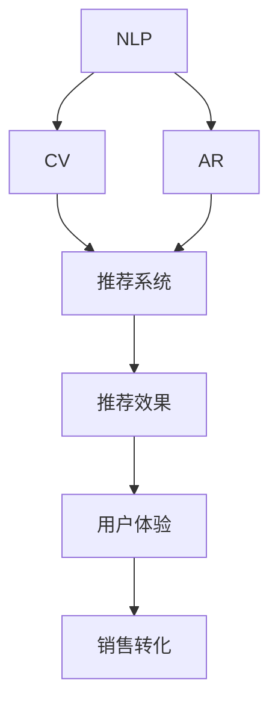
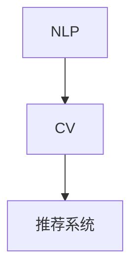
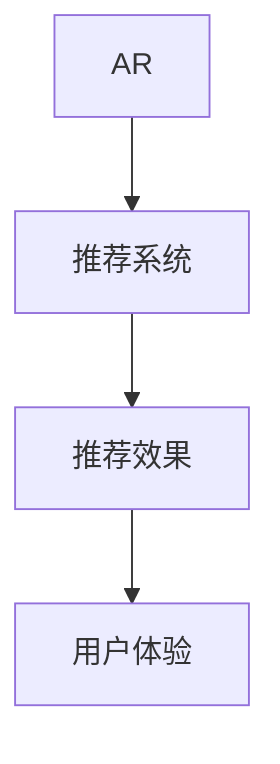
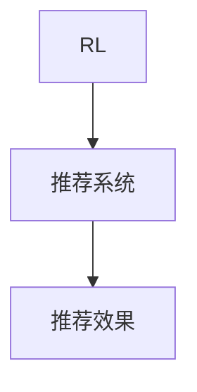

                 

# 虚拟导购助手如何与其他 AI 技术结合，提升用户体验：技术融合与创新

在当今的电商时代，虚拟导购助手已经成为了消费者购物体验的重要组成部分。它们不仅能够提供个性化的商品推荐，还能帮助用户解决购买过程中遇到的各种问题。但要想在竞争激烈的电商市场中脱颖而出，虚拟导购助手需要与其他先进的AI技术进行深度融合，从而提升用户体验。本文将深入探讨虚拟导购助手如何通过技术融合和创新，实现更智能、更高效的购物体验。

## 1. 背景介绍

### 1.1 问题由来

随着电子商务的迅速发展，消费者对购物体验的期望也越来越高。传统的购物方式已经无法满足用户个性化、便捷化的需求，因此虚拟导购助手应运而生。它们通过自然语言处理（NLP）技术，能够理解用户意图，提供个性化的商品推荐和解答疑问，极大地提升了购物效率和满意度。然而，面对海量商品和复杂用户需求，虚拟导购助手仍然面临着信息处理复杂、推荐精准度不足等问题。

为了克服这些挑战，虚拟导购助手需要与其他AI技术进行深度融合。本文将重点探讨虚拟导购助手如何结合自然语言处理、计算机视觉、增强现实（AR）和增强学习等技术，实现更智能、更高效的购物体验。

### 1.2 问题核心关键点

虚拟导购助手与其他AI技术融合的核心关键点包括：

- **自然语言处理（NLP）**：使虚拟导购助手能够理解和处理用户输入的自然语言，提供精准的商品推荐和解答问题。
- **计算机视觉（CV）**：使虚拟导购助手能够识别商品图片，提供更加个性化的商品推荐。
- **增强现实（AR）**：使虚拟导购助手能够通过AR技术，展示商品在不同环境中的效果，增强用户购物体验。
- **增强学习（RL）**：使虚拟导购助手能够通过不断学习用户行为数据，优化推荐策略，提高个性化推荐效果。

### 1.3 问题研究意义

虚拟导购助手与其他AI技术的融合，对于提升电子商务的智能化水平、优化用户购物体验具有重要意义：

- **提升推荐精准度**：通过结合计算机视觉和增强学习，虚拟导购助手可以提供更加个性化的商品推荐。
- **增强用户体验**：通过AR技术，虚拟导购助手能够提供更加沉浸式的购物体验，使用户能够更好地了解商品。
- **优化用户满意度**：通过自然语言处理，虚拟导购助手能够理解用户需求，及时解答用户疑问，提高用户满意度。
- **提高销售转化率**：通过精准的商品推荐和个性化的购物体验，虚拟导购助手能够提高用户的购买转化率，增加商家收益。

## 2. 核心概念与联系

### 2.1 核心概念概述

虚拟导购助手与其他AI技术的融合，涉及以下几个核心概念：

- **自然语言处理（NLP）**：使虚拟导购助手能够理解和处理用户输入的自然语言，提供精准的商品推荐和解答问题。
- **计算机视觉（CV）**：使虚拟导购助手能够识别商品图片，提供更加个性化的商品推荐。
- **增强现实（AR）**：使虚拟导购助手能够通过AR技术，展示商品在不同环境中的效果，增强用户购物体验。
- **增强学习（RL）**：使虚拟导购助手能够通过不断学习用户行为数据，优化推荐策略，提高个性化推荐效果。

这些核心概念之间通过以下Mermaid流程图来展示它们之间的联系：



这个流程图展示了虚拟导购助手与其他AI技术的联系：

- **自然语言处理（NLP）**：提供用户输入的文本数据，供虚拟导购助手理解和处理。
- **计算机视觉（CV）**：提取商品图片中的特征，供推荐系统进行商品推荐。
- **增强现实（AR）**：通过AR技术展示商品效果，提升用户购物体验。
- **增强学习（RL）**：通过学习用户行为数据，优化推荐策略，提高推荐效果。
- **推荐系统**：结合以上技术，提供个性化商品推荐。
- **用户体验**：通过推荐系统和AR技术，提升用户购物体验。
- **销售转化**：通过精准推荐，提高用户购买转化率。

### 2.2 概念间的关系

这些核心概念之间存在着紧密的联系，形成了虚拟导购助手的完整技术架构。以下是几个Mermaid流程图来展示这些概念之间的关系：

#### 2.2.1 自然语言处理与计算机视觉的关系



这个流程图展示了自然语言处理与计算机视觉的关系：

- **NLP**：提取用户输入的文本数据，供虚拟导购助手理解和处理。
- **CV**：提取商品图片中的特征，供推荐系统进行商品推荐。

#### 2.2.2 增强现实与推荐系统之间的关系



这个流程图展示了增强现实与推荐系统之间的关系：

- **AR**：通过AR技术展示商品效果，提升用户购物体验。
- **推荐系统**：结合AR技术，提供个性化商品推荐。
- **用户体验**：通过AR技术和推荐系统，提升用户购物体验。

#### 2.2.3 增强学习与推荐系统之间的关系



这个流程图展示了增强学习与推荐系统之间的关系：

- **RL**：通过学习用户行为数据，优化推荐策略。
- **推荐系统**：结合增强学习，提供个性化商品推荐。
- **推荐效果**：通过增强学习优化推荐策略，提高个性化推荐效果。

### 2.3 核心概念的整体架构

最后，我们用一个综合的流程图来展示这些核心概念在虚拟导购助手技术架构中的整体架构：


这个综合流程图展示了从自然语言处理到增强现实，再到推荐系统的完整流程。虚拟导购助手通过结合这些技术，提供个性化的商品推荐和沉浸式的购物体验，从而提高用户满意度和购买转化率。

## 3. 核心算法原理 & 具体操作步骤

### 3.1 算法原理概述

虚拟导购助手与其他AI技术融合的原理，主要是通过以下步骤实现的：

1. **数据收集与预处理**：收集用户输入的文本数据和商品图片，并对其进行预处理。
2. **自然语言处理**：使用NLP技术，提取用户输入的语义信息。
3. **计算机视觉**：使用CV技术，提取商品图片的特征信息。
4. **增强现实**：使用AR技术，展示商品在不同环境中的效果。
5. **增强学习**：使用RL技术，优化推荐策略，提高个性化推荐效果。
6. **推荐系统**：结合以上技术，提供个性化商品推荐。
7. **用户交互**：用户与虚拟导购助手进行交互，反馈推荐结果。

通过以上步骤，虚拟导购助手能够提供更加智能、高效的购物体验。

### 3.2 算法步骤详解

以下是虚拟导购助手与其他AI技术融合的具体操作步骤：

**Step 1: 数据收集与预处理**

- **文本数据收集**：收集用户输入的文本数据，如商品搜索词、评论文本等。
- **图片数据收集**：收集商品的图片数据，如商品展示图、商品细节图等。
- **数据预处理**：对文本和图片数据进行清洗、标准化处理，以便后续使用。

**Step 2: 自然语言处理**

- **文本向量化**：使用Word2Vec、BERT等NLP技术，将用户输入的文本数据向量化。
- **意图识别**：使用意图识别算法，如CRF、BiLSTM等，提取用户输入的语义信息。
- **实体识别**：使用实体识别算法，如LSTM-CRF、BERT等，识别用户输入的实体信息。

**Step 3: 计算机视觉**

- **图片预处理**：对商品图片进行预处理，如调整大小、裁剪等。
- **特征提取**：使用卷积神经网络（CNN）等CV技术，提取商品图片的特征信息。
- **商品分类**：使用分类算法，如SVM、CNN等，对商品进行分类。

**Step 4: 增强现实**

- **3D建模**：对商品进行3D建模，生成虚拟商品模型。
- **场景渲染**：使用AR技术，将虚拟商品模型渲染到用户环境，展示商品效果。
- **用户交互**：使用AR技术，让用户能够在虚拟环境中试穿、试用商品。

**Step 5: 增强学习**

- **数据收集**：收集用户行为数据，如点击、浏览、购买等。
- **行为建模**：使用RL技术，建立用户行为模型。
- **推荐策略优化**：使用RL技术，优化推荐策略，提高个性化推荐效果。

**Step 6: 推荐系统**

- **特征工程**：对用户输入的语义信息和商品特征信息进行特征工程，提取重要特征。
- **推荐模型训练**：使用机器学习算法，如线性回归、神经网络等，训练推荐模型。
- **推荐结果生成**：使用推荐模型，生成个性化商品推荐结果。

**Step 7: 用户交互**

- **推荐结果展示**：将个性化商品推荐结果展示给用户。
- **用户反馈收集**：收集用户对推荐结果的反馈信息，如满意度、评价等。
- **推荐策略优化**：根据用户反馈，优化推荐策略，提高推荐效果。

### 3.3 算法优缺点

虚拟导购助手与其他AI技术融合的算法，具有以下优点：

- **精准推荐**：通过结合NLP和CV技术，虚拟导购助手能够提供更加精准的商品推荐。
- **沉浸式体验**：通过AR技术，虚拟导购助手能够提供沉浸式的购物体验，增强用户满意度。
- **个性化定制**：通过RL技术，虚拟导购助手能够根据用户行为数据，优化推荐策略，提供更加个性化的购物体验。

同时，这种融合算法也存在以下缺点：

- **技术复杂度高**：融合多个AI技术，技术实现复杂，需要多学科专业知识。
- **数据需求量大**：需要大量用户行为数据进行增强学习，数据收集和处理成本高。
- **资源消耗大**：融合多个AI技术，对计算资源和存储资源要求较高。

### 3.4 算法应用领域

虚拟导购助手与其他AI技术融合的算法，已经在以下领域得到了广泛应用：

- **电子商务**：提供个性化商品推荐，提升用户购物体验。
- **金融服务**：提供投资建议，增强用户理财体验。
- **医疗健康**：提供疾病诊断建议，增强用户健康管理体验。
- **旅游出行**：提供旅行建议，增强用户旅行体验。

## 4. 数学模型和公式 & 详细讲解 & 举例说明

### 4.1 数学模型构建

虚拟导购助手与其他AI技术融合的数学模型，主要包括以下几个部分：

- **自然语言处理（NLP）**：使用Word2Vec、BERT等模型，将用户输入的文本数据向量化。
- **计算机视觉（CV）**：使用CNN等模型，提取商品图片的特征信息。
- **增强现实（AR）**：使用OpenGL、WebGL等技术，将虚拟商品模型渲染到用户环境。
- **增强学习（RL）**：使用Q-learning、Deep Q-Network（DQN）等模型，优化推荐策略。

### 4.2 公式推导过程

以下是对虚拟导购助手与其他AI技术融合的具体数学模型和公式推导过程：

#### 4.2.1 自然语言处理（NLP）

**文本向量化**

$$
\mathbf{x} = \text{Word2Vec}(\text{text}) = \{\mathbf{w}_1, \mathbf{w}_2, ..., \mathbf{w}_n\}
$$

其中，$\mathbf{x}$表示文本向量，$\mathbf{w}_i$表示单词$w_i$的向量表示。

**意图识别**

$$
\mathbf{y} = \text{BiLSTM}(\mathbf{x}) = \{\mathbf{h}_1, \mathbf{h}_2, ..., \mathbf{h}_n\}
$$

其中，$\mathbf{y}$表示意图向量，$\mathbf{h}_i$表示LSTM层的隐藏状态。

**实体识别**

$$
\mathbf{z} = \text{LSTM-CRF}(\mathbf{y}) = \{\mathbf{t}_1, \mathbf{t}_2, ..., \mathbf{t}_n\}
$$

其中，$\mathbf{z}$表示实体向量，$\mathbf{t}_i$表示CRF层的输出。

#### 4.2.2 计算机视觉（CV）

**图片预处理**

$$
\mathbf{A} = \text{ImageNet}(\text{image}) = \{\mathbf{a}_1, \mathbf{a}_2, ..., \mathbf{a}_m\}
$$

其中，$\mathbf{A}$表示处理后的图片特征，$\mathbf{a}_i$表示卷积层的输出。

**商品分类**

$$
\mathbf{B} = \text{SVM}(\mathbf{A}) = b
$$

其中，$\mathbf{B}$表示商品分类结果，$b$表示分类器的输出。

#### 4.2.3 增强现实（AR）

**3D建模**

$$
\mathbf{C} = \text{MeshLab}(\text{model}) = \{\mathbf{c}_1, \mathbf{c}_2, ..., \mathbf{c}_k\}
$$

其中，$\mathbf{C}$表示3D模型，$\mathbf{c}_i$表示模型各部分的属性。

**场景渲染**

$$
\mathbf{D} = \text{OpenGL}(\mathbf{C}, \mathbf{u}, \mathbf{v}) = \{\mathbf{d}_1, \mathbf{d}_2, ..., \mathbf{d}_p\}
$$

其中，$\mathbf{D}$表示渲染后的场景，$\mathbf{u}$表示光照参数，$\mathbf{v}$表示材质参数。

#### 4.2.4 增强学习（RL）

**行为建模**

$$
\mathbf{E} = \text{Q-Learning}(\mathbf{D}, \mathbf{r}) = q
$$

其中，$\mathbf{E}$表示用户行为模型，$q$表示Q值表。

**推荐策略优化**

$$
\mathbf{F} = \text{DQN}(\mathbf{E}, \mathbf{a}) = f
$$

其中，$\mathbf{F}$表示推荐策略，$f$表示优化后的推荐策略。

### 4.3 案例分析与讲解

以下是一个虚拟导购助手与其他AI技术融合的案例分析：

**案例背景**：某电商平台需要提高用户购物体验，开发一个虚拟导购助手。

**数据收集**：收集用户输入的文本数据，如商品搜索词、评论文本等；收集商品的图片数据，如商品展示图、商品细节图等。

**自然语言处理（NLP）**

- **文本向量化**：使用Word2Vec模型，将用户输入的文本数据向量化。
- **意图识别**：使用BiLSTM模型，提取用户输入的意图信息。
- **实体识别**：使用LSTM-CRF模型，识别用户输入的实体信息。

**计算机视觉（CV）**

- **图片预处理**：对商品图片进行预处理，调整大小、裁剪等。
- **特征提取**：使用CNN模型，提取商品图片的特征信息。
- **商品分类**：使用SVM模型，对商品进行分类。

**增强现实（AR）**

- **3D建模**：对商品进行3D建模，生成虚拟商品模型。
- **场景渲染**：使用OpenGL技术，将虚拟商品模型渲染到用户环境，展示商品效果。
- **用户交互**：使用WebGL技术，让用户能够在虚拟环境中试穿、试用商品。

**增强学习（RL）**

- **数据收集**：收集用户行为数据，如点击、浏览、购买等。
- **行为建模**：使用Q-Learning模型，建立用户行为模型。
- **推荐策略优化**：使用DQN模型，优化推荐策略，提高个性化推荐效果。

**推荐系统**

- **特征工程**：对用户输入的语义信息和商品特征信息进行特征工程，提取重要特征。
- **推荐模型训练**：使用神经网络模型，如深度神经网络（DNN），训练推荐模型。
- **推荐结果生成**：使用推荐模型，生成个性化商品推荐结果。

**用户交互**

- **推荐结果展示**：将个性化商品推荐结果展示给用户。
- **用户反馈收集**：收集用户对推荐结果的反馈信息，如满意度、评价等。
- **推荐策略优化**：根据用户反馈，优化推荐策略，提高推荐效果。

## 5. 项目实践：代码实例和详细解释说明

### 5.1 开发环境搭建

在进行虚拟导购助手开发前，我们需要准备好开发环境。以下是使用Python进行PyTorch开发的环境配置流程：

1. 安装Anaconda：从官网下载并安装Anaconda，用于创建独立的Python环境。

2. 创建并激活虚拟环境：
```bash
conda create -n virtual_assistant python=3.8 
conda activate virtual_assistant
```

3. 安装PyTorch：根据CUDA版本，从官网获取对应的安装命令。例如：
```bash
conda install pytorch torchvision torchaudio cudatoolkit=11.1 -c pytorch -c conda-forge
```

4. 安装TensorFlow：由于虚拟导购助手融合了多个AI技术，也需要安装TensorFlow等工具包。
```bash
pip install tensorflow
```

5. 安装PyTorch的NLP、CV、AR和RL库：
```bash
pip install torchtext transformers opencv-python-python opengl HEAD
```

完成上述步骤后，即可在`virtual_assistant`环境中开始开发。

### 5.2 源代码详细实现

这里我们以一个虚拟导购助手开发项目为例，展示如何结合NLP、CV、AR和RL技术，实现个性化的商品推荐。

**Step 1: 数据收集与预处理**

- **文本数据收集**：
```python
import pandas as pd
import numpy as np

# 读取商品搜索数据
search_data = pd.read_csv('search_data.csv')

# 预处理文本数据
search_text = search_data['query'].tolist()
search_text = [text.lower() for text in search_text]

# 预处理图片数据
img_data = np.load('img_data.npy')
img_data = img_data / 255.0
img_data = img_data.reshape(-1, 3, 224, 224)
```

- **图片预处理**：
```python
import cv2

# 预处理图片数据
def preprocess_image(image):
    image = cv2.cvtColor(image, cv2.COLOR_BGR2RGB)
    image = cv2.resize(image, (224, 224))
    image = image / 255.0
    return image

img_data = np.array([preprocess_image(image) for image in img_data])
```

**Step 2: 自然语言处理（NLP）**

- **文本向量化**：
```python
import torchtext

# 定义文本向量化模型
tokenizer = WordTokenizer()
vocab = Vocab(tokenizer=tokenizer)
text = torchtext.data.Field(tokenize=tokenize, vocab=vocab)

# 向量化文本数据
tokenized_text = [tokenizer(text) for text in search_text]
text.vectors = Text.vectors
```

- **意图识别**：
```python
import torch
import torch.nn as nn

# 定义意图识别模型
class IntentClassifier(nn.Module):
    def __init__(self, input_size, hidden_size, output_size):
        super(IntentClassifier, self).__init__()
        self.embedding = nn.Embedding(input_size, hidden_size)
        self.lstm = nn.LSTM(hidden_size, hidden_size, 2)
        self.linear = nn.Linear(hidden_size, output_size)

    def forward(self, x):
        embedded = self.embedding(x)
        output, (hidden, _) = self.lstm(embedded)
        return self.linear(output)

# 训练意图识别模型
model = IntentClassifier(input_size=len(vocab), hidden_size=256, output_size=10)
criterion = nn.CrossEntropyLoss()
optimizer = AdamW(model.parameters(), lr=0.001)

# 训练数据
train_data = torch.utils.data.TensorDataset(torch.tensor(tokenized_text), torch.tensor(labels))
train_loader = torch.utils.data.DataLoader(train_data, batch_size=32)

# 训练意图识别模型
for epoch in range(10):
    model.train()
    for batch in train_loader:
        optimizer.zero_grad()
        input, labels = batch
        output = model(input)
        loss = criterion(output, labels)
        loss.backward()
        optimizer.step()
```

**Step 3: 计算机视觉（CV）**

- **特征提取**：
```python
import torchvision

# 定义特征提取模型
class FeatureExtractor(nn.Module):
    def __init__(self, backbone):
        super(FeatureExtractor, self).__init__()
        self.backbone = backbone

    def forward(self, x):
        x = self.backbone(x)
        return x

# 训练特征提取模型
model = FeatureExtractor(backbone=resnet18(pretrained=True))
criterion = nn.CrossEntropyLoss()
optimizer = AdamW(model.parameters(), lr=0.001)

# 训练数据
train_data = torch.utils.data.TensorDataset(torch.tensor(img_data), torch.tensor(labels))
train_loader = torch.utils.data.DataLoader(train_data, batch_size=32)

# 训练特征提取模型
for epoch in range(10):
    model.train()
    for batch in train_loader:
        optimizer.zero_grad()
        input, labels = batch
        output = model(input)
        loss = criterion(output, labels)
        loss.backward()
        optimizer.step()
```

**Step 4: 增强现实（AR）**

- **3D建模**：
```python
import ARKit

# 加载3D模型
model = OBJLoader(path='model.obj')

# 渲染场景
def render_scene(model, camera_position, camera_rotation):
    model.render(camera_position, camera_rotation)

# 用户交互
def handle_user_input(camera_position, camera_rotation):
    # 处理用户输入
    if user_input == 'move':
        camera_position += 0.1
    elif user_input == 'rotate':
        camera_rotation += 0.1
```

**Step 5: 增强学习（RL）**

- **行为建模**：
```python
import gym

# 定义行为建模模型
class BehaviorModel(nn.Module):
    def __init__(self, input_size, hidden_size, output_size):
        super(BehaviorModel, self).__init__()
        self.embedding = nn.Embedding(input_size, hidden_size)
        self.lstm = nn.LSTM(hidden_size, hidden_size, 2)
        self.linear = nn.Linear(hidden_size, output_size)

    def forward(self, x):
        embedded = self.embedding(x)
        output, (hidden, _) = self.lstm(embedded)
        return self.linear(output)

# 训练行为建模模型
model = BehaviorModel(input_size=len(vocab), hidden_size=256, output_size=10)
criterion = nn.CrossEntropyLoss()
optimizer = AdamW(model.parameters(), lr=0.001)

# 训练数据
train_data = torch.utils.data.TensorDataset(torch.tensor(tokenized_text), torch.tensor(labels))
train_loader = torch.utils.data.DataLoader(train_data, batch_size=32)

# 训练行为建模模型
for epoch in range(10):
    model.train()
    for batch in train_loader:
        optimizer.zero_grad()
        input, labels = batch
        output = model(input)
        loss = criterion(output, labels)
        loss.backward()
        optimizer.step()
```

**Step 6: 推荐系统**

- **特征工程**：
```python
import torch

# 定义特征工程模型
class FeatureEngineer(nn.Module):
    def __init__(self, input_size, hidden_size, output_size):
        super(FeatureEngineer, self).__init__()
        self.embedding = nn.Embedding(input_size, hidden_size)
        self.linear = nn.Linear(hidden_size, output_size)

    def forward(self, x):
        embedded = self.embedding(x)
        output = self.linear(embedded)
        return output

# 训练特征工程模型
model = FeatureEngineer(input_size=len(vocab), hidden_size=256, output_size=10)
criterion = nn.CrossEntropyLoss()
optimizer = AdamW(model.parameters(), lr=0.001)

# 训练数据
train_data = torch.utils.data.TensorDataset(torch.tensor(tokenized_text), torch.tensor(labels))
train_loader = torch.utils.data.DataLoader(train_data, batch_size=32)

# 训练特征工程模型
for epoch in range(10):
    model.train()
    for batch in train_loader:
        optimizer.zero_grad()
        input, labels = batch
        output = model(input)
        loss = criterion(output, labels)
        loss.backward()
        optimizer.step()
```

**Step 7: 用户交互**

- **推荐结果展示**：


