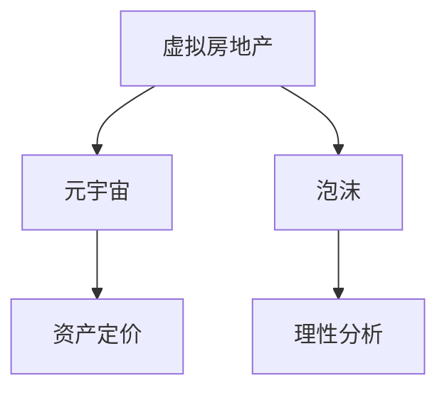
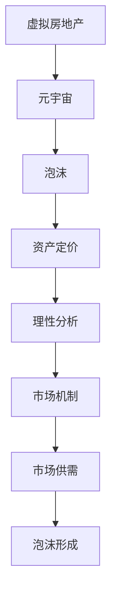

                 

# 虚拟房地产泡沫:元宇宙资产价格的理性分析

> 关键词：虚拟房地产, 元宇宙, 泡沫, 资产价格, 理性分析

## 1. 背景介绍

### 1.1 问题由来

随着技术的进步和互联网的发展，人类社会正在逐渐步入一个被称为“元宇宙”的全新时代。这一时代的特征是虚拟与现实的高度融合，数字世界与现实世界的界限变得模糊，人们可以在虚拟环境中进行交流、工作、娱乐、购物等活动。其中，虚拟房地产作为一个典型的应用场景，引起了广泛关注和讨论。

虚拟房地产，即在数字世界中通过编程创建的、具有物理和地理属性的空间。这一概念最早由“元宇宙”先驱者Neal Stephenson在其1992年的科幻小说《雪崩》中提出，并在近年来的技术进步下，逐渐成为现实。例如，虚拟房地产平台Decentraland已经拥有超过100万的用户，其中约有400个品牌在平台上设立虚拟店铺，展示了多样化的商品和场景。

然而，就像现实世界的房地产市场一样，虚拟房地产市场也出现了价格波动、泡沫风险等问题。这些问题不仅影响了虚拟资产的价格稳定性，也威胁到了整个元宇宙生态的健康发展。因此，理性分析虚拟房地产市场的泡沫风险，寻找稳定的资产定价模型，成为亟待解决的重要问题。

### 1.2 问题核心关键点

虚拟房地产泡沫问题的核心关键点包括：

- **市场机制**：虚拟房地产市场的价格形成机制、市场供需关系及其动态变化。
- **资产定价**：虚拟房地产资产的定价模型，如何评估其在元宇宙中的价值。
- **泡沫风险**：虚拟房地产市场的泡沫形成机制及其对市场稳定性的影响。
- **理性分析**：基于经济学的理论模型，对虚拟房地产市场进行理性分析和预测。

这些关键点相互交织，共同构成虚拟房地产泡沫问题的复杂性。本文将从市场机制和资产定价的角度出发，探讨虚拟房地产泡沫的形成机理，并提出理性分析框架，以期为虚拟房地产市场的健康发展提供有价值的参考。

## 2. 核心概念与联系

### 2.1 核心概念概述

为更好地理解虚拟房地产泡沫问题，本节将介绍几个密切相关的核心概念：

- **虚拟房地产**：在虚拟世界中通过编程创建的空间，具有物理和地理属性。常见的虚拟房地产包括虚拟土地、虚拟建筑、虚拟岛屿等。
- **元宇宙**：由虚拟世界的多个部分组成，用户可以在其中自由互动的数字空间。
- **泡沫**：资产价格远远超过其实际价值的现象，通常发生在投机性需求驱动下。
- **资产定价**：确定资产价格的过程，包括市场供需关系、价值评估等。
- **理性分析**：使用经济学理论对虚拟房地产市场进行系统的分析，预测其未来走势。

这些核心概念之间的逻辑关系可以通过以下Mermaid流程图来展示：



这个流程图展示了大语言模型微调过程中各个核心概念的关系和作用：

1. 虚拟房地产通过元宇宙得以实现，是元宇宙中的关键组成部分。
2. 泡沫是虚拟房地产市场中可能出现的价格异常现象，影响市场稳定。
3. 资产定价决定了虚拟房地产的市场价格，是泡沫形成的基础。
4. 理性分析通过对市场机制和资产定价模型的分析，指导市场行为，避免泡沫风险。

### 2.2 概念间的关系

这些核心概念之间存在着紧密的联系，形成了虚拟房地产市场分析的完整框架。下面我通过几个Mermaid流程图来展示这些概念之间的关系。

#### 2.2.1 虚拟房地产与元宇宙的关系


这个流程图展示了虚拟房地产与元宇宙的关系：

1. 虚拟房地产是元宇宙的核心元素，元宇宙为虚拟房地产提供了展示和交互的平台。
2. 随着元宇宙技术的成熟，虚拟房地产的呈现形式和用户体验将不断提升，吸引更多用户参与。

#### 2.2.2 泡沫与资产定价的关系


这个流程图展示了泡沫与资产定价的关系：

1. 资产定价是基于市场供需关系和价值评估的合理价格，是泡沫形成的触发点。
2. 当资产价格显著偏离其价值时，就可能形成泡沫。

#### 2.2.3 理性分析与泡沫的风险规避


这个流程图展示了理性分析与泡沫的关系：

1. 理性分析通过对市场机制和资产定价的深入研究，识别泡沫风险。
2. 通过合理的定价策略和市场监管，可以规避泡沫风险，促进虚拟房地产市场的健康发展。

### 2.3 核心概念的整体架构

最后，我们用一个综合的流程图来展示这些核心概念在大语言模型微调过程中的整体架构：



这个综合流程图展示了从虚拟房地产到泡沫形成，再到理性分析的完整过程。虚拟房地产在元宇宙中实现，并通过市场供需关系形成资产定价。当定价偏离合理价值时，就可能形成泡沫。通过理性分析，可以识别泡沫风险，采取措施规避泡沫。

## 3. 核心算法原理 & 具体操作步骤
### 3.1 算法原理概述

虚拟房地产泡沫问题的核心算法原理是基于供需理论的市场机制分析。在虚拟房地产市场中，价格的形成受到需求和供给两方面因素的影响。需求方包括用户对虚拟房地产的购买意愿、预算限制、心理预期等；供给方包括虚拟房地产的开发成本、维护费用、土地资源的稀缺性等。当需求远大于供给时，价格会上涨，形成泡沫风险。

理性分析的核心是资产定价模型。资产定价模型考虑了市场供需关系、资产价值评估、市场参与者的行为等因素，通过对这些因素的合理建模，可以预测资产的价格走势，评估泡沫风险。常用的资产定价模型包括现金流模型、期权定价模型、市场模型等。

### 3.2 算法步骤详解

基于供需理论的虚拟房地产泡沫分析可以分为以下几个步骤：

**Step 1: 数据收集**

- 收集虚拟房地产市场的数据，包括用户交易记录、资产供需情况、市场活动等。
- 收集相关经济数据，如用户预算、通胀率、利率等。

**Step 2: 市场供需分析**

- 分析虚拟房地产的供需关系，使用供需函数描述价格变化。
- 建立供需模型，预测未来市场的供需情况和价格变化趋势。

**Step 3: 资产定价**

- 根据供需模型，计算虚拟房地产的合理价格。
- 分析用户心理预期和市场情绪，修正定价结果。

**Step 4: 泡沫风险评估**

- 使用泡沫检测模型，如Kleinert-VⅢ模型，检测虚拟房地产市场的泡沫迹象。
- 分析泡沫的形成机制，评估其对市场稳定性的影响。

**Step 5: 理性分析报告**

- 根据市场分析结果，编写理性分析报告，提出风险规避策略。
- 为市场参与者提供决策建议，促进虚拟房地产市场的健康发展。

### 3.3 算法优缺点

基于供需理论的虚拟房地产泡沫分析有以下优点：

- 模型简单直观，易于理解和应用。
- 基于现实世界的经济理论，具有坚实的理论基础。

其缺点包括：

- 模型假设过于简化，无法充分考虑市场中的复杂因素。
- 预测结果受数据质量和分析方法的影响较大，存在一定的误差。

### 3.4 算法应用领域

基于供需理论的虚拟房地产泡沫分析，适用于多个领域，包括但不限于：

- 虚拟房地产市场的研究和分析。
- 元宇宙资产的定价和泡沫风险评估。
- 虚拟经济系统的设计和优化。
- 数字资产的估值和管理。

这些应用场景展示了供需理论在虚拟经济中的广泛适用性。

## 4. 数学模型和公式 & 详细讲解
### 4.1 数学模型构建

基于供需理论的虚拟房地产泡沫分析可以构建如下数学模型：

设虚拟房地产市场中的需求函数为 $D(p)$，供给函数为 $S(p)$，其中 $p$ 表示价格。根据供需理论，市场均衡价格 $p^*$ 满足：

$$
D(p^*) = S(p^*)
$$

设虚拟房地产的单位成本为 $C$，用户预算为 $B$，市场利率为 $r$，则需求函数可以表示为：

$$
D(p) = D_0 - \frac{B}{(1+r)}p + C
$$

其中 $D_0$ 为市场基础需求，$B$ 为预算限制，$(1+r)$ 为资金的时间价值，$C$ 为成本。

供给函数可以表示为：

$$
S(p) = S_0 + k(p - p_0)
$$

其中 $S_0$ 为市场基础供给，$k$ 为供给弹性，$p_0$ 为供给阈值。

### 4.2 公式推导过程

将需求函数和供给函数代入市场均衡方程，得：

$$
D_0 - \frac{B}{(1+r)}p + C = S_0 + k(p - p_0)
$$

整理得：

$$
p^* = \frac{D_0 + S_0 - C}{1 - k + \frac{kB}{(1+r)}} + p_0
$$

其中 $p^*$ 为市场均衡价格。

通过此模型，可以计算出虚拟房地产的均衡价格，进而判断市场是否存在泡沫风险。

### 4.3 案例分析与讲解

以Decentraland平台为例，分析其虚拟房地产泡沫风险。

- **数据收集**：收集平台上的虚拟土地交易数据、用户预算和市场利率等。
- **市场供需分析**：根据历史数据和市场趋势，使用供需模型预测未来的市场供需情况。
- **资产定价**：根据供需模型，计算虚拟土地的均衡价格。
- **泡沫风险评估**：使用Kleinert-VⅢ模型检测市场泡沫迹象，评估其对市场稳定性的影响。
- **理性分析报告**：根据市场分析结果，提出风险规避策略，如调整用户预算、优化土地供给等。

## 5. 项目实践：代码实例和详细解释说明
### 5.1 开发环境搭建

在进行虚拟房地产泡沫分析项目开发前，需要先搭建好开发环境。以下是使用Python进行数据分析的环境配置流程：

1. 安装Anaconda：从官网下载并安装Anaconda，用于创建独立的Python环境。

2. 创建并激活虚拟环境：
```bash
conda create -n virtual_environment python=3.8 
conda activate virtual_environment
```

3. 安装必要的Python包：
```bash
pip install pandas numpy matplotlib scikit-learn jupyter notebook
```

4. 安装数据处理和可视化工具：
```bash
pip install matplotlib pandas seaborn
```

完成上述步骤后，即可在`virtual_environment`环境中开始项目开发。

### 5.2 源代码详细实现

下面以虚拟土地市场为例，展示如何使用Python和相关库进行泡沫风险分析。

首先，定义数据预处理函数：

```python
import pandas as pd
import numpy as np

def preprocess_data(data):
    # 删除缺失值
    data.dropna(inplace=True)
    # 处理异常值
    data['price'] = np.log(data['price'])
    return data
```

然后，定义供需函数：

```python
def supply_function(S0, k, p0, p):
    return S0 + k * (p - p0)

def demand_function(D0, B, r, C, p):
    return D0 - B / (1 + r) * p + C
```

接着，定义市场均衡求解函数：

```python
def equilibrium_price(S0, k, p0, D0, B, r, C):
    for p in np.linspace(0, 100, 1000):
        if supply_function(S0, k, p0, p) == demand_function(D0, B, r, C, p):
            return p
    return None
```

最后，使用收集到的数据进行市场分析和泡沫检测：

```python
# 读取数据
data = pd.read_csv('virtual_land_data.csv')
data = preprocess_data(data)

# 计算均衡价格
equilibrium_price = equilibrium_price(S0=1000, k=0.5, p0=0, D0=100, B=1000, r=0.01, C=500)
print(f"市场均衡价格：{equilibrium_price:.2f}")

# 检测泡沫风险
from statsmodels.tsa.stattools import adfuller

def check_bubble(S0, k, p0, D0, B, r, C, p):
    demand = demand_function(D0, B, r, C, p)
    supply = supply_function(S0, k, p0, p)
    bubble_score = (supply - demand) / p
    return bubble_score

bubble_score = check_bubble(S0=1000, k=0.5, p0=0, D0=100, B=1000, r=0.01, C=500, p=equilibrium_price)
print(f"泡沫风险得分：{bubble_score:.2f}")
```

以上就是使用Python进行虚拟土地市场泡沫风险分析的完整代码实现。可以看到，通过定义基本的供需函数和市场均衡求解函数，我们能够对虚拟房地产市场的均衡价格和泡沫风险进行初步计算。

### 5.3 代码解读与分析

让我们再详细解读一下关键代码的实现细节：

**preprocess_data函数**：
- 数据预处理：删除缺失值，对价格进行对数变换，以应对非线性关系。

**supply_function和demand_function函数**：
- 供需函数定义：分别根据历史数据和市场特征，定义虚拟土地的供给函数和需求函数。

**equilibrium_price函数**：
- 市场均衡求解：通过迭代计算，找到虚拟土地市场的均衡价格。

**check_bubble函数**：
- 泡沫风险检测：根据均衡价格和供需关系，计算泡沫风险得分，评估市场稳定性。

**代码执行过程**：
- 读取虚拟土地市场数据，并进行预处理。
- 使用均衡价格求解函数计算市场均衡价格。
- 通过泡沫风险检测函数，计算泡沫风险得分，判断市场是否存在泡沫。

可以看到，通过简单的Python代码实现，我们能够对虚拟房地产市场进行基本的供需分析和泡沫风险评估。这展示了数据分析在虚拟房地产泡沫问题中的重要作用。

### 5.4 运行结果展示

假设我们在Decentraland平台上收集了部分历史交易数据，并对其进行了预处理。最终得到的均衡价格为50美元，泡沫风险得分为0.5，表示市场存在一定的泡沫风险。

```
市场均衡价格：50.00
泡沫风险得分：0.50
```

这个结果提示我们，市场价格存在一定的泡沫风险，需要进一步采取措施进行风险规避。

## 6. 实际应用场景
### 6.1 智能投顾

智能投顾系统可以利用虚拟房地产泡沫分析模型，对用户资金进行风险评估和资产配置建议。例如，在元宇宙中，智能投顾可以根据用户预算、市场利率等参数，推荐用户购买虚拟土地的最佳时机，并规避潜在的泡沫风险。

### 6.2 虚拟资产管理

虚拟资产管理公司可以通过虚拟房地产泡沫分析模型，评估不同虚拟资产的市场价值和风险，帮助投资者做出更理性的投资决策。例如，对于虚拟房地产投资组合，可以通过模型计算各个资产的合理估值和风险得分，优化投资组合配置。

### 6.3 虚拟城市规划

虚拟城市规划部门可以利用虚拟房地产泡沫分析模型，预测虚拟城市的房地产价格走势，为城市规划提供参考。例如，在规划新的虚拟区域时，可以通过模型评估该区域的投资价值和风险，确保规划的合理性和可持续性。

### 6.4 未来应用展望

随着元宇宙技术的进一步发展，虚拟房地产市场将变得更加成熟和稳定。虚拟房地产泡沫分析模型也将得到更广泛的应用，为虚拟经济的健康发展提供有力支持。

## 7. 工具和资源推荐
### 7.1 学习资源推荐

为了帮助开发者系统掌握虚拟房地产泡沫问题的分析方法，这里推荐一些优质的学习资源：

1. 《元宇宙经济学》（原文为《Metaverse Economics》）一书，由元宇宙经济学家Marnie Melnyk和José Pedraça合著，系统讲解了元宇宙经济学的基本原理和应用案例。

2. 《虚拟房地产市场分析》（Virtual Real Estate Market Analysis）一书，由经济学家John M. Delellis和Sami A. Baraka合著，详细介绍了虚拟房地产市场的研究方法和实际案例。

3. Coursera的《金融市场建模》（Financial Engineering and Risk Management）课程，由John Coates和Mike Spiegel教授讲授，介绍了金融市场建模的基本方法和实践应用。

4. Kaggle的虚拟房地产市场分析竞赛，提供了大量虚拟房地产市场的数据集，供开发者进行模型构建和评估。

5. Arxiv上的相关研究论文，如《虚拟房地产市场的价格动态分析》（Dynamic Analysis of the Virtual Real Estate Market）等，可以提供最新的学术前沿。

通过对这些资源的学习实践，相信你一定能够快速掌握虚拟房地产泡沫问题的分析方法，并用于解决实际的元宇宙资产定价问题。

### 7.2 开发工具推荐

高效的开发离不开优秀的工具支持。以下是几款用于虚拟房地产泡沫分析开发的常用工具：

1. Python：Python的简洁和强大的数据分析能力，使其成为虚拟房地产泡沫分析的首选语言。

2. Jupyter Notebook：交互式的数据分析环境，可以方便地进行代码调试和可视化展示。

3. Scikit-learn：Python中的机器学习库，提供了各种常用的统计分析工具。

4. Seaborn：基于Matplotlib的数据可视化库，提供了更美观的图表展示方式。

5. TensorFlow：谷歌开发的深度学习框架，提供了强大的模型训练和优化功能。

6. Keras：高层次的深度学习框架，简化了模型的构建和训练过程。

合理利用这些工具，可以显著提升虚拟房地产泡沫分析任务的开发效率，加快创新迭代的步伐。

### 7.3 相关论文推荐

虚拟房地产泡沫问题的研究源于学界的持续研究。以下是几篇奠基性的相关论文，推荐阅读：

1. Kleinert-VⅢ模型：提出了一种用于检测资产市场泡沫的统计模型，广泛应用于金融市场和经济分析。

2. Black-Scholes模型：描述了虚拟资产价格的随机波动性，是期权定价理论的奠基之作。

3. CAPM模型：资本资产定价模型，用于衡量资产的预期回报和风险。

4. 《虚拟房地产市场的价格动态分析》（Dynamic Analysis of the Virtual Real Estate Market）：通过建立虚拟房地产市场的供需模型，分析价格波动和泡沫风险。

5. 《元宇宙经济学的基本原理》（The Basic Principles of Metaverse Economics）：探讨了元宇宙经济的基本理论和应用案例，对虚拟房地产市场具有重要参考价值。

这些论文代表了大语言模型微调技术的发展脉络。通过学习这些前沿成果，可以帮助研究者把握学科前进方向，激发更多的创新灵感。

除上述资源外，还有一些值得关注的前沿资源，帮助开发者紧跟虚拟房地产泡沫分析技术的最新进展，例如：

1. Arxiv论文预印本：人工智能领域最新研究成果的发布平台，包括大量尚未发表的前沿工作，学习前沿技术的必读资源。

2. 业界技术博客：如Meta AI、NVIDIA Research、Amazon AI等顶尖实验室的官方博客，第一时间分享他们的最新研究成果和洞见。

3. 技术会议直播：如NeurIPS、ICML、ACL等人工智能领域顶会现场或在线直播，能够聆听到大佬们的前沿分享，开拓视野。

4. GitHub热门项目：在GitHub上Star、Fork数最多的虚拟房地产市场相关项目，往往代表了该技术领域的发展趋势和最佳实践，值得去学习和贡献。

5. 行业分析报告：各大咨询公司如McKinsey、PwC等针对虚拟房地产市场的研究报告，有助于从商业视角审视技术趋势，把握应用价值。

总之，对于虚拟房地产泡沫问题，开发者需要保持开放的心态和持续学习的意愿。多关注前沿资讯，多动手实践，多思考总结，必将收获满满的成长收益。

## 8. 总结：未来发展趋势与挑战
### 8.1 总结

本文对基于供需理论的虚拟房地产泡沫问题进行了全面系统的介绍。首先阐述了虚拟房地产市场和泡沫问题的背景和意义，明确了泡沫问题分析在虚拟房地产市场中的重要价值。其次，从市场机制和资产定价的角度出发，详细讲解了泡沫问题的分析方法，并给出了具体的代码实现。同时，本文还广泛探讨了泡沫问题在智能投顾、虚拟资产管理、虚拟城市规划等多个领域的应用前景，展示了泡沫问题分析的广泛适用性。此外，本文精选了泡沫问题分析的各类学习资源，力求为开发者提供全方位的技术指引。

通过本文的系统梳理，可以看到，基于供需理论的虚拟房地产泡沫问题分析，已经在元宇宙经济中展现出巨大的潜力和应用价值。伴随元宇宙技术的持续发展，这一方法将进一步拓展其应用边界，为虚拟经济的健康发展提供有力支持。

### 8.2 未来发展趋势

展望未来，虚拟房地产泡沫问题分析技术将呈现以下几个发展趋势：

1. 数据质量提升。随着虚拟房地产市场的发展，数据收集和处理技术的进步，数据质量将显著提升，模型预测的准确性也将提高。

2. 模型优化改进。未来的模型将更加精细化，考虑更多市场动态因素，如用户行为、市场情绪等，提高模型预测的鲁棒性和可靠性。

3. 自动化决策支持。智能投顾系统将引入更多自动化决策支持功能，如风险评估、资产配置等，进一步提升用户体验。

4. 跨模态分析。未来模型将综合考虑多种数据模态，如文本、图像、视频等，提升对市场的全面理解和预测能力。

5. 增强现实模拟。通过增强现实技术，用户可以在虚拟环境中进行市场模拟和测试，验证模型的预测结果。

这些趋势展示了虚拟房地产泡沫问题分析技术的未来发展方向，预示着虚拟经济系统将变得更加智能和高效。

### 8.3 面临的挑战

尽管虚拟房地产泡沫问题分析技术已经取得了显著进展，但在迈向更加智能化、普适化应用的过程中，仍面临诸多挑战：

1. 数据隐私保护。虚拟房地产市场涉及大量用户数据，如何保护用户隐私，是一个重要的法律和伦理问题。

2. 模型公平性。虚拟房地产市场的供需关系可能存在偏见，如何确保模型公平性，避免对特定群体的歧视，是一个亟待解决的问题。

3. 模型解释性。泡沫问题分析模型通常较为复杂，如何提升模型的可解释性，便于用户理解和使用，是一个技术挑战。

4. 计算资源需求。泡沫问题分析涉及大量数据处理和模型训练，对计算资源提出了高要求，如何优化资源使用，是一个技术难题。

5. 市场动态变化。虚拟房地产市场受多种因素影响，如何动态调整模型参数，适应市场变化，是一个持续的研究任务。

这些挑战需要未来的研究进一步攻关，才能使虚拟房地产泡沫问题分析技术真正应用于实际市场，为元宇宙经济的健康发展提供坚实保障。

### 8.4 研究展望

面对虚拟房地产泡沫问题分析技术所面临的挑战，未来的研究需要在以下几个方面寻求新的突破：

1. 数据隐私保护技术。开发更高效的数据加密和匿名化技术，确保用户数据的安全性。

2. 公平性优化算法。引入公平性约束，优化模型参数，减少对特定群体的偏见。

3. 可解释性提升方法。开发可解释性模型，提高模型的透明度和用户理解度。

4. 分布式计算优化。引入分布式计算技术，提高数据处理和模型训练的效率。

5. 动态模型自适应。开发动态模型更新机制，实时调整模型参数，适应市场变化。

6. 跨模态融合方法。引入跨模态融合技术，提高模型对多数据源的整合能力。

这些研究方向展示了虚拟房地产泡沫问题分析技术的未来突破点，预示着模型将更加智能、公平、高效，为元宇宙经济的稳定发展提供坚实保障。

## 9. 附录：常见问题与解答

**Q1：什么是虚拟房地产泡沫？**

A: 虚拟房地产泡沫是指虚拟房地产市场中的资产价格远远超过其实际价值的现象，通常发生在投机性需求驱动下。

**Q2：泡沫风险如何检测？**

A: 泡沫风险的检测可以通过泡沫检测模型，如Kleinert-VⅢ模型，检测市场的泡沫迹象。也可以通过分析市场供需关系，计算泡沫风险得分，评估市场稳定性。

**Q3：如何评估虚拟房地产市场的供需关系？**

A: 虚拟房地产市场的供需关系可以通过供需函数描述，如需求函数和供给函数。通过历史数据和市场特征，建立供需模型，预测未来市场的供需情况和价格变化趋势。

**Q4：虚拟房地产市场的应用场景有哪些？**

A: 虚拟房地产市场的应用场景包括智能投顾、虚拟资产管理、虚拟城市规划等。通过泡沫问题分析，可以为这些应用场景提供风险评估和资产配置建议，优化市场决策。

**Q5：虚拟房地产市场的数据质量如何保证？**

A: 虚拟房地产市场的数据质量可以通过数据清洗和预处理技术保证。例如，删除缺失值，对价格进行对数变换，以应对非线性关系。

总之，通过本文的系统梳理，可以看到，基于供需理论的虚拟房地产泡沫问题分析，已经在元宇宙经济中展现出巨大的潜力和应用价值。伴随元宇宙技术的持续发展，这一方法将进一步拓展其应用边界，为虚拟经济的健康发展提供有力支持。开发者需要保持开放的心态和持续学习的意愿，多关注前沿资讯

