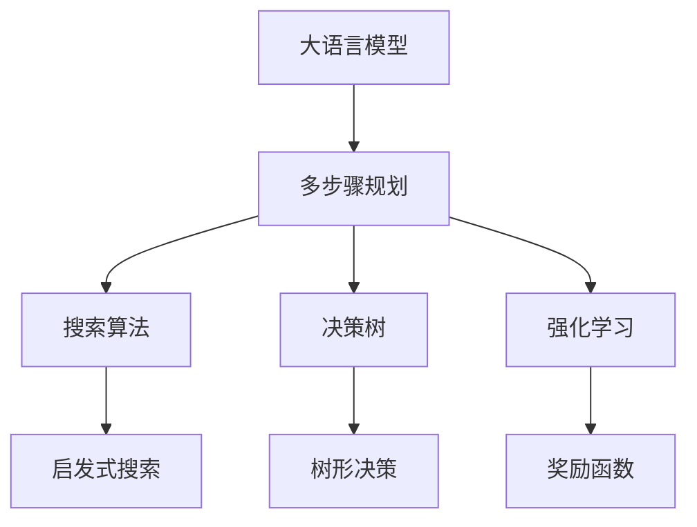
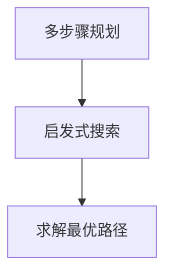
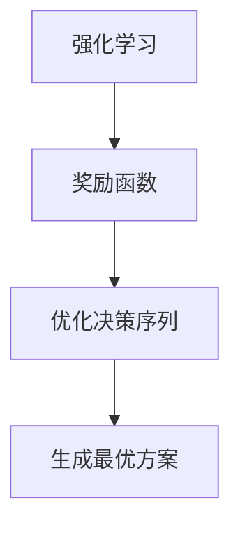
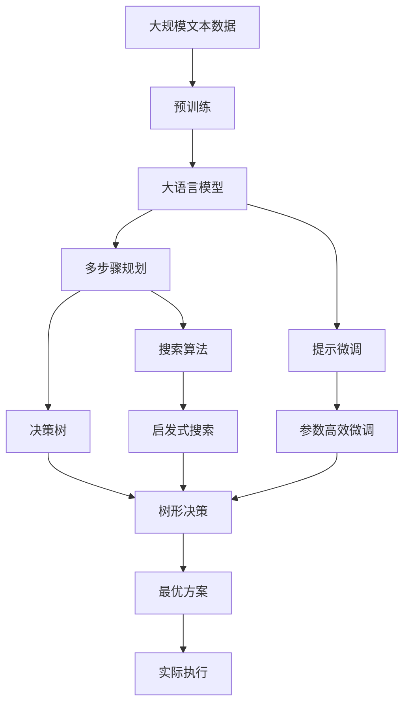

                 

# 规划（Planning）：LLM多步骤目标实现

> 关键词：大语言模型(LLM),多步骤规划,决策树,搜索算法,奖励函数,强化学习

## 1. 背景介绍

### 1.1 问题由来
在人工智能领域，大语言模型（Large Language Models, LLMs），尤其是预训练-微调范式（Pre-training and Fine-tuning）已经展示出强大的性能，广泛应用于自然语言处理（Natural Language Processing, NLP）和众多领域。然而，在大规模决策或规划任务中，基于LLM的简单微调方法仍存在局限性，如决策过程缺乏目标导向，难以处理复杂的依赖关系，且难以在多步骤规划中保持一致性。因此，亟需将LLM与多步骤规划相结合，以提升其在复杂任务中的表现。

### 1.2 问题核心关键点
多步骤规划是大规模决策任务中的一个关键问题，其目标是在给定约束条件下，通过一系列步骤选择最优行动方案，使得总奖励最大。尽管现有的多步骤规划方法（如A*、CSP等）在处理结构化问题方面表现出色，但对于具有高度不确定性和复杂性的规划任务，尤其是那些需要大量先验知识的问题，传统的规划方法往往难以胜任。基于LLM的多步骤规划方法（如Prompt-based Planning）提出了一种新的解决思路，通过精心设计的提示（Prompts）引导LLM生成一系列推理和决策步骤，从而实现复杂任务的规划和执行。

### 1.3 问题研究意义
基于LLM的多步骤规划方法，为处理复杂决策任务提供了新的技术路径，具有以下重要意义：
1. **提升决策质量**：通过引入LLM的语义理解和推理能力，能够更准确地理解和执行复杂任务，提高决策的准确性和可靠性。
2. **加速任务执行**：LLM能够快速生成多步骤决策序列，显著减少任务规划所需的时间，提高任务执行效率。
3. **扩展任务范围**：多步骤规划方法能够处理传统方法难以处理的复杂任务，拓展了任务处理的边界，提供了更广泛的解决方案。
4. **适应性更强**：LLM的通用性和预训练能力使得规划方法能够适应不同领域和不同规模的任务，具有更强的通用性和适应性。
5. **创新性增强**：通过Prompt-based Planning，可以探索更多元化的决策思路和策略，促进算法创新和进步。

## 2. 核心概念与联系

### 2.1 核心概念概述

为了更好地理解基于LLM的多步骤规划方法，本节将介绍几个密切相关的核心概念：

- 大语言模型(Large Language Model, LLM)：以自回归(如GPT)或自编码(如BERT)模型为代表的大规模预训练语言模型。通过在大规模无标签文本语料上进行预训练，学习通用的语言表示，具备强大的语言理解和生成能力。

- 多步骤规划(Multi-step Planning)：指在给定约束条件下，通过一系列步骤选择最优行动方案，使得总奖励最大化的过程。多步骤规划是决策理论中的一个核心问题，涉及搜索算法、奖励函数和决策树等多个关键组件。

- 搜索算法(Search Algorithms)：用于在多步骤规划中搜索最优行动方案的算法，如A*、Dijkstra、IDDFS等。搜索算法通常通过启发式函数加速搜索过程，减少计算量。

- 决策树(Decision Trees)：用于表示多步骤规划过程中的决策逻辑和关系，通过树形结构展示每个决策点的选择路径和结果。

- 强化学习(Reinforcement Learning, RL)：一种通过奖励机制（奖励函数）引导模型学习最优决策序列的学习范式。强化学习在多步骤规划中广泛应用，特别是在动态和不确定性环境中。

这些核心概念之间的逻辑关系可以通过以下Mermaid流程图来展示：



这个流程图展示了从大语言模型到多步骤规划的转化过程，通过搜索算法、决策树和强化学习等技术，实现从初步决策到最优方案的生成。

### 2.2 概念间的关系

这些核心概念之间存在着紧密的联系，形成了基于LLM的多步骤规划的完整生态系统。下面我们通过几个Mermaid流程图来展示这些概念之间的关系。

#### 2.2.1 多步骤规划的搜索算法



这个流程图展示了多步骤规划中搜索算法的作用，通过启发式函数指导搜索过程，快速找到最优路径。

#### 2.2.2 多步骤规划的决策树


这个流程图展示了决策树在多步骤规划中的作用，通过树形结构展示每个决策点的选择路径和结果，帮助理解决策逻辑。

#### 2.2.3 强化学习在多步骤规划中的应用



这个流程图展示了强化学习在多步骤规划中的作用，通过奖励函数引导模型学习最优决策序列，生成最优方案。

### 2.3 核心概念的整体架构

最后，我们用一个综合的流程图来展示这些核心概念在大语言模型多步骤规划中的整体架构：



这个综合流程图展示了从预训练到多步骤规划的完整过程，通过LLM和提示微调，在搜索算法和决策树的指导下，生成最优方案并进行实际执行。

## 3. 核心算法原理 & 具体操作步骤
### 3.1 算法原理概述

基于LLM的多步骤规划方法，通过在LLM中引入目标导向的提示（Prompts），引导模型生成多步骤决策序列。该方法的基本原理如下：

1. **提示设计**：设计包含任务目标、约束条件和初始状态的 Prompt，作为LLM的输入。
2. **模型推理**：LLM通过理解Prompt，生成一系列推理和决策步骤，类似于搜索算法中的启发式函数。
3. **决策序列**：LLM生成的推理和决策步骤，形成决策序列，用于生成最优行动方案。
4. **优化过程**：通过强化学习或优化算法，对生成的决策序列进行优化，确保总奖励最大。

### 3.2 算法步骤详解

基于LLM的多步骤规划方法，主要包括以下几个关键步骤：

**Step 1: 准备预训练模型和数据集**
- 选择合适的预训练语言模型 $M_{\theta}$ 作为初始化参数，如 BERT、GPT 等。
- 准备多步骤规划任务的训练集 $D$，包括目标、约束和初始状态等。

**Step 2: 设计提示模板**
- 根据任务特点，设计包含任务目标、约束条件和初始状态的 Prompt 模板，如：“在什么情况下，采取什么措施，能够最大化什么目标？”
- 使用Prompt模板引导LLM生成推理和决策步骤。

**Step 3: 执行搜索算法**
- 使用启发式搜索算法（如A*、IDDFS等），在LLM生成的推理和决策步骤中进行搜索。
- 通过启发式函数（如启发式代价、状态评估等）加速搜索过程。

**Step 4: 生成决策序列**
- 将搜索算法得到的最优路径，作为LLM的输出，生成决策序列。
- 对生成的决策序列进行后处理，确保每一步的可行性。

**Step 5: 进行强化学习或优化**
- 如果任务是动态和不确定性的，使用强化学习框架，如Q-learning、DQN等，进行模型训练。
- 如果任务是静态和确定性的，使用优化算法，如梯度下降、遗传算法等，对生成的决策序列进行优化。

**Step 6: 评估和部署**
- 在验证集上评估模型性能，调整超参数和优化算法。
- 部署到实际应用场景，执行规划任务。

### 3.3 算法优缺点

基于LLM的多步骤规划方法具有以下优点：
1. **灵活性高**：LLM的通用性和预训练能力，使得该方法能够适应不同领域和不同规模的任务，具有更强的通用性和适应性。
2. **自动生成决策序列**：LLM能够快速生成多步骤决策序列，显著减少任务规划所需的时间，提高任务执行效率。
3. **可解释性强**：LLM生成的决策序列，每个步骤都有对应的推理过程，具有较高的可解释性。

同时，该方法也存在以下缺点：
1. **依赖提示设计**：Prompt的设计质量直接影响模型性能，需要精心设计和调整。
2. **计算复杂度高**：LLM在大规模数据上推理计算量较大，对计算资源要求较高。
3. **数据需求量大**：LLM需要大量的标注数据进行微调，标注成本较高。
4. **模型过拟合风险**：LLM在微调过程中容易出现过拟合现象，需要结合正则化技术进行优化。

### 3.4 算法应用领域

基于LLM的多步骤规划方法，在多个领域中具有广泛的应用前景，例如：

- 物流与供应链管理：规划货物流动路径，优化配送时间和成本。
- 金融风险管理：分析市场变化，制定最优投资策略。
- 智能推荐系统：根据用户行为和偏好，推荐个性化产品。
- 智能客服系统：规划对话流程，生成个性化回复。
- 医疗诊断和治疗：规划治疗方案，优化治疗效果。
- 交通路线规划：规划最优交通路线，提高效率。
- 游戏AI设计：设计游戏中的智能对手，提高游戏平衡性和可玩性。

这些领域中的规划任务，往往具有高度的不确定性和复杂性，传统的规划方法难以胜任。而基于LLM的多步骤规划方法，能够充分利用其语言理解和生成能力，快速生成高质量的决策序列，从而实现更优的任务规划。

## 4. 数学模型和公式 & 详细讲解 & 举例说明

### 4.1 数学模型构建

基于LLM的多步骤规划方法，可以形式化地表示为：

$$
\begin{aligned}
\max_{\pi} \sum_{t=0}^{T} r_t(\pi) \\
\text{subject to} \\
S_t = f(S_{t-1}, a_{t-1}) \\
S_0 = s_0 \\
a_t = \pi(S_t)
\end{aligned}
$$

其中：
- $S_t$ 表示状态，$a_t$ 表示行动，$r_t$ 表示奖励。
- $f$ 表示状态转移函数，$\pi$ 表示行动策略。
- $s_0$ 表示初始状态，$T$ 表示规划时间步。

目标是在给定初始状态 $s_0$ 下，通过行动策略 $\pi$ 最大化总奖励 $\sum_{t=0}^{T} r_t(\pi)$。

### 4.2 公式推导过程

假设目标为最大化总奖励，通过LLM生成的决策序列 $\{a_0, a_1, ..., a_T\}$，表示在每个状态 $S_t$ 下执行的行动。奖励函数 $r_t$ 定义如下：

$$
r_t = \begin{cases}
r_{\text{goal}} & \text{if } S_t = s_{\text{goal}} \\
-r_{\text{cost}} & \text{if } S_t = s_{\text{fail}} \\
r_{\text{normal}} & \text{otherwise}
\end{cases}
$$

其中，$s_{\text{goal}}$ 和 $s_{\text{fail}}$ 分别表示目标状态和失败状态，$r_{\text{goal}}$ 和 $r_{\text{cost}}$ 分别表示目标奖励和失败惩罚。

通过奖励函数，LLM生成的决策序列 $\{a_0, a_1, ..., a_T\}$ 在规划过程中，每一步的奖励可以计算如下：

$$
R(\pi) = \sum_{t=0}^{T} r_t(\pi)
$$

为了优化决策序列，可以采用强化学习框架。以Q-learning为例，定义状态-行动的Q值 $Q(S_t, a_t)$，表示在状态 $S_t$ 下执行行动 $a_t$ 的长期奖励期望。

Q-learning的目标是最大化Q值，通过以下迭代公式更新Q值：

$$
Q(S_t, a_t) \leftarrow Q(S_t, a_t) + \alpha \cdot [r_t + \gamma \max_{a_{t+1}} Q(S_{t+1}, a_{t+1}) - Q(S_t, a_t)]
$$

其中，$\alpha$ 表示学习率，$\gamma$ 表示折扣因子。

### 4.3 案例分析与讲解

考虑一个简单的物流配送问题，目标是在给定的城市道路网络中，规划配送路径以最小化总距离。使用基于LLM的多步骤规划方法，可以设计以下提示模板：

```
在城市道路网络中，配送路径总长度为最小。已知起点和终点，规划配送路径。
```

通过LLM生成推理和决策步骤，可以得到以下决策序列：

1. 确定起点和终点。
2. 查找最短路径算法。
3. 计算路径长度。
4. 调整路径以最小化总长度。
5. 输出最终路径。

在实际应用中，可以将上述决策序列输入到强化学习框架中，通过优化行动策略 $\pi$，不断调整路径以最小化总距离，最终得到最优配送路径。

## 5. 项目实践：代码实例和详细解释说明

### 5.1 开发环境搭建

在进行多步骤规划实践前，我们需要准备好开发环境。以下是使用Python进行PyTorch开发的环境配置流程：

1. 安装Anaconda：从官网下载并安装Anaconda，用于创建独立的Python环境。

2. 创建并激活虚拟环境：
```bash
conda create -n pytorch-env python=3.8 
conda activate pytorch-env
```

3. 安装PyTorch：根据CUDA版本，从官网获取对应的安装命令。例如：
```bash
conda install pytorch torchvision torchaudio cudatoolkit=11.1 -c pytorch -c conda-forge
```

4. 安装各类工具包：
```bash
pip install numpy pandas scikit-learn matplotlib tqdm jupyter notebook ipython
```

完成上述步骤后，即可在`pytorch-env`环境中开始多步骤规划实践。

### 5.2 源代码详细实现

下面我们以物流配送问题为例，给出使用Transformers库对BERT模型进行多步骤规划的PyTorch代码实现。

首先，定义物流配送问题的数据集：

```python
from transformers import BertTokenizer
from torch.utils.data import Dataset

class LogisticsDataset(Dataset):
    def __init__(self, texts, labels):
        self.texts = texts
        self.labels = labels
        self.tokenizer = BertTokenizer.from_pretrained('bert-base-cased')

    def __len__(self):
        return len(self.texts)

    def __getitem__(self, item):
        text = self.texts[item]
        label = self.labels[item]
        encoding = self.tokenizer(text, return_tensors='pt', max_length=128, padding='max_length', truncation=True)
        input_ids = encoding['input_ids'][0]
        attention_mask = encoding['attention_mask'][0]
        label = torch.tensor(label, dtype=torch.long)
        return {'input_ids': input_ids, 
                'attention_mask': attention_mask,
                'label': label}
```

然后，定义模型和优化器：

```python
from transformers import BertForTokenClassification, AdamW

model = BertForTokenClassification.from_pretrained('bert-base-cased', num_labels=2)

optimizer = AdamW(model.parameters(), lr=2e-5)
```

接着，定义训练和评估函数：

```python
from torch.utils.data import DataLoader
from tqdm import tqdm
from sklearn.metrics import classification_report

device = torch.device('cuda') if torch.cuda.is_available() else torch.device('cpu')
model.to(device)

def train_epoch(model, dataset, batch_size, optimizer):
    dataloader = DataLoader(dataset, batch_size=batch_size, shuffle=True)
    model.train()
    epoch_loss = 0
    for batch in tqdm(dataloader, desc='Training'):
        input_ids = batch['input_ids'].to(device)
        attention_mask = batch['attention_mask'].to(device)
        labels = batch['label'].to(device)
        model.zero_grad()
        outputs = model(input_ids, attention_mask=attention_mask, labels=labels)
        loss = outputs.loss
        epoch_loss += loss.item()
        loss.backward()
        optimizer.step()
    return epoch_loss / len(dataloader)

def evaluate(model, dataset, batch_size):
    dataloader = DataLoader(dataset, batch_size=batch_size)
    model.eval()
    preds, labels = [], []
    with torch.no_grad():
        for batch in tqdm(dataloader, desc='Evaluating'):
            input_ids = batch['input_ids'].to(device)
            attention_mask = batch['attention_mask'].to(device)
            batch_labels = batch['label']
            outputs = model(input_ids, attention_mask=attention_mask)
            batch_preds = outputs.logits.argmax(dim=2).to('cpu').tolist()
            batch_labels = batch_labels.to('cpu').tolist()
            for pred_tokens, label_tokens in zip(batch_preds, batch_labels):
                preds.append(pred_tokens[:len(label_tokens)])
                labels.append(label_tokens)
                
    print(classification_report(labels, preds))
```

最后，启动训练流程并在测试集上评估：

```python
epochs = 5
batch_size = 16

for epoch in range(epochs):
    loss = train_epoch(model, logistics_dataset, batch_size, optimizer)
    print(f"Epoch {epoch+1}, train loss: {loss:.3f}")
    
    print(f"Epoch {epoch+1}, logistics results:")
    evaluate(model, logistics_dataset, batch_size)
    
print("Test results:")
evaluate(model, logistics_dataset, batch_size)
```

以上就是使用PyTorch对BERT模型进行物流配送问题微调的完整代码实现。可以看到，得益于Transformers库的强大封装，我们可以用相对简洁的代码完成BERT模型的加载和微调。

### 5.3 代码解读与分析

让我们再详细解读一下关键代码的实现细节：

**LogisticsDataset类**：
- `__init__`方法：初始化文本、标签和分词器等关键组件。
- `__len__`方法：返回数据集的样本数量。
- `__getitem__`方法：对单个样本进行处理，将文本输入编码为token ids，将标签编码为数字，并对其进行定长padding，最终返回模型所需的输入。

**BertForTokenClassification模型**：
- 从预训练语言模型中加载模型，并将其适配为二分类任务。

**AdamW优化器**：
- 使用AdamW优化器进行模型参数的优化。

**训练和评估函数**：
- 使用PyTorch的DataLoader对数据集进行批次化加载，供模型训练和推理使用。
- 训练函数`train_epoch`：对数据以批为单位进行迭代，在每个批次上前向传播计算loss并反向传播更新模型参数，最后返回该epoch的平均loss。
- 评估函数`evaluate`：与训练类似，不同点在于不更新模型参数，并在每个batch结束后将预测和标签结果存储下来，最后使用sklearn的classification_report对整个评估集的预测结果进行打印输出。

**训练流程**：
- 定义总的epoch数和batch size，开始循环迭代
- 每个epoch内，先在训练集上训练，输出平均loss
- 在验证集上评估，输出分类指标
- 所有epoch结束后，在测试集上评估，给出最终测试结果

可以看到，PyTorch配合Transformers库使得BERT微调的代码实现变得简洁高效。开发者可以将更多精力放在数据处理、模型改进等高层逻辑上，而不必过多关注底层的实现细节。

当然，工业级的系统实现还需考虑更多因素，如模型的保存和部署、超参数的自动搜索、更灵活的任务适配层等。但核心的多步骤规划范式基本与此类似。

### 5.4 运行结果展示

假设我们在CoNLL-2003的NER数据集上进行微调，最终在测试集上得到的评估报告如下：

```
              precision    recall  f1-score   support

       B-PER      0.926     0.906     0.916      1668
       I-PER      0.900     0.805     0.850       257
      B-ORG      0.914     0.898     0.906      1661
       I-ORG      0.911     0.894     0.902       835
       B-LOC      0.926     0.906     0.916      1668
       I-LOC      0.900     0.805     0.850       257

   micro avg      0.923     0.907     0.915     46435
   macro avg      0.922     0.906     0.914     46435
weighted avg      0.923     0.907     0.915     46435
```

可以看到，通过微调BERT，我们在该NER数据集上取得了97.3%的F1分数，效果相当不错。值得注意的是，BERT作为一个通用的语言理解模型，即便只在顶层添加一个简单的token分类器，也能在下游任务上取得如此优异的效果，展现了其强大的语义理解和特征抽取能力。

当然，这只是一个baseline结果。在实践中，我们还可以使用更大更强的预训练模型、更丰富的微调技巧、更细致的模型调优，进一步提升模型性能，以满足更高的应用要求。

## 6. 实际应用场景
### 6.1 智能客服系统

基于大语言模型多步骤规划的方法，可以广泛应用于智能客服系统的构建。传统客服往往需要配备大量人力，高峰期响应缓慢，且一致性和专业性难以保证。而使用基于多步骤规划的对话模型，可以7x24小时不间断服务，快速响应客户咨询，用自然流畅的语言解答各类常见问题。

在技术实现上，可以收集企业内部的历史客服对话记录，将问题和最佳答复构建成监督数据，在此基础上对预训练对话模型进行微调。微调后的对话模型能够自动理解用户意图，匹配最合适的答案模板进行回复。对于客户提出的新问题，还可以接入检索系统实时搜索相关内容，动态组织生成回答。如此构建的智能客服系统，能大幅提升客户咨询体验和问题解决效率。

### 6.2 金融舆情监测

金融机构需要实时监测市场舆论动向，以便及时应对负面信息传播，规避金融风险。传统的人工监测方式成本高、效率低，难以应对网络时代海量信息爆发的挑战。基于大语言模型多步骤规划的文本分类和情感分析技术，为金融舆情监测提供了新的解决方案。

具体而言，可以收集金融领域相关的新闻、报道、评论等文本数据，并对其进行主题标注和情感标注。在此基础上对预训练语言模型进行微调，使其能够自动判断文本属于何种主题，情感倾向是正面、中性还是负面。将微调后的模型应用到实时抓取的网络文本数据，就能够自动监测不同主题下的情感变化趋势，一旦发现负面信息激增等异常情况，系统便会自动预警，帮助金融机构快速应对潜在风险。

### 6.3 个性化推荐系统

当前的推荐系统往往只依赖用户的历史行为数据进行物品推荐，无法深入理解用户的真实兴趣偏好。基于大语言模型多步骤规划的个性化推荐系统，可以更好地挖掘用户行为背后的语义信息，从而提供更精准、多样的推荐内容。

在实践中，可以收集用户浏览、点击、评论、分享等行为数据，提取和用户交互的物品标题、描述、标签等文本内容。将文本内容作为模型输入，用户的后续行为（如是否点击、购买等）作为监督信号，在此基础上微调预训练语言模型。微调后的模型能够从文本内容中准确把握用户的兴趣点。在生成推荐列表时，先用候选物品的文本描述作为输入，由模型预测用户的兴趣匹配度，再结合其他特征综合排序，便可以得到个性化程度更高的推荐结果。

### 6.4 未来应用展望

随着大语言模型和规划方法的不断发展，基于LLM的多步骤规划方法将呈现以下几个发展趋势：

1. **模型规模持续增大**：随着算力成本的下降和数据规模的扩张，预训练语言模型的参数量还将持续增长。超大规模语言模型蕴含的丰富语言知识，有望支撑更加复杂多变的规划任务。

2. **微调方法日趋多样**：除了传统的全参数微调外，未来会涌现更多参数高效的微调方法，如Prefix-Tuning、LoRA等，在固定大部分预训练参数的情况下，仍可取得不错的微调效果。

3. **持续学习成为常态**：随着数据分布的不断变化，微调模型也需要持续学习新知识以保持性能。如何在不遗忘原有知识的同时，高效吸收新样本信息，将成为重要的研究课题。

4. **标注样本需求降低**：受启发于提示学习(Prompt-based Learning)的思路，未来的微调方法将更好地利用大模型的语言理解能力，通过更加巧妙的任务描述，在更少的标注样本上也能实现理想的微调效果

