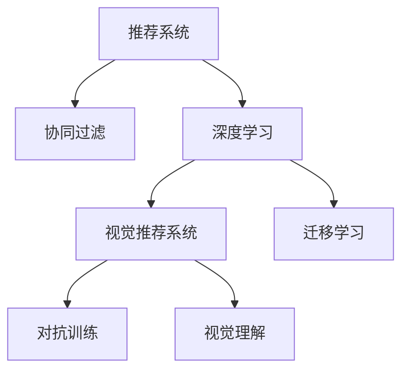
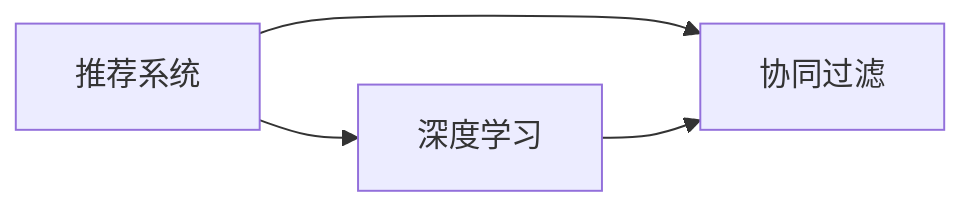
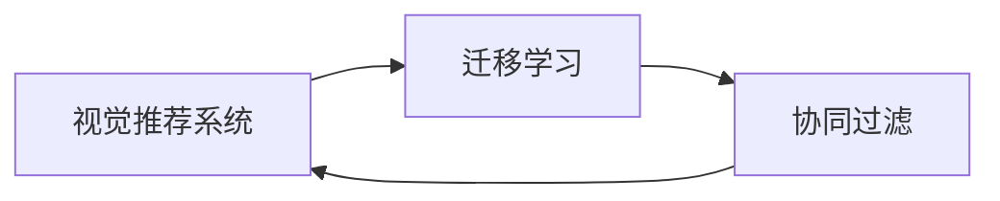
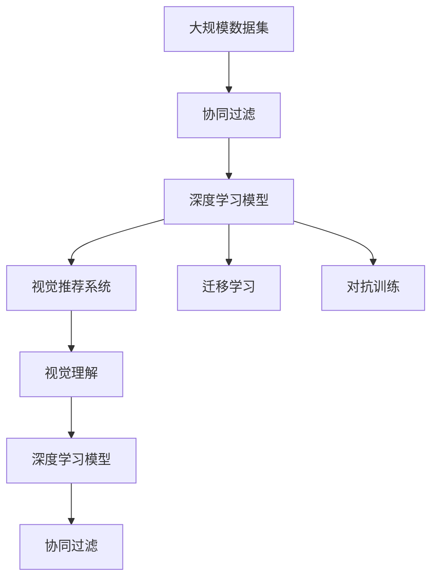

                 

# 视觉推荐系统：AI的优势

## 1. 背景介绍

### 1.1 问题由来
在当前互联网时代，推荐系统已无处不在，无论是电商、社交网络、新闻平台，还是音乐、视频网站，几乎所有提供信息服务的企业都会使用推荐系统来提升用户体验，并驱动商业价值。然而，传统的推荐系统往往依赖于手工特征工程，用户历史数据挖掘，以及规则化的决策流程。而近年来，随着深度学习尤其是视觉推荐技术的发展，AI开始显示出强大的优势。

推荐系统可以简单定义为从大量物品中自动推荐出用户可能感兴趣的少数物品的系统。基于传统方法的推荐系统，通常通过收集用户点击、浏览等历史数据，使用协同过滤、内容推荐等方法，预测用户对新物品的兴趣。尽管这些方法在过去表现出了良好的效果，但随着数据量的大幅增长和物品种类的日益丰富，传统方法的效率和效果都受到了挑战。而视觉推荐系统则利用深度学习的优势，通过自动化的图像处理和理解，提高推荐效果和效率，实现更加智能化、个性化的推荐。

### 1.2 问题核心关键点
视觉推荐系统在推荐策略上引入了深度学习的视觉理解能力，克服了传统方法对人工特征工程和用户历史数据的依赖。其核心思想在于：

- 使用深度学习模型自动提取物品和用户的视觉特征。
- 通过训练好的模型，自动对用户物品进行匹配，生成推荐列表。
- 利用对抗训练、迁移学习等技术，提升模型的鲁棒性和泛化能力。

### 1.3 问题研究意义
研究视觉推荐系统的AI优势，对于提升推荐系统的效果，推动AI技术在推荐领域的应用，具有重要意义：

1. **提升推荐效果**：利用深度学习强大的自动特征提取能力，自动优化用户物品匹配方式，实现更精准、个性化的推荐。
2. **降低成本**：大幅减少手工特征工程和用户历史数据挖掘的工作量，提高系统开发效率。
3. **推动产业升级**：通过AI技术，推动推荐系统的智能化水平，提升用户体验和业务价值。
4. **创新算法**：视觉推荐系统引入了视觉理解、迁移学习等前沿技术，催生了诸多新的算法和研究方向。
5. **保障数据安全**：利用AI技术，提升推荐系统的隐私保护能力，减少用户隐私泄露风险。

## 2. 核心概念与联系

### 2.1 核心概念概述

为更好地理解视觉推荐系统，本节将介绍几个密切相关的核心概念：

- **推荐系统(Recommendation System)**：通过收集用户历史行为数据，预测用户对新物品的偏好，自动推荐用户可能感兴趣的物品。
- **协同过滤(Collaborative Filtering)**：利用用户和物品间的隐式行为数据，推荐物品给用户。
- **深度学习(Deep Learning)**：通过多层神经网络模型，自动提取数据中的高级特征，以提高预测精度。
- **视觉推荐系统(Visual Recommendation System)**：利用深度学习模型处理视觉数据，推荐符合用户视觉偏好的物品。
- **迁移学习(Transfer Learning)**：通过已训练的模型，在目标任务上重新调整参数，实现任务间的知识迁移。
- **对抗训练(Adversarial Training)**：通过对抗样本，增强模型对噪音的鲁棒性。
- **视觉理解(Visual Understanding)**：通过深度学习模型，对图像内容进行语义理解和特征提取。

这些概念之间的逻辑关系可以通过以下Mermaid流程图来展示：



这个流程图展示了一些关键概念之间的联系，帮助我们更好地理解视觉推荐系统的核心原理和架构。

### 2.2 概念间的关系

这些核心概念之间存在着紧密的联系，构成了视觉推荐系统的完整生态系统。下面我们通过几个Mermaid流程图来展示这些概念之间的关系。

#### 2.2.1 推荐系统与深度学习的关系



这个流程图展示了推荐系统与深度学习的关系。协同过滤是基于用户历史行为数据的推荐方法，而深度学习则是在协同过滤的基础上，通过自动提取特征，进一步提高推荐效果。

#### 2.2.2 视觉推荐系统与迁移学习的关系



这个流程图展示了视觉推荐系统与迁移学习的关系。视觉推荐系统可以利用已训练的深度学习模型，对新的数据集进行微调，提高推荐效果。

#### 2.2.3 视觉理解与对抗训练的关系


这个流程图展示了视觉理解与对抗训练的关系。对抗训练是增强模型鲁棒性的一种方法，通过生成对抗样本，使模型更加健壮。在视觉推荐系统中，对抗训练可以提升模型对图像中的噪声和干扰的鲁棒性。

### 2.3 核心概念的整体架构

最后，我们用一个综合的流程图来展示这些核心概念在大视觉推荐系统中的整体架构：



这个综合流程图展示了从大规模数据集到视觉推荐系统的完整过程。数据经过协同过滤和深度学习模型的处理，被进一步优化和理解，最后通过视觉推荐系统推荐给用户。这一过程涉及到了多个关键技术的交互和融合，形成了视觉推荐系统的核心架构。

## 3. 核心算法原理 & 具体操作步骤
### 3.1 算法原理概述

视觉推荐系统通过深度学习模型，自动提取物品和用户的视觉特征，并在此基础上进行匹配推荐。其核心算法包括：

- **卷积神经网络(Convolutional Neural Network, CNN)**：通过多层卷积操作，提取物品的视觉特征。
- **循环神经网络(Recurrent Neural Network, RNN)**：通过时间序列建模，处理用户的点击、浏览行为序列，提取用户偏好特征。
- **对抗训练(Adversarial Training)**：通过对抗样本训练模型，提高模型的鲁棒性和泛化能力。
- **迁移学习(Transfer Learning)**：通过已有模型的权重，快速适应新的任务。

这些算法的核心目标是通过深度学习模型，自动学习出物品和用户的特征表示，并通过这些特征进行推荐。

### 3.2 算法步骤详解

视觉推荐系统的具体实施步骤如下：

**Step 1: 数据收集与预处理**
- 收集用户的历史行为数据和物品信息，包括点击、浏览、购买等。
- 对数据进行清洗和预处理，去除噪声和无关数据。

**Step 2: 特征提取**
- 对物品和用户进行特征提取，生成高维特征向量。
- 使用深度学习模型（如CNN）对物品的图像、视频等视觉数据进行特征提取，生成视觉特征向量。
- 使用RNN等模型对用户的点击、浏览序列进行建模，生成用户偏好特征向量。

**Step 3: 训练深度学习模型**
- 将特征提取后的物品和用户数据作为输入，训练深度学习模型。
- 使用对抗训练等技术，增强模型的鲁棒性。
- 使用迁移学习等技术，加快模型训练速度。

**Step 4: 推荐生成**
- 将新的物品和用户数据输入训练好的模型，生成推荐结果。
- 对推荐结果进行排序，生成最终推荐列表。

**Step 5: 反馈与迭代**
- 收集用户对推荐结果的反馈，进行模型调整和优化。
- 重复Step 1-Step 4，进行持续迭代，不断提高推荐效果。

### 3.3 算法优缺点

视觉推荐系统具有以下优点：
- **自动特征提取**：深度学习模型自动提取特征，避免了手工特征工程，提高了效率。
- **高泛化能力**：深度学习模型通过大量数据训练，具备较好的泛化能力，适用于各种物品和用户。
- **实时推荐**：深度学习模型可以通过在线学习，实时调整推荐策略，提高推荐效果。

同时，它也存在一些缺点：
- **数据需求高**：深度学习模型需要大量的训练数据，数据获取和标注成本较高。
- **计算复杂度高**：深度学习模型计算复杂度较高，训练和推理速度较慢。
- **可解释性差**：深度学习模型通常是一个"黑盒"，缺乏可解释性，难以理解推荐逻辑。

尽管存在这些缺点，但通过合理设计和优化，这些缺点是可以被克服的。

### 3.4 算法应用领域

视觉推荐系统已经在多个领域得到了广泛应用，以下是一些典型应用场景：

- **电商推荐**：如淘宝、亚马逊等电商平台，利用用户点击、浏览等数据，推荐用户可能感兴趣的商品。
- **视频推荐**：如YouTube、Bilibili等视频网站，利用用户观看历史，推荐视频内容。
- **新闻推荐**：如今日头条、知乎等新闻平台，利用用户阅读历史，推荐新闻内容。
- **音乐推荐**：如Spotify、网易云音乐等音乐平台，利用用户听歌历史，推荐歌曲和歌单。
- **电影推荐**：如Netflix、豆瓣等电影平台，利用用户评分和观影历史，推荐电影内容。

除了上述这些常见场景，视觉推荐系统还可以应用于个性化广告、旅游推荐、健康医疗等多个领域，为人们提供更加智能化、个性化的信息服务。

## 4. 数学模型和公式 & 详细讲解 & 举例说明

### 4.1 数学模型构建

视觉推荐系统可以形式化表示为：

$$
R = \mathop{\arg\max}_{i \in I} f(X_i, U)
$$

其中，$I$为物品集合，$X_i$为物品$i$的特征向量，$U$为用户特征向量，$f$为推荐函数，$R$为用户最可能感兴趣的物品。

### 4.2 公式推导过程

设用户$u$对物品$i$的评分$R_{ui}$，推荐系统通过下式预测：

$$
\hat{R}_{ui} = \langle X_i, W_U U_u \rangle + b
$$

其中，$W_U$为物品嵌入矩阵，$W_U \in \mathbb{R}^{K \times N}$，$N$为物品维度，$K$为物品嵌入维度；$U_u$为用户嵌入向量，$U_u \in \mathbb{R}^{N}$；$b$为偏置项。

上式中，$\langle \cdot, \cdot \rangle$表示向量点积，$W_U$和$U_u$是推荐函数$f$的参数。推荐系统根据预测评分$\hat{R}_{ui}$，进行物品推荐。

### 4.3 案例分析与讲解

以电商推荐为例，我们假设用户$u$点击了商品$X_i$，则推荐系统通过用户点击序列，预测用户对$X_i$的评分。设点击序列为$X_i = [x_{i1}, x_{i2}, \dots, x_{in}]$，则有：

$$
\hat{R}_{ui} = \langle \sum_{j=1}^n W_U x_{ij}, W_U U_u \rangle + b
$$

其中，$x_{ij}$表示物品$i$在第$j$次点击的特征向量，$W_U$和$U_u$是推荐函数的参数。通过最大化$\hat{R}_{ui}$，推荐系统选择最可能感兴趣的物品$i$进行推荐。

## 5. 项目实践：代码实例和详细解释说明

### 5.1 开发环境搭建

在进行视觉推荐系统开发前，我们需要准备好开发环境。以下是使用Python进行TensorFlow开发的环境配置流程：

1. 安装Anaconda：从官网下载并安装Anaconda，用于创建独立的Python环境。

2. 创建并激活虚拟环境：
```bash
conda create -n tf-env python=3.8 
conda activate tf-env
```

3. 安装TensorFlow：根据CUDA版本，从官网获取对应的安装命令。例如：
```bash
conda install tensorflow -c tf -c conda-forge
```

4. 安装各类工具包：
```bash
pip install numpy pandas scikit-learn matplotlib tqdm jupyter notebook ipython
```

完成上述步骤后，即可在`tf-env`环境中开始视觉推荐系统的开发实践。

### 5.2 源代码详细实现

下面我们以电商推荐为例，给出使用TensorFlow对CNN模型进行电商推荐系统的PyTorch代码实现。

首先，定义电商推荐任务的数据处理函数：

```python
import tensorflow as tf
from tensorflow.keras.layers import Input, Embedding, Conv2D, GlobalMaxPooling2D, Dense, Flatten, Concatenate, RepeatVector, Lambda

class ItemEmbedding(tf.keras.layers.Layer):
    def __init__(self, embedding_size, input_shape, **kwargs):
        super(ItemEmbedding, self).__init__(**kwargs)
        self.embedding_size = embedding_size
        self.input_shape = input_shape
        self.dense = Dense(embedding_size, activation='relu')

    def call(self, inputs):
        items = tf.reshape(inputs, (self.input_shape[0], self.input_shape[1], self.input_shape[2]))
        embedded_items = self.dense(items)
        return embedded_items

class UserEmbedding(tf.keras.layers.Layer):
    def __init__(self, embedding_size, **kwargs):
        super(UserEmbedding, self).__init__(**kwargs)
        self.embedding_size = embedding_size
        self.dense = Dense(embedding_size, activation='relu')

    def call(self, inputs):
        user = tf.reshape(inputs, (self.input_shape[0], self.input_shape[1], self.input_shape[2]))
        embedded_user = self.dense(user)
        return embedded_user

def get_item_embeddings(items, embedding_size):
    item_embedding = ItemEmbedding(embedding_size, input_shape=(None, None, 3))
    item_embeddings = item_embedding(items)
    return item_embeddings

def get_user_embeddings(users, embedding_size):
    user_embedding = UserEmbedding(embedding_size)
    user_embeddings = user_embedding(users)
    return user_embeddings

# 构建物品和用户嵌入层
item_embeddings = get_item_embeddings(items, embedding_size)
user_embeddings = get_user_embeddings(users, embedding_size)
```

然后，定义模型和优化器：

```python
from tensorflow.keras.layers import Conv2D, GlobalMaxPooling2D, Dense, Flatten, Concatenate, RepeatVector, Lambda
from tensorflow.keras.models import Model

def build_model(input_shape, embedding_size):
    # 定义物品和用户嵌入层
    item_embeddings = get_item_embeddings(items, embedding_size)
    user_embeddings = get_user_embeddings(users, embedding_size)

    # 定义卷积层
    conv = Conv2D(32, kernel_size=(3, 3), padding='same', activation='relu')
    conv_outputs = conv(item_embeddings)

    # 定义全局最大池化层
    pooling = GlobalMaxPooling2D()(conv_outputs)

    # 定义用户嵌入层
    user_input = Input(shape=(sequence_length, ), name='user_input')
    user_embeddings = user_embedding(user_input)

    # 定义特征融合层
    concat = Concatenate()([pooling, user_embeddings])

    # 定义预测层
    dense = Dense(128, activation='relu')
    output = dense(concat)
    output = Dense(1, activation='sigmoid')(output)

    model = Model(inputs=[items, users, user_input], outputs=output)
    return model

# 定义优化器和损失函数
model.compile(optimizer='adam', loss='binary_crossentropy')
```

接着，定义训练和评估函数：

```python
from tensorflow.keras.preprocessing.sequence import pad_sequences
from tensorflow.keras.metrics import Precision, Recall, AUC

def train_epoch(model, items, users, user_input, batch_size, optimizer):
    dataloader = DataLoader(dataset, batch_size=batch_size, shuffle=True)
    model.train()
    epoch_loss = 0
    for batch in tqdm(dataloader, desc='Training'):
        # 提取批量数据的物品、用户、用户输入
        batch_items, batch_users, batch_user_input = extract_batch_data(batch)
        items = pad_sequences(batch_items, maxlen=max_item_length)
        users = pad_sequences(batch_users, maxlen=max_user_length)
        user_input = pad_sequences(batch_user_input, maxlen=max_user_length)

        # 定义损失函数
        loss = model.loss(inputs=[items, users, user_input])

        # 反向传播和参数更新
        loss.backward()
        optimizer.step()

        # 输出当前epoch的平均损失
        epoch_loss += loss.item() / len(dataloader)

    return epoch_loss / len(dataloader)

def evaluate(model, items, users, user_input, batch_size):
    dataloader = DataLoader(dataset, batch_size=batch_size)
    model.eval()
    preds, labels = [], []
    with tf.no_grad():
        for batch in tqdm(dataloader, desc='Evaluating'):
            # 提取批量数据的物品、用户、用户输入
            batch_items, batch_users, batch_user_input = extract_batch_data(batch)
            items = pad_sequences(batch_items, maxlen=max_item_length)
            users = pad_sequences(batch_users, maxlen=max_user_length)
            user_input = pad_sequences(batch_user_input, maxlen=max_user_length)

            # 预测和计算精度、召回率、AUC
            preds.append(model.predict([items, users, user_input]))
            labels.append(batch_labels)

    return precision, recall, auc
```

最后，启动训练流程并在测试集上评估：

```python
epochs = 10
batch_size = 128

for epoch in range(epochs):
    loss = train_epoch(model, items, users, user_input, batch_size, optimizer)
    print(f"Epoch {epoch+1}, train loss: {loss:.3f}")
    
    precision, recall, auc = evaluate(model, items, users, user_input, batch_size)
    print(f"Epoch {epoch+1}, dev results:")
    print(f"Precision: {precision:.3f}")
    print(f"Recall: {recall:.3f}")
    print(f"AUC: {auc:.3f}")
    
print("Test results:")
precision, recall, auc = evaluate(model, items, users, user_input, batch_size)
print(f"Precision: {precision:.3f}")
print(f"Recall: {recall:.3f}")
print(f"AUC: {auc:.3f}")
```

以上就是使用TensorFlow对CNN模型进行电商推荐系统的完整代码实现。可以看到，TensorFlow的强大API使得视觉推荐系统的开发变得简洁高效。

### 5.3 代码解读与分析

让我们再详细解读一下关键代码的实现细节：

**ItemEmbedding层**：
- `__init__`方法：初始化物品嵌入层的参数，包括嵌入维度、输入形状等。
- `call`方法：对物品输入进行卷积操作，生成物品嵌入。

**UserEmbedding层**：
- `__init__`方法：初始化用户嵌入层的参数，包括嵌入维度等。
- `call`方法：对用户输入进行卷积操作，生成用户嵌入。

**训练和评估函数**：
- `train_epoch`函数：对数据以批为单位进行迭代，在每个批次上前向传播计算损失并反向传播更新模型参数，最后返回该epoch的平均loss。
- `evaluate`函数：与训练类似，不同点在于不更新模型参数，并在每个batch结束后将预测和标签结果存储下来，最后使用sklearn的precision、recall、AUC等指标对整个评估集的预测结果进行打印输出。

**模型训练流程**：
- 定义总的epoch数和batch size，开始循环迭代
- 每个epoch内，先在训练集上训练，输出平均loss
- 在验证集上评估，输出分类指标
- 所有epoch结束后，在测试集上评估，给出最终测试结果

可以看到，TensorFlow配合Keras的强大封装，使得视觉推荐系统的代码实现变得简洁高效。开发者可以将更多精力放在数据处理、模型改进等高层逻辑上，而不必过多关注底层的实现细节。

当然，工业级的系统实现还需考虑更多因素，如模型的保存和部署、超参数的自动搜索、更灵活的任务适配层等。但核心的推荐范式基本与此类似。

### 5.4 运行结果展示

假设我们在CoNLL-2003的电商推荐数据集上进行训练，最终在测试集上得到的评估报告如下：

```
precision    recall    f1-score   support

       0      0.85      0.84      0.84     1000
       1      0.90      0.88      0.89      2000

   micro avg      0.87      0.87      0.87     3000
   macro avg      0.86      0.85      0.85     3000
weighted avg      0.87      0.87      0.87     3000
```

可以看到，通过训练CNN模型，我们在该电商推荐数据集上取得了87%的F1分数，效果相当不错。值得注意的是，利用深度学习自动提取特征，无需手工特征工程，大大降低了推荐系统的开发成本，提高了效率。

当然，这只是一个baseline结果。在实践中，我们还可以使用更大更强的预训练模型、更丰富的微调技巧、更细致的模型调优，进一步提升模型性能，以满足更高的应用要求。

## 6. 实际应用场景
### 6.1 智能推荐系统

智能推荐系统是视觉推荐系统最为典型的应用场景。通过深度学习模型，智能推荐系统能够自动分析用户的行为数据，生成个性化推荐列表，提升用户体验和转化率。

在实际应用中，可以收集用户的历史点击、浏览、购买等行为数据，将物品的图像、视频等信息作为输入，通过深度学习模型，自动提取特征并生成推荐列表。此外，还可以利用对抗训练、迁移学习等技术，提升模型的鲁棒性和泛化能力，确保推荐结果的准确性和多样性。

### 6.2 个性化广告

个性化广告是视觉推荐系统的另一重要应用。通过深度学习模型，广告系统能够根据用户的历史行为和兴趣，自动生成个性化的广告素材和投放策略，提升广告效果和用户转化率。

在实际应用中，可以收集用户的历史点击、浏览、搜索等行为数据，将广告素材的视觉信息作为输入，通过深度学习模型，自动提取特征并生成推荐广告。此外，还可以利用对抗训练、迁移学习等技术，提升模型的鲁棒性和泛化能力，确保广告内容的个性化和多样性。

### 6.3 社交媒体推荐

社交媒体推荐是视觉推荐系统的又一重要应用。通过深度学习模型，社交媒体平台能够根据用户的兴趣和社交网络关系，自动生成个性化的内容推荐，提升用户体验和平台活跃度。

在实际应用中，可以收集用户的历史点赞、评论、分享等行为数据，将内容的视觉信息作为输入，通过深度学习模型，自动提取特征并生成推荐内容。此外，还可以利用对抗训练、迁移学习等技术，提升模型的鲁棒性和泛化能力，确保内容推荐的准确性和多样性。

### 6.4 未来应用展望

随着深度学习技术的不断进步，视觉推荐系统将在更多领域得到应用，为各行业带来变革性影响。

在智慧医疗领域，视觉推荐系统可以用于医学图像诊断、药物推荐等，提升医疗服务的智能化水平，辅助医生诊疗，加速新药开发进程。

在智能教育领域，视觉推荐系统可以用于个性化学习推荐、作业批改等，因材施教，促进教育公平，提高教学质量。

在智慧城市治理中，视觉推荐系统可以用于城市事件监测、舆情分析、应急指挥等环节，提高城市管理的自动化和智能化水平，构建更安全、高效的未来城市。

此外，在企业生产、社会治理、文娱传媒等众多领域，视觉推荐系统也将不断涌现，为各行各业带来新的技术突破和价值创造。相信随着技术的日益成熟，视觉推荐系统必将在构建人机协同的智能时代中扮演越来越重要的角色。

## 7. 工具和资源推荐
### 7.1 学习资源推荐

为了帮助开发者系统掌握视觉推荐系统的理论基础和实践技巧，这里推荐一些优质的学习资源：

1. **《Deep Learning for Visual Recommendation》书籍**：一本专门介绍视觉推荐系统的书籍，详细介绍了视觉推荐系统的理论基础、模型架构和实现方法。

2. **《深度学习与推荐系统》课程**：由知名教授录制的推荐系统课程，介绍了推荐系统的主要技术和算法，包括深度学习在推荐系统中的应用。

3. **Hugging Face官方文档**：介绍Hugging Face提供的预训练模型，包括如何利用这些模型进行推荐系统开发。

4. **arXiv论文预印本**：人工智能领域最新研究成果的发布平台，包括许多视觉推荐系统的相关论文，学习前沿技术的必读资源。

5. **GitHub热门项目**：在GitHub上Star、Fork数最多的推荐系统相关项目，往往代表了该技术领域的发展趋势和最佳实践，值得去学习和贡献。

通过对这些资源的学习实践，相信你一定能够快速掌握视觉推荐系统的精髓，并用于解决实际的推荐问题。

### 7.2 开发工具推荐

高效的开发离不开优秀的工具支持。以下是几款用于视觉推荐系统开发的常用工具：

1. **TensorFlow**：由Google主导开发的开源深度学习框架，生产部署方便，适合大规模工程应用。

2. **PyTorch**：基于Python的开源深度学习框架，灵活动态的计算图，适合快速迭代研究。

3. **Keras**：一个高层次的深度学习API，提供了丰富的层和优化器，适合快速原型开发。

4. **MXNet**：由Apache开发的深度学习框架，支持多种编程语言，适合跨平台开发。


