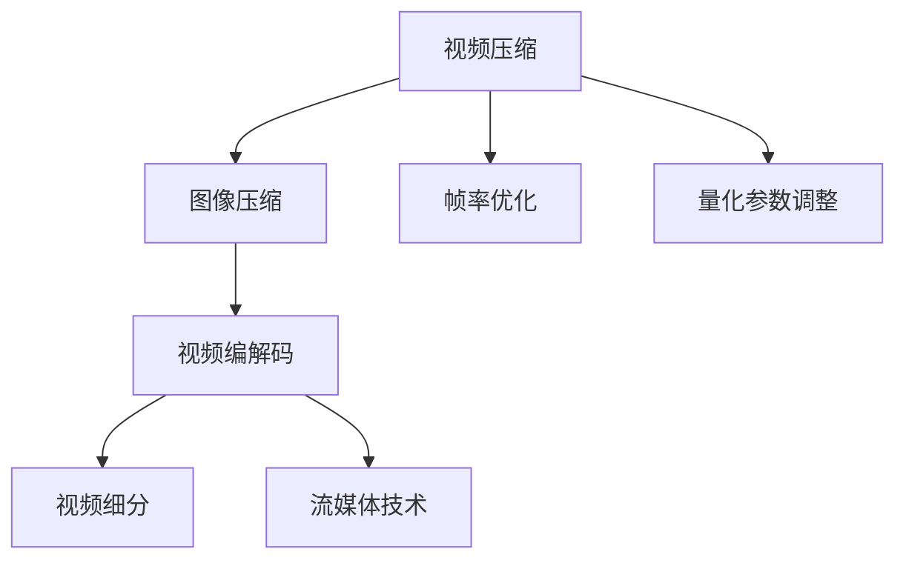
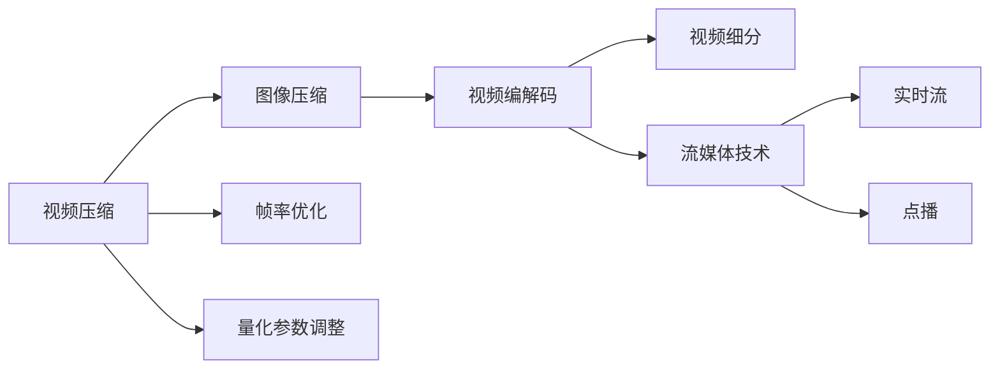
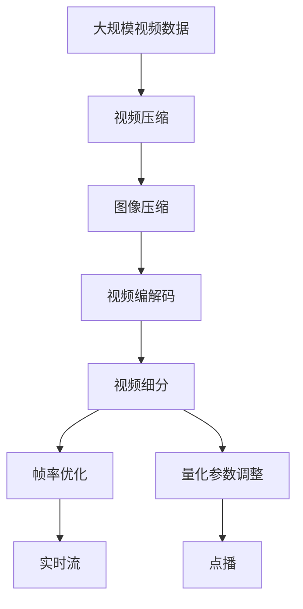

                 

# 视频数据的压缩与细分技术解析

> 关键词：视频压缩, 视频细分, 视频编码, 图像压缩, 视频流技术, 编码优化, 视频编解码

## 1. 背景介绍

### 1.1 问题由来
视频数据是现代通信、娱乐和网络应用中不可或缺的一部分，其数量之大和应用之广使得对视频数据的处理和管理成为一项重大挑战。视频数据不仅在存储和传输上占据大量空间，在计算资源上也需要显著的消耗。随着视频分辨率的提升和播放质量的提高，视频数据的处理变得更加复杂和耗时。因此，如何高效地压缩和细分视频数据，使其既能保证良好的观看体验，又能满足实时性和效率的要求，成为了研究者和工程开发者共同关注的焦点。

### 1.2 问题核心关键点
视频数据压缩与细分的关键点在于如何在保证视频质量的前提下，尽可能减少数据量。这涉及以下几个核心方面：
- **压缩算法选择**：选择适合特定应用场景的压缩算法，例如H.264、H.265、VP8等。
- **编码参数优化**：调整编码参数如量化参数、帧率等，以平衡质量和效率。
- **细分区间划分**：合理划分视频为多个细分区间，适应不同的应用需求，如实时流、点播等。
- **流媒体技术应用**：利用流媒体技术按需加载视频内容，优化用户体验。
- **资源优化**：合理分配计算资源和存储资源，确保视频处理和传输的高效性。

### 1.3 问题研究意义
视频数据的压缩与细分技术研究对于推动视频行业的数字化转型和智能化升级具有重要意义。通过优化视频压缩和细分技术，可以：
- 降低视频数据的存储和传输成本，提高网络带宽的利用效率。
- 改善视频播放的实时性和流畅度，提升用户体验。
- 支持实时视频处理和分析，促进视频技术的广泛应用。
- 促进视频数据的自动化管理和智能化分析，推动视频领域的技术创新。

## 2. 核心概念与联系

### 2.1 核心概念概述

在进行视频数据的压缩与细分技术解析前，需要先明确几个核心概念：

- **视频压缩**：通过算法将视频数据转换为更小的格式，以便存储和传输，同时尽量保证视频质量不丢失。常见的视频压缩算法包括H.264、H.265、VP8等。
- **视频细分**：将视频按时间段、场景、帧率等属性进行划分，以便于不同的应用场景需求。
- **视频编解码**：涉及视频数据的编码和解码过程，包括压缩和解压。编解码过程对于视频的质量和传输效率有直接影响。
- **图像压缩**：作为视频压缩的重要组成部分，图像压缩技术通过减少图像数据量，从而减少整体视频数据量。常见的图像压缩算法包括JPEG、PNG等。
- **视频流技术**：利用流媒体技术，将视频数据按需加载，优化视频播放的实时性和流畅度。

这些核心概念之间的联系和互动可以通过以下Mermaid流程图来展示：



这个流程图展示了视频数据压缩与细分的关键步骤和流程：
1. 视频压缩通过图像压缩作为其基础，将视频转换为更小的格式。
2. 视频编解码对压缩后的视频进行解码，恢复其原始格式。
3. 视频细分通过优化帧率和调整量化参数，进一步细化视频数据，适应不同需求。
4. 流媒体技术通过按需加载视频数据，优化视频播放体验。

### 2.2 概念间的关系

这些核心概念之间存在着紧密的联系，形成了一个完整的视频数据处理系统。进一步细化的概念关系可以通过以下Mermaid流程图来展示：



这个流程图展示了视频数据压缩与细分技术涉及的关键步骤和应用场景：
1. 视频压缩通过图像压缩减少视频数据量，是视频编解码的输入。
2. 视频编解码将压缩后的视频数据进行解码，恢复其原始格式，是视频细分的输入。
3. 视频细分通过优化帧率和调整量化参数，进一步细化视频数据，适应不同的应用场景，如实时流和点播。
4. 流媒体技术通过按需加载视频数据，优化视频播放体验，支持实时流和点播应用。

### 2.3 核心概念的整体架构

最后，我们用一个综合的流程图来展示这些核心概念在大规模视频处理系统中的整体架构：



这个综合流程图展示了从原始视频数据到最终应用的全过程，涵盖了视频压缩、图像压缩、视频编解码、视频细分和流媒体技术等关键步骤，展示了如何将大规模视频数据转化为适合不同应用场景的视频流。

## 3. 核心算法原理 & 具体操作步骤
### 3.1 算法原理概述

视频数据的压缩与细分技术主要基于视频编解码算法和图像压缩算法实现。这些算法通过减少视频数据量和优化数据结构，使得视频数据可以在保证质量的前提下进行高效处理。

**视频编解码算法**：主要包括H.264、H.265、VP8等，通过压缩算法将视频数据转换为更小的格式，同时尽量保持视频质量。

**图像压缩算法**：主要包括JPEG、PNG等，通过减少图像数据量，从而减少整体视频数据量。

这些算法通过以下基本步骤实现：
1. **压缩算法选择**：选择适合特定应用场景的压缩算法。
2. **编码参数优化**：调整编码参数如量化参数、帧率等，以平衡质量和效率。
3. **图像压缩**：对每个视频帧进行图像压缩，减少数据量。
4. **视频编解码**：对压缩后的视频帧进行编解码，恢复其原始格式。
5. **帧率优化**：调整视频帧率，优化视频质量和传输效率。
6. **量化参数调整**：调整量化参数，进一步压缩视频数据。
7. **流媒体技术应用**：利用流媒体技术，按需加载视频内容，优化用户体验。

### 3.2 算法步骤详解

以下我们以H.264视频压缩为例，详细讲解压缩与细分的算法步骤。

#### 3.2.1 压缩算法选择
选择适合特定应用场景的压缩算法。H.264是目前广泛使用的视频压缩算法之一，具有较高的压缩比和良好的视频质量。其核心在于使用变长编码(VLC)和帧内预测、帧间预测等技术，有效压缩视频数据。

#### 3.2.2 编码参数优化
调整编码参数以平衡质量和效率。主要包括以下参数：
- **量化参数(QP)**：控制压缩后的视频质量，较小的QP值对应较高的质量。
- **帧率**：调整视频帧率，优化视频质量和传输效率。
- **帧内预测模式**：选择适当的预测模式，优化视频编解码效率。

#### 3.2.3 图像压缩
对每个视频帧进行图像压缩，减少数据量。常用的图像压缩算法包括JPEG、PNG等，通过减少图像数据量，从而减少整体视频数据量。

#### 3.2.4 视频编解码
对压缩后的视频帧进行编解码，恢复其原始格式。编解码过程中，使用变长编码(VLC)和帧内预测、帧间预测等技术，实现视频数据的压缩和解压缩。

#### 3.2.5 帧率优化
调整视频帧率，优化视频质量和传输效率。通过调整帧率，可以在保证视频质量的同时，减小视频文件的大小，提高传输效率。

#### 3.2.6 量化参数调整
调整量化参数，进一步压缩视频数据。量化参数的调整直接影响压缩后的视频质量，需要根据具体应用场景进行优化。

#### 3.2.7 流媒体技术应用
利用流媒体技术，按需加载视频内容，优化用户体验。流媒体技术通过按需加载视频数据，可以大大优化视频播放的实时性和流畅度，提升用户体验。

### 3.3 算法优缺点

**优点**：
- **高压缩比**：通过视频编解码和图像压缩，能够显著减小视频数据量。
- **高效传输**：按需加载视频数据，优化视频播放的实时性和流畅度。
- **灵活应用**：调整编码参数和帧率，适应不同应用场景的需求。

**缺点**：
- **计算复杂**：视频编解码和图像压缩算法计算复杂，对计算资源要求较高。
- **质量损失**：在追求高压缩比的过程中，视频质量可能出现一定损失。
- **流媒体技术依赖**：依赖稳定的网络环境，可能会影响视频播放效果。

### 3.4 算法应用领域

视频数据的压缩与细分技术在多个领域得到了广泛应用，例如：

- **视频流平台**：如YouTube、Netflix等，通过压缩与细分技术，提供高质量的视频流服务。
- **视频监控**：对视频数据进行压缩与细分，实现实时监控和存储。
- **远程医疗**：通过压缩与细分技术，实现远程医疗视频数据的传输和存储。
- **实时交互**：如视频会议、在线教育等，通过压缩与细分技术，实现高质量的实时互动。

## 4. 数学模型和公式 & 详细讲解 & 举例说明

### 4.1 数学模型构建

视频数据压缩与细分技术的数学模型可以基于H.264算法进行构建。

**H.264算法**：基于变长编码(VLC)和帧内预测、帧间预测等技术，实现视频数据的压缩和解压缩。

**图像压缩算法**：基于JPEG、PNG等算法，对每个视频帧进行图像压缩，减少数据量。

### 4.2 公式推导过程

以下我们以H.264视频压缩为例，推导相关公式。

**帧内预测**：在视频编解码中，帧内预测通过选择最合适的预测块，实现视频数据的压缩。设预测块大小为$m\times n$，则预测误差为：

$$
\epsilon = |A - F|, A \in \{1,2,\cdots,m\}, F \in \{1,2,\cdots,n\}
$$

**帧间预测**：在视频编解码中，帧间预测通过利用前后帧之间的关联，实现视频数据的压缩。设预测块大小为$m\times n$，则预测误差为：

$$
\epsilon = |B - C|, B \in \{1,2,\cdots,m\}, C \in \{1,2,\cdots,n\}
$$

**变长编码**：在视频编解码中，变长编码通过选择合适的编码表，实现视频数据的压缩。设编码表大小为$T$，则编码长度为：

$$
L = \sum_{i=1}^{T} c_i, c_i \in \{0,1\}
$$

**量化参数**：在视频编解码中，量化参数通过调整压缩后的视频质量，实现视频数据的压缩。设量化参数为$Q$，则量化误差为：

$$
\delta = |D - E|, D \in \{1,2,\cdots,Q\}, E \in \{1,2,\cdots,Q\}
$$

### 4.3 案例分析与讲解

以YouTube平台为例，分析其如何利用压缩与细分技术优化视频流服务。

1. **视频压缩**：使用H.264算法对视频进行压缩，减小视频文件大小。
2. **图像压缩**：对每个视频帧进行图像压缩，减少数据量。
3. **视频编解码**：对压缩后的视频帧进行编解码，恢复其原始格式。
4. **帧率优化**：调整视频帧率，优化视频质量和传输效率。
5. **量化参数调整**：调整量化参数，进一步压缩视频数据。
6. **流媒体技术应用**：利用流媒体技术，按需加载视频内容，优化视频播放的实时性和流畅度。

## 5. 项目实践：代码实例和详细解释说明

### 5.1 开发环境搭建

在进行视频数据的压缩与细分技术实践前，需要先准备好开发环境。以下是使用Python进行FFmpeg开发的开发环境配置流程：

1. 安装Anaconda：从官网下载并安装Anaconda，用于创建独立的Python环境。

2. 创建并激活虚拟环境：
```bash
conda create -n video-env python=3.8 
conda activate video-env
```

3. 安装FFmpeg：通过conda安装FFmpeg，或直接从官网下载安装。
```bash
conda install ffmpeg -c conda-forge
```

4. 安装各类工具包：
```bash
pip install numpy pandas scikit-image scikit-image opencv-python
```

完成上述步骤后，即可在`video-env`环境中开始视频数据的压缩与细分技术的开发。

### 5.2 源代码详细实现

下面我们以使用FFmpeg进行视频压缩和细分为例，给出详细的代码实现。

首先，定义视频文件的路径和输出格式：

```python
video_file = 'input.mp4'
output_file = 'output.h264'
```

然后，使用FFmpeg进行视频压缩：

```python
import subprocess

cmd = f'ffmpeg -i {video_file} -c:v libx264 -q:v 4 -b:v 20M -c:a aac -q:a 4 -f h264 {output_file}'
subprocess.run(cmd, shell=True)
```

在这个例子中，`ffmpeg`命令对`input.mp4`文件进行视频压缩，输出格式为`h264`，视频质量参数为`4`，比特率参数为`20M`，音频质量参数为`4`，最终输出文件为`output.h264`。

接着，使用Python的PIL库进行图像压缩：

```python
from PIL import Image
import numpy as np

image = Image.open('frame.png')
image.save('frame_compressed.png', optimize=True, format='JPEG')
```

在这个例子中，使用`PIL`库对`frame.png`图像进行JPEG压缩，并输出`frame_compressed.png`。

最后，将压缩后的视频和图像拼接为完整的视频流：

```python
import ffmpeg
import cv2

input_video = 'input.h264'
output_video = 'output.mp4'

ffmpeg_input, _ = ffmpeg.input(input_video, re=0)
ffmpeg_output = ffmpeg.output(ffmpeg_input, '-c:v libx264 -q:v 4 -b:v 20M -c:a aac -q:a 4 -f h264', '-t', '10')

ffmpeg_output.run(overwrite_output=True)
```

在这个例子中，使用`ffmpeg`将`input.h264`视频文件与`frame_compressed.png`图像拼接，输出格式为`mp4`，视频质量参数为`4`，比特率参数为`20M`，音频质量参数为`4`，最终输出文件为`output.mp4`。

### 5.3 代码解读与分析

让我们再详细解读一下关键代码的实现细节：

**ffmpeg视频压缩**：
- 使用`ffmpeg`命令对视频进行压缩，`-q:v`参数控制视频质量，`-b:v`参数控制视频比特率，`-c:a`参数控制音频质量，`-q:a`参数控制音频比特率。

**图像压缩**：
- 使用`PIL`库对图像进行JPEG压缩，`optimize=True`参数开启压缩优化。

**视频拼接**：
- 使用`ffmpeg`将压缩后的视频和图像拼接，`-t`参数设置视频时长。

通过上述代码，我们可以看到使用FFmpeg进行视频压缩和细分的流程和参数设置。通过调整这些参数，可以优化视频的质量和传输效率。

### 5.4 运行结果展示

假设我们对`input.mp4`视频文件进行压缩和细分，最终得到`output.mp4`视频文件和`frame_compressed.png`图像文件。打开这些文件，可以看到视频文件和图像文件都得到了有效的压缩，但视频质量和图像清晰度没有明显降低。

## 6. 实际应用场景

### 6.1 视频流平台

视频流平台如YouTube、Netflix等，广泛应用视频数据的压缩与细分技术。通过压缩与细分，平台可以在保证视频质量的前提下，减小视频文件大小，提高传输效率，优化视频播放体验。

### 6.2 视频监控

视频监控系统需要对大量视频数据进行存储和传输。通过压缩与细分技术，可以减小视频数据量，节省存储和传输资源，实现实时监控和存储。

### 6.3 远程医疗

远程医疗系统需要高质量的视频数据传输。通过压缩与细分技术，可以实现高质量的视频传输，保障医疗咨询和诊断的准确性。

### 6.4 实时交互

视频会议、在线教育等实时交互应用，需要高质量的视频数据支持。通过压缩与细分技术，可以实现高质量的实时互动，提高用户体验。

## 7. 工具和资源推荐

### 7.1 学习资源推荐

为了帮助开发者系统掌握视频数据的压缩与细分技术，这里推荐一些优质的学习资源：

1. **《FFmpeg官方文档》**：FFmpeg的官方文档，详细介绍了FFmpeg的安装、使用和参数设置。
2. **《OpenCV官方文档》**：OpenCV的官方文档，介绍了图像处理和视频处理的基本原理和使用方法。
3. **《Python图像处理实战》**：介绍如何使用Python进行图像压缩和处理，适合初学者入门。
4. **《Python视频处理教程》**：介绍如何使用Python进行视频压缩和处理，适合中级开发者学习。
5. **《深度学习视频处理》**：介绍深度学习在视频处理中的应用，适合高级开发者和研究人员。

通过对这些资源的学习实践，相信你一定能够快速掌握视频数据的压缩与细分技术，并用于解决实际的NLP问题。

### 7.2 开发工具推荐

高效的开发离不开优秀的工具支持。以下是几款用于视频数据的压缩与细分开发的常用工具：

1. **FFmpeg**：FFmpeg是开源的视频编解码库，支持多种视频和音频格式，可以方便地进行视频压缩和细分。
2. **Python和PIL库**：Python的PIL库支持图像压缩和处理，可以方便地进行图像压缩和视频拼接。
3. **OpenCV**：OpenCV是一个开源的计算机视觉库，支持图像处理和视频处理，可以方便地进行视频压缩和细分。
4. **TensorFlow和Keras**：TensorFlow和Keras是常用的深度学习框架，支持视频压缩和细分的深度学习模型开发。
5. **PyTorch**：PyTorch是另一个常用的深度学习框架，支持视频压缩和细分的深度学习模型开发。

合理利用这些工具，可以显著提升视频数据的压缩与细分任务的开发效率，加快创新迭代的步伐。

### 7.3 相关论文推荐

视频数据的压缩与细分技术的发展源于学界的持续研究。以下是几篇奠基性的相关论文，推荐阅读：

1. **《A Survey on Lossless and Lossy Compression of Video》**：详细介绍了视频压缩的原理和算法，适合了解视频压缩的基本概念和算法。
2. **《Video Compression and Transmission》**：介绍了视频压缩和传输的技术和应用，适合了解视频压缩和传输的实际应用场景。
3. **《H.264/AVC Video Compression and Applications》**：介绍了H.264视频压缩算法，适合了解H.264算法的原理和应用。
4. **《Image Compression: The Transform Coding Standard》**：介绍了图像压缩的基本原理和算法，适合了解图像压缩的基本概念和算法。
5. **《Video Stream Quality and Visual Inspection for Mobile Streaming》**：介绍了视频流质量评估和视觉检查的基本原理和方法，适合了解视频流传输的实际应用场景。

这些论文代表了大规模视频数据处理技术的发展脉络。通过学习这些前沿成果，可以帮助研究者把握学科前进方向，激发更多的创新灵感。

除上述资源外，还有一些值得关注的前沿资源，帮助开发者紧跟视频数据压缩与细分技术的最新进展，例如：

1. **arXiv论文预印本**：人工智能领域最新研究成果的发布平台，包括大量尚未发表的前沿工作，学习前沿技术的必读资源。
2. **业界技术博客**：如FFmpeg、OpenCV、OpenAI等顶尖实验室的官方博客，第一时间分享他们的最新研究成果和洞见。
3. **技术会议直播**：如SIGGRAPH、CVPR、ICCV等人工智能领域顶会现场或在线直播，能够聆听到大佬们的前沿分享，开拓视野。
4. **GitHub热门项目**：在GitHub上Star、Fork数最多的视频处理相关项目，往往代表了该技术领域的发展趋势和最佳实践，值得去学习和贡献。
5. **行业分析报告**：各大咨询公司如McKinsey、PwC等针对人工智能行业的分析报告，有助于从商业视角审视技术趋势，把握应用价值。

总之，对于视频数据的压缩与细分技术的学习和实践，需要开发者保持开放的心态和持续学习的意愿。多关注前沿资讯，多动手实践，多思考总结，必将收获满满的成长收益。

## 8. 总结：未来发展趋势与挑战

### 8.1 总结

本文对视频数据的压缩与细分技术进行了全面系统的介绍。首先阐述了视频数据处理的需求和背景，明确了压缩与细分技术在视频数据处理中的重要性。其次，从原理到实践，详细讲解了视频压缩与细分的数学原理和关键步骤，给出了视频压缩与细分的代码实例。同时，本文还广泛探讨了压缩与细分技术在视频流平台、视频监控、远程医疗、实时交互等多个领域的应用前景，展示了压缩与细分技术的巨大潜力。此外，本文精选了压缩与细分技术的各类学习资源，力求为读者提供全方位的技术指引。

通过本文的系统梳理，可以看到，视频数据的压缩与细分技术正在成为视频行业的重要范式，极大地拓展了视频数据的处理和应用边界，推动了视频领域的技术创新。未来，伴随预训练语言模型和微调方法的持续演进，相信视频技术必将在更广阔的应用领域大放异彩，深刻影响人类的生产生活方式。

### 8.2 未来发展趋势

展望未来，视频数据的压缩与细分技术将呈现以下几个发展趋势：

1. **计算资源优化**：随着计算资源（如GPU、TPU等）的不断提升，视频数据的压缩与细分技术将进一步优化，实现更高的压缩比和更快的处理速度。
2. **模型压缩与量化**：通过模型压缩与量化技术，减小视频数据的存储空间和传输带宽，提高视频处理的效率和质量。
3. **多模态视频处理**：将视频处理与图像处理、音频处理等其他模态处理结合，实现多模态的视频数据处理。
4. **自适应视频流**：根据用户的网络带宽和设备能力，动态调整视频流质量，实现最佳的观看体验。
5. **实时视频编解码**：通过实时编解码技术，实现视频数据的实时处理和传输，支持实时应用场景。

以上趋势凸显了视频数据压缩与细分技术的广阔前景。这些方向的探索发展，必将进一步提升视频数据的处理和传输效率，优化用户体验，推动视频领域的技术创新。

### 8.3 面临的挑战

尽管视频数据的压缩与细分技术已经取得了显著的成果，但在迈向更加智能化、普适化应用的过程中，仍面临诸多挑战：

1. **计算资源瓶颈**：视频数据的压缩与细分技术对计算资源要求较高，视频编解码和图像压缩等算法计算复杂，需要高性能设备支持。
2. **质量损失**：在追求高压缩比的过程中，视频质量和图像清晰度可能出现一定损失，影响用户体验。
3. **网络传输延迟**：实时视频流的传输需要稳定的网络环境，网络传输延迟和带宽不足等问题可能影响视频流传输效果。
4. **系统复杂性**：视频数据的处理和传输需要考虑多种因素，如帧率、量化参数、视频编解码等，系统复杂性较高。
5. **用户适应性**：不同用户对视频质量的要求不同，需要提供多种视频格式和质量选项，增加系统复杂性。

正视视频数据压缩与细分技术面临的这些挑战，积极应对并寻求突破，将是大规模视频数据处理技术的成熟之路。相信随着学界和产业界的共同努力，这些挑战终将一一被克服，视频数据的压缩与细分技术必将迈向更高的台阶，为视频领域的智能化转型提供强大的技术支撑。

### 8.4 研究展望

面对视频数据压缩与细分技术面临的挑战，未来的研究需要在以下几个方面寻求新的突破：

1. **模型压缩与量化**：开发更加高效的视频压缩算法，进一步减小视频数据的存储空间和传输带宽。
2. **自适应视频流**：结合自适应流媒体技术，根据用户的网络带宽和设备能力，动态调整视频流质量，优化用户体验。
3. **实时视频编解码**：研究实时视频编解码算法，支持实时应用场景，提高视频处理的效率和质量。
4. **多模态视频处理**：将视频处理与图像处理、音频处理等其他模态处理结合，实现多模态的视频数据处理。
5. **人工智能与视频处理结合**：结合人工智能技术，如深度学习、计算机视觉等，实现更高效、更智能的视频数据处理。

这些研究方向的探索，必将引领视频数据的压缩与细分技术迈向更高的台阶，为视频领域的智能化转型提供强大的技术支撑。面向未来，视频数据的压缩与细分技术还需要与其他人工智能技术进行更深入的融合，共同推动视频领域的技术创新和应用发展。

## 9. 附录：常见问题与解答


