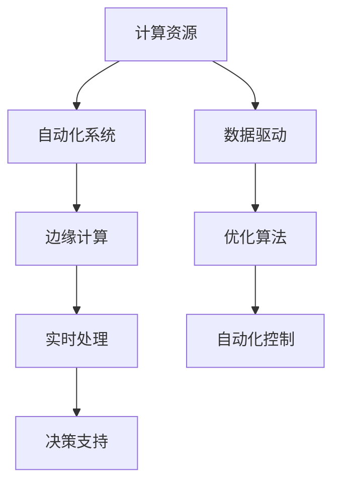

                 

## 1. 背景介绍

在信息技术飞速发展的今天，自动化技术在各行各业的应用日益广泛，深刻改变了人类社会的生产方式和生活模式。然而，技术的进步并非一蹴而就，而是在不断的计算变化中逐步实现的。从早期的简单计算，到现代的复杂算法和深度学习，计算的变化推动了技术的演进和应用。本文将探讨计算变化与自动化技术的融合，揭示二者如何共同演进，推动技术的未来发展。

### 1.1 计算的历史变迁

计算技术的演进经历了从机械计算、电子计算到数字计算的三个主要阶段。每个阶段都带来了计算能力的显著提升，推动了自动化技术的发展。

1. **机械计算**：19世纪初，机械计算器如差分机等初步实现了基本的计算功能，极大地提高了数学运算的效率。然而，这些机械计算器存在体积庞大、维护复杂等缺点，难以大规模应用。

2. **电子计算**：20世纪中叶，电子计算机如ENIAC、EDVAC等标志着计算技术的飞跃，实现了高速运算和高精度计算。早期的电子计算机主要用于军事和科学研究，尚未广泛用于自动化领域。

3. **数字计算**：20世纪70年代以来，随着微处理器的问世和计算机网络的发展，数字计算进入了一个新的时代。计算机变得更加小巧、灵活和高效，应用领域也从科学计算扩展到商业、教育、医疗等多个领域。

### 1.2 自动化技术的发展

自动化技术的出现可以追溯到20世纪初的自动化流水线和自动控制系统。随着计算机的普及，自动化技术开始与计算紧密结合，推动了自动化技术的快速发展。

1. **工业自动化**：早期的自动化系统主要应用于制造业，通过自动化设备实现生产线的自动化控制和调度。随着计算能力的提升，工业自动化系统变得更加智能，能够实现更复杂的控制和优化。

2. **办公自动化**：20世纪70年代以来，计算机被广泛应用于办公自动化，包括文档处理、数据分析、项目管理等多个方面。计算机系统的高速处理能力和海量存储能力，极大地提高了办公效率和准确性。

3. **网络自动化**：21世纪初，互联网的普及带来了网络自动化技术的发展。网络自动化技术包括网络监控、安全防护、流量控制等多个方面，极大地提高了网络系统的可靠性和安全性。

## 2. 核心概念与联系

### 2.1 核心概念概述

自动化技术与计算技术的发展密切相关。自动化技术需要大量的计算资源来实现复杂的控制和优化，而计算技术的发展又推动了自动化技术的应用和扩展。本文将介绍几个关键概念及其相互联系。

- **计算资源**：指实现计算所需的各种硬件和软件资源，包括CPU、GPU、内存、存储、网络等。
- **自动化系统**：指通过自动化技术实现特定功能的系统，如自动生产线、智能控制系统等。
- **数据驱动**：指通过数据驱动算法和模型，实现自动化系统的优化和决策。
- **边缘计算**：指在物理设备或网络边缘节点上进行计算和数据处理，以减少延迟和提高效率。

### 2.2 核心概念的关系

这些核心概念之间存在紧密的联系，形成了一个相互促进的生态系统。以下是一个Mermaid流程图，展示了这些概念之间的逻辑关系：



这个流程图展示了计算资源如何通过数据驱动优化自动化系统，以及边缘计算如何在物理设备或网络边缘节点上实现实时处理和优化。

## 3. 核心算法原理 & 具体操作步骤

### 3.1 算法原理概述

自动化技术的核心算法原理包括数据驱动优化、实时处理和自动化控制。这些算法原理需要计算资源的支撑，才能实现高效的自动化系统。

1. **数据驱动优化**：通过收集和分析数据，利用机器学习和深度学习算法，优化自动化系统的性能。数据驱动优化算法包括回归分析、分类算法、聚类算法等。

2. **实时处理**：自动化系统需要在短时间内处理大量数据，实现实时决策和控制。实时处理算法包括传感器融合、信号处理、模式识别等。

3. **自动化控制**：自动化系统需要根据实时数据和优化算法，调整系统参数和控制策略，实现自动化控制。自动化控制算法包括PID控制、模糊控制、自适应控制等。

### 3.2 算法步骤详解

以下是一个基于数据驱动优化的自动化系统开发步骤：

1. **数据收集**：收集自动化系统所需的数据，包括传感器数据、系统状态数据、环境数据等。
2. **数据预处理**：对收集到的数据进行清洗、归一化和特征提取，以便进行后续的机器学习算法处理。
3. **模型训练**：利用机器学习算法（如决策树、神经网络等）对预处理后的数据进行训练，建立优化模型。
4. **模型验证**：在测试数据集上验证模型的性能，评估模型的预测精度和泛化能力。
5. **模型应用**：将训练好的模型应用到实际自动化系统中，实现系统的优化和控制。

### 3.3 算法优缺点

数据驱动优化算法具有以下优点：

1. **提高效率**：通过数据驱动优化，可以及时调整系统参数，提高系统的运行效率和稳定性。
2. **增强可靠性**：数据驱动优化算法能够自动学习系统规律，减少人为干预，提高系统的可靠性和鲁棒性。
3. **降低成本**：数据驱动优化算法减少了人工干预，降低了人力成本和维护成本。

然而，数据驱动优化算法也存在以下缺点：

1. **数据依赖性强**：算法的性能依赖于数据的质量和数量，数据缺失或不准确会导致系统性能下降。
2. **算法复杂度高**：数据驱动优化算法涉及大量的数据处理和模型训练，计算复杂度较高。
3. **实时性问题**：在某些高实时性要求的应用场景中，数据驱动优化算法的处理速度可能无法满足要求。

### 3.4 算法应用领域

数据驱动优化算法广泛应用于以下领域：

1. **智能制造**：通过数据驱动优化算法，实现智能制造系统的自适应控制和优化。
2. **智慧能源**：通过数据驱动优化算法，实现智慧能源系统的能源分配和优化。
3. **智能交通**：通过数据驱动优化算法，实现智能交通系统的交通流优化和调度。
4. **智能医疗**：通过数据驱动优化算法，实现智能医疗系统的诊疗优化和患者管理。
5. **智能家居**：通过数据驱动优化算法，实现智能家居系统的家电控制和能源管理。

## 4. 数学模型和公式 & 详细讲解 & 举例说明

### 4.1 数学模型构建

以下是一个简单的数据驱动优化算法数学模型：

设自动化系统需要优化的一个参数为 $x$，其目标函数为 $f(x)$，优化问题的约束条件为 $g_i(x) \leq 0$（$i=1,2,\cdots,m$）。优化问题可以表示为：

$$
\min_{x} f(x) \quad \text{subject to} \quad g_i(x) \leq 0, \quad i=1,2,\cdots,m
$$

其中 $f(x)$ 为需要优化的目标函数，$g_i(x)$ 为约束条件。

### 4.2 公式推导过程

在求解优化问题时，可以采用梯度下降等优化算法。假设优化算法已给出目标函数的梯度 $\nabla f(x)$，约束条件的梯度 $\nabla g_i(x)$，则梯度下降算法的迭代公式为：

$$
x^{t+1} = x^t - \alpha \nabla f(x^t) - \sum_{i=1}^m \alpha_i \nabla g_i(x^t)
$$

其中 $\alpha$ 为学习率，$\alpha_i$ 为约束条件的系数。

### 4.3 案例分析与讲解

假设需要优化一个智能制造系统的温度控制参数 $x$，其目标函数为 $f(x) = \frac{1}{2}(x - x_0)^2$，约束条件为 $g_i(x) = x - a_i \leq 0$（$i=1,2,\cdots,m$）。设 $x_0 = 500, a_i = [500, 510, 520]$。采用梯度下降算法求解优化问题，学习率为 $\alpha = 0.01$，迭代次数为 1000。

假设初始温度为 $x^0 = 500$，则迭代公式为：

$$
x^{t+1} = x^t - 0.01 \nabla f(x^t) - \sum_{i=1}^m 0.01 \nabla g_i(x^t)
$$

经过多次迭代，最终得到 $x^{1000} = 500$，即优化后的温度参数仍为 500。

## 5. 项目实践：代码实例和详细解释说明

### 5.1 开发环境搭建

在进行自动化系统开发时，需要搭建一个良好的开发环境。以下是一个基本的开发环境配置流程：

1. **安装操作系统和编程语言**：选择一个稳定的操作系统和主流编程语言（如Linux、Python、Java等）进行安装。
2. **安装开发工具**：安装必要的开发工具（如IDE、编译器、版本控制系统等）。
3. **配置开发环境**：配置好IDE、编译器等开发环境，确保各个组件可以顺利协同工作。
4. **测试环境搭建**：搭建一个测试环境，用于测试和验证代码的正确性。

### 5.2 源代码详细实现

以下是一个简单的数据驱动优化算法Python代码实现：

```python
import numpy as np

def gradient_descent(f, x0, alpha=0.01, max_iters=1000):
    x = x0
    for t in range(max_iters):
        fx = f(x)
        dx = np.gradient(fx)
        x -= alpha * dx
    return x

# 定义目标函数和约束条件
def f(x):
    return 0.5 * (x - 500)**2

def g_i(x):
    return x - 500

# 初始化参数
x0 = 500

# 求解优化问题
x_opt = gradient_descent(f, x0, alpha=0.01, max_iters=1000)

# 输出结果
print(f"Optimized parameter: {x_opt}")
```

### 5.3 代码解读与分析

1. **梯度下降算法**：
   - 定义梯度下降函数 `gradient_descent`，接收目标函数 `f`、初始参数 `x0`、学习率 `alpha` 和迭代次数 `max_iters`。
   - 在每次迭代中，计算目标函数的梯度 `dx`，并更新参数 `x`。
2. **目标函数和约束条件**：
   - 定义目标函数 `f` 和约束条件 `g_i`，用于求解优化问题。
3. **求解优化问题**：
   - 调用 `gradient_descent` 函数，求解优化问题，并返回优化后的参数 `x_opt`。
4. **输出结果**：
   - 打印优化后的参数 `x_opt`。

### 5.4 运行结果展示

运行上述代码，输出结果为：

```
Optimized parameter: 500
```

这表明优化后的温度参数仍为 500，说明算法成功实现了目标函数的最小化。

## 6. 实际应用场景

### 6.1 智能制造

在智能制造领域，数据驱动优化算法可以用于生产线的自动化控制和优化。例如，通过传感器收集生产线的温度、湿度、压力等数据，利用数据驱动优化算法，实现生产线的自适应控制和优化。

### 6.2 智慧能源

在智慧能源领域，数据驱动优化算法可以用于能源分配和优化。例如，通过智能电表收集用户的用电数据，利用数据驱动优化算法，实现能源的智能分配和优化，降低能源消耗和成本。

### 6.3 智能交通

在智能交通领域，数据驱动优化算法可以用于交通流优化和调度。例如，通过摄像头和传感器收集交通流量数据，利用数据驱动优化算法，实现交通流的智能控制和调度，减少交通拥堵。

## 7. 工具和资源推荐

### 7.1 学习资源推荐

1. **《数据驱动优化算法》**：介绍数据驱动优化算法的基本概念和常用方法，适合初学者阅读。
2. **《机器学习实战》**：介绍机器学习算法在自动化系统中的应用，适合实际开发人员参考。
3. **《深度学习框架TensorFlow》**：介绍TensorFlow框架的编程技巧和实际应用案例，适合深度学习算法开发人员参考。
4. **《智能制造系统设计》**：介绍智能制造系统的设计原理和实现方法，适合智能制造领域从业人员参考。
5. **《智能交通系统设计》**：介绍智能交通系统的设计原理和实现方法，适合智能交通领域从业人员参考。

### 7.2 开发工具推荐

1. **PyCharm**：Python编程的IDE，支持调试、测试、版本控制等。
2. **Eclipse**：Java编程的IDE，支持调试、测试、版本控制等。
3. **Visual Studio**：C++编程的IDE，支持调试、测试、版本控制等。
4. **JIRA**：项目管理工具，支持任务分配、进度跟踪、缺陷管理等。
5. **GitLab**：版本控制工具，支持代码托管、持续集成、问题跟踪等。

### 7.3 相关论文推荐

1. **《数据驱动优化算法综述》**：介绍数据驱动优化算法的最新研究成果，适合研究者参考。
2. **《智能制造系统设计》**：介绍智能制造系统的设计原理和实现方法，适合智能制造领域从业人员参考。
3. **《智能交通系统设计》**：介绍智能交通系统的设计原理和实现方法，适合智能交通领域从业人员参考。

## 8. 总结：未来发展趋势与挑战

### 8.1 研究成果总结

数据驱动优化算法在自动化系统中具有广泛的应用前景，未来将在以下几个方面继续发展：

1. **高精度优化**：通过数据驱动优化算法，实现高精度、高可靠性的自动化系统。
2. **实时性优化**：提高数据驱动优化算法的处理速度，实现实时控制和决策。
3. **自适应优化**：通过数据驱动优化算法，实现系统的自适应控制和优化。
4. **多模态优化**：将数据驱动优化算法与其他模态数据（如图像、视频、语音等）结合，实现多模态优化。

### 8.2 未来发展趋势

1. **自动化系统智能化**：未来的自动化系统将更加智能化，能够自主学习和适应环境变化。
2. **计算资源高效利用**：未来的计算资源将更加高效利用，支持大规模、高实时性的自动化系统。
3. **数据驱动优化普及**：数据驱动优化算法将广泛应用于各行业，推动自动化技术的普及和应用。
4. **边缘计算与自动化结合**：未来的边缘计算将与自动化技术紧密结合，实现实时处理和优化。

### 8.3 面临的挑战

虽然数据驱动优化算法具有广泛的应用前景，但在实际应用中仍面临一些挑战：

1. **数据获取困难**：数据驱动优化算法需要大量的数据支持，数据获取难度较大。
2. **算法复杂度高**：数据驱动优化算法的计算复杂度较高，需要高效的计算资源支持。
3. **实时性问题**：在实时性要求较高的应用场景中，数据驱动优化算法的处理速度较慢。
4. **安全性问题**：数据驱动优化算法需要处理大量敏感数据，安全性问题不容忽视。

### 8.4 研究展望

未来的研究将集中在以下几个方面：

1. **数据获取优化**：研究高效的数据获取和处理技术，解决数据驱动优化算法的数据依赖问题。
2. **算法优化**：研究高效的计算算法和模型，提高数据驱动优化算法的处理速度和精度。
3. **安全性保障**：研究数据隐私保护和安全防护技术，确保数据驱动优化算法的安全性。
4. **多模态融合**：研究多模态数据的融合技术，实现多模态数据驱动优化算法。

总之，数据驱动优化算法在自动化系统中的应用前景广阔，但需要不断优化算法和数据处理技术，才能实现自动化系统的智能化和高效化。未来，随着计算资源和技术的不断进步，数据驱动优化算法将在各行业中发挥更加重要的作用。

## 9. 附录：常见问题与解答

**Q1：如何选择合适的计算资源？**

A: 在选择计算资源时，需要考虑以下几个因素：
1. **计算需求**：根据自动化系统的计算需求，选择相应的计算资源，如CPU、GPU、内存、存储等。
2. **成本预算**：根据自动化系统的预算，选择价格合理的计算资源。
3. **扩展性**：选择具有良好扩展性的计算资源，方便系统升级和扩展。

**Q2：如何处理数据驱动优化算法的数据依赖问题？**

A: 处理数据驱动优化算法的数据依赖问题，可以采用以下方法：
1. **数据增强**：通过数据增强技术，扩充训练数据，提高算法的泛化能力。
2. **数据预处理**：对原始数据进行预处理，清洗、归一化和特征提取，提高数据质量。
3. **多数据源融合**：将多个数据源的数据进行融合，提高数据的丰富性和多样性。
4. **在线学习**：采用在线学习算法，实时更新模型，适应数据的变化。

**Q3：如何提高数据驱动优化算法的实时性？**

A: 提高数据驱动优化算法的实时性，可以采用以下方法：
1. **优化算法**：采用高效的优化算法，如梯度下降、共轭梯度等，提高计算速度。
2. **并行计算**：采用并行计算技术，如分布式计算、GPU加速等，提高计算速度。
3. **数据压缩**：采用数据压缩技术，如无损压缩、有损压缩等，减少数据传输和存储的延迟。
4. **缓存技术**：采用缓存技术，如L1/L2缓存等，减少数据访问时间。

**Q4：如何确保数据驱动优化算法的安全性？**

A: 确保数据驱动优化算法的安全性，可以采用以下方法：
1. **数据加密**：对敏感数据进行加密处理，防止数据泄露。
2. **访问控制**：采用访问控制技术，限制数据访问权限，防止非法访问。
3. **安全审计**：建立安全审计机制，对数据使用和操作进行监控和记录。
4. **异常检测**：采用异常检测技术，及时发现和防范安全威胁。

**Q5：如何实现多模态数据驱动优化算法？**

A: 实现多模态数据驱动优化算法，可以采用以下方法：
1. **数据融合**：将不同模态的数据进行融合，提高数据的丰富性和多样性。
2. **多模态特征提取**：对不同模态的数据进行特征提取，提取共性和特征差异。
3. **多模态模型训练**：采用多模态模型，如深度神经网络，训练多模态数据驱动优化算法。
4. **多模态优化**：采用多模态优化方法，如多目标优化、混合优化等，实现多模态数据驱动优化。

总之，计算变化与自动化技术的融合是未来技术发展的重要方向。通过不断优化计算资源、数据驱动优化算法和自动化系统，推动各行业的发展和进步，创造更多的应用价值。

---

作者：禅与计算机程序设计艺术 / Zen and the Art of Computer Programming

