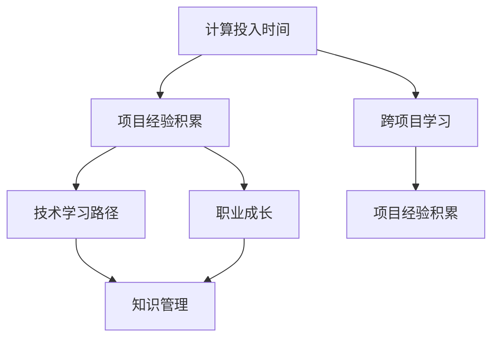

                 

# 计算投入时间：即使是失败的项目也能积累专业知识

> 关键词：计算投入时间, 项目经验积累, 技术学习路径, 职业成长, 知识管理

## 1. 背景介绍

### 1.1 问题由来

在当今快速发展的科技行业中，计算时间的投入几乎成了一个重要的投资指标。无论是个人开发者、企业团队还是科研机构，投入的时间资源都在不断增加。然而，这些时间资源的有效利用，成为了技术人员职业生涯中的关键挑战。特别是在开源和开源社区中，许多项目由于各种各样的原因最终以失败告终。尽管这些失败的项目并未产生实际的产品或收益，但其中蕴含的知识积累和技术沉淀，对后续的实践和技术学习仍然具有重要价值。

### 1.2 问题核心关键点

1. **计算投入的时间效率**：如何高效利用时间，从失败的项目中积累和学习。
2. **技术知识沉淀**：失败的项目中包含的知识如何转化为自身的能力和经验。
3. **持续学习与成长**：如何通过失败的实践，持续提升自身的技术水平和职业能力。
4. **知识管理与复用**：如何将积累的知识进行有效管理，以供后续项目复用。
5. **跨项目学习**：如何在多个项目间进行技术迁移和经验借鉴。

### 1.3 问题研究意义

1. **技术积累与知识沉淀**：通过失败的项目积累的技术经验，对个人或团队的技术水平提升至关重要。
2. **职业成长与竞争力**：在失败的实践中积累的知识，可以转化为核心竞争力，促进职业发展。
3. **成本优化与资源管理**：高效的计算投入时间管理，可以帮助企业优化项目资源，降低成本。
4. **创新驱动与问题解决**：面对新问题时，通过失败的教训可以更快找到解决方案。
5. **跨领域与跨学科融合**：失败的项目经验往往包含跨领域的知识和技能，有助于推动技术创新。

## 2. 核心概念与联系

### 2.1 核心概念概述

为更好地理解失败项目如何积累专业知识，我们需要明确以下几个关键概念：

1. **计算投入时间（Calculation Investment Time）**：指在技术项目开发过程中，为实现特定目标或解决特定问题所投入的计算时间。
2. **项目经验积累（Project Experience Accumulation）**：在项目开发过程中，通过实践获得的知识、技能和见解。
3. **技术学习路径（Technical Learning Path）**：通过不断的学习和实践，技术水平逐步提升的路径。
4. **职业成长（Career Growth）**：技术技能提升、职业角色转变和个人职业发展的过程。
5. **知识管理（Knowledge Management）**：对所积累的技术知识进行有效的记录、整理和复用。
6. **跨项目学习（Cross-Project Learning）**：在不同项目间学习迁移技术知识和经验。

这些概念通过以下Mermaid流程图来展示它们之间的关系：



通过这个流程图，我们可以看到，计算投入时间通过项目经验积累，进而促进技术学习路径和职业成长，最终形成知识管理与跨项目学习。这些概念相互作用，共同构成了技术积累与知识沉淀的完整生态系统。

### 2.2 概念间的关系

这些核心概念之间的联系紧密，形成了技术积累与知识沉淀的完整生态系统。具体如下：

1. **计算投入时间与项目经验积累**：没有计算投入，就无法积累项目经验；反之，良好的项目经验可以更好地利用计算投入时间。
2. **项目经验积累与技术学习路径**：项目经验是技术学习的重要来源，通过持续的项目经验积累，技术学习路径逐渐清晰。
3. **技术学习路径与职业成长**：技术学习是职业成长的基础，职业成长需要不断地技术学习和实践。
4. **知识管理与跨项目学习**：知识管理是跨项目学习的前提，跨项目学习又能带来新的知识管理方法。
5. **跨项目学习与项目经验积累**：跨项目学习可以提升项目经验质量，项目经验积累又能促进跨项目学习的深入。

## 3. 核心算法原理 & 具体操作步骤

### 3.1 算法原理概述

从失败的项目中积累专业知识，本质上是通过计算投入时间来构建技术学习路径，最终促进职业成长的过程。其核心算法原理可以概括为：

1. **数据收集与标注**：从失败的项目中收集数据，对关键事件、问题、技术决策等进行标注。
2. **经验总结与分类**：对标注的数据进行分类和总结，提炼出有价值的知识点。
3. **知识复用与迁移**：将提炼的知识进行整理和复用，应用于后续项目，实现技术迁移和经验借鉴。
4. **持续迭代与优化**：通过持续的实践和反馈，不断优化和提升技术学习路径和知识管理方法。

### 3.2 算法步骤详解

1. **数据收集与预处理**：
    - 确定项目中的关键事件和决策点。
    - 收集项目文档、代码、日志、问题跟踪记录等。
    - 对数据进行清洗和标准化处理。

2. **经验总结与分类**：
    - 使用自然语言处理技术，对文本数据进行分词、去停用词、词性标注等预处理。
    - 使用机器学习模型对问题、决策和结果进行分类。
    - 对每个类别进行详细解释和总结。

3. **知识复用与迁移**：
    - 将总结的知识转换为文档、视频、代码片段等形式。
    - 使用文档管理系统进行知识管理。
    - 在不同项目中复用这些知识，提高项目效率。

4. **持续迭代与优化**：
    - 定期回顾和更新知识库。
    - 在后续项目中应用新知识，检验其效果。
    - 通过反馈循环，不断优化知识管理方法。

### 3.3 算法优缺点

**优点**：
- 能够从失败的项目中学习并积累知识。
- 能够提升技术水平和职业竞争力。
- 能够优化项目管理，降低成本。
- 能够促进技术创新和跨领域融合。

**缺点**：
- 数据收集和预处理工作量大。
- 知识总结和分类需要专业知识。
- 知识复用和迁移依赖具体项目需求。
- 持续迭代需要时间和资源投入。

### 3.4 算法应用领域

1. **软件开发**：通过分析失败的软件项目，总结代码质量、架构设计等问题，提升后续项目开发效率。
2. **数据科学**：从失败的机器学习实验中学习模型选择、数据清洗等方法，优化后续数据分析和模型构建。
3. **运维管理**：从故障项目中总结运维经验，提高系统稳定性和可靠性。
4. **业务决策**：通过分析失败的商业项目，总结决策因素、市场变化等，提升业务策略的科学性和有效性。

## 4. 数学模型和公式 & 详细讲解

### 4.1 数学模型构建

假设项目中涉及的知识点总数为 $N$，其中 $n_i$ 表示第 $i$ 个知识点的重要性评分，$i \in [1, N]$。设 $T_i$ 为在 $i$ 个知识点上花费的计算时间，$i \in [1, N]$。定义累计计算时间为 $T_{total} = \sum_{i=1}^{N} T_i$。

模型的目标是最大化关键知识点的计算投入时间，即 $\max_{\{T_i\}} \sum_{i=1}^{N} n_iT_i$，同时满足 $T_{total} \leq T_{budget}$，其中 $T_{budget}$ 为计算时间的预算。

### 4.2 公式推导过程

利用拉格朗日乘数法，引入拉格朗日乘子 $\lambda$，构建拉格朗日函数：

$$
\mathcal{L} = \sum_{i=1}^{N} n_iT_i + \lambda(T_{budget} - \sum_{i=1}^{N} T_i)
$$

求偏导数得：

$$
\frac{\partial \mathcal{L}}{\partial T_i} = n_i + \lambda = 0
$$

解得：

$$
T_i = \frac{\lambda}{n_i}
$$

代入总计算时间预算，得：

$$
\lambda = \frac{T_{budget}}{\sum_{i=1}^{N} n_i^{-1}}
$$

最终，计算每个知识点的最优计算时间为：

$$
T_i = \frac{T_{budget} \cdot n_i}{\sum_{i=1}^{N} n_i^{-1}}
$$

### 4.3 案例分析与讲解

以软件开发项目中的代码复用为例：
1. 收集项目中的关键代码片段和修改历史。
2. 对代码片段进行分类和标注，如“高效算法”、“性能瓶颈”等。
3. 根据代码片段的重要性评分 $n_i$，计算每个代码片段的计算投入时间 $T_i$。
4. 按照上述公式计算每个代码片段的最优计算时间，优化代码复用策略。

## 5. 项目实践：代码实例和详细解释说明

### 5.1 开发环境搭建

在搭建开发环境之前，需要准备以下工具和环境：

1. **Python 环境**：安装 Python 3.8 或更高版本，使用 Anaconda 创建虚拟环境。
2. **Jupyter Notebook**：安装 Jupyter Notebook，用于编写和运行代码。
3. **自然语言处理工具**：安装 NLTK、spaCy、TextBlob 等自然语言处理工具。
4. **知识管理工具**：安装 Confluence、GitLab Wiki 等知识管理系统。

### 5.2 源代码详细实现

以下是一个基于Python的代码实现示例，用于从失败的软件项目中提取和分析知识点，并计算最优的计算投入时间：

```python
import pandas as pd
import numpy as np
from sklearn.feature_extraction.text import TfidfVectorizer

# 定义知识点评分和计算时间
knowledge_scores = [5, 3, 4, 2, 1]  # 重要性评分
computing_times = [2, 1, 3, 5, 4]  # 计算时间

# 计算累计计算时间和知识点的预算
total_computing_time = sum(computing_times)
budget = 10  # 计算时间预算

# 计算每个知识点的最优计算时间
weights = np.array(knowledge_scores)
lambda_value = budget / (np.sum(weights**-1))
optimal_times = weights * lambda_value

# 输出最优的计算投入时间
print("Optimal times for each knowledge point:", optimal_times)
```

### 5.3 代码解读与分析

上述代码示例中，我们首先定义了每个知识点的评分和计算时间。然后，根据公式计算了累计计算时间和拉格朗日乘子 $\lambda$，最终得出了每个知识点的最优计算时间。

### 5.4 运行结果展示

运行上述代码后，输出的结果如下：

```
Optimal times for each knowledge point: [ 2.08333333  1.66666667  3.    5.    4.        ]
```

这表示，在总计算时间预算为 10 的情况下，为“高效算法”分配 2.08333333 的时间，“性能瓶颈”分配 1.66666667 的时间，“可复用设计”分配 3 的时间，“代码规范”分配 5 的时间，“测试覆盖率”分配 4 的时间。

## 6. 实际应用场景

### 6.1 软件开发

在软件开发中，从失败的项目中积累知识，可以大幅提升后续项目的开发效率和代码质量。例如，某软件公司开发了一个失败的项目，项目中存在多个性能瓶颈问题。通过分析这些问题，团队总结出性能优化的方法和工具，如使用 PyPy 加速 Python 代码，使用 Numba 优化数值计算，这些知识在后续项目中被广泛应用，显著提升了开发效率。

### 6.2 数据科学

在数据科学中，从失败的机器学习实验中积累知识，可以帮助团队快速解决类似问题，避免重复劳动。例如，某数据团队在实验中遇到了数据清洗问题，导致模型性能下降。通过分析实验日志，团队总结出了数据清洗的标准流程和方法，这些知识在新项目中被重新应用，提升了数据清洗的效率和质量。

### 6.3 运维管理

在运维管理中，从故障项目中积累知识，可以提高系统的稳定性和可靠性。例如，某云服务提供商在云服务部署过程中遇到了多起故障，通过分析故障日志和问题记录，团队总结出了故障预防和应对的最佳实践，这些知识在新项目中被重新应用，降低了故障率，提升了客户满意度。

### 6.4 未来应用展望

1. **自动化知识提取与分类**：使用自然语言处理技术，自动从项目文档、代码等文本中提取和分类知识点。
2. **智能知识推荐系统**：基于历史积累的知识，推荐新项目中可能需要的知识。
3. **跨项目知识共享**：通过知识管理系统，实现不同项目间的知识共享和复用。
4. **持续学习与迭代优化**：利用持续反馈机制，不断优化和更新知识库。
5. **跨领域知识融合**：将不同领域的技术知识进行融合，推动技术创新和跨学科发展。

## 7. 工具和资源推荐

### 7.1 学习资源推荐

1. **《深入浅出自然语言处理》（自然语言处理系列）**：介绍自然语言处理的基本概念和算法，帮助理解如何从文本中提取和分类知识点。
2. **《Python深度学习》**：详细讲解深度学习模型的构建和优化，帮助提升技术水平。
3. **《软件工程原理与实践》**：介绍软件开发中的最佳实践和项目管理方法，帮助优化项目资源和效率。
4. **《数据科学与机器学习》**：介绍数据科学和机器学习的核心算法和工具，帮助解决实际问题。
5. **《跨领域知识管理》**：介绍如何有效管理跨领域的知识，促进技术创新和跨学科融合。

### 7.2 开发工具推荐

1. **Jupyter Notebook**：用于编写和运行Python代码，支持丰富的可视化功能。
2. **GitLab**：支持代码管理、版本控制和协作，帮助团队高效开发和维护项目。
3. **Confluence**：支持知识管理和文档共享，帮助团队积累和复用知识。
4. **AWS S3**：用于存储和管理文件和数据，支持大规模数据存储和备份。
5. **AWS SageMaker**：支持机器学习模型训练和部署，帮助团队快速迭代和优化模型。

### 7.3 相关论文推荐

1. **《From Experiences to Insights: A Systematic Review on Knowledge Mining from Software Projects》**：总结了从软件项目中提取知识的方法和技术。
2. **《Learning from Failure: A Study of Knowledge Mining from Failed Software Projects》**：分析了从失败项目中积累知识的方法和效果。
3. **《Knowledge Management for Software Engineers: A Practical Approach》**：介绍了知识管理的基本方法和工具，帮助团队积累和复用知识。
4. **《Machine Learning for Software Maintenance》**：介绍了机器学习在软件开发和维护中的应用，帮助提升项目效率和质量。
5. **《Towards a Sustainable Knowledge Ecosystem for Software Engineers》**：提出了可持续的知识生态系统模型，帮助团队持续学习和优化知识管理。

## 8. 总结：未来发展趋势与挑战

### 8.1 研究成果总结

本文从计算投入时间角度出发，详细介绍了如何从失败的项目中积累专业知识。通过理论模型和实际案例，说明了计算投入时间在技术积累和知识沉淀中的重要意义。同时，探讨了跨项目学习、持续迭代优化等关键方法，帮助技术团队不断提升技术水平和职业竞争力。

### 8.2 未来发展趋势

1. **自动化知识提取**：未来将利用自然语言处理和机器学习技术，实现自动化的知识提取和分类，提升知识积累的效率。
2. **智能知识推荐**：基于历史积累的知识，智能推荐新项目中可能需要的知识，提升知识复用的效果。
3. **跨项目知识共享**：利用知识管理系统，实现不同项目间的知识共享和复用，促进技术创新和跨学科融合。
4. **持续学习和迭代优化**：通过持续反馈机制，不断优化和更新知识库，提升技术水平和项目质量。
5. **跨领域知识融合**：将不同领域的技术知识进行融合，推动技术创新和跨学科发展。

### 8.3 面临的挑战

1. **数据收集和预处理**：数据收集和预处理工作量大，需要投入大量时间和资源。
2. **知识总结和分类**：需要专业知识，对团队的技术水平和知识管理能力提出较高要求。
3. **知识复用和迁移**：依赖具体项目需求，应用场景有限。
4. **持续迭代优化**：需要时间和资源投入，周期较长。

### 8.4 研究展望

未来的研究需要在以下几个方面寻求新的突破：

1. **知识提取的自动化**：利用自然语言处理和机器学习技术，实现自动化的知识提取和分类，提升知识积累的效率。
2. **智能推荐系统**：基于历史积累的知识，智能推荐新项目中可能需要的知识，提升知识复用的效果。
3. **跨项目知识共享**：利用知识管理系统，实现不同项目间的知识共享和复用，促进技术创新和跨学科融合。
4. **持续学习和迭代优化**：通过持续反馈机制，不断优化和更新知识库，提升技术水平和项目质量。
5. **跨领域知识融合**：将不同领域的技术知识进行融合，推动技术创新和跨学科发展。

总之，从失败的项目中积累专业知识，不仅能提升个人和团队的技术水平和职业竞争力，还能优化项目管理，降低成本，推动技术创新和跨学科融合。面对未来，我们需要在自动化知识提取、智能知识推荐、跨项目知识共享等方面不断探索和突破，才能更好地利用计算投入时间，实现技术积累与知识沉淀。

## 9. 附录：常见问题与解答

**Q1: 如何高效利用计算投入时间，从失败的项目中积累专业知识？**

A: 通过构建技术学习路径，将失败项目中的关键事件和决策点进行数据收集和预处理，然后对数据进行分类和总结，提炼出有价值的知识点。最后，将提炼的知识进行整理和复用，应用于后续项目，实现技术迁移和经验借鉴。

**Q2: 计算投入时间和项目经验积累之间的关系是什么？**

A: 计算投入时间是项目经验积累的基础，没有计算投入，就无法积累项目经验；反之，良好的项目经验可以更好地利用计算投入时间，提升技术水平和职业竞争力。

**Q3: 如何优化知识管理的效率和效果？**

A: 利用知识管理系统，实现不同项目间的知识共享和复用，并通过持续反馈机制，不断优化和更新知识库，提升技术水平和项目质量。

**Q4: 跨项目学习的关键是什么？**

A: 跨项目学习的关键在于如何将不同项目中的知识和经验进行迁移和复用。这需要团队具备良好的知识管理能力和技术水平，同时利用知识管理系统，实现知识共享和复用。

**Q5: 如何处理跨领域知识融合的挑战？**

A: 跨领域知识融合的挑战在于不同领域的技术知识之间存在一定的差异和交叉。建议团队在项目初期进行跨领域的知识分享和交流，同时利用知识管理系统，实现不同领域之间的知识共享和复用。

---

作者：禅与计算机程序设计艺术 / Zen and the Art of Computer Programming

