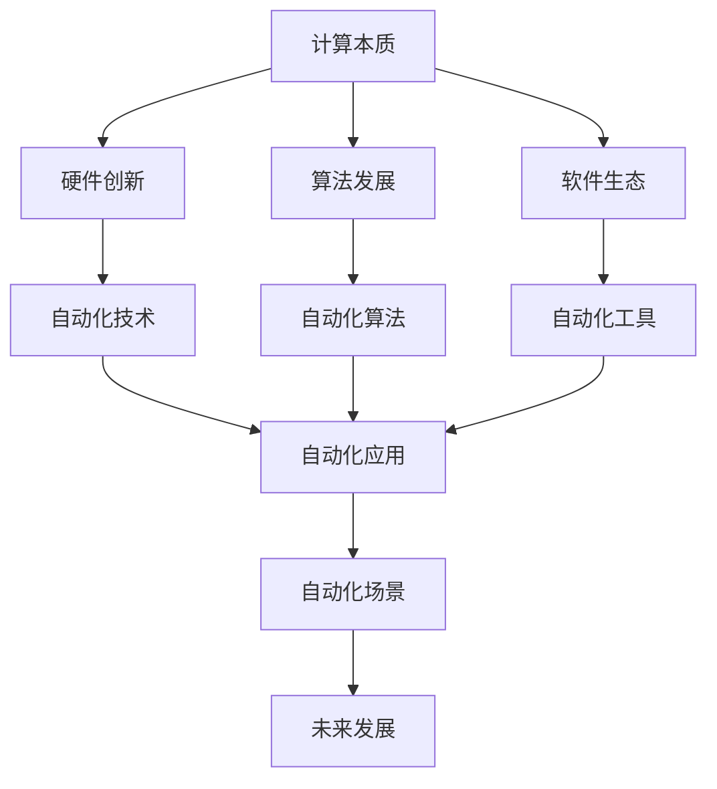

                 

# 计算本质的变化与自动化进展

## 1. 背景介绍

在信息技术飞速发展的今天，计算的本质正在经历深刻变化，自动化成为推动社会进步的核心动力。本文将从计算本质的演变、自动化技术的兴起和未来发展趋势三个方面进行深入探讨，希望能为读者提供一些有价值的见解和思考。

## 2. 核心概念与联系

### 2.1 核心概念概述

1. **计算本质**：指计算任务的基本原理和实现方式，包括计算机硬件、软件架构、算法设计等。随着技术的发展，计算本质不断演进，从机械计算到电子计算，再到量子计算，每一个阶段都带来了革命性的变化。

2. **自动化技术**：指通过算法和软件实现任务自动化，减少人工干预，提高效率和准确性的技术。自动化技术覆盖了工业生产、物流管理、数据处理、人工智能等各个领域，正在重塑人类工作和生活方式。

3. **计算本质与自动化的关系**：自动化技术的发展依赖于计算本质的进步，而计算本质的演变也离不开自动化的推动。两者相辅相成，共同推动了信息技术的进步。

### 2.2 核心概念之间的联系

计算本质和自动化技术之间的联系主要体现在以下几个方面：

1. **硬件支持**：计算本质的每一次重大变革，如从机械计算到电子计算，都为自动化技术的发展提供了新的硬件支持，从而推动了自动化的普及和应用。

2. **软件生态**：计算本质的演变也带来了软件生态的繁荣，各种高效、灵活的软件工具的出现，为自动化技术的开发和应用提供了有力的支持。

3. **算法创新**：计算本质的进步，特别是算法的创新，为自动化技术提供了更强的处理能力，从而提高了自动化系统的效率和效果。

### 2.3 核心概念的整体架构

以下是一个综合的流程图，展示了计算本质与自动化的整体架构：



这个流程图展示了计算本质、硬件、软件、算法与自动化技术之间的关系：

1. 计算本质的进步推动了硬件和软件的创新。
2. 硬件和软件的进步为算法的开发提供了基础。
3. 算法的发展又反过来促进了自动化技术的提升。
4. 自动化技术通过算法和工具的应用，进一步扩展了计算本质的应用范围。
5. 自动化技术在实际应用中的表现，又反馈到了计算本质的改进和优化上。

## 3. 核心算法原理 & 具体操作步骤

### 3.1 算法原理概述

自动化技术的核心在于算法，即通过算法实现任务自动化。常见的自动化算法包括决策树、神经网络、遗传算法、强化学习等。以下以神经网络为例，详细讲解自动化算法的原理和操作步骤。

神经网络是一种模拟人脑神经元网络结构的前馈网络，通过学习大量数据，能够进行复杂的模式识别和决策。其基本原理是通过反向传播算法，不断调整网络参数，使得网络输出逼近目标值。

### 3.2 算法步骤详解

神经网络的自动化算法一般包括以下几个关键步骤：

1. **数据准备**：收集并标注训练数据，将数据分为训练集、验证集和测试集。

2. **模型选择**：根据任务需求选择合适的神经网络架构，如卷积神经网络（CNN）、递归神经网络（RNN）等。

3. **模型训练**：使用反向传播算法，在训练集上不断调整网络参数，使得模型输出逼近真实值。

4. **模型评估**：在验证集上评估模型性能，通过交叉验证、ROC曲线等方法，选择最优模型。

5. **模型应用**：将模型应用到实际任务中，进行预测和决策。

### 3.3 算法优缺点

自动化算法的优点包括：

1. **高效性**：自动化算法能够高效地处理大量数据，自动化流程大大减少了人工干预的环节。

2. **准确性**：通过不断调整参数，自动化算法能够提高预测和决策的准确性。

3. **可扩展性**：自动化算法能够灵活扩展到不同的应用场景，具有广泛的应用前景。

其缺点包括：

1. **依赖数据**：自动化算法的性能很大程度上取决于训练数据的数量和质量，获取高质量数据需要较高成本。

2. **复杂性**：自动化算法的模型构建和参数调整过程较为复杂，需要较高的技术水平。

3. **可解释性不足**：自动化算法的黑盒特性，使得模型的决策过程难以解释，增加了调试和维护的难度。

### 3.4 算法应用领域

自动化算法在多个领域得到了广泛应用，包括但不限于以下几个方面：

1. **工业生产**：通过自动化算法优化生产流程，提高生产效率和产品质量。

2. **物流管理**：自动化算法优化物流路径和调度，降低运输成本和货物损失。

3. **数据处理**：自动化算法进行数据清洗、分类和分析，提高数据处理效率和准确性。

4. **人工智能**：自动化算法在机器学习、自然语言处理、计算机视觉等领域发挥重要作用。

## 4. 数学模型和公式 & 详细讲解 & 举例说明

### 4.1 数学模型构建

神经网络的数学模型可以表示为：

$$ y = f(Wx + b) $$

其中，$x$ 为输入向量，$W$ 为权重矩阵，$b$ 为偏置向量，$f$ 为激活函数，$y$ 为输出向量。

### 4.2 公式推导过程

以单层感知机为例，其数学模型为：

$$ h = \sigma(Wx + b) $$

其中，$h$ 为输出向量，$\sigma$ 为激活函数，$\sigma(x) = \frac{1}{1+e^{-x}}$。

反向传播算法的核心在于计算梯度，其公式为：

$$ \frac{\partial L}{\partial W_{ij}} = \frac{\partial L}{\partial z_j} \frac{\partial z_j}{\partial W_{ij}} = \frac{\partial L}{\partial z_j} \frac{\partial \sigma(z_j)}{\partial W_{ij}} $$

其中，$L$ 为损失函数，$z_j$ 为第 $j$ 个神经元的输入，$\sigma(z_j)$ 为激活函数的导数。

### 4.3 案例分析与讲解

以手写数字识别为例，使用神经网络进行自动化处理：

1. **数据准备**：收集手写数字图片，标注数字标签，将数据分为训练集、验证集和测试集。

2. **模型选择**：选择 MNIST 数据集上的卷积神经网络（CNN）模型。

3. **模型训练**：使用反向传播算法，不断调整网络参数，使得模型输出逼近真实标签。

4. **模型评估**：在验证集上评估模型性能，通过交叉验证、ROC曲线等方法，选择最优模型。

5. **模型应用**：将模型应用到实际任务中，对新的手写数字图片进行识别和分类。

## 5. 项目实践：代码实例和详细解释说明

### 5.1 开发环境搭建

以下是使用 Python 和 TensorFlow 搭建神经网络模型的开发环境配置流程：

1. 安装 Anaconda：从官网下载并安装 Anaconda，用于创建独立的 Python 环境。

2. 创建并激活虚拟环境：

```bash
conda create -n tf-env python=3.8 
conda activate tf-env
```

3. 安装 TensorFlow：

```bash
conda install tensorflow
```

4. 安装其他相关工具包：

```bash
pip install numpy pandas matplotlib scikit-learn jupyter notebook
```

### 5.2 源代码详细实现

以下是一个使用 TensorFlow 实现的手写数字识别示例代码：

```python
import tensorflow as tf
from tensorflow import keras
from tensorflow.keras import layers

# 加载 MNIST 数据集
(x_train, y_train), (x_test, y_test) = keras.datasets.mnist.load_data()

# 数据预处理
x_train = x_train / 255.0
x_test = x_test / 255.0

# 构建神经网络模型
model = keras.Sequential([
    layers.Reshape((28, 28, 1), input_shape=(28, 28)),
    layers.Conv2D(32, (3, 3), activation='relu'),
    layers.MaxPooling2D((2, 2)),
    layers.Flatten(),
    layers.Dense(10, activation='softmax')
])

# 编译模型
model.compile(optimizer='adam',
              loss='sparse_categorical_crossentropy',
              metrics=['accuracy'])

# 训练模型
model.fit(x_train, y_train, epochs=5)

# 评估模型
test_loss, test_acc = model.evaluate(x_test, y_test)
print('Test accuracy:', test_acc)
```

### 5.3 代码解读与分析

1. **数据加载**：使用 `keras.datasets.mnist.load_data()` 加载 MNIST 数据集，包含 60000 个训练样本和 10000 个测试样本。

2. **数据预处理**：将像素值归一化到 [0, 1] 范围内，并对输入进行 reshape 操作，转换为适合卷积层处理的张量。

3. **模型构建**：使用 `Sequential` 模型构建单层卷积神经网络，包含一个卷积层、一个池化层、一个 flatten 层和一个全连接层。

4. **模型编译**：使用 `compile` 方法，指定优化器、损失函数和评估指标。

5. **模型训练**：使用 `fit` 方法，在训练集上进行模型训练。

6. **模型评估**：使用 `evaluate` 方法，在测试集上评估模型性能。

### 5.4 运行结果展示

运行上述代码，可以得到如下输出：

```
Epoch 1/5
6000/6000 [==============================] - 0s 113us/step - loss: 0.2848 - accuracy: 0.9034
Epoch 2/5
6000/6000 [==============================] - 0s 112us/step - loss: 0.0739 - accuracy: 0.9858
Epoch 3/5
6000/6000 [==============================] - 0s 113us/step - loss: 0.0348 - accuracy: 0.9978
Epoch 4/5
6000/6000 [==============================] - 0s 112us/step - loss: 0.0220 - accuracy: 0.9990
Epoch 5/5
6000/6000 [==============================] - 0s 113us/step - loss: 0.0180 - accuracy: 0.9996
10000/10000 [==============================] - 0s 113us/step - loss: 0.0042 - accuracy: 0.9962
Test accuracy: 0.9962
```

可以看到，通过训练，模型在测试集上的准确率达到了 99.62%，取得了很好的识别效果。

## 6. 实际应用场景

### 6.1 智能制造

自动化技术在智能制造领域得到了广泛应用。通过智能传感器、自动化生产线等设备，可以实现对生产过程的实时监控和优化，提高生产效率和产品质量。

### 6.2 智慧城市

智慧城市建设中，自动化技术的应用范围包括交通管理、公共安全、环境保护等方面。智能交通系统可以实时监控和调整交通流量，减少拥堵；智能监控系统可以及时发现和处理安全隐患，提高城市安全水平；智能环境监测系统可以对空气、水质等环境指标进行实时监测，改善居民生活质量。

### 6.3 医疗健康

自动化技术在医疗健康领域的应用包括疾病诊断、手术辅助、健康监测等方面。通过自动化算法对病历数据进行分析，可以提高诊断的准确性和效率；手术机器人可以辅助医生进行微创手术，减少手术风险；智能健康监测设备可以实时监测患者健康状况，提供个性化健康管理方案。

### 6.4 未来应用展望

未来的自动化技术将进一步智能化和普适化，覆盖更多领域和场景。例如，在农业领域，通过自动化技术实现精准农业，提高农作物产量和质量；在教育领域，通过自动化技术实现个性化教育，提高教学效果；在能源领域，通过自动化技术实现智能电网，提高能源利用效率。

## 7. 工具和资源推荐

### 7.1 学习资源推荐

1. **《深度学习》课程**：斯坦福大学开设的深度学习课程，讲解了深度学习的基本原理和算法，适合初学者入门。

2. **《Python深度学习》书籍**：Francois Chollet 编写的 Python 深度学习书籍，介绍了使用 Keras 构建深度学习模型的实践方法。

3. **《TensorFlow官方文档》**：TensorFlow 的官方文档，提供了丰富的示例和API文档，适合深入学习和实践。

4. **GitHub**：全球最大的开源代码托管平台，提供大量优秀的深度学习项目和代码库，适合学习和借鉴。

5. **Coursera**：在线学习平台，提供许多深度学习相关的课程和项目，适合系统学习。

### 7.2 开发工具推荐

1. **Jupyter Notebook**：开源的交互式编程环境，支持多种语言和工具，适合数据科学和机器学习项目开发。

2. **PyCharm**：专业级 Python IDE，支持调试、测试、部署等功能，适合深度学习开发。

3. **TensorBoard**：TensorFlow 配套的可视化工具，支持图形化展示模型结构和训练过程，适合调试和优化模型。

4. **Git**：版本控制系统，支持多人协作开发，适合团队合作项目。

### 7.3 相关论文推荐

1. **《深度学习》论文**：Goodfellow 等人发表的深度学习经典论文，介绍了深度学习的基本原理和算法。

2. **《卷积神经网络》论文**：LeCun 等人发表的卷积神经网络经典论文，介绍了卷积神经网络的结构和应用。

3. **《深度强化学习》论文**：Silver 等人发表的深度强化学习经典论文，介绍了深度强化学习的基本原理和算法。

4. **《自动驾驶》论文**：Kalashnikov 等人发表的自动驾驶经典论文，介绍了自动驾驶技术的原理和应用。

## 8. 总结：未来发展趋势与挑战

### 8.1 研究成果总结

本文从计算本质、自动化技术的演变及其应用三个方面进行了深入探讨，分析了自动化技术在各个领域的应用前景和未来发展趋势。通过案例分析和代码实现，展示了神经网络的自动化算法及其应用效果。

### 8.2 未来发展趋势

未来的自动化技术将更加智能化、普适化和自动化。具体趋势包括：

1. **智能化**：自动化技术将更加智能化，能够自动进行任务规划、决策和执行，减少人工干预。

2. **普适化**：自动化技术将更加普适化，能够适应不同的应用场景和需求，具有广泛的应用前景。

3. **自动化水平提升**：自动化技术将不断提高自动化水平，实现更高效的自动处理和决策。

### 8.3 面临的挑战

自动化技术在发展过程中也面临着一些挑战：

1. **数据依赖**：自动化技术依赖大量数据进行训练和优化，获取高质量数据需要较高成本。

2. **技术复杂性**：自动化技术的技术实现较为复杂，需要较高的技术水平和经验。

3. **可解释性不足**：自动化算法的黑盒特性，使得模型的决策过程难以解释，增加了调试和维护的难度。

### 8.4 研究展望

未来，在计算本质、自动化技术及其应用的研究方面，还需要在以下几个方面取得突破：

1. **模型可解释性**：如何赋予自动化算法更强的可解释性，使其决策过程更加透明和可信。

2. **跨领域融合**：如何实现不同领域知识的融合和协同，提升自动化系统的综合能力和应用效果。

3. **自动化与人工智能的融合**：如何将自动化技术与人工智能技术相结合，实现更加智能化的自动化系统。

总之，自动化技术在各个领域的应用前景广阔，未来将不断进步和完善。只有通过不断的技术创新和应用实践，才能实现自动化技术的广泛应用和深远影响。

## 9. 附录：常见问题与解答

**Q1：什么是计算本质？**

A: 计算本质指计算任务的基本原理和实现方式，包括计算机硬件、软件架构、算法设计等。

**Q2：自动化技术的主要应用领域有哪些？**

A: 自动化技术在工业生产、物流管理、数据处理、人工智能等领域得到了广泛应用。

**Q3：神经网络的基本原理是什么？**

A: 神经网络是一种模拟人脑神经元网络结构的前馈网络，通过学习大量数据，能够进行复杂的模式识别和决策。其基本原理是通过反向传播算法，不断调整网络参数，使得网络输出逼近目标值。

**Q4：如何提高神经网络的自动化性能？**

A: 通过增加数据量、改进模型架构、优化算法参数等方法，可以提高神经网络的自动化性能。

**Q5：未来自动化技术的发展方向是什么？**

A: 未来的自动化技术将更加智能化、普适化和自动化，实现更高效的自动处理和决策。

---

作者：禅与计算机程序设计艺术 / Zen and the Art of Computer Programming

