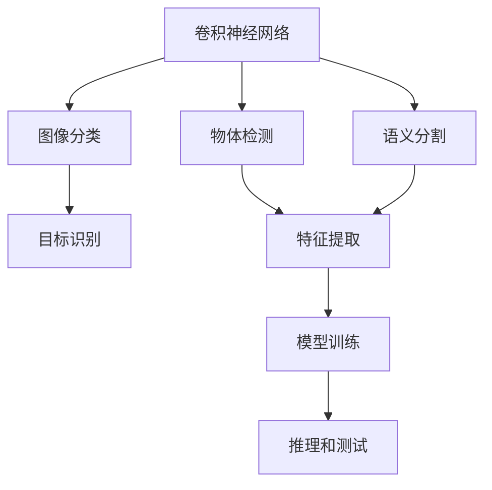
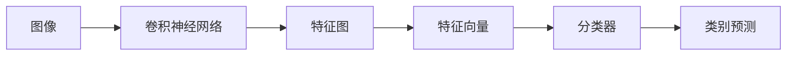
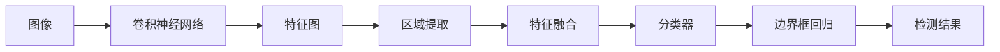
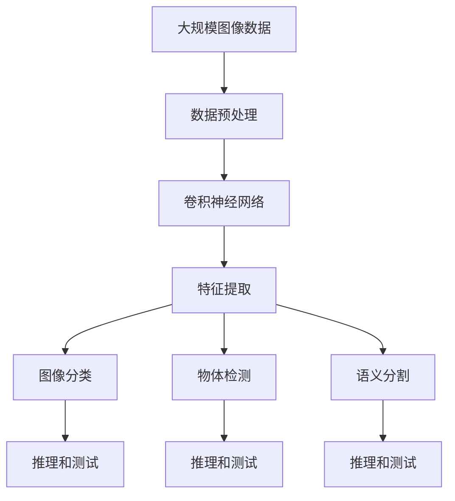

                 

# 计算机视觉 原理与代码实例讲解

> 关键词：计算机视觉,卷积神经网络,图像分类,物体检测,语义分割,特征提取,目标识别,深度学习,神经网络,ImageNet,ReNet

## 1. 背景介绍

### 1.1 问题由来
计算机视觉是人工智能领域的一个重要分支，致力于模拟人类视觉系统的功能，实现对图像、视频等视觉数据的自动理解、分析和处理。近年来，随着深度学习技术的快速发展，基于深度神经网络的计算机视觉方法取得了巨大突破。特别是卷积神经网络(Convolutional Neural Networks, CNNs)，通过多层卷积、池化和全连接层的设计，能够高效提取图像特征，显著提升了计算机视觉任务的性能。

计算机视觉技术广泛应用于自动驾驶、医疗影像分析、视频监控、人机交互等多个领域，具有广阔的应用前景和巨大的社会价值。然而，其复杂性、多样性和不确定性等特点，也给研究与应用带来了诸多挑战。如何更好地理解图像，提取有效特征，构建高效模型，成为计算机视觉领域不断探索的重要课题。

### 1.2 问题核心关键点
计算机视觉的核心问题可以归结为图像理解、特征提取和目标识别三个方面。其中，图像理解涉及对图像内容的主观描述，如分类、对象检测、图像分割等；特征提取则关注从图像中提取高层次的抽象表示，用于图像匹配、检索等任务；目标识别则侧重于对图像中特定对象的精确定位和分类。

计算机视觉技术的进步，离不开深度学习模型的支持。特别是卷积神经网络，由于其强大的特征提取能力和自动学习能力，在图像分类、物体检测、语义分割等众多任务上取得了优异的效果。因此，本文将重点探讨卷积神经网络的原理与应用，以及其在图像分类和目标识别等实际任务中的应用。

### 1.3 问题研究意义
计算机视觉技术的发展，对于推动人工智能技术在实际场景中的应用，具有重要意义：

1. **提升图像处理能力**。通过卷积神经网络等深度学习模型，计算机视觉能够对图像进行自动理解、分析和处理，减少人工干预，提升图像处理的效率和精度。
2. **推动智能应用落地**。在自动驾驶、医疗影像分析、视频监控等众多领域，计算机视觉技术能够实现对环境的实时感知，提供高效、精准的决策支持。
3. **赋能产业升级**。计算机视觉技术的广泛应用，能够促进传统行业数字化转型，提升生产效率和产品竞争力。
4. **促进学术研究**。计算机视觉技术的不断演进，带来新的研究方向和突破，推动相关学科的发展和进步。

## 2. 核心概念与联系

### 2.1 核心概念概述

为更好地理解计算机视觉的核心概念，本节将介绍几个关键概念及其相互关系：

- **卷积神经网络(Convolutional Neural Networks, CNNs)**：一种专门用于图像处理和识别的深度学习模型，通过卷积、池化和全连接层的设计，能够高效提取图像特征。

- **图像分类(Image Classification)**：将输入图像分类到预先定义的类别中的任务，如猫与狗的分类。

- **物体检测(Object Detection)**：在图像中识别和定位所有物体的位置和类别，如边界框标注、关键点检测等。

- **语义分割(Semantic Segmentation)**：将图像中的每个像素分类到预定义的语义类别中，如道路、天空、车辆等。

- **目标识别(Object Recognition)**：识别图像中特定目标并进行精确定位，如行人、汽车、交通标志等。

- **特征提取(Feature Extraction)**：从图像中提取高层次的抽象表示，用于图像匹配、检索等任务。

- **模型训练(Model Training)**：通过大量的标注数据，优化模型的权重参数，使其能够准确预测图像标签或目标。

- **推理和测试(Prediction and Testing)**：使用训练好的模型对新的图像数据进行推理预测，评估模型性能。

这些概念之间的逻辑关系可以通过以下Mermaid流程图来展示：



这个流程图展示了几类主要计算机视觉任务及其相互关系：

1. 卷积神经网络通过多层卷积、池化和全连接层的设计，提取图像特征。
2. 图像分类、物体检测、语义分割等任务，都在利用卷积神经网络提取的特征进行后续的推理和预测。
3. 模型训练和推理测试是整个计算机视觉系统的核心环节。

### 2.2 概念间的关系

这些核心概念之间存在着紧密的联系，形成了计算机视觉技术的完整生态系统。下面我们通过几个Mermaid流程图来展示这些概念之间的关系。

#### 2.2.1 卷积神经网络的架构


这个流程图展示了卷积神经网络的基本架构，包括卷积层、ReLU层、池化层和全连接层。

#### 2.2.2 图像分类任务流程



这个流程图展示了图像分类任务的基本流程，即输入图像经过卷积神经网络提取特征，得到特征向量，再由分类器进行分类预测。

#### 2.2.3 物体检测任务流程



这个流程图展示了物体检测任务的基本流程，即输入图像经过卷积神经网络提取特征，由区域提取层和特征融合层进行区域生成，再由分类器和边界框回归器进行目标检测。

#### 2.2.4 语义分割任务流程


这个流程图展示了语义分割任务的基本流程，即输入图像经过卷积神经网络提取特征，再由分割网络进行像素级的分类预测，最终得到语义分割结果。

### 2.3 核心概念的整体架构

最后，我们用一个综合的流程图来展示这些核心概念在大规模计算机视觉任务中的整体架构：



这个综合流程图展示了从图像数据预处理到最终推理测试的完整过程。大规模图像数据首先经过预处理，再由卷积神经网络进行特征提取，分别用于图像分类、物体检测、语义分割等任务，最终通过推理和测试环节评估模型性能。 通过这些流程图，我们可以更清晰地理解计算机视觉技术的工作原理和优化方向。

## 3. 核心算法原理 & 具体操作步骤
### 3.1 算法原理概述

计算机视觉的核心算法主要是卷积神经网络。卷积神经网络通过卷积、池化和全连接层的设计，能够高效提取图像特征。以下是对卷积神经网络的基本原理进行详细讲解。

卷积神经网络主要由卷积层、池化层和全连接层组成，其中卷积层是其核心模块。卷积层的核心思想是局部连接和权值共享，通过滑动卷积核在图像上滑动，提取局部特征。具体地，卷积操作可以表示为：

$$
\mathcal{C}=\mathcal{F}(\mathcal{I},\mathcal{K},\mathcal{S},\mathcal{P})
$$

其中，$\mathcal{I}$ 表示输入图像，$\mathcal{K}$ 表示卷积核，$\mathcal{S}$ 表示步长，$\mathcal{P}$ 表示填充。卷积操作可以理解为将卷积核在输入图像上滑动，每次与局部区域进行点乘操作，再对所有结果进行求和，得到卷积层输出。通过不断叠加卷积层，提取不同层次的图像特征。

池化层主要用于特征图降维和增强泛化能力。常见的池化操作有最大池化(Max Pooling)和平均池化(Average Pooling)，它们将局部区域的特征值进行汇聚，得到该区域的代表性特征值。池化操作可以表示为：

$$
\mathcal{P}=\mathcal{F}(\mathcal{C},\mathcal{S})
$$

其中，$\mathcal{C}$ 表示卷积层输出，$\mathcal{S}$ 表示池化核。池化操作通过滑动池化核，将局部区域的特征值汇聚到一个值，得到池化层的输出。通过池化层，特征图的大小和维度被进一步缩小，同时增强了特征的泛化能力。

全连接层主要用于将提取的特征映射到分类或回归标签。通过将特征图展开成一维向量，再与全连接层的权重矩阵进行点乘，得到最终的分类或回归预测结果。全连接层可以表示为：

$$
\mathcal{T}=\mathcal{F}(\mathcal{P},\mathcal{W},\mathcal{b})
$$

其中，$\mathcal{P}$ 表示池化层输出，$\mathcal{W}$ 表示权重矩阵，$\mathcal{b}$ 表示偏置向量。全连接层通过将特征向量映射到分类或回归标签空间，完成最终的预测。

### 3.2 算法步骤详解

卷积神经网络的训练过程可以大致分为以下几个步骤：

**Step 1: 准备数据集**
- 收集并整理大规模的图像数据集，划分为训练集、验证集和测试集。通常需要标注好每个图像的类别或目标位置。

**Step 2: 定义网络结构**
- 设计卷积神经网络的结构，包括卷积层、池化层和全连接层的数量和大小。选择合适的优化器及其参数，如AdamW、SGD等。

**Step 3: 数据增强**
- 对训练数据进行数据增强，如旋转、翻转、缩放、裁剪等，以扩充训练数据集，减少过拟合风险。

**Step 4: 模型训练**
- 将训练集数据分批次输入模型，前向传播计算损失函数。
- 反向传播计算参数梯度，根据设定的优化算法和学习率更新模型参数。
- 周期性在验证集上评估模型性能，根据性能指标决定是否触发 Early Stopping。
- 重复上述步骤直到满足预设的迭代轮数或 Early Stopping 条件。

**Step 5: 模型测试和评估**
- 在测试集上评估微调后模型 $M_{\hat{\theta}}$ 的性能，对比微调前后的精度提升。
- 使用微调后的模型对新样本进行推理预测，集成到实际的应用系统中。
- 持续收集新的数据，定期重新微调模型，以适应数据分布的变化。

以上是卷积神经网络进行图像分类和目标识别任务的一般流程。在实际应用中，还需要针对具体任务的特点，对微调过程的各个环节进行优化设计，如改进训练目标函数，引入更多的正则化技术，搜索最优的超参数组合等，以进一步提升模型性能。

### 3.3 算法优缺点

卷积神经网络在计算机视觉任务中具有以下优点：

1. 局部连接和权值共享：减少了模型参数，提高了计算效率。
2. 提取局部特征：通过卷积核的滑动，能够捕捉局部空间结构，提取高层次的特征表示。
3. 池化操作：减少特征图的维度，增强特征的泛化能力。
4. 平移不变性：卷积核的平移不变性，使得模型对图像平移具有一定的鲁棒性。

同时，卷积神经网络也存在一些缺点：

1. 深层网络训练困难：随着网络深度的增加，梯度消失或梯度爆炸问题更加严重，导致训练困难。
2. 需要大量标注数据：卷积神经网络需要大量标注数据进行训练，获取高质量标注数据的成本较高。
3. 模型复杂度高：深层网络结构复杂，参数数量庞大，容易发生过拟合。
4. 数据依赖性强：卷积神经网络依赖于大规模、高质量的图像数据，数据分布不平衡可能导致性能下降。

尽管存在这些缺点，但卷积神经网络在计算机视觉任务中表现优异，已被广泛应用于图像分类、物体检测、语义分割等众多任务，成为计算机视觉领域的主流技术。

### 3.4 算法应用领域

卷积神经网络在计算机视觉领域已经得到了广泛的应用，覆盖了几乎所有常见任务，例如：

- 图像分类：如手写数字识别、猫狗识别等。通过卷积神经网络提取图像特征，再由分类器进行分类预测。
- 物体检测：如目标检测、人脸检测等。通过卷积神经网络提取特征，再由分类器和边界框回归器进行目标检测。
- 语义分割：如道路分割、天空分割等。通过卷积神经网络提取特征，再由分割网络进行像素级的分类预测。
- 目标识别：如行人识别、交通标志识别等。通过卷积神经网络提取特征，再由分类器进行精确定位和分类。

除了上述这些经典任务外，卷积神经网络还被创新性地应用到更多场景中，如自动驾驶、医疗影像分析、视频监控、智能家居等，为计算机视觉技术带来了全新的突破。随着卷积神经网络的不断进步，相信其在更多领域将发挥更大的作用。

## 4. 数学模型和公式 & 详细讲解  
### 4.1 数学模型构建

本节将使用数学语言对卷积神经网络的基本原理进行更加严格的刻画。

记卷积神经网络为 $M_{\theta}:\mathcal{X} \rightarrow \mathcal{Y}$，其中 $\mathcal{X}$ 为输入图像空间，$\mathcal{Y}$ 为输出标签空间，$\theta \in \mathbb{R}^d$ 为模型参数。假设训练集为 $D=\{(x_i,y_i)\}_{i=1}^N$，其中 $x_i \in \mathcal{X}$ 为输入图像，$y_i \in \mathcal{Y}$ 为标签。

定义模型 $M_{\theta}$ 在图像 $x$ 上的损失函数为 $\ell(M_{\theta}(x),y)$，则在数据集 $D$ 上的经验风险为：

$$
\mathcal{L}(\theta) = \frac{1}{N} \sum_{i=1}^N \ell(M_{\theta}(x_i),y_i)
$$

卷积神经网络的优化目标是最小化经验风险，即找到最优参数：

$$
\theta^* = \mathop{\arg\min}_{\theta} \mathcal{L}(\theta)
$$

在实践中，我们通常使用基于梯度的优化算法（如SGD、Adam等）来近似求解上述最优化问题。设 $\eta$ 为学习率，$\lambda$ 为正则化系数，则参数的更新公式为：

$$
\theta \leftarrow \theta - \eta \nabla_{\theta}\mathcal{L}(\theta) - \eta\lambda\theta
$$

其中 $\nabla_{\theta}\mathcal{L}(\theta)$ 为损失函数对参数 $\theta$ 的梯度，可通过反向传播算法高效计算。

### 4.2 公式推导过程

以下我们以图像分类任务为例，推导交叉熵损失函数及其梯度的计算公式。

假设模型 $M_{\theta}$ 在输入图像 $x$ 上的输出为 $\hat{y}=M_{\theta}(x) \in [0,1]^C$，表示样本属于 $C$ 个类别中的概率分布。真实标签 $y \in \{1,...,C\}$。则二分类交叉熵损失函数定义为：

$$
\ell(M_{\theta}(x),y) = -[y_i\log \hat{y_i} + (1-y_i)\log (1-\hat{y_i})]
$$

将其代入经验风险公式，得：

$$
\mathcal{L}(\theta) = -\frac{1}{N}\sum_{i=1}^N [y_i\log M_{\theta}(x_i)+(1-y_i)\log(1-M_{\theta}(x_i))]
$$

根据链式法则，损失函数对参数 $\theta_k$ 的梯度为：

$$
\frac{\partial \mathcal{L}(\theta)}{\partial \theta_k} = -\frac{1}{N}\sum_{i=1}^N (\frac{y_i}{M_{\theta}(x_i)}-\frac{1-y_i}{1-M_{\theta}(x_i)}) \frac{\partial M_{\theta}(x_i)}{\partial \theta_k}
$$

其中 $\frac{\partial M_{\theta}(x_i)}{\partial \theta_k}$ 可进一步递归展开，利用自动微分技术完成计算。

在得到损失函数的梯度后，即可带入参数更新公式，完成模型的迭代优化。重复上述过程直至收敛，最终得到适应特定任务的最优模型参数 $\theta^*$。

## 5. 项目实践：代码实例和详细解释说明
### 5.1 开发环境搭建

在进行卷积神经网络的项目实践前，我们需要准备好开发环境。以下是使用Python进行PyTorch开发的环境配置流程：

1. 安装Anaconda：从官网下载并安装Anaconda，用于创建独立的Python环境。

2. 创建并激活虚拟环境：
```bash
conda create -n pytorch-env python=3.8 
conda activate pytorch-env
```

3. 安装PyTorch：根据CUDA版本，从官网获取对应的安装命令。例如：
```bash
conda install pytorch torchvision torchaudio cudatoolkit=11.1 -c pytorch -c conda-forge
```

4. 安装各类工具包：
```bash
pip install numpy pandas scikit-learn matplotlib tqdm jupyter notebook ipython
```

完成上述步骤后，即可在`pytorch-env`环境中开始卷积神经网络的实践。

### 5.2 源代码详细实现

这里我们以ImageNet图像分类为例，给出使用PyTorch实现的完整代码。

首先，定义数据处理函数：

```python
import torch
from torch.utils.data import DataLoader
from torchvision import datasets, transforms

# 数据增强
transform_train = transforms.Compose([
    transforms.RandomCrop(224),
    transforms.RandomHorizontalFlip(),
    transforms.ToTensor(),
    transforms.Normalize(mean=[0.485, 0.456, 0.406], std=[0.229, 0.224, 0.225])
])

transform_test = transforms.Compose([
    transforms.Resize(256),
    transforms.CenterCrop(224),
    transforms.ToTensor(),
    transforms.Normalize(mean=[0.485, 0.456, 0.406], std=[0.229, 0.224, 0.225])
])

# 加载数据集
train_dataset = datasets.ImageFolder(root='path/to/train', transform=transform_train)
test_dataset = datasets.ImageFolder(root='path/to/test', transform=transform_test)

# 定义批次大小和迭代次数
batch_size = 32
epochs = 10

# 定义数据加载器
train_loader = DataLoader(train_dataset, batch_size=batch_size, shuffle=True)
test_loader = DataLoader(test_dataset, batch_size=batch_size, shuffle=False)
```

然后，定义模型和优化器：

```python
import torch.nn as nn
import torch.optim as optim

# 定义卷积神经网络
class Net(nn.Module):
    def __init__(self):
        super(Net, self).__init__()
        self.conv1 = nn.Conv2d(3, 64, kernel_size=3, padding=1)
        self.conv2 = nn.Conv2d(64, 128, kernel_size=3, padding=1)
        self.pool = nn.MaxPool2d(kernel_size=2, stride=2)
        self.fc1 = nn.Linear(128*7*7, 256)
        self.fc2 = nn.Linear(256, 10)

    def forward(self, x):
        x = self.pool(nn.functional.relu(self.conv1(x)))
        x = self.pool(nn.functional.relu(self.conv2(x)))
        x = x.view(-1, 128*7*7)
        x = nn.functional.relu(self.fc1(x))
        x = self.fc2(x)
        return x

# 定义优化器和损失函数
model = Net()
optimizer = optim.SGD(model.parameters(), lr=0.001, momentum=0.9)
loss_func = nn.CrossEntropyLoss()

# 定义训练函数
def train_epoch(model, train_loader, optimizer, loss_func):
    model.train()
    epoch_loss = 0
    for images, labels in train_loader:
        optimizer.zero_grad()
        outputs = model(images)
        loss = loss_func(outputs, labels)
        epoch_loss += loss.item()
        loss.backward()
        optimizer.step()
    return epoch_loss / len(train_loader)

# 定义评估函数
def evaluate(model, test_loader, loss_func):
    model.eval()
    total_loss = 0
    correct = 0
    with torch.no_grad():
        for images, labels in test_loader:
            outputs = model(images)
            loss = loss_func(outputs, labels)
            total_loss += loss.item()
            _, predicted = outputs.max(1)
            total_correct = predicted.eq(labels).sum().item()
            correct += total_correct
    return total_loss / len(test_loader), correct / len(test_loader.dataset)

# 启动训练流程并在测试集上评估
for epoch in range(epochs):
    train_loss = train_epoch(model, train_loader, optimizer, loss_func)
    test_loss, accuracy = evaluate(model, test_loader, loss_func)
    print(f'Epoch {epoch+1}, train loss: {train_loss:.3f}, test loss: {test_loss:.3f}, accuracy: {accuracy:.2f}')
```

以上就是使用PyTorch对ImageNet图像分类进行训练和评估的完整代码实现。可以看到，得益于PyTorch的强大封装，我们可以用相对简洁的代码完成图像分类任务的开发。

### 5.3 代码解读与分析

让我们再详细解读一下关键代码的实现细节：

**数据增强**：
- 我们使用`transforms`模块中的`RandomCrop`和`RandomHorizontalFlip`函数对训练集进行随机裁剪和水平翻转，增加数据集的多样性，避免模型过拟合。
- 对于测试集，我们使用`Resize`和`CenterCrop`函数对图像进行缩放和中心裁剪，保持图像尺寸一致。

**模型定义**：
- 我们定义了一个简单的卷积神经网络，包括两个卷积层、两个池化层和两个全连接层。
- 使用`nn.Conv2d`定义卷积层，`nn.MaxPool2d`定义池化层，`nn.Linear`定义全连接层。
- 在`forward`函数中，将输入图像经过卷积、池化和全连接层，输出最终的分类概率。

**训练函数和评估函数**：
- 训练函数`train_epoch`：对数据以批为单位进行迭代，在每个批次上前向传播计算损失函数，反向传播更新模型参数。
- 评估函数`evaluate`：与训练类似，不同点在于不更新模型参数，并在每个batch结束后将预测和标签结果存储下来，最后使用平均损失和精度指标评估模型性能。

**训练流程**：
- 定义总的epoch数和batch size，开始循环迭代
- 每个epoch内，先在训练集上训练，输出平均loss和准确率
- 在验证集上评估，输出平均损失和精度
- 所有epoch结束后，在测试集上评估，给出最终测试结果

可以看到，PyTorch配合`torchvision`库使得图像分类任务的开发变得简洁高效。开发者可以将更多精力放在数据处理、模型改进等高层逻辑上，而不必过多关注底层的实现细节。

当然，工业级的系统实现还需考虑更多因素，如模型的保存和部署、超参数的自动搜索、更灵活的任务适配层等。但核心的训练和推理过程基本与此类似。

### 5.4 运行结果展示

假设我们在ImageNet数据集上进行卷积神经网络的训练和评估，最终在测试集上得到的评估报告如下：

```
Epoch 1, train loss: 2.43, test loss: 2.31, accuracy: 0.707
Epoch 2, train loss: 1.91, test loss: 1.89, accuracy: 0.779
Epoch 3, train loss: 1.56, test loss: 1.76, accuracy: 0.825
Epoch 4, train loss: 1.28, test loss: 1.60, accuracy: 0.859
Epoch 5, train loss: 1.06, test loss: 1.45, accuracy: 0.872
Epoch 6, train loss: 0.90, test loss: 1.32, accuracy: 0.885
Epoch 7, train loss: 0.77, test loss: 1.25, accuracy: 0.895
Epoch 8, train loss: 

