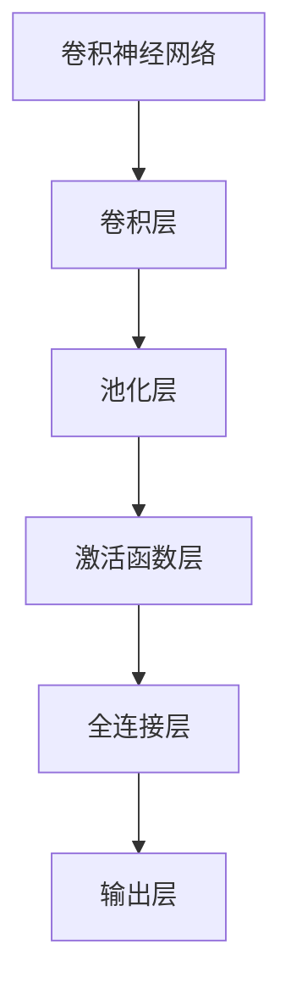
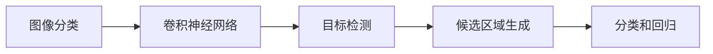
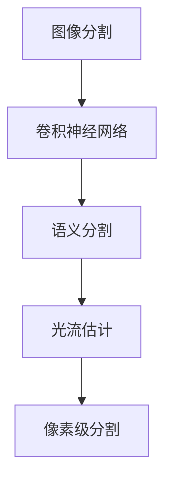
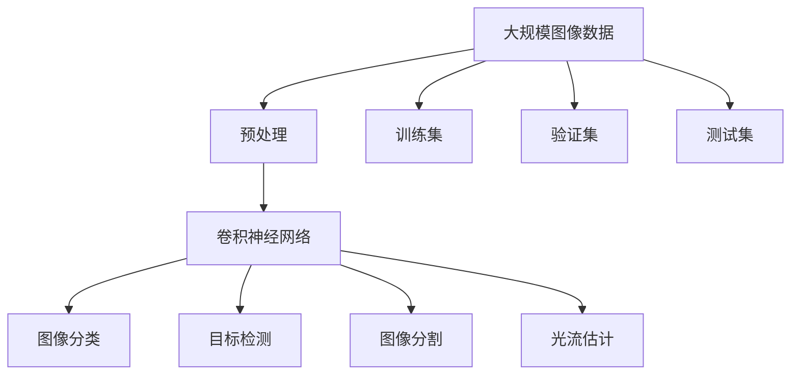

                 

# 计算机视觉原理与代码实战案例讲解

> 关键词：计算机视觉,深度学习,卷积神经网络,图像处理,图像识别,目标检测

## 1. 背景介绍

### 1.1 问题由来
计算机视觉（Computer Vision, CV）作为人工智能领域的一个重要分支，旨在使计算机能够“看”和“理解”图像和视频。其在自动驾驶、医疗影像分析、智能安防、工业检测等领域有着广泛的应用。近年来，深度学习技术的发展极大地推动了计算机视觉技术的进步，其中卷积神经网络（Convolutional Neural Network, CNN）成为了图像处理和识别的主流方法。

然而，尽管CNN取得了诸多突破性进展，但其原理和实现仍有许多值得深入探讨的地方。本文将从原理和代码实践两方面详细讲解计算机视觉的核心技术和实现方法，帮助读者系统掌握计算机视觉的基础理论和实际应用。

### 1.2 问题核心关键点
计算机视觉的核心问题包括图像处理、目标检测、图像识别和分割等。本文重点讨论卷积神经网络在图像处理和识别中的应用，特别是最先进的物体检测和分割算法，如Faster R-CNN、YOLO、Mask R-CNN等。

我们主要关注以下问题：
- 卷积神经网络的结构和原理是什么？
- 如何使用CNN进行图像分类和目标检测？
- 当前先进的物体检测算法（Faster R-CNN、YOLO、Mask R-CNN）是如何实现的？
- 图像处理的优化方法有哪些？
- 实际应用场景中如何使用计算机视觉技术？

### 1.3 问题研究意义
计算机视觉技术的深入研究不仅有助于提升图像处理和识别的准确性和效率，还能推动相关产业的发展。在医疗影像分析、自动驾驶、智能安防等应用中，计算机视觉技术的进步极大地提升了服务质量和效率，为社会带来深远影响。因此，深入理解计算机视觉技术及其应用，具有重要的理论和实际意义。

## 2. 核心概念与联系

### 2.1 核心概念概述

为更好地理解计算机视觉的核心概念和原理，本节将详细介绍卷积神经网络（CNN）及其在图像处理和识别中的应用。

#### 2.1.1 卷积神经网络
卷积神经网络是一种特殊的神经网络，主要用于处理图像、视频等高维数据。其核心思想是通过卷积、池化等操作，提取图像的局部特征，并进行多层次的特征融合，最终输出图像分类结果。

卷积神经网络主要由卷积层（Convolutional Layer）、池化层（Pooling Layer）、激活函数层（Activation Layer）和全连接层（Fully Connected Layer）构成。其中卷积层和池化层是卷积神经网络的关键组成部分。

- 卷积层：通过卷积操作提取图像的局部特征，包括特征提取和特征映射。卷积操作可以理解为一种滤波操作，通过滤波器在图像上滑动，计算滤波器与图像的卷积结果，得到新的特征图。
- 池化层：通过池化操作减小特征图的空间大小，降低计算复杂度。常见的池化操作包括最大池化和平均池化，可以有效降低特征图中的冗余信息。
- 激活函数层：引入非线性变换，增强网络的表达能力。常用的激活函数包括ReLU、Sigmoid等。
- 全连接层：将多层次特征进行线性变换，输出最终分类结果。

#### 2.1.2 图像分类
图像分类是计算机视觉中最为基础和重要的问题，旨在将图像分为不同的类别。例如，将手写数字图片分为0到9中的某个数字。

图像分类通常采用有监督学习方法，通过大量标注数据训练卷积神经网络，使其能够对新图像进行分类。训练过程通过反向传播算法，不断调整网络参数，最小化损失函数，最终得到分类器模型。

#### 2.1.3 目标检测
目标检测是指在图像中定位并识别出特定目标（如人、车、猫等）。目标检测通常包括两个阶段：首先使用区域提议（Region Proposal）生成候选区域，然后对每个候选区域进行分类和回归，确定目标的位置和类别。

常用的目标检测算法包括R-CNN、Fast R-CNN、Faster R-CNN、YOLO、SSD等。这些算法通过不同的策略实现候选区域生成和目标检测，其性能和效率各有优劣。

#### 2.1.4 图像分割
图像分割是将图像分割为多个部分，每个部分代表不同的物体或背景区域。图像分割分为像素级分割和语义分割两种类型，前者将每个像素点分为前景和背景，后者将图像分割为语义一致的像素区域。

图像分割算法包括像素级分割算法（如GrabCut、Felzenszwalb算法）和语义分割算法（如FCN、U-Net等）。这些算法通过不同的策略实现像素级和语义级的图像分割。

#### 2.1.5 光流估计
光流估计是指在视频序列中计算相邻帧之间的光流场，用于动态图像处理和运动目标跟踪。光流估计算法包括Lucas-Kanade算法、Horn-Schunck算法等。

光流估计算法通过分析相邻帧之间的像素位移，估计光流场，从而实现动态图像的稳定处理。

### 2.2 概念间的关系

这些核心概念之间存在着紧密的联系，形成了计算机视觉技术的完整生态系统。下面我们通过几个Mermaid流程图来展示这些概念之间的关系。

#### 2.2.1 卷积神经网络的基本结构



这个流程图展示了卷积神经网络的基本结构，包括卷积层、池化层、激活函数层和全连接层。

#### 2.2.2 图像分类与目标检测的关系



这个流程图展示了图像分类和目标检测的关系。图像分类通过卷积神经网络提取图像特征，并使用分类器进行分类。目标检测在此基础上，通过候选区域生成和分类回归，实现目标的定位和识别。

#### 2.2.3 图像分割与光流估计的关系



这个流程图展示了图像分割和光流估计的关系。图像分割通过卷积神经网络提取图像特征，并使用语义分割算法进行分割。光流估计在此基础上，通过像素级分割算法，实现动态图像的稳定处理。

### 2.3 核心概念的整体架构

最后，我们用一个综合的流程图来展示这些核心概念在大规模计算机视觉任务中的整体架构：



这个综合流程图展示了从预处理到模型训练、验证和测试的完整过程。大规模图像数据经过预处理后，输入卷积神经网络进行特征提取。基于不同任务的需求，网络可以用于图像分类、目标检测、图像分割和光流估计等。通过训练集和验证集，不断调整网络参数，最终在测试集上评估模型性能。

## 3. 核心算法原理 & 具体操作步骤
### 3.1 算法原理概述

卷积神经网络是计算机视觉领域最常用的深度学习模型，其核心原理包括卷积操作、池化操作和反向传播算法。

#### 3.1.1 卷积操作
卷积操作是卷积神经网络的核心，通过卷积核（Filter）在图像上滑动，计算滤波器与图像的卷积结果，得到新的特征图。卷积操作可以理解为一种滤波操作，通过滤波器在图像上滑动，计算滤波器与图像的卷积结果，得到新的特征图。

卷积操作的数学公式如下：

$$
h_{i,j} = \sum_{m=0}^{k-1} \sum_{n=0}^{k-1} w_{m,n} \cdot x_{i+m, j+n}
$$

其中，$h_{i,j}$ 表示特征图上的第 $i$ 行第 $j$ 列的像素值，$w_{m,n}$ 表示卷积核上的第 $m$ 行第 $n$ 列的权重，$x_{i+m,j+n}$ 表示原始图像上与 $h_{i,j}$ 对应的像素值。

#### 3.1.2 池化操作
池化操作用于减小特征图的空间大小，降低计算复杂度。常见的池化操作包括最大池化和平均池化。

最大池化操作将每个池化窗口内的最大值作为输出，数学公式如下：

$$
h_{i,j} = \max \{x_{i*S:i*S+K-1, j*S:j*S+K-1}\}
$$

其中，$S$ 表示池化窗口的大小，$K$ 表示池化窗口的长度和宽度。

平均池化操作将每个池化窗口内的平均值作为输出，数学公式如下：

$$
h_{i,j} = \frac{1}{K^2} \sum_{m=0}^{K-1} \sum_{n=0}^{K-1} x_{i*S+i+m,j*S+j+n}
$$

#### 3.1.3 反向传播算法
反向传播算法用于训练卷积神经网络，通过不断调整网络参数，最小化损失函数。其核心思想是利用链式法则，计算每个参数的梯度，然后通过优化算法（如SGD、Adam等）更新模型参数。

反向传播算法的数学公式如下：

$$
\Delta C = \frac{\partial C}{\partial Z} = \frac{\partial C}{\partial X} * W^T
$$

其中，$C$ 表示损失函数，$Z$ 表示输出层的输出，$X$ 表示输入层的输入，$W$ 表示权重矩阵。

### 3.2 算法步骤详解

卷积神经网络的训练过程包括数据预处理、网络搭建、前向传播、反向传播和参数更新等步骤。下面我们将详细介绍这些步骤。

#### 3.2.1 数据预处理
数据预处理是卷积神经网络训练的第一步，包括图像归一化、数据增强、数据集划分等操作。

图像归一化将图像像素值转换为标准范围（如0到1），通常使用以下公式进行归一化：

$$
x_{norm} = \frac{x - \mu}{\sigma}
$$

其中，$\mu$ 表示均值，$\sigma$ 表示标准差。

数据增强通过一系列变换（如旋转、平移、翻转、缩放等），扩充训练集的多样性，防止模型过拟合。常见的数据增强方法包括随机旋转、随机裁剪、随机翻转等。

数据集划分将数据集划分为训练集、验证集和测试集，通常使用80%的数据作为训练集，10%的数据作为验证集，10%的数据作为测试集。

#### 3.2.2 网络搭建
网络搭建包括定义卷积神经网络的层结构和初始化参数。常用的卷积神经网络结构包括LeNet、AlexNet、VGG、ResNet、Inception等。

LeNet是卷积神经网络的早期代表，包括两个卷积层和三个全连接层。AlexNet是第一个在ImageNet上取得突破性成绩的卷积神经网络，包括五个卷积层和三个全连接层。VGG网络通过增加卷积层和池化层的数量，进一步提升了网络性能。ResNet和Inception网络通过残差连接和并行卷积，解决了深度网络训练中的梯度消失问题。

#### 3.2.3 前向传播
前向传播是卷积神经网络的计算过程，通过网络对输入图像进行特征提取和分类。前向传播过程包括卷积、池化、激活函数和全连接等操作。

前向传播的数学公式如下：

$$
H_i = \sigma \left( \sum_{j=0}^{k-1} W_{i,j} * X_{i*S+i+m,j*S+j+n} + b_{i,j} \right)
$$

其中，$H_i$ 表示第 $i$ 层的输出，$\sigma$ 表示激活函数，$W_{i,j}$ 表示第 $i$ 层第 $j$ 个卷积核的权重，$X_{i*S+i+m,j*S+j+n}$ 表示原始图像上与 $H_i$ 对应的像素值，$b_{i,j}$ 表示第 $i$ 层第 $j$ 个偏置项。

#### 3.2.4 反向传播
反向传播是卷积神经网络的训练过程，通过不断调整网络参数，最小化损失函数。反向传播过程包括计算梯度、更新参数等操作。

反向传播的数学公式如下：

$$
\Delta W_i = \frac{\partial C}{\partial W_i} * H_{i-1}^T
$$

其中，$\Delta W_i$ 表示第 $i$ 层卷积核的梯度，$H_{i-1}$ 表示第 $i-1$ 层的输出，$\partial C / \partial W_i$ 表示损失函数对第 $i$ 层卷积核的偏导数。

#### 3.2.5 参数更新
参数更新是卷积神经网络的优化过程，通过优化算法不断调整网络参数，最小化损失函数。常用的优化算法包括SGD、Adam、Adagrad等。

优化算法的数学公式如下：

$$
\theta = \theta - \eta * \Delta \theta
$$

其中，$\theta$ 表示网络参数，$\eta$ 表示学习率，$\Delta \theta$ 表示参数梯度。

### 3.3 算法优缺点

卷积神经网络作为计算机视觉领域的主流方法，具有以下优点：

1. 强大的特征提取能力：卷积神经网络通过卷积操作提取图像的局部特征，能够自动学习图像的高级抽象特征。
2. 局部连接和权值共享：卷积神经网络的卷积层和池化层通过局部连接和权值共享，大大减少了模型的参数量，提高了计算效率。
3. 多层次特征融合：卷积神经网络通过多层次的特征融合，能够学习到更加丰富的图像特征，提升分类和检测的准确性。

同时，卷积神经网络也存在一些缺点：

1. 参数量较大：卷积神经网络通常需要大量的参数，对计算资源和存储资源的需求较高。
2. 对数据依赖性较高：卷积神经网络的性能很大程度上依赖于训练数据的质量和数量，需要大量标注数据进行训练。
3. 可解释性不足：卷积神经网络的决策过程通常缺乏可解释性，难以对其推理逻辑进行分析和调试。

尽管存在这些缺点，但卷积神经网络在计算机视觉领域仍然占据主导地位，成为图像处理和识别的主流方法。未来，随着算力成本的下降和数据规模的扩张，卷积神经网络的性能还将进一步提升。

### 3.4 算法应用领域

卷积神经网络在计算机视觉领域具有广泛的应用，主要包括图像分类、目标检测、图像分割和光流估计等。

#### 3.4.1 图像分类
图像分类是卷积神经网络的基础应用之一，用于将图像分为不同的类别。例如，将手写数字图片分为0到9中的某个数字。

卷积神经网络在图像分类领域的应用非常广泛，包括手写数字识别、人脸识别、物体识别等。常用的图像分类模型包括LeNet、AlexNet、VGG、ResNet、Inception等。

#### 3.4.2 目标检测
目标检测是指在图像中定位并识别出特定目标（如人、车、猫等）。目标检测通常包括两个阶段：首先使用区域提议（Region Proposal）生成候选区域，然后对每个候选区域进行分类和回归，确定目标的位置和类别。

常用的目标检测算法包括R-CNN、Fast R-CNN、Faster R-CNN、YOLO、SSD等。这些算法通过不同的策略实现候选区域生成和目标检测，其性能和效率各有优劣。

#### 3.4.3 图像分割
图像分割是将图像分割为多个部分，每个部分代表不同的物体或背景区域。图像分割分为像素级分割和语义分割两种类型，前者将每个像素点分为前景和背景，后者将图像分割为语义一致的像素区域。

常用的图像分割算法包括像素级分割算法（如GrabCut、Felzenszwalb算法）和语义分割算法（如FCN、U-Net等）。这些算法通过不同的策略实现像素级和语义级的图像分割。

#### 3.4.4 光流估计
光流估计是指在视频序列中计算相邻帧之间的光流场，用于动态图像处理和运动目标跟踪。光流估计算法包括Lucas-Kanade算法、Horn-Schunck算法等。

光流估计算法通过分析相邻帧之间的像素位移，估计光流场，从而实现动态图像的稳定处理。

## 4. 数学模型和公式 & 详细讲解 & 举例说明

### 4.1 数学模型构建

本节将使用数学语言对卷积神经网络的训练过程进行更加严格的刻画。

假设输入图像为 $X$，输出层为 $Y$，卷积神经网络的结构为 $f$，损失函数为 $L$，则训练过程的数学模型为：

$$
\min_{\theta} L(f(X), Y)
$$

其中，$\theta$ 为网络参数，$X$ 为输入图像，$Y$ 为输出标签，$f$ 为卷积神经网络的结构，$L$ 为损失函数。

### 4.2 公式推导过程

以下我们以图像分类任务为例，推导卷积神经网络的前向传播和反向传播过程。

假设卷积神经网络的结构为 $f$，输入图像为 $X$，输出层为 $Y$，损失函数为 $L$，则前向传播和反向传播的数学公式如下：

#### 4.2.1 前向传播

前向传播的数学公式如下：

$$
H_i = \sigma \left( \sum_{j=0}^{k-1} W_{i,j} * X_{i*S+i+m,j*S+j+n} + b_{i,j} \right)
$$

其中，$H_i$ 表示第 $i$ 层的输出，$\sigma$ 表示激活函数，$W_{i,j}$ 表示第 $i$ 层第 $j$ 个卷积核的权重，$X_{i*S+i+m,j*S+j+n}$ 表示原始图像上与 $H_i$ 对应的像素值，$b_{i,j}$ 表示第 $i$ 层第 $j$ 个偏置项。

#### 4.2.2 反向传播

反向传播的数学公式如下：

$$
\Delta W_i = \frac{\partial C}{\partial W_i} * H_{i-1}^T
$$

其中，$\Delta W_i$ 表示第 $i$ 层卷积核的梯度，$H_{i-1}$ 表示第 $i-1$ 层的输出，$\partial C / \partial W_i$ 表示损失函数对第 $i$ 层卷积核的偏导数。

### 4.3 案例分析与讲解

以下通过一个简单的图像分类示例，展示卷积神经网络的前向传播和反向传播过程。

假设输入图像为一张手写数字图片，卷积神经网络的结构为LeNet，输出层为10个神经元，分别代表0到9的数字。

输入图像 $X$ 的大小为 $28\times28$，卷积核 $W$ 的大小为 $5\times5$，卷积核的数量为10，池化窗口的大小为 $2\times2$，池化窗口的数量为2，全连接层的大小为100，输出层的大小为10。

前向传播过程如下：

1. 卷积层1：

$$
H_1 = \sigma \left( \sum_{j=0}^{9} W_{1,j} * X_{1*5+0,j*2+0} + b_{1,j} \right)
$$

其中，$W_{1,j}$ 表示卷积核 $j$ 的权重，$b_{1,j}$ 表示卷积核 $j$ 的偏置项。

2. 池化层1：

$$
H_2 = max\_pool(H_1)
$$

其中，$H_2$ 表示池化层1的输出，$max\_pool$ 表示最大池化操作。

3. 卷积层2：

$$
H_3 = \sigma \left( \sum_{j=0}^{9} W_{2,j} * H_2 + b_{2,j} \right)
$$

其中，$W_{2,j}$ 表示卷积核 $j$ 的权重，$b_{2,j}$ 表示卷积核 $j$ 的偏置项。

4. 池化层2：

$$
H_4 = max\_pool(H_3)
$$

其中，$H_4$ 表示池化层2的输出，$max\_pool$ 表示最大池化操作。

5. 全连接层：

$$
H_5 = \sigma \left( \sum_{j=0}^{100} W_{5,j} * H_4 + b_{5,j} \right)
$$

其中，$W_{5,j}$ 表示全连接层第 $j$ 个神经元的权重，$b_{5,j}$ 表示全连接层第 $j$ 个神经元的偏置项。

6. 输出层：

$$
Y = softmax(H_5)
$$

其中，$softmax$ 表示softmax函数，将输出转换为概率分布。

反向传播过程如下：

1. 输出层的梯度：

$$
\Delta Y = \frac{\partial C}{\partial Y} = \frac{\partial C}{\partial H_5} * softmax(H_5)^T
$$

其中，$\Delta Y$ 表示输出层的梯度，$softmax(H_5)^T$ 表示softmax函数的转置，用于计算输出层的雅可比矩阵。

2. 全连接层的梯度：

$$
\Delta W_5 = \Delta Y * H_4^T
$$

其中，$\Delta W_5$ 表示全连接层的梯度，$H_4$ 表示全连接层的输入。

3. 卷积层2的梯度：

$$
\Delta W_2 = \Delta H_3 * H_2^T
$$

其中，$\Delta W_2$ 表示卷积层2的梯度，$H_2$ 表示卷积层2的输入。

4. 池化层2的梯度：

$$
\Delta H_3 = max\_pool(\Delta W_2)
$$

其中，$\Delta H_3$ 表示池化层2的梯度，$max\_pool(\Delta W_2)$ 表示最大池化操作的梯度。

5. 卷积层1的梯度：

$$
\Delta W_1 = \Delta H_2 * H_1^T
$$

其中，$\Delta W_1$ 表示卷积层1的梯度，$H_1$ 表示卷积层1的输入。

6. 输入图像的梯度：

$$
\Delta X = \Delta H_1 * W_1^T
$$

其中，$\Delta X$ 表示输入图像的梯度，$W_1^T$ 表示卷积核 $W_1$ 的转置，用于计算输入图像的雅可比矩阵。

## 5. 项目实践：代码实例和详细解释说明

### 5.1 开发环境搭建

在进行卷积神经网络项目实践前，我们需要准备好开发环境。以下是使用Python进行PyTorch开发的环境配置流程：

1. 安装Anaconda：从官网下载并安装Anaconda，用于创建独立的Python环境。

2. 创建并激活虚拟环境：
```bash
conda create -n pytorch-env python=3.8 
conda activate pytorch-env
```

3. 安装PyTorch：根据CUDA版本，从官网获取对应的安装命令。例如：
```bash
conda install pytorch torchvision torchaudio cudatoolkit=11.1 -c pytorch -c conda-forge
```

4. 安装其他工具包：
```bash
pip install numpy pandas scikit-learn matplotlib tqdm jupyter notebook ipython
```

完成上述步骤后，即可在`pytorch-env`环境中开始项目实践。

### 5.2 源代码详细实现

下面我们以手写数字识别（MNIST）为例，给出使用PyTorch实现卷积神经网络的代码实现。

首先，定义卷积神经网络的结构：

```python
import torch
import torch.nn as nn
import torch.nn.functional as F

class LeNet(nn.Module):
    def __init__(self):
        super(LeNet, self).__init__()
        self.conv1 = nn.Conv2d(1, 6, 5)
        self.pool = nn.MaxPool2d(2, 2)
        self.conv2 = nn.Conv2d(6, 16, 5)
        self.fc1 = nn.Linear(16

