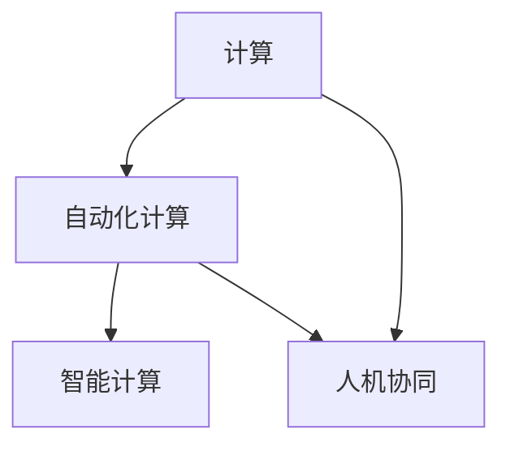

                 

# 计算的本质与自动化的未来

计算技术的演进，是推动人类社会发展的核心动力之一。从早期的机械计算到现代的数字化计算，再到正在兴起的自动化计算，计算本质不断地在变化，而自动化计算正站在新时代的前沿，引领着计算技术的前行。本文将深入探讨计算的本质，以及自动化计算在未来的应用前景。

## 1. 背景介绍

### 1.1 计算技术的演进

计算技术的发展，经历了几次重大的变革。20世纪初，人们开始使用机械计算器进行数学计算。此后，随着电子技术的发展，计算开始进入电子时代。1946年，第一台电子计算机ENIAC问世，标志着现代计算时代的到来。1970年代，个人计算机（PC）的普及，使得计算进一步深入到人们生活的各个角落。进入21世纪，随着互联网的普及，计算技术进一步发展，大数据、人工智能、云计算等新技术层出不穷，计算已经成为了驱动现代社会的核心引擎。

### 1.2 自动化计算的兴起

自动化计算，是指通过软件、硬件的智能化设计，使得计算过程不需要人工干预，能够自我管理、自我优化，甚至具备学习能力的计算技术。随着人工智能、机器学习等技术的成熟，自动化计算正在逐步成为计算的主流。自动化计算的特点是高效、灵活、可扩展性强，能够应对复杂多变的环境，提供智能化的计算服务。

## 2. 核心概念与联系

### 2.1 核心概念概述

在探讨自动化计算时，首先需要明确几个核心概念：

- **计算**：指通过算法和数据处理，解决特定问题的过程。计算是信息时代的基础，广泛应用于科学研究、商业决策、工程设计等领域。

- **自动化计算**：通过软件、硬件的智能化设计，使得计算过程不需要人工干预，能够自我管理、自我优化，甚至具备学习能力的计算技术。自动化计算是现代计算的核心趋势，代表了计算技术的发展方向。

- **智能计算**：指具备自我学习、自我优化能力的计算技术。智能计算利用机器学习、深度学习等技术，从海量数据中挖掘出规律，提升计算效率和效果。

- **人机协同**：指人类与机器协作完成计算任务的过程。人机协同是自动化计算的高级形式，能够实现更高效、更智能的计算。

这些概念之间的关系可以通过以下Mermaid流程图来展示：



这个流程图展示了计算技术的演进过程：从原始的计算到自动化计算，再到智能计算，最终实现人机协同的高级形式。

### 2.2 概念间的关系

自动化计算是计算技术发展的重要方向。智能计算作为自动化计算的高级形式，利用机器学习等技术，实现自我学习、自我优化的能力。人机协同则是自动化计算的最终目标，通过人类与机器的协作，实现更高效、更智能的计算。这些概念之间互相关联，共同推动计算技术的发展。

## 3. 核心算法原理 & 具体操作步骤

### 3.1 算法原理概述

自动化计算的实现，基于以下几个核心算法原理：

- **机器学习**：通过训练数据，使机器学习模型具备对新数据的泛化能力，实现自我优化。机器学习是自动化计算的基础。

- **深度学习**：通过多层次神经网络，对数据进行复杂的特征提取和建模，实现更精确的预测和分类。深度学习是智能计算的核心。

- **强化学习**：通过与环境的交互，使得机器学习模型能够自我优化，找到最优策略。强化学习是自动化计算的重要组成部分。

这些算法原理相互关联，共同构成了自动化计算的核心框架。

### 3.2 算法步骤详解

自动化计算的实现步骤通常包括以下几个关键环节：

1. **数据收集**：收集与计算任务相关的数据，包括结构化数据和非结构化数据。

2. **数据预处理**：对收集到的数据进行清洗、整理，转换成适合算法处理的形式。

3. **模型训练**：通过训练数据，训练机器学习模型，实现自我优化的能力。

4. **模型评估**：对训练好的模型进行评估，选择最优模型进行应用。

5. **模型部署**：将训练好的模型部署到生产环境，实现自动化计算。

6. **模型优化**：根据实际应用反馈，对模型进行优化，提升性能。

### 3.3 算法优缺点

自动化计算具有以下优点：

- **高效**：自动化计算能够处理海量数据，实现高效的计算。

- **灵活**：自动化计算能够适应复杂多变的环境，实现灵活的计算。

- **可扩展**：自动化计算能够进行横向和纵向扩展，实现可扩展的计算。

- **智能化**：自动化计算具备自我学习、自我优化的能力，实现智能化的计算。

同时，自动化计算也存在一些缺点：

- **数据依赖**：自动化计算依赖于高质量的数据，数据质量不好会影响计算结果。

- **模型复杂**：自动化计算的模型通常比较复杂，需要更多的计算资源和时间。

- **安全性**：自动化计算的模型可能存在安全隐患，需要更多的安全措施。

- **可解释性**：自动化计算的模型往往是“黑盒”系统，难以解释其内部工作机制。

### 3.4 算法应用领域

自动化计算已经广泛应用于多个领域，包括：

- **金融**：自动化计算在金融领域应用广泛，用于风险评估、投资决策、欺诈检测等。

- **医疗**：自动化计算在医疗领域用于疾病诊断、医疗影像分析、个性化治疗等。

- **制造业**：自动化计算在制造业用于生产计划、质量控制、设备维护等。

- **物流**：自动化计算在物流领域用于路径规划、库存管理、配送优化等。

- **智能交通**：自动化计算在智能交通领域用于交通流预测、智能信号控制、车辆自动驾驶等。

## 4. 数学模型和公式 & 详细讲解  

### 4.1 数学模型构建

自动化计算的核心在于机器学习模型的构建。以回归任务为例，其数学模型可以表示为：

$$
y = f(x; \theta)
$$

其中 $x$ 为输入数据， $y$ 为输出结果， $f$ 为函数， $\theta$ 为模型参数。

### 4.2 公式推导过程

以线性回归为例，推导过程如下：

1. 假设 $y$ 与 $x$ 之间的关系为线性关系：
$$
y = \theta_0 + \theta_1 x
$$

2. 根据训练数据 $(x_i, y_i)$，求解 $\theta_0$ 和 $\theta_1$，使得损失函数最小化：
$$
\min_{\theta_0, \theta_1} \sum_{i=1}^n (y_i - \theta_0 - \theta_1 x_i)^2
$$

3. 求解上述优化问题，得到 $\theta_0$ 和 $\theta_1$：
$$
\theta_0 = \frac{\sum_{i=1}^n (y_i - \theta_1 x_i)}{n}, \quad \theta_1 = \frac{\sum_{i=1}^n (x_i y_i - \sum_{i=1}^n y_i x_i / n)}{\sum_{i=1}^n x_i^2 - n (\sum_{i=1}^n x_i / n)^2}
$$

### 4.3 案例分析与讲解

以房价预测为例，假设我们有 $n$ 个历史房价数据 $(x_i, y_i)$，其中 $x_i$ 为房屋面积， $y_i$ 为房价。我们可以利用线性回归模型来预测新房屋的房价。

1. 数据收集：收集 $n$ 个房屋面积和房价数据。

2. 数据预处理：对数据进行清洗、整理，转换成适合模型训练的形式。

3. 模型训练：利用训练数据，求解线性回归模型参数 $\theta_0$ 和 $\theta_1$。

4. 模型评估：在验证集上评估模型性能，选择最优模型。

5. 模型部署：将训练好的模型部署到生产环境，用于新房屋房价预测。

6. 模型优化：根据实际应用反馈，对模型进行优化，提升预测准确度。

## 5. 项目实践：代码实例和详细解释说明

### 5.1 开发环境搭建

在进行自动化计算项目开发时，需要搭建合适的开发环境。以下是Python环境下搭建自动化计算开发环境的步骤：

1. 安装Python：从官网下载安装Python，选择合适版本的安装。

2. 安装必要的库：安装TensorFlow、PyTorch、Scikit-Learn等常用的机器学习库。

3. 安装开发工具：安装Jupyter Notebook、Anaconda等开发工具。

4. 创建虚拟环境：使用conda创建虚拟环境，隔离开发依赖。

### 5.2 源代码详细实现

以线性回归为例，展示自动化计算项目开发的源代码实现。

```python
import numpy as np
from sklearn.linear_model import LinearRegression

# 数据生成
n = 100
x = np.random.randn(n)
y = 2 * x + 1 + np.random.randn(n)

# 数据拆分
x_train, x_test = x[:80], x[80:]
y_train, y_test = y[:80], y[80:]

# 模型训练
model = LinearRegression()
model.fit(x_train.reshape(-1, 1), y_train)

# 模型评估
score = model.score(x_test.reshape(-1, 1), y_test)
print(f"模型评估得分：{score:.3f}")

# 模型预测
x_new = np.array([3.5])
y_pred = model.predict(x_new.reshape(-1, 1))
print(f"新房价预测：{y_pred[0]:.2f}")
```

### 5.3 代码解读与分析

代码中的关键步骤包括：

1. 数据生成：使用Numpy生成随机数据。

2. 数据拆分：将数据拆分为训练集和测试集。

3. 模型训练：使用Scikit-Learn的LinearRegression模型进行训练。

4. 模型评估：计算模型在测试集上的评估得分。

5. 模型预测：对新样本进行预测。

## 6. 实际应用场景

### 6.1 金融风险评估

自动化计算在金融领域广泛应用，其中一个典型应用场景是风险评估。金融机构可以利用自动化计算模型，根据历史数据和用户行为，评估用户的信用风险。通过多维度的特征提取和建模，自动化计算模型能够更准确地识别风险用户，减少坏账损失。

### 6.2 医疗影像诊断

医疗影像诊断是自动化计算的另一个典型应用场景。通过机器学习算法，自动化计算模型可以从CT、MRI等影像中提取特征，识别病变部位和病变类型。利用深度学习技术，模型能够更准确地进行疾病诊断，辅助医生进行精准治疗。

### 6.3 智能交通

智能交通是自动化计算在交通领域的应用。通过机器学习算法，自动化计算模型可以预测交通流量、优化信号灯控制、实现自动驾驶等。利用深度学习技术，模型能够实时分析交通数据，优化交通运行效率。

## 7. 工具和资源推荐

### 7.1 学习资源推荐

- Coursera《机器学习》课程：由斯坦福大学Andrew Ng教授开设的机器学习课程，是入门机器学习的经典教材。

- Udacity《深度学习专项课程》：由DeepMind和Google工程师讲授的深度学习课程，涵盖深度学习的基础和高级内容。

- TensorFlow官方文档：TensorFlow的官方文档，提供了丰富的学习资源和示例代码，是深度学习学习者的必备工具。

### 7.2 开发工具推荐

- Jupyter Notebook：开源的交互式编程工具，支持Python等语言，非常适合数据科学和机器学习项目开发。

- Anaconda：数据科学和机器学习项目的开发环境，提供了丰富的科学计算库和工具。

- PyTorch：由Facebook开发的深度学习框架，提供了丰富的机器学习算法和工具。

### 7.3 相关论文推荐

- AlexNet：ImageNet大规模视觉识别挑战赛的获奖论文，展示了深度学习在图像识别任务上的卓越表现。

- ResNet：深度残差网络，通过残差连接解决了深度神经网络的梯度消失问题，进一步提升了深度学习的表现。

- AlphaGo：DeepMind开发的围棋人工智能，通过深度强化学习技术，实现了人类级的围棋水平。

## 8. 总结：未来发展趋势与挑战

### 8.1 研究成果总结

自动化计算已经取得了诸多突破，尤其在机器学习、深度学习等领域。随着算力的提升和数据量的增加，自动化计算的应用范围将不断扩大，推动各行各业的智能化进程。

### 8.2 未来发展趋势

未来，自动化计算将呈现以下几个发展趋势：

1. 智能化水平提升：随着深度学习、强化学习等技术的进一步发展，自动化计算将具备更强的自我学习、自我优化能力，实现更智能的计算。

2. 应用范围扩大：自动化计算将从单一领域扩展到多个领域，推动更多的产业智能化升级。

3. 跨领域融合：自动化计算将与其他技术进行深度融合，如物联网、区块链、边缘计算等，实现更加全面的智能化解决方案。

### 8.3 面临的挑战

尽管自动化计算在发展过程中取得了诸多突破，但也面临诸多挑战：

1. 数据质量和多样性：高质量、多样化的数据是自动化计算的基础，但数据收集和标注的成本较高。

2. 模型复杂度和资源消耗：自动化计算的模型通常比较复杂，需要更多的计算资源和时间。

3. 可解释性和透明性：自动化计算的“黑盒”系统难以解释其内部工作机制，缺乏透明性。

4. 安全性与隐私保护：自动化计算的模型可能存在安全隐患，需要更多的安全措施保护用户数据。

### 8.4 研究展望

未来，自动化计算的研究将从以下几个方向进行：

1. 多模态数据融合：自动化计算将利用多模态数据，如文本、图像、语音等，提升计算的准确性和鲁棒性。

2. 人机协同增强：自动化计算将更多地与人类协作，提升计算的可靠性和智能化水平。

3. 计算资源优化：自动化计算将优化计算资源，提升计算的效率和性能。

4. 模型解释性与透明性：自动化计算将更多地注重模型的可解释性和透明性，提升计算的可信度。

## 9. 附录：常见问题与解答

**Q1: 什么是自动化计算？**

A: 自动化计算是通过软件、硬件的智能化设计，使得计算过程不需要人工干预，能够自我管理、自我优化，甚至具备学习能力的计算技术。

**Q2: 自动化计算有哪些应用场景？**

A: 自动化计算已经广泛应用于多个领域，包括金融、医疗、智能交通等。

**Q3: 自动化计算有哪些挑战？**

A: 自动化计算面临数据质量、模型复杂度、安全性、可解释性等挑战。

**Q4: 如何提升自动化计算的智能化水平？**

A: 通过深度学习、强化学习等技术，提升自动化计算的自我学习、自我优化能力。

**Q5: 未来自动化计算的发展趋势是什么？**

A: 未来，自动化计算将具备更强的智能化水平，应用范围将扩大，跨领域融合将更加深入。

总之，计算技术的发展是推动人类社会进步的核心动力之一。自动化计算作为计算技术的重要方向，将在未来发挥越来越重要的作用。通过不断探索和创新，自动化计算将推动各行各业向智能化方向迈进，带来更多的便利和效率。

---

作者：禅与计算机程序设计艺术 / Zen and the Art of Computer Programming

