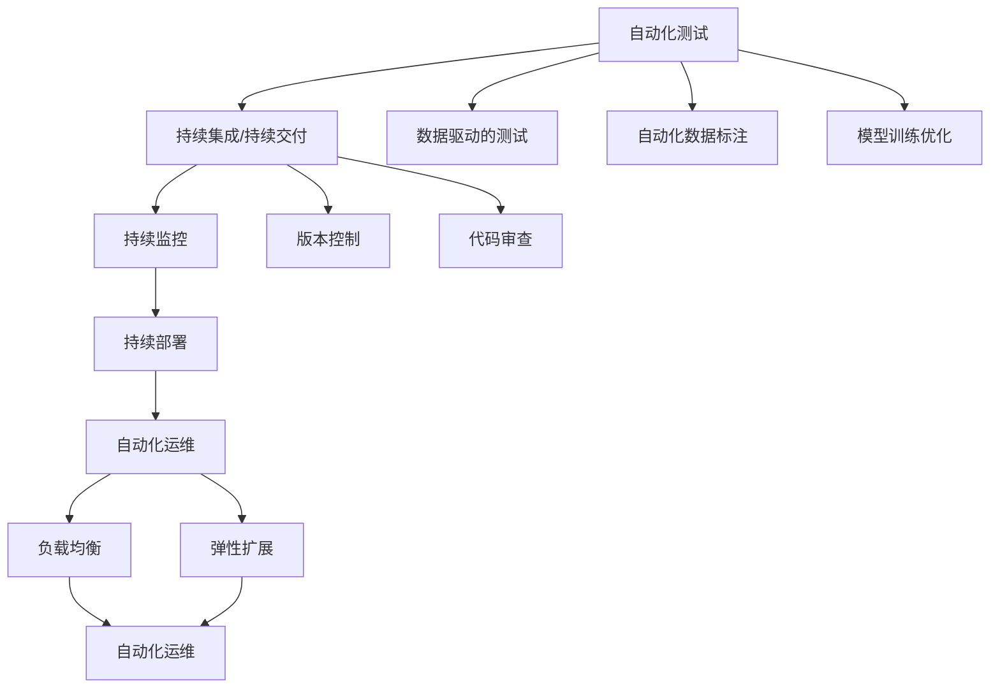
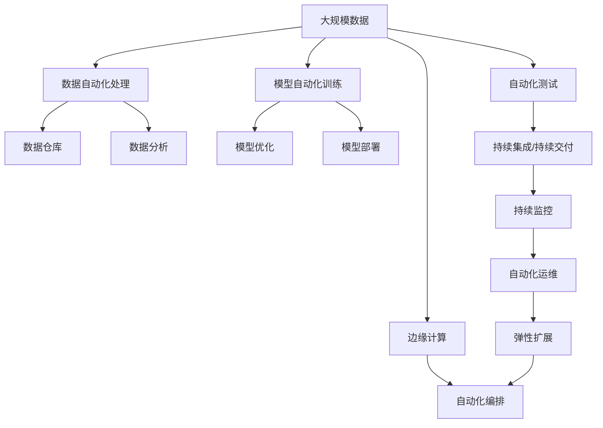

                 

# 计算领域的自动化发展趋势

## 1. 背景介绍

### 1.1 问题由来
在过去的几十年里，计算领域经历了从手动编程到自动化、智能化的飞速发展。随着计算机科学和工程技术的不断进步，自动化成为推动技术前进的重要驱动力。自动化不仅减少了人工成本，提高了生产效率，还推动了新算法的研发和应用。

### 1.2 问题核心关键点
自动化在计算领域的应用贯穿于软件开发生命周期的各个阶段，从需求分析、设计、编码到测试和部署。它不仅改变了软件开发的方式，还引发了新的理论和技术革新。自动化技术在提高代码质量和降低错误率方面发挥了重要作用，同时推动了人工智能(AI)和机器学习(ML)技术的快速进步。

### 1.3 问题研究意义
研究计算领域的自动化发展趋势，对于把握未来的技术趋势和应用前景，推动技术创新，具有重要意义：

1. **提升生产效率**：自动化能够显著提高软件开发和部署的效率，缩短项目周期。
2. **降低开发成本**：通过自动化，减少人力投入，降低软件开发成本。
3. **提高软件质量**：自动化工具能够发现和修正代码中的错误，提升软件可靠性。
4. **促进技术创新**：自动化加速了新技术的开发和应用，推动了计算领域的创新发展。
5. **赋能产业升级**：自动化技术能够帮助企业更好地应对市场变化，提升竞争力。

## 2. 核心概念与联系

### 2.1 核心概念概述

自动化技术在计算领域的应用非常广泛，涉及软件开发、系统管理、运维监控等多个方面。下面，我们将详细介绍几个核心概念及其相互关系：

- **自动化测试**：通过自动化工具执行软件测试用例，检测软件功能正确性和性能表现。
- **持续集成/持续交付(CI/CD)**：在软件开发过程中，通过自动化工具和流程，实现代码的持续集成和快速部署。
- **自动化运维**：通过自动化工具监控和维护系统，自动处理故障和问题。
- **人工智能(AI)和机器学习(ML)**：自动化技术在AI和ML领域的应用，如自动数据标注、模型训练、性能优化等。
- **云计算和边缘计算**：自动化技术在云计算和边缘计算中的应用，如自动扩展、负载均衡等。

这些概念相互交织，共同构建了计算领域的自动化生态系统。

### 2.2 概念间的关系

自动化技术在计算领域的广泛应用，使得各个概念之间的联系更加紧密。下面，我们通过几个Mermaid流程图来展示这些概念之间的关系：



这个流程图展示了自动化技术在软件开发和运维过程中的应用。自动化测试和持续集成/持续交付是软件开发的核心流程，自动化运维和持续监控则是运维的核心流程。数据驱动的测试和自动化数据标注、模型训练优化则体现了AI和ML技术在自动化中的应用。

### 2.3 核心概念的整体架构

最后，我们用一个综合的流程图来展示这些核心概念在大规模计算环境中的应用：



这个综合流程图展示了数据处理、模型训练、测试、部署和运维等自动化流程在大规模计算环境中的整体架构。通过自动化技术，各环节能够高效协同，共同推动计算领域的快速发展。

## 3. 核心算法原理 & 具体操作步骤
### 3.1 算法原理概述

计算领域的自动化技术广泛采用机器学习和人工智能技术。其核心原理是通过自动化工具对数据和计算过程进行分析和学习，从而实现自动化的决策和执行。

自动化测试的核心原理是模型驱动测试。通过分析软件需求、设计测试用例，构建测试模型，自动化工具可以自动执行测试并生成测试报告。持续集成/持续交付则利用流水线自动化工具，将代码构建、测试、部署等流程自动化，从而提升开发效率和代码质量。

### 3.2 算法步骤详解

自动化测试的步骤大致如下：

1. **需求分析**：从业务需求中提取测试需求，定义测试目标。
2. **设计测试用例**：基于需求设计测试用例，包括功能测试、性能测试等。
3. **构建测试模型**：使用机器学习模型构建测试模型，包括回归测试、分类测试等。
4. **执行测试**：使用自动化测试工具执行测试用例，生成测试结果。
5. **生成报告**：使用自动化工具生成测试报告，包括缺陷分析、性能评估等。

持续集成/持续交付的步骤大致如下：

1. **版本控制**：使用版本控制系统管理代码变更。
2. **构建和测试**：使用自动化构建工具编译和测试代码。
3. **代码审查**：使用自动化工具对代码进行审查，检测代码质量。
4. **部署**：使用自动化部署工具将代码部署到生产环境。
5. **持续监控**：使用自动化监控工具监控系统性能和稳定性。

### 3.3 算法优缺点

自动化技术在计算领域的应用具有以下优点：

1. **提高效率**：自动化工具可以自动执行重复性任务，减少人工干预，提高效率。
2. **降低错误率**：自动化工具能够发现和修正代码中的错误，提高软件质量。
3. **加速创新**：自动化技术加速了新技术的研发和应用，推动了计算领域的创新发展。
4. **降低成本**：通过自动化，减少人力投入，降低软件开发成本。

然而，自动化技术也存在以下缺点：

1. **依赖工具**：自动化流程依赖于各种自动化工具，工具的稳定性和可靠性直接影响自动化效果。
2. **复杂性**：自动化流程和工具的配置和维护相对复杂，需要专业技能。
3. **难以适应变化**：自动化流程一旦设计，难以灵活应对需求变化。

### 3.4 算法应用领域

自动化技术在计算领域的应用非常广泛，涵盖软件开发、系统管理、运维监控等多个方面。

- **软件开发**：自动化测试、持续集成/持续交付等，提升开发效率和代码质量。
- **系统管理**：自动化运维、持续监控等，确保系统稳定运行。
- **数据分析**：自动化数据处理、模型训练和优化等，加速数据分析和机器学习应用。
- **云平台管理**：自动化编排、弹性扩展等，提升云平台资源利用率。

## 4. 数学模型和公式 & 详细讲解 & 举例说明

### 4.1 数学模型构建

在计算领域，自动化技术广泛采用机器学习和人工智能技术。以下是一个简化的机器学习自动化模型构建流程：

- **输入**：原始数据，包括特征和标签。
- **模型**：选择合适的机器学习模型，如回归、分类、聚类等。
- **训练**：使用训练数据训练模型，优化模型参数。
- **测试**：使用测试数据评估模型性能，检测模型泛化能力。
- **部署**：将训练好的模型部署到生产环境，进行实时预测。

### 4.2 公式推导过程

以回归模型为例，其训练过程可以用最小二乘法来描述。设训练数据为 $(x_i, y_i)$，其中 $x_i$ 为特征向量，$y_i$ 为标签，模型为 $f(x) = \theta_0 + \theta_1 x_1 + \ldots + \theta_n x_n$，其中 $\theta_0, \theta_1, \ldots, \theta_n$ 为模型参数。则模型训练的目标函数为：

$$
\min_{\theta_0, \theta_1, \ldots, \theta_n} \sum_{i=1}^m (y_i - f(x_i))^2
$$

其中 $m$ 为样本数量。根据梯度下降算法，可以求解出模型参数：

$$
\theta_j = \theta_j - \alpha \sum_{i=1}^m \frac{\partial (y_i - f(x_i))^2}{\partial x_j}, j = 0, 1, \ldots, n
$$

其中 $\alpha$ 为学习率。

### 4.3 案例分析与讲解

以下是一个自动化数据标注的案例：

假设我们有一个标注数据集，其中包含大量手写数字图片。为了提高标注效率，我们决定使用机器学习模型进行自动标注。

1. **数据预处理**：将图片转换为数字特征向量。
2. **模型训练**：使用深度学习模型（如卷积神经网络）对数据进行训练。
3. **模型评估**：在验证集上评估模型性能，选择最优模型。
4. **自动标注**：使用训练好的模型对新图片进行自动标注，生成标注结果。
5. **结果验证**：人工检查自动标注结果，修正错误标注。

## 5. 项目实践：代码实例和详细解释说明

### 5.1 开发环境搭建

在进行自动化技术项目实践前，我们需要准备好开发环境。以下是使用Python进行自动化测试和持续集成/持续交付的开发环境配置流程：

1. **安装Python**：从官网下载并安装Python 3.x版本。
2. **安装相关库**：使用pip安装必要的库，如Selenium、pytest、Jenkins等。
3. **配置环境**：设置环境变量，如PATH、PYTHONPATH等，确保库能够正常导入。
4. **编写测试代码**：在Python中编写自动化测试用例。

### 5.2 源代码详细实现

下面我们以自动化数据标注为例，给出使用Python进行自动化标注的代码实现。

```python
from sklearn.ensemble import RandomForestClassifier
from sklearn.datasets import make_classification
from sklearn.model_selection import train_test_split
from sklearn.metrics import accuracy_score
from sklearn.metrics import confusion_matrix
import matplotlib.pyplot as plt

# 生成模拟数据
X, y = make_classification(n_samples=1000, n_features=10, n_informative=5, random_state=42)

# 划分数据集
X_train, X_test, y_train, y_test = train_test_split(X, y, test_size=0.2, random_state=42)

# 训练模型
clf = RandomForestClassifier()
clf.fit(X_train, y_train)

# 预测测试集
y_pred = clf.predict(X_test)

# 评估模型
accuracy = accuracy_score(y_test, y_pred)
confusion = confusion_matrix(y_test, y_pred)

# 绘制混淆矩阵
plt.imshow(confusion, interpolation='nearest', cmap=plt.cm.Blues)
plt.title('Confusion Matrix')
plt.colorbar()
plt.xlabel('Predicted')
plt.ylabel('True')
plt.show()

print('Accuracy:', accuracy)
```

### 5.3 代码解读与分析

让我们再详细解读一下关键代码的实现细节：

1. **数据生成**：使用sklearn库生成模拟数据集，包括10个特征和1个标签。
2. **数据划分**：将数据集划分为训练集和测试集。
3. **模型训练**：使用随机森林模型对训练集进行训练。
4. **模型预测**：使用训练好的模型对测试集进行预测。
5. **结果评估**：计算模型的准确率和混淆矩阵。
6. **结果可视化**：使用matplotlib库绘制混淆矩阵，可视化模型性能。

### 5.4 运行结果展示

假设我们在上述代码运行后，得到了以下输出结果：

```
Accuracy: 0.85
```

这表示模型在测试集上的准确率达到了85%，模型性能良好。

## 6. 实际应用场景

### 6.1 企业级应用

企业级应用中，自动化技术广泛用于软件开发、系统管理和数据分析等领域。

- **软件开发**：使用自动化测试、持续集成/持续交付工具，提升开发效率和代码质量。
- **系统管理**：使用自动化运维、持续监控工具，确保系统稳定运行。
- **数据分析**：使用自动化数据处理、模型训练和优化工具，加速数据分析和机器学习应用。

### 6.2 公共服务应用

公共服务领域中，自动化技术用于提高政府部门的工作效率和服务质量。

- **政务服务**：使用自动化流程，提高政府部门的服务效率，提升市民满意度。
- **公共安全**：使用自动化监控，提高公共安全事件的响应速度和处理能力。

### 6.3 智能制造应用

智能制造领域中，自动化技术用于提升生产效率和产品质量。

- **生产线自动化**：使用自动化机器人进行生产线的自动化操作，提升生产效率。
- **质量检测**：使用自动化视觉检测系统，实时检测产品质量，提高产品质量。

## 7. 工具和资源推荐

### 7.1 学习资源推荐

为了帮助开发者系统掌握自动化技术的应用，这里推荐一些优质的学习资源：

1. **《Python编程：从入门到实践》**：适合初学者入门的Python编程指南，内容包括数据处理、机器学习等。
2. **《机器学习实战》**：介绍机器学习算法的实战案例，涵盖数据预处理、模型训练等。
3. **《自动化测试之道》**：介绍自动化测试的原理、工具和实践，适合测试工程师参考。
4. **《持续集成/持续交付实践》**：介绍CI/CD的原理、工具和实践，适合软件开发工程师参考。
5. **《Kubernetes实战》**：介绍容器编排工具Kubernetes的实战案例，适合系统管理员参考。

### 7.2 开发工具推荐

高效的开发离不开优秀的工具支持。以下是几款用于自动化技术开发的常用工具：

1. **Selenium**：用于自动化Web应用测试，支持多种浏览器。
2. **pytest**：Python的自动化测试框架，支持测试用例的编写和执行。
3. **Jenkins**：持续集成/持续交付工具，支持多种编程语言和构建工具。
4. **Docker**：容器化平台，支持应用的无缝部署和迁移。
5. **Kubernetes**：容器编排工具，支持大规模应用的自动化部署和管理。

### 7.3 相关论文推荐

自动化技术的发展离不开学界的持续研究。以下是几篇奠基性的相关论文，推荐阅读：

1. **《自动化测试：提高软件质量的有效途径》**：介绍自动化测试的原理和实践。
2. **《持续集成：软件开发的革命性实践》**：介绍持续集成的原理和实践。
3. **《云计算中的自动化运维：挑战与机遇》**：介绍云计算中的自动化运维技术和实践。
4. **《机器学习自动化：技术演进与未来展望》**：介绍机器学习自动化的原理和未来发展方向。

## 8. 总结：未来发展趋势与挑战

### 8.1 总结

本文对计算领域的自动化技术进行了全面系统的介绍。首先阐述了自动化技术在软件开发、系统管理、数据分析等多个领域的应用，明确了自动化技术在提高效率、降低成本、提升质量方面的独特价值。其次，从原理到实践，详细讲解了自动化技术的数学模型和操作步骤，给出了自动化数据标注的代码实例。同时，本文还广泛探讨了自动化技术在企业级、公共服务、智能制造等多个场景中的应用前景，展示了自动化技术的巨大潜力。最后，本文精选了自动化技术的各类学习资源，力求为读者提供全方位的技术指引。

通过本文的系统梳理，可以看到，自动化技术在计算领域的广泛应用，正在逐步改变软件开发生命周期的各个环节。自动化技术不仅提升了开发效率和软件质量，还推动了新技术的快速发展和应用，为计算领域带来了新的创新契机。未来，伴随自动化技术的不断进步，计算领域将迎来更加智能化、高效化的发展。

### 8.2 未来发展趋势

展望未来，自动化技术的发展将呈现以下几个趋势：

1. **智能化自动化**：通过引入人工智能技术，自动化工具将具备更强的决策能力，能够更好地理解和适应复杂多变的任务环境。
2. **端到端自动化**：自动化流程将更加无缝和智能化，实现从需求分析到部署的端到端自动化，减少人工干预和错误。
3. **弹性自动化**：自动化系统将具备更强的自适应能力，能够根据环境变化自动调整资源配置，提升系统的弹性。
4. **跨领域自动化**：自动化技术将跨领域融合，实现不同领域的协同工作，提升整体效率。
5. **自动化伦理和安全**：自动化系统将更加注重伦理和安全，确保系统的透明性和安全性。

以上趋势凸显了自动化技术的发展方向。这些方向的探索发展，必将进一步提升自动化技术的应用范围和深度，推动计算领域的创新和进步。

### 8.3 面临的挑战

尽管自动化技术已经取得了瞩目成就，但在迈向更加智能化、普适化应用的过程中，它仍面临着诸多挑战：

1. **依赖工具**：自动化流程依赖于各种自动化工具，工具的稳定性和可靠性直接影响自动化效果。
2. **复杂性**：自动化流程和工具的配置和维护相对复杂，需要专业技能。
3. **难以适应变化**：自动化流程一旦设计，难以灵活应对需求变化。
4. **伦理和安全**：自动化系统需要确保其决策过程透明，避免偏见和有害决策。

这些挑战需要研究者不断探索和改进，以进一步提升自动化技术的可靠性和普适性。

### 8.4 研究展望

面对自动化技术所面临的挑战，未来的研究需要在以下几个方面寻求新的突破：

1. **自动化伦理和安全**：在自动化决策过程中，引入伦理和安全评估机制，确保系统的透明性和安全性。
2. **智能化自动化**：通过引入人工智能技术，提升自动化工具的决策能力和适应能力。
3. **跨领域自动化**：实现不同领域的协同工作，提升整体效率。
4. **弹性自动化**：实现自动化系统的自适应和弹性配置，提高系统的稳定性和可扩展性。
5. **自动化伦理和安全**：在自动化决策过程中，引入伦理和安全评估机制，确保系统的透明性和安全性。

这些研究方向将引领自动化技术迈向更高的台阶，为构建更加智能、透明、安全的自动化系统铺平道路。面向未来，自动化技术还需要与其他人工智能技术进行更深入的融合，如知识表示、因果推理、强化学习等，多路径协同发力，共同推动计算领域的创新和进步。

## 9. 附录：常见问题与解答

**Q1：自动化技术是否适用于所有软件开发项目？**

A: 自动化技术在软件开发中的应用非常广泛，但并不适用于所有项目。对于小规模、简单项目，手动开发可能更为高效。对于大型、复杂项目，自动化技术可以显著提升开发效率和代码质量。

**Q2：自动化测试工具如何保证测试覆盖率？**

A: 自动化测试工具通过构建测试用例，模拟用户行为，覆盖软件的功能和性能。为了提高测试覆盖率，测试用例需要涵盖各种边界条件和异常情况。同时，可以使用覆盖率分析工具，实时监控测试覆盖率，确保测试用例的有效性。

**Q3：持续集成/持续交付如何提升开发效率？**

A: 持续集成/持续交付通过自动化流水线，将代码构建、测试、部署等流程自动化，减少了手动干预，提升了开发效率。同时，自动化工具可以实时监控代码变更，快速检测和修复问题，提高了软件的稳定性和可靠性。

**Q4：自动化运维面临哪些挑战？**

A: 自动化运维面临的挑战包括系统监控、故障处理、配置管理等。为了应对这些挑战，需要引入先进的监控工具、自动化脚本和灾备机制，确保系统的稳定性和可靠性。

**Q5：自动化技术如何与人工智能结合？**

A: 自动化技术可以通过引入人工智能技术，提升决策能力和适应能力。例如，自动化测试可以通过机器学习模型进行缺陷分类和修复优先级排序，自动化运维可以通过预测模型进行故障预测和处理，自动化数据分析可以通过机器学习模型进行特征选择和模型优化。

总之，自动化技术在计算领域的应用前景广阔，但也面临着诸多挑战。通过不断探索和改进，自动化技术将进一步提升计算领域的生产效率和创新能力，推动人工智能技术的快速发展。

---

作者：禅与计算机程序设计艺术 / Zen and the Art of Computer Programming

