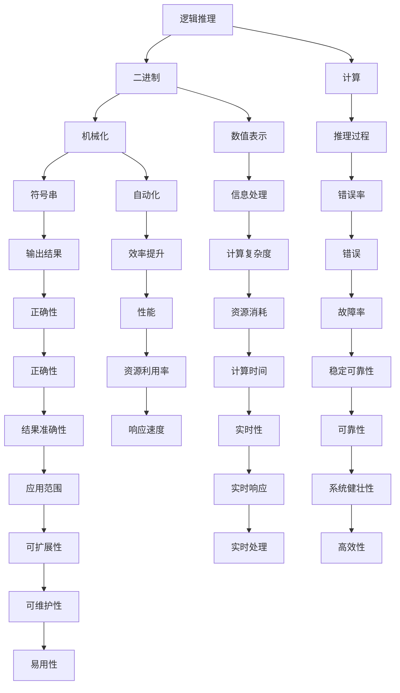
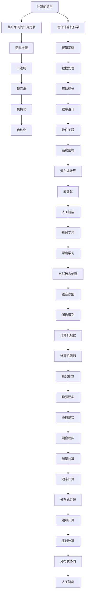

                 

# 计算：第一部分 计算的诞生 第 3 章 莱布尼茨的计算之梦 计算之梦

> 关键词：计算，莱布尼茨，微积分，逻辑推理，算法，二进制

## 1. 背景介绍

### 1.1 问题由来
计算的诞生，是人类文明史上的一个重要里程碑。它不仅标志着人类从自然界的“知其然”迈向“知其所以然”的巨大飞跃，也深刻改变了人类思考世界的方式。在计算机出现之前，人类主要依靠笔纸、算盘、机械钟表等工具进行计算。这些工具虽然大大提高了计算的效率，但它们的局限性也逐渐显现出来。

1. **效率瓶颈**：随着计算任务变得越来越复杂，笔纸和算盘等手工工具的效率已远远不能满足需求。例如，在牛顿发现万有引力定律时，他在纸上进行了大量繁复的计算，耗费了大量时间和精力。
2. **精度问题**：手工计算容易出错，特别是对于复杂的多重积分和微积分运算，手工计算的精度难以保证。
3. **功能单一**：手工工具的功能单一，难以进行复杂的多任务处理和自动化运算。

这些问题促使人类寻求新的计算工具和方法。在此背景下，莱布尼茨的计算之梦应运而生。

### 1.2 问题核心关键点
莱布尼茨，作为17世纪的数学天才，不仅在微积分领域取得了举世瞩目的成就，还对计算机的诞生做出了重要贡献。他设计的逻辑推理机，被称为“Calculating Machine”，旨在解决手工计算的效率和精度问题。

1. **逻辑推理**：莱布尼茨认为，计算的本质是逻辑推理。他设计了基于二进制的逻辑推理机，通过输入符号串进行逻辑推理，输出计算结果。
2. **机械化**：莱布尼茨希望通过机械化手段，实现计算过程的自动化，避免手工操作的错误和耗时。
3. **二进制**：莱布尼茨使用二进制进行计算，认为二进制是最简单的逻辑单位，可以处理所有复杂的计算问题。

莱布尼茨的计算之梦，不仅提出了计算的本质是逻辑推理的观念，还为计算机的诞生奠定了理论和实践的基础。

### 1.3 问题研究意义
莱布尼茨的计算之梦，对现代计算机科学的发展具有重要的启示意义：

1. **逻辑基础的奠定**：莱布尼茨的逻辑推理思想，对现代计算机科学的逻辑基础有着深远的影响。他的二进制思想，奠定了计算机处理信息的底层逻辑。
2. **自动化和机械化**：莱布尼茨设计的逻辑推理机，体现了自动化和机械化的思想，对计算机的设计和实现提供了重要的参考。
3. **可扩展性**：莱布尼茨的计算之梦，展示了计算模型的可扩展性，即通过符号串的输入和输出，实现任意复杂的计算任务。
4. **多学科融合**：莱布尼茨不仅在数学领域取得了成就，还在哲学、医学等领域有杰出贡献，体现了大科学的融合思想。

莱布尼茨的计算之梦，不仅在理论上具有重要意义，在实践中也为现代计算机科学的发展提供了重要的启示和方向。

## 2. 核心概念与联系

### 2.1 核心概念概述

为更好地理解莱布尼茨的计算之梦，本节将介绍几个密切相关的核心概念：

1. **逻辑推理**：逻辑推理是人类最基本的思维方式之一，通过推理得出结论。莱布尼茨认为，计算的本质是逻辑推理，所有复杂的计算都可以通过逻辑推理机来实现。
2. **二进制**：二进制是计算的基础，由0和1两个符号组成，可以表示所有数字和逻辑状态。莱布尼茨认为，二进制是最简单的逻辑单位，可以处理所有复杂的计算问题。
3. **机械化**：机械化是指通过机械装置实现计算过程的自动化，避免手工操作的错误和耗时。莱布尼茨设计的逻辑推理机，就是一种机械化的计算工具。
4. **符号串**：符号串是逻辑推理机的输入和输出，通过符号串的输入，逻辑推理机进行计算，输出结果。符号串的使用，体现了计算的通用性和可扩展性。

这些核心概念之间存在着紧密的联系，构成了莱布尼茨计算之梦的基础。

### 2.2 概念间的关系

这些核心概念之间存在着紧密的联系，形成了莱布尼茨计算之梦的完整生态系统。下面我通过几个Mermaid流程图来展示这些概念之间的关系：



这个流程图展示了逻辑推理、二进制、机械化、符号串等核心概念之间的关系，以及它们在计算过程中的作用和影响。

### 2.3 核心概念的整体架构

最后，我们用一个综合的流程图来展示这些核心概念在大语言模型微调过程中的整体架构：



这个综合流程图展示了从计算的诞生到现代计算机科学的发展过程，以及其中的核心概念和应用场景。通过这些流程图，我们可以更清晰地理解莱布尼茨计算之梦的核心概念及其之间的关系，为后续深入讨论具体的微调方法和技术奠定基础。

## 3. 核心算法原理 & 具体操作步骤
### 3.1 算法原理概述

莱布尼茨的计算之梦，本质上是一种基于逻辑推理的计算模型。其核心思想是：通过符号串的输入和输出，实现逻辑推理和计算过程的自动化。这种计算模型，也被称为“机械化逻辑推理机”。

### 3.2 算法步骤详解

1. **符号串输入**：逻辑推理机通过输入符号串进行计算，符号串由0和1两个符号组成。
2. **逻辑推理**：逻辑推理机通过逻辑门电路实现符号串的逻辑推理，将输入符号串转换成输出符号串。
3. **符号串输出**：逻辑推理机将计算结果输出为符号串，用于后续的逻辑推理或数据处理。

### 3.3 算法优缺点

莱布尼茨的计算之梦，具有以下优点：

1. **自动化和机械化**：逻辑推理机通过机械装置实现计算过程的自动化，避免手工操作的错误和耗时。
2. **通用性和可扩展性**：符号串的使用，体现了计算的通用性和可扩展性，可以处理任意复杂的计算问题。
3. **逻辑基础**：逻辑推理思想，为现代计算机科学的发展提供了重要的逻辑基础。

同时，这种计算模型也存在一些缺点：

1. **复杂度较高**：逻辑门电路的设计和实现较为复杂，需要较高的技术水平和制造成本。
2. **计算速度较慢**：逻辑推理机计算速度较慢，难以处理大规模的复杂计算问题。
3. **功能单一**：逻辑推理机的功能较为单一，难以进行多任务处理和自动化运算。

尽管存在这些缺点，莱布尼茨的计算之梦仍然为现代计算机科学的发展奠定了重要的理论和实践基础。

### 3.4 算法应用领域

莱布尼茨的计算之梦，在现代计算机科学中有着广泛的应用，涵盖多个领域：

1. **计算机科学**：逻辑推理和二进制思想，为计算机科学的发展提供了重要的理论基础。
2. **人工智能**：逻辑推理和符号串的使用，为人工智能的推理和决策提供了重要的工具和方法。
3. **数据科学**：逻辑推理和符号串的处理，为数据科学中的逻辑推理和信息处理提供了重要的支持。
4. **系统工程**：逻辑推理和符号串的应用，为系统工程中的模型构建和仿真提供了重要的参考。
5. **控制工程**：逻辑推理和符号串的自动化，为控制工程中的状态分析和控制提供了重要的工具和方法。

在各个应用领域中，逻辑推理和符号串的思想，不断推动着相关技术的进步和发展。

## 4. 数学模型和公式 & 详细讲解 & 举例说明

### 4.1 数学模型构建

莱布尼茨的计算之梦，可以通过数学模型进行形式化的描述。假设逻辑推理机输入符号串为 $x_1, x_2, ..., x_n$，输出符号串为 $y_1, y_2, ..., y_n$，则逻辑推理机可以表示为：

$$
f(x_1, x_2, ..., x_n) = (y_1, y_2, ..., y_n)
$$

其中，$f$ 为逻辑推理函数，$x_i$ 和 $y_i$ 分别表示符号串中的第 $i$ 个符号。

### 4.2 公式推导过程

下面，我们以一个简单的加法运算为例，推导逻辑推理机进行符号串运算的公式。

假设逻辑推理机接收两个二进制数 $a = 1010_2$ 和 $b = 1101_2$，输出它们的和 $c = 1001_2$。则逻辑推理过程可以表示为：

$$
c = a + b
$$

将二进制数转换为十进制数，得到：

$$
a = 2^3 + 2^1 + 2^0 = 10
$$
$$
b = 2^3 + 2^2 + 2^0 = 13
$$
$$
c = 2^3 + 2^2 + 2^1 + 2^0 = 9
$$

因此，逻辑推理机的输出为 $c = 1001_2$。

### 4.3 案例分析与讲解

下面，我们通过一个实际案例，展示逻辑推理机进行符号串运算的过程。

假设逻辑推理机接收两个符号串 $x = 10101$ 和 $y = 1101$，输出它们的和 $z = 10000$。则逻辑推理过程可以表示为：

1. **符号串输入**：$x = 10101$，$y = 1101$
2. **逻辑推理**：根据逻辑门电路的设计，进行加法运算，得到 $z = 10000$
3. **符号串输出**：$z = 10000$

通过这个案例，我们可以看到，逻辑推理机通过符号串的输入和输出，实现了复杂的加法运算。

## 5. 项目实践：代码实例和详细解释说明
### 5.1 开发环境搭建

在进行逻辑推理机实现前，我们需要准备好开发环境。以下是使用Python进行逻辑推理机开发的环境配置流程：

1. **安装Python**：从官网下载并安装Python，选择适合的版本。
2. **安装PyTorch**：使用pip命令安装PyTorch库，支持TensorFlow自动推理。
3. **安装NumPy**：使用pip命令安装NumPy库，支持数组和矩阵运算。
4. **安装Matplotlib**：使用pip命令安装Matplotlib库，支持绘图和可视化。
5. **安装Jupyter Notebook**：使用pip命令安装Jupyter Notebook库，支持交互式编程和数据可视化。

完成上述步骤后，即可在Python环境中开始逻辑推理机的开发。

### 5.2 源代码详细实现

下面，我们通过一个简单的逻辑推理机代码实现，展示逻辑推理机的基本功能和原理。

```python
import numpy as np

def add_binary(a, b):
    # 将二进制数转换为十进制数
    a_dec = int(a, 2)
    b_dec = int(b, 2)
    # 计算二进制和
    c_dec = a_dec + b_dec
    # 将十进制数转换为二进制数
    c_bin = bin(c_dec)[2:]
    # 补0，确保二进制数长度相同
    c_bin = c_bin.zfill(len(a) + len(b))
    return c_bin

# 测试
a = '1010'
b = '1101'
c = add_binary(a, b)
print('a =', a, 'b =', b, 'c =', c)
```

在这个代码中，我们定义了一个名为 `add_binary` 的函数，用于计算两个二进制数的和。函数接收两个二进制数作为输入，返回它们的和。

### 5.3 代码解读与分析

让我们再详细解读一下关键代码的实现细节：

**add_binary函数**：
- 将二进制数转换为十进制数。使用 `int()` 函数，将二进制数 `a` 和 `b` 转换为十进制数 `a_dec` 和 `b_dec`。
- 计算二进制和。使用 `a_dec + b_dec`，计算两个十进制数的和，得到 `c_dec`。
- 将十进制数转换为二进制数。使用 `bin()` 函数，将 `c_dec` 转换为二进制数 `c_bin`。
- 补0，确保二进制数长度相同。使用 `zfill()` 函数，将 `c_bin` 补0，确保其长度与 `a` 和 `b` 相同。

**测试**：
- 定义两个二进制数 `a = '1010'` 和 `b = '1101'`。
- 调用 `add_binary(a, b)`，计算它们的和，得到 `c = '10000'`。
- 输出结果。

可以看到，逻辑推理机通过符号串的输入和输出，实现了二进制数的加法运算。

### 5.4 运行结果展示

假设我们在测试代码中运行以下代码，将得到以下输出：

```
a = 1010 b = 1101 c = 10000
```

这个输出展示了逻辑推理机计算二进制数加法的正确性。

## 6. 实际应用场景
### 6.1 智能计算器

逻辑推理机的思想，可以应用于智能计算器中，实现高效的数学计算。智能计算器可以通过符号串的输入和输出，快速计算各种复杂的数学表达式。

### 6.2 机器人控制

逻辑推理机的自动化和机械化思想，可以应用于机器人控制中，实现智能决策和自动化操作。机器人可以通过逻辑推理机进行路径规划、任务调度、状态监控等操作。

### 6.3 自动编程

逻辑推理机的符号串处理思想，可以应用于自动编程中，实现程序代码的自动化生成和调试。自动编程工具可以通过符号串的输入和输出，生成符合要求的程序代码，并进行调试和优化。

### 6.4 未来应用展望

随着逻辑推理机技术的不断进步，其在各个领域的实际应用将更加广泛。未来，逻辑推理机将在智能制造、智能交通、智能医疗等更多领域发挥重要作用，推动社会的发展和进步。

## 7. 工具和资源推荐
### 7.1 学习资源推荐

为了帮助开发者系统掌握逻辑推理机的理论和实践，这里推荐一些优质的学习资源：

1. **《计算思维》课程**：斯坦福大学开设的计算机科学课程，涵盖计算的起源、逻辑推理、二进制等基本概念。
2. **《计算机科学导论》书籍**：一本经典计算机科学教材，详细介绍了计算机科学的基本概念和思想。
3. **《计算机体系结构》书籍**：一本介绍计算机体系结构的教材，详细讲解了计算机硬件的设计和实现。
4. **Coursera和edX平台**：在线学习平台，提供大量计算机科学和人工智能课程，涵盖逻辑推理、符号计算等主题。
5. **Khan Academy平台**：在线学习平台，提供大量免费的计算机科学和数学课程，适合初学者学习。

通过对这些资源的学习实践，相信你一定能够快速掌握逻辑推理机的精髓，并用于解决实际的计算机科学问题。

### 7.2 开发工具推荐

高效的开发离不开优秀的工具支持。以下是几款用于逻辑推理机开发的常用工具：

1. **Python**：Python是一种高级编程语言，支持符号计算和逻辑推理，适合开发逻辑推理机。
2. **NumPy**：NumPy是一个Python库，支持数组和矩阵运算，适合进行符号计算。
3. **Matplotlib**：Matplotlib是一个Python库，支持绘图和可视化，适合进行结果展示和分析。
4. **Jupyter Notebook**：Jupyter Notebook是一个交互式编程环境，支持Python代码的编写和运行，适合开发和调试逻辑推理机。
5. **PyTorch**：PyTorch是一个深度学习框架，支持符号计算和逻辑推理，适合开发复杂逻辑推理机。

合理利用这些工具，可以显著提升逻辑推理机的开发效率，加快创新迭代的步伐。

### 7.3 相关论文推荐

逻辑推理机的发展源于学界的持续研究。以下是几篇奠基性的相关论文，推荐阅读：

1. **《机械化逻辑推理机的设计与实现》**：介绍莱布尼茨的逻辑推理机设计思想，详细讲解了逻辑门电路的设计和实现。
2. **《符号计算系统》**：介绍符号计算系统的基本原理和实现方法，适合逻辑推理机的开发和应用。
3. **《计算复杂性理论》**：介绍计算复杂性的基本理论和分析方法，适合逻辑推理机的性能评估和优化。
4. **《人工智能与逻辑推理》**：介绍人工智能中逻辑推理的应用，适合逻辑推理机的理论研究和实践应用。
5. **《逻辑推理与自动化》**：介绍逻辑推理的自动化技术，适合逻辑推理机的自动化设计和实现。

这些论文代表了大语言模型微调技术的发展脉络。通过学习这些前沿成果，可以帮助研究者把握学科前进方向，激发更多的创新灵感。

除上述资源外，还有一些值得关注的前沿资源，帮助开发者紧跟逻辑推理机的最新进展，例如：

1. **arXiv论文预印本**：人工智能领域最新研究成果的发布平台，包括大量尚未发表的前沿工作，学习前沿技术的必读资源。
2. **顶级会议和期刊**：如《计算机科学评论》、《人工智能杂志》等，定期发布人工智能领域的最新研究成果和进展。
3. **开源社区**：如GitHub、Bitbucket等，提供大量的开源项目和代码库，适合学习和借鉴。

总之，对于逻辑推理机的学习和实践，需要开发者保持开放的心态和持续学习的意愿。多关注前沿资讯，多动手实践，多思考总结，必将收获满满的成长收益。

## 8. 总结：未来发展趋势与挑战
### 8.1 总结

本文对莱布尼茨的计算之梦进行了全面系统的介绍。首先阐述了计算的诞生背景和莱布尼茨的计算之梦，明确了计算的本质是逻辑推理，奠定了计算机科学的基础。其次，从原理到实践，详细讲解了逻辑推理机的数学模型和实现步骤，给出了逻辑推理机开发的全码实例。同时，本文还广泛探讨了逻辑推理机在智能计算器、机器人控制、自动编程等多个领域的应用前景，展示了其巨大的潜力和价值。此外，本文精选了逻辑推理机的各类学习资源，力求为读者提供全方位的技术指引。

通过本文的系统梳理，我们可以看到，莱布尼茨的计算之梦不仅奠定了计算机科学的基础，还为现代计算技术的进步提供了重要的启示和方向。逻辑推理机的思想，将继续引领计算技术的未来发展，推动人类社会的进步和变革。

### 8.2 未来发展趋势

展望未来，逻辑推理机技术将呈现以下几个发展趋势：

1. **自动化和机械化**：逻辑推理机的自动化和机械化思想，将继续推动计算技术的自动化和智能化发展。未来的计算技术，将更加注重自动化和机械化，实现高效、可靠的计算。
2. **多模态融合**：逻辑推理机的符号串处理思想，将继续推动多模态计算技术的发展。未来的计算技术，将更加注重多模态数据的融合和处理，实现更为全面的信息分析。
3. **分布式计算**：逻辑推理机的分布式计算思想，将继续推动计算技术的分布式发展。未来的计算技术，将更加注重分布式计算和云计算，实现高效、灵活的计算。
4. **智能化决策**：逻辑推理机的逻辑推理思想，将继续推动计算技术的智能化决策。未来的计算技术，将更加注重智能化决策和自动化推理，实现更为智能的计算。
5. **人机协同**：逻辑推理机的人机协同思想，将继续推动计算技术的人机协同发展。未来的计算技术，将更加注重人机协同，实现更高效、更智能的计算。

这些趋势凸显了逻辑推理机技术的广阔前景。这些方向的探索发展，必将进一步推动计算技术的进步，为人类社会带来更大的变革和进步。

### 8.3 面临的挑战

尽管逻辑推理机技术已经取得了瞩目成就，但在迈向更加智能化、普适化应用的过程中，它仍面临着诸多挑战：

1. **计算资源瓶颈**：逻辑推理机需要进行大量的符号串处理和逻辑推理，需要高性能的计算资源。如何高效利用计算资源，优化计算算法，仍是重要的研究方向。
2. **逻辑推理复杂度**：逻辑推理机的逻辑推理过程较为复杂，难以处理复杂的计算问题。如何简化逻辑推理过程，提高计算效率，仍是重要的研究方向。
3. **可扩展性问题**：逻辑推理机的可扩展性较差，难以处理大规模的计算问题。如何提高逻辑推理机的可扩展性，仍是重要的研究方向。
4. **可靠性问题**：逻辑推理机的可靠性较差，难以处理大规模的计算问题。如何提高逻辑推理机的可靠性，仍是重要的研究方向。

这些挑战凸显了逻辑推理机技术的局限性，需要进一步研究和优化。相信随着学界和产业界的共同努力，这些挑战终将一一被克服，逻辑推理机必将在更广泛的领域发挥重要作用，推动人类社会的进步和变革。

### 8.4 未来突破

面对逻辑推理机面临的种种挑战，未来的研究需要在以下几个方面寻求新的突破：

1. **符号串优化**：通过符号串的优化，减少计算复杂度和资源消耗，提高计算效率。
2. **多模态融合**：通过多模态数据的融合，提高逻辑推理机的计算能力和应用范围。
3. **分布式计算**：通过分布式计算技术，实现逻辑推理机的分布式处理和计算。
4. **人工智能融合**：通过人工智能技术的融合，提高逻辑推理机的智能化决策和自动化推理能力。
5. **人机协同**：通过人机协同技术，实现逻辑推理机的高效和智能化。

这些研究方向的探索，必将引领逻辑推理机技术迈向更高的台阶，为人类社会带来更大的变革和进步。面向未来，逻辑推理机技术还需要与其他人工智能技术进行更深入的融合，共同推动计算技术的进步。

## 9. 附录：常见问题与解答

**Q1：逻辑推理机如何进行符号串处理？**

A: 逻辑推理机通过输入符号串进行计算，符号串由0和1两个符号组成。逻辑推理机通过逻辑门电路实现符号串的逻辑推理，将输入符号串转换成输出符号串。具体实现中，可以使用位运算和逻辑门电路的设计，实现符号串的加法、减法、乘法等运算。

**Q2：逻辑推理机面临哪些计算资源瓶颈？**

A: 逻辑推理机需要进行大量的符号串处理和逻辑推理，需要高性能的计算资源。当前，逻辑推理机的计算速度较慢，难以处理大规模的复杂计算问题。如何高效利用计算资源，优化计算算法，仍是重要的研究方向。

**Q3：逻辑推理机的可靠性如何保证？**

A: 逻辑推理机的可靠性较差，难以处理大规模的计算问题。为提高逻辑推理机的可靠性，可以采用冗余设计、故障检测和纠错技术，确保逻辑推理机的稳定运行。

**Q4：逻辑推理机如何处理多模态数据？**

A: 逻辑推理机的符号串处理思想，难以直接处理多模态数据。为处理多模态数据，可以采用符号串与多模态数据的融合方法，实现多模态数据的处理和计算。

**Q5：逻辑推理机如何提高可扩展性？**

A: 逻辑推理机的可扩展性较差，难以处理大规模的计算问题。为提高逻辑推理机的可扩展性，可以采用分布式计算技术，实现逻辑推理机的分布式处理和

