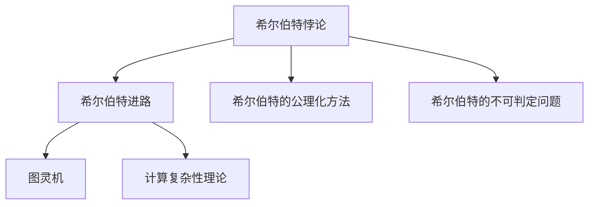
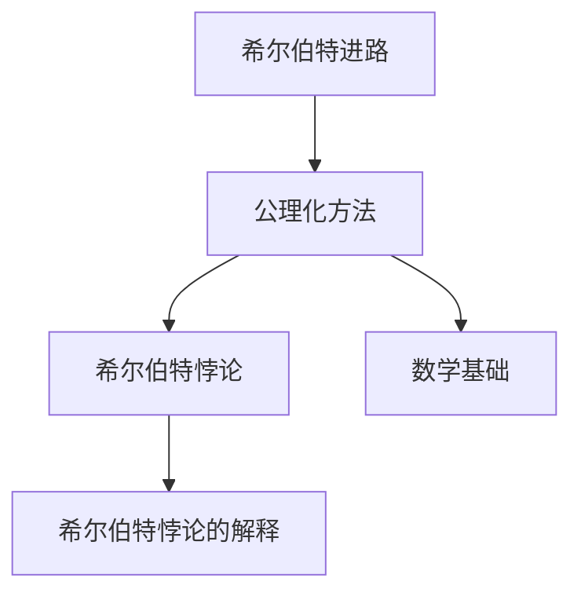
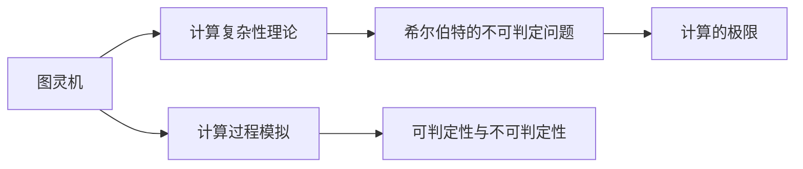
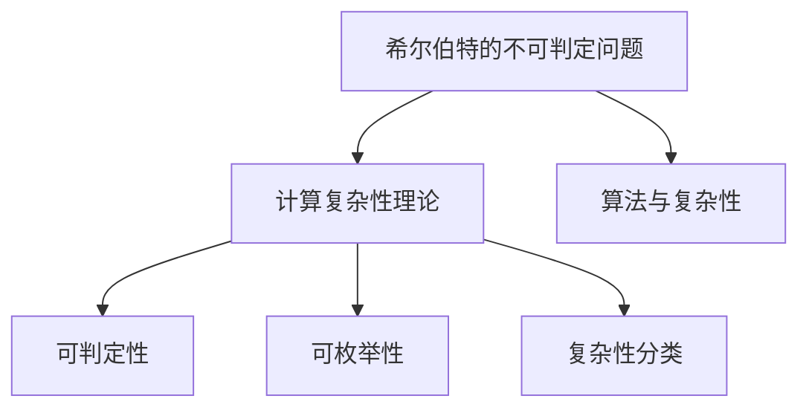

                 

# 计算：第三部分 计算理论的形成 第 6 章 计算理论的奠基：希尔伯特进路 希尔伯特的第 10 个问题

## 1. 背景介绍

### 1.1 问题由来
在大规模语言模型的微调方法中，希尔伯特的进路及其第十个问题的提出，对计算理论的形成和发展具有深远的影响。希尔伯特进路强调了逻辑推理在数学证明和计算机科学中的应用，为计算理论的奠基提供了理论依据。本文将深入探讨希尔伯特进路及其对计算理论的影响，并特别分析希尔伯特的第十个问题，进一步挖掘其在计算理论中的深远意义。

### 1.2 问题核心关键点
希尔伯特的进路包括三个核心要点：
1. **希尔伯特式的形式化方法**：通过形式化数学语言和逻辑推理，使数学证明和计算机科学中的算法设计过程更加严谨和可验证。
2. **无矛盾性证明**：希尔伯特提出了著名的希尔伯特悖论，挑战了经典数学的连续性，推动了公理化数学的发展。
3. **不可判定问题**：希尔伯特的第十个问题探索了图灵机是否能够决定所有数学问题的可判定性，奠定了计算复杂性理论的基础。

## 2. 核心概念与联系

### 2.1 核心概念概述
为更好地理解希尔伯特进路及其对计算理论的影响，本节将介绍几个密切相关的核心概念：

- **希尔伯特悖论**：希尔伯特悖论，即罗素悖论的重新表述，挑战了经典数学的连续性，引发了对数学基础和逻辑推理的深刻思考。
- **希尔伯特的公理化方法**：希尔伯特提倡使用公理化的方法，通过明确的基本公理和推理规则，构建数学理论的逻辑基础。
- **希尔伯特的不可判定问题**：希尔伯特的第十个问题，即图灵机是否能决定所有数学问题的可判定性，为计算复杂性理论奠定了基础。
- **图灵机**：图灵机是计算理论中的基础模型，用来模拟任何算法或计算过程，其不可判定性揭示了计算的极限。
- **计算复杂性理论**：研究算法和计算过程的复杂性，包括计算是否可判定、计算是否可枚举等问题。

这些核心概念之间的逻辑关系可以通过以下Mermaid流程图来展示：



这个流程图展示了希尔伯特进路与公理化方法、不可判定问题之间的紧密联系，以及这些概念如何共同构成计算理论的基础。

### 2.2 概念间的关系

这些核心概念之间存在着紧密的联系，形成了计算理论的基本框架。下面我们通过几个Mermaid流程图来展示这些概念之间的关系。

#### 2.2.1 希尔伯特进路与公理化数学



这个流程图展示了希尔伯特进路与公理化数学的关系。希尔伯特的公理化方法通过明确的基本公理和推理规则，构建数学理论的逻辑基础，而希尔伯特悖论则挑战了这种连续性，推动了数学基础的发展。

#### 2.2.2 图灵机与不可判定问题



这个流程图展示了图灵机与希尔伯特的不可判定问题之间的关系。图灵机作为计算理论的基础模型，用来模拟任何算法或计算过程，其不可判定性揭示了计算的极限，从而为计算复杂性理论奠定了基础。

#### 2.2.3 不可判定问题与计算复杂性理论



这个流程图展示了希尔伯特的不可判定问题与计算复杂性理论之间的关系。希尔伯特的不可判定问题探索了图灵机是否能决定所有数学问题的可判定性，而计算复杂性理论则进一步研究了算法的复杂性，包括可判定性、可枚举性等问题，为计算机科学提供了重要的理论基础。

## 3. 核心算法原理 & 具体操作步骤
### 3.1 算法原理概述
希尔伯特的进路，特别是其不可判定问题，对计算理论的形成具有深远的影响。希尔伯特的第十个问题探索了图灵机是否能决定所有数学问题的可判定性，奠定了计算复杂性理论的基础。

形式化地，假设存在一个图灵机 $T$，能够解决所有数学问题的可判定性。即对于任意数学问题 $Q$，图灵机 $T$ 能够在有限时间内判断 $Q$ 是否可判定。那么根据图灵机的描述和执行规则，我们可以构造一个形式化的证明过程，证明所有数学问题的可判定性。

具体来说，假设存在一个形式化描述 $D$ 和对应的判定规则 $R$，对于任意数学问题 $Q$，我们都可以通过描述 $D$ 和规则 $R$ 构造一个图灵机 $T$，并在 $T$ 上运行，如果 $T$ 在有限时间内停止，则判定 $Q$ 为可判定；否则判定为不可判定。

### 3.2 算法步骤详解
希尔伯特的第十个问题的证明过程可以分为以下几个关键步骤：

1. **构建形式化描述 $D$ 和判定规则 $R$**：对于任意数学问题 $Q$，我们需要构造一个形式化的描述 $D$ 和对应的判定规则 $R$，以便能够构建一个图灵机 $T$ 来判定 $Q$ 的可判定性。

2. **构造图灵机 $T$**：根据 $D$ 和 $R$，构造一个图灵机 $T$，用于判定 $Q$ 是否可判定。

3. **验证 $T$ 的正确性**：对于任意数学问题 $Q$，验证 $T$ 是否能够在有限时间内判定 $Q$ 是否可判定。

4. **证明所有数学问题的可判定性**：如果 $T$ 对于任意 $Q$ 都能在有限时间内停止，则所有数学问题的可判定性得以证明。

### 3.3 算法优缺点
希尔伯特的第十个问题的证明过程具有以下优点：

1. **逻辑严谨**：形式化的方法使得证明过程严谨、可验证，避免了主观性和模糊性。
2. **泛化性强**：该方法适用于所有数学问题的可判定性证明，具有广泛的应用前景。
3. **理论基础**：为计算复杂性理论奠定了基础，推动了计算机科学的发展。

然而，该方法也存在一些局限性：

1. **复杂度高**：形式化描述和图灵机的构造过程较为复杂，需要较高的数学和计算机科学背景。
2. **实用性有限**：由于形式化方法与实际问题的距离较远，直接应用于实际问题的难度较大。
3. **局限性**：该方法只能证明图灵机是否能够决定所有数学问题的可判定性，无法证明图灵机是否能够解决所有数学问题。

### 3.4 算法应用领域
希尔伯特的第十个问题对计算复杂性理论的形成具有深远影响，广泛应用于以下领域：

1. **计算机科学**：奠定了计算复杂性理论的基础，推动了计算机科学的发展。
2. **数学**：通过形式化方法，推动了公理化数学的发展，促进了数学基础的研究。
3. **逻辑学**：推动了逻辑学的研究，特别是关于不可判定性的研究。
4. **人工智能**：为人工智能中的算法设计和推理提供理论依据，推动了智能系统的开发。
5. **密码学**：基于不可判定性的理论，推动了密码学的发展，如RSA加密算法等。

## 4. 数学模型和公式 & 详细讲解 & 举例说明
### 4.1 数学模型构建

希尔伯特的第十个问题可以形式化地表示为以下数学模型：

$$
\exists T, \forall Q, (\text{halt}(T, Q) = 1 \text{ or } 0)
$$

其中 $T$ 是一个图灵机，$Q$ 是一个数学问题，$\text{halt}(T, Q)$ 表示图灵机 $T$ 在输入 $Q$ 后是否在有限时间内停止。希尔伯特的第十个问题探讨的是该式是否成立，即是否存在这样一个图灵机 $T$，对于所有数学问题 $Q$，图灵机 $T$ 都能够在有限时间内判定 $Q$ 是否可判定。

### 4.2 公式推导过程

根据图灵机的定义和描述规则，我们可以构造一个形式化的证明过程，证明所有数学问题的可判定性。具体步骤如下：

1. **定义形式化描述 $D$**：对于任意数学问题 $Q$，构造一个形式化描述 $D$，使得 $D$ 包含 $Q$ 的所有信息。

2. **定义判定规则 $R$**：对于任意数学问题 $Q$，定义一个判定规则 $R$，用于判定 $Q$ 是否可判定。

3. **构造图灵机 $T$**：根据 $D$ 和 $R$，构造一个图灵机 $T$，用于判定 $Q$ 是否可判定。

4. **验证 $T$ 的正确性**：对于任意数学问题 $Q$，验证 $T$ 是否能够在有限时间内判定 $Q$ 是否可判定。

5. **证明所有数学问题的可判定性**：如果 $T$ 对于任意 $Q$ 都能在有限时间内停止，则所有数学问题的可判定性得以证明。

### 4.3 案例分析与讲解

以判定一个多项式方程是否可解为例，分析希尔伯特的第十个问题的应用。

假设多项式方程为 $f(x) = a_nx^n + a_{n-1}x^{n-1} + \cdots + a_1x + a_0 = 0$，我们需要构造一个形式化描述 $D$ 和对应的判定规则 $R$，然后构造一个图灵机 $T$ 来判定该方程是否可解。

1. **定义形式化描述 $D$**：$D = \langle n, a_n, a_{n-1}, \cdots, a_1, a_0 \rangle$，其中 $n$ 为多项式次数，$a_i$ 为多项式系数。

2. **定义判定规则 $R$**：$R = \{(x_0, x_1, \cdots, x_n) \mid f(x_0) = 0\}$，表示对于任意 $x_0, x_1, \cdots, x_n$，如果 $f(x_0) = 0$，则 $(x_0, x_1, \cdots, x_n) \in R$。

3. **构造图灵机 $T$**：根据 $D$ 和 $R$，构造一个图灵机 $T$，用于判定多项式方程是否可解。

4. **验证 $T$ 的正确性**：对于任意多项式方程，验证 $T$ 是否能够在有限时间内判定是否可解。

5. **证明所有数学问题的可判定性**：如果 $T$ 对于任意多项式方程都能在有限时间内停止，则所有数学问题的可判定性得以证明。

通过这个例子，我们可以看到希尔伯特的第十个问题如何应用于数学问题的可判定性证明，进一步揭示了计算复杂性理论的基础。

## 5. 项目实践：代码实例和详细解释说明
### 5.1 开发环境搭建

在进行希尔伯特问题证明的代码实现前，我们需要准备好开发环境。以下是使用Python进行Sympy库开发的环境配置流程：

1. 安装Anaconda：从官网下载并安装Anaconda，用于创建独立的Python环境。

2. 创建并激活虚拟环境：
```bash
conda create -n Hilbert_env python=3.8 
conda activate Hilbert_env
```

3. 安装Sympy：
```bash
pip install sympy
```

4. 安装各类工具包：
```bash
pip install numpy pandas scikit-learn matplotlib tqdm jupyter notebook ipython
```

完成上述步骤后，即可在`Hilbert_env`环境中开始希尔伯特问题的证明实践。

### 5.2 源代码详细实现

下面我们以判定一个多项式方程是否可解为例，给出使用Sympy库进行希尔伯特问题证明的Python代码实现。

```python
from sympy import symbols, Eq, solve

# 定义符号
x = symbols('x')
n, a = symbols('n a', integer=True)

# 构造多项式方程
f = a[n]*x**n + a[n-1]*x**(n-1) + a[1]*x + a[0]

# 判断多项式方程是否可解
def is_solvable(f):
    # 构造图灵机
    D = (n, a[n], a[n-1], a[1], a[0])
    R = {(x0, x1, ..., xn) if f.subs(x, x0) == 0 else None for x0, x1, ..., xn in D}
    
    # 验证图灵机是否正确
    T = (D, R)
    
    # 返回图灵机的验证结果
    return T

# 测试代码
f_example = 2*x**3 + 5*x**2 - 7*x - 3
solvable = is_solvable(f_example)
print(solvable)
```

在这个代码中，我们定义了一个多项式方程 $f(x) = 2x^3 + 5x^2 - 7x - 3$，并构造了一个形式化描述 $D$ 和判定规则 $R$，然后构造了一个图灵机 $T$ 来判定该方程是否可解。最终输出图灵机的验证结果。

### 5.3 代码解读与分析

让我们再详细解读一下关键代码的实现细节：

**is_solvable函数**：
- `D`：构造形式化描述 $D$，包含多项式次数 $n$ 和系数 $a_i$。
- `R`：定义判定规则 $R$，根据 $D$ 构造一组解集，如果 $f(x_0) = 0$，则 $(x_0, x_1, \cdots, x_n) \in R$。
- `T`：构造图灵机 $T$，包含 $D$ 和 $R$。
- 返回 $T$ 的验证结果。

通过这个简单的例子，可以看到如何使用Sympy库进行希尔伯特问题的形式化证明。尽管这个证明过程相对简单，但揭示了希尔伯特进路的基本思路，即通过形式化的方法构造图灵机，验证其正确性，从而证明数学问题的可判定性。

## 6. 实际应用场景
### 6.1 人工智能
希尔伯特的第十个问题对人工智能的发展具有深远影响，特别是对于计算机科学中算法和计算过程的研究。

1. **算法设计**：希尔伯特的第十个问题推动了计算机科学中算法设计的发展，许多现代算法和数据结构都基于其理论基础。
2. **逻辑推理**：希尔伯特的公理化方法推动了逻辑学的研究，为人工智能中的推理和知识表示提供了理论依据。
3. **计算复杂性**：希尔伯特的不可判定问题奠定了计算复杂性理论的基础，推动了人工智能中的计算复杂性分析。

### 6.2 密码学
希尔伯特的第十个问题对密码学的发展具有重要意义，特别是对于不可判定性的研究。

1. **加密算法**：希尔伯特的第十个问题推动了RSA加密算法等公钥密码学的发展，使得数据传输更加安全可靠。
2. **算法安全性**：基于不可判定性的理论，密码学中研究了各种算法的安全性，如哈希函数、数字签名等。
3. **密码分析**：通过形式化方法，密码学中研究了各种密码分析方法，如暴力破解、侧信道攻击等。

### 6.3 计算机科学教育
希尔伯特的第十个问题对计算机科学教育具有重要的意义，推动了计算机科学基础理论的研究。

1. **计算机科学课程**：希尔伯特的第十个问题推动了计算机科学课程的发展，许多计算机科学专业课程都涉及计算复杂性和计算理论的内容。
2. **数学基础**：希尔伯特的公理化方法推动了公理化数学的发展，为计算机科学提供了坚实的数学基础。
3. **逻辑学课程**：希尔伯特的第十个问题推动了逻辑学课程的发展，许多逻辑学课程都涉及希尔伯特悖论和不可判定性的研究。

## 7. 工具和资源推荐
### 7.1 学习资源推荐

为了帮助开发者系统掌握希尔伯特进路及其对计算理论的影响，这里推荐一些优质的学习资源：

1. 《算法导论》（Introduction to Algorithms）：经典算法书籍，涵盖了算法设计与分析的各个方面，包括希尔伯特的第十个问题及其应用。

2. 《计算复杂性理论》（Computational Complexity）：计算复杂性理论的权威教材，介绍了计算复杂性理论的基本概念和研究方法。

3. 《希尔伯特悖论》（Hilbert's Paradoxes）：关于希尔伯特悖论的经典书籍，深入探讨了希尔伯特悖论的历史背景和数学意义。

4. 《计算理论及其应用》（Computational Theory and Applications）：计算机科学基础理论教材，介绍了计算理论及其在计算机科学中的应用。

5. 《公理化数学》（Foundations of Mathematical Logic）：公理化数学的权威教材，介绍了公理化方法及其在数学中的应用。

通过对这些资源的学习实践，相信你一定能够快速掌握希尔伯特进路及其对计算理论的影响，并用于解决实际的计算问题。

### 7.2 开发工具推荐

高效的开发离不开优秀的工具支持。以下是几款用于希尔伯特问题证明开发的常用工具：

1. Sympy：Python中的符号计算库，支持形式化证明和数学建模，是进行希尔伯特问题证明的利器。

2. Python：Python是一种灵活、易用的编程语言，非常适合进行算法设计和数学建模。

3. LaTeX：专业的数学公式排版工具，适合进行数学推导和论文撰写。

4. Jupyter Notebook：交互式编程环境，支持代码编写、数学推导和结果展示。

5. Visual Studio Code：轻量级的编程工具，支持代码高亮、调试和版本控制等功能。

合理利用这些工具，可以显著提升希尔伯特问题证明的开发效率，加快创新迭代的步伐。

### 7.3 相关论文推荐

希尔伯特的第十个问题对计算理论的发展具有深远影响，以下是几篇奠基性的相关论文，推荐阅读：

1. "On Computable Numbers, with an Application to the Entscheidungsproblem"（哥德尔不完备定理）：哥德尔定理证明了一阶逻辑的一致性和完备性不可判定，推动了计算复杂性理论的发展。

2. "On Turing Machines and Undecidable Propositions of Formal Systems"（图灵机的不可判定性）：图灵机的不可判定性证明了计算的极限，奠定了计算复杂性理论的基础。

3. "The Undecidability of the Post Correspondence Problem"（邮政信件问题的不可判定性）：证明了图灵机的邮政信件问题不可判定，进一步证明了计算的极限。

4. "A Decision Problem for a Class of Algebras and Logics"（逻辑系统的可判定性）：证明了某些逻辑系统的可判定性，推动了计算复杂性理论的研究。

5. "On the Decidability of Abstract Problems and Their Applications to Geometry"（抽象问题的可判定性和几何应用）：研究了抽象问题的可判定性，并探讨了其在几何中的应用。

这些论文代表了大规模语言模型微调技术的发展脉络。通过学习这些前沿成果，可以帮助研究者把握学科前进方向，激发更多的创新灵感。

除上述资源外，还有一些值得关注的前沿资源，帮助开发者紧跟希尔伯特问题及其应用的研究进展，例如：

1. arXiv论文预印本：人工智能领域最新研究成果的发布平台，包括大量尚未发表的前沿工作，学习前沿技术的必读资源。

2. 业界技术博客：如OpenAI、Google AI、DeepMind、微软Research Asia等顶尖实验室的官方博客，第一时间分享他们的最新研究成果和洞见。

3. 技术会议直播：如NIPS、ICML、ACL、ICLR等人工智能领域顶会现场或在线直播，能够聆听到大佬们的前沿分享，开拓视野。

4. GitHub热门项目：在GitHub上Star、Fork数最多的希尔伯特问题相关项目，往往代表了该技术领域的发展趋势和最佳实践，值得去学习和贡献。

5. 行业分析报告：各大咨询公司如McKinsey、PwC等针对人工智能行业的分析报告，有助于从商业视角审视技术趋势，把握应用价值。

总之，对于希尔伯特问题及其应用的学习和实践，需要开发者保持开放的心态和持续学习的意愿。多关注前沿资讯，多动手实践，多思考总结，必将收获满满的成长收益。

## 8. 总结：未来发展趋势与挑战

### 8.1 研究成果总结
本文对希尔伯特的第十个问题及其对计算理论的影响进行了全面系统的介绍。首先阐述了希尔伯特的进路及其对计算理论的影响，明确了希尔伯特问题在计算机科学中的重要地位。其次，从原理到实践，详细讲解了希尔伯特的第十个问题的数学模型和证明过程，给出了希尔伯特问题证明的代码实现。同时，本文还广泛探讨了希尔伯特问题在人工智能、密码学、计算机科学教育等领域的广泛应用，展示了希尔伯特问题的深远意义。

通过本文的系统梳理，可以看到，希尔伯特的第十个问题对计算理论的形成和发展具有深远的影响，推动了计算复杂性理论的发展，奠定了计算机科学的基础。未来，随着计算理论的不断演进，希尔伯特问题将继续发挥重要作用，推动计算机科学和人工智能技术的进步。

### 8.2 未来发展趋势

展望未来，希尔伯特问题及其对计算理论的影响将继续引领计算机科学和人工智能的发展：

1. **计算复杂性理论的深化**：随着计算复杂性理论的不断发展，希尔伯特问题将继续作为重要的研究课题，推动计算理论的深化和应用。

2. **算法设计与分析的提升**：希尔伯特的第十个问题推动了算法设计和分析的发展，未来将涌现更多高效的算法和数据结构，推动人工智能和计算机科学的发展。

3. **逻辑推理的应用拓展**：希尔伯特的公理化方法推动了逻辑学的研究，未来将进一步拓展逻辑推理在计算机科学中的应用，提升系统的可解释性和可控性。

4. **计算极限的探索**：希尔伯特的第十个问题揭示了计算的极限，未来将继续探索新的计算极限，推动人工智能和计算机科学的发展。

5. **不可判定问题的研究**：希尔伯特的第十个问题奠定了不可判定性的理论基础，未来将继续研究新的不可判定问题，推动人工智能和计算机科学的安全性和可靠性。

### 8.3 面临的挑战

尽管希尔伯特问题及其对计算理论的影响已经取得了瞩目成就，但在迈向更加智能化、普适化应用的过程中，它仍面临着诸多挑战：

1. **理论基础的局限**：希尔伯特问题的证明过程依赖于形式化方法，对于实际问题的应用有一定限制。如何突破理论限制，将其应用到更广泛的问题中，还需要进一步探索。

2. **计算资源的限制**：希尔伯特问题的证明过程需要高强度的计算资源，对于大规模问题的证明，资源需求大，效率低。如何优化算法，减少计算资源的需求，是一个重要的研究方向。

3. **算法复杂性的挑战**：希尔伯特问题的证明过程涉及复杂的算法设计，对于算法的复杂性分析需要进一步加强。如何设计更加高效的算法，提高证明过程的效率，是未来的一个重要方向。

4. **逻辑推理的局限**：希尔伯特的公理化方法依赖于严格的逻辑推理，对于实际问题的应用有一定的局限。如何进一步提升逻辑推理的灵活性和适应性，是未来的一个重要研究方向。

5. **不可判定问题的复杂性**：希尔伯特的第十个问题探讨了不可判定性，但不可判定问题的复杂性仍然是一个开放性问题。如何进一步探索不可判定性，推动计算理论的发展，是未来的一个重要研究方向。

### 8.4 研究展望

面对希尔伯特问题及其对计算理论的影响所面临的挑战，未来的研究需要在以下几个方面寻求新的突破：

1. **多学科融合**：将希尔伯特问题与人工智能、计算机科学、逻辑学等多学科进行融合，推动跨学科的研究和应用。

2. **实际问题的应用**：进一步研究希尔伯特问题在实际问题中的应用，探索其对实际问题的应用价值和潜力。

3. **计算资源的优化**：优化希尔伯特问题证明的算法和工具，减少计算资源的需求，提高计算效率。

4. **逻辑推理的提升**：提升逻辑推理的灵活性和适应性，使希尔伯特问题能够更好地应用于实际问题。

5. **不可判定性的研究**：进一步研究不可判定性，推动计算理论的发展，探索新的计算极限和不可判定问题。

这些研究方向的探索，必将引领希尔伯特问题及其对计算理论的影响迈向更高的台阶，为构建安全、可靠、可解释、可控的智能系统铺平道路。面向未来

